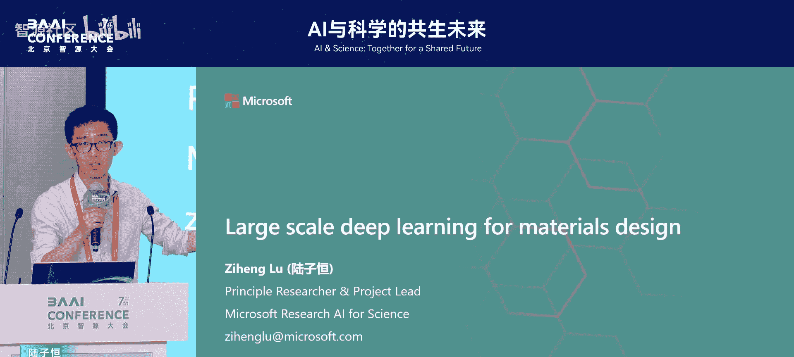
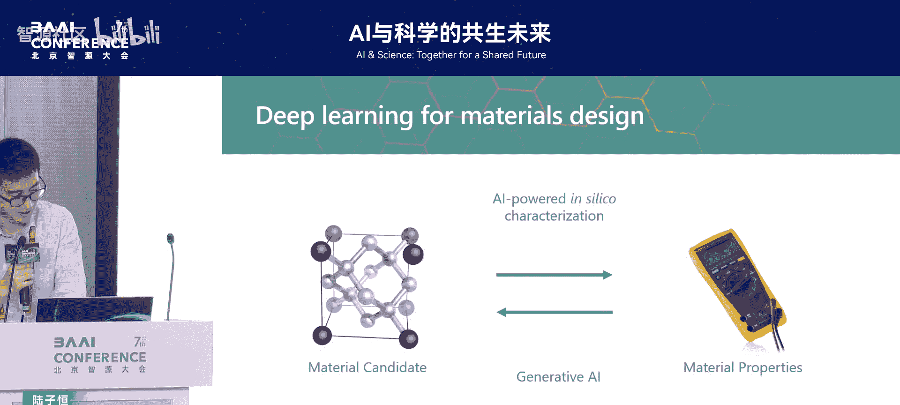
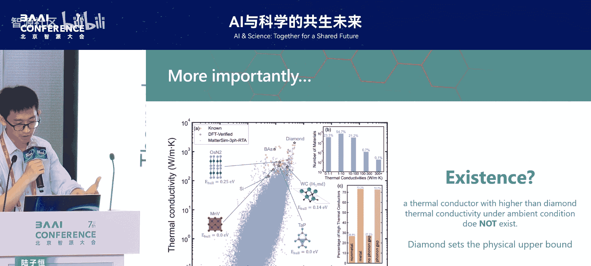
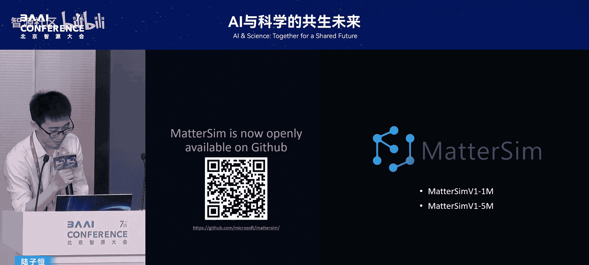
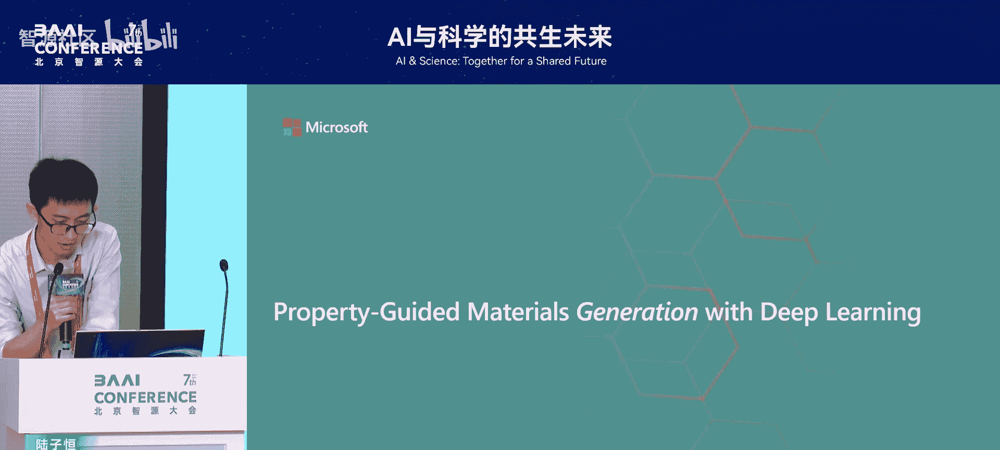
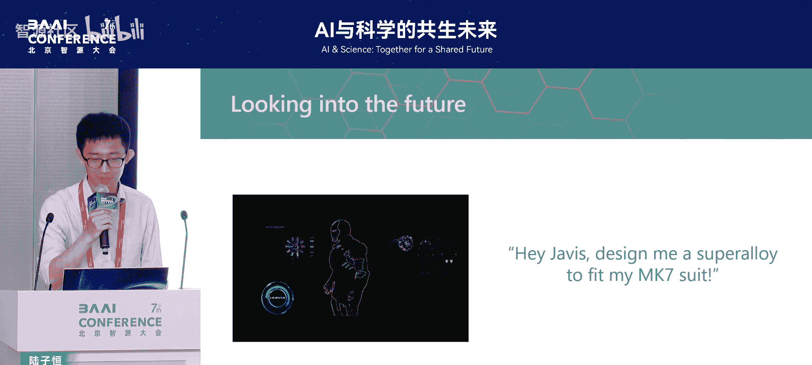

# AI与科学的共生未来-p08-大规模深度学习加速材料设计：陆子恒

在本节课中，我们将学习如何利用大规模深度学习技术，从根本上加速新材料的发现与设计过程。我们将探讨两个核心方向：正向的快速性质预测与逆向的按需材料生成，并了解它们如何共同应对材料科学中“大海捞针”式的搜索难题。

## 材料设计的核心挑战

上一节我们介绍了课程背景，本节中我们来看看材料设计面临的根本性困难。

材料设计，即快速、准确、高效地设计新材料，一直是材料科学工作者的理想。回顾历史，人类文明的许多阶段是以材料命名的，这说明了任何一款真正的新材料，往往能带来整个市场的变革，甚至是人类社会的变革。

在材料设计领域，我们通常需要回答两类关键问题。

以下是第一类典型问题：
*   **性能优化问题**：在给定的器件、任务需求、场景和性质需求下，如何找到一个性能“更高、更快、更强”的材料？例如，能否找到比现有所有材料都更好的散热材料，让芯片散热更快？
*   **存在性问题**：某种具有理想性能的材料是否真的存在？例如，是否存在比金刚石导热性更高的材料？或者，是否存在常温常压下的超导材料？

寻找新材料的传统过程极其昂贵且耗时，通常需要数十年和数亿甚至数十亿美元的投入。这主要源于两大难点。

以下是导致材料设计困难的两个主要原因：
1.  **巨大的组合空间**：材料设计本质上是从元素周期表中选取元素进行组合。118种元素构成了近乎无限的组合可能，构成了一个维度极高的搜索空间。
2.  **复杂的实验自由度**：在实验室合成材料时，还需要控制温度、时间、压力等诸多实验参数，这进一步增加了探索的维度，使得整个研发过程非常缓慢和痛苦。

其中，**存在性问题**比性能优化问题更加尖锐和困难。由于材料空间过于庞大（估计在10^22到10^120种组合），这个问题在过去基本无解。

## AI驱动的解决方案：两个核心方向

面对上述挑战，机器学习，特别是深度学习，因其擅长处理组合爆炸问题而成为潜在的解决方案。在一个理想的研究范式中，AI可以从两个方向加速材料设计。

以下是AI赋能材料设计的两个核心思路：
1.  **正向预测（Forward Prediction）**：给定一个材料的原子结构，利用AI快速、准确地预测其性质。这相当于用计算模拟部分替代缓慢的实验验证，能将设计流程加速成百上千倍。其核心公式可概括为：`AI_Model(Atomic_Structure) -> Material_Properties`。
2.  **逆向生成（Inverse Design）**：给定目标性质（如“高导热”、“超导”），让AI直接生成可能具备该性质的新材料结构。这属于生成式AI（Generative AI）的范畴，旨在指哪打哪，主动提出新的材料设想。

## 方向一：正向预测——用AI模拟器加速性质计算

上一节我们概述了AI的两个作用方向，本节中我们深入探讨第一个方向：构建AI模拟器来加速材料性质预测。

其基本思想是：如果我们能快速获得材料体系的基本物理量（如能量、原子受力、应力等），那么根据统计物理原理，原则上就能推算出其宏观性质。传统上，精确计算这些基本物理量需要求解昂贵的薛定谔方程，且为获得宏观性质需要进行大量的系综平均，计算成本高到无法接受。

深度学习的介入改变了这一局面。我们的目标是：**给定一个原子结构，让机器学习模型绕过薛定谔方程，直接推断这些基础物理量**。只要模型足够快、足够准，结合统计物理，就能预测宏观性质。这听起来像一个标准的监督学习问题：`给定结构，预测性质`。

然而，真正的难点在于数据。我们需要的不是某个单一体系的数据，而是**覆盖整个元素周期表、所有可能组合、在任意温度和压力下的反应数据**。这再次遇到了组合爆炸的问题。

为了解决数据难题，我们采用了主动学习（Active Learning）策略。

以下是主动学习策略的关键步骤：
1.  首先训练一个基础模型。
2.  让模型在材料空间中探索，并自行判断哪些新数据对提升模型性能最关键。
3.  仅对这些关键数据进行昂贵的量子力学计算来生成标签。
4.  用新数据迭代训练模型。

通过这种方法，我们仅用原来1%左右的数据量，就相对完整地采样了整个材料空间。最终，我们收集了约1700万个数据点，并使用专门设计的模型架构进行训练，得到了一个名为 **MACE** 的深度学习原子间势能模型。

该模型能够捕捉在人类可见的未来所能控制的所有温度、压力范围内，任意元素组合材料的相互作用。其核心功能是：`给定原子结构，预测能量、原子受力、应力等基本物理量`。基于这些准确的预测，我们可以将许多重要的材料表征实验“搬”到计算机上进行，例如预测新材料的稳定性、机械性能、输运性质和自由能等。

## 案例研究：探索导热材料的极限

有了强大的AI模拟器，我们能否解决一些长期存在的关键问题呢？我们选择了一个具有重大科学和产业意义的问题：**导热材料**。

金刚石是已知块体材料中导热率最高的，自1900年被发现后，再未发现导热率超过它的材料。这引出了两个根本问题：1）能否找到更适合芯片散热的新材料？2）金刚石是否就是导热率的上限？我们还需要投入巨大资源去寻找可能不存在的材料吗？

利用我们的AI模拟器，我们极大地加速了晶格振动（声子）散射的计算，速度提升了成千上万倍。更重要的是，模型的精度与实验误差相当（约±40 W/m·K，而金刚石导热率约2000 W/m·K），这使得大规模可靠计算成为可能。

随后，我们进行了一项非常“暴力”的计算：**对元素周期表中所有可能的二元、三元等晶体结构（满足基本物理约束）进行了穷举式搜索**。我们并非搜索现有数据库，而是搜索了整个材料能量空间中的所有可能局部极小点。

经过筛选，我们对23万种可能稳定存在的晶体进行了热导率计算。结果显示，导热率高于硅（约100 W/m·K）的材料仅占1%，这解释了为何新材料如此难寻。我们从中发现了一系列有前景的高导热新材料（最高约800-900 W/m·K），但**均未超过金刚石**。

更重要的是，我们发现了一类全新的材料，其热传输同时通过电子和声子两种玻色子进行，这是一种此前未被充分描述的新物理机制，可能对芯片界面散热产生根本性影响。

基于这次近乎穷举的搜索，我们可以给出一个较强的推论：**在常温常压下，金刚石很可能设定了无机晶体材料热导率的上限**。这项工作展示了AI在探索并尝试回答材料科学中“存在性”这一根本问题上的潜力。

## 方向二：逆向生成——按需设计新材料

上一节我们展示了正向预测的强大能力，但对于组合空间更为复杂的材料（如固态电解质、有机分子等），穷举法将完全失效。本节中我们来看看第二个方向：逆向生成。

此时，我们需要更智能的方法来遍历材料空间，即 **“性质引导的材料生成”**。其核心思想是：`给定目标性质，生成具备该性质的候选材料结构`。这类似于图像生成中“生成一个戴眼镜的卡通头像”的任务。

早期，我们在碳同素异形体这一体系上进行了概念验证。我们训练了一个生成模型，在给定“零带隙”或“2电子伏特带隙”等条件时，模型能分别生成出石墨/石墨烯和金刚石，甚至能生成出具有特定带隙、但我们事先未知其结构的新碳材料。这证明了逆向设计原则上是可行的。

当前的工作是将这一思路拓展到整个材料空间。我们将已知的稳定材料结构及其原子类型输入到一个生成式框架中。训练后的模型不仅能生成看似合理的稳定材料，还能通过条件控制实现按需生成。

以下是条件生成的一些示例：
*   **控制化学组成**：生成仅包含特定元素（如iPhone手机中使用的元素）的材料。
*   **控制目标性质**：生成不含昂贵稀土元素的强磁性材料。

这意味着，材料的生成式设计能帮助人类探索那些可能被忽略或难以通过直觉发现的材料区域。

更进一步，我们尝试将人类自然语言与科学实体的“语言”（如材料、蛋白质的结构分布特征）相结合。构建能够同时理解人类指令和科学实体性质的模型，有望实现人与AI在材料设计上的自然交互。例如，未来科学家或许可以直接对AI说：“设计一种用于下一代宇航服的超级隔热材料。”

## 总结与展望

本节课中，我们一起学习了如何利用大规模深度学习加速材料设计。

我们首先分析了材料设计面临的两大核心挑战：**性能优化问题**和**存在性问题**，以及其根源——巨大的组合空间和复杂的实验参数。

接着，我们探讨了AI驱动的两个解决方案：
1.  **正向预测**：通过构建**AI模拟器（如MACE模型）**，快速预测材料性质，将实验计算化，极大加速筛选过程。公式表示为：`AI_Model(Structure) -> Fundamental Properties -> Macroscopic Properties`。
2.  **逆向生成**：通过**生成式AI模型**，根据目标性质直接创建设计新材料。其范式为：`Condition(Desired Property) -> Generative_Model -> Candidate Material Structures`。

通过“探索导热材料极限”的案例，我们看到了大规模AI模拟如何帮助我们在近乎穷举的搜索后，发现新材料并尝试回答深层的存在性问题。而逆向生成则为我们探索更广阔、更复杂的材料空间提供了指哪打哪的智能工具。

展望未来，结合自动化实验室，我们正迈向一个用AI对话驱动材料发现的新时代。我们期待在不久的将来，能看到由这种范式催生的明星材料从实验室走向产业化，真正改变世界。材料科学，正处在一个激动人心的变革前夜。