# AI与科学的共生未来-p09-Uni-3DAR：基于自回归建模的统一跨尺度-3D-生成于理解：么琳

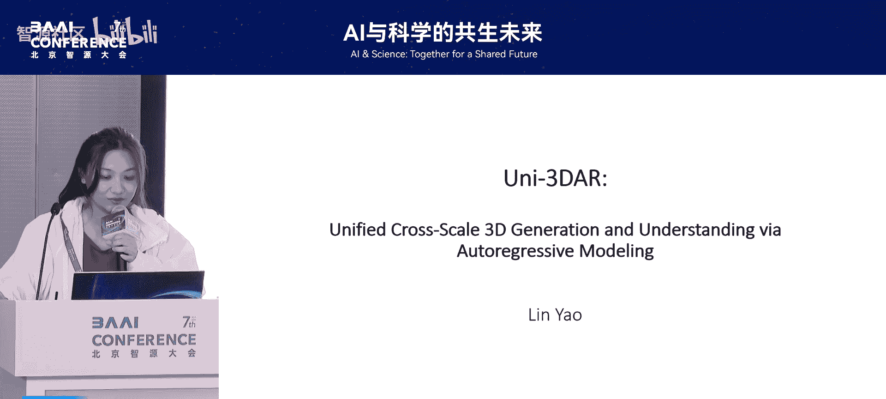

在本节课中，我们将要学习一个名为 Uni-3DAR 的模型。这是一个利用自回归建模技术，旨在统一处理跨尺度 3D 数据理解与生成任务的通用模型。

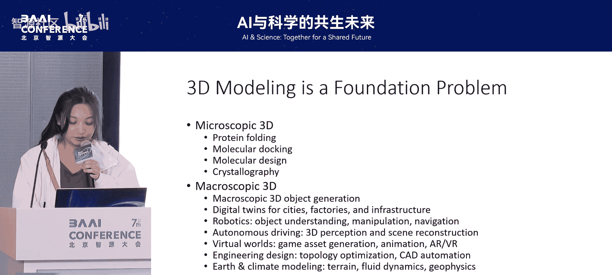

3D 建模是一个基础且应用广泛的任务。在微观层面，它涉及蛋白质折叠、分子对接与设计、晶体研究等。在宏观层面，它支撑着 3D 基础建模、数字孪生、机器人、自动驾驶和虚拟世界等工程应用。

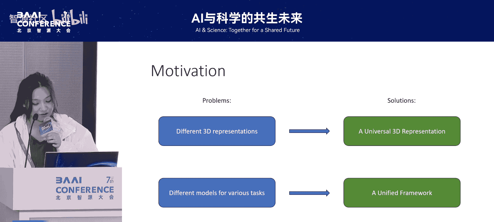

然而，传统方法存在挑战。不同领域通常使用独特的 3D 数据表示形式，并需要专门的模型来适配不同的任务。我们的核心动机是，希望无论对于宏观还是微观尺度，无论使用何种数据表征，都能用统一的框架和模型来完成多种任务。

---

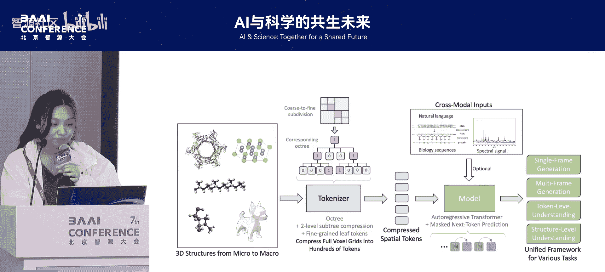

# Uni-3DAR：02：3D 表征的挑战与现有方案 🔍

上一节我们介绍了 3D 建模的广泛应用和统一模型的动机，本节中我们来看看实现统一 3D 建模面临的具体挑战。

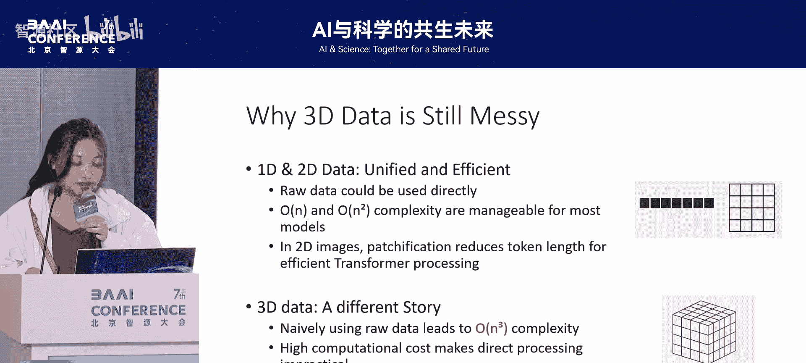

对于一维或二维数据，深度学习模型可以直接将其作为输入进行处理。一维数据的复杂度是 `O(N)`，二维数据（如图像）的复杂度是 `O(N^2)`。即使对于 1024x1024 的高清图像，我们也可以通过分块（patch）等方法将其压缩成较小的数据量，便于模型处理。

但对于 3D 数据，情况变得复杂。如果将一个 3D 物体视为边长为 N 的立方体，其复杂度高达 `O(N^3)`。如果未经处理直接输入模型，计算量将非常巨大。

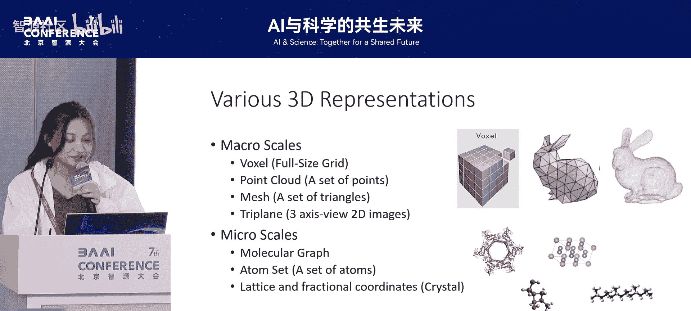

前人已经提出了一些方案来避免以三次方复杂度处理 3D 数据。以下是几种常见的 3D 数据表征方式：

*   **点云**：将 3D 模型表示为空间中的一系列点，点的数量远小于体素数量，是一种高效的输入方式。
*   **原子节点**：在微观层面（如分子、晶体），通常以原子作为节点进行输入，忽略空的空间，同样非常高效。

---

# Uni-3DAR：03：自回归建模的难点与我们的方案 💡

上一节我们了解了现有的 3D 表征方法，本节我们来探讨将这些表征用于自回归生成时遇到的困难。

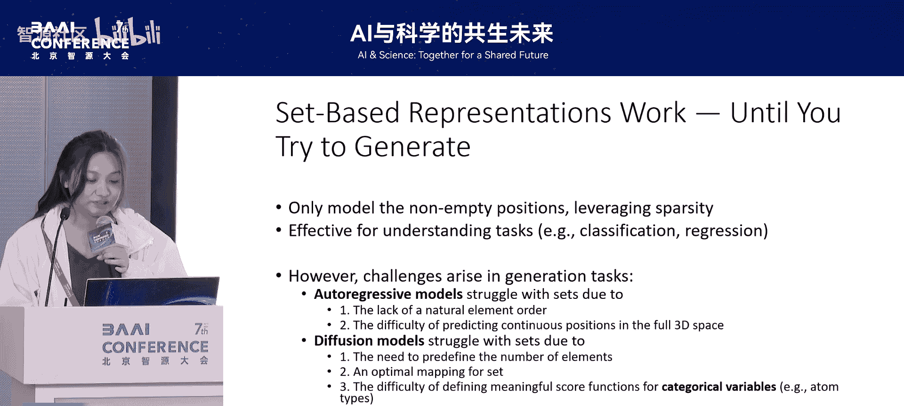

点云或原子节点这类稀疏性表征，计算速度快，非常适合分类、回归等理解性任务。但当我们需要进行生成性任务时，这类表征带来了挑战。

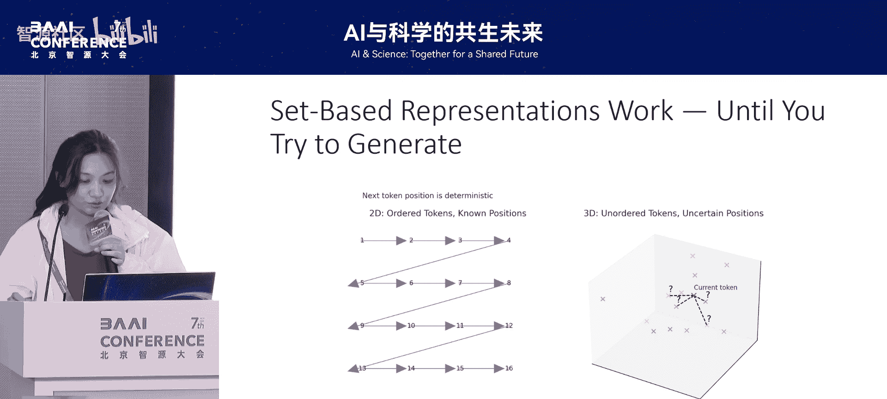

如果我们想用自回归模型进行生成，主要面临两个问题：
1.  **缺乏自然顺序**：自回归模型需要将输入处理为一维序列。但 3D 空间中的散点（如原子）没有天然的先后顺序，确定哪个点先输入、哪个点后输入非常困难。
2.  **连续值离散化**：自回归 Transformer 擅长处理离散数据，但 3D 坐标（如原子位置）是连续值。如何有效地离散化这些连续值是一个难题。

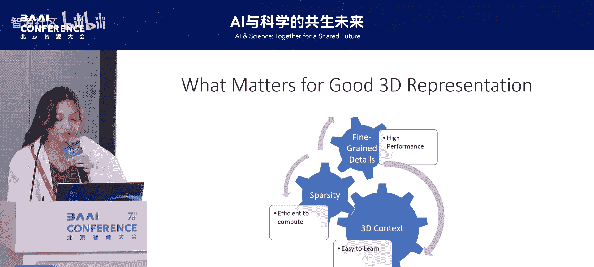

那么，如果不使用自回归模型，而使用扩散模型呢？扩散模型也有其局限：
*   输入和输出尺寸必须相同，这意味着生成前需要预设目标（如晶体）的原子数量。
*   扩散模型需要一个设计良好的、从噪声分布到目标分布的优化路径，这个路径的设计好坏非常影响最终效果。

因此，我们更倾向于采用自回归模型。为此，我们必须为 3D 结构定义一个顺序信息，使其能够以一维序列的形式被生成出来。

我们思考，一个好的 3D 表征应该是什么样？我们的方案采用了 **分层细节** 的思想：同时包含粗粒度和细粒度的信息，以提供强大的表现力。同时，它保持了稀疏性，便于快速计算。最重要的是，它完整保留了 3D 信息，没有经过会丢失信息的复杂变换，因此对模型来说是易于理解的。

---

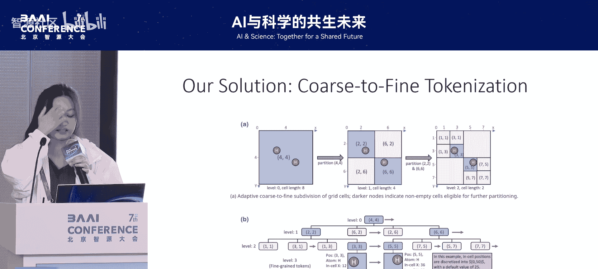

# Uni-3DAR：04：核心 Tokenizer 设计 🧩

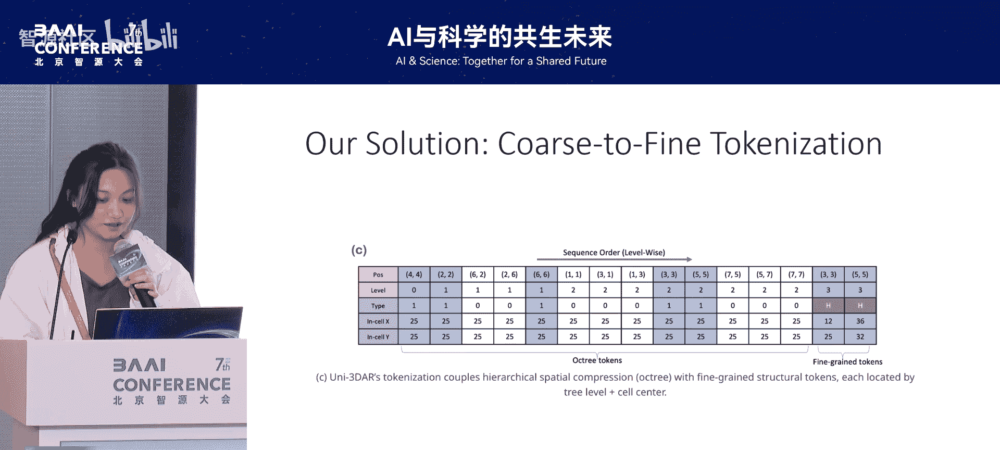

上一节我们确定了使用分层、稀疏且保留完整信息的自回归方案，本节中我们来看看实现这一方案的核心——Tokenizer 的设计。

我们的目标是将 3D 结构无损地压缩成一维序列。为了便于理解，我们用一个类似 2D 的例子来说明。

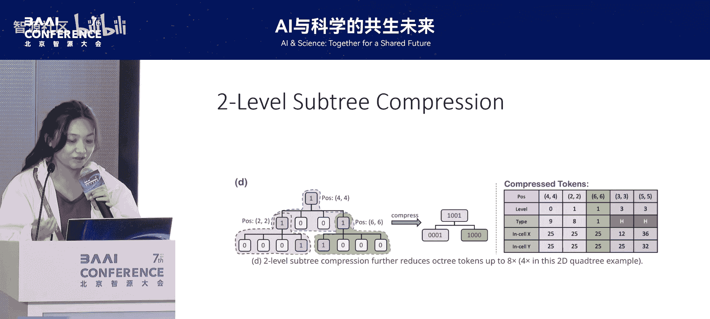

假设我们有一个 8x8 的网格，其中有两个氢原子。我们如何将它编码成一维序列呢？以下是步骤：

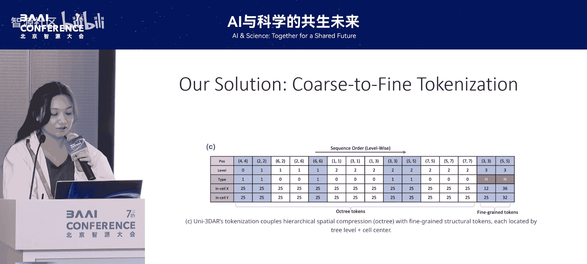

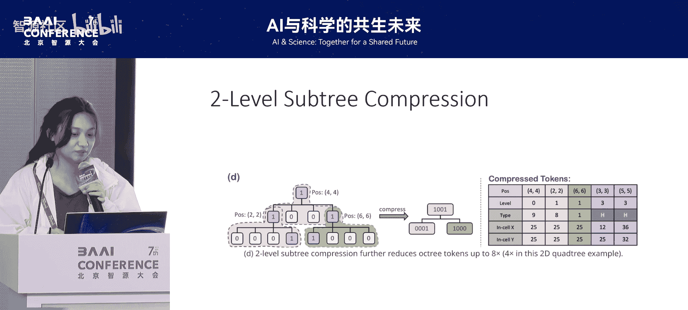

1.  **递归细分**：首先，将最大的 8x8 网格分成 4 个 4x4 的子网格。我们发现两个氢原子分别落在第一个和第四个子网格中。
2.  **处理非空子网格**：接着，只对包含原子的非空子网格（第一个和第四个）继续进行四等分。
3.  **迭代至最细粒度**：重复这个过程，直到达到最细的网格粒度。
4.  **确定原子细节**：在最细的网格内，我们最终预测该位置的原子的类型以及它在这个小网格内的精确偏移量。

这个过程形成了一个 **四叉树**（在 3D 中则是八叉树）结构。从最粗的层级（Level 0）开始，逐层细化到最细的层级（Level 2），最终在叶子节点确定原子信息。

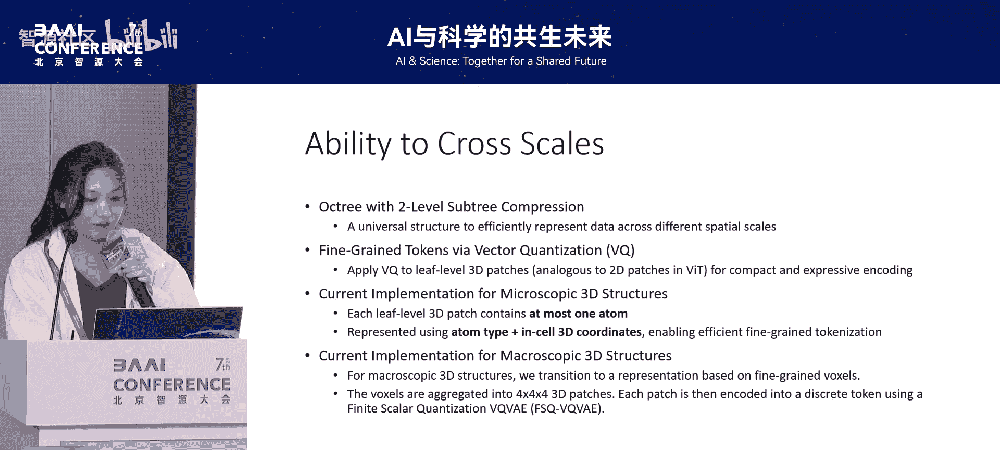

然后，我们通过 **广度优先搜索** 的方式将这棵树“摊平”，转换成一维的 token 序列。

---

# Uni-3DAR：05：Token 压缩与跨尺度适配 ⚙️

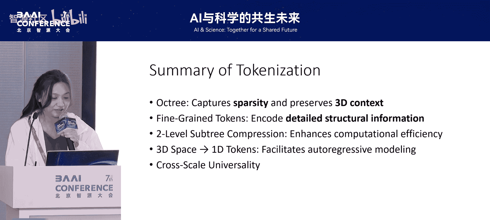

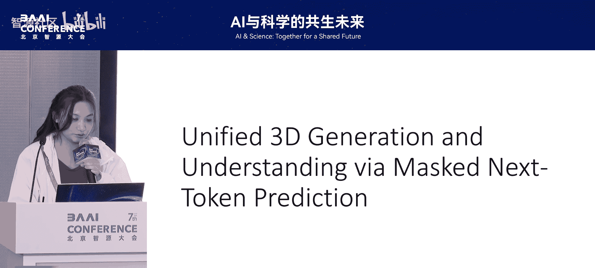

上一节我们介绍了通过树结构生成序列的基本方法，本节我们来看如何优化这个过程并使其适应不同尺度。

我们发现，上述基础方法效率仍有提升空间。例如，对于一个节点，我们需要进行 4 次二元预测来判断它的 4 个子节点是“空”还是“非空”。这相当于进行了 4 次分类。

我们可以将这个步骤优化：将 4 次独立的二元分类，合并成一次 `2^4 = 16` 类的分类。例如，“非空-空-空-非空”对应一个特定的类别编码。在 3D 的八叉树中，则是进行 `2^8 = 256` 类的分类。

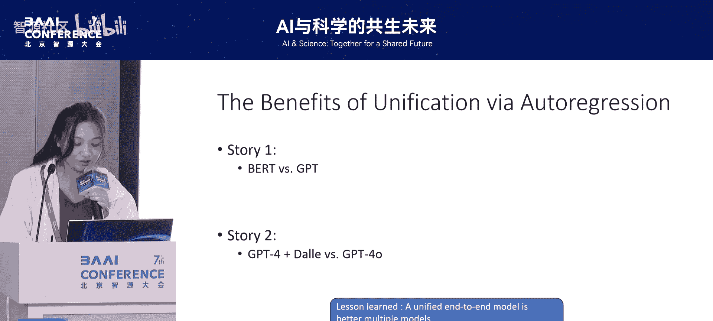

这种优化被称为 **Token 级别的子压缩**。它能够显著减少序列中 token 的数量，从而提升模型效率。

在细节处理上，我们对宏观和微观数据做了轻微区分：
*   **微观**（如分子、晶体）：在最细粒度网格上，直接预测**原子类型**和**网格内坐标**。
*   **宏观**（如点云）：在最细粒度网格上，使用类似 VQ-VAE 的方法，将一个小立方体内的信息编码成一个离散的 token，代表该处的几何特征。

现在，我们来总结一下 Tokenizer 的工作：
1.  **八叉树编码**：实现从 3D 到 1D 的完全无损压缩。
2.  **细粒度 Token**：在八叉树最后一层，预测具体的原子信息或几何特征。
3.  **Token 级压缩**：将多次二元预测合并为一次多类预测，提升效率。
基于这三项技术，我们构建了一个适用于各种尺度（宏观与微观）的、无损的 3D 到 1D 的压缩表示方法。

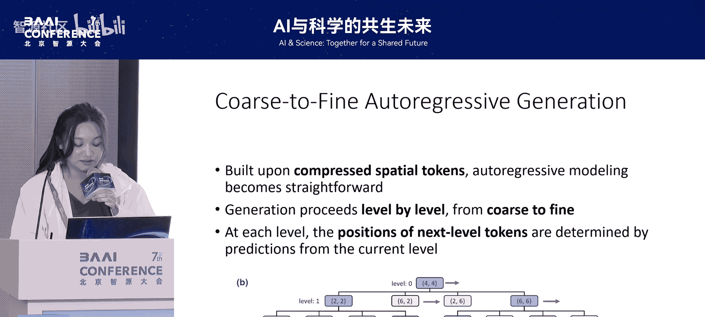

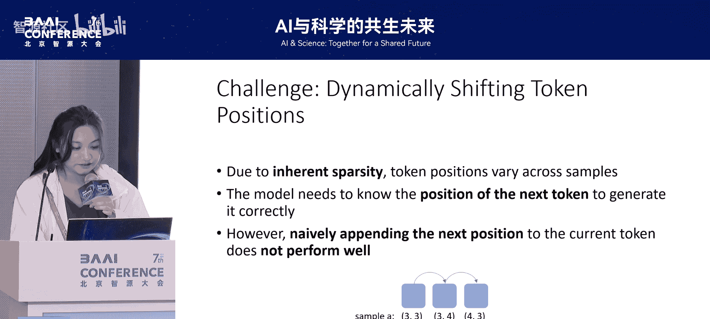

---

# Uni-3DAR：06：自回归模型架构设计 🏗️

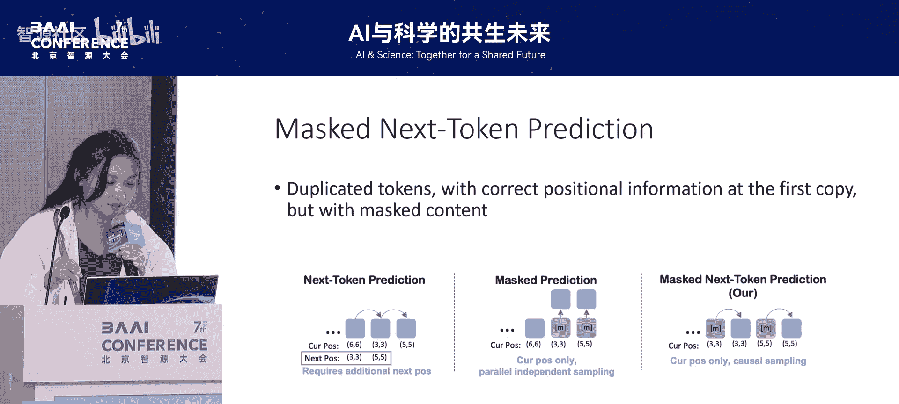

上面我们详细讲解了如何将 3D 数据 Token 化，下面我们来看看模型本身是如何设计的。

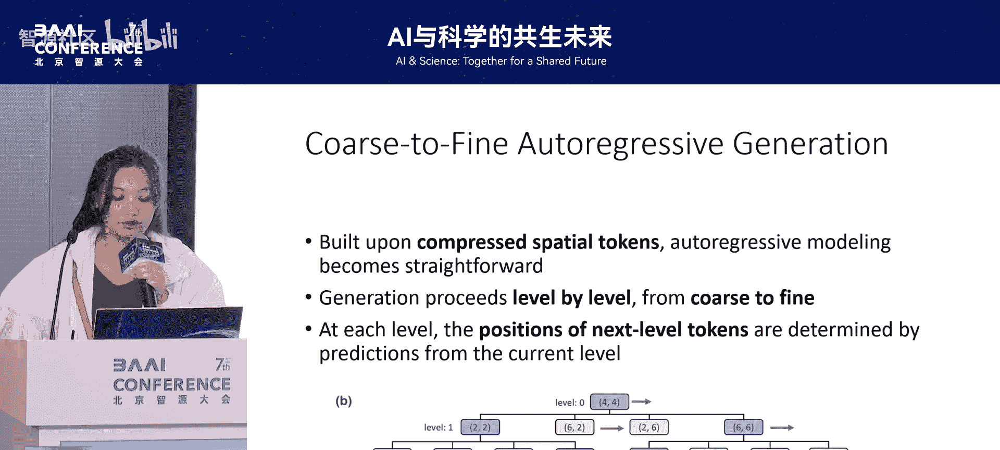

模型的设计理念源于两个观察：
1.  **BERT 与 GPT 的演进**：早期，BERT 在理解任务上表现优异，而 GPT 更擅长生成。但随着数据和模型规模扩大，GPT 在理解任务上的能力也超越了 BERT，这体现了 **规模效应** 和统一架构的潜力。
2.  **多模态模型的统一**：早期的多模态模型（如 GPT-4）中，文本和图像生成是分离的，导致信息损失。后来的模型（如 GPT-4o）将理解与生成统一在一个模型内，效果显著提升。

这启示我们，一个**统一的理解与生成模型**非常重要。因此，我们选择使用自回归 Transformer 作为基础架构。

当我们将设计好的 Token 输入标准自回归模型时，发现一个具体问题：由于 Token 序列是通过遍历树产生的，**下一个要预测的 Token 的位置并不是简单的前后顺序关系**，而是根据树的结构动态决定的。例如，预测完一个父节点后，下一个要预测的可能是它的某个子节点，也可能是跳回到其他分支。

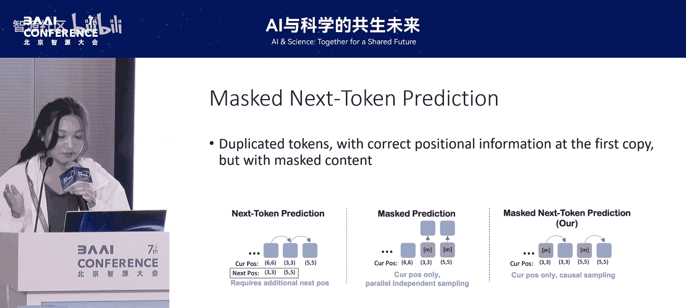

传统的“下一个 Token 预测”机制在这里会遇到困难，因为模型需要同时猜测“下一个 Token 的位置”和“该位置的值”，这增加了预测难度。

然而，我们发现，在树遍历过程中，**下一个 Token 的位置其实是已知的**（由树的结构决定），不需要模型去预测。我们只需要预测在该位置上的值。

因此，我们改进了预测机制，提出了 **Masked Token Prediction**。具体做法是：
1.  在输入时，我们告诉模型下一个要预测的 Token 的**位置**。
2.  模型根据这个位置和已有的上下文，预测该位置的**值**（例如，是 16 类中的哪一类）。
3.  预测出的值会被添加回输入中，作为后续预测的上下文。
这样，模型无需预测位置信息，只需专注于预测值，同时又能获得完整的上下文信息，完美解决了树结构遍历带来的顺序难题。

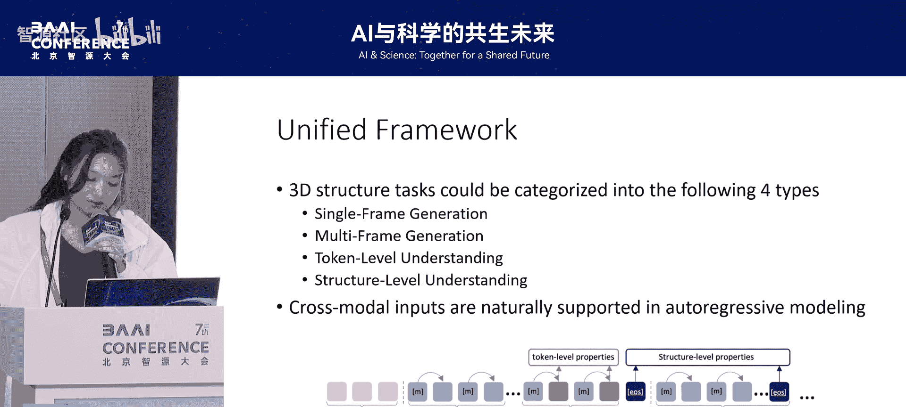

---

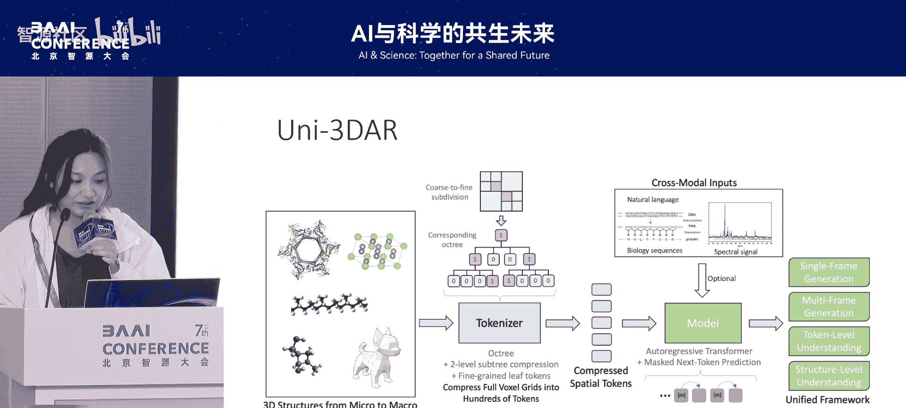

# Uni-3DAR：07：任务适配与模型细节 🎛️

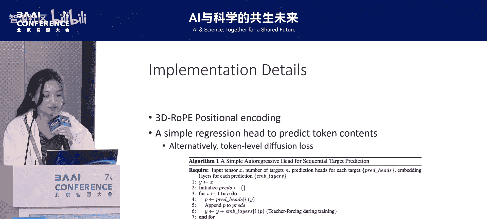

上一节我们介绍了核心的 Masked Token Prediction 机制，本节我们看看模型如何适配不同的任务。

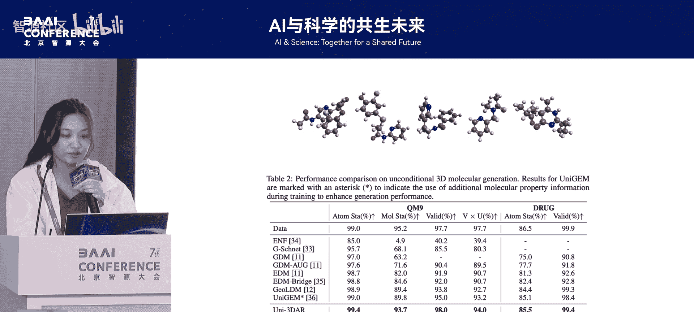

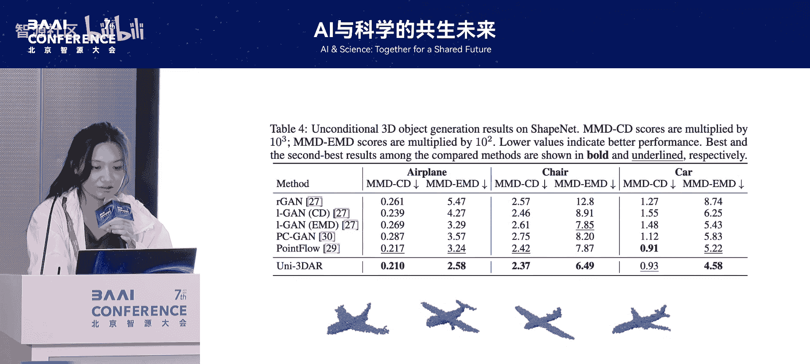

我们的模型需要兼顾理解和生成。主要支持四种任务模式：
*   **单帧生成**：生成单个 3D 结构（如一个分子）。
*   **多帧生成**：生成多个 3D 结构（如多个分子）。
*   **Token 级理解**：输入一个 3D 结构，对其中每个组成部分（如每个原子）进行分类或回归。
*   **结构级理解**：输入一个 3D 结构，预测其整体属性。

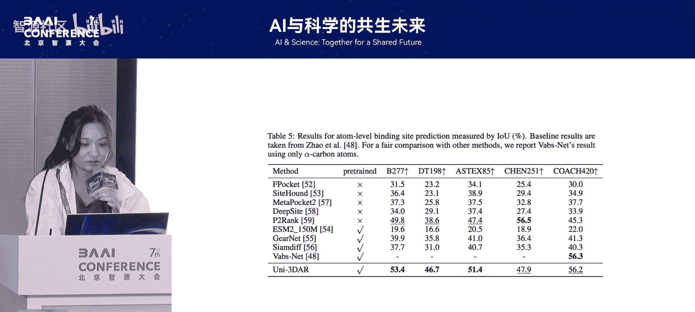

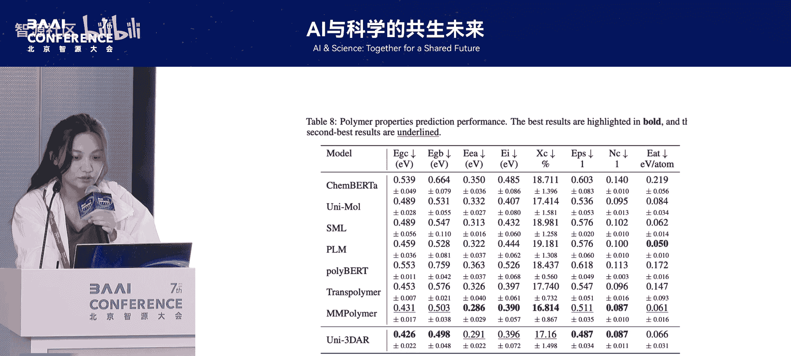

在模型架构上，我们进行了针对性适配。输入通常以多模态条件（如文本描述）开始，然后是第一棵树的 Token 序列。如果需要生成或理解多个结构，则按顺序添加第二棵、第三棵树的 Token。

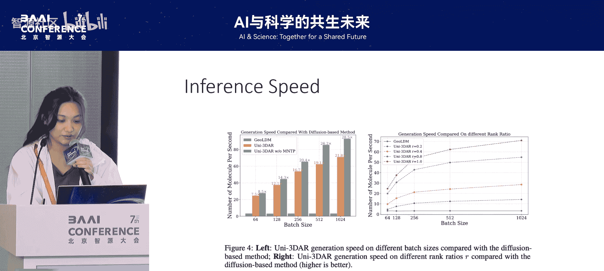

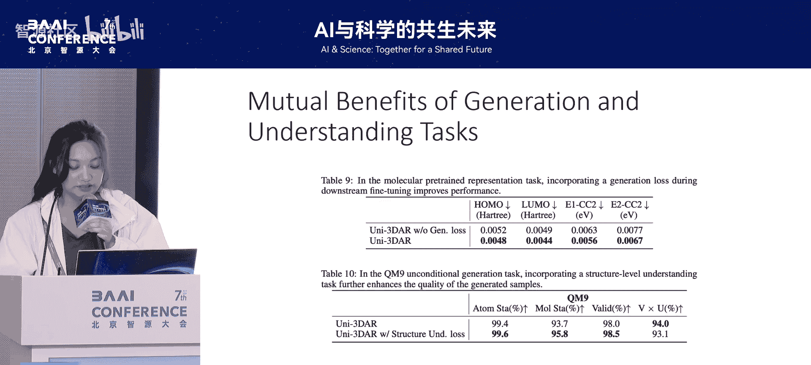

此外，一个重要的细节是位置编码。标准的 Transformer 使用一维旋转位置编码。由于我们处理的是 3D 数据，我们将其改为了 **3D 旋转位置编码**，以更好地建模空间几何关系。

现在，我们的整体框架就清晰了：首先通过 Tokenizer 将 3D 结构变成一维序列，然后使用我们特化的模型和 Masked Token Prediction 机制来完成各种任务的建模与预测。

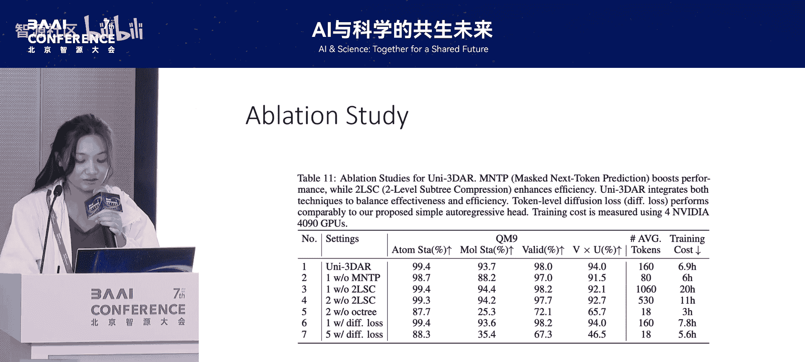

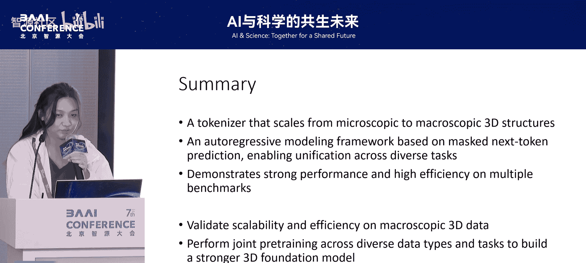

---

# Uni-3DAR：08：实验结果与总结 📊

在本节课的最后，我们一起来看看 Uni-3DAR 模型在一些任务上的实验结果，并对全部内容进行总结。

我们在多个标准数据集上进行了评测，涵盖了生成与理解任务：
*   **分子无条件生成**：模型能够生成多样且有效的分子结构。
*   **晶体生成**：在条件生成和无条件生成任务上均取得了良好结果。
*   **分子对接**：预测小分子与蛋白质结合口袋的相互作用。
*   **聚合物生成**：生成长链聚合物结构。

实验表明，我们的模型具有较好的鲁棒性。同时，一个有趣的发现是：**联合训练理解任务和生成任务，能够相互促进，提升理解任务的性能**。这验证了统一架构的价值。

我们也进行了消融实验，验证了之前提到的各种技术（如 Token 压缩、3D RoPE 等）的有效性。我们的模型仅通过 Transformer 加一个线性分类器就能取得很好效果，说明这套 Token 和模型设计已经足够强大，无需其他复杂技巧。

**总结**
在本节课中，我们一起学习了 Uni-3DAR 模型。我们从 3D 统一建模的挑战出发，深入探讨了：
1.  如何通过**分层八叉树 Tokenizer** 将任意尺度的 3D 结构无损压缩成一维序列。
2.  如何设计 **Masked Token Prediction** 机制，让自回归模型能够高效处理树结构产生的非连续序列。
3.  如何构建一个**统一的 Transformer 架构**，同时处理 3D 数据的生成与理解任务，并实现任务间的相互促进。

Uni-3DAR 为跨尺度的 3D 人工智能提供了一个通用、强大的建模框架，在科学发现和工程应用上都具有广阔前景。