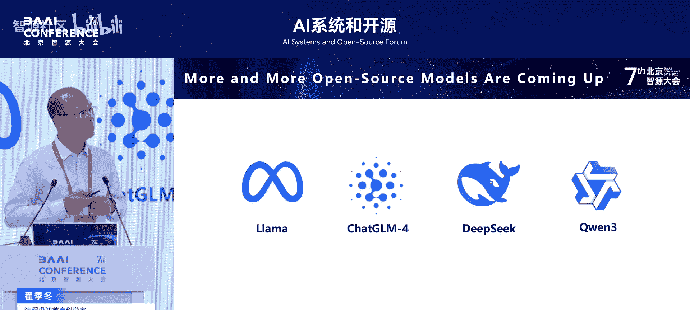
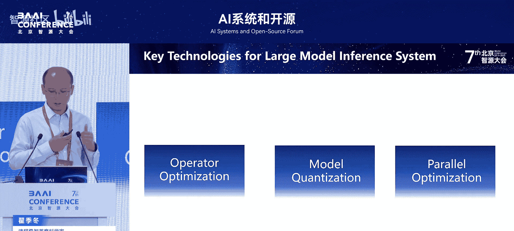
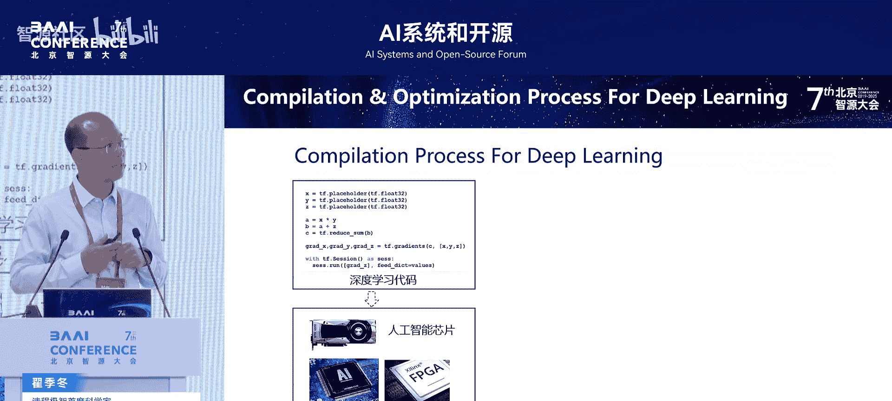
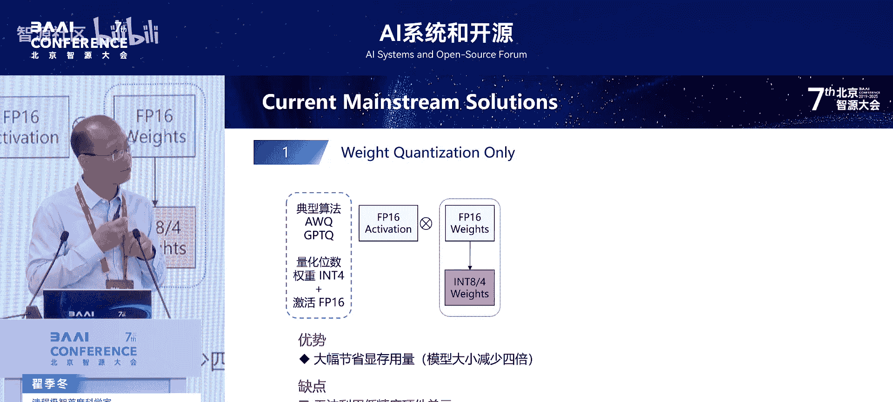
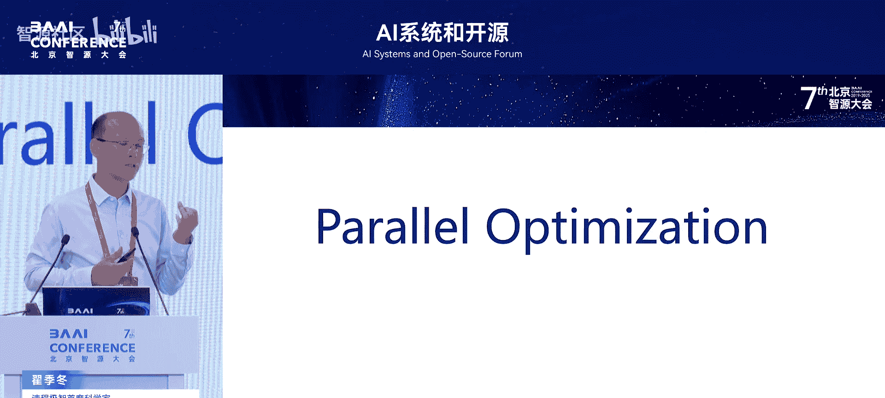
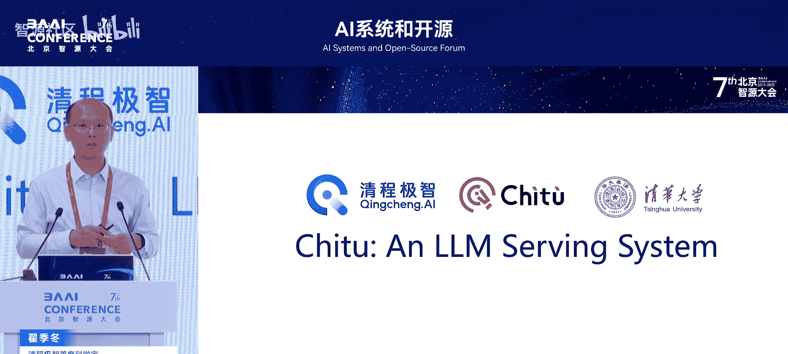
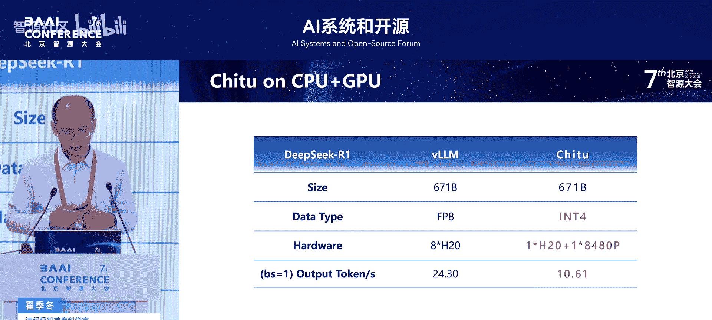

# AI系统和开源-p02-大模型推理系统关键技术：翟季冬

在本节课中，我们将学习大模型推理系统中的三项关键技术：算子优化、模型量化和并行优化。这些技术对于降低大模型推理成本、提升性能至关重要。

## 概述

随着DeepSeek等优秀模型的开源，2025年被视为人工智能应用的元年。大模型在交通、医疗、教育等领域的应用探索日益广泛。然而，大模型推理成本高昂，例如ChatGPT每日推理开销可达数十万美元，其中90%以上是算力开销。因此，降低推理成本是大模型落地千行百业的关键。

## 算子优化

上一节我们概述了大模型推理的挑战，本节中我们来看看第一项关键技术：算子优化。算子优化在大模型推理中至关重要，它直接决定了每个计算单元的性能表现。

DeepSeek在开源时，五天中有两天发布了算子相关的代码，包括Flash Attention和矩阵乘法的优化，这凸显了算子性能的重要性。

硬件发展带来了新的挑战。以英伟达GPU为例，其峰值性能和内存带宽持续增长，但内部也增加了许多新的硬件单元，例如Tensor Core、Tensor Memory Accelerator和异步拷贝单元。这使得编写能充分发挥硬件潜力的高效算子代码变得越来越困难。

以下是算子优化的流程简述：

1.  **高层表示**：程序员通常使用Python（如PyTorch）编写代码。
2.  **中间表示**：编译器将代码转换为体系结构无关的计算图。
3.  **图级优化**：在计算图上进行算子合并、分裂等优化。
4.  **代码生成**：调用算子库或生成针对特定硬件的优化代码。

图级优化的核心思想是通过合并算子来更充分地利用硬件。例如，将多个访存密集的小算子合并，可以减少内存访问开销，提升效率。

然而，简单的粗粒度合并可能带来问题。以HRO模型中的操作为例，其中包含两个在不同维度进行的规约操作（`reduce0`和`reduce1`）。如果强行合并所有算子，会降低并行度；如果拆分过细，算子间频繁的数据传输又会成为瓶颈。

针对长上下文模型带来的挑战（计算密集型算子变为访存密集型），我们实验室提出了**FlashTuner**系统。其核心思想是进行细粒度的算子融合。

**FlashTuner**会分析计算图中张量的细粒度属性（如规约操作的维度），并通过数据流分析理清所有张量的变化属性，最终执行更智能的图变换。例如，在HRO的例子中，它会生成两个内核（Kernel），分别处理`reduce0`和`reduce1`，虽然存在少量重复计算，但每个内核都能达到极高的效率。

以下是优化效果的对比：
*   在英伟达A100/H100上，对典型模型有1.5倍到86倍的性能提升。
*   在HRO例子中，优化后的性能远超简单的粗粒度合并或过细拆分方案。

## 模型量化

上一节我们介绍了如何通过算子优化提升单次计算效率，本节我们来看看如何通过模型量化来减少计算和存储的总量。模型量化是降低大模型推理成本的另一项关键技术。

模型尺寸持续增长，而AI芯片（如英伟达B200）开始支持FP8、FP4等多种低精度计算。将模型用低精度表示，可以减小存储空间，同时低精度计算通常能提供更高的硬件性能。

以下是三种主要的模型量化方法：

1.  **仅权重量化**：只对模型权重进行量化（如INT4）。这种方法能降低存储开销，但计算时需反量化回高精度，因此对计算性能提升有限。
    *   **公式示意**：`输出 = 反量化(量化(权重)) * 激活值`
2.  **权重与激活值全量化**：对权重和激活值同时进行量化。可以直接利用硬件的低精度计算单元获得高性能，但可能导致模型精度显著下降。
3.  **混合精度量化**：识别模型中的“离群点”（对精度影响大的值），对其保持高精度（如FP16），对其他值进行低精度（如INT4/INT8）量化。这种方法能在基本保持原模型精度的同时，享受低精度计算的好处。

然而，混合精度量化面临挑战：
*   难以高效地从大张量中定位离群点。
*   剔除离群点后，数据访问变得稀疏，访存效率低。
*   混合精度计算（同时包含高精度和低精度数据）难以充分发挥硬件效率。

针对这些挑战，我们开发了**MiSQ**系统。它从调度、编译优化等多个层面进行优化，使得混合精度量化既能保持模型精度，又能充分发挥硬件效率。

以下是**MiSQ**的效果：
*   相比之前的量化方法，在英伟达等AI芯片上获得约1.5到1.6倍的性能提升。
*   在模型精度上，其效果与未量化的FP16版本基本相当。

## 并行优化

前面两节我们分别从算子和数据精度层面探讨了优化，本节我们来看看如何通过并行化来应对超大模型。并行优化对于运行像DeepSeek-V3（671B参数）这样的巨型模型至关重要。

以DeepSeek官方推理配置为例，它采用了“Prefill-Decode分离”策略，并组合了多种并行方式：
*   **Prefill阶段**：使用32个GPU，采用4路张量并行和8路数据并行。
*   **Decode阶段**：使用144个GPU，采用4路张量并行、36路数据并行和144路专家并行（针对MOE结构）。

大模型推理场景多样，需要动态调整并行策略：
*   **短输入短输出**：如日常问答，负载特点可能不同。
*   **长输入短输出**：如文档摘要生成。
*   **短输入长输出**：如深度思考、长文本生成。

不同的场景对应不同的计算负载（计算密集型或访存密集型），因此固定的并行策略并非最优。例如，在请求量不同时，DeepSeek模型的性能表现会有差异。英伟达的**Dinamo**系统就包含一个“规划器”模块，专门用于根据推理请求的特点动态调整并行策略。

因此，要实现最佳的推理性能，必须根据实际工作负载动态调整并行策略。

## 实践：赤兔推理引擎

基于上述关键技术，我们团队（清华大学与清昶智能）开源了**赤兔推理引擎**。

**赤兔**的核心特点与优势包括：

1.  **集成关键技术**：实现了前文所述的编译优化、动态并行、模型量化（如MiSQ）等技术。
2.  **支持国产AI芯片**：积极适配华为昇腾、沐曦等多样化的国产AI芯片生态。
3.  **极致性能与成本优化**：致力于大幅降低推理成本。

以下是部分性能数据示例：
*   **在华为昇腾910B上运行DeepSeek-R1满血版**：
    *   传统方法需要32张卡。
    *   使用赤兔引擎（结合MoE和混合精度量化）仅需8张卡，且性能比32卡方案快3.26倍，同时模型精度损失极小。
*   **在沐曦芯片上运行DeepSeek满血版**：
    *   传统方法需要32张卡。
    *   赤兔通过在线编译优化，仅用16张卡即可达到优于原32卡方案的性能。
*   **单卡推理**：支持在单张英伟达H20上运行DeepSeek，吞吐量可达10.61 tokens/秒。

**赤兔的未来规划**围绕三个方向展开：
1.  **多样性**：支持更多国产及海外AI芯片。
2.  **低成本**：持续深化编译优化、量化等技术。
3.  **大规模**：支持百卡、千卡级大规模推理，实现类似Prefill-Decode分离的先进技术。

## 总结

本节课中我们一起学习了大模型推理系统的三项关键技术：
1.  **算子优化**：通过细粒度的图优化和代码生成，充分发挥底层硬件性能，应对长上下文等挑战。
2.  **模型量化**：特别是混合精度量化，在保持模型精度的同时，利用低精度计算降低存储和计算开销。
3.  **并行优化**：根据动态工作负载调整并行策略，以高效支持超大模型推理。

大模型及AI技术要真正落地，降低推理成本是关键。这需要算法、软件和硬件之间的协同优化，而设计良好的系统软件对于充分发挥底层硬件潜力至关重要。赤兔推理引擎便是我们在该方向上的一个实践，致力于通过开源开放推动大模型推理技术的发展。