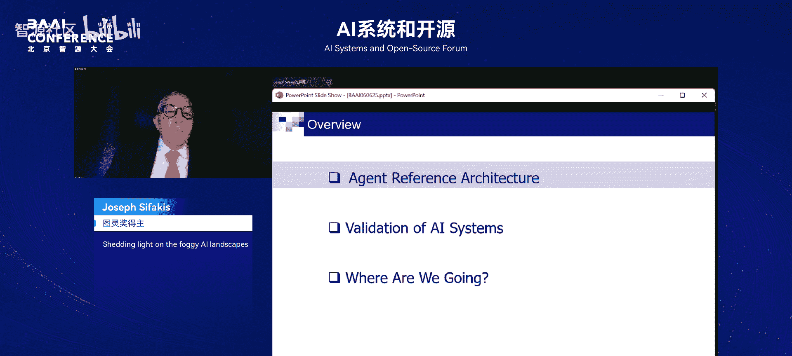
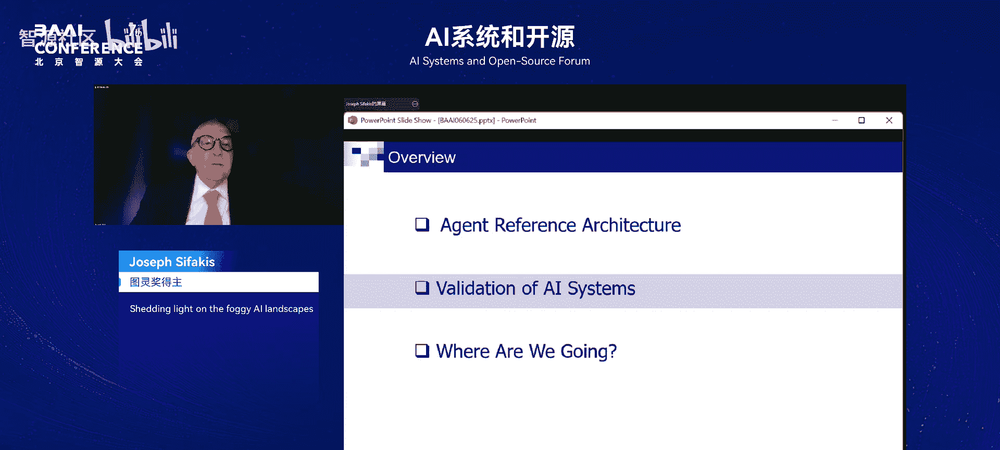

# AI系统和开源-p03-Shedding-light-on-the-foggy-AI-landscapes：Joseph-Sifakis

在本节课中，我们将学习图灵奖得主约瑟夫·西法基斯教授关于人工智能现状与未来的深刻见解。他将从系统工程师的视角，剖析当前AI领域的困惑，阐述智能体的参考架构，并探讨AI系统验证所面临的挑战。

## 概述

约瑟夫·西法基斯教授是2007年图灵奖得主，因其在模型检测方面的重要贡献而获奖。模型检测已成为硬件和软件行业广泛采用的高效验证技术。本次演讲，他将带来一个令人耳目一新的主题。

## 当前人工智能领域的困惑

当前，人们对人工智能的终极目标存在大量困惑。许多人认为目标是通用人工智能（AGI）。AGI有许多不同的定义，但粗略地说，它是一个能够执行人类可以完成的任何智力任务的系统，因此可以在不同任务上超越人类。

我认为这些AGI定义具有误导性。它们隐含地假设人类智能可以被定义为执行一组未定义任务的能力。对我来说，这不是人类智能。具体是哪些任务？有多少任务？AGI定义还暗示，它只能通过机器学习来实现，因此机器学习是终点，扩大模型规模必然会带来更高的智能。

我持不同观点。我认为人工智能的目标应该是构建具有人类水平智能的机器。当然，我们需要就什么是人类水平智能达成一致。我认为词典中已经给出了足够好的定义，这些定义在人工智能出现之前就已存在：它是学习、理解和思考世界，并通过在世界中行动来实现目标的能力。

## 人工智能的现状与局限

当前的人工智能系统可以执行令人印象深刻的任务，可以在执行这些任务方面超越人类。但它们在情境感知、适应变化和创造性思维方面无法超越人类。我认为，如果我们不清楚什么是智能，就无法发展关于其如何运作的理论。

我相信人工智能仍处于起步阶段，因为我们只有构建复杂智能系统的构建模块。迄今为止，人工智能主要专注于对话式助手系统：你提问，得到答案，仅此而已。我们想要更多，例如，我们想要能够接收事件流、进行预测的AI监控器。当然，最终目标是拥有自主人工智能。

如今，人工智能对实体经济的影-响有限。人工智能工业革命才刚刚开始，其实现很大程度上取决于我们开发AI智能体和构建自主系统的能力。

## 技术系统与非技术系统

我想澄清的另一件事是技术系统与非技术系统之间的区别。技术系统是我们能够理解其输入输出行为的系统。我们可以通过预测来表征它，可以验证其行为等。非技术系统的输入和输出域是根据感官和语言数据定义的。从技术角度来看，说“ChatGPT是安全的”与说“飞机是安全的”意义不同，因为你无法形式化其输入输出行为。

但人工智能带来的新事物是，它既支持构建非技术系统，也支持构建技术系统。例如，国际象棋程序是一个技术系统，因为我们清楚地理解规则，但我们无法用传统ICT技术解决。人工智能很伟大，但我们应该理解其差异和局限性。当然，自主系统兼具技术系统和非技术系统的特性。

## 自主系统的概念

我认为自主系统的概念已被很好理解。其理念是在复杂组织中取代人类操作员。它们由智能体组成，每个智能体追求自己的目标，并且智能体之间需要协调以满足全局系统目标。我们谈论集体智能，这些系统高度复杂，通常是关键系统，因为它们取代了人类，是分布式、动态、可配置、永不停止且不断演化的系统。

## 人工智能系统的可保证性

另一个重要问题是人工智能系统的可保证性。这意味着我们应该能够保证人工智能系统的安全性。你可能知道有很多关于人工智能安全性的讨论。我认为大多数讨论都错误地认为，我们可以像制造安全的电梯或飞机一样，使大型语言模型变得安全。

关于人工智能系统的另一个重要问题是，因为它们旨在模仿人类，所以我们必须考虑以人为中心的属性。如果你访问大型科技公司的网页，他们会谈论负责任的人工智能，其特征是一系列难以评估的属性。人们谈论人工智能与人类伦理价值观的对齐。关于这项工作，我只能说它在技术上完全没有基础，因为它忽略了一个基本的认知原则：如果我声称我的系统是符合伦理的，我应该解释“符合伦理”意味着什么。我们甚至不理解对人类来说“行为符合伦理”意味着什么。当然，你还应该提供一种等效的验证方法。所以这只是一厢情愿的想法。

以上是我演讲的概述。我将主要讨论智能体，因为我研究自主系统已超过十年。我将阐述我对智能体的看法，讨论人工智能系统的验证，并进行总结。

## 智能体与参考架构

我认为，随着大型语言模型的出现，AI智能体引起了越来越多的兴趣，这确实是人工智能发展史上的一个重要里程碑。

如今，我们拥有可以解决某些问题、通过与静态数字世界交互来提供服务的智能体。但我们拥有的并不令人满意。大多数智能体基于这样的架构构建：我们有一个LLM，LLM通过集成引擎或存储在内存中的知识进行增强。当然，现在ReAct范式非常有名。因此，我认为我们需要一个参考架构。参考架构的理念在系统工程中非常常见，你为复杂系统构建参考架构。

参考架构是什么？参考架构将智能体智能表征为计算或功能组合的涌现属性。这是我的梦想：如何将其表征为独立于任何AI或传统系统实现方式的功能组合。当然，参考架构应足够通用，以涵盖人类智能的所有方面，特别是双系统思维和问题解决。

如果我们有一个参考架构，它可以作为基础来将自主性表征为组合功能，并比较不同的解决方案。如果有人提出一个解决方案，我们将有一些参考来进行比较。此外，我希望我们也可以通过组合推理来解决智能体正确性问题，但我没有时间讨论这一点。

## 智能体参考架构的抽象视图

智能体做什么？它与世界交互，世界由外部环境和内部环境组成。它接收刺激，产生行动。这里的架构围绕长期记忆构建，我在其中存放关于世界的知识，可以是符号知识。你可以看到这里有不同的知识类型。反应式行为包括情境感知和决策制定，这在机器人学中相当标准。这里的新内容是主动式行为。主动式行为产生新目标，这些新目标可以来自对智能体自身状态的分析、需求等。你在不同目标之间进行选择，并提供新目标。

这种组织中非常重要的是记忆的作用，因为记忆中的知识用于丰富每种行为的知识，并控制这两种行为的语义。

## 参考架构的详细视图

这里你可以看到，情境感知包括感知和反思。反思的目的是基于对世界的预测模型，查看哪些目标是适用的。对于每个适用的目标，你将启动一个规划器来生成行动。这相当标准。可能新颖的是这个主动式行为。一切都始于智能体对其目的的了解：我作为智能体在做什么？我的目的是什么？目的是驾驶汽车。那么，我所有的存在条件都满足了吗？我有四个状态良好的轮子吗？如果一个存在条件失败，那么就会出现一个需求。我假设在记忆的需求中，你关联了元目标集合。当然，你必须检查这些元目标的可行性。因此意图出现，意图是执行一个元目标。你有一个系统，可以是一个经典系统，来分析并在目标之间进行选择，被选中的目标将被传递给目标管理器进行处理。

这主要是这个想法。当然，我向你展示的是一个不与其他智能体和人类交互的智能体。我有一个更精细的模型，可惜没有时间讨论。特别是“人机交互”这个模块非常有趣，看看我们如何定义它。

为了进一步解释主动式行为的概念，我提出这个主动式行为是因为受到人类主动式行为的启发。如果一个人有需求，例如存在条件是不感到饥饿，那么元目标就是寻找食物。现在可能有不同的解决方案来寻找食物，你应该进行分析。事实上，我们这里有决策制定和选择制定。这是选择制定过程，而决策制定涉及目标的实现。这里你可以看到另一个例子：网络服务生成。我有一个自愈的元目标，这可以通过追求不同的目标来实现，以及我如何选择新目标。

## 构建智能体的挑战

为了构建智能体，我认为有两个重要的挑战。一是能够生成好的规划器、好的目标管理器。我看到许多论文试图通过思维链或思维树来进行规划。我认为如果环境是动态的，这些解决方案将不起作用。实际上，规划是智能体与环境之间的一场博弈，为此你需要一个非常复杂的预测模型，有时这被称为“前瞻树”。一旦你有了这个，你必须分析这个前瞻树，并定义所谓的获胜状态或获胜策略。显式构建前瞻树涉及指数级复杂度。如果你知道游戏规则，那么你可以应用一些启发式方法，就像AlphaGo所做的那样。

此外，应该理解围棋涉及安全性和可达性以及优化。我看到一些人使用强化学习进行规划，但强化学习可以优化解决方案，找到优化方案，但不能保证安全性，这非常重要。因此，我们需要为此开发技术。在我看来，规划应由实时软件执行。

另一个重要的事情是，我们需要知识管理技术。你必须知道如何将知识存储在智能体的记忆中。在我的智能体的理论记忆中，我们知道嵌入技术不足以解释语义上的细微差别。因此，我们应该寻找解决方案，例如知识图谱，但即使是知识图谱，我认为也应该有某种超图，可以表示实体之间的记忆关系。然后，我们应该开发检索机制，这非常重要。我们知道余弦相似度永远无法捕捉语义上的细微差别。因此，我们应该有一种检索机制，能够捕捉不同的关系并进行一致性检查。当你更新记忆并添加新知识时，需要检查其与已存储知识的一致性。

你应该意识到，当我们处理智能体时，我们处理不同类型的知识。我在这里做了一个分类：根据有效性、通用性程度来表征的知识类型，它们可以是领域特定的，可以有不同的使用模式。我希望你理解这个分类：你有可以是具体或抽象的概念或实体；你可以有基于数据库和模型的知识；你可以有关于世界状态的陈述性知识，以及关于方法、行动谓词的过程性知识；当然，智能体的一些知识可以是主观的，例如智能体相信某事发生或必须做某事，也可以是客观的、独立于智能体的知识。

## 连接知识与逻辑的世界

这是我的愿景：我想连接知识和逻辑的世界。现有的逻辑为如何处理不同类型的知识提供了很好的分类。人类思维的知识，自然语言就是知识。我想给出细节，但我说的是显而易见的。如果你熟悉逻辑，我们有关于世界状态的基本知识，例如命题逻辑；然后是关于世界状态序列的时序逻辑；空间知识；认知知识（我知道某事，我相信某事是真的，这与某事是真的不同）；道义知识。另一方面，我们有自然语言，自然语言体现了一些知识。问题是如何连接这两个世界。我在这里展示了形式化和规范化操作，其含义是显而易见的。因此，我希望拥有能够将文本分解为带有上下文的块，并区分上下文变化与行动、理解时间模态、空间模态的大型语言模型。我希望你理解，我们今天还没有这个。

## 构建智能体所需的工具

这还不够。当然，我们需要形式化和言语化的引擎，但我们也需要分块技术。如果我有一个文档，我想把它分割成块。我们今天拥有的技术对于技术系统来说非常糟糕，你只有句法标准。然后，如何从文档中提取专门知识？例如，如何根据不同的标准检查两个文档知识的一致性？当然，还有综合，这非常重要。我不打算详细评论，但我希望你理解这些都是难题。如果我们要构建智能体，我们将需要解决这些问题。

现在让我给你一个更具体的例子来说明我需要什么。我是一个自主网络的工程师。这里我写了一个关于如何重新配置网络的场景文本。我有一个LLM，它将生成总结我想法的知识图谱。当然，在长期记忆中，我有关于网络连接性、路由表行为属性等的解决规则。我希望有一个工具，在专家按下按钮配置网络之前，确保这是正确的。我们没有这样的东西。试着想想你需要解决多少不同的问题才能拥有这个。

## 关于自主系统的结论

如果自主性以情境感知和决策制定为特征，正如你在这里看到的，我可以有不断增加的情境感知，这是人类的开放世界情境感知。那么我将需要智能体，需要能够满足单个或多个目标的智能体。我们正在为此努力。但最重要的是，你需要智能体系统，其中智能体被合理地集成。今天有很多例子表明，例如自动驾驶汽车，这是不可能的。你在旧金山遇到的机器人出租车所有问题，它们无法进行社会性行为，它们阻塞警车，或者做出其他给交通带来问题的事情。这是我对于集体智能的看法，我们离那还很远。

## 人工智能系统的验证

让我谈谈人工智能系统的验证。正如我所说，我们应该区分技术系统和非技术系统。我在这里考虑自动驾驶汽车的例子，因为它们引发了很多讨论。有些人有这样的论点：例如，我已经驾驶了非常多英里，所以我的汽车是安全的。这些论点完全无效，完全没有意义，因为仅仅驾驶数十亿英里的自动驾驶里程是不够的。你应该提供基于覆盖标准的证据，证明模拟公平地处理了汽车可能遇到的许多不同情况。我们对此没有把握，我研究这个问题多年了。我们需要理论上的抽样，我们也没有可重复性。但我想强调的是，即使我们有一些具体结果，也不可能获得关键系统所需的超过10的负8次方故障每操作小时的可靠性保证。

## 关于以人为中心属性的验证

现在让我谈谈关于以人为中心属性的人工智能系统验证。这是一个非常重要的问题：哪些是人类特有的、机器难以接近的特征？你知道，许多人认为在行为智商测试中超越人类是机器智能的证明。这完全是胡说，当然，这已被多次批评。但如何区分？我如何决定一个智能体是否具有与人类相同的能力？当然，我们可以想象一个LLM能够像学生一样成功地通过最终的医学考试，这不是不可能的。但这是否意味着LLM应该被允许作为医生执业？我认为不，明显的答案是，因为人类是理性行事的，人类受价值体系约束。我们知道他们知道规则，这非常重要。这是我们信任他们的原因。这就是信任和机器的问题。

因此，如果我们想研究这些属性，它们不是行为属性，而是认知属性。行为属性和认知属性之间的巨大区别在于，认知属性取决于智能体的知识，特别是人类有一个价值体系来决定什么是正确的事情。正如你在这里看到的，我区分了规范性属性（与风险相关的属性，这是安全性和安全性的类比）和无用属性（与意图和目标相关）。

现在让我试着说几句。当然，我可以只谈论这个。一个智能体符合伦理地行动意味着什么？一个智能体配备了一个价值系统，一套规则。我假设这个价值系统在记忆中，我可以做到。还有价值尺度来评估其行动的成本和收益。因此，如果它符合伦理地行动，这意味着它意识到冲突的行动。这里你可以看到冲突行动的例子：我应该因为赶时间而遵守红灯还是闯红灯？或者其他困境。当你决定时，你使用关于规则的内部知识。如果我告诉你地球是平的，这可能是谎言，但也可能因为我从未听说过，或者我做错了什么。这是责任问题，因为我没有意识到。符合伦理地决定意味着你知道你知道什么，以及如何知道。人类的另一个特征是他们的理性。理性意味着许多事情：最优决策制定、连贯性、能力水平。当人类通过某一级别的测试时，这意味着也通过了较低级别的测试，这对于AI智能体来说并不成立。例如，测试AI智能体驾驶汽车，一个AI智能体可以避免非常关键的情况，但在非常简单的情况下可能做愚蠢的事情。

## 认知属性的形式化

我可能会跳过这一页，它谈论认知属性的形式化。这是可能的，我们拥有形式化的所有要素，我们有逻辑。当然，我们需要基于一些依赖于智能体知识和智能体意图的谓词来构建逻辑：x执行行动A，智能体x说p为真，知道p为真，x做α的价值是y，或者y相信x做α是错误的。当然，我们可以说智能体是不诚实的，如果它说p并且知道p不为真。什么是负责任的？然后你可以有关于此的理论，但这意味着认知属性的验证需要评估原子谓词，并且智能体应该被解释。

如果你让我为LLMs做这个练习，我不知道如何做。

## 结论：人工智能与系统工程的融合

现在我还有几分钟来总结。一件重要的事情是，人工智能需要与系统工程结合。这对我来说是显而易见的，随着智能体的发展，这将变得更加明显。问题是我们如何做到这一点。这里有一些我提到的问题，特别是连接符号和非符号知识。另一个问题是系统验证。很明显，我们不应期望应用形式化方法等。我们有一个从理性到模型的转变，我们应该有相关的理论。很明显，理论上我们没有传统系统那样的可保证程度，但你应该通过使用知识来弥补这一点。我没有时间讨论这个。

我们还需要技术标准。我知道在美国，他们反对标准，因为他们说这会阻碍创新。我认为这是一个愚蠢的想法。如果我们有标准，这将挑战我们找到好的解决方案。缺乏法规将导致工程水平低下的系统，从而损害未来。

## 关于多智能体系统

现在让我说几句关于多智能体系统的话。多智能体系统需要许多不同知识领域的协同。我希望这能被很好地理解，因为我看到一些人试图独家使用人工智能。这永远不会奏效。看看一个协议，如果你分析其特征，你会发现需要解决许多我们不知道如何解决的问题。顺便说一下，这些问题甚至在几十年前的符号和基于模型的框架中就已经存在。可行的解决方案将需要符号和数据驱动技术的结合，这将需要一些时间。

在此，我想感谢你们的关注。

## 问答环节

**问题1：** 非常感谢约瑟夫精彩的演讲。我想知道，你提到了目标和元目标。你认为AI如何识别元目标？如果它错误地识别了一个元目标怎么办？例如，我想要一瓶水，但它没有水，所以它带来了别的东西。

**回答：** 这是一个好问题。实际上有两种解决方案。我需要水，要么我提供这个信息，要么AI有想象力，可以找到满足我对水需求的不同目标。我不认为AI已经发展到可以期待这一点。我推荐的一个非常简单的解决方案是在记忆中存储元目标。对于这个需求，它只是寻找这个目标。这非常简单，你不需要任何AI来做这件事。我希望你理解这一点。不要试图用AI解决所有问题。我认为AI并不擅长于此，有些事情本质上我们应该使用传统技术来实现。

**问题2：** 约瑟夫，我有个问题。你介绍了智能体及其参考架构。如今，我们看到开发物理机器人的大趋势，我们也会看到在很多复杂情况或场景中，让多个机器人一起工作来完成一些复杂任务。你认为这个智能体参考架构可以迁移到物理机器人场景吗？如果我们真的想为机器人开发这种物理智能体，会看到哪些其他挑战？

**回答：** 是的，参考架构是一种模式。它提供了模式，并说明为了构建一个智能体，你需要感知、反思、目标管理、规划。它没有说明你将如何实现这些。它还提供了围绕记忆的组织。如果你想使用架构，你就使用架构；如果你想使用整体解决方案，你就使用整体解决方案。它没有说明你将采用哪种类型的解决方案，它提供了构建智能体所需的所有要素。我认为在机器人学中，他们已经使用了我架构中的反应式部分。但正如我所解释的，反应式部分是不够的，你希望拥有能够自愈的机器人。

重要的问题是如何拥有多智能体系统。我没有谈论这个，但为了拥有多智能体系统，你需要网络技术，你需要将很多东西整合在一起。如果你现在看现有的提案，比如MCP、A to way，我认为它们提供了基础设施，但没有解决问题。问题是，例如，如何解释消息，因为消息现在传递知识。如何提取知识？如何可靠地处理这些知识？智能体之间的信任意味着什么？这些都是问题。人工智能能帮助我们解决这些问题吗？我们甚至对信任意味着什么都无法达成一致。所以还有很多工作要做。我只是谦虚地提出了一个组织模型。

## 总结

在本节课中，我们一起学习了约瑟夫·西法基斯教授对人工智能领域的深刻洞察。他澄清了关于AGI目标的常见误解，强调了定义人类水平智能的重要性。他提出了一个全面的智能体参考架构，该架构结合了反应式和主动式行为，并围绕长期记忆组织。我们还探讨了构建此类智能体在规划、知识管理和验证方面面临的重大挑战，特别是关于以人为中心的认知属性（如伦理和理性）的验证。最后，教授强调了将人工智能与系统工程原则相结合，以及为多智能体系统开发坚实理论和标准的必要性。