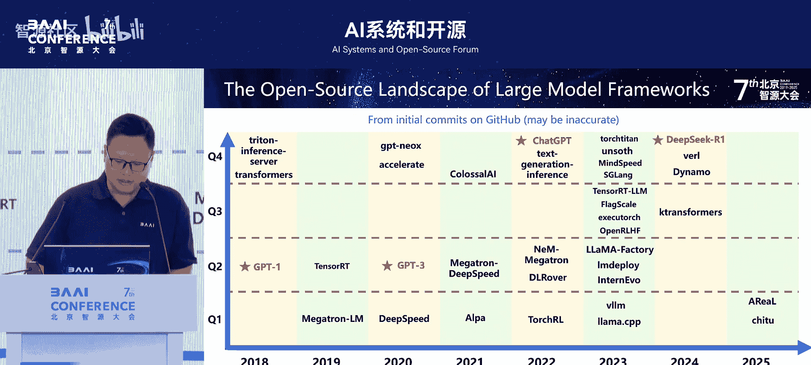
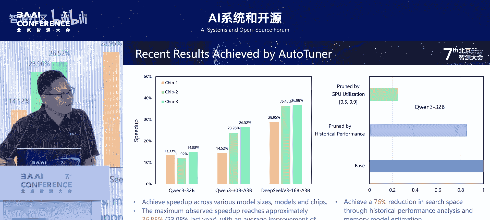

# AI系统和开源-p04-FlagScale-多元算力时代的新一代开源大模型训推一体框架：敖玉龙

## 概述
在本节课中，我们将学习由智源研究院敖玉龙博士介绍的 **FlagScale** 框架。这是一个旨在解决当前大模型开发中“碎片化”挑战的新一代开源框架。我们将了解其设计目标、核心架构、关键技术以及实际应用案例。

---

## 课程内容

### 1： 为什么需要新的框架？🤔

当前业界已有多种大模型框架，例如用于训练的 **Megatron-LM** 和用于推理的 **vLLM**、**SGLang** 等。自 ChatGPT 出现后，系统领域更是涌现了大量新框架。

然而，这种繁荣也带来了三个关键的“碎片化”挑战：

1.  **全流程支持碎片化**：许多框架只专注于训练、推理或微调等单一环节，缺乏对模型开发全生命周期的统一支持。
2.  **后端选择碎片化**：对于同一任务（如推理），用户和开发者在众多优秀框架（如 vLLM, SGLang, llama.cpp）中面临选择困难。
3.  **硬件生态碎片化**：随着 AI 硬件在性能、兼容性和性价比之间不断权衡发展，涌现出大量不同芯片，每款芯片都有其独特的开发工具链和优化策略，增加了开发和迁移成本。

**FlagScale** 的目标正是通过全新的设计和实现，解决以上三个挑战。

---

### 2： 核心架构设计 🏗️

上一节我们介绍了当前框架生态面临的挑战，本节中我们来看看 FlagScale 如何通过创新的架构设计来应对。

FlagScale 在架构上有两大关键创新：

**创新一：三层架构**
为了提供统一体验并支持多元硬件，FlagScale 采用了三层架构设计：
*   **前端统一接口层**：为用户提供统一的编程接口和自动化任务提交能力。用户无需关心底层引擎和硬件细节。
*   **中端多引擎层**：集成了覆盖训练、压缩、推理和服务全流程的多种计算引擎。
*   **后端统一基础库层**：利用与产业伙伴合作开发的统一算子库和统一通信库，解决不同芯片的底层适配问题。

这个架构主要解决了 **全流程支持** 和 **硬件生态** 的碎片化问题。

**创新二：插件式架构**
那么，如何解决“后端选择碎片化”问题呢？FlagScale 的第二个创新是实现了 **基于插件的架构**。

这种架构允许将各种后端引擎（如 vLLM, SGLang）作为插件集成到 FlagScale 中，但对用户仍呈现为一个统一界面。其插件管理系统基于开发者熟悉的 `pip` 工具，学习成本低，易于进行插件的增、删、改、用。

FlagScale 的目标是成为 **AI 系统领域的 VS Code**，即一个高度可扩展的统一开发平台。

---

### 3： 关键技术：自动化与性能优化 ⚙️

架构设计解决了“能用”的问题，但要“好用”并实现高性能，还需要关键技术的支撑。本节我们将探讨两类核心技术。

**第一类技术：自动化性能调优**
为了实现任务在不同芯片间的无缝迁移与性能最优，FlagScale 开发了自动化调优系统。这是一个 M×N×K 的优化问题，需要为特定的 **模型**、**集群规模** 和 **芯片** 找到最优的并行策略与优化配置。

该系统在去年已发布，今年进行了重要升级：
*   **扩展搜索空间**：支持最新模型（如 DeepSeek-V3）。
*   **改进内存模型**：预估准确度极大提升，理论预估与实际运行结果吻合度超过 99%。

实际效果：在千问、DeepSeek 等新模型上，于三款不同芯片相比厂商专家给出的配置，平均获得了 **23%** 的性能提升，最高达 **36%**。

**该技术已扩展至推理场景**。通过插件式架构，系统能集成 vLLM、SGLang、llama.cpp 等不同推理后端，实现通用的自动化调优。
*   对于新手用户，自动调优相比最差配置有 **3倍以上** 的性能提升。
*   相比各引擎默认的“最优”配置，仍有 **2% 到 20%** 的性能提升。

实测表明，单一推理引擎难以在所有指标（总吞吐、端到端延迟、首次输出时间）上都表现最佳，而 FlagScale 的自动化系统能帮助用户根据需求选择最佳后端与配置。

---

### 4： 关键技术：异构计算与统一通信 🔗

上一节我们介绍了如何通过自动化实现单芯片性能优化，本节我们看看如何将不同芯片组合起来协同工作。

将不同芯片结合进行训练和推理（异构计算）有两个核心挑战：
1.  如何设计**异构并行策略**以实现负载均衡。
2.  如何实现高效的**跨芯片通信**。

**异构并行策略**
FlagScale 自2023年起已支持多种异构并行策略（数据并行、张量并行等）。为了简化选择，团队提出了业界**最通用的多维度异构并行策略**。该策略能：
*   满足不同维度的异构性需求。
*   支持两款以上硬件的混合训练，且对硬件配比要求最低。
*   全场景覆盖：支持 Dense 模型（如 LLaMA）、MoE 模型（如 DeepSeek-V3）等不同结构。

**跨芯片统一通信**
高效的通信是异构计算性能的关键。FlagScale 开源了 **FlagShip** 跨芯片通信库。
*   它与厂商原生通信库兼容，并提供了跨芯片异构通信能力。
*   其核心创新是 **Cluster-to-Cluster** 通信算法：将异构集群划分为多个同构子集群，子集群内使用厂商优化库，子集群间使用自研的高性能点对点通信实现。

以下是该技术的效果：
*   **同构通信**：相比厂商原生库，基本实现零开销。
*   **异构通信**：通信效率可达峰值性能的 90% 以上。
目前，FlagShip 已适配 6 家不同厂商的芯片，支持四款不同芯片间的高效互联。

**异构计算成果**
结合 FlagScale 和 FlagShip，在异构混合训练上取得了显著成果：
*   对于 Dense 和 MoE 模型，混合训练效率分别可达 95% 和接近 90%。
*   在持续训练超过 1.2T token 后，模型效果与同构训练对齐，验证了其落地可行性。
*   相比基于 CPU 中转的优化方案，在不同配置和模型下均能获得性能提升。

此外，FlagScale 还实现了 **跨厂商的 PD 分离**（计算与通信分离），例如在天数与沐曦的芯片上实现了高效的异构 PD 分离。

---

### 5： 应用案例与生态建设 🌐

FlagScale 在设计之初就以产业应用为目标。在过去一年中，已在多个领域取得应用成果：

以下是部分代表性案例：
*   **EMO 模型**：支持了世界首个原生多模态“世界模型”EMO 1.3B 的训练与推理。
*   **跨模态大模型**：支持了“智脑”Roberta-Brain 1.0 和 2.0 的训练与推理，这是当前最强的开源跨模态大模型之一。
*   **CogVLM 训练**：不仅在英伟达芯片上完成训练，还在新的非英伟达芯片上验证了框架的迁移性和训练效果对齐。
*   **OpenSEED 社区**：作为其底层系统支持者，推动基于开源探索下一代模型发展。
*   **FlagRelease 平台**：作为智源面向多芯片、多模型的发版平台的关键模块，支撑模型的自动化迁移与部署。
*   **具身智能与端云协同**：在具身智能领域，支持构建基于 MCP 协议的跨本体技能商店，并实现了高效的端云协同推理。

目前，FlagScale 已支持 **8 款** 不同的 AI 芯片，并深度集成到 **PyTorch** 和 **飞桨 3.0** 等主流深度学习框架中。

---

### 6： 总结与展望 🎯

本节课中我们一起学习了 FlagScale 框架的核心内容。

**快速总结：**
*   **定位**：FlagScale 是一个全新的、旨在成为 **AI 系统领域 VS Code** 的元框架（Meta-Framework）。
*   **三大核心能力**：
    1.  **后端可插拔**：通过插件式架构集成多种训练/推理引擎。
    2.  **自动化优化**：提供 AutoTune 能力，实现跨芯片的一致高性能。
    3.  **异构计算**：能将不同芯片组合，实现高效的混合训练与推理部署。
*   **生态角色**：作为 **FlagOS**（面向多芯片的统一全栈软件栈）的核心组件，FlagScale 致力于与社区一起构建开源、统一的 AI 系统生态，共同探索前沿设计与开发。

**FlagScale 希望通过统一的设计，化解当前 AI 算力与框架的碎片化困境，让开发者能更专注于模型与应用创新本身。**