# AI系统和开源-p08-Architecting-the-Future-Open-Source-AI-and-Open-Standards-at-the-Core-of-Intelli

## 概述
在本节课中，我们将学习开源AI与开放标准的核心概念。我们将探讨开源AI的现状、面临的挑战，以及如何通过“模型开放框架”和“开放模型许可证”来定义和促进真正的开放性。课程内容将帮助初学者理解开源AI生态系统的重要性以及如何正确参与其中。

---

## 章节 1：开源AI的现状与机遇 🌱

上一节我们概述了课程内容，本节中我们来看看开源AI当前的发展态势。

开源软件正在改变世界。据估计，企业软件中约有80%基于开源代码构建，其中约20%是用于增强或构建于该基础设施之上的定制代码。

在传统开源领域，我们构建模型和工具，这些模型和工具能生成更多代码，进而用于构建智能体框架，而智能体又能创造更多开源代码，从而形成一个良性的开源循环。

对于开源AI而言，拥抱开放概念至关重要，它能带来巨大益处。目前该领域创新活跃，全球范围内涌现了许多倡议，例如LLM360、luuthther AI等众多新兴实验室。

所有这些开源AI项目共同创造了一个充满活力的生态系统，它民主化了对这些工具的使用权，可用于学习、研究，并在宽松许可证下用于商业目的，从而真正培育了活跃的初创企业生态。

当我们谈论开放模型时，这些模型在功能、训练数据等方面提供了更高的透明度，使安全领域的人员能够进行红队测试等工作，更容易地暴露模型的潜在漏洞并调整其行为。

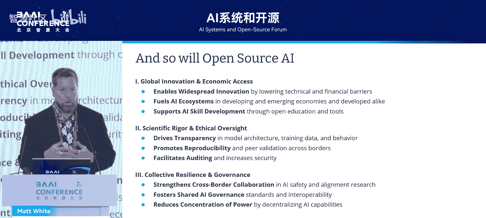

开源AI还具有强大的跨行业、跨国协作特性，这非常重要。我们应始终秉持共同责任的原则，无论身处世界何处，都能访问工具并开展协作。

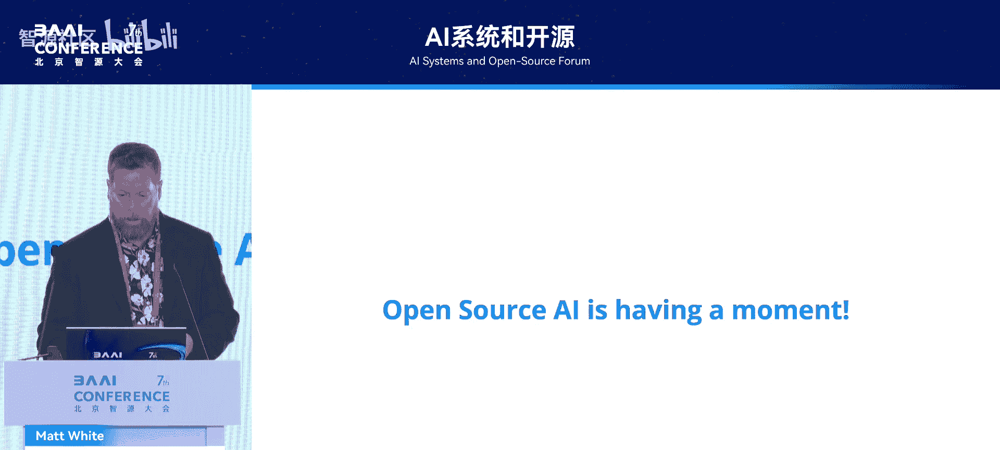

正如我们所见，开源AI正在掀起一场运动。

---

## 章节 2：开源AI面临的挑战与定义 🧩

上一节我们看到了开源AI的蓬勃发展，本节中我们来看看这场运动并非没有挑战。

开源AI领域存在重大挑战。目前，对于什么是真正的开源AI并没有非常明确的定义。这导致了“开放粉饰”现象，即一些组织发布模型时称其为开源，但并未遵循开源原则，施加了与开源社区精神不符的限制。

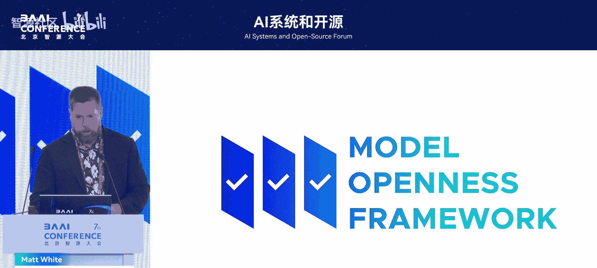

同时，出现了许多新许可证，它们施加了各种限制，当人们想将模型用于特定目的时会造成困扰，但根本上他们可能因为存在限制而无法使用。

那么，Linux基金会、PyTorch等组织如何努力解决这个问题呢？我们提出了“完整性”和“开放性”这两个概念来帮助澄清“开放”一词的含义。

在“完整性”方面，我们指的是研究论文是否完整、是否完全可复现、工作是否文档齐全。同时，当我们查看模型及其发布的组件时，是所有组件都发布了，还是只发布了部分组件？这就是我们所说的完整性，它有助于实现透明度和可复现性。

然后是“开放性”的概念。开放性本质上是一个二元变量，即要么开放，要么不开放，这主要与许可证相关。当你拥有一个宽松许可证时，就意味着模型是开放的，因为宽松许可证不会对任何下游用户施加限制。

基于这项工作，我们开发了“模型开放框架”，大约一年前发布。

我们确定了模型发布的16个核心组件，包括从评估代码、模型架构等代码工件，到用于训练、微调和对齐的数据集，再到应与模型发布配套的文档，如研究论文、数据卡片、模型卡片等。

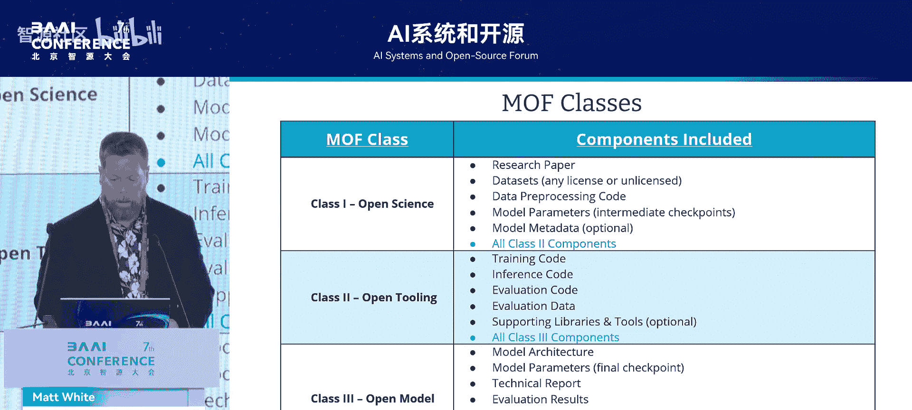

然后，我们研究了哪些许可证适用于这些组件中的任何一个。这个表格相当复杂，但本质上，我们提取了组件，将其归纳到不同领域，然后在每个领域内查看内容类型，并将内容类型映射到最适合该模态的实际许可证。

在这种情况下，图中黄色高亮部分是最重要的：我们将数据、文档和代码确定为核心组件，并找到了最适合这些特定模态的许可证。

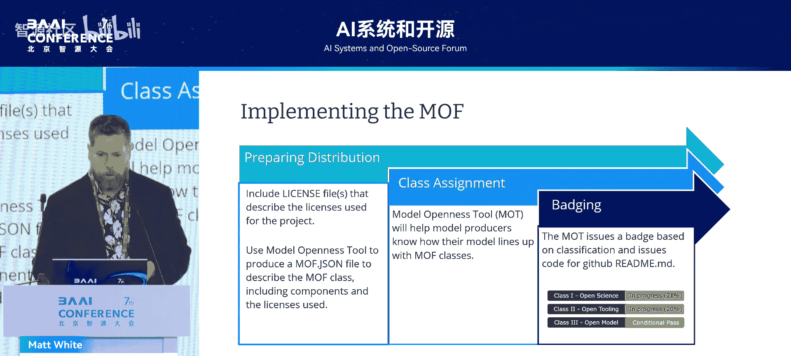

基于此，我们定义了三个等级：
*   **入门级：开放模型** - 包括模型架构、模型参数以及相关文档，确保用户知道能用模型做什么以及它是如何产生的。
*   **更高级：开放工具** - 包括训练代码、推理代码，提供更高的可见性、透明度和可复现性。
*   **最高级：开放科学** - 发布了研究中涉及的所有组件，包括非常详细的研究论文、所有涉及的数据集。拥有中间检查点也很好，虽然不是必须的，但当人们可以回顾训练过程并从过去的某个点恢复时，会非常有帮助。

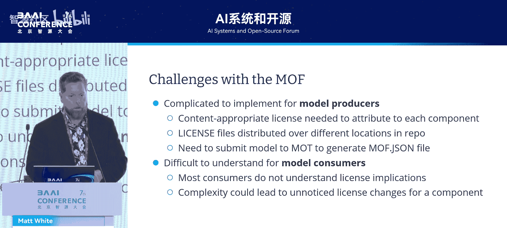

实施MOF相当直接。它要求你在代码仓库中注明将要使用的许可证，并使用我们网站上的模型开放工具生成一个MOF JSON文件。这个文件本质上是一个索引，指向你发布的所有不同组件及其附加的许可证。然后，我们可以根据这三个等级进行评级，你会获得一个徽章。这个徽章你可以用在GitHub仓库中，它是一个Markdown文本，清晰地声明了你的模型符合哪个等级。

但在实施过程中，我们发现了一些挑战。对于模型生产者来说，生成这个JSON文件变得有点复杂。他们必须使用模型开放工具，选择不同的组件。我们通常习惯于只查看仓库根目录下的许可证文件。由于这个原因，模型消费者也感到非常困惑，他们必须浏览整个仓库结构才能找到那些许可证文件。

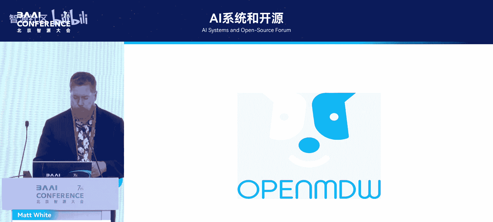

因此，挑战依然存在。

---

## 章节 3：开放模型许可证 🏛️

上一节我们讨论了MOF及其挑战，本节中我们来看看如何通过新的许可证来解决部分问题。

我们寻求解决的挑战与许可证有关，这在某种程度上是从模型开放框架衍生出来的。

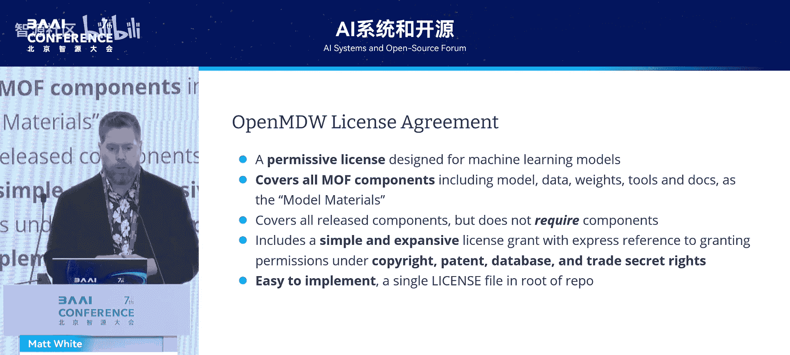

现有的开源许可证，如Apache 2.0、MIT、BSD许可证，总是围绕软件范式设计，主要考虑软件，有时是文档。但机器学习模型要复杂得多，不能直接映射到软件工件。模型参数本身可能无法获得版权或专利，它们是高维数据。此外，带有严格许可证的模型在被微调后，其许可证被转换为更宽松的许可证，这是不被允许的。

传统的开源许可证基本上只覆盖代码和文档。但模型可能包含许多工件，正如我们之前看到的，包括代码、数据和文档工件。

基于这项工作，我们开发了“开放模型许可证”。

我们调查了市面上可用于模型的许可证，大约13种都是限制性许可证，没有一种是宽松的。因此，我们着手开发了这个许可证。它是完全宽松的，并且从头开始设计，适用于机器学习模型，包括深度学习模型、经典机器学习模型、统计机器学习模型。

它涵盖了MOF中的所有组件，即我之前展示的16个组件，包括模型架构、数据、权重等。在许可证中，我们统称这些为“模型材料”。它确实涵盖了所有发布组件，但并不要求你发布所有组件。MOF主要是根据你以开放许可证发布了多少组件来进行分类，而这里我们只解决许可证方面的问题。

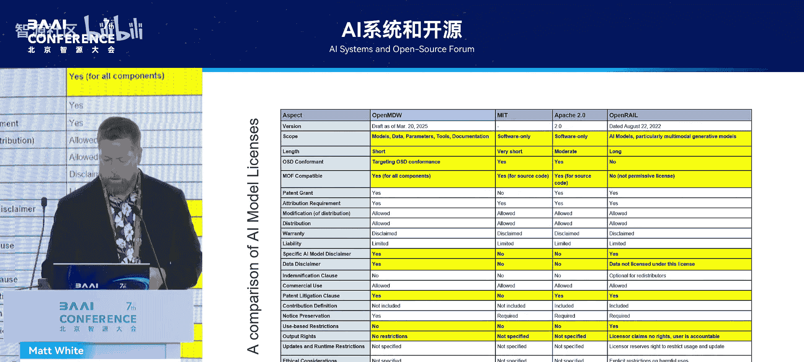

此外，它包含了专利诉讼终止条款。也就是说，如果有人作为模型生产者起诉你专利侵权，他们将失去使用你模型的所有权利。它还涵盖了专利、数据库和商业秘密。

它非常易于实施。它是一个单一的许可证文件，放在你的GitHub仓库或Hugging Face等平台的仓库中。

这就是该许可证。它不到一页，非常简洁，性质上非常像MIT许可证。我们包含了不少免责声明。需要注意的是，当你构建并发布一个模型，并使用此许可证时，如果你也发布数据集，它们将受此许可证覆盖，除非你使用另一个许可证来覆盖它。开放模型许可证是一个全局许可证，它会覆盖你发布的所有组件，但它100%兼容其他许可证。如果你想用不同的许可证（如CC BY）覆盖你的数据集，这完全可以接受。

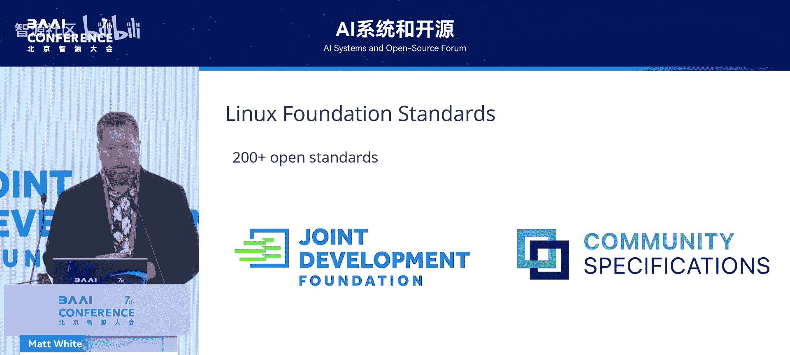

因此，这个许可证非常具有扩展性且易于理解。

快速比较一下开放模型许可证与该领域曾使用的其他许可证：传统上，Apache 2.0或MIT在过去五六年曾被用于覆盖模型，但我们已经确定它们不足以全面覆盖所有工件。开放模型许可证的范围涵盖了所有这些工件，而其他许可证则没有。OpenRail确实覆盖了所有工件，但它是一个限制性许可证。我们的目标是符合OSD（开源定义），该许可证也符合欧盟AI法案对开放模型的定义。此外，它包含了针对AI的特定模型免责声明、数据免责声明等许多其他许可证未涵盖的内容。

---

## 章节 4：生态系统与开放标准 🔗

上一节我们深入了解了新的许可证，本节中我们来看看支持开源AI的生态系统和开放标准的重要性。

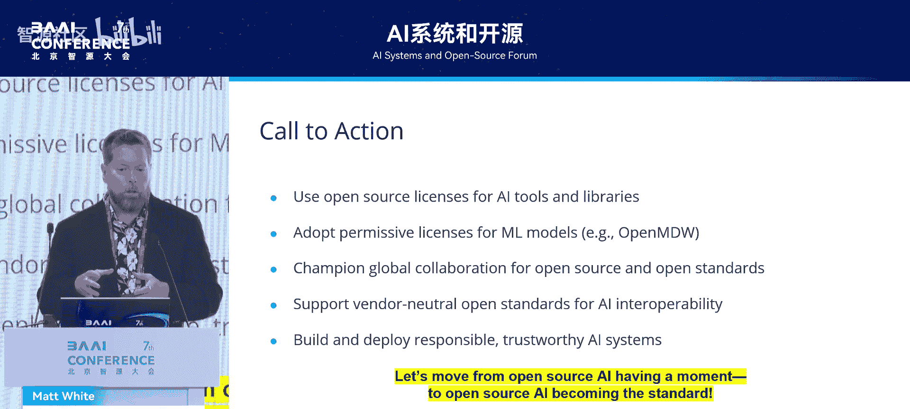

我简要介绍一下Linux基金会中涉及开源AI的一些项目。其中一些在PyTorch基金会，一些在LAI数据基金会，一些在CNCF和其他基金会。我们正在持续发展一个由高度可互操作项目组成的强大生态系统，以支持AI研究和生产化。其中最主要的是PyTorch、VLLM。Jupyter也是Linux基金会的一部分。我们最近还将DeepSpeed引入了PyTorch基金会。

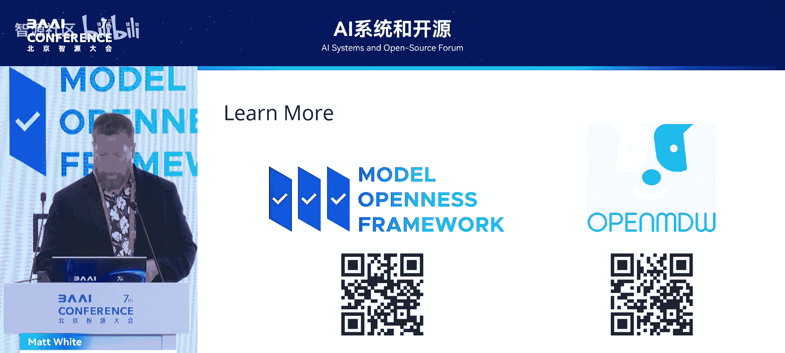

不太为人所知的是，Linux基金会实际上是200多个不同开放标准的所在地。因此，当我们展望一个AI更加不可或缺、有更多创新、正在构建更多互操作性和基础设施以及新应用框架的世界时，前瞻性地看待开放标准非常重要。在AI研究中我们尚未投入太多精力于此，但现在它正变得越来越重要。我们有MCP、A to A Agency等，该领域有很多工作正在进行，有些围绕上下文，有些围绕智能体通信。但同样重要的是，我们也要在开放标准上进行协作。

---

## 章节 5：总结与行动呼吁 📝

我将留下一些最后的建议：
1.  **在适当的地方使用开源许可证**：请拥抱开源，我们需要继续构建一个丰富的开源AI生态系统。
2.  **强烈考虑使用开放模型许可证进行模型发布**：如果你不想发布你的数据，这完全可以接受，但请考虑使用更适合模型的许可证，而不是Apache或MIT。
3.  **在开源和开源AI中继续拥抱全球协作**：现在是AI发展的伟大时代，但当我们都为共同目标一起努力时，这个时代会更加美好。
4.  **开始支持更多供应商中立的开放标准**：规范将被开发，社区将采纳它们，但将这些规范移入开放标准机构是正确的前进道路。我们正是通过这种方式在开放和可互操作的协议上构建了互联网。
5.  **始终构建并部署负责任且可信赖的AI系统**：采用负责任的AI框架，如生成式AI公域的生成式AI负责任框架。当你在考虑采用生成式AI框架时，这些都是很好的起点。

因此，我呼吁，让我们推动开源AI从仅仅拥有一个“时刻”，转变为成为未来的标准。

如果你想了解更多关于模型开放框架或开放模型许可证的信息，请随时扫描这些二维码。

---

## 总结
在本节课中，我们一起学习了开源AI的核心价值与当前机遇，探讨了其在透明度和协作方面的优势。我们也深入分析了开源AI面临的挑战，特别是定义模糊和许可证混乱的问题，并介绍了“模型开放框架”作为量化开放性的解决方案。接着，我们了解了专为AI模型设计的“开放模型许可证”，它旨在提供清晰、宽松的法律框架。最后，我们展望了开源AI生态系统与开放标准结合的重要性，并获得了关于如何负责任地参与和贡献于开源AI生态系统的具体行动指南。