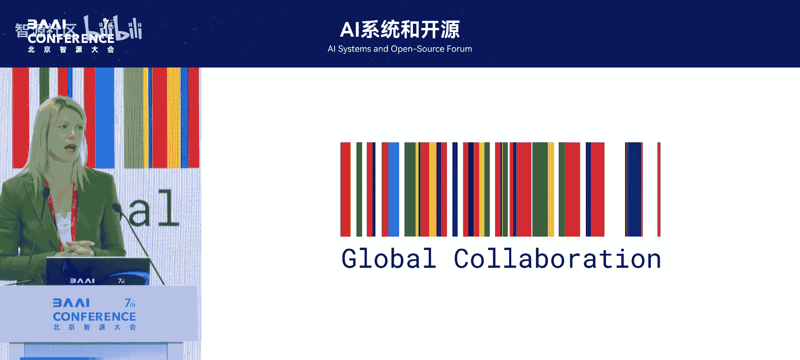
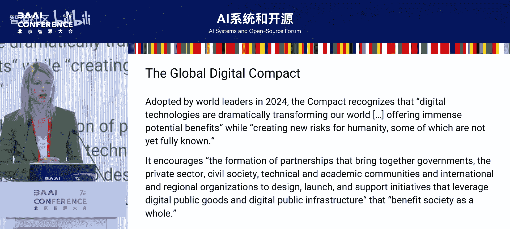
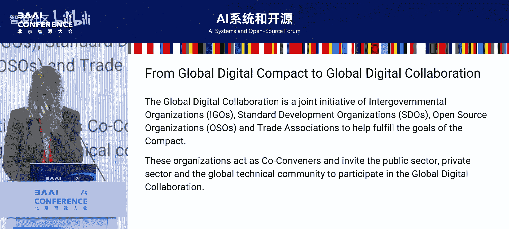
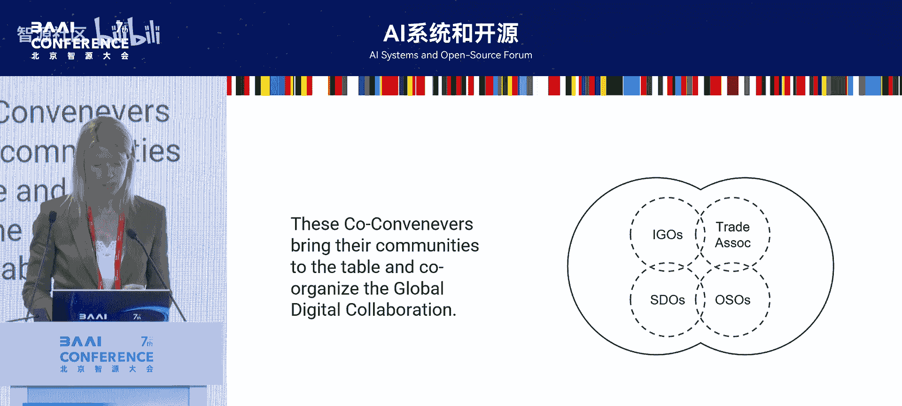
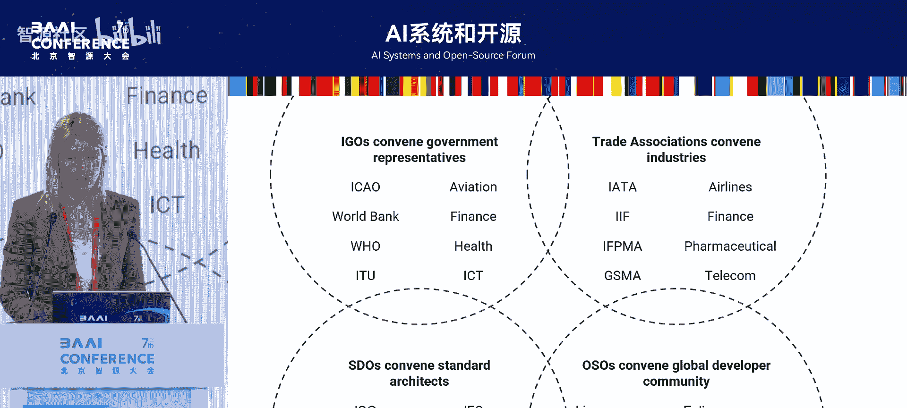
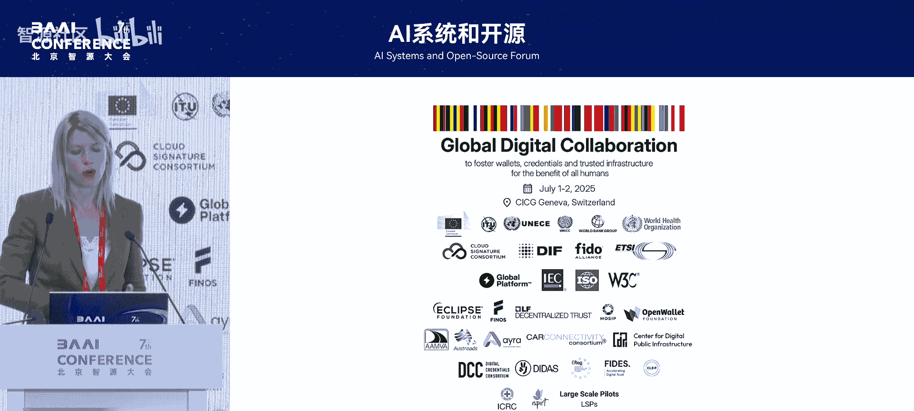
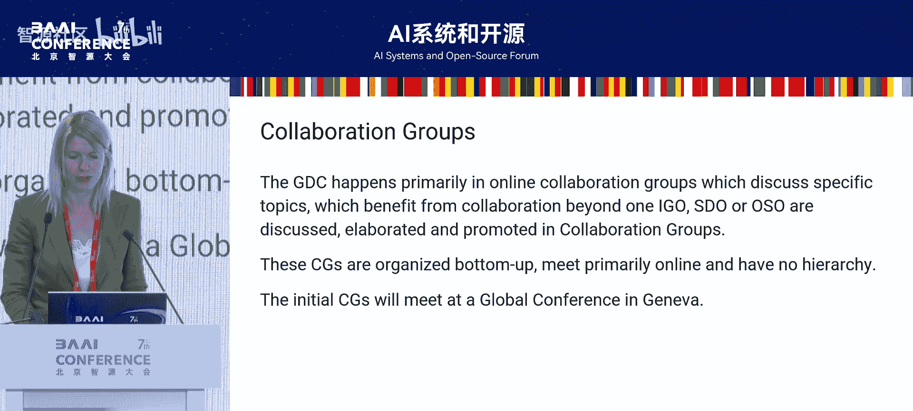
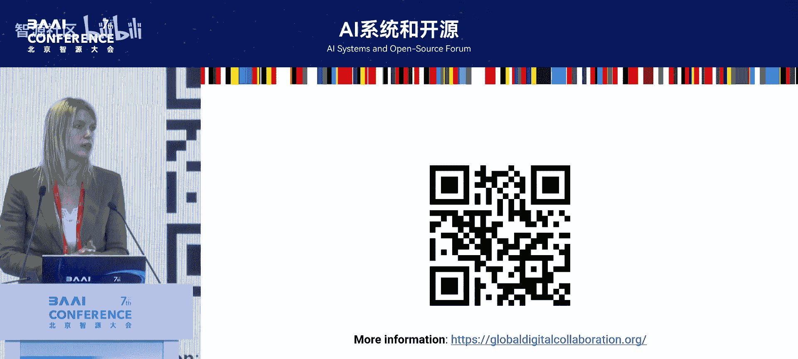
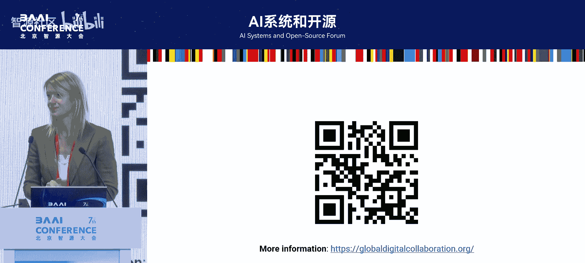

# AI系统和开源-p10-Bridging-Borders-Open-Source-and-AI-Powering-Global-Digital-Interoperability：Rut



在本节课中，我们将学习Ruth在2025北京智源大会上分享的核心内容。她介绍了如何通过开源与人工智能推动全球数字互操作性，并重点阐述了一项旨在促进全球协作的新倡议——“全球数字协作”的诞生背景、治理模式及即将举行的日内瓦会议。

---

## 概述：全球数字协作的挑战与机遇

数字转型为我们的生活带来了巨大利益，同时也带来了欺诈、安全等新风险。如何平衡不同发展阶段的痛点，确保数字资源的公平治理，成为全球性挑战。去年达成的《全球数字契约》呼吁包括学术界、民间社会在内的公共和私营部门建立伙伴关系，共同应对这些挑战。



然而，历史经验表明，让政府、企业、开源社区等不同利益相关方在平等基础上有效协作并非易事。无论是互联网名称与数字地址分配机构（ICANN）的政府咨询委员会模式，还是互联网治理论坛（IGF），都存在一方感觉未能平等参与的问题。这凸显了建立一个真正中立、能让所有利益相关方平等协作的空间的必要性。

## 新倡议的诞生：全球数字协作

基于上述背景与历史经验，“全球数字协作”倡议应运而生。该倡议旨在为《全球数字契约》提供一个具体的实施路径。

**核心理念**是：科技公司、开发者、开源组织、标准开发组织、政府、国际政府组织、民间社会和学术界等所有利益相关方，必须在一个**中立空间**内，以**平等地位**共同工作。

该倡议的一个具体成果是定于7月1日至2日在日内瓦举行的会议，并计划在7月2日正式启动该倡议。

## 独特的治理模式：汇聚而非重建

“全球数字协作”模式的一个显著特点是**不重复造轮子**。全球已有许多优秀的组织和社区围绕相关议题开展工作，但往往处于“孤岛”状态。



该倡议的解决方案是邀请各领域的**共同召集人**参与。这些共同召集人包括标准开发组织、开源组织（如AI或Linux基金会）等。每个共同召集人将其代表的社区带入这个协作结构，并作为该社区的代表发声。

**治理公式**可以概括为：
```
全球数字协作 = ∑(各社区共同召集人)
```
这意味着，倡议本身并非新建一个实体，而是构建一个高层次的协调框架，让现有的优秀社区和倡议能够更好地协同工作。



## 利益相关方与参与方式

那么，不同的利益相关方如何参与这个全球协作呢？



以下是主要的参与群体及其角色：
*   **行业协会**：例如国际航空运输协会（IATA）代表航空业参与。
*   **开源组织**：例如本次活动的主办方，汇聚广大开源开发者社区。
*   **标准开发组织（SDOs）**：提供相关技术标准。
*   **政府间组织（IGOs）**：例如世界银行代表金融领域，世界卫生组织代表各国卫生部。

在这种结构下，具体的参与方（如某国卫生部）将通过其所属的政府间组织（如世卫组织）的注册系统来报名参加活动。这种方式确保了各领域的有序参与和代表性。

## 日内瓦会议议程预览

日内瓦会议将是一个内容丰富的实践起点。议程安排体现了从政策分享到深度研讨的渐进过程。

**第一天上午**：政策与案例分享
各国政府机构将分享其数字身份、钱包等领域的现有政策、法规及实践案例。例如：
*   欧盟委员会将分享新发布的欧盟数字钱包法规。
*   韩国将与三星等公司共同展示其进展。
*   美国商务部将讨论新兴标准与实施间的差距。

**第一天下午**：行业与用例驱动
聚焦特定行业或用例面临的挑战：
*   行业协会将探讨国际贸易数字化转型的挑战。
*   红十字会将从人道主义角度，分享如何为难民提供与当地政府凭证兼容的数字身份。
*   世界银行将与全球南方国家探讨安全参与数字经济面临的连接、能力建设等挑战。

**第二天**：深度研讨与协作规划
在第一天的基础上进行深入探讨：
*   标准开发组织将深入介绍数字身份和钱包相关的关键标准（如ISO 18013）。
*   各方将总结核心议题，并规划成立具体的协作小组，针对如AI模型、设备安全要求等议题开展后续合作。

## 总结与行动号召



本节课我们一起学习了“全球数字协作”倡议。它是对《全球数字契约》的积极响应，旨在创建一个让所有数字生态利益相关方都能平等协作的中立空间。其独特的治理模式在于汇聚而非取代现有优秀社区，通过共同召集人机制实现高层次协调。

日内瓦会议将是该倡议的首次重要实践，会议议程涵盖了从政策对接到技术标准的全方位讨论。如果您或您的组织希望参与这一全球协作，可以通过所属的行业协会、开源组织或政府间组织进行了解和注册，共同为构建互操作、可信的数字未来贡献力量。







---
**会议信息**：
*   **名称**：全球数字协作日内瓦会议
*   **时间**：7月1日-2日
*   **注册**：请通过您所属的共同召集人组织进行查询与注册。
*   **网址**：global-collaboration.org (请参考原文幻灯片获取最新信息)