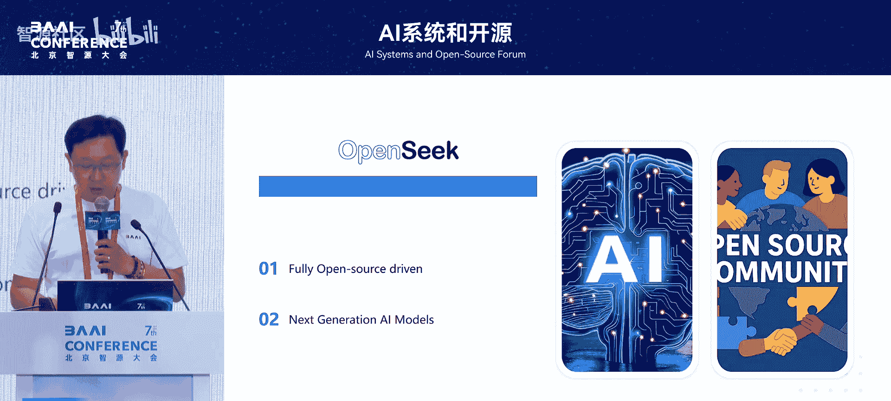
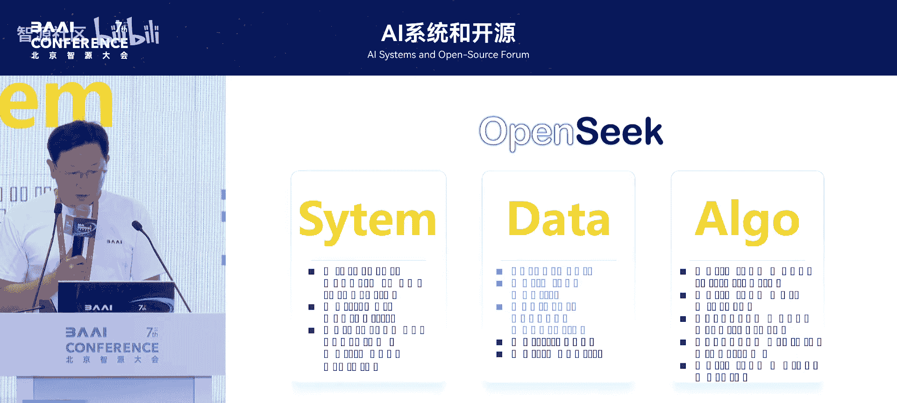
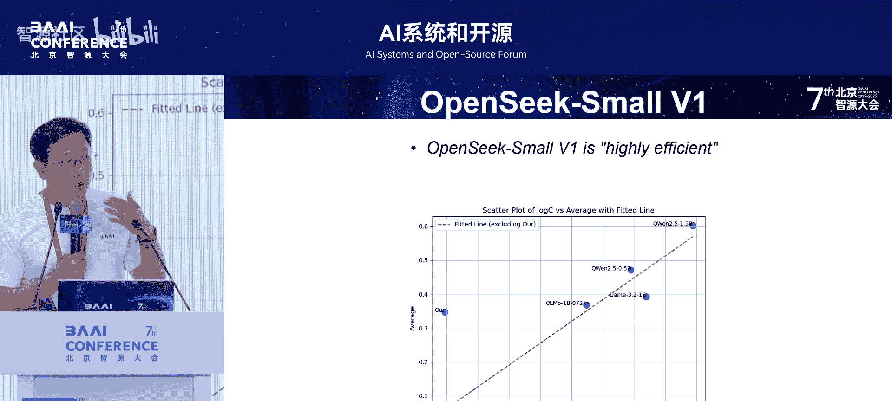
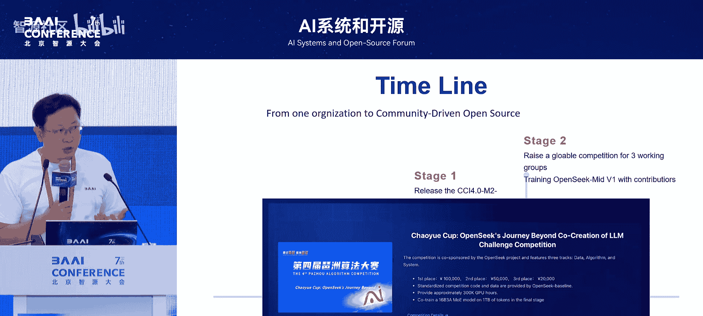

# AI系统和开源-p11-开源共建大模型项目OpenSeek：刘-广

在本节课中，我们将学习由智源研究院刘广博士介绍的OpenSeek项目。该项目旨在通过开源社区协作的方式，降低大模型训练的门槛，共同构建高质量的大语言模型。

## 项目背景与挑战

上一节我们介绍了大模型开源生态的现状，本节中我们来看看当前大模型训练面临的核心挑战。

大模型看似离我们很近，因为各种开源模型和API接口已经非常普及。然而，要真正从零开始训练一个模型，其门槛依然非常高。对于研究机构或学生而言，这面临着诸多挑战。

**核心挑战**可以概括为以下三点：
1.  **数据**：需要大规模、高质量的训练数据。
2.  **系统**：需要高效的分布式训练框架和算力支持。
3.  **算法**：需要先进的模型架构和训练策略。

目前，大模型的训练资源高度集中，例如DeepSeek、通义千问等团队需要调动整个公司的大量资源。OpenSeek项目的目标正是**降低这一门槛，将成本降下来**。

## 开源共建模式

那么，如何通过开源社区的方式训练模型呢？国外已有先例，例如欧洲的Big Science项目。他们汇聚了全球60多个国家、1000多名研究人员，投入330万欧元，历时一年训练出了BLOOM大模型和ROOTS数据集。

OpenSeek项目借鉴了Big Science的经验，并结合当前实际情况，提出了一种**混合共建模式**。

以下是该模式的核心要点：
*   **决策路径**：结合开源社区的反馈与核心团队的专业经验，共同决定技术路线。
*   **贡献来源**：欢迎个人开发者、研究机构等不同背景的贡献者参与。
*   **资金来源**：接纳多渠道的资金支持，不依赖于单一团体。

## 项目进展与成果

项目自2025年2月启动以来，已运行了5个月，并完成了第一阶段的工作。

以下是第一阶段取得的主要成果：
1.  **发布C4.0数据集**：这是一个35TB规模的双语（中/英）数据集，其中包含4.2TB的高质量中文数据。
2.  **训练小尺寸模型**：发布了一个仅需40GB显存（单卡）即可运行的小模型，极大降低了参与者的体验门槛。
3.  **开源标准化工具链**：公开了完整的数据处理与模型训练代码，方便社区复现和使用。

## 聚焦效率提升

DeepSeek等团队的成功给了我们一个重要启示：应对挑战的关键在于**提升效率**，即提升数据效率、系统效率和算法效率。

OpenSeek项目围绕这三个方向设立了对应的工作组。

### 1. 系统工作组
目标是支持如**MoE（Mixture of Experts）** 之类的高效模型结构，并优化训练框架。目前已与敖玉龙博士的**FlexFlow**团队合作，支持了DeepSeek-V3架构的训练，并正在优化训练效率。

### 2. 数据工作组
目标是构建更大规模、更高质量的数据集。分析表明，在相同算力投入下，**MoE结构模型（红色曲线）的性能显著优于稠密模型（Dense Model）**。因此，打造高效的数据集至关重要。

当前，推理能力（COT，Chain-of-Thought）的构建是数据工作的重点。研究显示，模型的推理能力并非仅由后续的强化学习阶段带来，在预训练数据中融入推理数据是一大挑战。

我们对现有开源数据集进行了分析：
*   **Pile**：规模较小，质量过滤不完善，缺乏COT数据。
*   **RefinedWeb/JaMa**：规模巨大，但噪声较多，需精细处理。
*   **FineWeb/Limac**：结合了数据合成技术，质量更高。

基于此，C4.0数据集在以下四个方面进行了优化：
1.  **多来源与大规模**：联合20多家机构捐赠的高质量数据。
2.  **质量优化**：结合规则与模型进行严格过滤。
3.  **推理增强**：合成了4.3亿条涵盖数学、代码、网页等多领域的COT数据。
4.  **流程开源**：完整的数据处理流水线（Pipeline）已全部开源。

实验证明，使用C4.0数据训练的0.5B小模型，在数据规模扩大20倍的情况下，性能优于使用其他数据集训练的模型。同时，加入COT数据训练后，模型的反思能力得到了稳步提升。

### 3. 算法工作组
目标是实现高效的模型架构与训练策略。项目开源了两个1.4B参数的**MoE结构基线模型**，它们基于DeepSeek-V3架构，并包含诸多工程优化。

这两个模型参数量小，硬件友好，旨在为社区提供一个可以轻松上手、复现和改进的坚实基础。使用0.72T token数据训练的模型，在同等算力投入下，其性能明显优于同类小模型，验证了数据和模型结构的高效性。

## 低门槛参与方案

为了让更多人能真正参与到大模型训练中，项目提供了一套**极低门槛的完整训练流水线**。

以下是该流水线的核心组成部分：
*   **数据配比**：公开了C4.0数据集的使用建议。
*   **模型代码**：开源了1.4B MoE基线模型的完整训练代码。
*   **评测基准**：提供了标准的模型评测代码。
*   **单卡支持**：确保整个流程可以在单张GPU上运行。

## 社区与未来计划

目前，OpenSeek项目已有200多位贡献者，并定期举行双周会同步进展。项目已进入第二阶段，核心目标是**解决算力资源问题**。

为此，项目联合**琶洲算法大赛**，设立了OpenSeek专项赛道，分为数据、系统、算法三个方向。参赛者不仅可以获得奖金，还能得到宝贵的算力支持，从而更深入地参与到项目共建中。

## 总结

本节课中我们一起学习了OpenSeek开源共建大模型项目。该项目通过**社区协作的混合模式**，致力于降低大模型训练的门槛。目前已在**高质量数据集（C4.0）、高效基线模型和完整训练工具链**方面取得了阶段性成果，并通过设立比赛赛道等方式，积极吸引更多开发者和研究者参与，共同推动大模型开源生态向“训练过程开源”的下一阶段发展。