# 下一代AI路径探索-p02-关于下一代生成模型与架构的思考：石佳欣

在本节课中，我们将学习石佳欣博士关于下一代生成模型与架构的思考。核心内容包括：当前大模型面临的数据瓶颈、生成模型的基本原理、现有Transformer架构的局限性，以及一个统一理解各类新架构的“测试时回归”框架。我们还将探讨超越自回归模型、迈向任意次序生成与自我纠错能力的未来方向。

---

## 数据瓶颈与模型拟合能力 📈

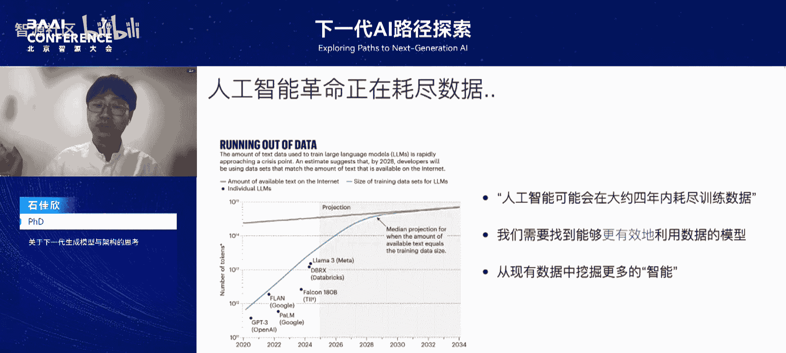

上一节我们介绍了课程背景，本节中我们来看看当前大模型面临的核心挑战。

从GPT系列开始，大语言模型驱动的规模化扩展已发展近四到五年。当前研究和开发中面临的一个关键问题是：大模型即将用完互联网上所有可用数据。下图展示了互联网数据增长曲线（红线）与大模型使用数据量（蓝线）的对比。根据预测，大约四年后我们将耗尽所有数据。

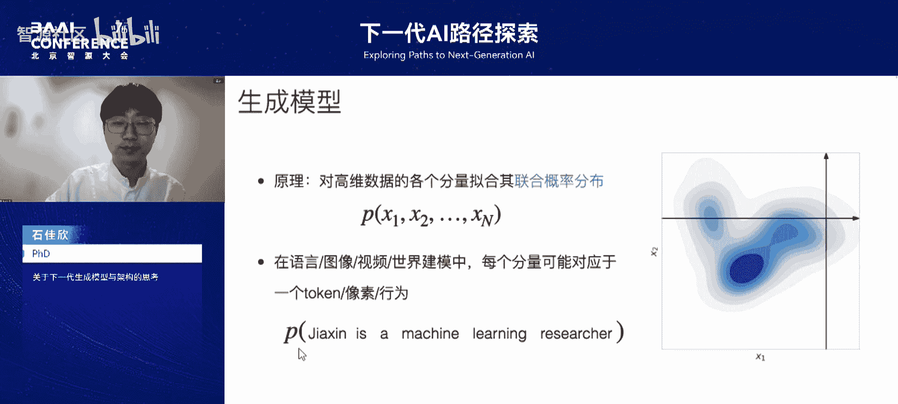


这非常严峻，因为大模型的扩展定律要求数据量随模型规模同步增长。若无更多数据可用，扩展定律将失效，模型进化速度也会停滞。因此，一个重要的研究问题是：**我们需要找到能更有效利用数据的模型**，即能否发明新模型，从现有数据中挖掘出更多价值。

这里的“模型”特指生成模型，即生成式AI。其原理非常简洁：**对感兴趣的高维数据的各个分量，拟合其联合概率分布**。无论是语言、图像、视频模型，还是包含人类动作的世界模型，其原理都是拟合这个概率分布。每个分量在语言中是一个词（token），在图像/视频中可能是一个像素或一个动作。

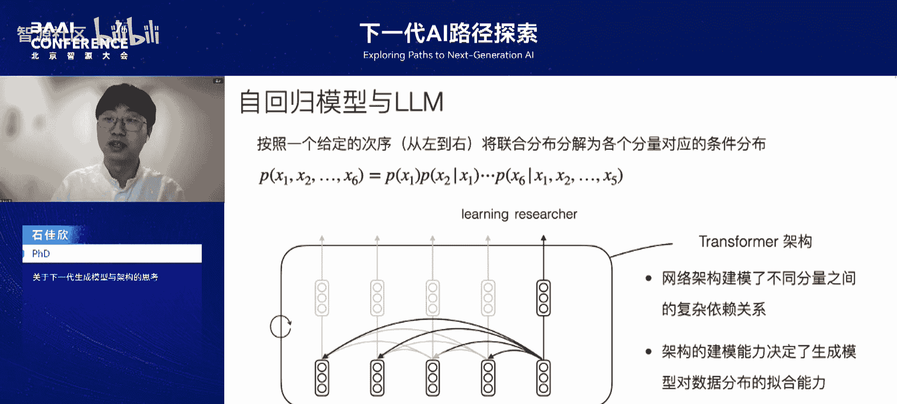

以语言模型为例，建模一个句子相当于生成它。其中每个词成为一个分量，模型需要捕捉这些分量之间的依赖关系和联合分布。这个联合分布可能非常复杂，甚至是多峰的，即使两个分量间的依赖关系也可能很复杂，如下图所示。


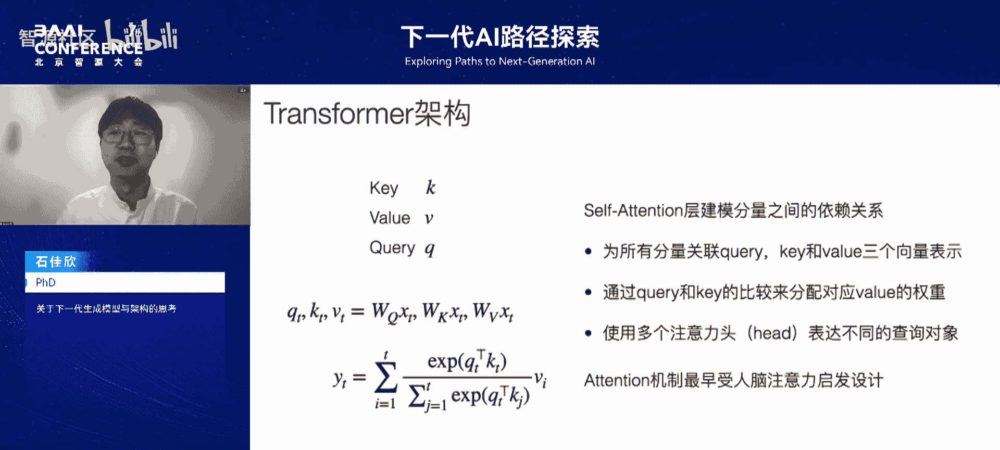

机器学习中有许多方法帮助建模复杂的联合概率分布。其中一个广为人知的想法是**自回归模型**，即当前大语言模型采用的方法。其核心思想是：在给定次序（如语言从左到右）下，将联合分布分解为各分量对应的条件分布。

例如，对于句子“in learning research”，每个条件分布对应给定前面所有词预测下一个词。给定“in learning”，下一个词很可能是“research”。模型使用**Transformer网络架构**来建模当前词与历史词间的复杂依赖关系，并通过最大似然法从数据中学习网络参数。

因此，**架构本身的建模能力决定了生成模型拟合数据分布的能力**，进而决定了模型最终能学到多少知识。这里需要强调的是，“拟合能力”指拟合数据背后真实分布的能力，而非单纯拟合已有训练数据的能力。后者可能导致过拟合。真正拟合好真实分布，才能获得更多知识，这决定了模型能力的上限。

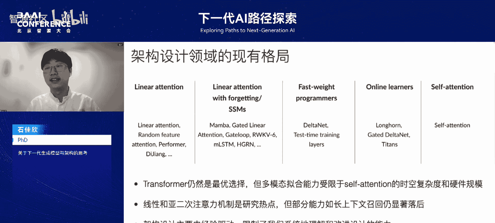

---

## Transformer架构与注意力机制回顾 🔄

上一节我们讨论了模型拟合能力的重要性，本节中我们回顾实现这一能力的核心架构——Transformer。

大家可能熟悉Transformer架构的细节，这里简要重复，因为后续讨论会涉及。Transformer主要通过**自注意力层**来建模分量间的依赖关系。

以下是自注意力机制的核心计算步骤：

1.  将每个时刻的分量映射为三个向量表示：查询（`Q`）、键（`K`）、值（`V`）。
    ```python
    # 伪代码表示
    Q = linear_q(input)  # 查询向量
    K = linear_k(input)  # 键向量
    V = linear_v(input)  # 值向量
    ```
2.  在每个时刻，用当前时刻的查询向量`Q_t`与过去所有时刻的键向量`K_i`进行比较。
3.  通过Softmax计算相似度权重，分配给对应的值向量`V_i`。
4.  对值向量进行加权平均，得到当前时刻的输出。
    ```python
    # 注意力权重的计算（简化版）
    attention_weights = softmax(Q_t @ K_i.T / sqrt(d_k))
    output = attention_weights @ V
    ```

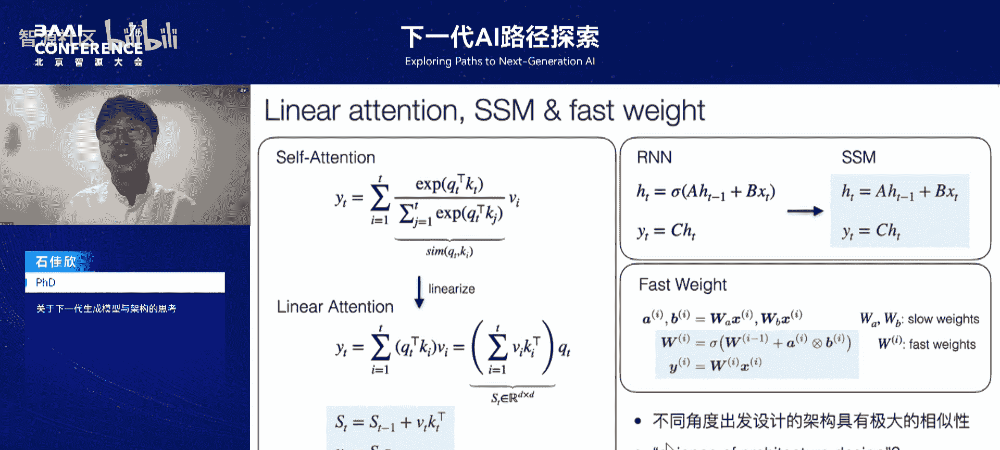

这个计算过程会被复制多份，形成多个“注意力头”，每个头旨在捕捉不同的查询模式。注意力机制最初受人类注意力启发而设计，是一个经验性设计，后经实验验证了其有效性。

---

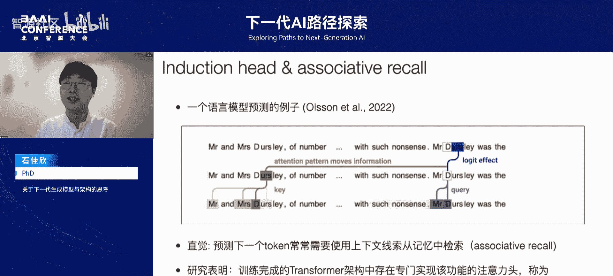

## 下一代架构的探索与挑战 🚀

既然主题是下一代AI技术路线，一个自然的问题是：下一个像Transformer这样的突破性架构何时出现？它是什么？

当前架构设计领域流派众多。总体来看，基于自注意力的原始Transformer仍被认为是所有任务上的最优选择。但同时，人们也意识到，模型的多模态拟合能力受限于自注意力机制的**平方级时空复杂度**和硬件规模。处理长时间、高维数据时，无法在细粒度上使用Transformer。

因此，**线性和亚二次注意力机制**成为研究热点。上图列举的大部分工作都致力于将时空复杂度降至线性水平。但目前看来，这些新架构在长上下文召回能力上仍显著落后于原始Transformer。

在我看来，整个领域还有一个更大的问题：**架构设计目前仍主要由经验驱动**（试错模式），这限制了我们系统性地理解和改进设计。

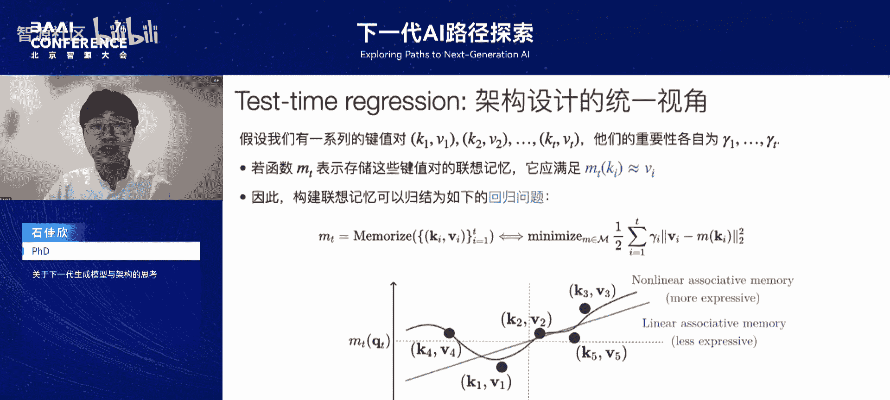

以下是几个新架构设计思想的例子：

*   **线性注意力**：其核心思想是从自注意力公式出发，将Softmax相似度计算线性化（如直接变为`Q`和`K`的累积），从而将整个计算化简为线性复杂度。它通过增量更新一个内部状态矩阵来实现。
*   **状态空间模型**：其思想源于循环神经网络，但将隐含状态的非线性更新变为线性更新，最终形式也是线性更新一个状态并读取输出。
*   **快速权重**：将神经网络权重分为慢速权重（通过训练更新）和快速权重（在推理时通过慢速权重的输出快速更新）。快速权重类似于RNN中的状态。

比较这三种架构的计算模式，会发现极大相似性：都通过线性更新内部状态，且线性注意力和快速权重都通过当前数据表示的外积来更新状态。它们非常相似，却是从不同角度被提出和发现的。

这促使我们思考：**所有这些架构设计背后，是否有一个统一的基本原理？** 我们能否找到一条**科学的架构设计**之路？

---

## 科学的架构设计：测试时回归框架 🧪

上一节我们提出了架构设计需要科学原理的问题，本节中我们通过一个具体例子来探索解决方案。

在大语言模型的使用中，我们注意到它具备一种能力：**根据上下文线索预测下一个词**。例如，在一个故事中多次出现“Mr. D_”后，模型需要预测下划线部分的词。正确的方法是检索最近的上文，找到上一次“Mr. D_”出现时跟随的词是什么。这个行为被称为**关联召回**。

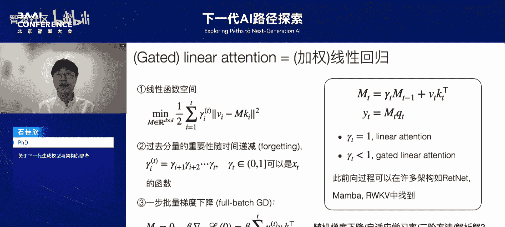

理论研究显示，在训练完成的Transformer中，存在专门实现此功能的注意力头，称为“归纳头”。这实际上是大模型中一个非常基本的功能单元。

基于此，我们认为架构设计的一个核心要素是实现**联想记忆**。联想记忆的功能是将输入数据中的上下文映射关系，以键值对（KV）形式存储到记忆中。当有一个查询（Q）到来时，记忆函数会将其映射到对应的值（V），即从记忆中检索。

数学上，可以将其抽象为：从已有的键值对集合构造一个函数`M`，该函数能根据输入`Q`给出对应的输出`V`。

我们提出了一个名为**测试时回归**的架构设计框架。假设我们有一系列键值对`(K_i, V_i)`，每个对都有一个重要性权重`γ_i`。我们希望构建一个联想记忆函数`M`，使其在输入为`K_i`时，输出近似为`V_i`。

因此，构建联想记忆的过程可归结为以下回归问题：找到函数`M`，使其能拟合所有见过的键值对映射。对于新查询`Q`，就用`M(Q)`来检索对应的值。这可以写成一个优化问题：
`min_M Σ_i γ_i * || M(K_i) - V_i ||^2`

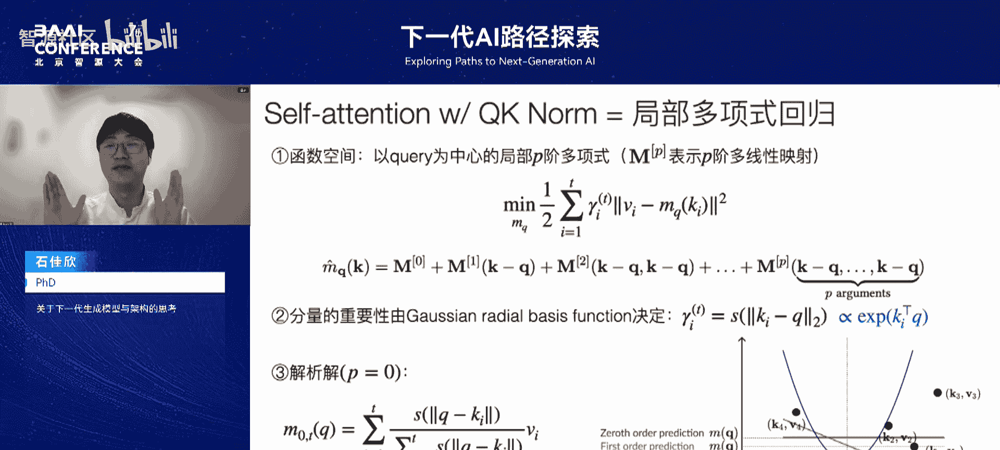

一旦有了这个回归问题的视角，就出现了**函数空间的选择**问题：可以选择线性函数进行线性回归（表达能力受限），也可以选择非线性函数（能拟合更复杂的非线性映射）。这决定了架构的表达能力上限。

---

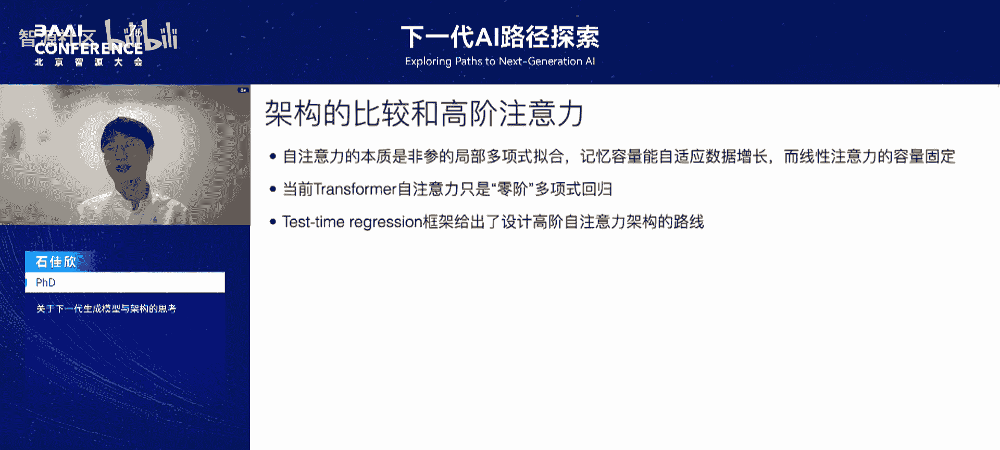

## 应用框架：统一理解现有架构 🧩

有了测试时回归框架的大致想法，我们可以使用“三步法”来设计具备联想记忆的架构。这三步对应回归问题中的三个要素：

1.  **分配重要性**：为每个键值对分配相对重要性权重`γ`。
2.  **选择函数空间**：选择用于解决优化问题的函数空间`F_M`。
3.  **选择求解算法**：选择回归问题的求解算法（如梯度下降、二阶方法或解析解）。

最终，求解算法可以直接转化为网络的前向传播过程，即我们所需的架构。

利用这个框架，我们可以重新理解许多现有架构：

*   **线性注意力与门控注意力**：它们等价于一个**加权的线性回归问题**。
    *   **函数空间**：选择线性函数（对应一个D×D的矩阵`M`）。
    *   **重要性权重**：选择基于时间的指数衰减遗忘机制，`γ`随距离递减。
    *   **求解算法**：采用一步全批量梯度下降，并选择零矩阵作为初始点。
    *   最终得到的解`M_T`可以写成增量更新形式，与线性注意力的公式完全一致。当`γ=1`（不遗忘）时，就恢复了原始注意力。
*   **原始自注意力**：我们能恢复原始的自注意力机制，但需要一个条件：使用大语言模型中常见的**稳定训练技术**，即在注意力计算前对`Q`和`K`进行`L2`归一化变换（称为`QK`归一化）。
    *   **函数空间**：选择以当前查询`Q`为中心的局部`P`阶多项式空间（一种非参数回归常用的空间）。
    *   **重要性权重**：由高斯径向基函数核决定，即距离当前`Q`越近的`K_i`越重要。
    *   **求解算法**：在`P=0`（零阶多项式，即常数拟合）的条件下求解，得到的解恰好就是自注意力中的操作：用Softmax over `exp(Q·K)`计算权重，再对`V`加权平均。

通过这个框架，我们可以比较不同架构。**自注意力的本质是非参数的局部多项式拟合**。作为非参数模型，其记忆容量能自适应数据增长，反映在架构上就是需要枚举所有历史键进行比较，导致了平方复杂度，但也带来了容量优势。**线性注意力则是一个参数模型**，其容量由矩阵大小固定。

因此，当前的自注意力虽然比线性注意力更灵活，但它只是零阶多项式回归。一个自然的想法是：在此框架下，我们可以设计**高阶的自注意力架构**。

我们通过一个简单的非平稳时间序列记忆任务进行了理论验证。实验结果显示，不同架构的误差率排序为：线性注意力 > 自注意力（零阶）> 一阶自注意力 > 更高阶自注意力。这初步验证了不同联想记忆算法导致拟合能力的差异。

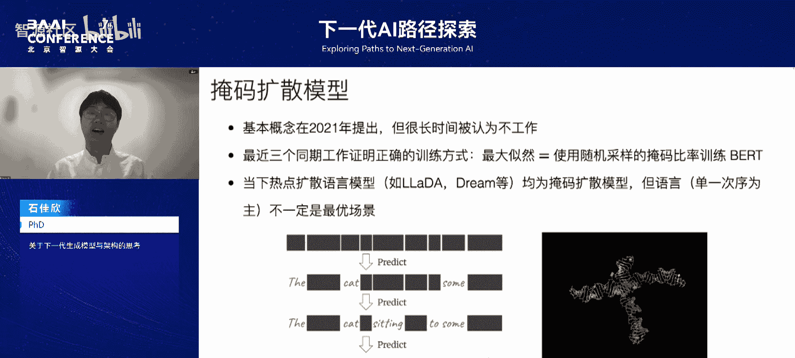

测试时回归框架几乎统一了当前所有可见的新模型架构，可以将其划分为**参数回归**和**非参数回归**两大类，并在其中根据优化方法的不同进一步细分。

---

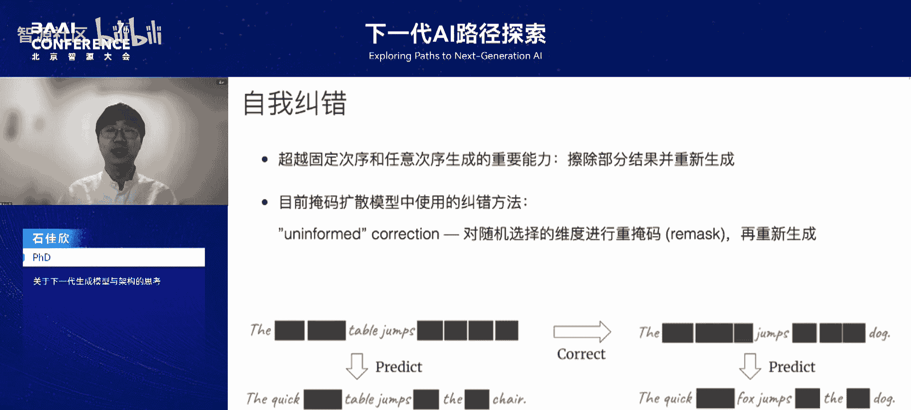

## 超越自回归：任意次序生成与自我纠错 🔮

除了自回归架构设计的科学化，我认为下一代生成模型可能在范式上有所发展。

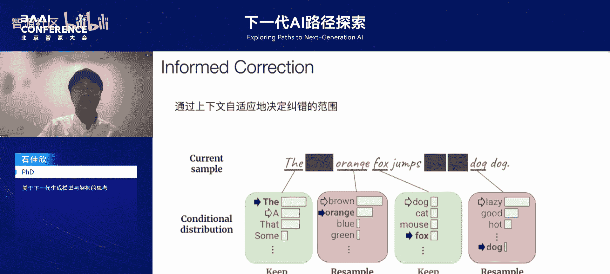

一个非常有潜力的方向是：**从单一次序生成到任意次序生成**。
*   **单一次序**：自回归模型总是按固定次序（如从左到右）对数据分量建模。
*   **任意次序**：模型能够按照任意次序很好地建模数据。

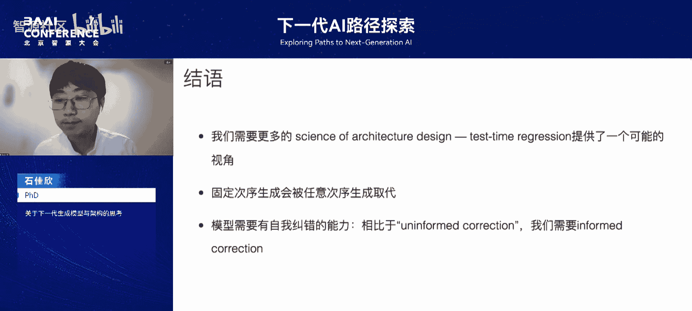

为什么需要任意次序生成？
1.  **探索新环境**：智能体探索新世界时，往往不是按固定次序，而是按任意次序逐渐熟悉。当前许多世界模型（基于自回归）存在缺陷，无法进行任意次序建模，而生物智能（如人类）很容易做到。
2.  **科学数据**：在科学领域（如分子、蛋白、基因数据），我们往往无法确定或不存在一个规范的固定建模次序。这是一个科学问题，需要任意次序生成模型。

当前，**掩码扩散模型**是任意次序生成模型的显著代表。其基本概念在2021年提出，但长期被认为不work。最近三个同期工作证明，如果正确训练，掩码扩散模型效果很好。它们证明了：对掩码扩散模型进行最大似然学习，等价于使用随机采样的掩码率训练一个BERT类语言模型。当前许多热门的扩散语言模型（如NaDa）都属于掩码扩散模型。

但语言本身是以单一次序（从左到右）为主的模态，有很强的偏置，不一定是掩码扩散模型的最优场景。我认为掩码扩散模型的未来，更可能充当帮助探索新世界的、真正的多模态模型的基石。

除了次序，另一个超越自回归的想法是：**模型不仅要能按次序生成，还要能擦除已生成结果并重新生成**，即具备**自我纠错**能力。

当前许多掩码扩散模型中的纠错方法（如“重掩码”），大多是随机选择一些维度进行掩码再重新生成，这被称为**无信息纠错**。模型在做这件事时，并没有意识到自己产生了错误。

因此，最后一个有潜力的方向是：实现**有信息纠错**。我们希望模型能通过上下文自适应地决定纠错的范围和位置，即模型能够自己定位错误，而不是随机撒掩码并希望偶然修正它。后者显然是不够智能的解决方案。

---

## 总结 📝

本节课我们一起学习了石佳欣博士关于下一代生成模型与架构的思考，主要要点总结如下：

1.  **需要更多科学的架构设计**：测试时回归框架提供了一个可能的统一视角，帮助系统化地理解和设计架构，超越当前经验驱动的模式。
2.  **要超越自回归建模**：一个重要方向是用**任意次序的生成模型**（如掩码扩散模型）取代传统的固定次序自回归模型，以更好地适应探索性任务和科学数据建模。
3.  **需要模型具备自我纠错能力**：当前的任意次序模型具有一定的纠错能力，但主要是无信息纠错。未来需要发展**有信息纠错**能力，使模型能主动定位并修正自身错误，从而提升生成模型的智能水平。

这些思考为下一代AI模型的发展提供了重要的方向指引。