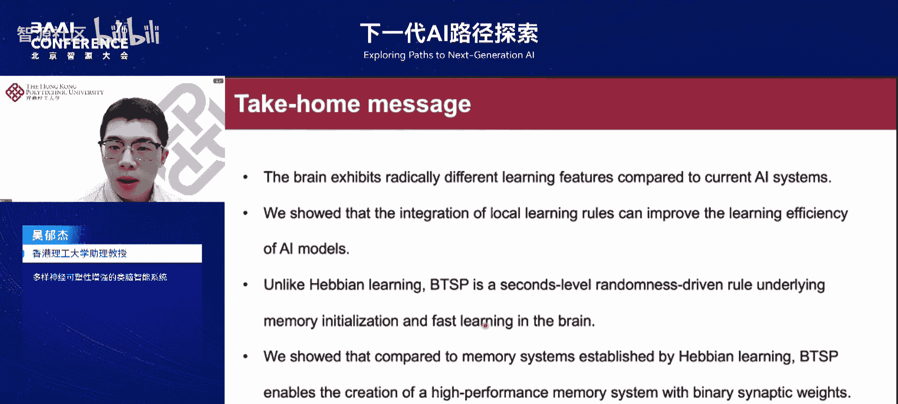

# 下一代AI路径探索-p04-多样神经可塑性增强的类脑智能系统：吴郁杰

## 概述
在本节课中，我们将学习香港理工大学吴郁杰博士关于类脑智能系统的报告。报告探讨了大脑智能对人工智能发展的启示，并分享了其研究团队在整合多样神经可塑性机制以增强AI学习能力方面的探索。我们将了解大脑学习机制与当前AI算法的差异，以及如何借鉴这些机制来构建更高效、更灵活的下一代智能系统。

---

## 大脑智能对AI发展的影响

大脑智能在人工智能发展史上扮演了两个关键角色。首先，大脑是AI发展的重要参考系。许多教科书将AI定义为执行类似于人类智能任务的系统。其次，大脑智能启发了许多重要AI技术的发展。我们可以将大脑的重要机制归纳为感知、计算和学习三个方面。

在感知层面，许多视觉和听觉神经网络借鉴了大脑的感知处理机制。例如，卷积神经网络与视觉皮层的处理机制紧密相关。在计算层面，大脑具有存算一体、稀疏并行等优秀计算特性，这些特性也启发了相关的AI研究，如存算一体计算架构和事件驱动相机等。在学习机制层面，虽然受限于观测技术，研究尚处初步，但已涌现出如神经图灵机和受大脑奖惩机制启发的强化学习等技术。

总而言之，以史为鉴，AI历史的发展与脑科学的发展存在高度一致性。

---

## 当前AI与大脑智能的对比及启示

随着大模型的涌现，越来越多人相信通用人工智能可能在未来实现。大模型和大脑是目前最接近通用人工智能的两个主要参考系。从理论角度而言，在计算效率和复杂推理方面，人类可能仍有优势。更重要的是，这两个系统的潜在计算机制存在根本性差异。

基于这些差异，前沿研究机构开始关注新型AI计算架构（如Transformer、Mamba）与大脑计算的异同。例如，对比Transformer架构与海马体学习记忆的差异，有助于我们更好地理解大脑智能，甚至改进Transformer的设计。同时，借鉴海马体的记忆机制可以发展脑启发的检索增强模块，使大模型更好地服务于人类。

此外，大脑是在资源有限条件下的高效学习系统。借鉴其学习记忆机制，对于发展在线、终身的AI系统具有重要的参考意义。

---

## 前沿研究案例：大脑机制与AI架构的关联

以下是几个展示大脑机制如何启发AI架构的前沿研究案例。

首先，Transformer架构是目前大模型的基础。牛津大学的团队提出，Transformer中的自注意力机制与大脑海马内嗅皮层的记忆和空间表征有异曲同工之处。自注意力机制的核心是使用查询（Query）与记忆键（Key）做点积，然后通过值（Value）进行加权汇总。研究表明，**Q**的操作可以用一种经典的大脑学习方式实现，而海马体的检索过程可以很好地模拟查询检索过程。此外，Transformer中提供顺序信息的位置编码，在大脑中也有类似物，即网格细胞可以实现循环位置编码的特性。

诺贝尔奖获得者Hopfield教授从计算和神经元角度提出了统一的现代Hopfield网络。在此框架下，Transformer可以在神经元回路层面实现。例如，Transformer中的**QKV**操作可以对应到两层神经元网络的前馈和反馈连接过程中。这些关联性研究为我们看待大脑智能和设计新型AI架构提供了新思路。

---

## 外生复杂性与内生复杂性

在计算智能上，AI与大脑存在显著差别。我们提出了“外生复杂性”和“内生复杂性”的概念。

当前大模型成功的关键一环是增加模型规模，即增加神经元参数和网络层数。这通常被称为**外生复杂性**，即把模型做得更大、更复杂。

然而，大脑中存在另一种计算方式，我们称之为**内生复杂性**。在大脑中，单个神经元内部就包含了非常丰富的计算机制。我们相信，大脑的这种内生复杂性可能揭示了通往高级智能的另一块拼图。

为了说明这一点，研究表明，如果利用复杂的HH神经元模型，在多个机器学习任务上，它可以实现比参数量大4倍的简单神经元模型更好或相近的性能。类似地，有科学家发现，一个单一的输出结构可以等价于三个全连接结构的计算效益。最近的《自然·通讯》文章也发现，通过引入树突模块，可以用更少的参数量实现相近甚至更好的机器学习性能。

---

## 大脑智能的未来优势场景

现有的AI智能已经足够强大。那么在未来，大脑智能在哪些场景可能还存在优势？要回答这个问题，需要看到大脑学习与当前AI学习的一个本质区别：两者的学习目标不同。

在进化过程中，大脑的主要目标是更好地生存和适应环境。而当前的AI学习更多是在拥有足够算力的前提下，追求在特定数据集上取得更好的性能。因此，在计算资源有限的环境中，大脑的许多学习和记忆机制可以被借鉴。

近年来，已有许多工作指导我们如何借鉴大脑的学习记忆机制来实现更好的终身学习系统。例如，有研究受行业机制启发，在学习新任务时，将新任务存储在与旧任务正交的空间里；另有研究从果蝇汲取灵感，提出一种主动遗忘机制，可以更好地遗忘旧任务，同时增强学习新任务的灵活性。

---

## 下一代AI的关键：学习算法的创新

放眼未来，从类脑智能的角度出发，学习算法的创新可能会对AI发展带来重大影响。我们知道，误差反向传播算法（BP）是当前AI取得强大性能的基础。但可以设想，对于一个非常复杂的系统，每次学习更新都需要所有参数参与，这是非常低效的。

许多神经科学家认为，大脑中并不存在误差反向传播。相反，大脑的学习具有许多独特特征。例如，大脑中存在非常丰富的多尺度突触可塑性机制。

以下是几种典型的大脑突触可塑性学习规则：

*   **赫布学习（STDP）**：其假设是，如果突触前后两个神经元同时发放，那么它们之间的连接权重就会增强。
*   **BTSP学习**：这是一种非赫布学习。与赫布学习不同，它由突触前刺激和另一个完全随机的信号共同驱动。对比两者的时间窗，BTSP的整个学习时间窗是秒级，远长于赫布学习的毫秒级，这体现了大脑多尺度学习的特性。

此外，大脑中还存在自上而下的神经递质调节机制，这对复杂系统在动态环境中灵活适应具有重要帮助。今年《科学》杂志的文章提出，在单个神经元内部也可能存在丰富的学习机制。例如，在典型的金字塔神经元中，远离胞体的树突区域更多是非赫布学习，而靠近胞体的区域更多是赫布学习。这意味着，在大脑中，单个神经元都可能包含多种学习方式。

目前，这些特性很少被现有AI模型所利用。因此，相信随着科学研究的深入，我们对大脑如何学习、如何计算会有更深的理解。这些见解将帮助我们更好地设计类脑智能系统及下一代AI系统。

---

## 研究探索一：整合局部与全局学习的混合模型

以上是对下一代AI系统的一些思考。接下来，将重点分享我们课题组在这个方向上的两个研究。

第一个研究探讨如何将不同的突触可塑性机制整合到现有AI模型中，以提高其通用学习能力。

这项工作的出发点是观察AI学习与生物学习的异同。当前AI的学习主要使用误差反向传播算法（BP）进行梯度更新，这意味着需要将输出层的误差信号一层层向前传递。因此，可以将其视为一种**全局**的学习方法。

与之相反，生物体内的很多学习是**局部**的，即学习只与前后两个神经元有关。局部学习的好处在于高效、可并行化，并具有快速实时适应的能力。然而，局部学习目前未成为主流，是因为它在许多任务上性能较差。BP算法的优势在于具有良好的非线性拟合能力，但通常需要大量数据进行学习。

因此，我们的研究问题是：**能否将这两种不同的学习方法整合到一个AI系统中，实现混合互补的学习？**

在大脑中，这是有可能的。其基本出发点就是之前提到的神经递质的调节效应。神经递质本身可以传递自上而下的奖励或监督信号，同时可以调节局部可塑性的行为。

受此启发，我们发展了一种混合学习单元。由于我们考虑的是类脑模型，因此这个单元建立在脉冲神经网络上。在这个混合单元中，我们有两个不同的权重分支，可以对应一个慢权重和一个快权重。慢权重假定用BP算法更新，快权重则用局部学习规则更新。同时，慢权重的超参数也在元学习框架下进行统一，使其能在学习过程中缓慢微调。

如果我们把这种仿生的局部学习整合到基于BP的框架中，能给模型带来什么？这项早期工作主要在小模型上尝试，我们发现局部学习的引入可能在四个方面帮助AI系统提升性能。

以下是我们在四个任务上的测试结果：

*   **序列决策任务**：给网络输入一个序列让其分类。结果显示，混合学习（黄色曲线）的性能明显优于单一的局部学习或全局学习。其背后的机理直观：局部学习模块的引入相当于引入了一个快速记忆模块。在处理序列信息时，如果前后神经元都发放，记录下它们的连接关系，其实就保留了部分有效的序列关系，这有助于后续的序列处理。
*   **鲁棒性测试**：在测试集上加入不同的噪声（如图片遮掩、高斯噪声）。结果显示，随着噪声等级增加，混合学习模型能取得更好的性能。通过理论分析，我们发现这种局部学习其实是在优化一种特殊的正则项，该正则项与记忆模型中的能量函数非常接近，这解释了模型为何有更好的鲁棒性。
*   **小样本学习**：在一个包含1600多类、每类仅20个样本的数据集上测试。直接训练一个纯BP网络几乎无法收敛。而整合了局部与全局学习的模型可以达到接近人类的水平。其原理类似于记忆模块的想法：当每个类别样本很少时，局部学习的记忆模块起到了关键作用，它能将样本特征记录到记忆模块中，在面对测试样本时，通过点积产生有效的归纳偏置，帮助解决小样本学习任务。
*   **连续学习**：让模型学习多个不同任务。传统的BP网络会出现严重的灾难性遗忘问题。将全局和局部学习整合起来，为连续学习提供了一个非常好的解决方案。基本想法是：当新任务到来时，只有部分稀疏的连接接收全局信息进行更新，而其他突触连接则通过局部学习的方式进行微调，以更好地适应新任务。在简单任务上的测试表明，随着任务数量增加，我们的连续学习模型能取得明显更好的性能。

关于第一块研究，我们展示了如何将局部神经可塑性机制整合到小型AI模型中。实验观察发现，神经递质回路可以为我们提供一个很好的解决思路。

---

## 研究探索二：建模与理解新的非赫布学习机制（BTSP）

接下来分享的第二个课题是：如何更好地理解和建模大脑中新的非赫布学习机制——BTSP。

这种机制基于2017年的一项神经科学实验。研究人员发现，在小老鼠体内存在一种新的可塑性机制，可称为行为时间尺度的可塑性。实验中，将小老鼠固定在线性跑步机上跑步，并记录其皮层神经元活动。在前十圈，神经元活动较弱。在第十一圈给予一次外界刺激后，神经元活动发生了快速且持续的变化。这表明其体内发生了快速可塑性。这种机制与赫布学习有明显差异：它是一个秒级的可塑性窗口，并且不依赖于突触后神经元的发放。

2018年，研究人员测量了BTSP的学习规则。实验数据显示，BTSP的学习行为本身与初始权重有关，并且随着刺激间隔变化，学习会从突触增强转变为突触减弱。

实验上的BTSP学习规则比较复杂。我们的目标是推导出一个简洁、可处理的BTSP数学模型，以更好地进行理论分析和实际应用。基于实验数据，我们推导出了一个非常简单的表达式。该表达式表明：如果突触前刺激和随机信号同时发生，那么权重的改变量只与初始权重有关。如果初始权重为0，则增加；如果为1，则减弱；否则保持不变。

推导出这个简单表达式后，我们首先验证了其有效性。我们发现，用这个简单的BTSP规则可以复现2017年文章中快速形成位置偏好的现象。此外，如果将多个突触连接整合在一起，其权重改变量之和可以很好地模拟更连续的改变行为。

在验证了BTSP的有效性后，更重要的是理解它对大脑智能和记忆结构的作用。为此，我们考虑了一个简单的两层神经网络结构（输入层和记忆层）。在学习阶段，向网络呈现M个样本（每个样本只呈现一次），并使用BTSP规则更新权重。我们关心的是，学习后网络是否能正确记忆这些样本的表征。我们通过度量网络对完整样本和部分遮掩样本的响应之间的汉明距离来评估。如果汉明距离趋近于0，意味着即使遮掩部分输入，网络也能很好地回忆起完整模式，即这是一个好的记忆模型。

实验结果显示，与随机连接相比，BTSP网络具有更好的记忆重构能力。与经典的Hopfield网络相比，BTSP的记忆容量与之相当。这个结果非常有趣，因为我们考虑的是二值权重，而Hopfield网络使用的是连续权重。这意味着我们用二值权重取得了与连续权重相近的记忆容量。

此外，我们也测试了更复杂的任务，如图像重构。我们引入了从输出到输入的连接（用赫布学习更新），并对比重构效果。结果表明，BTSP在重构任务上的性能与赫布学习接近。值得注意的是，如果让赫布学习也使用二值权重，它几乎无法记录任何样本。因此，BTSP是目前发现的、能用简单二值权重构造较好循环记忆系统的学习规则。

目前，我们正在进行一些后续工作。我们发现BTSP学习规则为我们提供了许多新的机会来理解和建模大脑的新机制。例如，探索如何用BTSP重构认知地图（对决策很重要），以及探索将不同学习规则（如BTSP和赫布学习）整合到同一网络中，以实现“绑定问题”（将不同属性整合在一起），并帮助更好地进行检索和记忆。

---

## 总结

本节课中，我们一起学习了吴郁杰博士关于类脑智能系统的报告。

我们了解到，与当前的AI系统相比，大脑呈现出截然不同的学习特征，这对发展下一代AI智能具有重要启示。报告展示了如何将局部学习机制整合到基于误差反向传播的学习框架中，并在序列决策、鲁棒性、小样本学习和连续学习等任务上取得了更好的性能。

此外，我们学习了一种不同于赫布学习的新机制——BTSP学习。它是一种秒级的、由随机信号驱使的学习方法，对于理解记忆的初始化和快速学习很重要。研究还展示，基于BTSP的学习系统可以用低精度的权重表示，构造出高性能的记忆系统。

这些探索为我们未来设计更高效、更灵活、更接近生物智能的人工智能系统提供了宝贵的思路和方向。