# 下一代AI路径探索-p05-神经符号学习中的概念发现：戴望州

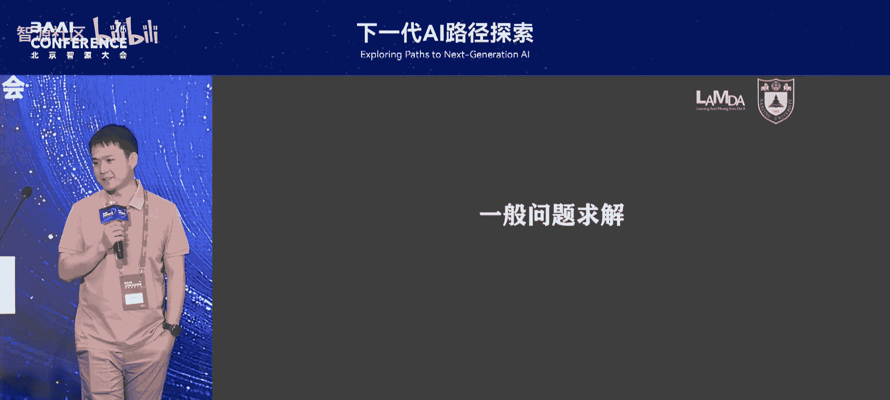

在本节课中，我们将学习南京大学戴望州老师关于神经符号学习的最新思考，核心探讨人工智能如何从原始经验数据中自主发现和抽象出符号概念，而非依赖人类预先定义。

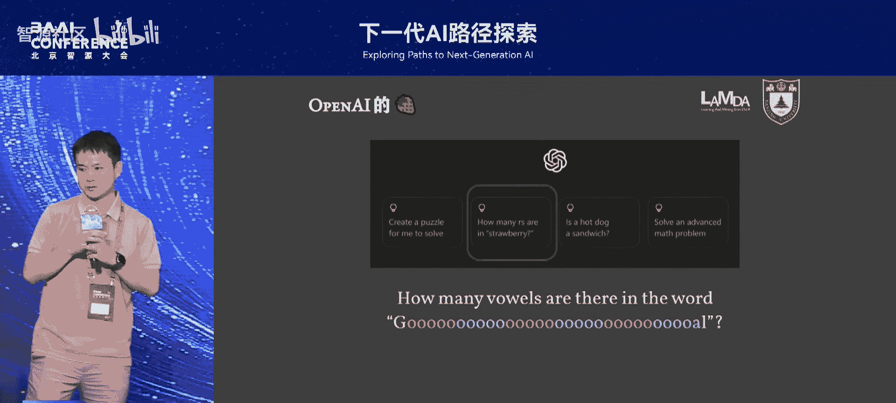

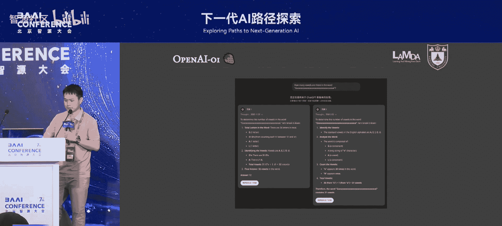

---

## 概述：从推理到概念抽象

上一节我们讨论了脑启发学习，本节中我们来看看神经符号学习这一重要方向。经典人工智能范式基于符号系统进行推理与问题求解。如今，神经符号学习成为一个关键的研究领域。戴望州老师将分享其团队的最新工作，特别是对神经符号学习多年发展的反思。

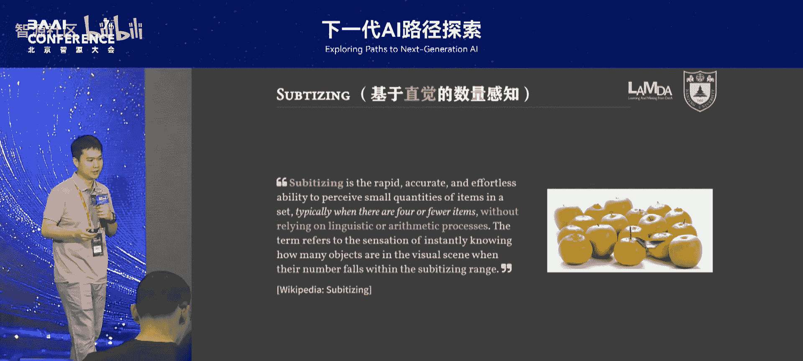

---

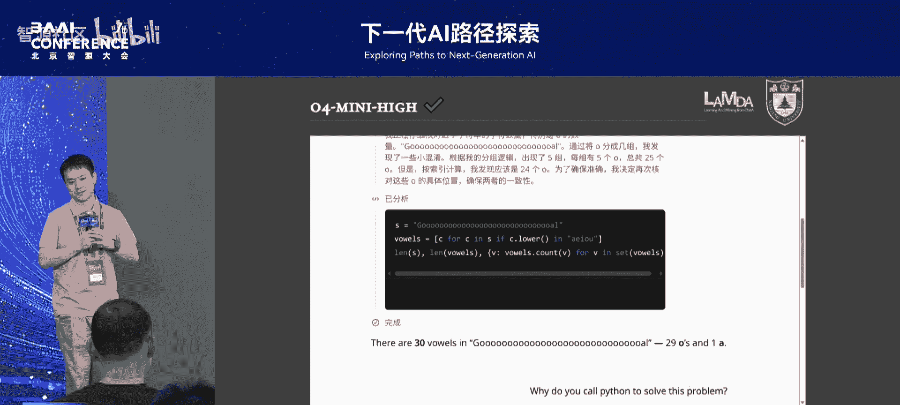

## 大模型的推理局限与形式化需求

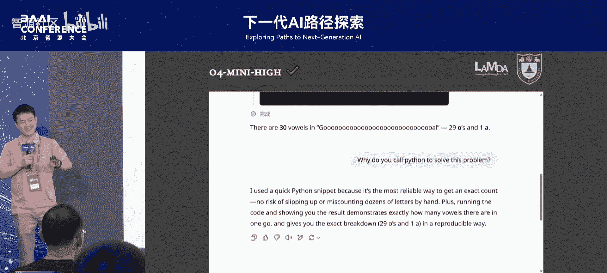

一般问题求解是一个古老的话题，例如逻辑推理。如今，以GPT为代表的大模型也声称具备推理能力。然而，它们真的能进行严谨的逻辑推理吗？

OpenAI曾展示一个例子：数出“strawberry”一词中的元音字母数量。我们将问题变得更复杂：数出解说员拖长音的“gooooooal”中有多少个“o”。

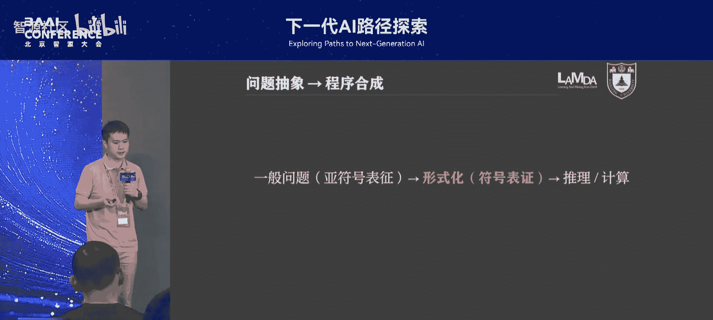

**代码示例：一个简单的计数问题**
```python
# 人类或理想程序解决此问题的方式
text = "gooooooal"
count_o = text.count('o')
print(count_o)  # 输出应为 6
```

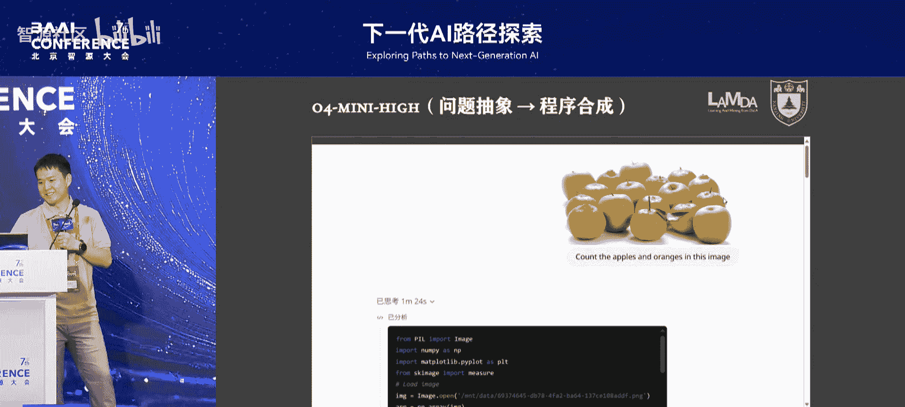

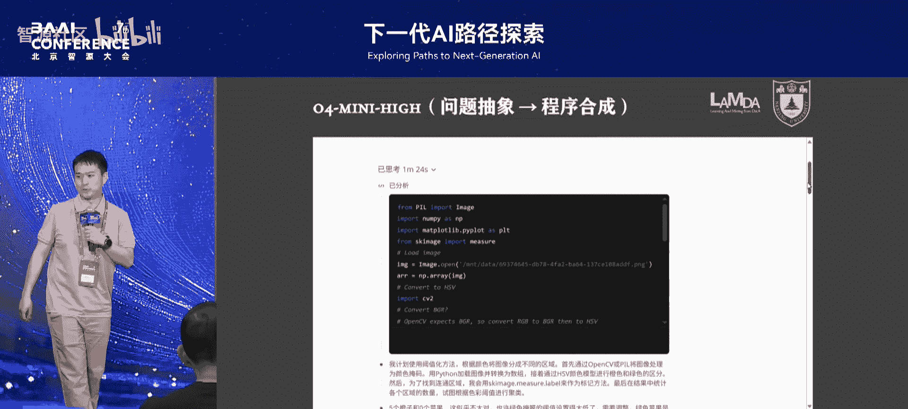

当将此问题交给早期的O1模型时，它给出了不一致的答案（如32个或31个），而正确答案是6个。测试多次，仅少数答对。对于人类（甚至小学生）而言，这是一个明确的计数问题，但大模型的表现并不稳定。

认知科学家认为，大模型的表现已属不错，因为它展示了“**目测**能力——人类能瞬间识别小数量（如5-6个苹果），但数量变大后（如一堆橘子）就需要逐个点数。大模型在没有调用逐步推理（即系统二思维）的情况下，能“目测”出30多个的数量，这已超越人类直觉。然而，它并未真正执行一步步的算法化推理。

最新的O4模型在解决此问题时，最初也频频出错。最终，它选择**编写Python代码**来精确计算字符数量，并成功给出了正确答案。它解释：“手动点数容易出错”。这揭示了一个关键路径：**将一般问题形式化，然后求解**。

---

## 形式化的挑战与符号的缺失

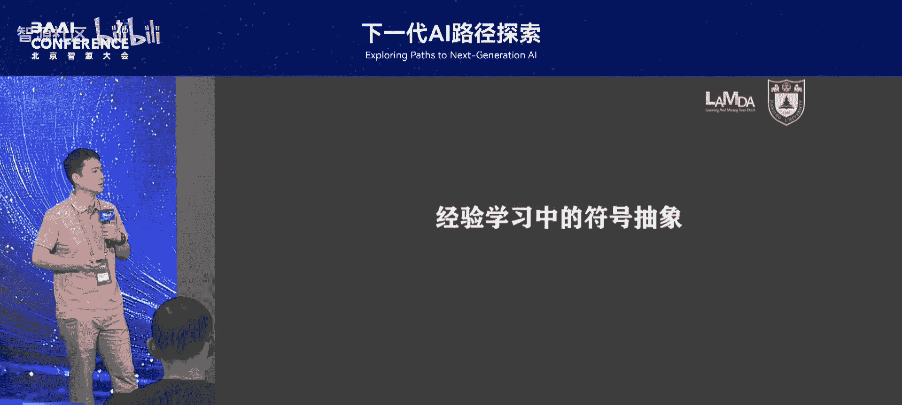

O4的成功在于将问题抽象并合成为一个形式化的程序。那么，对于更复杂的问题呢？

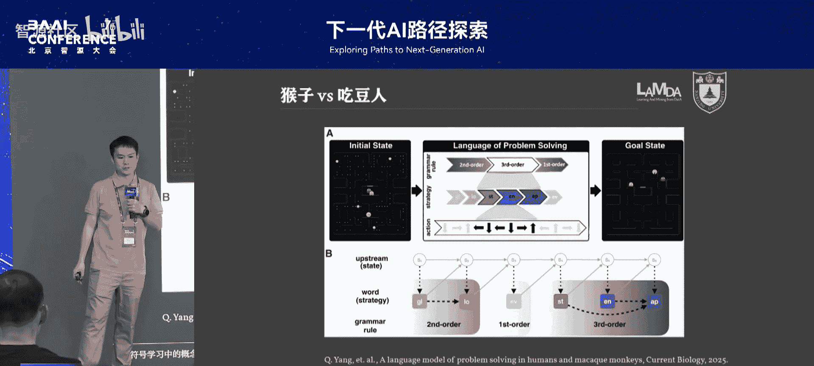

我们提出一个新问题：让AI数一张图片中苹果和橘子的数量。O4模型尝试了多种形式化方法：
1.  **基于颜色过滤**：试图用OpenCV根据颜色（橙色、绿色）分离水果，但因物体粘连而失败。
2.  **基于形状检测**：尝试检测圆形，也未能成功。
3.  **退回直觉计数**：最终改为人工描述式逐行计数，结果依然是错的。

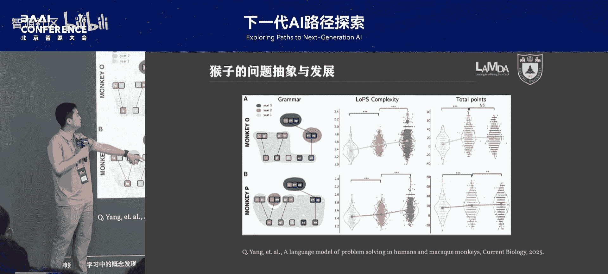

它失败的根本原因在于：**缺乏对应的符号概念**。它不知道“苹果”或“橘子”的符号定义，也无法调用一个现成的目标检测模型。它只能将问题“接地”到其已有的语言概念（如“橙色”、“圆形”）上，而这些抽象并不准确。

这引出了长期存在的核心问题：在传统AI与神经符号系统中，从一般问题到形式化表示的**关键一步通常由人类完成**。我们需要预定义符号和语言。正如经典AI教材作者所指出的，符号主义有一个基本假设缺陷：**符号从何而来？** 当前机器学习，包括大模型，大多在人类已有概念体系上运作，并未解决从经验数据中**主动发明新概念**的问题。

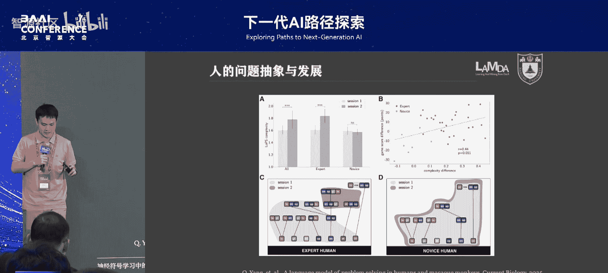

---

## 生物智能中的概念涌现

人类和动物都能在经验学习中自然地进行符号抽象。例如，猴子玩《吃豆人》游戏的实验显示：
*   其决策路径是**离散的**：一段时间内只激活一个清晰策略（如“逃跑”、“吃近处豆子”、“寻找远处豆子”）。
*   这些策略会形成**规则**：不同猴子学习规则的速度不同，掌握更复杂语法规则的猴子得分更高。
*   人类玩家能**抽象出新概念**：资深玩家会发明“安全区域”和“埋伏”等新策略，形成更长距离的复杂规则，从而获得更高分数。

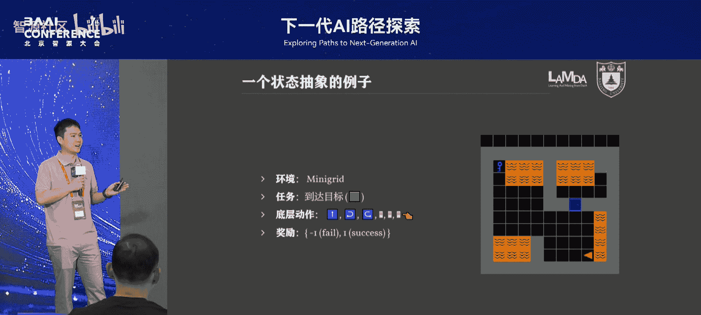

实验表明：
1.  **符号抽象能力至关重要**，它直接关系到能否提出新概念、总结新规则。智能水平越高，往往对应越复杂的规则系统。
2.  **复杂决策背后是基于抽象结构的形式化推理**，这能带来更好的可靠性与可解释性。高层推理最终需“接地”到低层具体动作，这部分需要机器学习。
3.  **符号可以在无预定义的情况下，从经验中学习得到**。

---

## 从亚符号经验中学习逻辑结构

我们的目标是：在**不定义任何符号或规则**的“亚符号”环境下，让智能体从任务经验中自主**涌现出逻辑结构**。我们与神经科学团队合作，基于此想法发表了最新研究。

我们设计了一个实验环境（类似《我的世界》），智能体需完成“拿到钥匙 -> 开门 -> 到达终点”的任务。
*   **输入**：原始像素图像。
*   **动作**：前进、左转、右转等底层操作。
*   **挑战**：在不提供任何层次结构先验知识的情况下，让智能体自己学会任务分解。

我们采用的方法是**基于反绎学习的问题抽象**。其核心思想是：
*   在强化学习产生的成功与失败轨迹中，寻找关键的**公共状态节点**。状态突变点（如捡起物品、触发开关）往往预示着重要概念的出现。
*   我们定义**提取状态机**，将底层MDP（马尔可夫决策过程）抽象为一个子代数。抽象状态是原始状态空间的子集，状态间转移由集合的交集关系定义。
*   通过反绎推理（从不完备观测中寻找最佳解释）和类似“基于僵局的状态发现”的认知机制，递归地发现离散抽象状态及它们之间的转移关系。

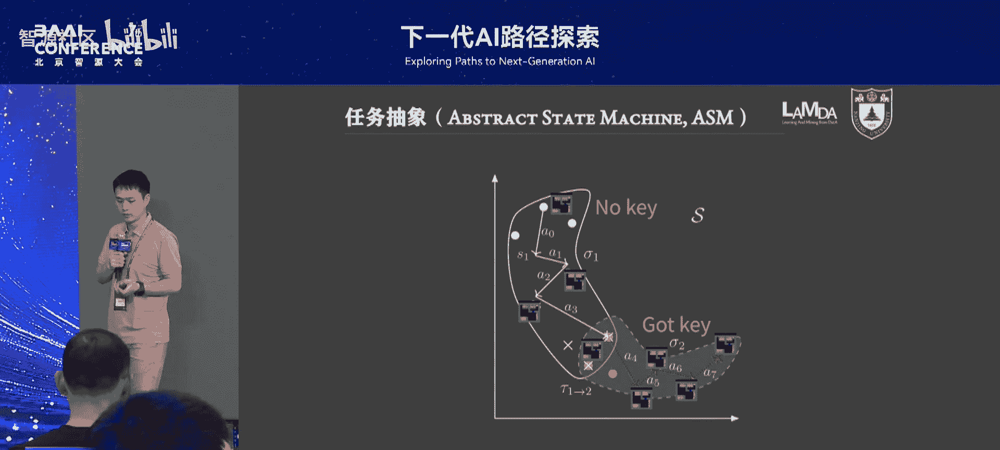

最终，智能体能够：
*   从像素输入中，自主抽象出“无钥匙状态”、“有钥匙状态”、“门已开状态”、“终点状态”等离散概念。
*   学习这些概念之间的转移规则（策略），形成一个高层规划。
*   这些符号和规则是在训练过程中**自主发明**的，而非预先定义。

**公式示意：学到的规则**
```
策略 π: 状态S0 (无钥匙) -> 状态S1 (拿到钥匙)
策略 π: 状态S1 (有钥匙) -> 状态S2 (门已开)
策略 π: 状态S2 (门已开) -> 状态S3 (到达终点)
```

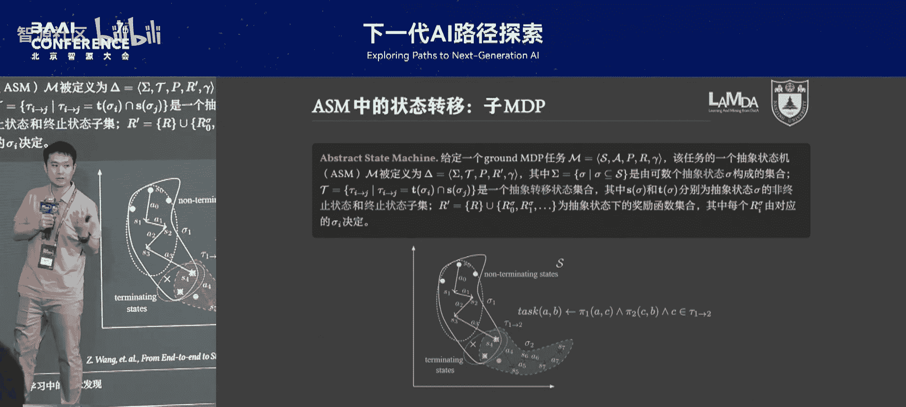

实验结果显示：
*   我们的方法在复杂任务上的性能，最终能**逼近**使用了预定义层次知识的强化学习（粉红色基线）。
*   在**泛化性**上优势明显：在50张随机生成的新地图上测试，传统端到端强化学习完全失效，而我们的方法因掌握了抽象概念，能表现出一定的迁移能力（如至少拿到钥匙），并通过快速增补学习迅速适应。

---

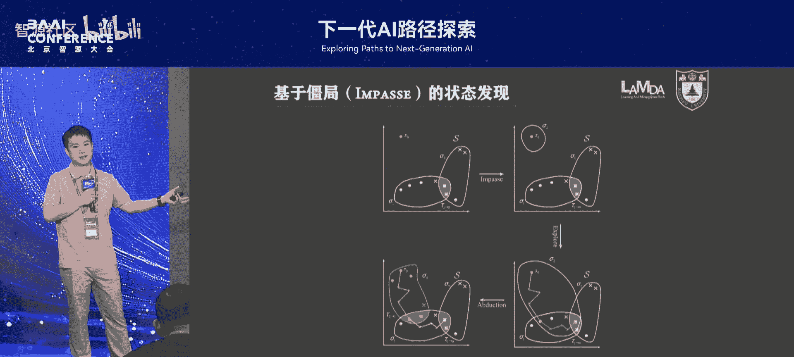

## 总结与展望

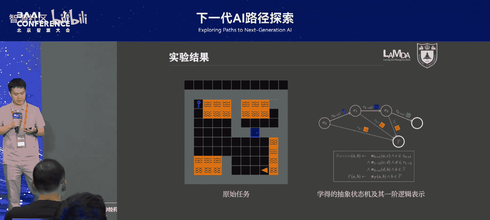

本节课中我们一起学习了神经符号学习的前沿思考与实践。我们探讨了以下核心要点：

1.  **系统一与系统二的桥梁**：真正的智能需要连接直觉感知与逻辑推理。关键在于如何从连续感知中**涌现出符号**，并将其抽象为知识，最终指导决策。
2.  **概念发现是核心**：未来AI，特别是迈向通用问题求解时，必须具备从无符号经验中**自主发现和创造新概念**的能力，而非局限于预定义的词汇表。
3.  **端到端学习抽象**：我们的工作表明，将问题抽象与知识学习**端到端地结合**是可行的。智能体能在与环境互动中，同时学习如何抽象状态以及基于抽象状态的规划。
4.  **通往更通用AI**：这项研究指向一个方向：在不依赖人类数据与先验知识的前提下，让AI学会规划和推理。这将是实现更高级、更灵活人工智能的重要路径。

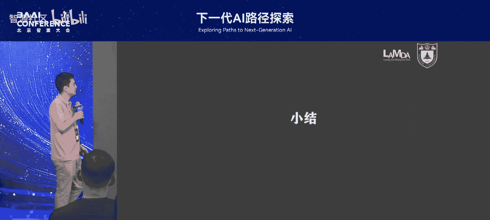

这项工作将最热门的深度学习与经典的符号推理相结合，为下一代AI的路径探索提供了富有启发性的思路。

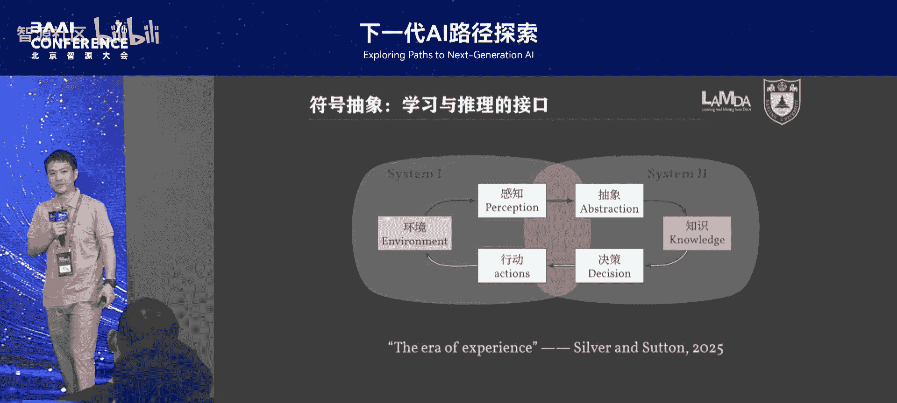

---

## 问答精选

**问：反绎学习与归纳学习是同一回事吗？现在的AI是否缺乏从具体数据抽象为概念的能力？**
答：两者侧重点不同。反绎学习侧重将已有知识融入学习过程；归纳学习则是从数据中总结出新知识。我们的框架更接近后者，旨在从经验中归纳出符号与规则。当前AI（包括LLM）确实主要缺乏这种**自主创造新概念**的能力，其操作基本限于已有词汇表的组合。

**问：学到的知识能否文本化并被人工校验？是否会学到错误的“歪打正着”的策略？**
答：学到的规则基于形式化语言定义，因此是**可验证的**，但人不一定能直观理解。关于“歪打正着”，这可能是学习的必然部分，有时机器发现的策略甚至可能优于人类经验（如围棋定式）。我们不一定需要以人类理解为最终标准。

**再次感谢戴望州老师的精彩报告。**