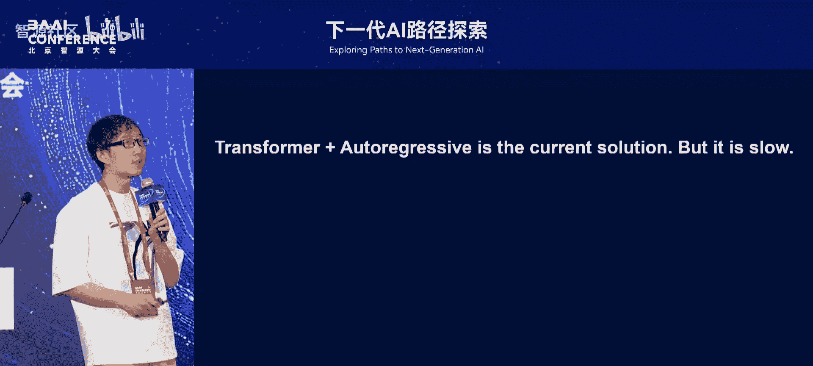
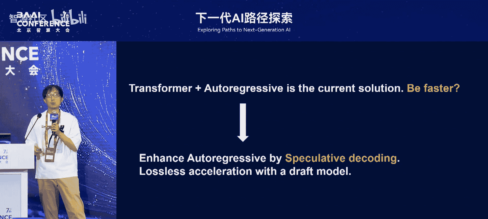
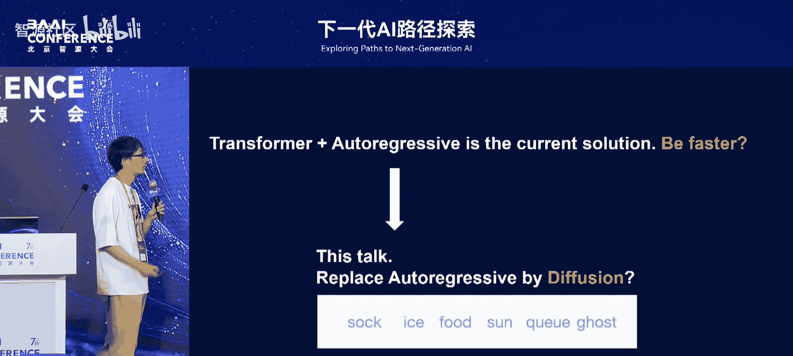
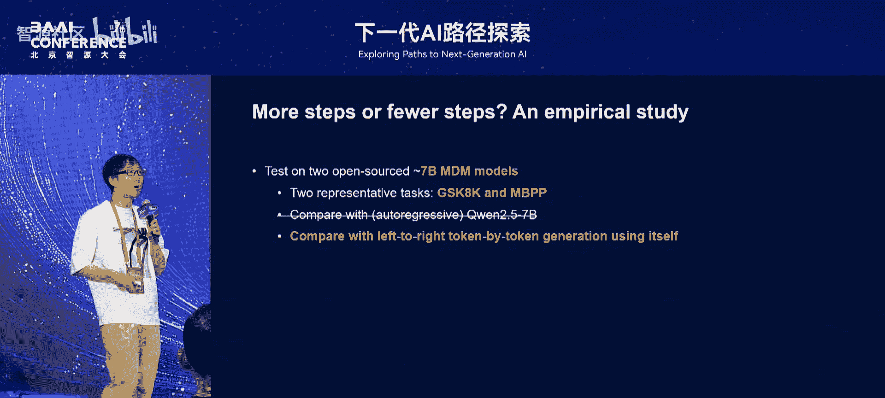
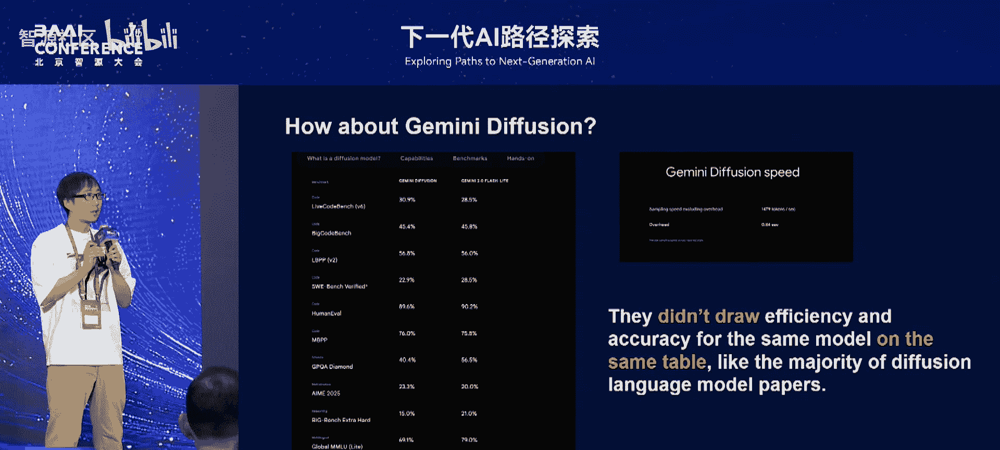
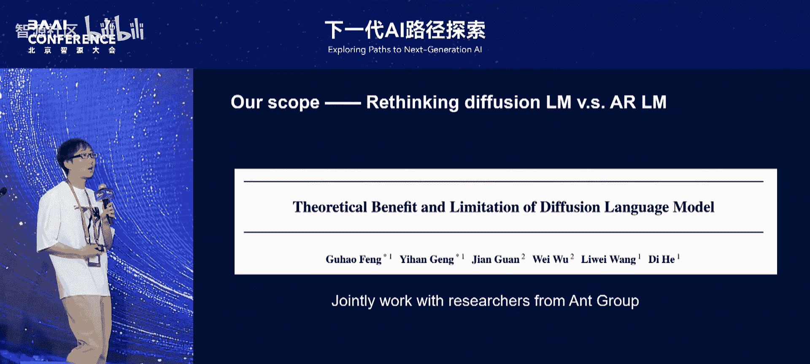
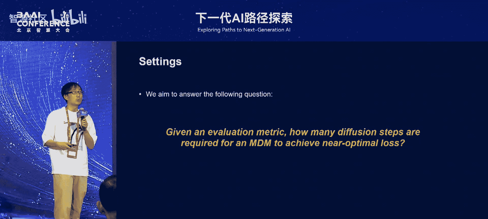
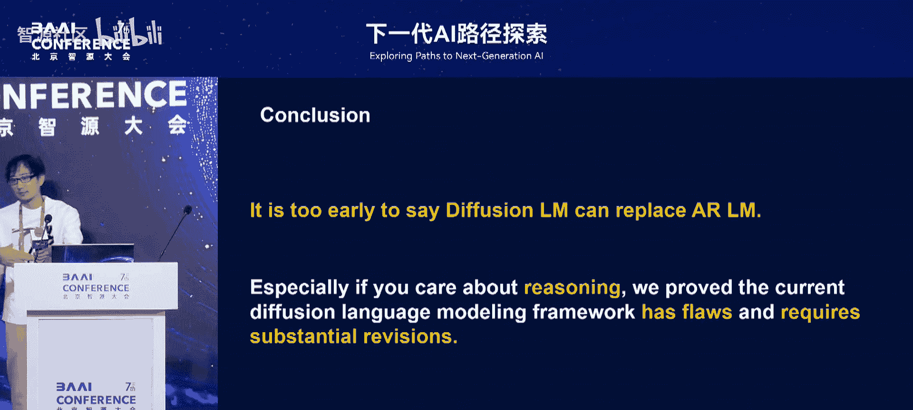

# 下一代AI路径探索-p07-Diffusion-vs--Autoregression--Which-is-the-Key-to-Next-Generation-LLMs：贺-笛



在本节课中，我们将探讨当前大语言模型（LLM）生成范式的核心争议：扩散模型与自回归模型，究竟哪一种更有潜力成为下一代模型的关键技术？我们将通过对比分析，理解两者的工作原理、优势、局限以及各自适用的场景。

## 当前主流范式：自回归模型

目前，几乎所有主流大语言模型都采用统一的范式。它们使用 **Transformer** 模型结构及其变种，并遵循**自回归**的生成方式，即模型逐个生成序列中的每一个词元。





```python
# 自回归生成过程的简化示意
for i in range(sequence_length):
    next_token = model.predict(tokens[:i])  # 基于已生成的序列预测下一个词元
    tokens.append(next_token)
```

然而，自回归模型存在一个显著缺点：**生成速度慢**。这种“慢”一方面源于Transformer模型结构本身的计算复杂度，另一方面则是由其必须逐个生成词元的串行特性所决定的。

为了应对速度问题，业界主要从两个方向进行优化：
*   **高效架构**：设计比标准Transformer自注意力机制更快的模型结构。
*   **投机解码**：一种无损加速技术，可将生成速度提升2到3倍。

上一节我们介绍了当前主流的自回归模型及其加速方法。本节中，我们将目光转向一个近期备受关注的新范式——扩散模型。

## 新范式的探索：扩散模型

扩散模型最初在计算机视觉领域取得了巨大成功，用于图像生成。其核心思想是建模一个**前向加噪**和**反向去噪**的过程。

**前向过程**：从一张真实图片开始，逐步添加高斯噪声，直至图片变成完全随机的白噪声。这个过程是确定的。
**反向过程**：模型需要学习如何从白噪声开始，逐步去除噪声，最终还原出一张清晰的图片。这正是扩散模型训练的目标。

为什么NLP研究者会对扩散模型感兴趣呢？关键在于其**并行生成**的能力。在CV中，扩散模型可以并行生成一张图片的所有像素。例如，生成一张256x256的图片（含65536个像素），可能只需要几十步。相比之下，自回归模型生成65536个词元则需要执行65536次模型前向计算，这显然是难以承受的。

因此，NLP领域希望借鉴扩散模型的思路：**用更少的模型执行步数，生成更长的文本序列**，从而在理论上实现比自回归模型更高效的生成。

## NLP中的扩散模型：掩码扩散

然而，直接将CV中的连续高斯噪声应用于离散的词元序列是行不通的。NLP领域发展出了**掩码扩散模型**。



其加噪过程不再是添加连续噪声，而是**逐步随机掩码掉序列中的词元**。例如，从一个完整的句子开始，经过多轮“加噪”（掩码），最终变成一个全部是 `[MASK]` 的序列。
反向的去噪过程，则是模型学习如何从一个全掩码的序列开始，逐步预测出被掩码的词元，最终还原成一句通顺的话。

与自回归模型不同，扩散模型的**生成步数**是一个可以调节的超参数。理论上，我们可以用较少的步数快速生成，或用较多的步数获得更高质量的结果。那么，这个步数如何影响模型的实际表现呢？



为了探究这个问题，我们进行了一系列实验。以下是我们的实验设置与发现。

## 实证对比：扩散模型 vs. 自回归模型



我们选取了两个开源的、约70亿参数的掩码扩散语言模型，并在两个重要的推理任务（GSM8K和MATH）上进行了测试。作为基线，我们使用了表现优秀的自回归模型——通义千问7B。

我们比较的指标是**计算成本**和**任务准确率**。理想情况下，如果一个模型能在保持或提升准确率的同时降低计算成本，它将位于坐标系的**第一象限**。

**实验结果如下：**
*   当与精心优化的通义千问基线对比时，现有的掩码扩散模型在准确率和计算成本方面都**显著落后**。
*   为了排除数据差异的影响，我们进行了更公平的对比：强制让扩散模型以自回归的方式（从左到右逐词生成）进行推理，并将其表现作为新的“原点”。然后，再让扩散模型以其自身的并行方式生成。结果显示，扩散模型自身的并行生成方式**并未优于**其被强制执行的串行生成方式。

这个结果表明，至少在当前的框架和任务下，扩散模型并未展现出超越自回归模型的优势。值得注意的是，一些研究在展示扩散模型优势时，可能会将“高准确率”和“低计算成本”分别放在不同的表格中展示，而回避在同一配置下进行直接比较。



基于这些观察，我们与合作伙伴进行了一项理论研究，旨在从理论层面深入理解扩散语言模型的潜力与局限。

## 理论洞察：扩散模型的优势与瓶颈

我们的研究聚焦于当前流行的掩码扩散模型，并试图回答一个核心理论问题：对于一个给定的评估指标，扩散模型需要多少步才能达到接近最优的性能？

我们主要考察两类指标：
1.  **词元错误率**：衡量生成文本的流畅度（例如，困惑度）。
2.  **序列错误率**：衡量整个生成序列的结构和逻辑正确性（这对推理任务至关重要）。

**研究得到了两个关键结论：**

**1. 积极结论（关于流畅度）**
在只关心**词元错误率**（即文本流畅度）的情况下，对于任意长度的文本，扩散模型仅需要**常数级别**的步数，就能达到接近最优的流畅度。这意味着，在生成通顺文本方面，扩散模型确实有潜力用远少于文本长度的步数完成任务。



**2. 消极结论（关于推理能力）**
然而，在关心**序列错误率**（即逻辑推理正确性）的情况下，我们证明了在最坏情况下，即使扩散模型的步数达到与文本长度同阶的水平，其错误率也**永远高于1/2**。换句话说，要让扩散模型在复杂推理任务上表现良好，它可能需要的步数不会少于自回归模型，甚至更多。

这背后的直觉与人类的思维方式有关：我们进行逻辑推理时，通常是**顺序的、从左到右**的，而不是并行地、跳跃式地思考。让模型并行地“吐出”所有正确推理步骤，可能本身就违背了这类任务的内在结构。

我们的实验也佐证了这一点：在小规模实验上，自回归模型的损失可以轻松降至接近零，而扩散模型的损失则始终维持在一个较高的水平，且不随长度增加而显著下降。

## 总结与展望

本节课中，我们一起学习了扩散模型与自回归模型的核心概念、工作机制，并通过实证与理论分析对比了它们的优劣。

**总结如下：**
*   **自回归模型**是当前LLM的基石，其顺序生成方式与语言生成和逻辑推理的天然顺序吻合，但在长文本生成时速度较慢。
*   **扩散模型**从CV领域兴起，具有并行生成的潜力，理论上能用更少的步数生成内容。
*   然而，**当前的掩码扩散语言模型**在实践和理论上都面临挑战：在需要强逻辑连贯性的任务（如推理）上，其表现显著落后于自回归模型；理论分析也表明，在现有框架下，它难以高效解决此类问题。
*   因此，断言扩散模型即将取代自回归模型为时尚早。扩散模型可能在更注重流畅性、全局一致性的任务上（如某些形式的文本生成或代码补全）有独特优势，而自回归模型在顺序推理任务上仍占主导。

未来的发展可能不是“谁取代谁”，而是**根据任务特性选择合适范式**，或者探索将两者优势结合的新架构。要让扩散模型在推理任务上取得突破，很可能需要对现有框架进行根本性的革新。

---
**核心公式/概念回顾：**
*   **自回归生成**：`P(序列) = Π P(词元_i | 词元_<i)`
*   **扩散过程**：前向加噪 `q(x_t | x_{t-1})`， 反向去噪 `p_θ(x_{t-1} | x_t)`
*   **掩码扩散**：在NLP中，加噪表现为逐步掩码词元，去噪则是预测被掩码的词元。