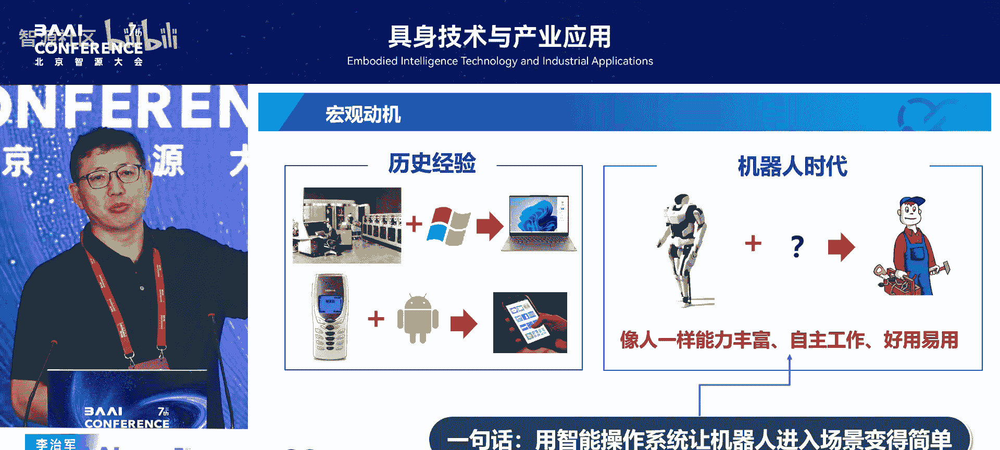
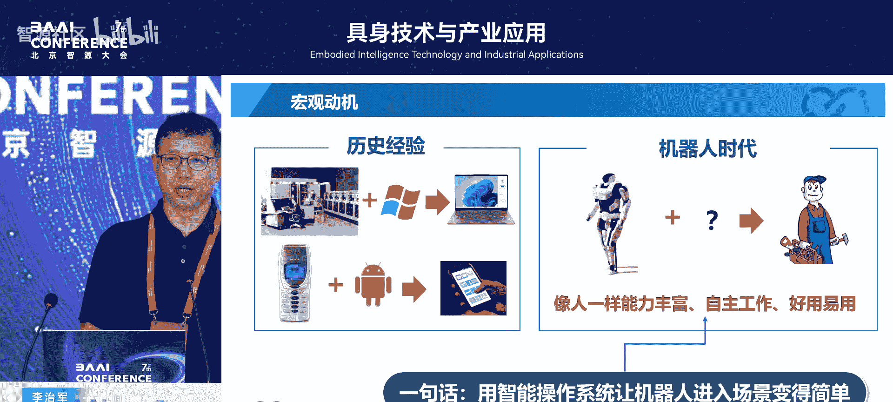
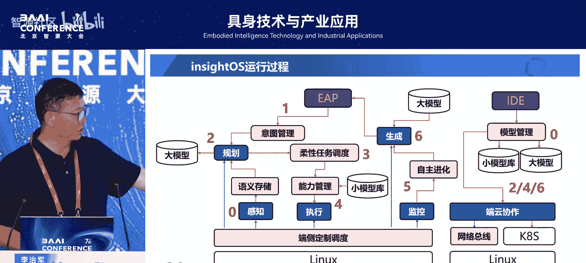
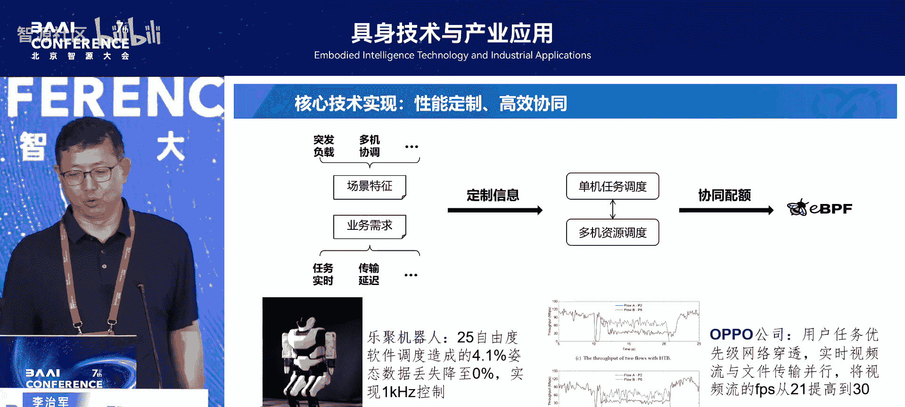

# 具身技术与产业应用-p02-机器人智能操作系统研制与应用：李治军

在本节课中，我们将学习哈尔滨工业大学李治军教授关于机器人智能操作系统（exitOS）的核心理念、技术架构与应用前景。课程将重点阐述为何机器人需要操作系统，以及exitOS如何通过降低开发门槛、提升应用体验和加速迭代来推动机器人智能化发展。

## 为什么要为机器人开发操作系统？🤔

上一节我们介绍了课程主题，本节中我们来看看为何机器人需要一个智能操作系统。回顾个人电脑（PC）和智能手机的发展历史，**Windows**和**安卓/iOS**等操作系统通过简化操作、丰富功能，极大地推动了这些“端设备”的普及。



**公式：设备普及 = 低门槛 + 多功能 + 自主性**

人形机器人是未来的重要“端设备”，要进入千家万户（C端市场），必须解决三个核心问题：
1.  **门槛低**：像使用电脑和手机一样简单易用。
2.  **功能多**：能完成多样化的复杂任务，而非单一动作。
3.  **自主性**：具备自主决策和适应环境的能力。



历史经验表明，操作系统是解决这些问题的关键路径。一个优秀的机器人操作系统应能实现以下目标：
*   **开发快**：让应用开发变得简单快捷，吸引大量开发者，丰富机器人生态。
*   **应用好**：确保开发出的应用体验良好，真正实用。
*   **迭代快**：支持产品快速迭代优化，从不够完善走向成熟稳定。

## exitOS的核心构想与组件 🧩

上一节我们探讨了机器人操作系统的必要性，本节中我们来看看exitOS的具体设计。exitOS的设计思想借鉴了成功的移动操作系统（如安卓）的“平民化”理念，旨在让开发机器人应用变得像开发手机APP一样简单。

安卓系统通过 **Activity**、**Service**、**Broadcast Receiver**、**Content Provider** 四大核心组件，极大地降低了应用开发门槛。exitOS在此基础上，提出了自己的**8个核心组件**（具体名称暂未全部公开），以支持更复杂的机器人任务编排。

其中，exitOS支持一种名为 **Ebody Agent Package (EAP)** 的应用开发模式。开发者可以使用配套的集成开发环境（IDE），将任务意图打包成一个EAP软件包。这个包可以上架、分发，并在任何适配了exitOS的机器人上部署运行，实现跨平台的一致性效果。

一个EAP的核心是描述机器人的**任务意图**（即“要干什么”）。它包含以下要素：
*   **目标**：明确的任务终点。
*   **柔性工作流**：围绕目标动态组织的执行步骤，可根据实际情况调整。
*   **语义定义**：将人类的高层语义（如“来北京”）转化为机器人可理解并可执行的具体行为序列。

**代码示例：任务描述逻辑**
```
目标：在会议现场做报告。
工作流雏形：抵达北京 -> 前往会场 -> 登台演讲。
语义解析：“抵达北京”可分解为[查询交通、购票、乘坐交通工具、出站...]等一系列子动作。
```

系统通过解析这种高层语义描述，动态调用所需的大模型或专用小模型的能力，生成并执行具体的工作流。exitOS认为，大模型是强大的“能力调用者”，但解决长周期、复杂的具身任务需要操作系统层面的任务编排与管理。

## exitOS如何解决三大核心问题？⚙️

上一节我们了解了exitOS的组件与构想，本节中我们来看看它如何具体实现“开发快、应用好、迭代快”。



### 实现开发快

传统机器人编程需要针对特定机器人编写大量底层代码（如运动控制、SLAM、通信总线操作）。exitOS通过高层语义描述，将开发门槛降至最低。

**示例对比：**
*   **传统方式**：需要精确编程机器人每个关节的运动轨迹和协作逻辑。
*   **exitOS方式**：只需描述“将橘子从A处放到B处”。系统自动解析意图，生成跨机器人的协作工作流。这使得不具备深厚机器人专业知识的开发者也能快速创建应用。

### 实现应用好

exitOS采用“大小模型协同”的架构，模拟人类的认知与习惯系统。
1.  **自动化流程（小模型/程序）**：处理常规、可预测的任务，如同人的肌肉记忆，高效且稳定。
2.  **异常检测与认知干预（大模型）**：当自动化流程遇到意外（如抓取的物品掉落），系统触发异常检测。
3.  **调用大模型反思**：利用语言大模型的常识理解能力，分析问题（“碗掉了该怎么办？”），生成解决方案（“捡起来或清扫干净”）。
4.  **动态重组工作流**：将解决方案插入原有任务流，继续执行。这背后的关键技术是**动态流计算（D-Flow）**，它能实时、高效地组织计算过程。

### 实现迭代快

操作系统的优势在于能全面记录运行日志。exitOS可以收集机器人线上运行的所有细节数据。
*   当任务出错时，系统能精准定位问题点。
*   记录下的现场数据（状态、环境、决策链）形成高质量的反馈数据集。
*   利用这些数据，可以对模型或工作流进行**在线更新与优化**，实现快速、精准的迭代，而不必完全依赖离线的重新训练。

## 应用示范与未来展望 🚀



上一节我们分析了exitOS的技术优势，本节中我们来看看它的实际应用与生态建设。exitOS已在多个场景中进行实践和打磨。

以下是exitOS支持的核心应用方向：

*   **异构机器人协作**：通过exitOS提供的SDK，开发者可以编写程序，让不同型号、功能的机器人协同完成复杂任务。
*   **低代码场景编排**：配套的IDE允许用户（如职业院校学生）通过理解场景、语义化服务等概念，以图形化或配置化的方式编排机器人智能场景，无需深入算法细节。这为未来培养“教机器人工作”的新型技能人才提供了工具。
*   **运行监控与评测**：基于系统记录的详尽日志，可以对机器人任务的表现进行监控、分析和量化评测，为优化提供依据。
*   **工业落地**：exitOS已经开始适配多种工业机器人平台，并在实际工业场景中探索应用，感谢产业伙伴提供的合作机会。

本节课中我们一起学习了机器人智能操作系统exitOS的研制理念与应用前景。我们认识到，通过借鉴历史成功经验，exitOS旨在用操作系统解决机器人普及的三大难题。其核心是通过**Ebody Agent Package (EAP)** 和**语义化编程**降低开发门槛，通过**大小模型协同**与**动态工作流**提升应用智能与鲁棒性，并通过**操作系统级的日志与数据反馈**实现快速迭代。exitOS的探索为构建丰富、易用的机器人应用生态，最终推动机器人进入千家万户提供了一条可行的技术路径。