# 具身技术与产业应用-p03-具身智能前沿进展与展望：王业全

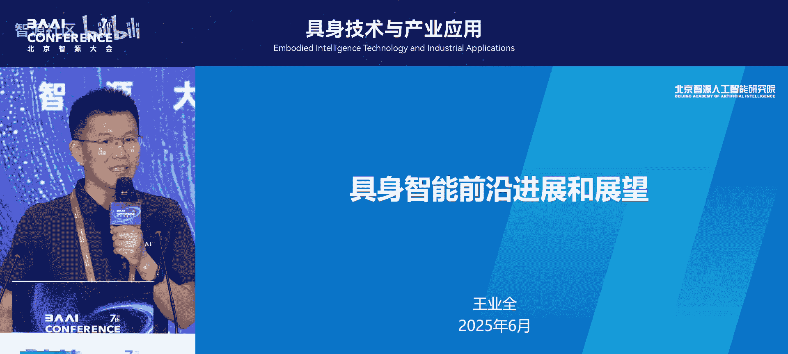

在本节课中，我们将学习北京智源人工智能研究院研究员王业全关于具身智能领域的前沿思考。报告将围绕大模型如何驱动具身智能发展、当前主流技术路线梳理、未来可能的重要方向——全模态大脑，以及对产业趋势的研判展开。

## 大模型与具身智能

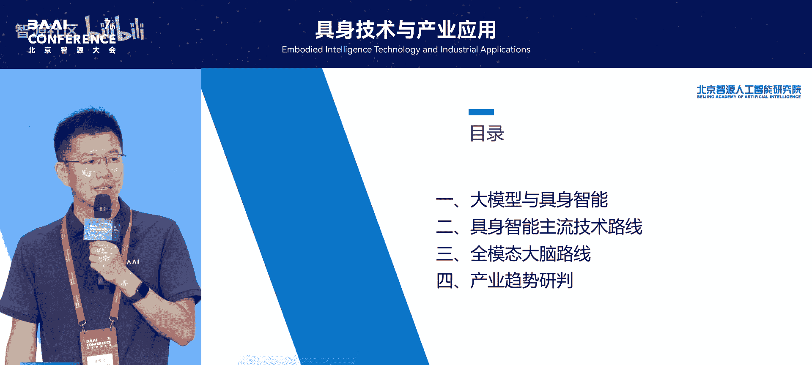

上一节我们介绍了课程背景，本节中我们来看看大模型与具身智能的关系。当前具身智能的发展浪潮，本质上是由大模型技术驱动的。

人工智能领域经历了多次起伏，从1956年的达特茅斯会议诞生，到单层神经网络、多层神经网络，直至如今的大模型时代。与此同时，以机器人为代表的具身智能领域也在发展：1961年首台工业机器人诞生，1973年首台人形机器人出现，2000年日本ASIMO实现双足行走，2010-2020年间波士顿动力展示了人形机器人的巨大潜力。

总体而言，在2022年之前，机器人技术主要基于规则。大模型出现后，整个领域正演进到基于大模型的“机器人2.0”时代。

在深入探讨以人形机器人为代表的大模型应用前，我们可以先观察一个与具身智能紧密相关的领域——自动驾驶，看看大模型出现前后发生了哪些根本性变化。

在大模型出现前，自动驾驶系统由大量模块耦合而成，是一种**工作流（workflow）** 式的方法。其核心模块包括：
*   **感知**：通过摄像头、雷达等传感器获取环境信息。
*   **认知**：识别行人、障碍物、红绿灯等，评估交通状况。
*   **决策**：基于安全、交规等约束，规划行动路径。
*   **行动**：控制车辆的方向和速度。

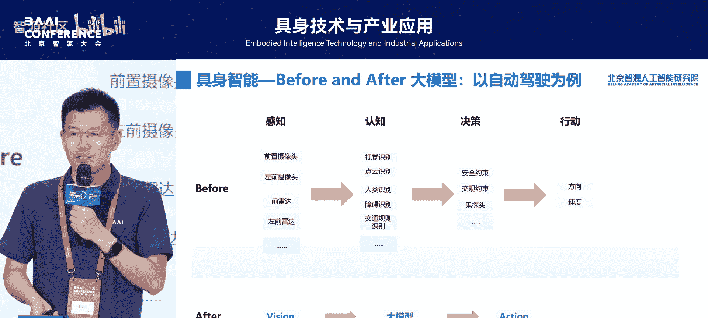

在大模型技术，特别是端到端方法（如特斯拉的FSD）出现后，自动驾驶领域取得了显著突破。近一两年，许多车企开始宣称将推出L3、L4甚至更高级别的自动驾驶，这本质上是新方法带来的新突破。

我们可以总结传统模式与大模型模式的主要区别：

以下是传统模式与大模型模式的核心对比：
*   **架构复杂度**：大模型虽然模型本身复杂，但它是**单一模型**，相比传统的多系统耦合，架构更简单。
*   **开发效率**：大模型泛化性好，可快速迁移；传统方法需要长期的场景适配和大量人工调试。
*   **知识运用**：传统方法依赖人工编码的规则和专家知识库；大模型则内化了这些知识。
*   **协同能力**：传统是**流水线（pipeline）** 模式；大模型自动化程度更高。

简单概括有两个方面：第一，大模型方式采用**统一架构**，单一大模型能处理所有任务；第二，智能维度实现了**跃迁**，从解决特定模块的复杂系统工程，跃升为具备一定通用智能能力。

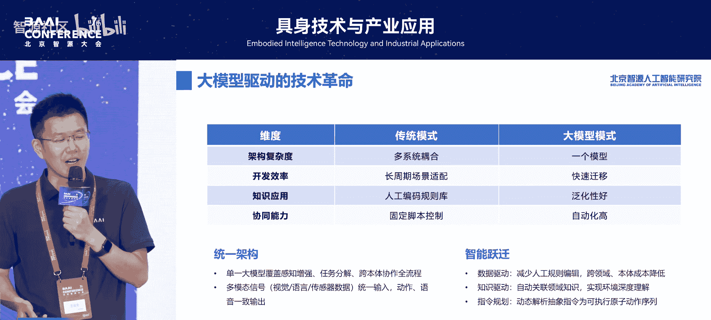

## 主流技术路线梳理

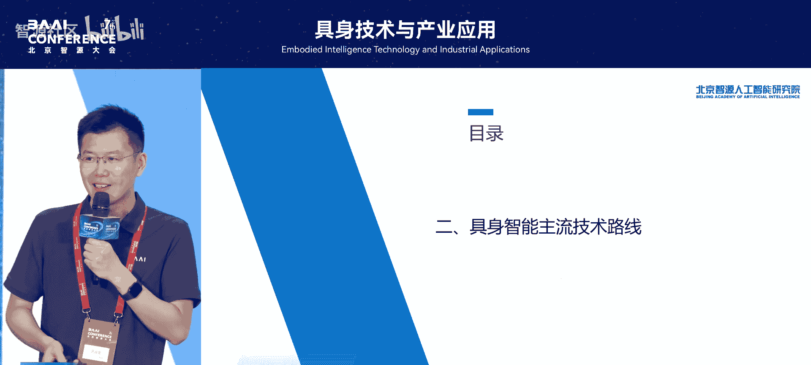

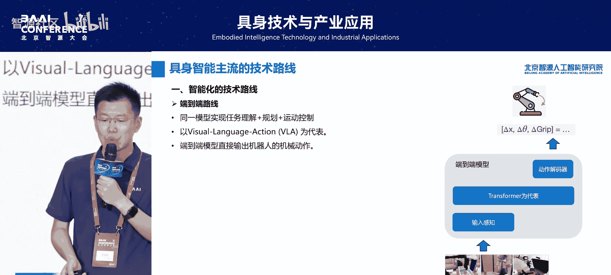

上一节我们探讨了大模型的驱动作用，本节中我们来梳理当前具身智能的主流技术路线。主要可分为三大方面：**智能化**、**运动控制**和**本体**。

### 智能化路线

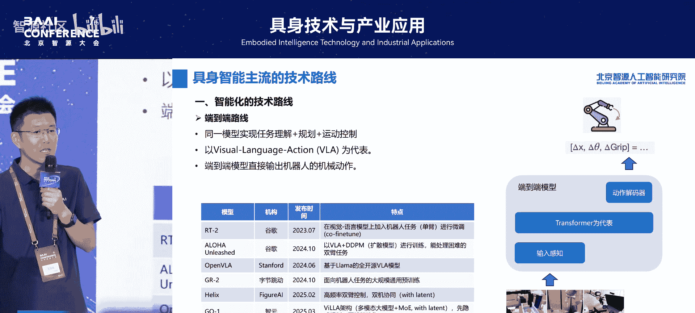

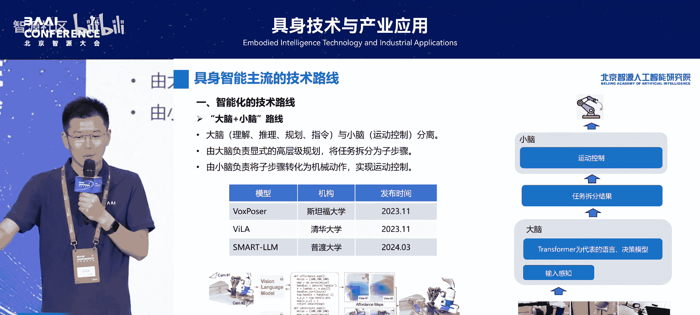

首先是智能化路线，目前主要有两种思路：

以下是当前主流的智能化实现路径：
1.  **端到端路线**：这是目前最主流的方式，其核心是 **`模型输入 -> 大模型 -> 机械动作输出`**。例如谷歌的RT系列、OpenAI的OpenAI等，都是在视觉-动作（VA）技术基础上的变种和优化。
2.  **大脑加小脑路线**：模仿人类，用“大脑”处理高层规划和决策，用“小脑”处理底层运动控制。华为等相关工作已对此进行了介绍。

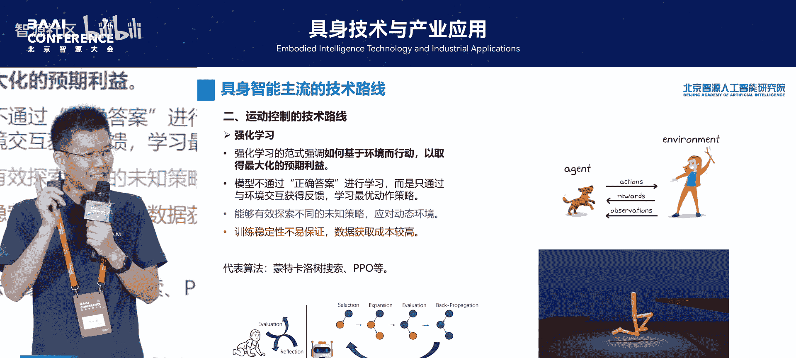

### 运动控制路线

运动控制是机器人的核心，目前主要技术路线如下：

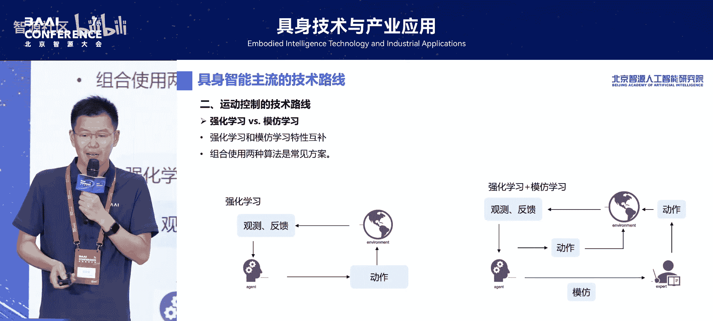

以下是实现机器人运动控制的几种关键方法：
*   **强化学习**：能够有效探索未知策略，应对动态环境。但其缺点是训练稳定性不易保证，且数据获取成本高。例如，训练出的机器人可能只关注“能走”，而不关注“脚步声轻重”这类体验细节。
*   **模仿学习**：让机器人直接模仿人类的动作。思路直接，但实践中存在挑战，例如机器人可能无法像人类一样灵活地转移重心，导致摔倒。
*   **强化学习与模仿学习结合**：结合两者优点，是目前常见且效果较好的方法。
*   **仿真到现实**：在仿真环境中训练模型以降低成本，然后部署到真机。但存在**仿真到现实的差距（Sim2Real Gap）**，关键在于如何减小这个差距。

### 本体技术路线

最后是机器人本体（驱动方式）的技术路线：

以下是几种主流的机器人驱动方式及其特点：
*   **电动驱动**：目前的主流方案。优点是响应快、控制精度高、静音性好；缺点是成本较高。
*   **液压驱动**：以波士顿动力机器人为典型代表。优点是输出功率大、负重能力强、对电池续航依赖小；缺点是成本高、噪音大。
*   **气动及其他驱动**：各有优劣，目前尚未成为主流，仍处于实验室探索阶段。

## 全模态大脑：未来可能的方向

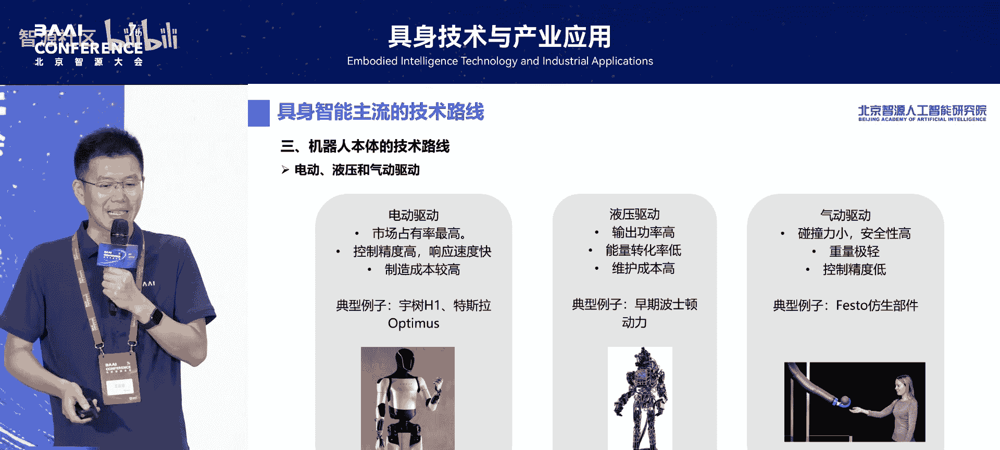

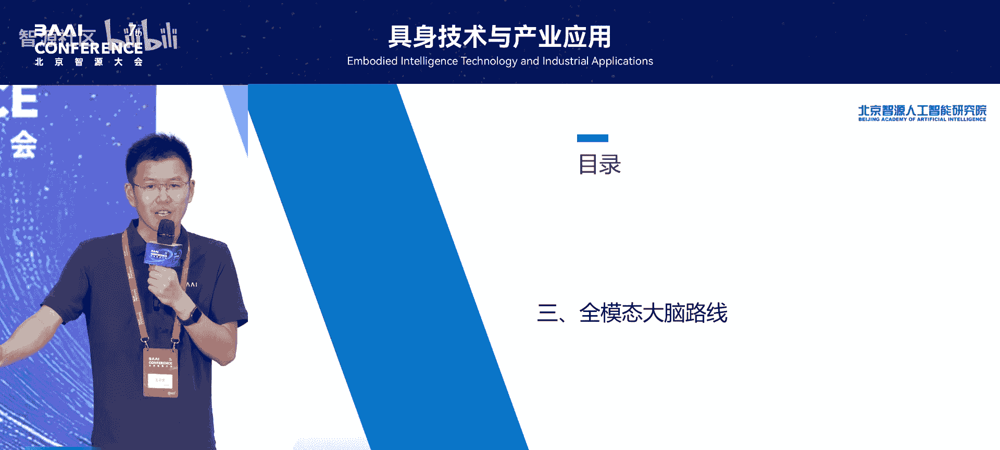

上一节我们梳理了当前技术路线，本节中我们来看看对未来发展的一些思考，特别是“全模态大脑”这一可能方向。

首先需要明确具身智能面临的三大挑战：

以下是当前具身智能系统面临的几个核心挑战：
1.  **关键能力欠缺**：现有模型大多只能跨两个模态，而人类具备“听、说、看、想、做”等多模态联合能力。目前能将所有模态整合到一个“大脑”中的模型非常少见。
2.  **缺乏状态与记忆**：当前机器人大部分是“无状态”的，执行完任务就结束，不具备自我认知、长期记忆、人物识别等类人能力。
3.  **数据成本与泛化性**：无论是VA路线还是其他方法，都存在数据成本极高、泛化性不足的问题。

基于这些挑战，我们提出了“全模态大脑”的框架构想，旨在启发思考。该框架强调以下几个目标驱动的关键角度：

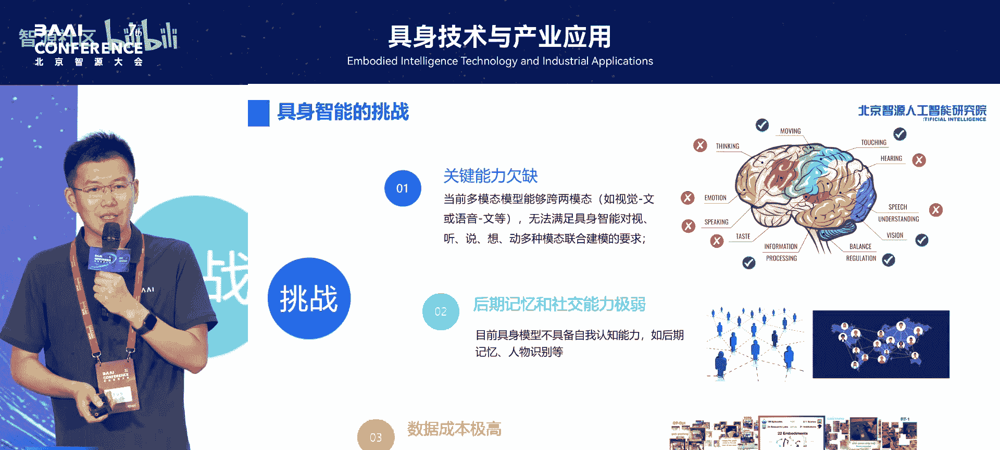

以下是全模态大脑框架应具备的几个核心特征：
1.  **全能关键模态**：一个模型应整合“听、说、看、想、做”等必备能力。触觉、嗅觉等在现阶段可作为可选能力。
2.  **原生实时性**：包括动作的实时性（避免碰撞伤害）和语音的实时性（避免音画不同步带来的体验不适）。
3.  **精准操作**：不应依赖“重复尝试”的概率性成功，而应借鉴人类的**反馈闭环控制**方法，实现精准、可靠的操作。
4.  **类人记忆与社交能力**：机器人应能识别家庭成员，具备长期记忆，并能进行自然交互。这为实现“一导多体”（一个指令控制多个机器人）等复杂应用场景奠定了基础。

## 产业趋势研判

上一节我们展望了全模态大脑，本节最后我们对产业趋势进行简要研判。

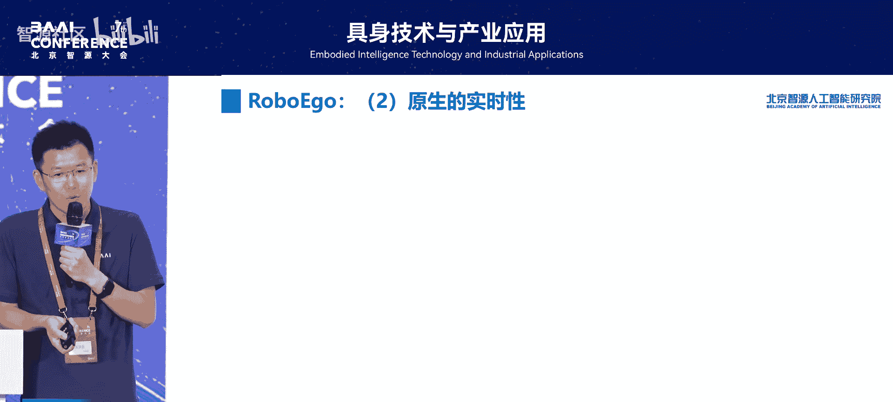

对于技术本身，我们认为：

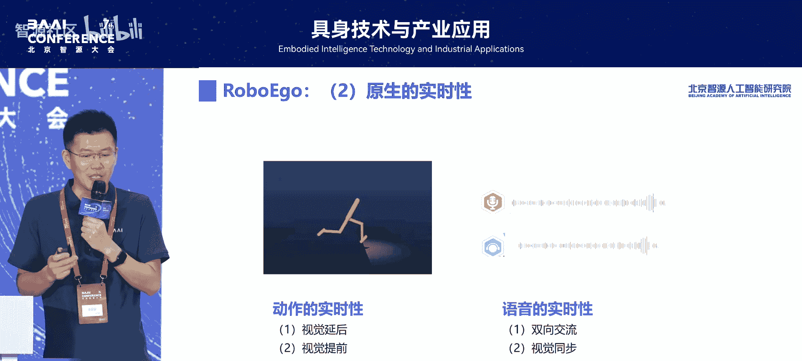

以下是未来具身智能技术的几个发展趋势：
*   **全模态大模型将成为核心**，以实现全面的环境感知、无损的信息捕获和类人的思考能力。
*   **泛化性**是比完成单一任务更重要的维度，以应对人类社会的复杂环境。
*   行为输出需要**综合、一致、准确、合理**。

从应用落地的角度来看：

以下是具身智能应用发展的可能路径：
*   **短期**：由于技术复杂、要求高，可能会在部分重点能力上取得突破，并聚焦于专业场景。
*   **中长期**：必将走向**通用化**阶段，最终实现具备类人智能的长期目标。

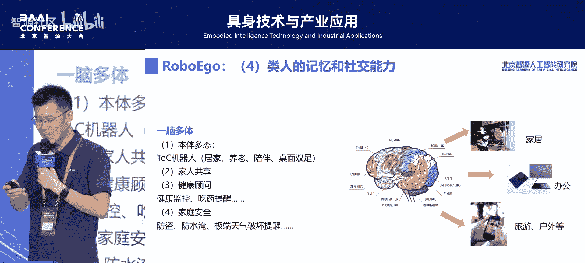

最后，可以借鉴自动驾驶的能力分级体系，定义通用智能机器人的里程碑：

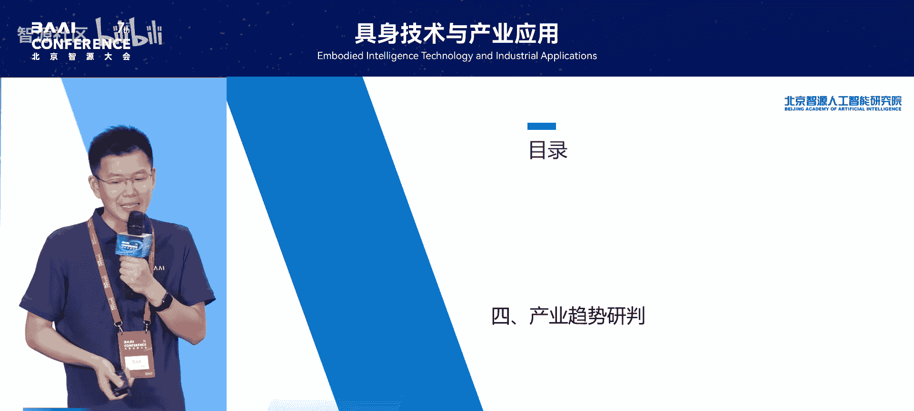

以下是类比自动驾驶的机器人智能分级设想：
*   **L1/L2**：有限的或组合的任务执行（如当前的工作流机器人）。
*   **L3/L4/L5**：通用的、高度自主的完全智能机器人。

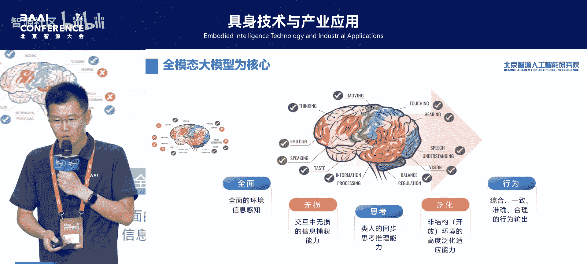

大模型技术已经带来了诸多突破，我们坚信更高级别的通用智能机器人将在未来取得重要进展。

## 总结

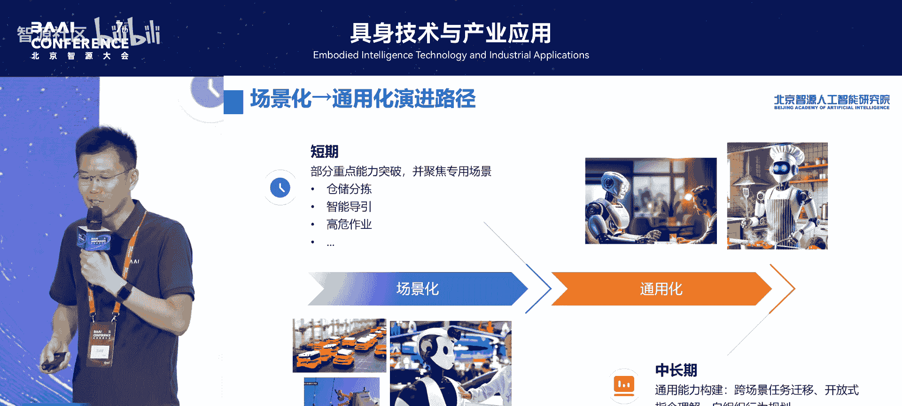

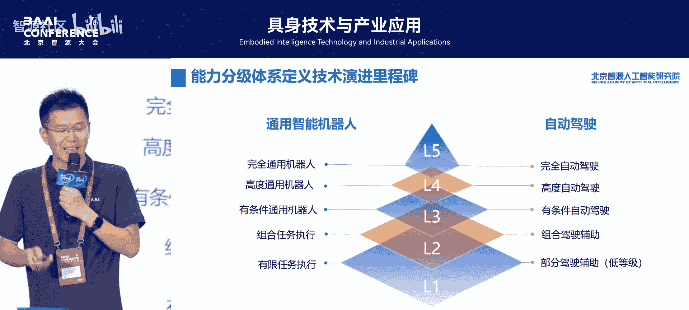

本节课中我们一起学习了具身智能的前沿进展。我们从大模型对领域的驱动作用讲起，梳理了当前在智能化、运动控制和本体方面的主流技术路线。接着，我们探讨了当前面临的挑战，并提出了“全模态大脑”作为未来可能的思考方向。最后，我们对产业从技术到应用的发展趋势进行了研判。大模型为具身智能开启了新的篇章，迈向通用、类人的智能机器人值得期待。