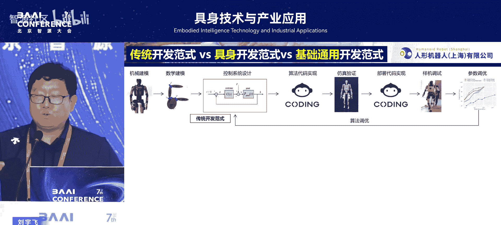
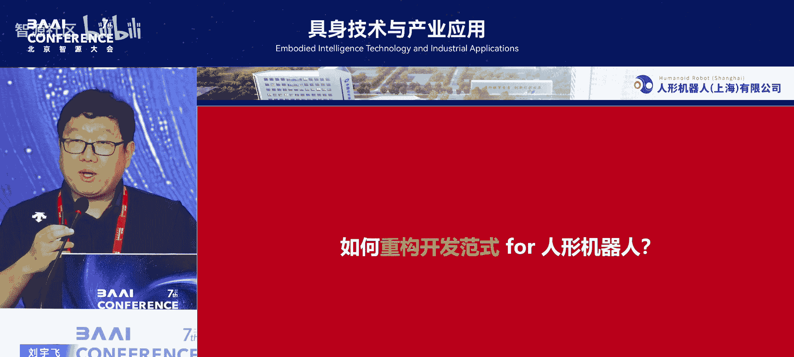
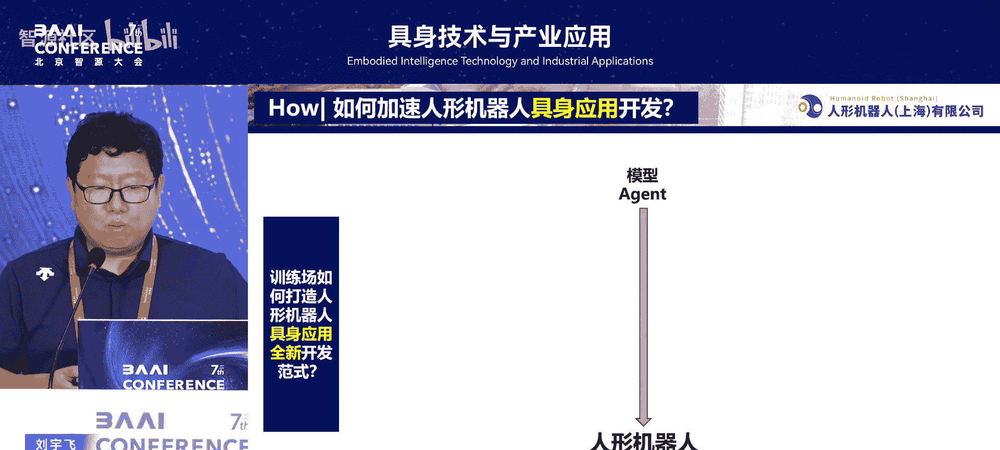

# 具身技术与产业应用-p04-训练场打造具身智能新开发范式：刘宇飞

在本节课中，我们将学习国家地方共建人形机器人创新中心副总经理刘宇飞先生关于“训练场”如何打造具身智能新开发范式的报告。我们将了解从传统机器人开发到新型数据驱动范式的演变，以及如何通过构建大规模虚实融合训练场和通用开发平台来加速人形机器人的技能开发与应用落地。

## 背景：具身智能的发展历程

具身智能并非全新概念，早在1950年的论文中就已体现“embodied intelligence”这一思想。如今，它已从一种对自身状态的体验，演变为能够改变物理世界的智能。

一个标志性事件是2020年的一项四足机器人比赛。该比赛首次采用端到端的智能控制，让四足机器人在复杂矿山环境中进行自主探索，全程未摔倒并实现了预期功能。这对当时仍以**模型基控制（Model-Based Control）** 为主的团队带来了巨大震撼。

从2022年开始，具身智能的发展融合了时间域和空间域的概念。随着视觉-语言-动作模型的发展，技术路线演变为 **动力学 + 强化学习 + 预训练模型**。

上一节我们回顾了具身智能的技术演进，本节中我们来看看几个关键的里程碑平台如何推动了这一领域。

## 关键平台与范式转变

以下是几个推动具身智能发展的关键平台：

*   **ETH的OCS2.0控制器**：该开源的非线性通用优化器，可用于单臂、双臂及四足机器人。它能在线辨识控制参数，并融合感知信息进行可视化路径与落足点规划，其成熟的软硬件解耦与可视化界面极大便利了开发者。
*   **英伟达的Isaac Sim平台**：该平台利用并行计算能力，能快速适配不同机器人（包括虚拟数字人）并进行大规模训练。其宣称的“在Isaac Lab中10分钟训练等于以往十年工作量”的概念，凸显了仿真加速的潜力。
*   **英伟达的GR00T基础模型范式**：该范式允许开发者为不同机器人硬件进行免费定制与适配，涉及驱动总线与SDK软件开发，为业界提供了重要启发。

这些平台的出现，标志着开发范式的根本性转变。

传统机器人开发遵循 **控制系统设计 -> 算法代码实现 -> 仿真 -> 部署与调优** 的流程。而新的具身智能开发范式则始于 **训练策略设计**，在定义了目标函数和边界条件后，核心挑战在于 **仿真到现实（Sim-to-Real）** 的迁移，即如何将训练好的策略部署到实体机器人并进行参数调试。

最终，我们走向 **基础通用范式**，即通过低代码、向导式的开发，将技能部署到通用框架中，并借助通用操作系统适配不同机器人，从顶层解决通用性问题。

总结来看，传统范式代表系统如MPC、WBC等，而新范式则以数据驱动和模型驱动为核心。我们认为，**新的具身智能范式应是模型训练、操作系统与具身应用三者的结合**。

## 构建人形机器人训练场 🤖

在了解了新范式的理念后，如何将其应用于人形机器人呢？我们在上海建立了人形机器人训练场。

这一构想受到特斯拉的启发。特斯拉的人形机器人实训场专注于电池拆解、多任务示教等，并配备了大规模数据训练团队。其2025年发布的视频展示了人形机器人完成倒垃圾、清理桌面等11项原子技能，其关键技术突破在于利用 **第三人称与第一人称视角视频** 来训练人形机器人，这为数据采集开辟了新路径。

我们的训练场于今年1月建成，是国内首个大型虚实融合训练场，涵盖三大领域、18个细分场景。

以下是训练场涵盖的主要场景领域：

*   **智能制造**：如激光弱化、拧螺丝、上下料。
*   **民生服务**：如面板清理。
*   **特种作业**。

在提炼真实场景需求后，我们开发了相应的开发平台与机器人解决方案。

训练场旨在实现五大赋能：

1.  **数据收集与规模化**。
2.  **模型训练与迭代**。
3.  **面向真实场景的模拟与应用落地**。
4.  **开源模型应用**：如ACT、Diffusion Policy、PIE-1等模型已在我们的机器人上完成部署适配。
5.  **人才培养与生态建设**。

## 重构开发范式：格物致知平台 ⚙️

接下来，我们深入探讨如何重构开发范式，这是基于训练场近一年工作的核心贡献。关键问题在于：如何加速机器人具身应用的开发？这涉及到模型与智能体（Agent）的构建。

我们面临几个挑战：异构数据集的统一标准、异构机器人的快速适配、模型的积木式组合，以及如何降低开发门槛。为此，我们开发了 **“格物致知”具身智能开发平台**，并于2025年5月29日正式发布，未来将逐步开源。

该平台集成了训推一体框架，链接了鸿蒙、欧拉等国内自主操作系统，并包含多任务调度IDE，让开发者无需深入二次开发接口即可快速适配。

我们形成了一套完整的技术路线与开发框架。

以下是该框架的核心组成部分：

*   **数据板块**：包含数据源收集、采集范式（本体、夹爪、具身数据）、数据治理与分发。我们构建了数据湖，并发布了国内首个百万量级异构真实数据集，计划在上半年将规模扩展至500万。
*   **格物仿真平台**：支持一键式导入与多机训练，已涵盖102种不同机型的URDF文件，可快速适配训练，该平台已在GitHub开源。
*   **开发支撑平台**：面向硬件，集成了操作系统、中间件及多种芯片的驱动接口，解决了大量工程化落地问题。
*   **开发基础设施**：包括训练场数据采集范式、高质量数据池（日均产生约5万条数据），并牵头制定了多项行业与团体标准。

仿真训练平台包含以下关键功能：

1.  **生成式模型驱动的动作生成**：与高校合作，将人体动作数据重映射至机器人，构建生成式动作库。
2.  **前馈动作结合IL方法**：利用期望数据加速神经网络训练，减少探索空间。
3.  **一键式模型导入训练**：预配置了上百个URDF文件的训练参数，实现快速适配。
4.  **内置训练案例与模块**：提供开箱即用的模块，如Isaac Gym，帮助开发者快速上手。
5.  **已验证的训练案例**：例如我们“青龙”机器人的行走训练，已通过该平台快速适配完成。

通用具身开发平台实现了以下工程突破：

*   **运控单元转型**：将运控单元转变为模型输入输出接口，通过共享内存等方法，使主控能快速适配神经网络控制器，极大提升部署效率。
*   **加速推理架构**：利用国产软硬件框架支持模型格式转换与切换。
*   **低代码通用配置**：预设面向传感器、参数的通用配置文件，减少重复开发。
*   **自集成链路驱动**：集成了训练场内12家不同机器人的驱动库（包括关节、夹爪、相机、雷达），实现模块化集成与快速配置，支持端侧部署。

## 软件框架与成果总结

在软件层面，我们采用 **共享内存** 实现实时、大容量的数据交互，替代了传统的多线程方式，并实现了数据落盘、操控落盘及模型即插即用。

基于以上工作，我们取得了两项主要成果：

1.  **全球首个百万量级人形机器人数据集**：将逐步开源部分数据与系统。
2.  **生成式运动大模型“MandoGPT”**：这是一个类似“GPT for Motion”的模型。其流程为：**语音/文本指令 -> 网络搜索或内部检索对应动作 -> 离/在线动作生成 -> 工程师进行动作重定向与部署**。该7B参数的模型可在单卡部署，能快速将语音指令转化为机器人基础动作范式，并已在“青龙”机器人上实现打拳、跳舞等技能的快速部署。

## 总结与展望

本节课中，我们一起学习了具身智能开发范式从传统控制到数据驱动的演变。核心在于通过构建 **大规模虚实融合训练场** 解决数据获取难题，并开发 **“格物致知”通用开发平台** 来降低异构机器人开发门槛、加速模型训练与Sim-to-Real部署。最终成果体现为高质量数据集与生成式运动大模型，推动人形机器人技能快速开发与应用落地。

这项工作得益于众多生态伙伴的支持，我们团队持续聚焦底层技术开发，推动产业进步。所有相关技术将在OpenDragon社区逐步发布与开源。