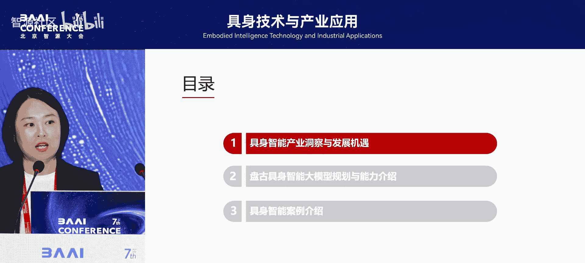
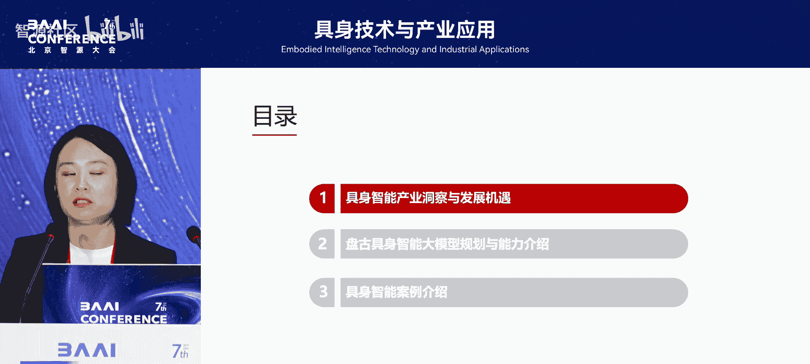
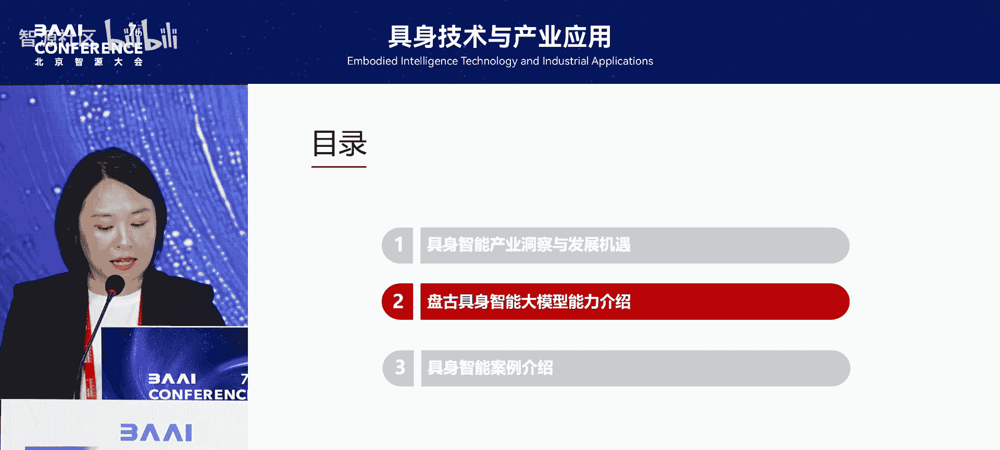
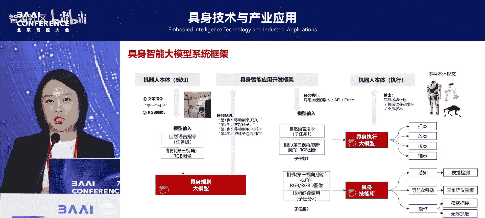
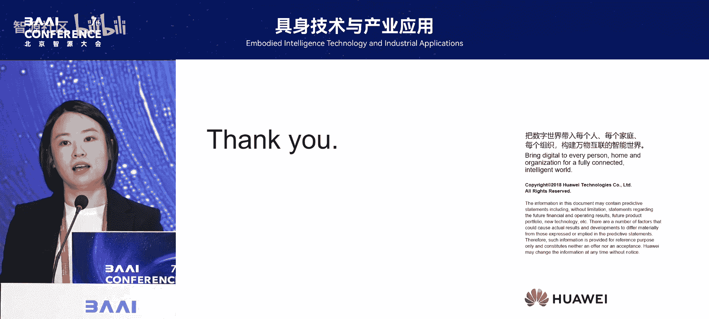

# 具身技术与产业应用-p05-华为云具身智能技术探索与实践：李-寅

## 概述
在本节课中，我们将学习华为云在具身智能领域的技术探索与实践。课程将介绍具身智能与大模型结合的必要性、当前的技术挑战、华为盘古具身大模型的核心架构，以及该技术在工业等场景中的具体应用案例。

## 具身智能与大模型的结合趋势
上一节我们介绍了具身智能的基本概念，本节中我们来看看其与大模型结合的必要性。

当前，无论是华为内部的制造工厂，还是深圳等地的工业企业，都希望利用具身智能技术来改变产业格局。过去，我们看到的更多是“离身智能”或教学系统，例如，教会机器人一个固定动作，它只能在产线固定位置执行。一旦遇到突发情况或需要柔性装配，这些机器人便无法胜任。

现在的具身智能技术，核心在于能够与物理世界进行精准交互。这对大模型提出了新挑战。我们之前开发的盘古大语言模型，或当前热门的DeepSeek等模型，都属于语言类模型，主要解决从感知到认知再到决策的问题。然而，再往下，就进入了精神或思维层面，难以与物理世界的实际需求结合。

感知、认知、决策的下一步，应该是**执行**。执行涉及与物理世界的交互。只有将具身智能与大模型技术结合，才有可能解决智能时代下一跳的“行为”问题。这正是华为公司将具身智能与大模型结合的初衷。

## 技术演进与行业趋势
上一节我们探讨了结合的必要性，本节中我们来看看技术是如何演进的。

从2023年开始，具身智能的爆发始终与大模型技术的发展紧密相连。例如，Google在2023年为其大语言模型PaLM-E加入了“Embodied”一词，形成了具身智能大脑的早期雏形。随后，我们看到了Figure公司与OpenAI合作，用大模型为机器人本体赋能。Google又发布了RT-2模型，并在2024年3月正式发布了RT-H，将“大脑”（规划）和“小脑”（执行）模型技术结合在一起。

后来，一家名为Physic Intelligence的公司推出了仅30亿参数的VRM模型，这是一个融合多模态理解与扩散模型的端到端规划到执行模型。Figure公司也自行发布了Helix模型，提出了具身智能大脑的System 1（快思考）和System 2（慢思考）理念，这与大语言模型中快慢思考的推理模式相似。在完成慢思考的规划推理后，需要一个快思考能力将一系列动作快速组合并执行出来，这是今年技术演进的关键点。

英伟达则在去年Cosmos的基础上，发布了Cosmos Transfer One和Cosmos Reasoning One以及Groot-RT，体现了大模型与具身智能在推理与执行能力上的深度结合。同时，行业开始在具身智能的泛化性上寻求突破，例如如何合成训练数据。

## 具身智能的核心挑战与任务
了解了技术演进后，我们来看看当前面临的核心挑战与行业任务。

具身智能与以往技术最大的不同在于其**泛化性**。大语言模型或视觉大模型的泛化性更多体现在认知层面，但在3D物理世界中，泛化性不仅包括认知，还包括对环境理解、抓取物体理解以及机器人本体差异的适应。具身智能不等于人形机器人，人形机器人只是本体的一种。具身智能是智能机器人的统称，其大脑应能适配机械臂、AGV、水下机器人、无人机、无人船、自动驾驶车辆等多种差异化本体。

实现这种泛化性，与数据合成的大模型技术强相关。我国从2023年10月起也发布了多项支持文件，主要任务分为三种：
1.  **技术攻关**：包括大脑、小脑等与大模型软件相关的创新技术，以及本体创新技术。
2.  **产品赋能**：将技术转化为产品，与产业紧密结合，涵盖整机、基础部件到大脑小脑软件。
3.  **场景拓展**：在不同行业场景中应用机器人技术，其难度和落地优先级各不相同。

以下是当前常见的应用场景：
*   **工业领域**：汽车（自动驾驶、生产线装配）、3C电子、集成电路。
*   **民用领域**：家政、养老、医疗、物流。
*   **特种领域**：与政府机构、特种机器人厂商合作的需求。

## 华为云的技术路径与产品规划
面对挑战与任务，华为云制定了清晰的技术路径。

我们认为，云计算是具身智能通向AGI不可或缺的底座。由于操作环境、物体和机器人本体差异巨大，为实现良好泛化性并降低成本，不可能将所有模型部署在机器人本体上。例如，最大的具身规划模型参数量可达7180亿，仅此一项就几乎无法在本体部署。

因此，我们的主要策略是将具身智能模型、系统和工具部署在云端。通过云端与本体快速通信，用云端模型操控机器人，既能保证泛化性，也能让更多伙伴基于云平台开发适合自身行业的具身智能系统。

我们的产品化演进路径如下：
*   **2023年**：技术孵化与准备，完成了三个具身智能大模型的研发。
*   **2024年**：在HDC大会上发布了华为具身智能大模型，并进行了演示。
*   **2025年**：计划在6月的HDC大会上，发布一整套部署在云端的完整具身智能系统。
*   **2025年及以后**：通过政府扶持与伙伴合作，进行产业调研与场景创新孵化，并逐步在成熟场景中实现产业落地，最终迈向工业到家用的规模复制。

## 盘古具身大模型的核心能力
上一节我们介绍了整体规划，本节中我们深入看看华为盘古具身大模型的具体架构。

我们的系统框架包含以下几个核心部分：
1.  **规划大模型（大脑）**：基于强大的多模态理解大模型构建，其上限取决于底层NLP大模型的推理能力。我们致力于增强NLP大模型的推理能力，从而让衍生的多模态理解模型及最终的具身规划模型具备更好的复杂任务理解和决策规划能力。
2.  **执行大模型（小脑）**：接收来自“大脑”的任务规划和相机多视角信息，输出具体的机器人动作指令。其架构融合了多模态理解模型（MLLM）以增强理解能力，并使用Transformer（DiT）进行序列建模。
3.  **数据合成模型（世界模型）**：这是一个端到端的仿真系统，用于生成训练数据。我们将传统仿真引擎生成的粗糙动作作为控制条件，输入给生成模型，从而合成大量所需的训练数据，并用真实世界数据不断校正，形成闭环。
4.  **高级技能库**：包含如通用3D表征、六自由度末端位姿控制的无序抓取、刚性精密插装等复杂操作的技能算子，可与大模型组合使用。

在训练策略上，我们发现用大量视频数据预训练模型底座，再用少量机器人轨迹数据进行微调，可以取得非常好的效果，这是大模型相对于传统小模型的一个优势。

## 落地实践与产业赋能
理论需要实践检验，本节我们看看华为云具身智能技术的具体落地案例。

在落地过程中，我们发现了三大难点：
1.  **数据严重不足**：即使在半结构化的工业产线，获取高质量、多样化的机器人操作数据依然昂贵且稀缺。
2.  **模型能力待完善**：当前模型在复杂环境理解、任务执行准确性、鲁棒性和泛化性方面仍需提升。
3.  **场景碎片化**：不同行业、不同场景的任务差异巨大，需要一套完整的工具链来赋能伙伴进行定制化开发。

为此，我们提供了完整的工具链平台，覆盖从数据工程、模型训练工作流、评测到数据反哺的闭环，包括前述的仿真平台，都开放给伙伴使用。

以下是我们的部分实践案例：
*   **无锡市具身智能创新中心**：联合本地厂商，开发用于上下料、车架装配的机器人解决方案，通过平台工作流半自动化开发具身智能系统。
*   **深圳市宝安区具身智能创新中心**：宝安区有5000多家规上工业企业需要具身智能。我们整合当地伙伴（如乐聚机器人），赋能物流分拣码垛、CNC柔性上下料等复杂场景，目标是实现开放复杂环境下的自动任务执行，减少人工干预。

## 总结
本节课中，我们一起学习了华为云在具身智能领域的技术探索。我们认识到，具身智能与大模型的结合是解决物理世界交互问题的关键。华为云通过构建“大脑”（规划）、“小脑”（执行）和“世界模型”（数据合成）为核心的盘古具身大模型体系，并将整套系统部署于云端，旨在解决数据稀缺、模型泛化、场景碎片化等核心挑战。通过无锡、深圳等地的产业创新中心实践，我们正与伙伴一道，推动具身智能技术在工业等复杂场景中落地，迈向规模化应用。