# 具身技术与产业应用-p06-具身长时规划与导航的研究进展：穆亚东

## 概述
在本节课中，我们将学习北京大学穆亚东教授分享的关于具身智能领域的最新研究进展。课程将聚焦于三个核心方向：作为“大脑”的常识规划、作为“导航”的路径决策，以及作为“小脑”的精细操作。我们将探讨如何利用大语言模型进行规划，如何让机器人更好地进行长时导航，以及如何通过视觉感知来理解和复现复杂的物理结构。

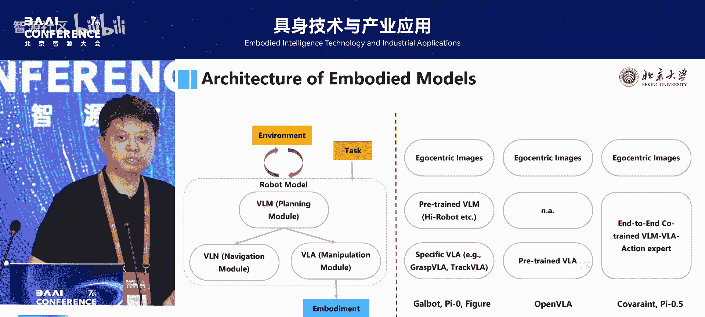

---

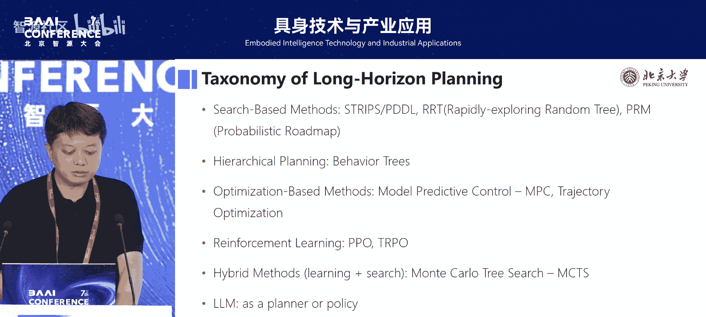

## 人工智能范式的迁移
过去十多年，人工智能领域经历了一次显著的范式迁移。我们从依赖深度模型处理特定任务，发展到利用大数据训练模型，再到如今构建像GPT这样的大规模基础模型。最近的研究趋势是试图将感知与控制形成一个闭环系统。

目前，机器人领域的技术路线尚未收敛，呈现百花齐放的状态。我们团队总结发现，大多数机器人模型架构包含一个核心模块：**规划模块**。这个模块负责将高级指令拆解为具体的动作序列。对于每一个分解出的动作，通常会由一个**策略模块**（例如模仿学习IL或强化学习RL）来执行具体的操作。

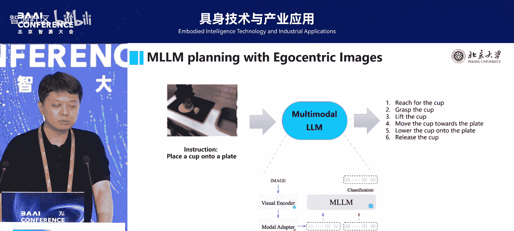

---

## 具身大脑：将大模型作为规划器
上一节我们介绍了机器人系统的通用架构，本节中我们来看看如何将大语言模型（LLM）作为规划器来使用。

当前的主流方法是直接将任务指令和场景信息（如机器人第一视角的图片）输入给大模型，让它生成动作计划。然而，这种方法存在一个根本性问题：大模型基于“下一个词预测”的方式生成内容，这是一种单向过程，无法根据后续可能的结果来调整前面的计划，缺乏对任务整体的前瞻性规划。

为了解决这个问题，我们提出了一种 **“自我提升”** 的策略。其核心思想是：让大模型对自己生成的计划进行反思和修正。

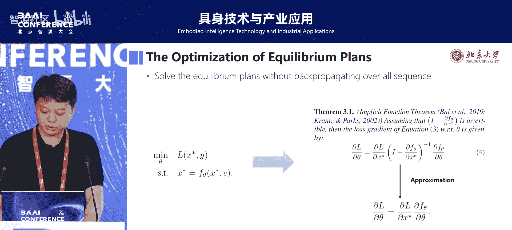

以下是该策略的工作流程：
1.  **生成初始计划**：大模型根据任务指令生成一个初始动作序列 `X0`。
2.  **获取反馈**：将当前计划 `X` 送入一个“评判器”（可以是物理仿真器或一个简单的世界模型），获得执行该计划可能结果的反馈 `C`。
3.  **迭代优化**：将计划 `X` 和反馈 `C` 一起再次输入给大模型，要求它根据反馈生成一个改进的新计划 `X'`。
4.  **循环直至收敛**：重复步骤2和3，直到计划不再改变，即达到一个“均衡点”。

从数学上，我们可以将寻找最优计划 `X*` 的问题形式化为一个寻找均衡点的优化问题：
`X* = f(X*, C)`
其中 `f` 代表大模型的规划与反思函数。

直接优化这个序列过程计算代价很高。但我们通过分析发现，可以利用隐函数定理等技巧，将整个序列的梯度计算简化为只与最终均衡点相关的计算，从而实现了训练效率的大幅提升。

为了让模型在真实环境中也能在线学习，我们引入了世界模型来提供反馈。这个世界模型可以通过收集 `(状态， 动作， 新状态)` 这样的数据对来训练，从而预测某个动作会产生什么结果。

以下是我们在标准任务集上的测试结果对比：

| 方法 | 任务成功率 |
| :--- | :--- |
| 标准 GPT-4 (零样本) | 很低 |
| 微调后的 LLaMA-3 | 显著提升 |
| 微调LLaMA-3 + 允许10次错误后修正 | 进一步提升约10% |

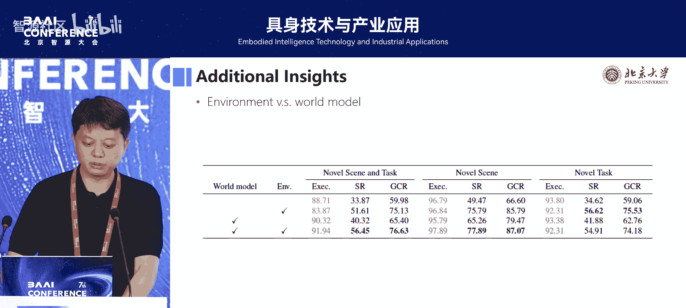

实验表明，我们的方法能有效利用反馈。例如，在执行“倒水”任务时，如果初始计划导致水洒出，模型在接收到这个“失败”反馈后，能在下一次规划中调整动作，成功完成任务。

---

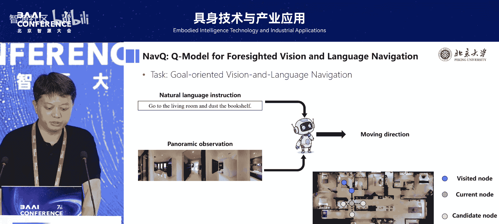

## 具身导航：预见未来的路径规划
上一节我们探讨了如何让机器“大脑”更好地规划动作序列，本节我们关注机器人的“眼睛和腿”——即如何在复杂环境中进行高效的导航。

具身导航的经典定义是：给定一个语言指令（如“去客厅拿本书”），机器人需要根据对当前环境的实时感知，规划并执行一条路径以完成指令。传统方法通常使用卷积神经网络编码当前观测信息，然后像“近视”一样选择当下看起来最优的下一步动作。这种方法缺乏对未来的预见性。

我们的核心洞察是：机器人选择方向时，应判断“从这个方向走下去，未来有多大可能性看到我的目标物体？”。例如，任务是“打扫书架”，那么在选择路径时，机器人应评估每条路径前方出现书架的概率。

我们提出了一种名为 **Q-Model** 的预训练模块。它的目标不是学习奖励，而是学习一个**场景特征预测函数**：对于环境中的任意位置，预测从该位置出发，执行一系列动作后，观察到各种物体的可能性。

这个模型的关键优势在于，它可以通过无监督的方式，在海量的环境探索数据上进行预训练，从而学习到关于场景布局和物体分布的常识。

以下是Q-Model的即插即用流程：
1.  **编码当前状态**：像传统方法一样，编码机器人当前的观测、历史路径和指令。
2.  **预测未来特征**：对于机器人当前可选的每个下一步动作，利用Q-Model预测从该位置出发的未来路径上，出现目标物体的可能性。
3.  **融合决策**：将传统方法得到的当前特征，与Q-Model预测的未来特征融合，共同决策出最优的下一步动作。

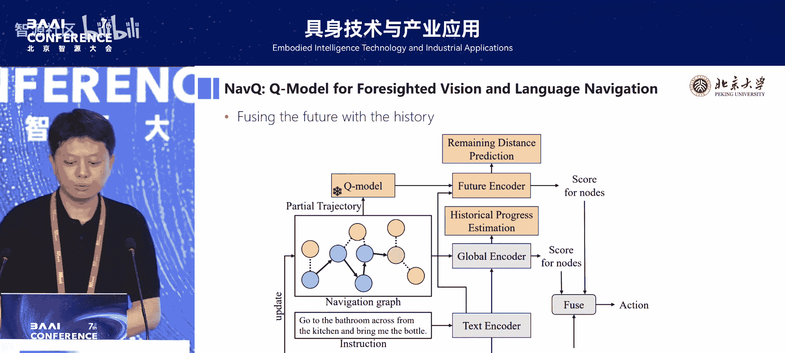

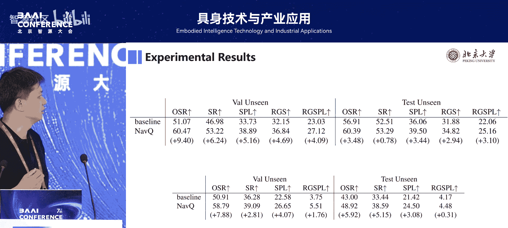

我们在多个标准导航数据集上进行了测试。结果显示，接入Q-Model后，各种基线模型的性能都获得了显著提升。直观上看，我们的方法能让机器人更少地走入死胡同或绕远路，因为它能提前排除那些未来不可能出现目标的路径。

---

## 具身小脑：从视觉观察到物理复现
前面两节分别介绍了机器人的规划与导航能力，本节我们关注更精细的物理交互能力——我们称之为“具身小脑”。我们通过一个具体的任务来验证这项技术：**积木结构理解与复现**。

任务描述如下：给定一个由他人搭建好的多层积木结构，机器人需要通过从多个角度拍摄的几张照片，完成以下推断：
1.  识别场景中每一块积木的类型。
2.  估计每一块积木在三维空间中的精确位置和姿态。
3.  推断出这些积木原始的搭建顺序。

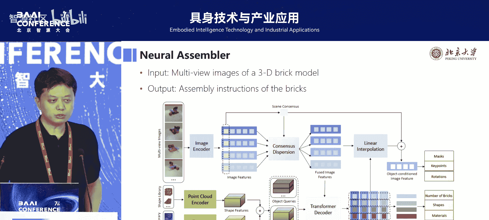

我们提出的端到端解决方案包含以下几个关键步骤：

**1. 多视角特征融合与物体查询**
我们首先从多个视角的图片中提取特征。同时，我们预设了一个包含所有可能积木类型（形状、纹理）的数据库。然后，我们采用类似DETR（基于查询的目标检测）的思想，将“物体”作为查询，将多视角图像特征和数据库特征作为键和值，从而推理出场景中所有积木的实例信息。

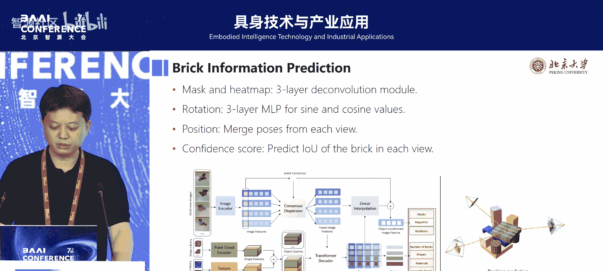

**2. 三维姿态与装配次序估计**
网络进一步预测每个识别出的积木的三维包围盒和6自由度姿态。对于装配次序，我们将其建模为一个有向图推理问题：图中的节点是积木，边代表“支撑”关系。例如，积木A在积木B之上，那么装配顺序必须是先B后A。我们使用图卷积网络来预测这个有向图，从而得到装配序列。

我们构建了一个包含复杂积木结构的数据集进行训练和验证，模型在所有子任务上都取得了优异的表现。

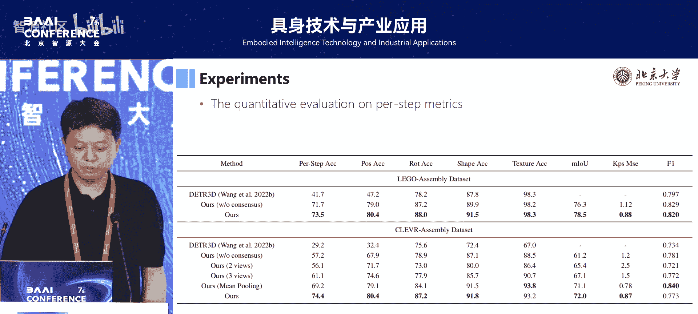

为了展示技术的实用性，我们搭建了一个真实的机器人实验平台。使用国产机械臂，让机器人观察一个搭建好的积木结构（拍摄4张照片），然后我们的模型实时推断出所有积木的类型、姿态和装配顺序，并指导机械臂在另一个区域成功地、按正确顺序复现了整个结构。

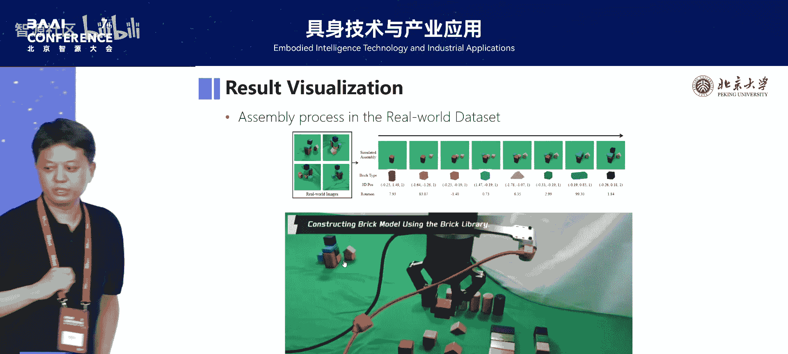

---

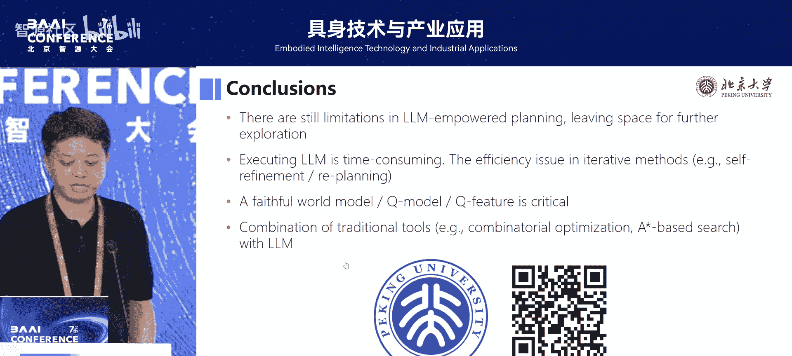

## 总结
本节课中，我们一起学习了具身智能在三个层面的研究进展：
1.  **在“大脑”层面**，我们探讨了如何改进大语言模型作为规划器的方法，通过引入“自我提升”的迭代反思机制和世界模型反馈，显著提升了长时任务规划的成功率和鲁棒性。
2.  **在“导航”层面**，我们提出了Q-Model，一个能预测未来场景特征的预训练模块。它让机器人在路径规划时具备前瞻性，可以即插即用地提升现有导航模型的效率。
3.  **在“小脑”层面**，我们通过“积木复现”任务，展示了一个端到端的系统如何从多视角视觉输入中，完整解构并复现一个复杂物理结构的类型、姿态和装配顺序。

这些工作表明，将大模型的推理能力与经典的优化、控制、三维视觉技术相结合，是推动具身智能发展的有效途径。未来，如何构建更精准的世界模型、进一步提升规划与执行的效率，仍是充满挑战与机遇的研究方向。