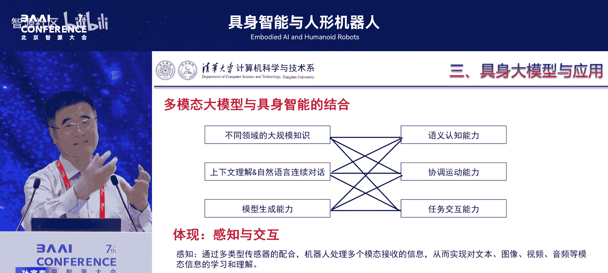
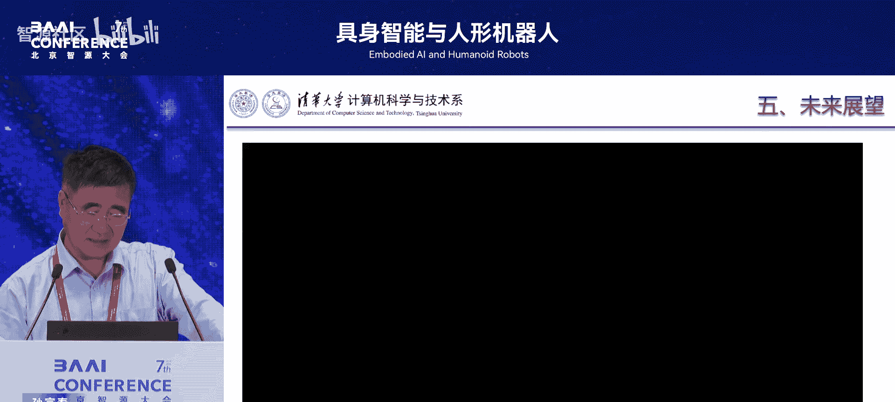
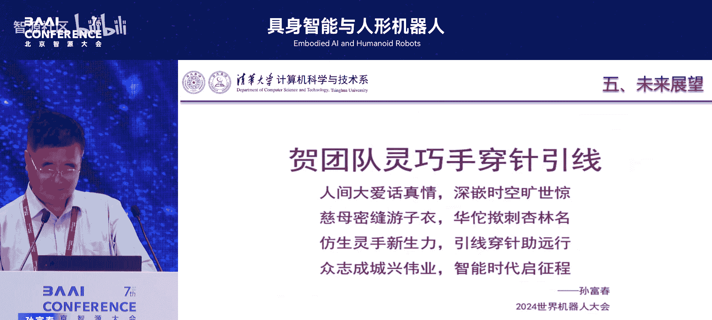
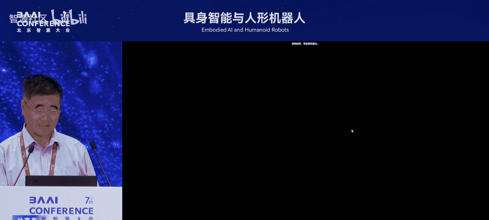

# 具身智能与人形机器人-p02-世界模型驱动的具身智能研究：孙富春

在本节课中，我们将学习孙富春教授关于世界模型驱动的具身智能研究的核心观点。课程将探讨空间智能与世界模型的区别与联系，阐述构建沉浸式数字物理系统的必要性，并展望大模型与具身智能结合的未来方向。

## 空间智能与世界模型 🌐

上一节我们介绍了具身智能研究的背景，本节中我们来看看其核心概念之一：空间智能。

具身智能研究历来由两路人马主导。一路是计算机视觉领域，以李飞飞为代表。另一路是机器人领域，以赵明国为代表。他们对具身智能的观念显然不同。

李飞飞在2024年的一次报告中指出，空间智能是在三维空间中感知、推理和行动的能力。她特别强调视觉的作用，认为人类进化始于视觉，且其他感觉系统可通过视觉产生。她的观点可概括为以下三点：
1.  **视觉化为洞察**：进行物体检测、空间关系与逻辑主体分析。
2.  **场景理解**：通过循环网络与语料库实现图像语义理解。
3.  **行动生成**：在三维世界中给出合理有效的操作与互动。

李飞飞提出了 **“Voxel”** 概念，即计算机中模拟物理空间的最小单元，能够承载物理属性。她认为智能体在具身智能中需具备以下能力：
*   判别物理属性（如物体重量）。
*   发现并利用物理规律。
*   通过语言纠正实现高精度工作。
*   执行多步任务规划。

然而，赵明国认为触觉可能比视觉更重要。仅通过视觉推理是不够的，触觉对于精细操作和纠偏至关重要。

---

世界模型是用于描述、理解、预测外部环境状态变化的抽象模型。它包含两个重要部分：
1.  如何通过物理规律理解世界（例如，理解花朵随时间盛开的规律）。
2.  如何利用物理规律做事（例如，利用工具高效打扫房间）。

世界模型的第二个重要方面是全要素建模，核心是构建内部表征以理解物理事件。这包括：
*   **构建内部表征**：例如，在无人驾驶中，不仅需要视觉感知，还需构建车辆的动力学模型。
*   **预测未来状态**：基于动力学模型进行未来状态模拟与指导。
*   **反事实分析**：通过设定不同做法得到不同结果，反向推导因果关系。这是由2011年图灵奖得主Judea Pearl提出的因果推理方法。

---

那么，空间智能与世界模型是什么关系？世界模型是一个全要素模型，而空间智能仅仅是世界模型向视觉空间的一个投影。

在动作解析中，视觉提供**拓扑关系**。但要将拓扑关系解析为知识，需要听觉和触觉。例如：
*   **触觉**：判断两个物体是否接触、进行纠偏，其精度远高于视觉。
*   **听觉**：通过敲击声音判断物体内部结构（如铁棍是空心还是实心）。

因此，空间智能中的视觉推理主要抓住了拓扑关系。而世界模型旨在构建内部表征，实现历史理解与未来预测。例如，在触觉研究中，不能仅将触觉帧转为图像并寻找时序关系（空间智能方法），而应建立触觉的动态系统模型（世界模型方法），从而生成更丰富的触觉信息。

## 构建世界模型的必要性 🔧

上一节我们区分了空间智能与世界模型，本节中我们来看看为什么在机器人操作中必须构建世界模型。

当前计算机视觉领域的具身智能研究主要集中在**具身导航**（如无人驾驶）。李飞飞团队尝试仅通过视觉推理取代雷达。然而，涉及跨任务、跨场景的**操作过程**研究却很少。

关键在于学习人类如何操作物体。人类操作需要：
*   了解操作环境的物理属性。
*   感知操作物体的形状、质地、柔性和力的反馈。
*   使用手或工具进行操作。
*   通过感知、预测、调整形成闭环，并反复练习，通过神经可塑性建立映射。

即使是同一物体，在不同状态或使用不同末端执行器（如五指 vs. 双手）时，操作策略也不同。因此，**操作是人工智能中最难的问题之一**。

过去的人工智能（如符号主义推理、深度学习）主要是开环的。而操作任务必须是闭环的（感知-预测-调整），并需上升到认知程度。我们应该充分理解人类如何操作物体，并将这些原理应用于机器操作中。

---

一个核心观点是构建**沉浸式感知**。这一思想源于1962年麻省理工学院提出的“沉浸式交互”，旨在构建能与真实物理世界产生沉浸感的计算机环境。

当前已有一些工具在向此方向发展：
*   **Unified Robot Description Format (URDF)**：用于语义和运动结构模拟。
*   **Unity**：用于抓取操作和三维渲染。
*   近期工作开始注入光照、材料等物理属性（如NVIDIA的Isaac Sim）。

然而，当前仿真环境（如Isaac Sim, MuJoCo）主要以点云为主，缺乏力觉、触觉、听觉，与真实场景差距大，且难以复现智能体与环境的真实交互。基于仿真习得的技能也难以迁移到真实场景。这限制了以操作为主导的具身智能发展。

因此，我们提出构建**数字物理系统**，以实现沉浸式、高鲁棒、强可迁移的研究。我们去年发表在IEEE汇刊上的一篇文章就构建了这样一个系统，它包含：
*   物体的质量、杨氏模量、泊松比、转动惯量。
*   每个实体（包括智能体）的动力学模型。
*   非刚体属性的操作目标。
*   力觉、运动触觉和接触触觉的生成。

一个重要工具是结合**神经辐射场 (NeRF)** 与**三维高斯溅射 (3D Gaussian Splatting)**，实现铰链物体的建模和沉浸式相互作用。

## 世界模型的应用与知识迁移 🚀

上一节我们探讨了构建世界模型的必要性，本节中我们来看看其具体应用和知识迁移的作用。

构建数字物理系统后，下一步是利用世界模型在三维世界中进行推理。例如，在装配过程中，首先需要进行**任务编排**，考虑空间位置关系、几何与拓扑，以避免后续操作被前期操作干扰。

第二部分是多模态推理。我们团队做了两方面工作：
1.  **同构多模态场景感知**：融合深度信息（形状特征）与RGB信息（边缘特征），进行物体分割与重建。
2.  **异构多模态物体重建**：配对视觉、听觉和触觉信息进行物体重建。

第三，利用世界模型结合物理属性进行精细操作，例如根据物体的位置、几何属性、材质进行操作，并理解人机协作中的意图以提高效率和安全性。

第四，实现从三维感知到四维感知（增加时间维度），从单纯几何信息到时空联合的物理信息，从空间推理到物理推理。我们提出了一个 **“BAANT”具身体**，它包含物理感知、物理行为以及类似人脑的推理部分，实现了上述跨越。

世界模型构建后，我们实现了从被动感知到**知识引导下的主动感知**，从单一模态到多模态（同构与异构），从依赖模型到**融合知识**（知识+端到端学习）。大模型在其中扮演重要角色。

---

知识迁移对于实现通用操作至关重要。人类通过学习大量技能（感知、认知、运动、操作层面），并通过反复练习形成脑体协同，实现技能的迁移与进化。

我们在一个数字物理系统中训练策略，然后迁移到真实物理世界。策略性能的上界 `P_performance` 受以下因素影响：
*   最优策略部分 `π_optimal`
*   样本分布 `D`
*   带标签的样本数量 `N`（视觉、触觉、听觉标签）

公式表示为：`P_performance ≤ f(π_optimal, D, N)`
标签越多（`N` 越大），性能上界越小，说明沉浸式感知越重要。

我们构建了一个学时同步的数字物理系统和迁移学习软件系统，包括触觉模拟、NeRF渲染，并通过具身强化学习实现操作。过程中利用知识引导，并通过神经符号系统修正因交互残差导致的知识偏差。

## 工业应用、大模型与未来展望 🏭🤖

上一节我们介绍了世界模型的应用，本节中我们来看看其在工业和大模型背景下的实践与未来。

在制造业应用方面，我们关注两个方向：
1.  **面向单机**的具身智能。
2.  **面向云边端**的具身智能。后者是下一步的核心问题。例如，在中美贸易背景下，企业海外建厂面临高人工成本。解决方案是携带机器人，并通过云边端进行远程操作。

---

大模型为具身智能的垂直应用提供了以下能力：
*   内部知识库
*   强大的垂直搜索能力
*   上下文对话
*   样本与代码生成

将大模型与具身智能（一个在物理空间与我们交互的机器人）结合，关键在于大模型内部需要一个**沉浸式实验室**（数字物理系统）。在此实验室中的训练数据源于真实物理系统，并能与之交互，进行模型修正（包括动力学、几何和感知层面）。我们正与立讯精密、比亚迪等企业合作此类应用，例如手机的自动化打磨与各种类型软排线的装配，这对泛化能力和鲁棒性要求极高。

---

当前大模型（如VIMA, PaLM-E）应用于操作时面临挑战：
1.  主要通过语言描述和视觉设定来训练，**缺乏触觉信息**，因此是不完整的。
2.  训练数据以图文为主，影响跨场景操作能力。
3.  大模型的推理规划输出如何有效转为具体控制策略。
4.  缺乏足够的控制轨迹数据。

因此，**多模态轨迹采集**至关重要。例如，一次操作可能需要采集两路视觉和两路触觉信息。NVIDIA已构建了120万条轨迹（32TB数据），而我们的目标是200万条轨迹（52TB数据）。高效的轨迹采集与复杂操作技能的动态策略构建是未来重点。

---

未来展望还包括：
*   **泛化场景与模型采集**：通过对抗学习生成多样路径与操作特性，利用强化学习实现策略覆盖，在不同任务中精炼模型，实现学习与进化。
*   **通用智能评测**：设计**具身图灵测试**，从当前的开环测试转向闭环测试，以验证智能体的通用智能性。

我们团队研发的**“灵巧手”**负载达12公斤，击打频率达每秒20次（人类为16次），已应用于穿针引线等精细操作，展示了感知与行为的闭环。我们正在研发0.05毫米的新型触觉传感器，但降低成本是下一步挑战。

---

**本节课中我们一起学习了：**
1.  **空间智能**（以视觉为中心）与**世界模型**（全要素建模，包含物理规律与内部表征）的区别与联系。
2.  在机器人操作中构建**世界模型**和**沉浸式数字物理系统**的必要性，以实现闭环感知和技能迁移。
3.  世界模型在**多模态推理**、**精细操作**和**知识迁移**中的具体应用。
4.  **大模型**与具身智能结合的关键在于构建包含多模态信息的沉浸式训练环境与轨迹数据。
5.  未来研究方向包括**云边端操作**、**多模态轨迹采集**、**泛化能力提升**以及**具身图灵测试**。

构建融合物理规律、多模态感知和知识推理的世界模型，是推动具身智能从感知走向认知、从单一任务走向通用操作的核心路径。