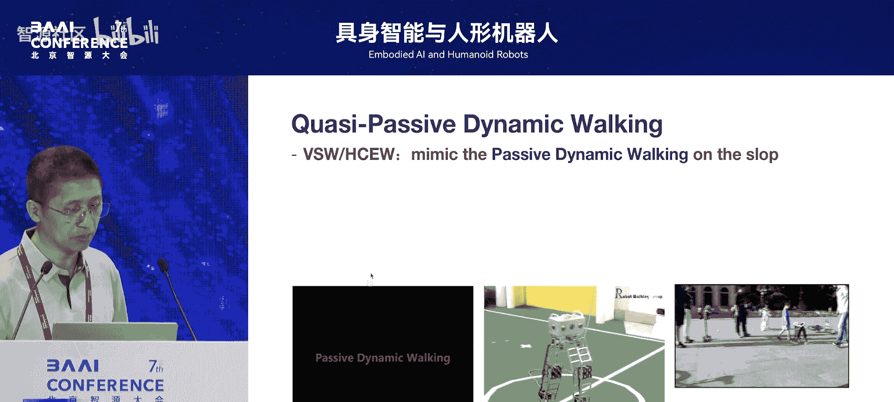
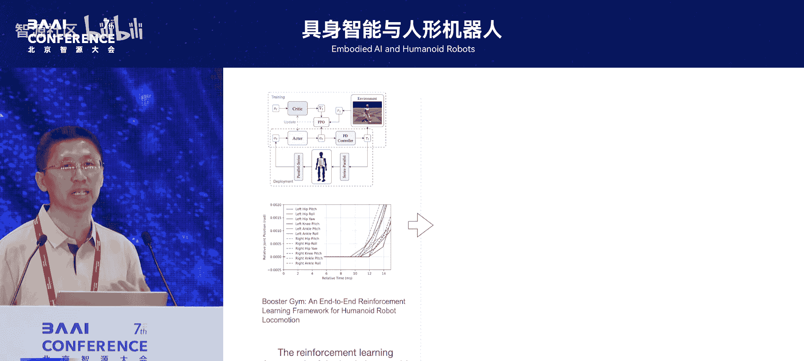
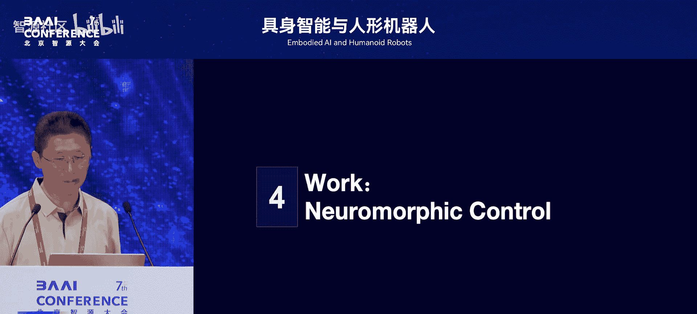
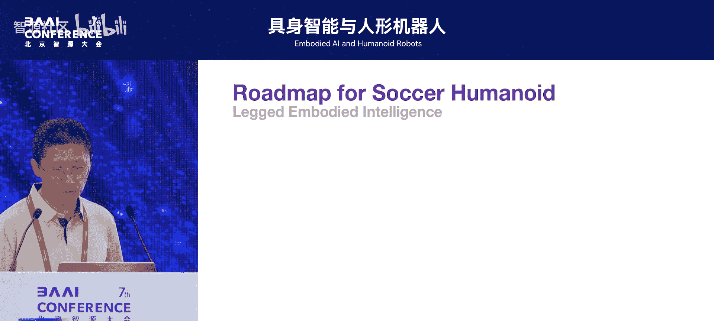

# 具身智能与人形机器人-p03-人形机器人的仿生—从控制到具身智能：赵明国

在本节课中，我们将跟随清华大学赵明国老师的报告，探讨人形机器人如何从仿生控制走向具身智能。我们将了解机器人运动控制的力学原理、现代优化控制方法，以及借鉴神经系统结构的新型类脑控制框架。课程旨在为初学者梳理出一条从基础力学到前沿智能的清晰脉络。

## 报告人介绍 🎓

赵明国老师是清华大学自动化系的研究员、机器人控制实验室主任，同时担任清华大学无人系统中心类脑机器人中心的负责人。他发表了数百篇论文，并拥有十余项国家发明专利。

在人形机器人领域，赵老师提出了虚拟斜坡行走法、广义模型预测控制等具有影响力的工作。其利用类脑技术构建智能无人驾驶自行车的研究曾发表于《自然》杂志封面，并被评为2019年度中国科学十大进展。

## 具身智能的范畴与思考 💭

上一节我们介绍了报告人的背景，本节中我们来看看赵老师对“具身智能”这一核心概念的思考。

赵老师首先对“具身智能”的范畴进行了探讨。他认为，人类的智能发展经历了漫长的过程：约700万年前开始直立行走并使用工具，200多万年前出现语言，近几万年才出现文字，而现代高级智能（如文学艺术）则是近几千年才出现的。因此，具身智能至少应包含文字出现之前，人类通过几百万年进化而来的运动、操控、使用工具等基础能力。这区别于近几千年发展出的高级认知智能。

基于此，他提出了一个关键问题：当前火热的VLA（视觉-语言-动作）模型中的“L”（语言）究竟指什么？在具身智能的语境下，是否必须依赖语言？这引发了关于智能底层构成的思考。

## 实验室工作概览 🚴⚽

以下是赵明国老师实验室主要研究方向的简要介绍。

*   **类脑芯片与自行车**：实验室与类脑中心合作，将感知、控制、决策全部集成在一块类脑芯片上，实现了无人驾驶自行车。这项工作展示了在单一芯片上完成复杂机器人任务的潜力。
*   **足球机器人**：长期致力于机器人足球项目，旨在通过这项复杂的任务来攻克智能控制问题，前期工作主要集中在运动控制层面。

## 从被动行走到现代控制 🚶➡️🤖

上一节我们了解了实验室的整体工作，本节中我们将深入探讨人形机器人行走控制的发展历程。

研究始于对“被动行走”的力学原理探索。被动行走指一个纯机械结构在斜坡上，仅需初始条件便能自主产生稳定周期步态的现象。2005年《科学》杂志的一项研究基于此原理，制造出了能量效率与人类相当的行走机器人。

其核心力学原理可归结为两点：
1.  **落地碰撞**
2.  **摆动腿的摆动**

将这两个原理结合，便能实现高效的行走。骨骼结构本身具备这些力学特性。基于被动行走，研究者们发展出了“准被动行走”，即用控制或驱动替代斜坡的作用，使其在平地上实现高效、仿生的行走。

随后，控制层面被引入以适应复杂环境。赵老师团队在此领域的主要贡献包括：
*   **弹簧增强的被动行走**：在被动行走模型中加入弹簧，显著增强了行走的稳定性和地形适应能力。
*   **虚拟斜坡方法**：采用开环控制，使系统能量自动达到平衡，实现稳定行走。
*   **髋部弹簧耦合**：模拟人体髋部肌肉与韧带的耦合作用，产生稳定的行走模式。

这些早期工作虽难以直接应用，但深刻揭示了行走的力学本质。

## 基于模型的优化控制方法 ⚙️📈

从被动行走的原理研究出发，机器人控制需要更强大的方法来应对复杂任务。本节中我们来看看基于数学模型和优化的现代控制方法。

在与深圳优必选公司合作开发Walker系列机器人时，团队采用了基于简化动力学模型的规划与控制方法。其流程可概括为：
1.  使用简化模型进行运动轨迹规划。
2.  通过控制各关节来跟踪该轨迹。
3.  受到干扰后，重新规划轨迹，形成大闭环。

其中，团队借鉴了仿生原理，提出“虚拟倒立摆”模型，将支撑点置于地面以下，使机器人的脚压中心轨迹更接近人类。

2016年后，基于优化的控制成为主流，主要分为两类：
*   **全身控制**：将机器人的所有任务目标和约束（如关节力、运动范围、ZMP稳定性）构建为一个整体的优化问题求解。其公式可抽象为：
    `min J(x, u) subject to g(x, u) = 0, h(x, u) ≤ 0`
    其中 `J` 是目标函数，`g` 和 `h` 是等式与不等式约束。这种方法能在完整动力学模型下实现精确控制，但计算量大，且是“当前时刻”的最优。
*   **模型预测控制**：为解决预测问题，使用一个更简化的模型进行未来一段时间的预测优化，再用全身控制进行跟踪校正。这类似于导航时，我们先用简化的点状模型规划路径，再考虑具体的车辆动力学去执行。

这套“MPC规划 + WBC跟踪”的方案在控制理论上较为完美，使机器人在粗糙路面行走、抗干扰、握手等任务上表现出色。但其缺点是针对特定任务需要专门设计和大量调试，泛化能力和实用性面临挑战。

## 强化学习在机器人足球中的应用 ⚽🧠

基于模型的方法虽然精确，但缺乏适应性和学习能力。本节中我们转向另一种前沿方法——强化学习，看看它如何在动态复杂的足球任务中发挥作用。

赵老师团队从去年开始探索强化学习，主要应用场景是机器人足球。他们采用了“虚实融合”的训练方法，先在仿真中训练，再用真实的控制器部署验证代码的可行性。

在足球任务中，团队聚焦于几个基本技能模块：
*   行走
*   踢球
*   视觉带球
*   对抗下的平衡恢复
*   摔倒后快速站起
*   拖拽功能（允许被裁判轻松拖离场地）

基于这些，团队开发了强化学习的基本框架，并取得了初步进展：
1.  实现了快速爬起、平衡恢复等技能。
2.  尝试构建更通用的端到端框架，让机器人通过视觉直接感知环境，并输出行走、踢球等行为指令。

## 类脑控制框架的探索 🧬🔌

无论是优化控制还是强化学习，其执行器（控制器）与传统工业控制器并无本质不同，这与人类的运动控制方式相去甚远。本节中，我们将探索如何从仿生角度，借鉴神经系统原理来构建全新的控制器。

赵老师指出，人类的运动控制并非由大脑单独完成，而是由**五个部分**协同工作的结果：
1.  **大脑**：运动规划（约690亿神经元）。
2.  **小脑**：复杂运动控制、多关节协调（约180亿神经元）。
3.  **脊髓**：简单运动控制、反射、节律控制（如心跳、呼吸，约7亿神经元）。
4.  **丘脑与脑干**：也参与运动调节（约7亿神经元）。

神经系统信号传递具有两个通路：**上行**（感知信号传至大脑）和**下行**（控制指令传至执行器）。同时存在**三个反馈回路**，对应不同的反应速度：
*   **一阶回路（脊髓回路）**：最快，处理简单反射（如烫伤缩手）。
*   **二阶回路（小脑回路）**：中等速度，协调多关节运动。
*   **三阶回路（大脑回路）**：最慢，进行长期规划和决策。

受此启发，团队尝试构建一个类脑控制框架，**用类脑控制器替代传统的PID或优化控制器**。该框架抽象了四个模块的功能：
*   **脊髓模块**：实现最底层的快速反馈控制。
*   **脑干模块**：实现类似PID但可自适应调节的反馈控制。
*   **丘脑模块**：适应负载变化。
*   **小脑模块**：进行重力补偿和多关节运动的预测与协调。

该框架使用**脉冲神经网络**（第三代神经网络，SNN）进行实现。SNN模拟生物神经元通过膜电位变化产生脉冲信号的方式，具有计算高效、能耗低的特点。

在数学实现上：
*   对于关节控制，使用一对**拮抗**的SNN神经元来模拟人体对抗肌的工作方式，分别控制正反两个方向的运动。
*   小脑模块由于涉及序列预测和记忆，采用了具有循环结构的SNN网络。

通过仿真和实物实验，在**轨迹跟踪**和**未知负载变化**的任务中验证该框架。实验发现：
1.  关节刚度、阻尼等特性会随任务自适应变化，与人类运动特征有相似之处，而传统控制方法难以产生此类关联。
2.  在负载突变（如空杯突然被倒入沙子）时，框架能通过在线学习快速适应，其适应速度与人类反应相似。

这表明，该仿生控制框架在运动特性、负载适应和快速学习方面，初步展现出了一些“类人”的效果。

## 类脑与VLA的关系及人形机器人发展路径 🗺️

最后，赵老师分享了他对类脑研究与当前主流的VLA模型关系的思考，并提出了人形机器人智能发展的分层路径。

**类脑与VLA的关系**：
赵老师认为，当前的具身智能研究主战场在于VLA模型，即如何将视觉、语言等传感器信息直接映射为控制指令或运动轨迹。而他研究的**类脑控制器**，目标并非替代VLA，而是**替代VLA模型后端执行动作的传统控制器**。同时，类脑研究在前端的**新型传感器**（如类脑视觉传感器）和后端的**新型控制器**上都有巨大改进空间，可以与VLA模型结合，形成更高效的具身智能系统。

**人形机器人智能发展路径**：
赵老师提出了一个二维发展框架来理解人形机器人的能力进阶：
*   **纵轴（智能水平）**：从底层的“具身智能”（基础运动能力），到需要大脑介入的团队协作、战略对抗等高级智能。
*   **横轴（任务难度）**：从简单的闭眼运动，到需要感知导航的复杂任务。

目前大部分研究工作仍集中在最底层的L0（基础运动）和L1（简单感知导航）水平。而要让人形机器人真正进入家庭等实用场景，可能需要达到L4或更高水平。这意味着，在智能水平提升的同时，对硬件、传感器和算法的复杂度要求也会急剧增加。当前许多机器人仍需人工遥控，正是因为其智能水平尚未达到完全自主完成复杂任务的程度。

## 总结 📚

本节课中，我们一起学习了赵明国老师关于人形机器人从仿生控制到具身智能的精彩论述。我们从最基础的被动行走力学原理出发，了解了基于模型的优化控制方法，探讨了强化学习在动态任务中的应用，并深入研究了借鉴神经系统结构的类脑控制框架。最后，我们厘清了类脑研究与VLA模型的关系，并展望了人形机器人智能发展的分层路径。这条从力学到控制，再到仿生智能的探索之路，为我们理解和发展更智能、更灵巧的机器人提供了宝贵的思路和方向。