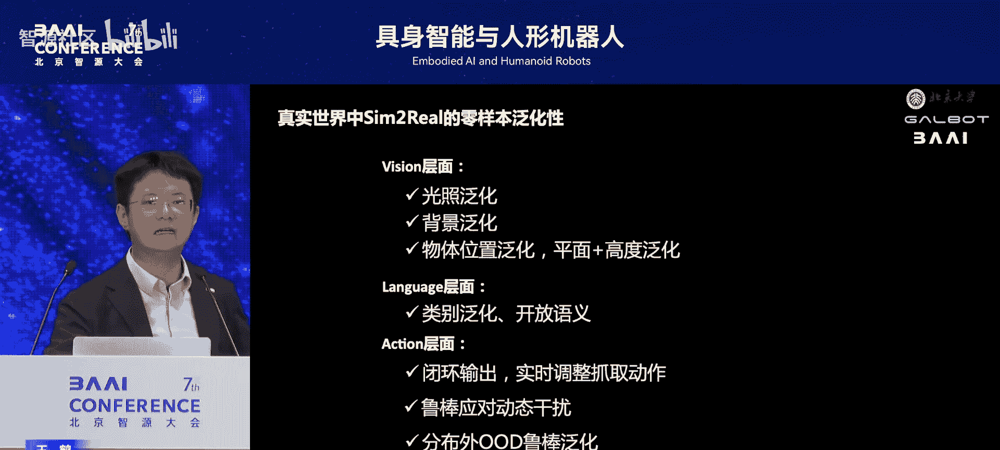
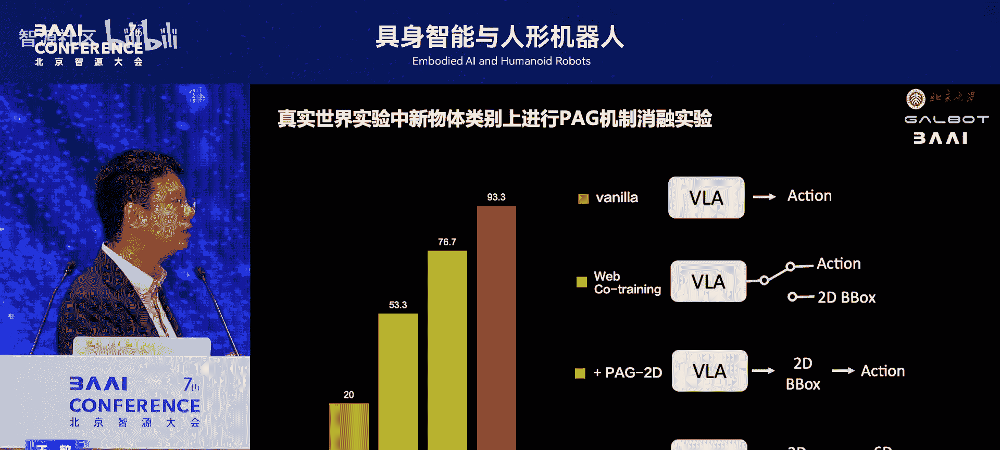
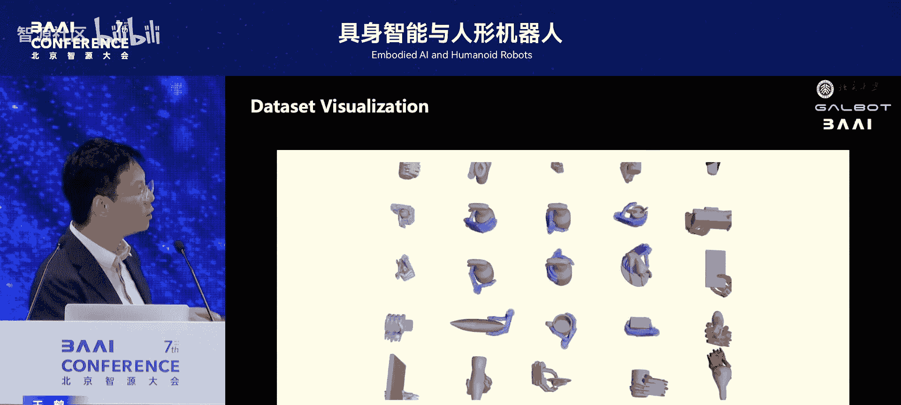
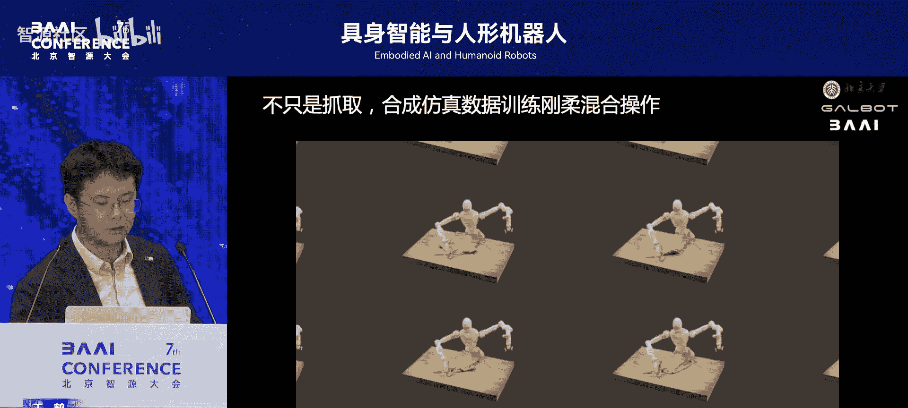
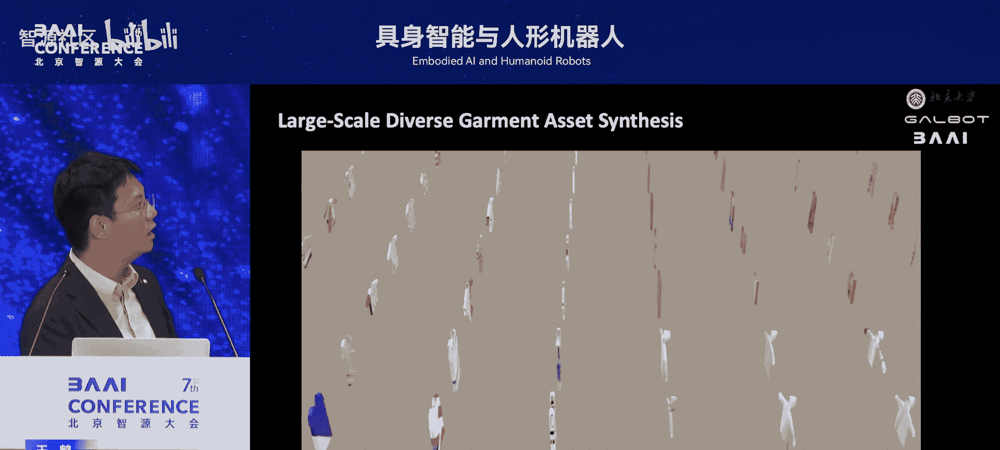
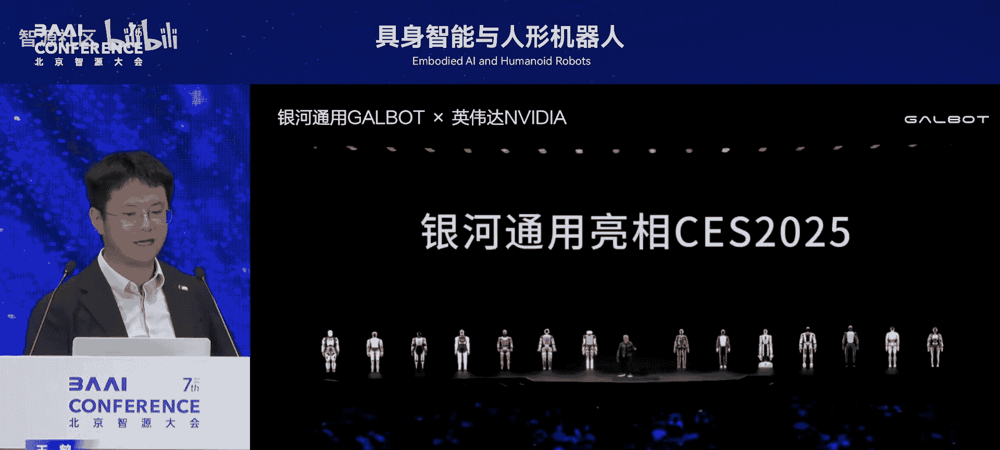
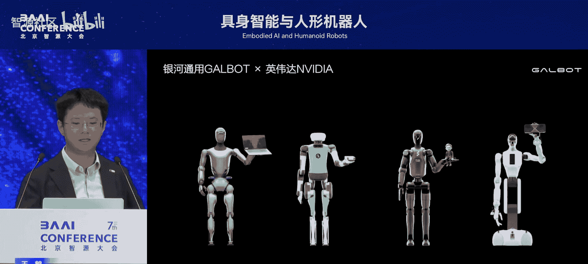
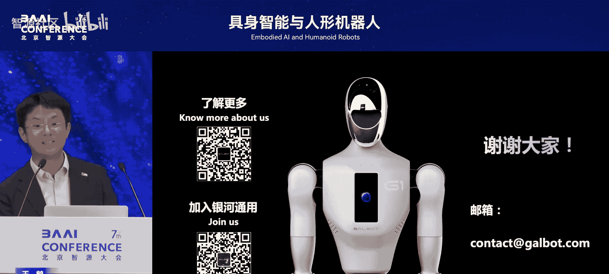

# 具身智能与人形机器人-p04-合成数据驱动的具身VLA大模型：王鹤

在本节课中，我们将探讨一个备受关注的技术路线——视觉-语言-动作模型。我们将了解其核心概念、当前面临的挑战，以及如何利用大规模合成数据来高效训练此类模型，从而推动通用机器人的发展。

## 什么是VLA模型？

上一节我们介绍了通用机器人的愿景，本节中我们来看看实现这一愿景的一个关键技术：VLA模型。

VLA是Vision-Language-Action模型的简称。它是一个端到端的多模态大语言模型。其目标是让机器人能够理解人类的自然语言指令，并结合视觉感知，直接输出控制机器人执行动作的命令。

以下是VLA模型的核心构成：
*   **输入 - 语言指令**：这是实现通用性的关键接口。用户可以用自然语言随意下达指令，例如“拿起那个盒子”。
*   **输入 - 视觉信息**：视觉是人类获取信息的主要方式。对于通用机器人而言，整合视觉模态至关重要。
*   **输出 - 动作**：模型直接输出机器人的控制指令。在早期工作中，如谷歌的RT-2模型，输出是机械臂末端执行器的瞬时运动指令，例如三维平动 `Δx, Δy, Δz` 和三维转动 `Δrx, Δry, Δrz`。

我们可以将VLA模型类比为机器人的“大脑”快系统。它负责根据感知实时生成运动轨迹，而具体的底层控制（如逆运动学解算、PID控制）则交由类似“小脑”的控制器执行。VLA强调快速闭环反馈，频率可达数十赫兹。

## 数据难题：为什么不能只依赖真机采集？

VLA模型的能力依赖于大量高质量数据的训练。目前主流方法是采集真实世界的遥操作数据。

然而，这面临巨大挑战。以自动驾驶为例，头部车企拥有百万级车辆，每日可回流上亿条驾驶片段数据。相比之下，当前全球最大的具身智能数据集仅约百万到两百万条。

问题的核心在于自由度差异。汽车的控制自由度很低（方向盘、油门刹车），而人形机器人自由度极高（全身可达上百个）。如果我们完全依赖真机采集数据，就需要先量产百万台人形机器人，并雇佣大量人员进行数据采集，这显然不现实。

因此，我们的核心观点是：**必须利用合成仿真数据来破解具身智能的数据难题**。

## 解决方案：合成数据驱动的训练新范式

我们的团队提出并实践了一条新路径：利用大规模、高质量的合成数据训练VLA模型。

### 构建大规模合成数据集

我们构建了完整的合成数据管线，覆盖从物体资产生成、交互场景搭建到动作轨迹标注的全流程。

以下是合成数据管线的关键能力：
*   **生成多样化的物体与场景**：穷尽物体在形状、材质、堆放方式上的变化，以及光照、背景、桌面纹理等环境变量。
*   **自动生成精准标注**：为每一帧合成数据自动生成视觉包围框、抓取位姿和动作轨迹的标签，确保数据一致性。
*   **支持灵巧操作**：基于数学优化和物理仿真，能合成人手分类学中的33种抓取模式，覆盖千万级物体的抓取数据。
*   **生成长程复杂操作**：支持如叠衣服等需要多步调整的长程任务数据生成。

基于此，我们生成了规模达**百亿帧**的机械臂抓取轨迹数据，每一帧都配有 `(视觉， 语言， 动作)` 的完整标签对。

### 模型架构：具身思维链

我们训练了全球首个完全使用合成动作数据、未使用任何真实世界动作数据预训练的VLA大模型——GraspVLA。

该模型采用“具身思维链”架构进行推理，而非直接输出动作。其流程可表示为：
1.  **定位**：根据指令 `语言`，输出目标物体的二维包围框 `B`。
2.  **推理**：基于包围框 `B`，推理出适合的六自由度抓取位姿 `G`。
3.  **执行**：最后，通过一个流匹配专家，输出连续的七自由度瞬时动作 `ΔA`（平动、转动、夹爪开合）。

整个过程是自回归的，公式可简化为：`动作 = 模型(视觉， 语言， 思维链)`，其中思维链为 `B -> G`。

### 混合训练策略

单纯合成数据无法覆盖世间所有物体名称和语义。因此，我们采用混合训练策略：
*   **合成数据**：提供 `(视觉， 语言， B, G, 动作)` 的完整标签，用于训练整个思维链。
*   **互联网图文数据**：收集了包含1亿个包围框标注的互联网图像-文本对，数据形式为 `(视觉， 语言， B)`。这部分数据没有动作标签，仅用于训练模型的第一阶段（包围框预测）。

通过混合训练，模型既掌握了从合成数据中学到的精密操作技能，又吸收了互联网数据中的广泛视觉语义知识。

## 效果验证：强大的零样本泛化能力

经过上述方法训练的模型，展现出卓越的零样本泛化能力。

### 仿真环境测试

在公认的基准测试集Libreal上，我们的模型在**未经任何微调**的情况下，其长程任务和物体抓取的成功率，全面超过了需要**在特定测试环境中进行微调**的PaLM-E等模型。

### 真实世界测试

模型在真实世界中同样表现强劲，在光照、背景、物体类别、位置等方面均表现出零样本泛化能力。

以下是部分演示结果：
*   **动态干扰**：在抓取过程中，人为移动目标物体或投入新物体，模型能实时调整并成功抓取。
*   **密集货架**：在商品琳琅满目、紧密摆放的货架上，能准确抓取指定商品，并支持更换抓取顺序、抗干扰等。
*   **细粒度操控**：可根据“用握笔姿势抓药盒”等细粒度语言指令，执行不同的抓取模式。
*   **长程操作**：能完成叠衣服等复杂长程任务，并在过程中抵抗干扰（如用衣架挑动衣服）。

### 高效技能迁移

合成数据好比“义务教育”，让模型彻底学会基础技能。在真实世界中，只需极少量“上岗培训”数据，模型就能举一反三。

例如，我们仅用**200条**（约半个人天工作量）真实遥操作数据对模型进行微调，就能让模型学会在密集摆放的20瓶水上从头到尾成功抓取。并且，该技能能零样本泛化到其他品牌、不同摆放布局的饮品上。这大幅降低了机器人技能部署的成本。

## 拓展与应用

我们的合成数据驱动方法已拓展到多个领域：

*   **移动导航**：训练出的模型能在全新环境中，零样本服从复杂的长程指令（如“向右移动找到那个人并跟随他，直到看见沙发”），实现全视觉、无需SLAM建图的导航与跟随。
*   **产业落地**：相关技术已应用于24小时无人零售店、汽车工厂物料搬运、酒店礼品店等场景，将人形机器人作为实际生产力工具。

## 迈向全人形机器人

最后，我们将VLA与全身控制结合。通过强化学习在仿真中训练，并结合遥操作，我们实现了人形机器人的全身协同操控，例如蹲下并抓取地面物体，同时保持身体平衡。相关成果（Open-WBT）已开源，推动全人形机器人研究。

## 总结

本节课中我们一起学习了VLA模型的核心概念，以及如何利用合成数据驱动其训练。关键点在于：
1.  VLA模型是实现通用机器人的重要“大脑”快系统。
2.  完全依赖真机采集数据存在规模瓶颈，合成数据是破局关键。
3.  通过构建大规模、高质量的合成数据管线，并结合“具身思维链”模型架构与混合训练策略，可以训练出具有强大零样本泛化能力的VLA模型。
4.  这种方法能显著降低机器人技能获取与部署的成本，并已在实际场景中验证有效，是推动具身智能走向通用、实用的可行路径。