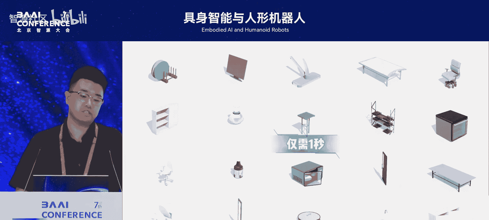
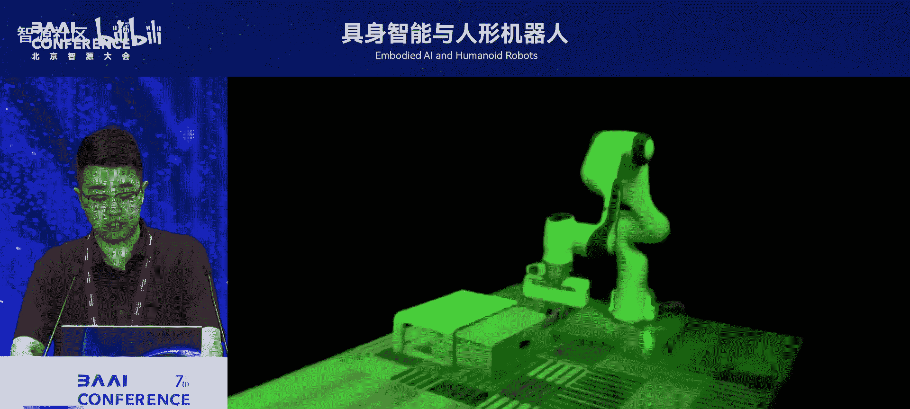
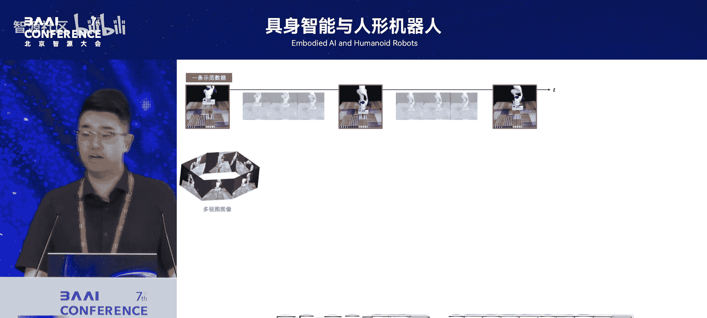
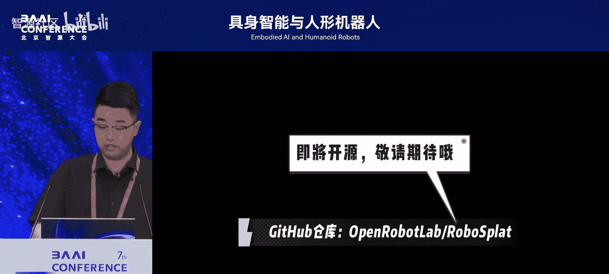
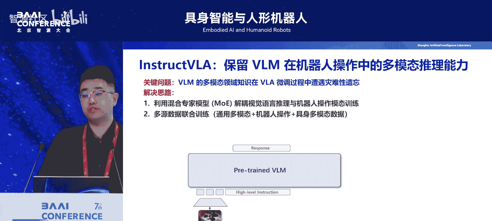
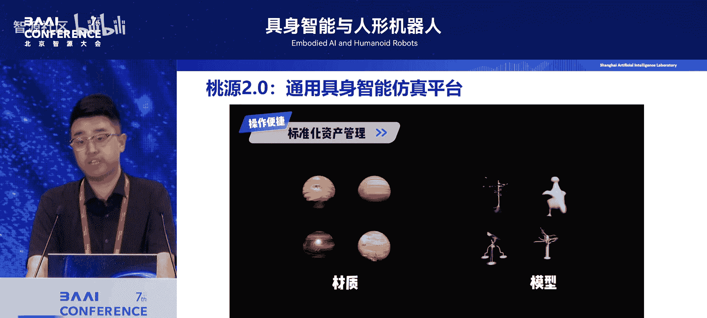
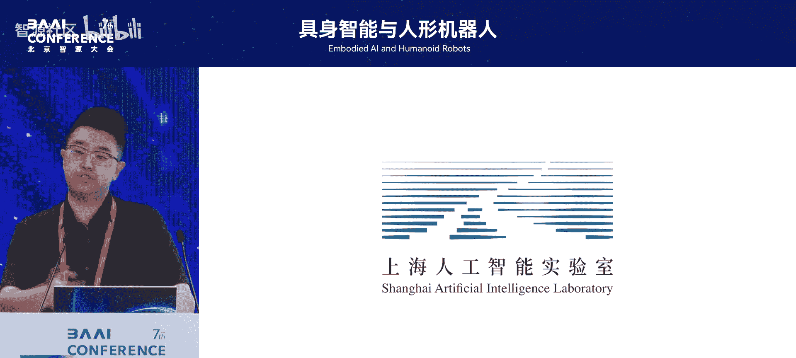

# 具身智能与人形机器人-p05-可泛化操作与运动智能；庞江淼

在本节课中，我们将学习上海人工智能实验室庞江淼博士关于可泛化操作与运动智能的分享。课程将围绕数据、模型与评测三大核心要素，探讨如何实现机器人技能的本体、任务与场景泛化，并介绍相关前沿技术进展。

## 概述

具身智能的核心能力包括感知、认知、推理、移动与操作。从人工智能算法角度看，其核心是为具身智能解决三个泛化问题：**本体泛化**、**任务泛化**和**场景泛化**。这带来了诸多科学与技术挑战，也引发了不同的技术路线探索。

## 数据：合成与真实的协同

数据是人工智能算法的基石。在具身智能领域，合成数据与真实数据各有优劣，协同使用是关键。

合成数据有助于实现**本体泛化**和**场景泛化**。通过机器人的描述文件，可以在仿真环境中模拟任意机器人本体，并生成多样化的物体与场景。但其在实现复杂、物理真实的**技能泛化**上相对困难。

真实数据则非常有助于**任务泛化**。对于特定技能，可以随时在真实世界采集数据。但无法穷尽所有光照、场景和物体条件。

因此，当前的核心科学问题是如何通过多种数据生成与利用方式，协同解决这三类泛化问题。

## 模型：VLA的定义与演进

在模型层面，视觉语言动作模型是当前的研究热点。业界对VLA的定义较为发散，主要可分为三种类型。

以下是三种常见的VLA定义：

1.  **狭义VLA**：以RT系列模型为代表，在保留语言模型交互能力的基础上，直接为其添加动作输出能力。这是最初、最狭义的VLA概念。
2.  **A式VLA**：采用一个成熟的视觉语言模型作为预训练权重，在此基础上训练动作模型。它利用了基础模型的泛化能力，但本质上仍是动作模型。
3.  **广义VLA**：任何包含视觉、语言和动作模态的模型，都可能被称为VLA。

通常认为，只有前两种通过**动作模型训练范式**获得的模型才属于真正的VLA。其中，第二种常被称为“A式VLA”。而如何设计双系统架构，在保持语言交互能力的同时增强动作能力，是一个重要的研究方向。

## 评测：建立有效的评估体系

评测体系对技术发展至关重要。目前，针对**场景泛化**和**任务泛化**，尚缺乏一套足够公正的体系来评估不同动作模型的泛化能力。

评测的难点在于：真实世界的评测不可重复；仿真环境中的评测则受限于**虚实一致性**问题。一个实用的观点是：评测的价值在于**相对排序**方法，而非追求绝对客观。只要能有效区分方法优劣，就是一个合理的评测方式。

## 技术进展：数据合成与高效扩增

上一节我们探讨了数据的重要性，本节我们来看看如何利用生成式技术高效合成数据。

实验室提出了 **“Infinite Mobility”** 工作，通过程序化建模方式，快速、泛化地生成22类可交互物体数字资产，并导入仿真环境。机器人可以在其中自主生成多样化的操作轨迹，为训练提供丰富的场景。

一个关键问题是：训练一个技能需要多少真实数据？从成本角度，目标是**最小化真实数据采集，最大化合成数据利用**。技术路线是持续压低真实数据需求，提升合成数据质量，最终实现零样本迁移。

初步结论是：对于中小范围空间任务，约800条视角数据可实现约80%的成功率。不同物体类型所需的数据配方不同，这能指导数据引擎的合成工作。

为了更高效地对环境进行扩增，实验室利用 **高斯溅射** 技术实现高保真操作场景重建与编辑。通过对多视角图像重建的三维高斯场景直接进行编辑，可以变换物体、机器人类型、光照和背景。

这项技术实现了 **“一条真机数据任务实例化”**。仅采集一条真实机器人数据，就能通过合成数据解决本体和场景泛化问题，在真实世界中实现包括物体类别、相机视角、背景、光照、本体等多个维度的强泛化能力。其效果相当于在真机上采集200条视角数据。

## 技术进展：导航与操作模型

在模型方面，研究围绕导航和操作两大任务展开，致力于通过双系统协同提升感知、交互与执行能力。

### 导航模型

导航任务远未解决。传统SLAM方案在已知地图、固定场景下表现良好，但无法满足**无地图场景**下的**语言交互式导航**需求，无论是目标导向还是过程导向的任务都依旧困难。

实验室采用虚实结合方案：利用数千个三维场景资产生成数据；结合传统方法生成最优路径和critic函数。提出了 **Navigation Diffusion Policy**，通过动作和评判两种监督信号进行轨迹生成与选择。

其核心价值在于**零样本泛化**和**灵巧处理动态障碍物**。机器人能在充满行人扰动的动态环境中灵敏避障。该模型也能轻松完成跨本体（如人形、轮式双臂机器人）的导航任务。

研究还验证了 **“Real to Sim”**（从真实到仿真）对导航的有效性。使用高斯溅射重建真实环境并生成数据训练模型，结论是该方法有用但收益存在上限，未来需探索最佳数据配方。

为实现流式、在线的具身导航，实验室提出了 **StreamVLA** 算法框架。它通过双轨上下文（当前实例化与长期记忆压缩）和基于时空剪枝的KV高效复用架构，解决了多轮在线推理和流式上下文信息丢失的难题。

模型使用三分之二的导航合成数据和三分之一的传统多模态数据（包括仿真数据和Dagger试错数据）进行训练。最终实现了实时推理下的**超长程指令跟随**与**零样本泛化**能力。

### 操作模型

对于操作能力，核心方向是**想象与执行一体化**，并尽量减少对模型交互推理能力的损失。

当前许多工作未能实现视觉与动作的闭环。实验室提出一种预训练方法：通过端到端的 **Predictive Inverse Models**，根据预测的视觉状态建立逆动力学模型来指导动作输出。

该框架包含多模态建模，并通过 **Inverse Dynamics Prediction** 和视觉重建实现双闭环预测。视觉预测采用MAE方式建模，本质是对未来的预测，未来将更接近世界模型；逆动力学模型则负责具体执行。

在大规模机器人数据上预训练，再在少量下游数据上微调，该方法在多个公开基准测试中取得了领先性能，且性能随模型参数量增大持续提升。经过预训练的模型能更好地处理**技能泛化**和**场景泛化**，例如在物体位置、光照、背景视频干扰下实时调整操作。

为保留基础模型的动态推理能力，实验室提出了 **InstructVLA** 算法。它利用**混合专家模型**解耦视觉-语言推理与机器人操作模态的训练。通过预训练后，使用路由机制引导至下游的动作专家进行微调。

该模型在80个未见任务的深度推理评测中，效果超出同类VLA 34%。在保证具身操作能力的同时，其开放域动态能力与基础模型基本持平或略有提升，当然仍有改进空间。该模型展示了零样本识别复杂场景（如将方块放到“科学家”图片上指代的爱因斯坦画像）和执行多步长程任务的能力。

## 基础设施与评测基准

支撑所有模型迭代和数据生成的是高效的**基础设施**。实验室开源了 **GymTop** 平台，支持灵巧操作与导航，集成多种数据集，并能生成不同材质模型、无限扩展和编辑场景，快速进行数据扩增。

基于此，实验室正在构建面向**大规模具身推理任务**的仿真训测基准，以解决当前仿真平台场景与任务单一化的问题。该基准包含上万个带语义标签的物体、百余种铰链物体与动作序列，并利用大模型协助进行任务高效拓展与合成，生成海量具备推理性质的多模态数据。

基准支持四类任务评测：视觉推理、长程任务、动态模型任务和动作规划能力。初步评测发现，GPT-4V在空间、外观和常识推理上优于Claude和Gemini；长程任务对现有VLA挑战更大；端到端优化策略优于其他方法。该基准旨在帮助研究者更科学地评估模型改进方向。

## 人形机器人应用展示

最后，实验室展示了在人形机器人运动控制方面的应用进展，包括**人形机器人驾驶舱**概念。通过基础运动与感知融合，实现了真机在不同场景下的感知跳跃、融合视觉的自主避障、走梅花桩等能力。

单个策略可控制人形机器人完成走、跑、跳、下蹲、站起等8种动作，并能实现摔倒后自主站起。通过遥操作介入采集数据，持续训练，旨在最终赋予人形机器人实用的全身操作基础模型。

## 总结

本节课我们一起学习了可泛化操作与运动智能的关键挑战与技术路径。核心在于通过**合成数据与真实数据的协同**解决本体、任务和场景泛化；发展能保持推理能力的**双系统VLA模型**；并建立有效的**相对评测基准**推动领域发展。从高效数据合成（Infinite Mobility, 高斯溅射编辑）、到先进的导航与操作模型（StreamVLA, Predictive Inverse Models, InstructVLA），再到开源平台与评测体系，这些工作共同推进着具身智能向更通用、更实用的方向发展。