# 具身智能与人形机器人-p06-Scaling-Humanoid-Robot-Learning-with-Internet-Videos：卢宗青

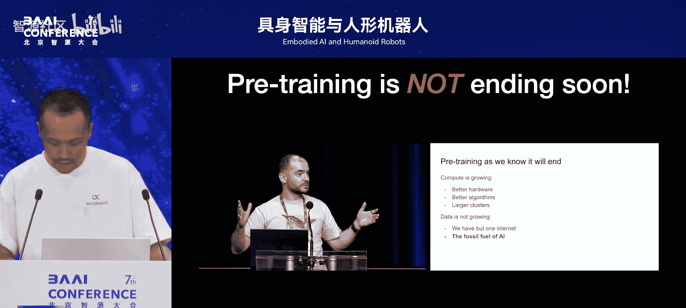

在本节课中，我们将学习如何利用海量互联网视频数据，为人形机器人构建一个基础学习范式。我们将探讨从视频中学习人类运动先验，并通过后续训练将其与机器人物理本体对齐的完整技术路线。

## 概述

当前人形机器人学习面临数据稀缺的根本性挑战。传统方法如仿真、真机遥操或生成模型各有局限，难以规模化。本教程提出一种新范式：利用记录了大量人类运动的互联网视频进行大规模预训练，学习人类运动先验，再通过少量数据将模型与具体机器人本体对齐。

## 从互联网视频到机器人控制：完整技术路线

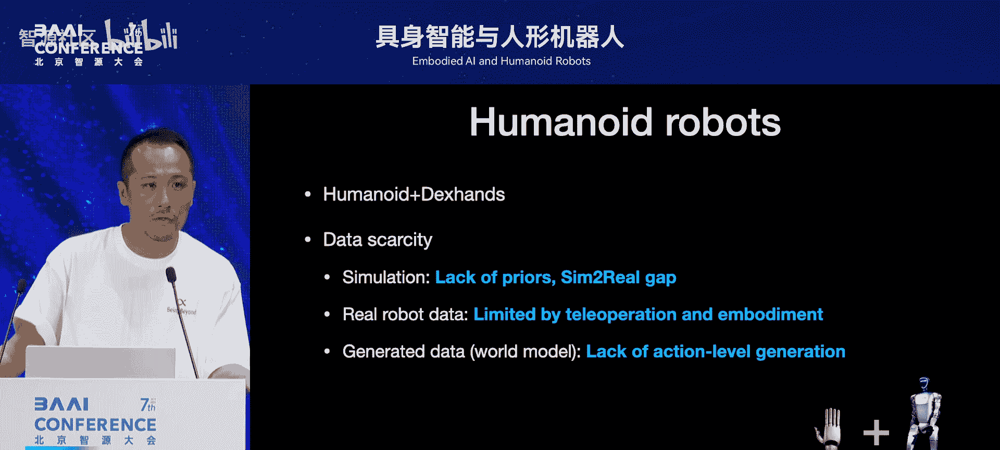

上一节我们概述了核心思想，本节中我们来看看实现这一目标的具体技术路线。整个流程分为预训练和后训练两个关键阶段。

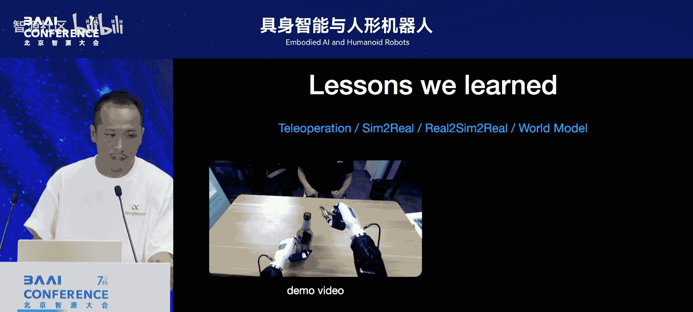

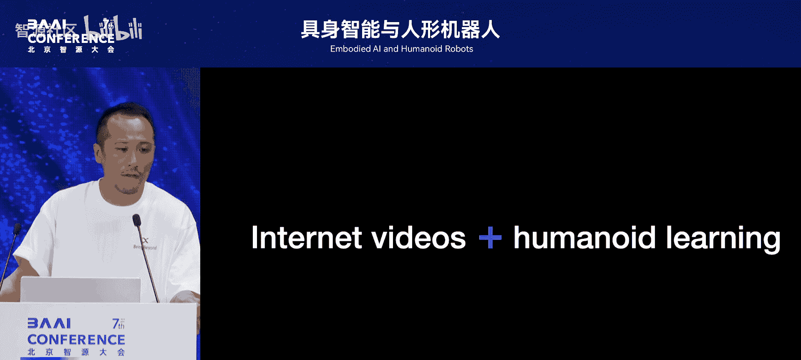

### 预训练：学习人类运动先验

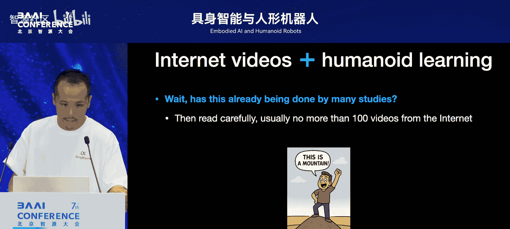

预训练的目标是利用互联网视频，让模型学会理解视觉空间并掌握人类如何运动。这包括全身姿态和手部操作。

#### 全身姿态生成

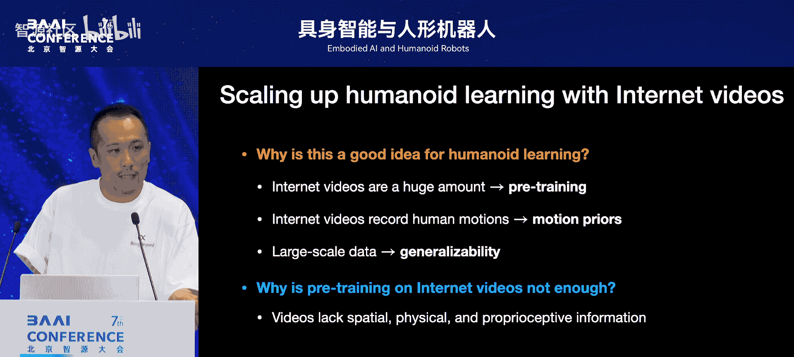

我们从互联网视频中提取人类3D姿态序列，构建大规模数据集，并训练文本到姿态的生成模型。

以下是构建和利用姿态数据集的关键步骤：

1.  **数据构建**：我们构建了超大规模数据集（如Humo100M），包含文本描述、人体运动序列及对应视频。
2.  **模型训练**：基于Transformer等架构，训练模型根据文本指令生成连贯、合理的人体姿态序列。
3.  **性能验证**：实验表明，模型性能（如FID指标）随数据规模和模型参数量增加而显著提升，验证了缩放定律的有效性。

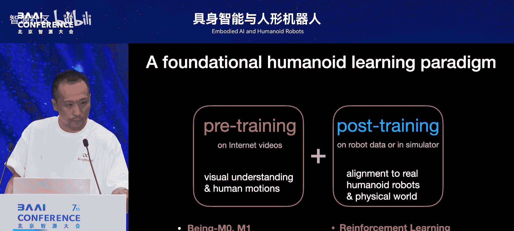

**核心公式/概念**：
*   **姿态生成**：`Motion_Sequence = Model(Text_Instruction)`
*   **评价指标**：Fréchet Inception Distance (FID)，值越低表示生成质量越高。

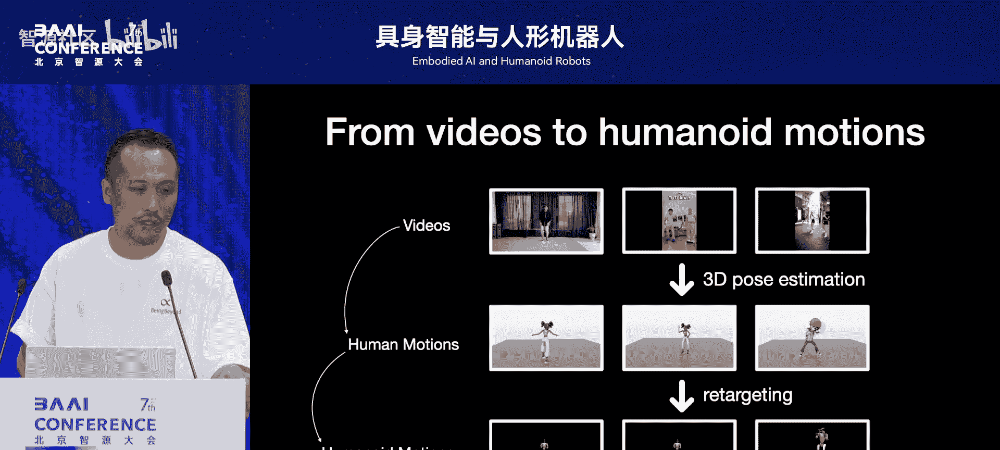

#### 手部姿态生成

类似地，我们从第一人称视角（Egocentric）视频中提取精细的手部动作，构建数据集并训练手部姿态生成模型。

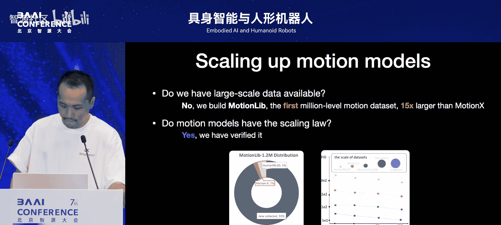

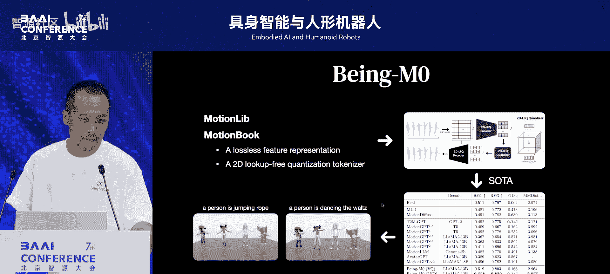

以下是手部姿态生成模型的训练要点：

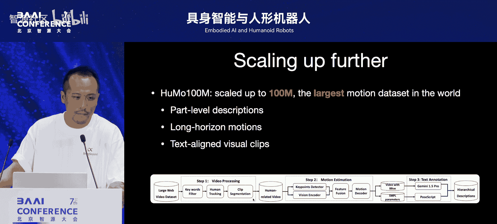

1.  **条件生成**：模型以当前手部姿态和文本指令为条件，预测下一时刻的手部姿态，这对生成连贯动作至关重要。
2.  **动作空间**：使用统一的参数化表示（如MANO）来描述复杂的手部动作。
3.  **效果**：模型能生成比当前机器人灵巧手所能执行的更复杂、更拟人的操作序列。

### 后训练：与机器人本体对齐

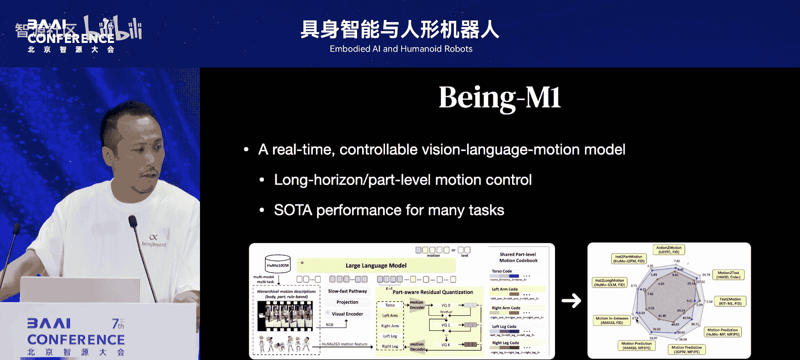

预训练模型生成的是人类姿态，缺乏物理约束且与机器人本体不匹配。因此，必须进行后训练以实现对齐。

#### 运动跟踪策略

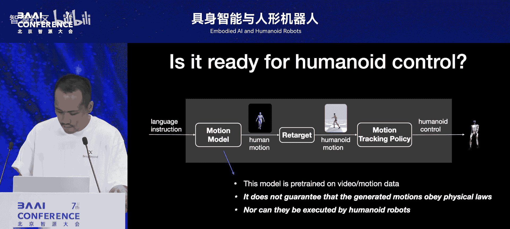

我们首先训练一个通用的运动跟踪策略，它能将任何输入的姿态序列转换为机器人本体的控制指令。

**核心功能**：`Robot_Controls = Tracking_Policy(Human_Motion_Sequence)`

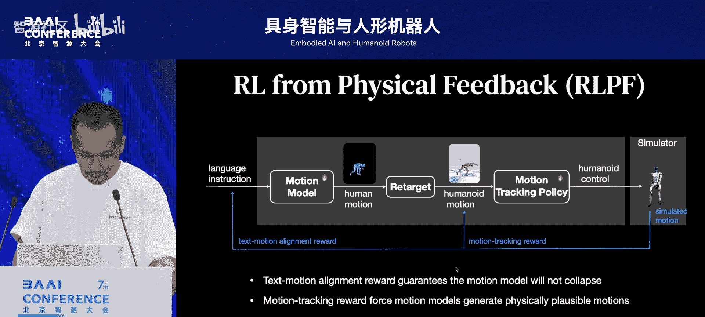

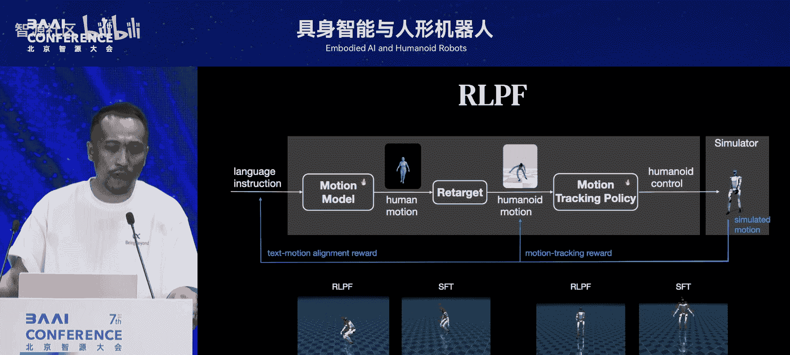

#### 基于物理反馈的强化学习

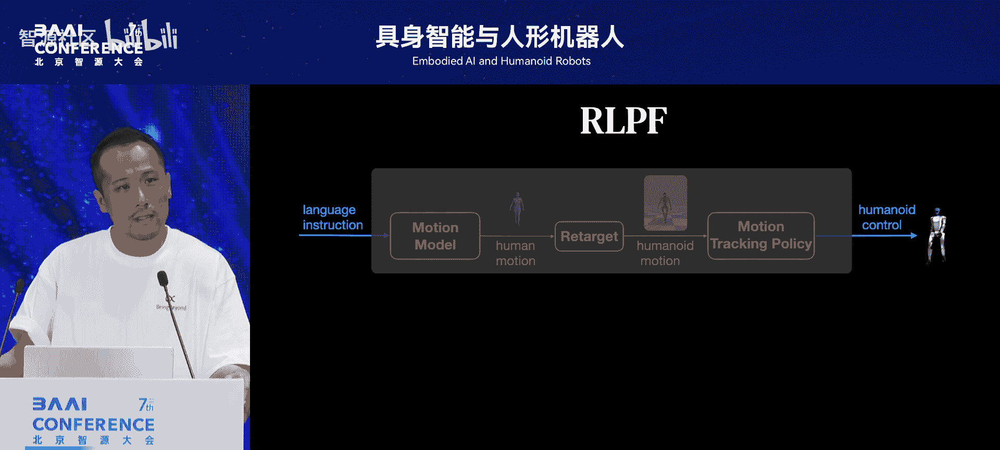

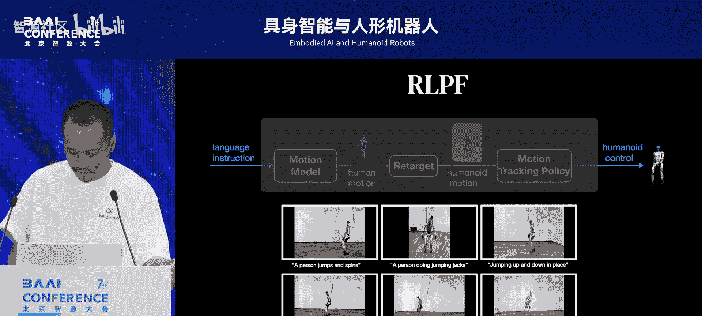

为了确保生成姿态符合机器人物理特性且可执行，我们提出RLPF方法。

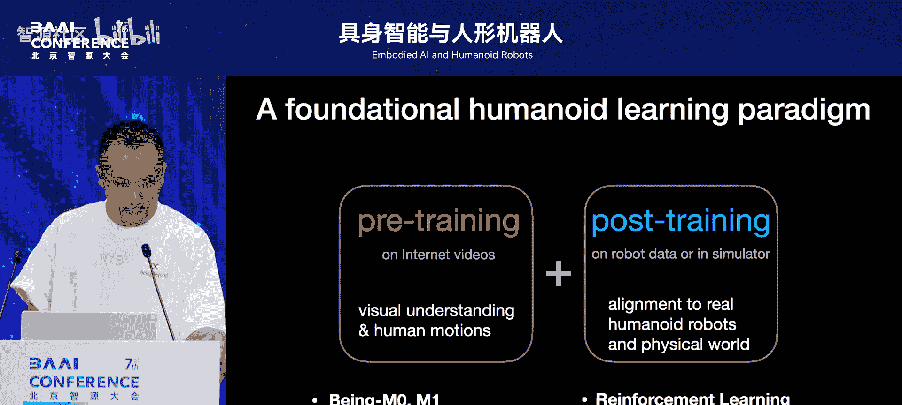

以下是RLPF方法的核心机制：

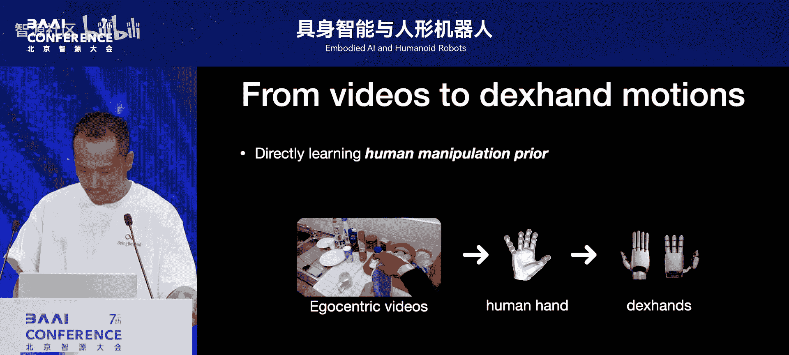

1.  **仿真环境**：在物理仿真器中评估生成姿态的可执行性。
2.  **奖励函数**：设计双奖励机制：
    *   **任务-动作对齐奖励**：防止模型坍塌，确保生成姿态与指令相关。
    *   **跟踪误差奖励**：鼓励生成易于下游跟踪策略执行的动作。
3.  **层次化学习**：通过强化学习微调姿态生成模型，使其输出既符合指令，又满足机器人物理约束的姿态。

**最终流程**：`语言指令 -> 姿态生成模型 -> (RLPF优化) -> 运动跟踪策略 -> 机器人控制`

### 第一人称视觉理解

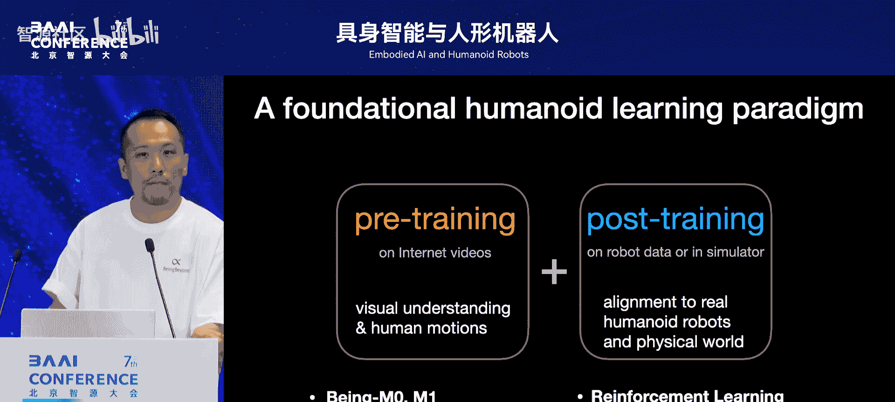

要让机器人真正理解它所处的环境，需要强大的第一人称视觉理解模型。当前模型在此方面表现不佳。

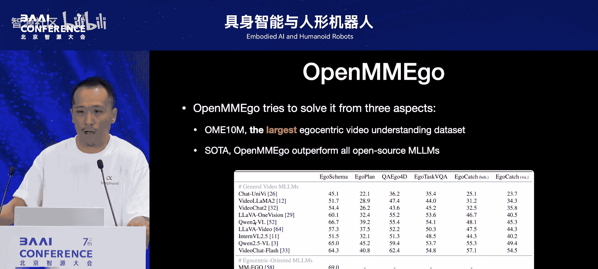

我们构建了大规模第一人称视频数据集，并训练了专用模型，在多项评测中达到领先水平。然而，一个根本挑战是：现有模型缺乏**本体感知**。它不知道“自己”（机器人）在空间中的位置、肢体尺寸和运动能力。

**关键洞见**：未来的视频理解模型必须通过后训练融入机器人的本体感知信息，才能成为合格的“机器人大脑”。

## 总结

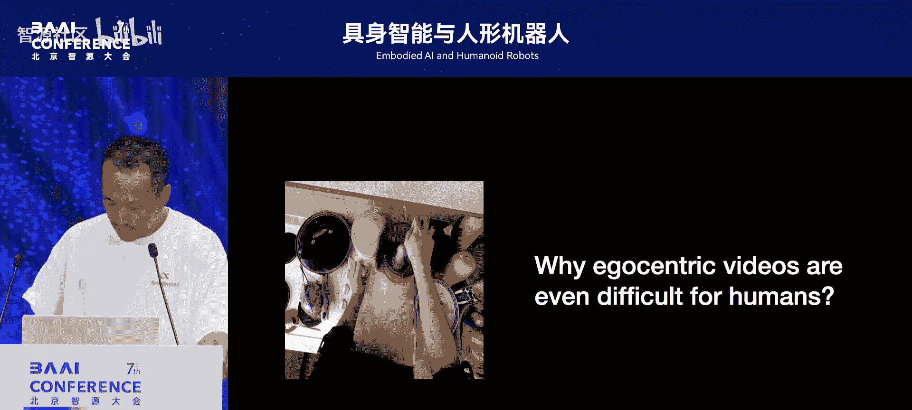

本节课我们一起学习了利用互联网视频扩展人形机器人学习的完整范式。其核心是：
1.  **大规模预训练**：从海量视频中学习人类运动先验（全身与手部）。
2.  **高效后训练**：通过RLPF等方法，用少量仿真或真机数据将模型与具体机器人物理本体对齐。
3.  **感知融合**：未来的视觉理解模型需融入本体感知，以真正理解第一人称视角的世界。

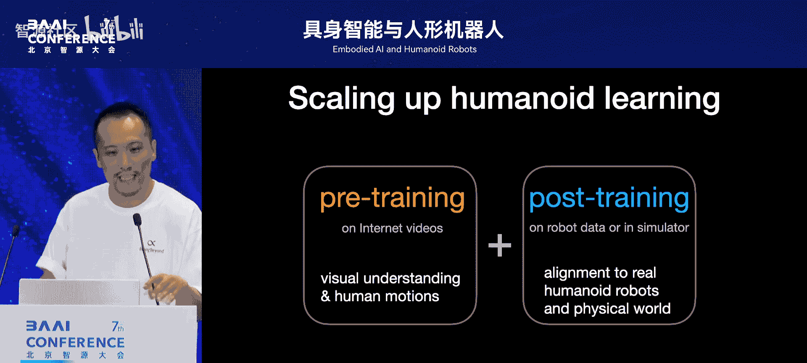

这条技术路线旨在从根本上解决机器人数据稀缺和泛化能力弱的问题，为构建通用机器人智能提供了一种可扩展的框架。