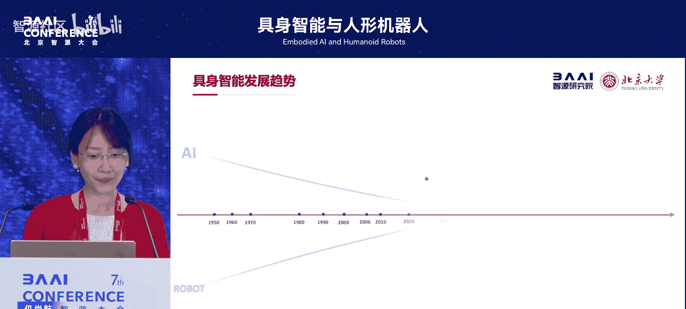
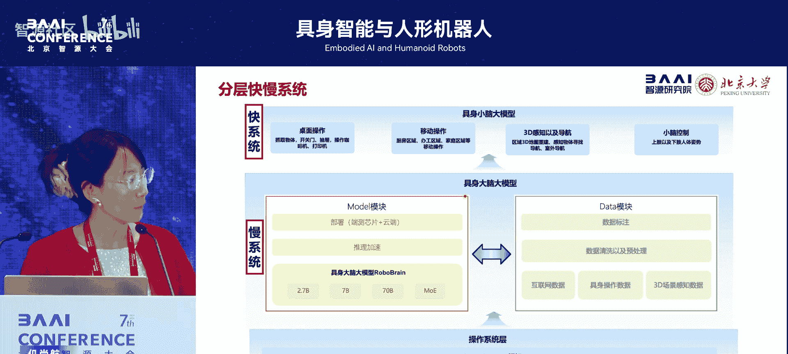
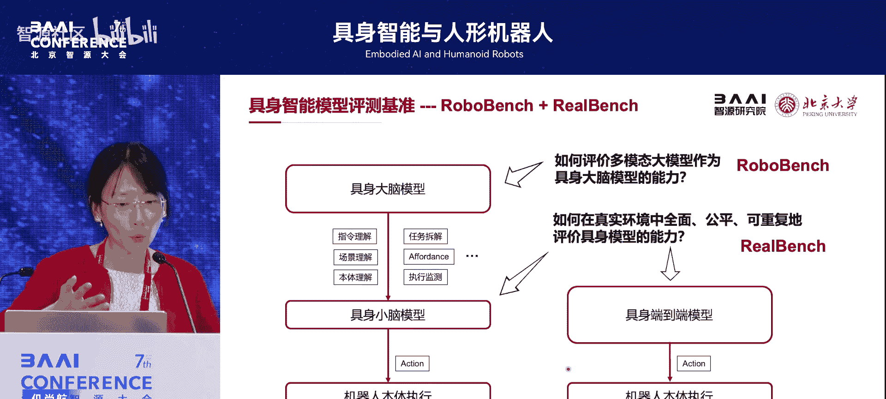

# 具身智能与人形机器人-p07-开放世界具身多模态基础模型与系统：仉尚航

在本节课中，我们将学习开放世界具身多模态基础模型与系统的核心研究。我们将探讨如何利用大模型技术，构建能够理解、规划并执行复杂任务的具身智能系统，并了解实现这一目标的两条主要技术路线。

---

## 概述：人工智能与机器人的融合新范式

人工智能和机器人技术正沿着各自的路径蓬勃发展。自2022年大模型技术出现以来，两者找到了一个关键的结合点。大模型能够赋予机器人更强的泛化能力和通用性，这成为了具身智能研究的一个重要转折点。具身多模态大模型，正引领着人工智能与机器人融合的新范式。

在2022年之前，具身智能系统通常只能应对单一的任务、单一的场景和单一的本体。大模型的出现，使得构建能够解决多种任务、跨越不同本体、适应不同场景的智能系统成为可能。然而，现有的具身大模型研究仍处于早期阶段，面临着不好用、不易用、不通用的科学难题。因此，我们需要研究更聪明的大脑模型和跨本体的大小脑协作框架，以实现可泛化的具身智能。

目前，具身大模型的研究呈现出百花齐放的状态，主要有三种技术路线：
*   **端到端技术路线**：即视觉-语言-动作模型。
*   **分层技术路线**：即“大脑”加“小脑”的架构。
*   **世界模型路线**：专注于构建对环境的内部模型。

我们的核心研究思路，是基于人类“快慢系统”的思维方式，构建面向具身智能的长程闭环框架。这一思想源于心理学家丹尼尔·卡尼曼在《思考，快与慢》中提出的理论：人类的思维既包含快速、直觉的“系统一”，也包含有意识、借助外部知识进行推理的“系统二”。我们在具身智能领域实践了这种快慢系统的思路，并探索了分层和端到端两种实现方式。

---

## 分层快慢系统：大脑与小脑的协作 🧩

上一节我们概述了具身智能的融合范式，本节中我们来看看第一种实现方式：分层快慢系统。这种架构模仿了人类的决策过程，将复杂的认知任务分解为不同层级的处理。

### 为什么需要“大脑+小脑”架构？

“大脑加小脑”是一种相对容易落地的技术方案。这种架构的优势在于：
*   **易于模块化**：各个功能模块职责清晰，便于开发和维护。
*   **可解释性强**：决策过程可以被分解和追溯。
*   **跨本体泛化**：“大脑”模型不直接输出具体动作，因此可以方便地适配到不同的机器人“小脑”上，增强了系统在不同硬件平台上的泛化能力。

### 构建面向具身智能的“大脑”模型

然而，并非任何一个多模态大模型都能直接作为机器人的“大脑”。我们发现，即使在通用领域表现强大的模型，在面向机器人任务时，也缺乏长程规划、空间理解和具身认知等关键能力。因此，我们需要专门设计面向具身智能的“大脑”模型。

一个合格的具身“大脑”应具备三大核心能力：
1.  **任务规划**：将抽象指令分解为可执行的步骤序列。
2.  **可操作区域感知**：理解在场景中哪些区域可以进行交互。
3.  **轨迹预测**：预测执行动作所需的运动路径。

为了让多模态大模型具备这些能力，我们构建了专门的数据集 **`ShareRobot`**。该数据集包含5万条高质量的数据对，涵盖了规划、可操作区域和轨迹等信息。基于此数据集、特定的模型架构和训练策略，我们实现了从抽象指令理解到具体动作执行的具身大脑大模型。

我们的模型架构以一个多模态大模型为基础，其输出同时包含规划、可操作区域和轨迹三大能力。为了平衡模型已有的通用知识和新学习的机器人能力，我们设计了两阶段训练策略，确保模型“不忘记过去，也能适应未来”。

经过上述设计，我们的大脑模型在公开评测基准的多个能力维度上超越了已有模型。该工作有幸被CVPR接收，并入选了年度趋势热点工作。此后，我们进一步升级推出了 **`RoboBrain 2.0`**，这是一个面向长程操作任务及空间智能的大脑模型，在跨异构本体多机任务规划和空间感知能力上均有显著提升，并新增了闭环反馈和深度思考能力。

### 大小脑协作框架：RoboOS

有了强大的“大脑”和各个“小脑”，我们还需要一个协作框架将它们整合起来。为此，我们提出了 **`RoboOS`** 这一整体的大小脑协作框架。

`RoboOS` 以 `RoboBrain` 为核心，旨在实现跨本体、跨场景、多任务的快速部署，将具身智能从单机智能推向群体智能。经过迭代，`RoboOS 2.0` 是全球首个具身智能的 **`SaaS`** 平台，能将机器人部署成本从天级降低到小时级。同时，它构建了全球首个具身智能应用商店体系 **`MCP`**，支持跨本体的大小脑协作，让新技能的代码注册量仅为原来的十分之一。

`RoboOS 2.0` 还设计了共享记忆系统，包含空间记忆、时间记忆和本体记忆，使得多机器人协作成为可能。例如，系统可以指挥松灵双臂机器人、宇树`G1`人形机器人和越凡单臂机器人协同完成“做汉堡”和“做饮料”等复杂任务。

### 评测基准：RoboBench 与 RealBench

为了公平、公正地评估具身智能模型的能力，我们提出了两个评测基准：
*   **`RoboBench`**：专门针对“大脑+小脑”分层框架设计，评测大脑的指令理解、感知推理、任务规划等能力。
*   **`RealBench`**：针对真实机器人操作任务设计的评测基准，包含32个标准任务和两个可复现的真实场景，旨在解决模拟器与真机性能差异的评估难题。

评测发现，当前的多模态大模型在具身大脑任务上仍有明显不足，其表现明显低于人类水平，这仍是未来需要攻克的关键难题。

---

## 端到端快慢系统：一体化的VLA模型 ⚡

上一节我们介绍了分层的快慢系统架构，本节中我们来看看另一种主流技术路线：端到端的快慢系统，即视觉-语言-动作模型。

### VLA模型的特点与挑战

VLA模型的核心思路是直接利用在海量互联网数据上预训练的多模态大模型，强化其视觉-语言理解能力，并让其直接生成动作规划，最终实现可泛化的控制。现有的VLA模型主要有三种输出动作的设计方式：
1.  **自回归预测**：优势是保留推理能力，但动作量化可能破坏连续性。
2.  **回归式拟合**：动作平滑，但可扩展性不足，未充分利用动作的概率性表达。
3.  **扩散头生成**：操作精确，但未能充分发挥VLM的推理能力。

当前的一个关键难题是：**如何在VLA中统一自回归和扩散生成，以兼顾推理能力和对连续、多峰动作的建模能力？**

### 启发于人脑分化：HA² 模型

受到人脑细胞会分化成不同功能脑区，且脑区间紧密耦合的启发，我们思考能否让VLM通过训练“分化”出动作生成能力，而非简单拼接。为此，我们提出了 **`HA²`** 模型。

`HA²` 是一个统一的VLA框架，它将扩散生成和自回归令牌预测进行了无缝融合。我们设计了令牌序列公式、分析了多种协同训练策略，并建立了协同动作集成机制。这使得两种动作预测方式能够相互增强，适应多样的复杂操作任务，实现更稳定的控制。

实验表明，`HA²` 在多个任务上的平均成功率显著提升，证明了融合方案的有效性。同时，它在空间位置、操作对象、背景光照等方面也展现了良好的泛化能力。

### 一体化快慢系统：Fast-in-Slow 模型

那么，如何在一个VLA模型内部真正实现“快慢系统”呢？我们最新的工作 **`Fast-in-Slow`** 给出了答案。这是首个快慢系统一体化的VLA框架。

`Fast-in-Slow` 的核心思想是将“系统二”的慢速推理能力和“系统一”的快速执行能力，整合到同一个VLA模型中。这与之前将两个系统作为独立模型的设计有本质不同。我们的模型源自同一个基础VLM，系统一和系统二之间可以无缝协同。

该模型有两个关键设计：
*   **异步频率**：系统二（慢系统）和系统一（快系统）以不同频率运行。
*   **异构模态输入**：系统一更强调视觉感知输入，系统二更强调语言抽象输入。

通过一种双系统感知的协同训练策略，我们在超过86万条轨迹数据上进行了预训练。实验证明，`Fast-in-Slow` 在保持高精度推理能力的同时，控制频率最高可达117.7赫兹，并且在真实机器人任务中表现出良好的性能和泛化性。

---

## 总结 🎯

本节课中，我们一起学习了开放世界具身多模态基础模型与系统的研究。

我们首先了解了人工智能与机器人通过大模型技术融合的新范式。接着，我们深入探讨了实现具身智能的两条主要技术路线：
1.  **分层快慢系统**：通过“大脑”进行规划与推理，“小脑”负责具体执行，并借助 `RoboOS` 框架实现协作。这种方案模块化程度高，易于跨本体部署。
2.  **端到端快慢系统**：在单一的VLA模型内部整合快慢两种能力，如 `HA²` 和 `Fast-in-Slow` 模型所示。这种方案追求更紧密的耦合与更高的执行效率。

此外，我们还介绍了用于评估这些模型的基准 `RoboBench` 和 `RealBench`。这些研究工作均已开源，旨在推动具身智能领域从单机智能向群体智能发展，并最终实现智能系统在开放世界中的广泛应用。