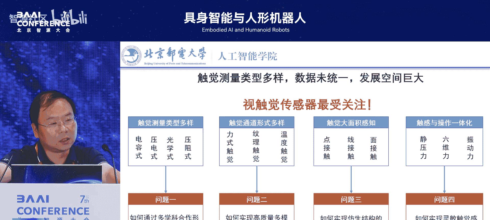
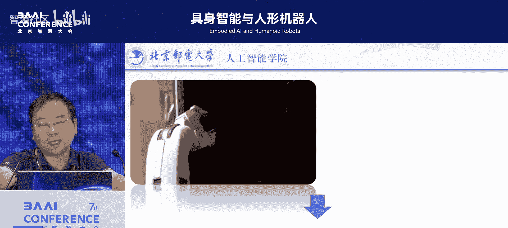
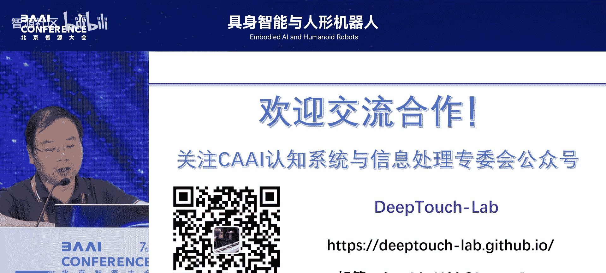

# 具身智能与人形机器人-p08-视触觉感知的具身智能操作：方斌

在本节课中，我们将学习视触觉感知如何赋能具身智能操作。我们将探讨触觉感知的重要性、视触觉传感器的原理与优势，以及如何利用仿真和数据驱动的方法来提升机器人的操作能力。

## 嘉宾介绍

我们荣幸邀请到下一位嘉宾，北京邮电大学的方斌教授。方斌教授是北京邮电大学的拔尖人才教授，主要研究方向为机器人智能感知、交互与操作。

方教授兼任人工智能学会认知系统与信息处理专委会秘书长，是中国人工智能学会的杰出会员及IEEE高级会员。他曾发表上百篇高水平论文于 *Nature Communications*、*T-RO*、*Robotics* 等期刊及 *ICRA* 等会议，并获得八项国际会议和期刊的最佳论文奖。

今天，方教授将为我们带来关于视触觉感知的具身智能操作的精彩报告。

## 报告内容概述

非常感谢王老师和张老师的邀请，今天非常荣幸能在这里分享我们在视触觉感知方面的研究。上午孙峰老师介绍了他们团队的许多工作，下午我将主要围绕触觉方向，介绍相关的研究。

我们知道，当前具身智能的研究主要围绕两个方向展开：**导航**和**操作**。在通用操作领域，仍存在许多挑战和问题。面向抓取的操作任务，本身就是一个涉及多学科交叉的方向。

## 机器人操作的发展阶段

对于抓取操作，我们可以简单地将其发展分为三个阶段。

**第一阶段是“抓住”**，即实现自主抓取物体。这一阶段以视觉为主导，代表性工作如罗老师的“Net”以及智源王贺老师所做的多背景切换抓取研究。它们的目标是在不同场景和物体变化下，实现自主抓取。

**第二阶段是“抓稳”**。这除了需要视觉引导的自主抓取能力，还需要结合手部与物体接触时的触觉能力。目前许多抓取研究在物体材质属性上较为单一，触觉在应对动态操作任务（而非简单的拾取-放置任务）中的作用尚未被充分强调。在物流分拣等场景中，任务多属于第一阶段。而对于抓取物体后需进行的后续动态操作，触觉能力至关重要。

**第三阶段是“抓好”**。这需要结合具备认知能力的大模型，以实现对任务和工具的更好理解与使用，例如使用工具完成任务。

在这三个阶段中，我今天将重点介绍结合触觉如何开展相关任务。

## 触觉智能的重要性与挑战

对于我们今天的主题“具身智能和人形机器人”，为什么具身智能在今天如此火热？一个重要原因在于机器人本体的不断成熟，尤其是视觉智能对AI及具身智能的巨大推动。

但要真正理解人类的机理，除了语言和视觉，触觉是一个非常重要的因素。我们全身的皮肤表面触觉、内部神经及许多器官的本体感觉都属于触觉范畴。*Science Robotics* 的前瞻性论文也提到，触觉研究对于机器人或人形机器人的发展至关重要。

目前，语言智能和视觉智能极大地推动了具身智能的发展。那么，触觉智能是否也能在此方向上推动机器人，特别是通用智能的发展呢？这仍面临许多挑战。

触觉技术在发展上相对视觉和语言较为落后，一个重要原因在于触觉传感器尚未形成统一的技术路径。其测量类型非常丰富，例如电容式、压阻式等，导致数据格式多样。这种多样性为学术研究提供了很多机会，呈现出百花齐放的局面。*Science* 和 *Nature* 上每月都有多篇关于触觉或电子皮肤的研究论文。

然而，对于基于数据驱动的学习，这种多样性也带来了诸多挑战。

## 视触觉传感器的兴起与优势

经过几年发展，触觉类型的多样性逐渐形成一个共识，即**视触觉传感器**的技术路径——基于图像来表征触觉测量方式——受到了极大关注。

去年 *Science Robotics* 有两篇相关论文，其中一篇封面论文来自Meta和CMU，他们结合视触觉传感器完成了手内物体的三维重建任务。同一期刊还发表了一篇焦点论文，提出了“触觉融合”的观点，认为视触觉传感器推动了机器人灵巧操作和具身智能的发展。

它的优势在于结构相对简单，但所蕴含的信息非常丰富。可以说，这类传感器具备了人眼的分辨率和人类皮肤的敏感性。因此，它不仅吸引了传统传感器领域的研究者，也吸引了许多计算机视觉领域的研究者。

我们课题组是国内最早开展相关研究的团队之一。早在2014年（十多年前），我们就做出了视触觉传感器系列工作，开发了不同类型的传感器，探索了许多工艺和材料，并搭建了视触觉传感器仿真器，开展了一系列感知研究及操作应用研究。因此，在视触觉传感的研究体系上，我们相对完善。

它的优势在于所依赖的工艺不复杂，涉及的材料也相对容易获得，降低了传感器实际使用的门槛。我之前在清华计算机系工作，具有CS背景，我们使用的材料基本都能在淘宝上买到，制作工艺也不复杂。因此，这类视触觉传感器可以根据不同的实际操作需求进行DIY制作。

在2021-2022年，我们整理了一份详尽的综述，涵盖了传感器涉及的所有材料、器件甚至具体型号，希望大家能根据自己的需求定制相应的传感器。

## 视触觉传感器的应用

基于这样的传感器，其优势在于利用图像表征触觉，信息量丰富，能获得精细的纹理信息。

我们将其应用于不同场景，例如化石鉴定场景。化石表面通常非常粗糙，其纹理很多时候肉眼难以清晰观察。但基于传感器的按压，我们可以获得非常精细的纹理信息，这为接触感知提供了丰富的数据。

除了测量纹理，触觉中另一个重要模态是测量力信息。在实际操作，尤其是涉及丰富接触的装配任务中，需要获得相应的力信息才能完成装配。我们也将基于视触觉传感器获取力信息的相关算法做了完整整理，包括我们自己的研究工作，均已开源。

当然，除了测量力，它还能获取触觉纹理信息。有了纹理信息，结合视觉，就能实现三维重建。我们在抓取物体时，不仅能获取其表面形态，还能得到精细的材质纹理信息。*Science Robotics* 的封面论文就专注于三维重建任务。在图形学或CV领域，三维重建是一个专门方向，之前的工作大多基于纯视觉。利用视触觉进行三维重建，仍有很大的探索空间。

除了感知任务，我们也希望将其真正用于实际的操作任务，实现稳定抓取。对于不同重量或材质的物体，抓取过程中需要手上的“感觉”才能将其真正抓稳。因此，我们结合自研的视触觉传感器，开展了一些稳定抓取的研究。

## 实现稳定抓取：两阶段策略

我们提出了一种**两阶段稳定抓取策略**。

第一阶段是基于初步预抓取的探索，实现对未知物体能否稳定抓取的初步判断。
第二阶段是基于触觉伺服的稳定抓取策略，实现最终抓取。

底层设计了一些控制器来完成此任务。我们结合的信息主要基于视触觉传感器中的标记点信息。对于稳定抓取，我们需要获取的是动态过程中相对滑动的信息，表面的纹理信息并不重要，相对运动信息更为关键。因此，我们基于标记点来表征相对滑动中的动态信息，并设计了相应的控制器。

我们首先设计了一个预抓取控制器，其中阈值的调整基于实时稳定性判断，以实现响应式抓取。我们搭建了实验装置，通过标准平台对控制器参数进行了预设，然后迁移到真实场景中。

通过标记点的初步位移来判断物体与手之间的状态，进而实现整个控制策略。我们进行了一系列测试，包括与无触觉反馈的对比、自适应性以及鲁棒性测试。

结果显示，在使用商业夹爪抓取鸡蛋或海绵时，若无力反馈，鸡蛋很容易被捏碎。而结合我们自研的视触觉传感器及自适应抓取策略，可以实现基于预抓取和稳定抓取的完整过程。即使是轻柔的海绵，也能实现精细抓取。对于重物抓取，为防止滑脱，可以调整抓取力。

我们还使用多种真实水果（如葡萄、水蜜桃）对整个策略进行了鲁棒性测试，取得了较好的效果。

## 触觉数据生成与仿真

在实际研究过程中，我们也在思考，为什么语言和视觉能在AI中发挥如此好的效果？一个关键优势在于数据。触觉模态由于传感器尚未很好量产或形成通用共识，其数据积累过程耗时、耗力又耗财。

因此，如何生成触觉数据？**仿真**成为了当前的一个热点方向。英伟达在具身智能方向重点布局，近两年也在重点开发此类触觉仿真器。例如，上个月 *T-RO* 上发表的“Tacchi”就是基于视触觉传感器的仿真器，此外还有基于磁触觉的仿真器等。

基于仿真的触觉数据生成，是目前一个重要问题，也是具身智能值得关注的方向。我们上个月发表了一篇工作，探讨了触觉数据生成问题。

目前，视触觉传感器至少在学术界逐渐形成共识，许多团队开发了相关数据集。在实际应用过程中，将真实触觉数据与仿真数据结合使用，无论在性价比还是成功率上，都能达到更好的效果。

那么，如何获取高质量的仿真触觉数据？仿真中的核心问题主要包括三个方面。

**首先是弹性体仿真**。触觉的本质因素是什么？是形变。无论何种原理，本质上都是因形变产生信号，视触觉也是如此。在接触过程中，弹性体的形变被捕捉，我们只是用图像方式捕捉了形变信息。在仿真中，如何模拟弹性体的形变特性是一个关键因素。

当然，视触觉传感器是基于光学和图像的测量方式，因此光学仿真以及标记点位移仿真也是重要问题。

对于弹性体仿真，目前主流技术手段主要有三种。

1.  **基于刚体的弹性体仿真**：如早期的有限元法，或主流机器人仿真器（如PyBullet、MuJoCo）中使用的方式。其精度较低，缺乏物理特性。
2.  **基于有限元法（FEM）的弹性体仿真**：能获得较高的物理特性和精度，但劣势在于效率较低，计算成本更高。
3.  **基于材料点法（MPM）的仿真**：在大变形仿真中效率更高，但精度较有限元法稍差。

此外，还有一些**基于学习的方法**，例如通过跨模态生成（从正常图像生成接触图像）或图像到触觉的生成方式。这也是当前一个热点方向。

获得数据后，应用主要在于三个方面：**多模态表征**、**三维重建**以及**具身智能操作**。

## 视触觉仿真器的开发

关于视触觉仿真器，我们较早开始了探索。当时，清华毕业、在MIT的胡渊明开发了著名的图形学开源框架“太极”。我们结合“太极”开源仿真器，开发了视触觉仿真器。我们从2020年开始探索，至今仍在不断迭代。前期与浦江庞老师合作，尝试将仿真器集成到“桃源2.0”版本中，以提供更好的接触触觉信息。

在早期的一个ACM工作中，我们基于“太极”的粒子特性，仿真了不同属性的物体，实现了接触变形的基本效果。在接触过程中，我们可以实时反映物体的形状变化。这至少为视触觉提供了最基本的接触信息特性。

在此基础上，我们将光学模型集成进去，开发了“太极1.0”版本。该版本仅实现了简单的按压过程以获取触觉图像。在仿真到真实的精度上，还有待进一步提高。

在1.0版本基础上，我们针对光学仿真的路径追踪进行了优化，提升了仿真效率，完成了“Efficiency TaiChi”工作。

在实际物体接触过程中，按压只是最基本的触摸模式，还有许多其他模式，如滑移、旋转等。我们在之前版本基础上，开发了支持多运动接触模式的仿真器“Multi-Motion TaiChi”。这项工作由一名本科生完成。

在这项工作中，我们进一步希望在实际物理过程中，除了刚性物体，还能模拟弹性、塑性以及弹塑性物体，进而实现相应的操作学习任务。在操作任务中，变形体的操作一直是个难题。因此，我们开发了一种新型传感器，与原有视触觉传感器相比，其感知模式更多。我们探索了一个从仿真到真实的整体框架，结合强化学习在仿真中学习不同变形体的操作策略，例如将物体压成特定形状或揉成球形、圆柱形等。通过在仿真中学习策略，然后迁移到真实机器人上，从实际效果看，触觉及不同材质物体的仿真对我们的学习效率有很大提升。

在最新工作中，除了纹理图像，我们还同时结合了标记点信息。这样，对于动态任务的操作学习，基于标记点表征的效率会更高。在运动模式上，我们也可以实现按压、滑移、旋转等不同组合运动。结合这些信息，我们可以获得很好的操作任务。

目前，我们的研究成果已应用于国家空间在轨操作任务中。我国拥有自己的空间站，但在轨维护维修风险很高，宇航员出舱成本高昂，对生理心理挑战巨大。维护维修过程也是高难度挑战。在此方向上，我们正与航天院所合作。相关成果在去年世界机器人大赛的太空机器人比赛中，获得了唯一的特等奖。

我们总结了近几年关于视触觉感知、仿真操作的相关文献。对此方向感兴趣的同学，可以参考这份清单。

## 多模态融合与未来展望

触觉本身是单一的模态。我们是否可以将其与视觉、语言关联，进行更丰富的多模态感知工作？我们与北交大韩军老师合作，发布了“Touch100K”数据集，并在GitHub上开源。此外，我们最近提出了“UniTouch”工作，希望在视触觉传感器多样化的现阶段，提出一个统一表征框架，将不同视触觉传感器信息进行统一表征。这样，无论是后续的感知任务还是基于操作的任务，都能结合“UniTouch”框架进行统一处理。

当然，我们也尝试将触觉模态融入现有的视觉-语言-动作框架中。因此，我们正在探索“VTLA”的工作。要实现VTLA，首先需要将触觉模态与后续动作进行对齐。我们最近的一项工作包括与语言的对齐，提出了“CLTP”框架，希望不仅依靠视觉完成操作，仅靠触觉模态也能完成相应任务。

## 未来趋势的个人观点

对于未来趋势，我发表一些个人观点，仅供参考。

从去年开始，许多工业界和投资界人士询问，当前触觉传感器方式多样，何时会收敛到一个统一路径？我的个人观点是，至少目前视触觉传感器方案在业界和学术界的研究规模上相当可观。因此，对于灵巧手或多指间的操作，这项技术路径可能会形成较为统一的认识。我认为视触觉传感器在灵巧手操作上会形成较为统一的技术路径。

从去年开始，VLA成为一个热点方向。我个人的判断是，从今年开始，**VTLA**将成为具身智能的新爆发点。将触觉融合到视觉中，尤其对于操作任务，将提供更强大的能力。如前所述，从“抓住”到“抓稳”再到“抓好”，三个阶段在实际工业或家庭服务场景中提供的能力将会有阶段性的跃升。

第三个观点，我认为双臂操作的能力还会有进一步的提升和挖掘。从特斯拉的“Optimus”双臂演示开始，点燃了人形机器人和双臂操作的热潮。但当前的演示末端多以夹爪形态出现。从去年下半年到今年，多指灵巧手逐渐增多，产品不断成熟。这种高自由度的形变操作潜力巨大。对于具身智能，如何在双臂、高自由度上挖掘其能力，以及更好地使用工具，兼顾效率与通用性，仍有很大空间。当前许多VLA研究强调通用性，但在实际工业场景中，效率是一个重要方面。以上是我个人的观点，仅供参考。

对于机器人的通用操作以及触觉在其中的作用，我认为未来仍有很大潜力。我也希望机器人不仅能出现在展台上，更能真正进入我们的工作和生活，提供有价值的服务。

## 总结与邀请

在本节课中，我们一起学习了视触觉感知在具身智能操作中的关键作用。我们从机器人操作的三个阶段（抓住、抓稳、抓好）入手，探讨了触觉智能的重要性与当前挑战。重点介绍了视触觉传感器的原理、优势及其在稳定抓取等任务中的应用。我们还深入了解了通过仿真生成触觉数据的方法，以及多模态融合的未来趋势。

最后，我刚刚加入智源，并于去年从清华计算机系调到北邮，建立了“DeTouch Lab”，并与智源有联合培养博士名额。对此感兴趣，尤其是对智源有期待的优秀同学，可以给我发邮件。

谢谢大家。