# 具身智能与人形机器人-p09-人形机器人规模化落地的机遇与挑战：赵同阳

在本节课中，我们将学习重情机器人创始人兼CEO赵同阳关于人形机器人创业历程、技术挑战与未来机遇的深度分享。课程将涵盖从创业初心、技术演进到产品理念和行业展望的全过程。

---

## 创业初心与早期探索

我们首先探讨赵同阳先生投身人形机器人领域的初衷与早期面临的挑战。

赵同阳是一位连续创业者，现任重情机器人创始人兼CEO。2025年5月，重情机器人荣登福布斯中国人工智能科技企业Top 50榜单。他构建了“硬件平台加开发者生态”的模式，其产品S01获得了科大讯飞年度最佳杰出产品奖，PM01入选了英伟达开发者生态计划。目前团队接近100人，计划在年内实现产销1000台以上的目标。

他分享道，自己是在半个月前受王贺老师邀请前来。在聆听了其他专家教授在具身智能领域从理论公式到整体架构的深入研究后，他深感敬佩。他本人更多专注于硬件和软件技术，在具身智能领域涉猎不深，因此前来听取专家看法。在人形机器人领域，他自认为是一个“合格的创业者”，但称不上“优秀”，因为这个事业他已经坚持了十年。他希望能从另一个角度分享对人形机器人行业的看法。

他首先解释了为何选择人形机器人赛道。大约在2016年，他与杭州及国内的一些伙伴开始涉足。当时，中国在人形机器人领域，无论是技术还是商业上都可谓一片黑暗。市场上只有日本本田的ASIMO和波士顿动力的产品，价格高达千万级别，而中国只有玩具级别的产品。很多时候，创业源于热爱而非清晰的商业前景。正是这份热爱让他坚持下来，尽管初期投融资并不被市场看好。热爱能让人跨越周期，坚持十年。如果纯粹为了资本做事，会感到疲惫，因为需要向很多人交代，而不是给自己交代。他们坚信这件事能改变人类的未来。他从小受到《终结者》等影视作品的影响，AI和机器人从视觉和心灵上都带来了巨大冲击，让他相信这就是未来。

创业初期，有人建议他做更容易落地的行业，比如2016年正受热捧的机械臂行业，其市场场景明确。而人形机器人在当时被视为一个巨大的梦想，甚至被投资人认为是“在做梦”。但他认为，创业早期不应介意他人看法。最初，他们以为事情很简单，预计半年就能做出来，这种“无知”和“无畏”恰恰是敢于起步的原因。如果一开始就知道需要十年，或许就不敢开始了。他定义人形机器人时，希望做出“具有灵魂”的机器人，而不是冰冷的工具。人类已经发明了太多没有感情的工具，他们希望机器人能有自己的思想和决策能力，这是一件很酷、很伟大的事。

## 从四足到双足的技术路径迁移

上一节我们了解了创业的初心，本节中我们来看看在技术路径上如何从四足机器人过渡到双足机器人，以及其中的经验教训。

从2016年创业至今已近十年。最早的资金来自他个人。在创业之前，他创立了一家物联网公司。因为他没有显赫的学历和光环，只有梦想。他意识到仅有梦想不够，还需要创造条件。于是在2012年至2016年间，他创立了一家物联网公司，专注于Wi-Fi蓝牙模块，公司从一人发展到两百人，存活了十三年，年营收超过两亿，这算是第一次创业成功。他将这次成功获得的资金用于支持机器人梦想。当自身条件不足且资本不看好时，需要自己创造条件。到2016年，他手头有了六七百万，于是开始投身人形机器人。

起初，不像现在的新能源汽车有特斯拉可以对标和拆解学习。2016年时，只有波士顿动力和ASIMO的产品，售价超过千万。他们的资金连半个机器人都买不起，因此只能自主研发。这看似是劣势，但也成了机遇，因为如果东西能轻易买到，就难以体现核心价值。于是他们从核心零部件，包括电机、减速机、控制器、传感器开始做起。

然而，一开始就挑战双足人形机器人问题很大。双足机器人天然是不稳定系统，而四足机器人像桌子一样，拥有天然的稳定系统。因此，从2016年到2018年，投入的近700万资金消耗殆尽后，他们迅速转向研发四足机器人，这对团队的快速发展更有帮助。在创业过程中，目标可能无法一蹴而就，中间需要经历一些过程。幸运的是，在四足机器人上积累的硬件、核心零部件、软件算法等技术，有大约70%可以迁移到双足机器人上。这意味着人才、技术和软硬件大部分是通用的。

时间来到2020年，他们的双足机器人成为国内首款10公斤级别的产品。比杭州某家公司早了约半年推出，并售出了近200台。随后，公司在2020年被小鹏汽车收购。被收购解决了创业中最难的资金问题，也让他感到有了用不完的资金和人力。他之所以同意被收购，主要是钦佩何小鹏本人从UC浏览器到小鹏汽车，屡次在激烈竞争中胜出的经历，认为值得跟随和学习。

在小鹏汽车的三年里，他在深圳成立了“鹏行”，并在美国硅谷、北京、深圳三地建立了超过340人的研发团队，面试过的工程师达两三千人。从一个小组到大团队的转变过程充满挑战，但他非常感谢何小鹏的督促，这对他的成长帮助很大。生命中只要坚持，就可能遇到各种贵人。

2023年，他从鹏行团队中挑选了18人，加入广州小鹏汽车，用了6个月时间做出了小鹏的第一款人形机器人，当时国内只有三家公司能做到。这得益于过去的技术沉淀。然而，经历过小团队和大公司后，他意识到并非有钱有人就一定能成就伟大的事业。极致的创新往往来自小团队。因此，他在2023年决定再次出来创业。

2023年再次创业时，他勇气很大，身上只有100多万，其中100万用作注册资本，20万留给两个孩子一年的学费。他意识到这是破釜沉舟，不留后路。创业初期，在没有资金的情况下招募顶级人才非常困难。如果你告诉一个年薪200万的人你只有20万，很难说服他们加入。幸运的是，一些以前的兄弟愿意跟随，同时他也多次到北京招揽人才，过程艰辛，但最终成功吸引了来自UC伯克利、清华、北大、杜克、CMU、港中文等顶级名校的人才加入。

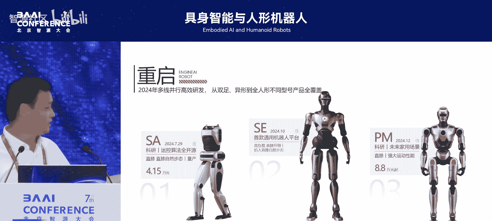

## 产品迭代与极致追求

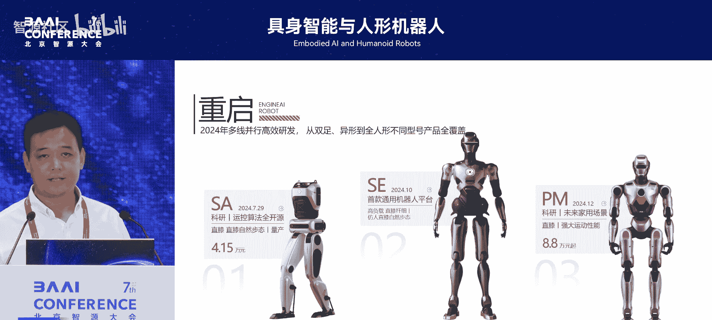

在解决了团队和方向问题后，产品开发成为核心。本节我们将了解重情机器人如何通过产品迭代，并贯彻对“极致”的追求。

刚开始做产品时，无法一次性做好所有功能。因此，他们先推出初级状态的产品。第一款产品在去年12月前推出，售价约3万多人民币，能够完成行走和奔跑等基本动作。他们将价格从以前的四五十万降至三万多元，目标是让每家高校甚至个人都买得起，以此推动行业发展并打磨团队。

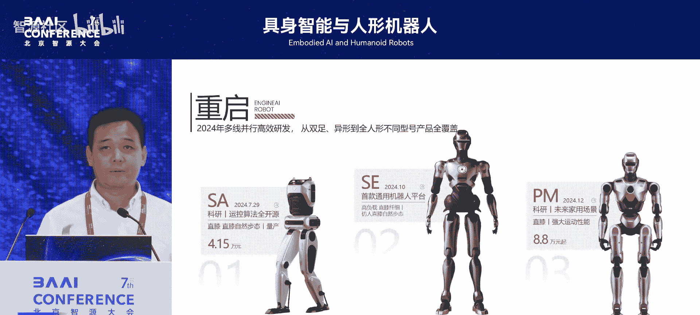

随后，有投资人吐槽产品只有“半个身子”，质疑其商业价值。创业初期，无论团队是3人还是30人，投资人总会问及“本体、小脑、具身智能、大脑”是否齐全，这迫使团队从一开始就思考长远的架构搭建。

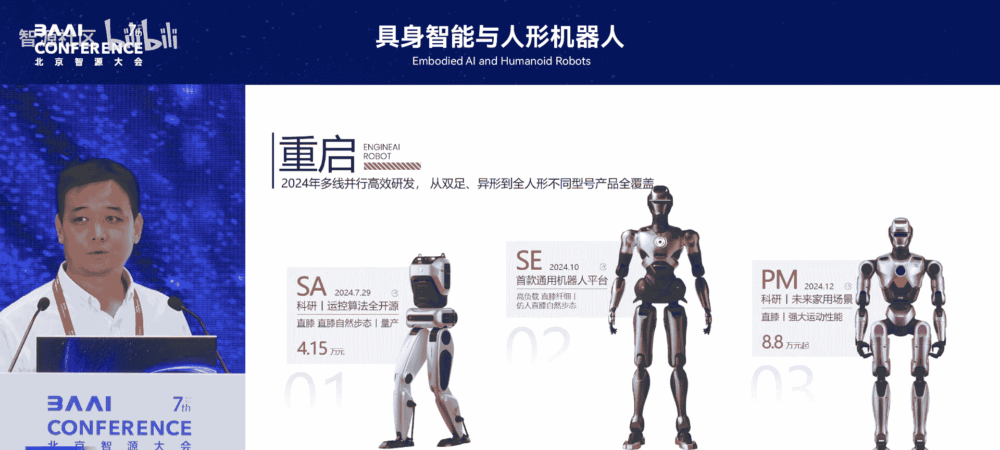

于是，第二款产品应运而生。这款产品按照工业级标准打造，目标是拥有10到15年的寿命。机器人寿命主要取决于本体和机械结构，目前人类工业验证的最佳范例是汽车，其寿命通常在10到15年。因此，人形机器人的寿命也大致在这个范围。他们分析，真正能做事且寿命达10到15年的机器人，成本至少在10到15万，售价可能在十七八万。相比以前四五百万的成本，这已经非常划算。但他们仍觉得贵，因此又推出了售价8000元的产品，以便快速获得市场验证。

第二款产品在去年10月24日推出时，是全球首个能像人一样“大步流星”、“挺直腰杆”自然行走的机器人。以往的机器人给人的印象是弯腿、屈膝、小碎步，像个老人。他作为产品经理，认为这种形态无法提供良好的服务体验。因此，他要求团队必须实现自然步态，否则相关人员需要离开。他们采用了**强化学习加模仿学习，再加上特殊技术**来实现这一点，而墨守成规、坚持使用传统基于模型（model-based）方法的团队被调整了。

他要求产品在每一个细节上追求极致，包括关节设计、外部线条隐藏等，就像汽车行业中奔驰、宝马与普通车的区别一样。极致的产品细节决定了其高度。他经常与工程师激烈讨论，甚至被质疑“你懂还是我懂”。他会回应，虽然工程师是专家，但作为一个旁观者，如果觉得产品“很low”，那么专家更应该反思。这种对产品的极致追求，而不仅仅是技术，是决定能否前进的核心。

这款机器人身高1.38米，行走姿态潇洒。团队还追求极限运动能力，如奔跑、蹦跳，甚至挑战比人类更快的速度、更高的跳跃。他们想知道产品的极限在哪里，这能带给工程师信心和自豪感。例如，在实现奔跑时，他要求必须有“腾空”动作，否则只是“快走”。这个细节他们调整了两个月。

他们希望机器人不仅行动像人，后续的操作等各方面也像人。他不对比冰冷的数据，而是问工程师：“你对自己的产品满意吗？拿你自己对比最好。”如果机器人行动缓慢、不连续，连自己都不满意，那就必须改进。他们的目标是，在未来3到5年内，让机器人在聊天、沟通、互动上几乎与人无异，脱离“工具”的属性，成为有意识、有喜怒哀乐的“人”。

此外，他们还让机器人尝试跳舞等高灵活性动作。最初成功率只有1%，经过算法调整和工程优化，一个月后成功率提升到90%。这说明了**工程能力决定了产品表现的下限（地板）**，而不仅仅是算法决定上限（天花板）。很多顶级算法工程师不愿处理与物理世界相关的工程细节，而大师与专家的区别就在于能否雕琢每一个细节。

## 硬件收敛、成本与行业现状

在对产品形态有了深入理解后，我们转向支撑这些产品的硬件技术、成本控制以及当前行业的发展状况。

在硬件方面，行业技术方案开始收敛，从行星减速器、谐波减速器到直线推杆等。工作效率从早期的50%-60%提升到接近70%-80%。效率越高，发热越小，续航越强。机器人的整体工作效率和寿命也与算法强相关。他们发现，“自然步态”不仅好看，还比“弯腿屈膝小碎步”更省能量，功耗更低。

成本方面也有显著下降。海外机器人创业公司通常直接采用最高级的方案（如直线推杆），成本是国内方案的10倍，但动态性能可能还不如国内的行星/谐波减速器方案。

关于机器人寿命，要实现10到15年的工业级寿命，目前的技术只能做到约2年。从热处理、材料选型到结构稳定性算法，仍需3到5年时间完善。他们预估，5年之内，机器人的机械寿命能达到10到15年，软件则可通过可插拔方式更新。

关节模组占了机器人身体重量的60%-70%，以及造价的80%。它如同汽车的引擎，决定了寿命、爆发力和稳定性。另外10%-15%的成本来自半导体，如MOSFET器件、视觉感知传感器等。

## 本体、小脑、具身智能与大脑的四大板块

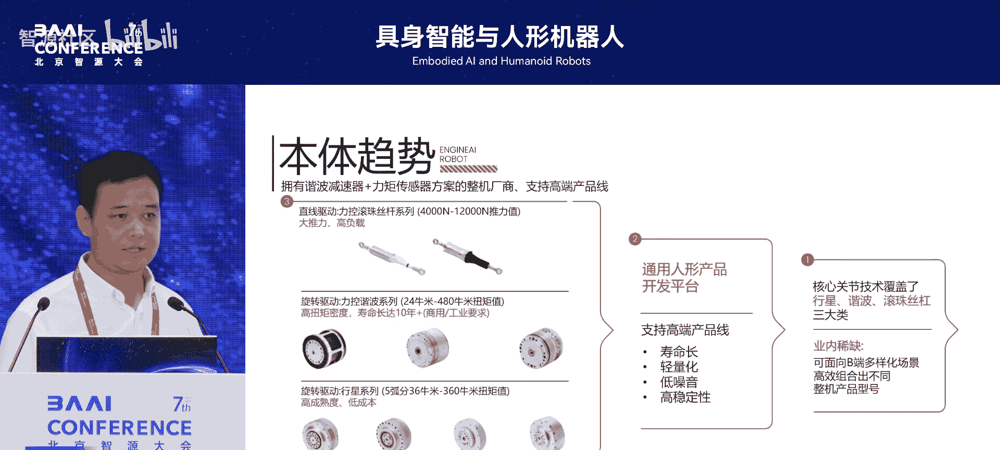

上一节我们讨论了硬件基础，本节我们来看构成完整机器人的四大核心板块，以及创业公司如何平衡发展。

机器人由**本体、小脑、具身智能和大脑**四大板块构成，缺一不可。只做好其中两块，就可能成为一家百亿甚至千亿市值的公司。例如，只专注于具身智能，也能成为一家非常优秀的公司。但在创业时，投资人总会问你是否四大板块都强，无论团队是3人、30人还是300人。因此，需要做好全面准备，但不应被投资人的节奏打乱。早期团队不可能面面俱到，如果什么都想做，可能什么都做不精。他们的策略是先在**本体和小脑**方面做扎实，然后再向上发展。同时，**具身智能和大脑**的团队也在组建中，因为这是机器人的“灵魂”。他希望做有灵魂的机器人，而非单纯的硬件公司。

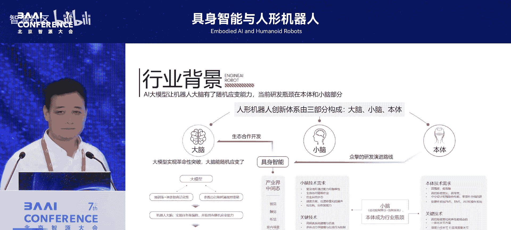

他借此机会为正在招募具身智能和大脑人才的公司做了宣传，表示公司资金和职位充足，氛围扁平化，欢迎人才加入。

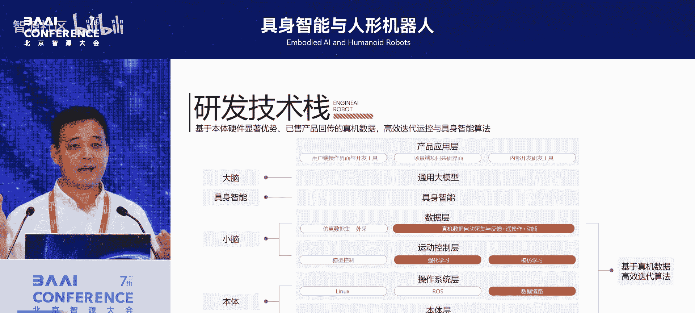

但他也认为，一家公司不可能吃下整个市场。他们希望开放自己的本体、小脑等技术，与合作伙伴一起构建生态。人形机器人将是人类下一次工业革命，其影响将比电脑和汽车更加深远。这个市场空间足够大，足以容纳全球8到10家公司活得很好，因此现在创业或加入优秀团队都为时不晚。一个人可以做一些厉害的事，但一帮人才能做一些改变世界的“牛逼”的事。

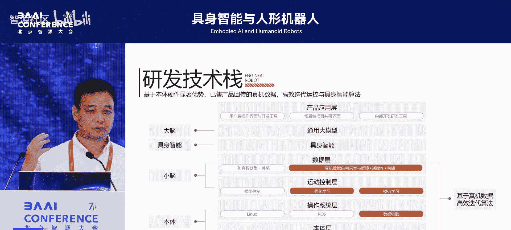

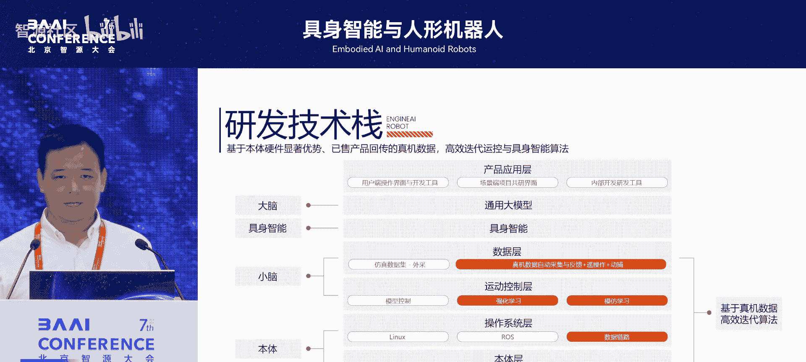

他们已有一些生态合作伙伴加入开发计划，并正在同步开放开发工具。公司目前约八九十人，发展了一年半。他们控制人数规模，希望每个新成员都能带来极致的能力提升，而不仅仅是复制现有能力。他们也愿意培养刚从高校毕业的新人。

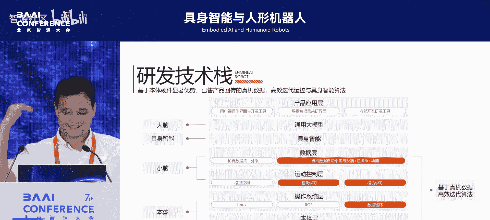

## 商业化落地与未来展望

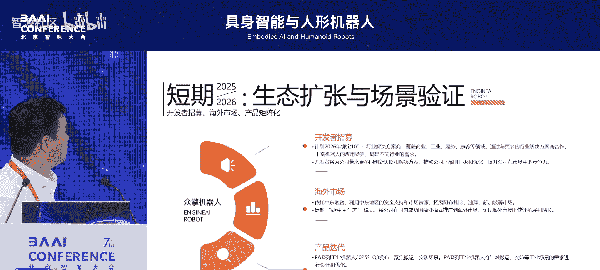

在构建了技术和团队基础后，商业化落地是最终考验。本节我们探讨人形机器人商业化的时间表、挑战以及未来的应用场景。

关于商业化落地，很多人问何时能实现。目前机器人能做蹦跳等动作，看似在“娱乐大众”。他认为这没关系，因为任何新设备初期都能带来情绪价值。只要能创造价值并形成大生意，就是好事。他们甚至曾被定义为“影视公司”，但他认为如果能将影视行业做大，也是一次很好的经历。

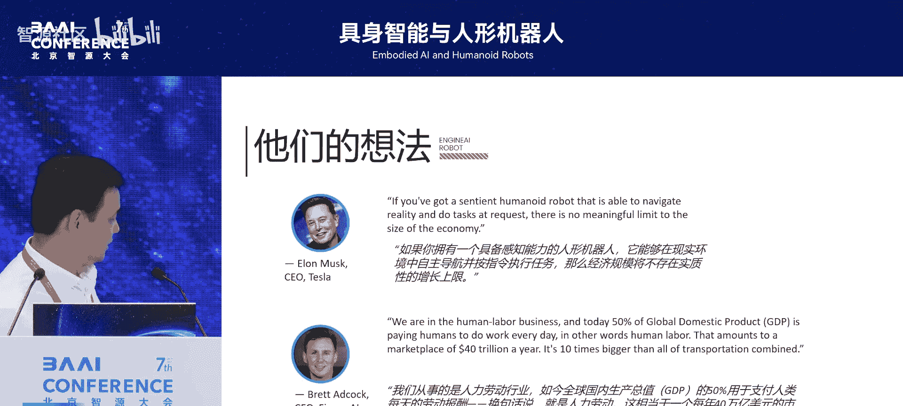

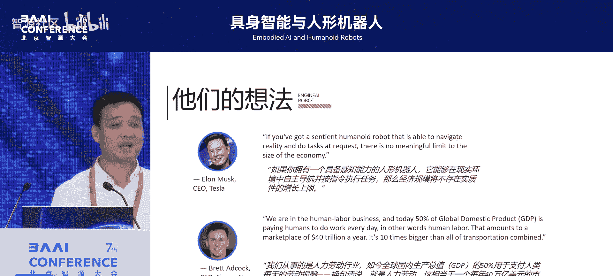

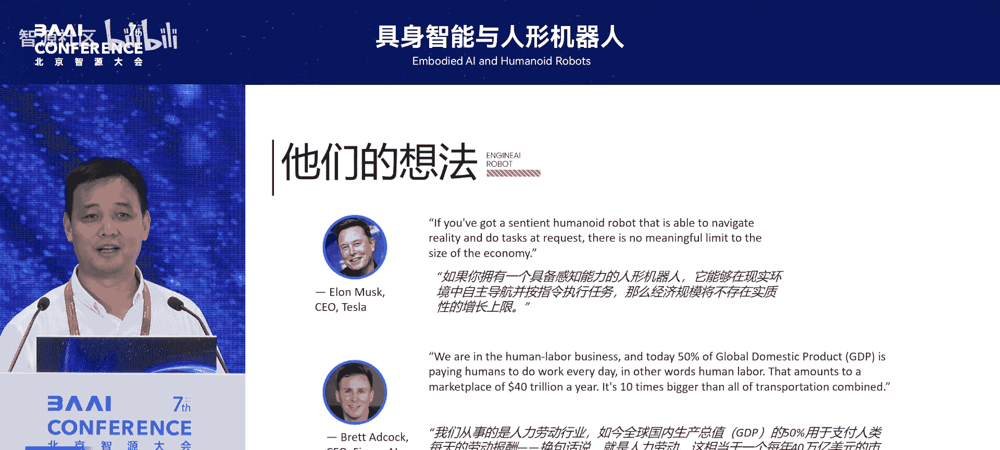

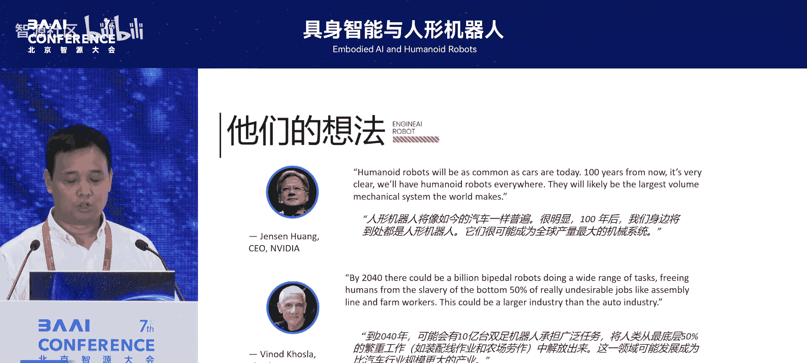

马斯克等人发表过许多关于机器人的言论，但他认为行业才刚刚开始，每个人都有机会，不必过于关注大佬说了什么。

关于人形机器人的产量，他预计未来一年左右，行业（包括他们和竞争对手）总共能产出两三万台。三年内，马斯克声称要达到30万台，但他基于对中国市场理论数据和技术能力的调研，认为一年产出3万台是比较现实的目标，30万台的目标定得太高。

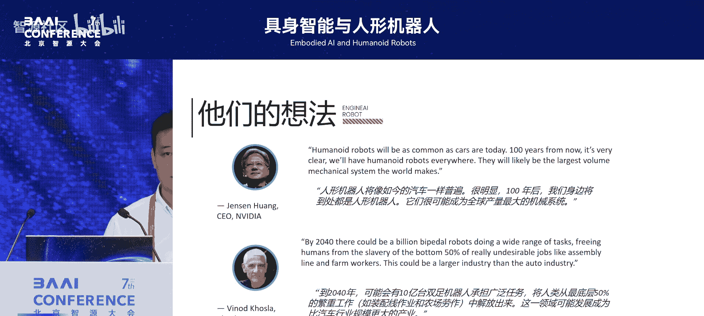

2022年之前，在大模型（如ChatGPT）未广泛应用时，他们认为机器人即使做得再优秀，若没有“灵魂”，价值也会大打折扣。他们曾预测到2035年才会出现重大突破，但2023年ChatGPT的出现令人惊讶。这说明除了他们在努力，整个行业都在进步。中国在相关领域的人才数量和质量不输海外，因此中国在该行业做到世界数一数二是有机会的。但在具身智能的硬件算力及算法人员数量上，需要清醒认识到与海外仍有一定差距，不过差距不大，有些方面甚至可能超越。

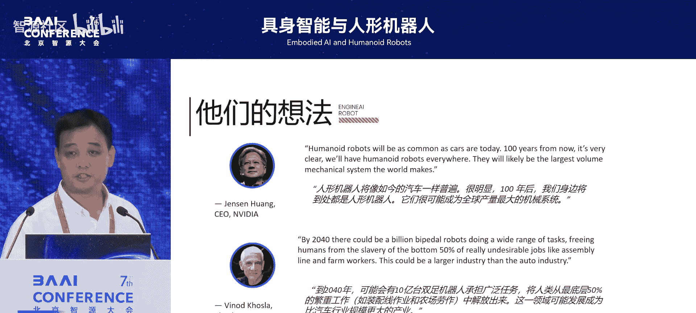

他们目前聚焦两件事：**体能**和**智能**。他们追求极致的体能表现，如奔跑、格斗，甚至研发身高1.8-2米、格斗会冒火花的机器人。目的是将体能做到极致，当人们发现跑不过、打不过机器人时，就不会再质疑它有什么用。制造一定的“恐慌”有助于让人们认识到其价值。另一方面，智能的发展则需要整个行业的共同努力。

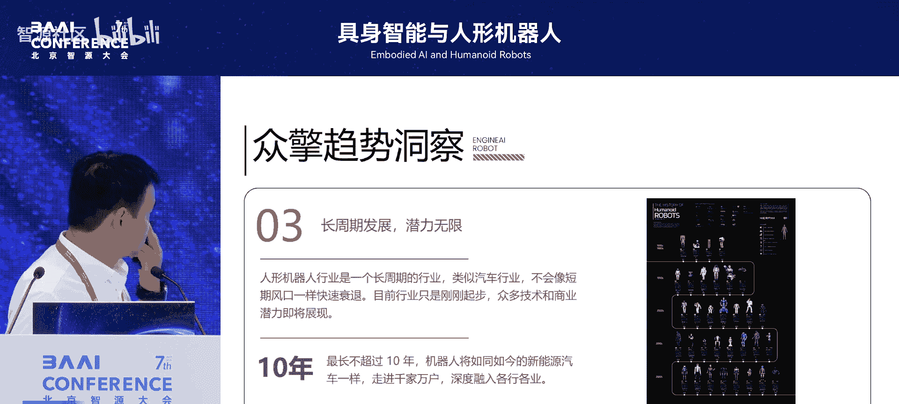

## 面对质疑与脚踏实地

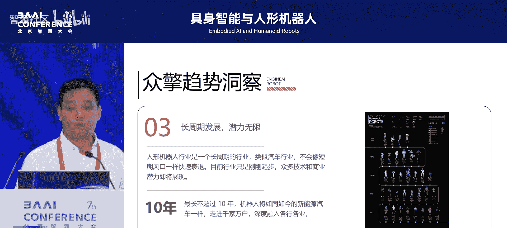

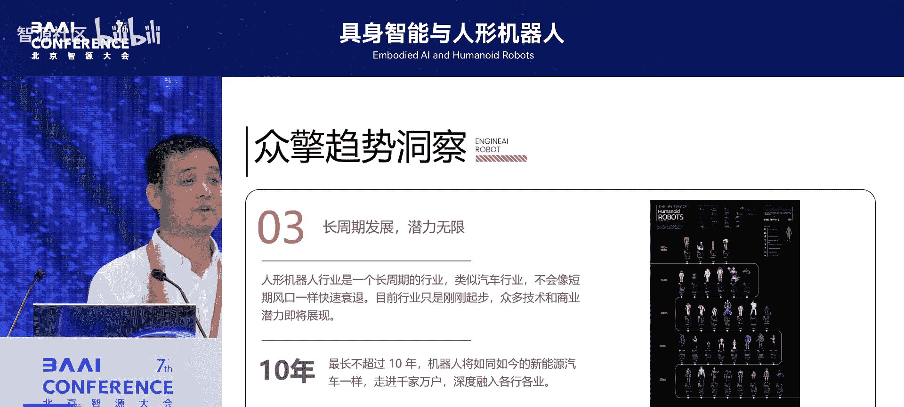

在追求高大上目标的同时，创业过程充满质疑和失败。本节我们看看如何面对这些挑战，并回归到解决最基础的问题。

在发展过程中，他们时刻面临质疑和失败。甚至在网络上和行业内被骂得很惨。他们的做法是，像汽车刚发明时跑不过马车一样，坚持前行。他们会把最难听的批评拿出来，放在公司屏幕上让每个工程师看，让大家感到愤怒，并将愤怒转化为力量。他们不回避质疑，反而直面它。

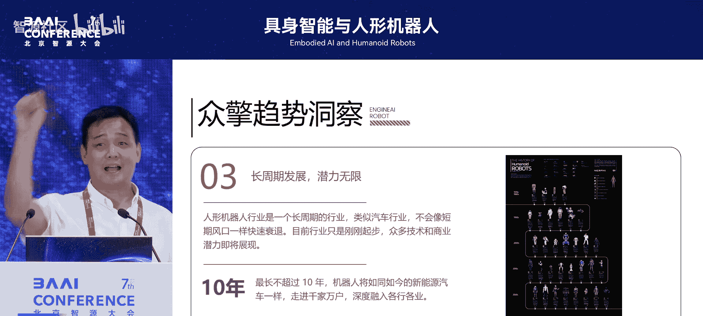

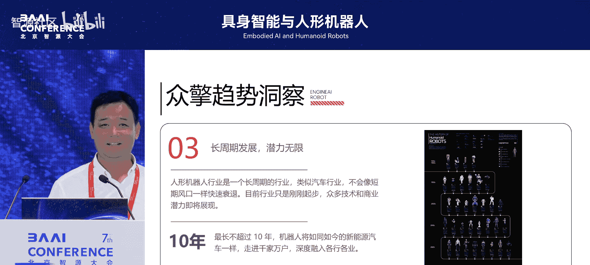

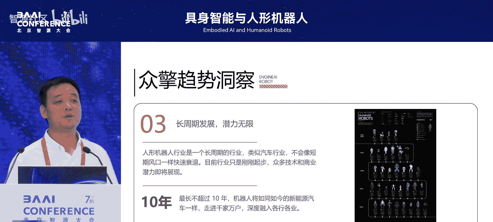

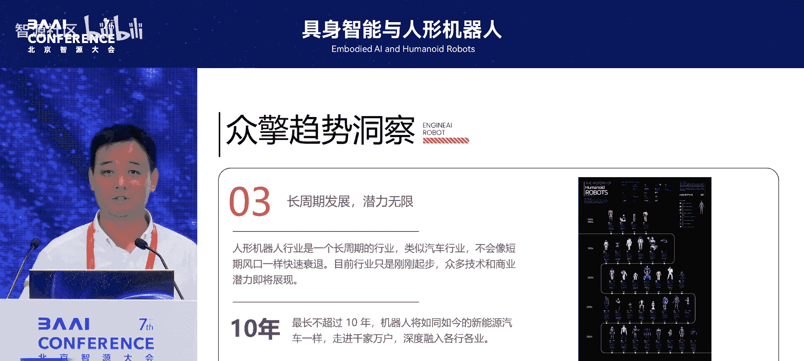

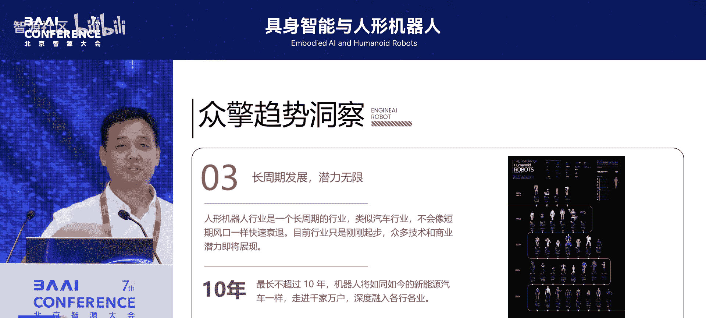

千头万绪，始于足下。在实现了跑跳等酷炫功能后，下一步是如何稳定落地。如果人形机器人不能安全地从A点移动到B点，例如从房间出门、上电梯、到另一栋楼取物再返回，那么双足机器人的价值就存疑。这件事在学术上没有瓶颈，但在工程上目前没有一家公司能做到。这是基础能力，如果不解决，双足机器人就是伪命题。双足存在的价值正是为了到达人类能到达的任何地方，否则轮式机器人就够了。因此，下一个根本任务是解决**双足机器人在视觉引导下的全地形适应能力**，并实现稳定、优雅、快速的移动能力。具备这个能力后，送快递、送外卖等应用才会产生巨大的商业价值。所有伟大的事业都要从脚下开始。因此，除了做酷炫的事，接下来更要做对商业有帮助的、稳定的事。

他们计划在今年年底举办机器人格斗比赛，使用1.8-2米高的机器人，进行类似WWE的激烈对抗。他们内部已成立专门团队。他认为大疆的RoboMaster比赛不够刺激，希望创造一场更精彩、能给世界带来趣味的全球性格斗比赛。

---

本节课中，我们一起学习了重情机器人创始人赵同阳的十年创业历程。从源于热爱的起步，到技术路径上从四足到双足的迁移；从对产品形态与极致细节的执着追求，到对硬件成本、寿命的理性分析；我们了解了构成机器人的四大核心板块，以及创业公司如何平衡发展与聚焦。最后，课程探讨了商业化落地的现实挑战与未来展望，并强调了解决基础移动能力的重要性，以及面对质疑时脚踏实地的态度。整个分享描绘了一幅人形机器人领域充满机遇、挑战与无限可能的画卷。