# 具身智能与人形机器人-p10-解决具身智能的数据瓶颈：高阳

在本节课中，我们将学习清华大学高阳教授关于如何突破具身智能发展核心障碍——数据瓶颈的思考与探索。我们将了解具身智能的定义、其与传统机器人的区别、当前面临的挑战，以及通过创新方法获取和利用数据来训练智能机器人的具体路径。

---

## 什么是具身智能？🤖

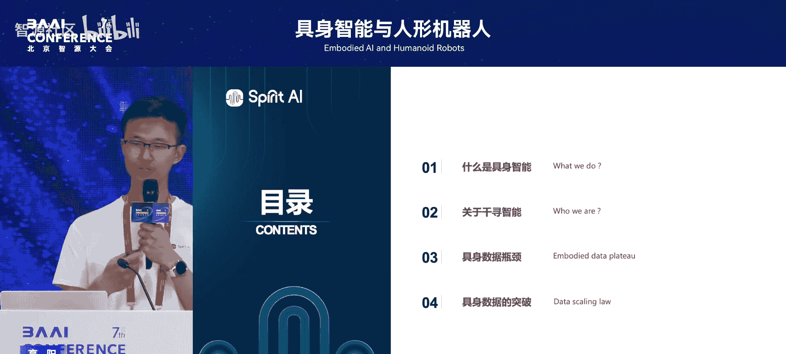

上一节我们介绍了大会的主题，本节中我们来看看具身智能的具体含义。从数据的角度描述，具身智能与过去的机器人有本质不同。

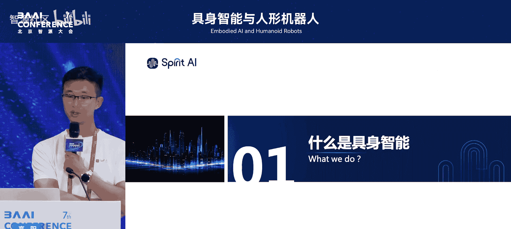

**具身智能** 是让机器从“键盘侠”变为“行动派”。大语言模型擅长处理信息和生成内容，而具身智能旨在将这种智能能力迁移到物理世界，让机器人能够完成诸如扫地、倒垃圾、洗菜等繁杂的家务劳动。

从字面上理解，具身智能就是“具身”加“智能”，即将智能赋予到身体之上。具体而言，具身智能需要理解物理世界的重力、摩擦力、空间关系、形状、因果关系以及物体的存在意义等。

在深入讨论之前，我们可以回顾一下20年前的机器人技术。例如本田的ASIMO机器人可以跑跳、推车；Shadow Hands灵巧手可以拿捏鸡蛋；波士顿动力的大狗能在复杂地形稳定行走；DLR的Justin机器人可以拧瓶盖。这些演示在当时非常先进，但它们都依赖于预先编程的、非智能的传统算法。机器人“看不到”也“不理解”周围环境，只是机械地执行轨迹。

**核心变化在于智能性**。今天的进步并非硬件，而是我们为机器人赋予了智能。过去每个炫酷的演示都需要大量工程师耗时数年专门开发，无法转化为日常生产力。因此，**机器人大规模落地的核心问题是实现智能化**。

---

## 智能化的市场前景与分级 📈

理解了具身智能的核心后，我们来看看其市场潜力和发展阶段。

当前已落地的机器人市场包括机械臂和扫地机器人，后者因更易用而拥有更大出货量。相比之下，手机和汽车是人人可用的设备，市场量级巨大。

**公式**：`具身智能潜在市场 ≈ 汽车价格 × 手机数量`

我们认为，如果解决机器人的智能化问题，每个家庭都可能需要至少一台机器人，其价格可能是汽车的1/3左右，这将是一个巨大的市场。

智能化在过去十几年取得了天翻地覆的进展。从1950年的感知机（神经网络雏形）和第一台工业机械臂，到近十年的Transformer、ChatGPT，进展迅速。具身智能目前可能处于类似GPT-1到GPT-2的早期阶段，预测未来5年可能出现“GPT-3.5级别”的具身智能模型。

具身智能的形态不限于人形机器人，广义上包括智能汽车、机械臂和扫地机器人，它们在底层技术上有高度统一性。当然，类人机器人是重要方向，初期发展需与市场匹配，例如轮式加双臂的形态。

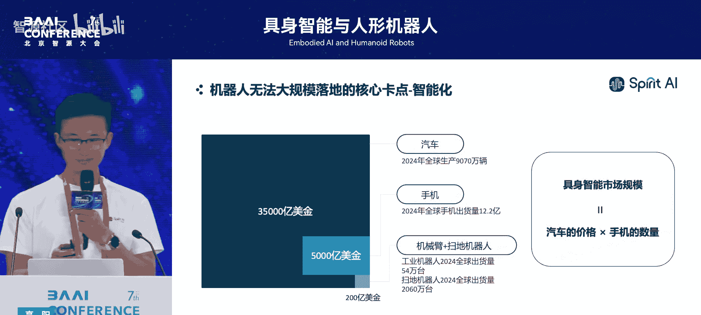

以下是具身智能的一个大致分级：

*   **L1**：在特定环境下完成多项单工位操作。
*   **L2**：在特定环境下完成组合式、长程任务。
*   **L3**：在特定环境下实现完全自主。这是一个关键且较难突破的节点。
*   **L4/L5**：更高级的通用自主能力。

目前，我们认为行业已接近达到L1水平，可以解锁许多现实落地场景。

---

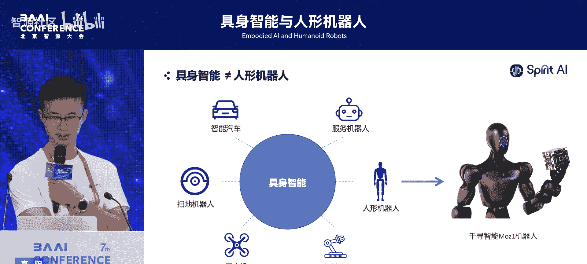

## 千寻智能的探索：智能与本体协同 🔄

了解了宏观前景，我们聚焦到一家具体的探索者——千寻智能公司。其核心思路是：智能是当前机器人落地的核心瓶颈。

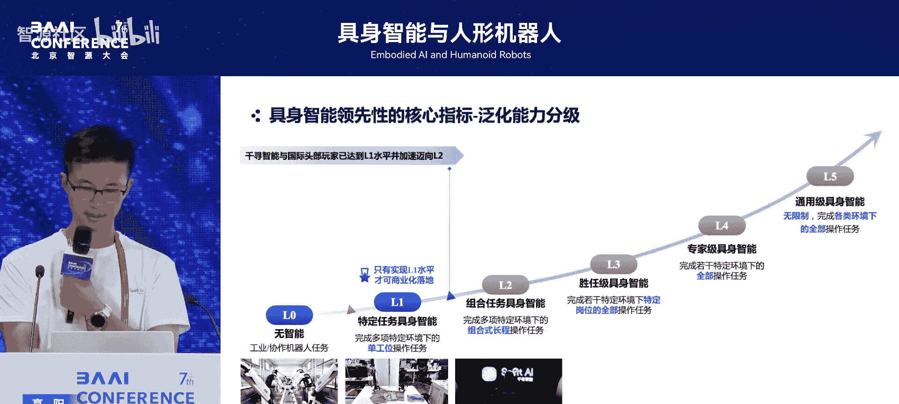

千寻智能由在工业机器人领域有深厚积累的韩风涛和在AI及具身智能领域有丰富研究经验的高阳教授联合创立。公司认为，智能必须依托于机器人本体，并且在短期内，智能算法与本体硬件难以完全解耦。

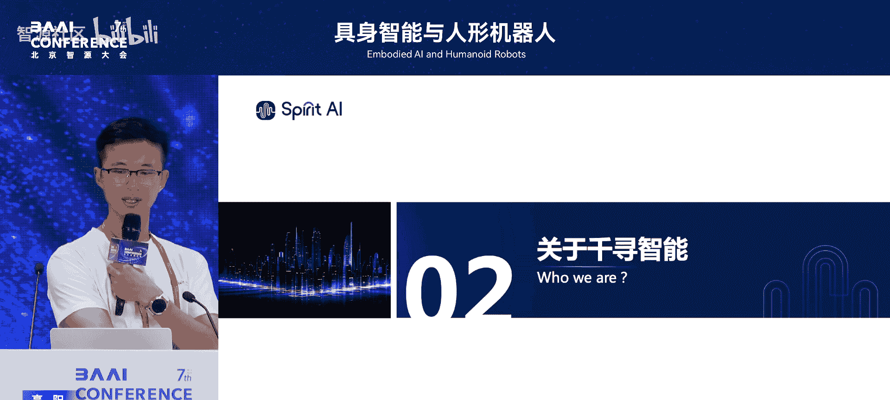

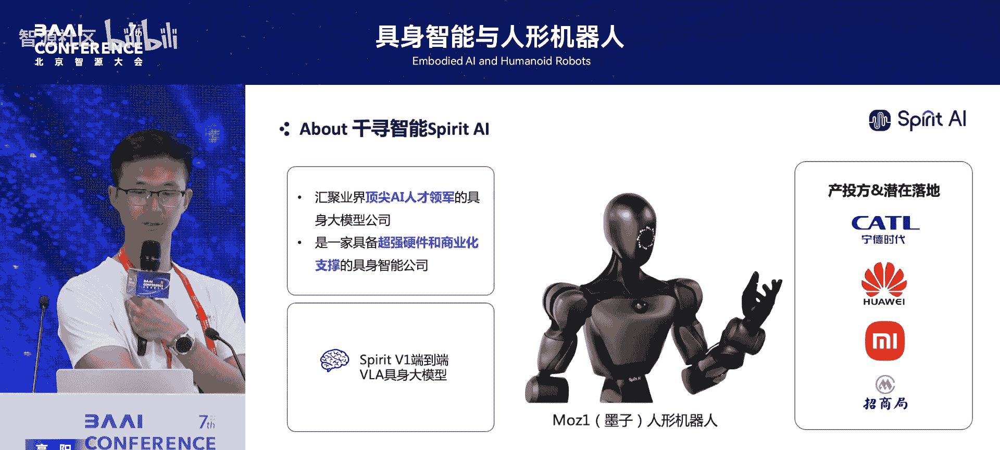

**一个类比**：大多数人习惯用右手吃饭，突然改用左手会非常难受。这说明具身智能是与本体的“肌肉记忆”和反射高度相关的技术。

因此，千寻智能以智能为核心，但同时驱动智能本体的进步。他们发现，有些任务在不够智能的本体上，甚至连人工遥控（摇操作）都无法完成。所以，**具身大模型与机器人本体的联合迭代，是智能发展的必要路径**。

在这两方面，千寻智能都处于领先地位：
1.  **本体**：研发了中国首个全身力控的人形机器人。力控让机器人能感知交互力（如拿纸杯的力度、推门时的阻力），这对实现类人行为至关重要。
2.  **算法**：率先探索使用互联网视频数据对机器人进行预训练，并构建了“数据金字塔”框架来提高训练样本效率。

---

## 核心挑战：数据瓶颈在哪里？🚧

介绍了具体实践后，我们直面核心问题：具身智能发展的最大障碍是什么？

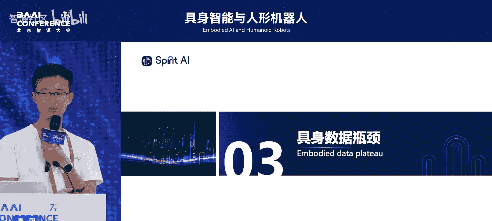

**一句话总结：我们卡在了数据上。没有数据，就训练不出好的具身智能模型。**

大语言模型（如ChatGPT）的成功，根基在于互联网积累了海量的文本数据。然而，机器人领域没有这样的数据积累。这是一个“鸡生蛋还是蛋生鸡”的问题：没有智能，就不会大规模部署机器人；没有大量机器人，就产生不了大量数据。此外，许多物理技能（如游泳）无法仅通过语言描述学会，必须通过实践获得数据。

有人提出借鉴自动驾驶的模式：先销售机器人，在使用中回收数据。这在汽车行业被证明是成功的，因为汽车易于操作（人类本身就会开车）。但**机器人非常难以操作**，人工遥控体验痛苦且效率低下，因此这条路目前走不通。

这引出了“莫拉维克悖论”：对人类来说简单的事情（如玩积木），对机器人可能非常困难；而对人类复杂的事情（如大量计算），对机器却很简单。解决这个悖论的关键，在于让机器人获得足够多、高质量的“体验”数据。

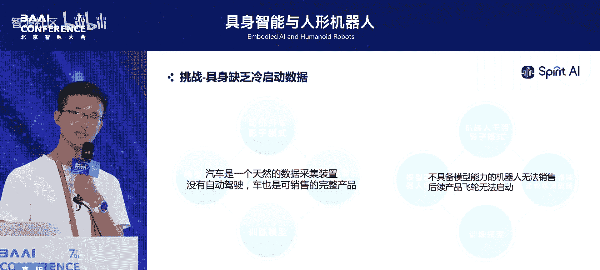

---

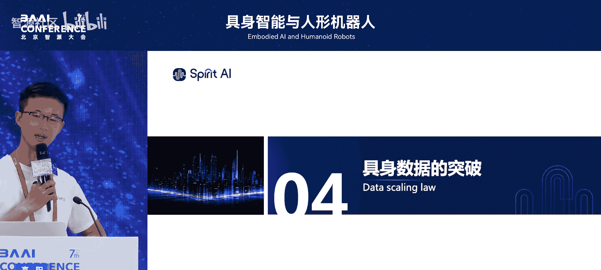

## 突破之道：数据从哪里来？💡

认识到数据瓶颈的本质后，本节我们探讨解决之道：机器人的数据究竟可以从哪里获取？

我们认为数据应来自三个方面：
1.  **互联网视频数据**：人类能通过观看视频模仿学习，机器人也应具备类似能力。
2.  **人工遥控（摇操作）数据**：当前获取机器人动作数据的主要方式之一。
3.  **机器人自主交互数据**：机器人在获得一定能力后，在现实世界中自主行动产生的数据。

以下是每类数据的具体利用方式：

**第一类：利用互联网视频进行预训练**
人类婴儿通过观察他人（即使形态不同）来学习动作。受此启发，我们探索让机器人通过观察人类或其他实体的视频进行学习。

**技术示例**：`AnyPoint Tracking Model`
该模型通过跟踪视频中物体和智能体（如人手）的运动进行预训练，学习物体在被操作时的运动规律。然后将这个预训练模型迁移到下游的机器人遥控数据上进行微调。

**代码/流程示意**：
```
1. 预训练阶段：海量人类视频 -> 学习“物体-动作”关联模型
2. 微调阶段：少量机器人遥控数据 + 预训练模型 -> 适配具体机器人的策略模型
```
这种方法能用大量廉价视频数据预训练模型，从而减少对昂贵遥控数据的需求。应用场景包括叠毛巾、开关柜门、清扫桌面等。

**第二类：探索模仿学习的数据缩放定律**
我们需要知道采集多少遥控数据能让机器人达到特定性能。在大语言模型领域，这称为“缩放定律”（Scaling Law）。

我们在具身智能领域进行了类似研究，采集了数万条现实世界轨迹并进行大量测试。结论是：**具身智能同样满足缩放定律，且形式与大语言模型类似，呈对数线性关系**。

**公式**：`性能提升 ∝ log(数据量)`

这意味着，错误率每降低10倍，大致需要增加10倍的数据量。这证明仅靠采集数据的方式，成本会指数级上升，难以让机器人在任意环境下达到极高（如99.9%）的成功率。

**第三类：物理世界强化学习**
为了让机器人达到极高的准确率，必须引入**物理世界强化学习**。传统强化学习样本效率低，常需在仿真器中模拟数十亿次。但仿真器难以完全模拟现实，且构建成本高。

我们探索的物理世界强化学习，让机器人像小孩学扔纸团一样：通过少数几次真实尝试，快速学习物理世界的反馈并调整策略。例如，一个机器人最初拿不稳水壶，在现实世界中经过几十分钟的自主尝试和算法调整后，就能稳定地完成浇花任务。

**核心思想**：结合少量示范数据（来自上述一、二类）与自主试错学习，让机器人快速适应新任务和新环境。

---

## 实践整合与未来展望 🚀

最后，我们看看如何将这些技术整合，并展望未来。

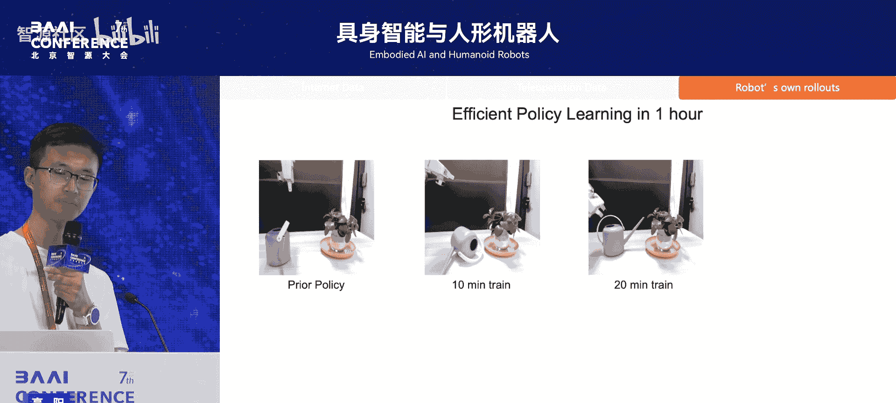

在千寻智能，我们将互联网视频预训练、监督微调（基于遥控数据）和强化微调（物理世界学习）结合起来，工程化地解决了复杂任务。一个标志性成果是攻克了“长程物体柔性操作”问题，即**叠衣服**。

叠衣服之所以困难，是因为需要理解并处理衣物的复杂褶皱状态，这对机器人的“具身理解能力”要求很高。通过融合多项技术，机器人现在可以处理任意状态扔过来的衣服并完成折叠。

**总结与展望**
本节课我们一起学习了：
1.  **具身智能**是将智能赋予身体，使其能在物理世界行动。
2.  发展的**核心瓶颈**是缺乏高质量、大规模的训练数据。
3.  突破瓶颈的**三条路径**：
    *   利用海量互联网视频进行预训练。
    *   研究模仿学习的缩放定律，高效利用遥控数据。
    *   通过物理世界强化学习，让机器人自主试错、快速适应。
4.  智能算法与机器人**本体需要协同发展**。
5.  最终目标是让智能机器人走进千家万户，解放人力。

高阳教授及其团队的目标是“双十计划”：希望在10年内，让全世界至少10%的人拥有自己的机器人，帮助人们从日常体力劳动中解放出来。

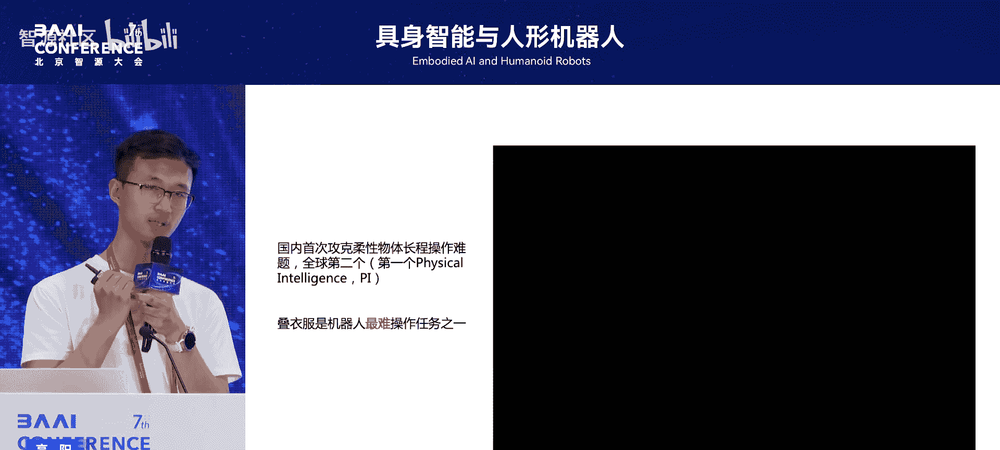

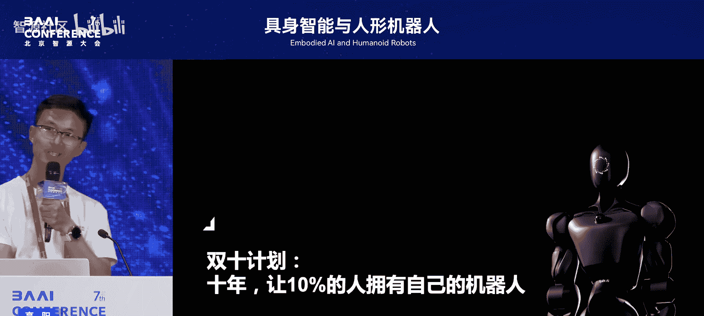

---
**本节课中，我们一起深入探讨了具身智能面临的数据挑战及其创新解决方案，从理论分析到技术实践，描绘了通过多元化数据获取和算法创新来突破瓶颈、迈向通用具身智能的清晰路径。**