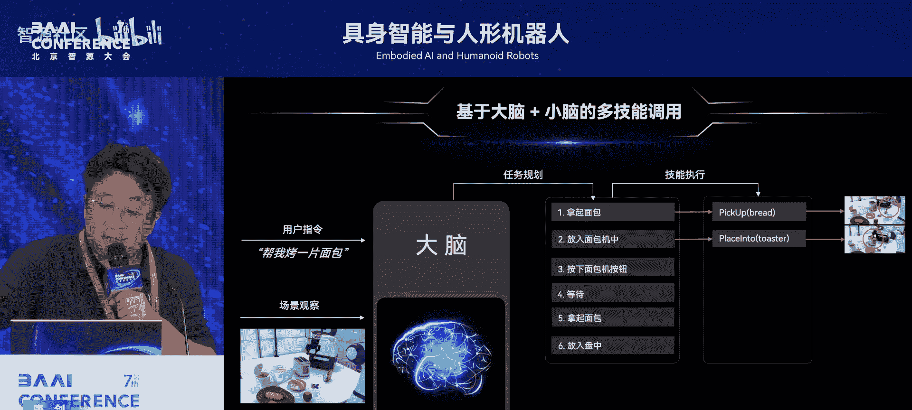
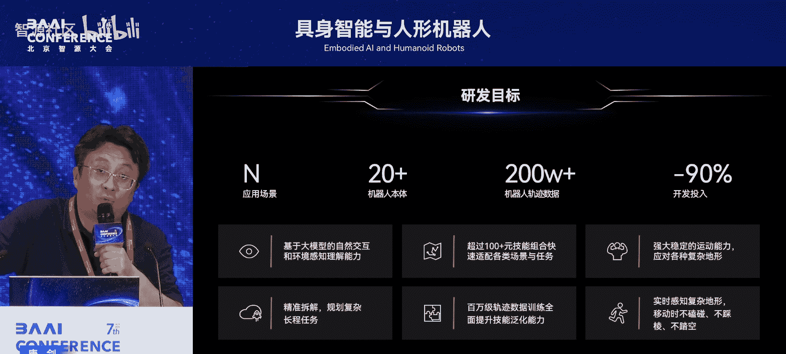
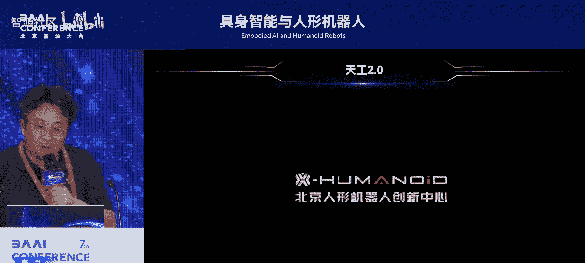
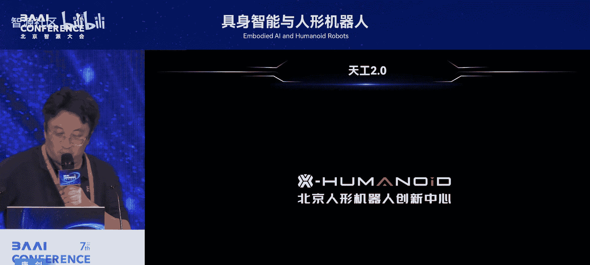
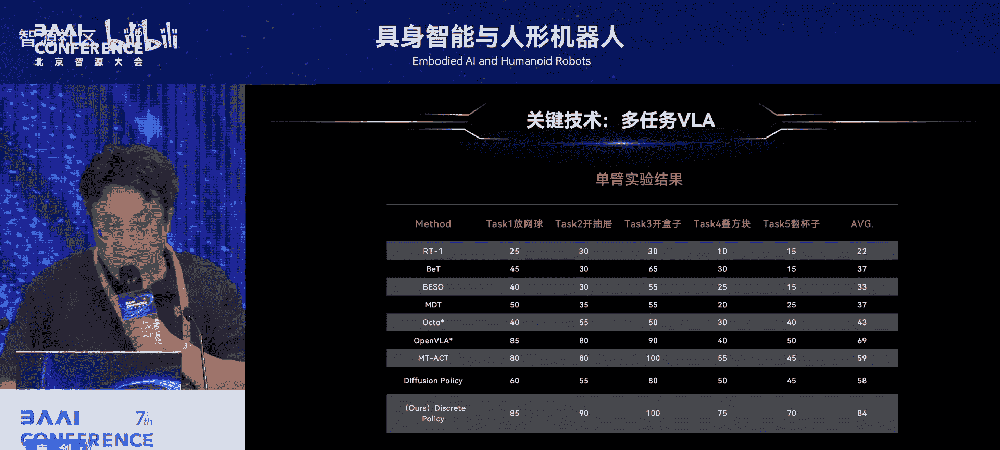
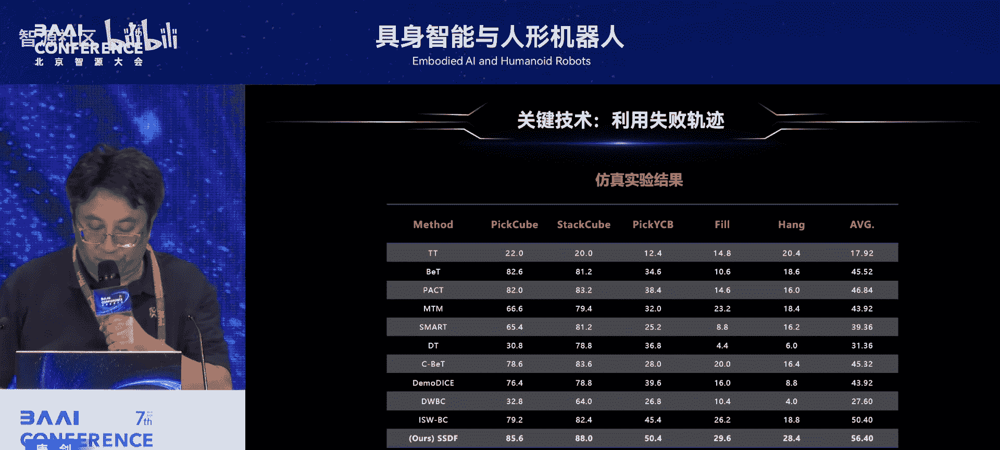
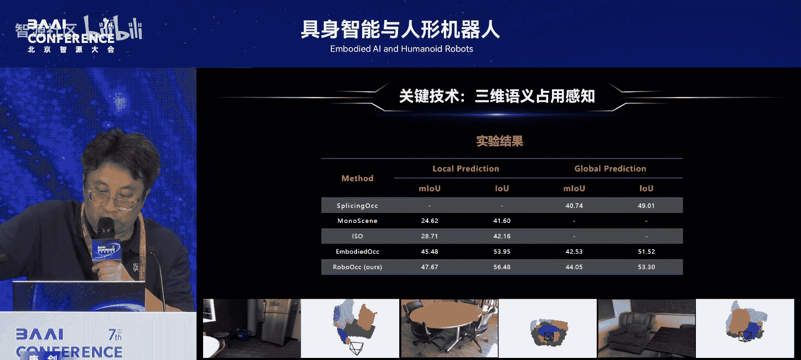
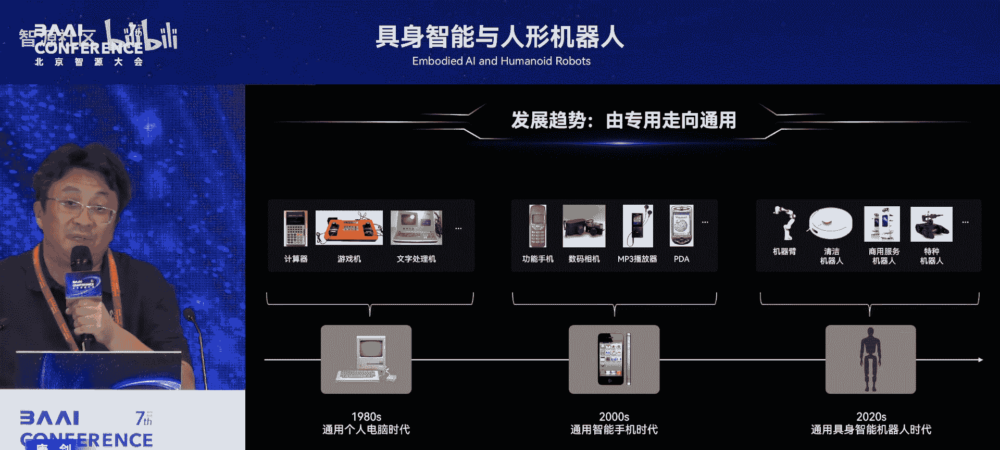

# 具身智能与人形机器人-p11-慧思开物：通往通用具身智能之路：唐-剑

在本节课中，我们将学习北京人形机器人创新中心CTO唐建博士关于通用具身智能发展路径的分享。我们将了解当前机器人行业面临的挑战、传统控制方法的局限，以及如何通过“慧思开物”平台结合大模型技术，构建具备强大泛化能力的通用具身智能体。课程最后，我们还将展望具身智能技术的未来发展趋势与产业化前景。

## 行业现状与挑战

上一节我们介绍了课程概述，本节中我们来看看当前机器人行业面临的核心痛点。

尽管人工智能在围棋等复杂认知任务上已超越人类，但机器人完成如开门、端水等对人类而言简单的物理操作任务仍非常困难，这被称为“莫拉维克悖论”。目前，整个行业主要面临三大挑战：

以下是当前机器人行业的三大核心痛点：
1.  **场景泛化能力差**：一款机器人通常只能工作在单一固定场景，例如工厂打螺丝的机器人无法去酒店送毛巾。
2.  **任务泛化能力差**：即便在同一场景（如一个3C工厂）内，也需要不同的机器人和不同的程序来完成不同的任务。
3.  **本体泛化能力差**：机器人本体通常是针对特定应用（如工业机械臂、送餐机器人）专门设计的，缺乏通用性。

## 传统控制方法与AI探索

了解了行业痛点后，我们来看看传统的解决方案及其局限性。

传统机器人控制主要依赖**基于数学模型预测的控制（MPC）**。其公式可简化为在每一步求解一个优化问题：
```
min J(x, u)  subject to  x_{k+1} = f(x_k, u_k)
```
其中 `J` 是目标函数，`x` 是系统状态，`u` 是控制输入，`f` 是系统模型。

MPC的优势在于高可靠性、确定性和精确度，因此在结构化工业环境中广泛应用。但其缺点同样明显：需要预编程、仅适用于结构化环境和固定流程，几乎没有任何泛化能力。

在大模型出现之前，学界主要探索两类基于AI的端到端控制方法：
以下是两类主要的AI控制方法：
*   **模仿学习（Imitation Learning）**：像学生一样从示范数据中学习技能。
*   **强化学习（Reinforcement Learning）**：像实战派一样，让机器人在实际环境中通过试错来学习。



然而，受限于数据和模型规模，这些方法通常只能学习单一或少数几种技能，例如抓放（pick and place），泛化能力有限。

## “慧思开物”通用平台架构



上一节我们回顾了传统方法的局限，本节中我们将深入探讨北京人形机器人创新中心提出的“慧思开物”通用具身智能平台。

“慧思开物”旨在颠覆传统的机器人应用开发模式。传统模式是为特定机器人、特定场景下的特定任务编写专门应用。而“慧思开物”的目标是让开发者能用一种**通用、统一、简单**的方式，为**任何场景、任何任务和任何机器人本体**开发应用，从而大幅降低开发成本和时间。

该平台定位为“**一脑多能、一脑多机**”的通用具身智能平台。
*   **一脑多能**：一个“大脑”支持各类机器人应用开发。其核心思想是，任何复杂任务（如打螺丝、端茶倒水）都可被拆解成一系列基本动作（技能，Skill），例如打开、关闭、拿起、放下等。行业共识是，大约50-100种技能即可覆盖物理世界绝大部分任务。平台通过端到端的**视觉-语言-动作模型（VLA）** 来实现这些技能，并构建泛化能力强大的**原技能库**。
*   **一脑多机**：同一个“大脑”平台可兼容支持多种不同的机器人本体，目前已适配近10种机器人和机械臂。

整个平台由**具身大脑**和**具身小脑**两部分组成：
以下是“慧思开物”平台的核心组成模块：
1.  **具身大脑**：运行在云端，包含多个智能体（Agent），使用多种大模型（LLM, VLM）。核心功能包括自然交互、空间感知、意图理解，以及最关键的**任务规划**——将复杂任务拆解为子任务。它还具备错误反思、记忆管理等能力。
2.  **具身小脑**：运行在机器人端侧，也是一个智能体。它包含两个子平台：
    *   **操作子平台**：核心是原技能库，负责将大脑分配的子任务映射为具体的VLA模型或模块化技能来执行。
    *   **运控子平台**：位于操作子平台之下，负责基础运动控制，包括全身控制（WBC）、双臂协作、稳定移动、定位导航等。

该平台采用**开源开放**策略，大脑端可接入自研或第三方大模型（如GPT），小脑端的原技能库也欢迎集成优秀的开源或合作伙伴的VLA模型。

## 平台核心：任务规划与自我进化

理解了平台架构后，本节我们聚焦其最核心的能力——精准的任务规划与自我进化能力。

唐建博士指出，通用具身智能有两大核心卡点：
1.  **大脑如何精准规划各类任务**：任务千变万化，模型需具备强大的泛化和自主探索能力。
2.  **小脑如何可靠执行每个子任务**：在开放、动态的环境中成功执行动作极具挑战。





为解决第一个卡点，“慧思开物”平台让具身大脑具备了**自主探索和学习进化**的能力。其核心技术是结合了**蒙特卡洛树搜索（MCTS）** 的规划框架。当接到一个任务（如“加热面包”）后，大脑会像下棋一样进行启发式探索，生成多种可能的任务执行路径（Plan）。

每条路径的评估依赖于一个由 **多模态大模型（VLM）**、**世界模型** 和 **奖励模型** 构成的闭环：
```
任务规划闭环：VLM（规划） -> 世界模型（模拟） -> 奖励模型（评估） -> 数据收集 -> 强化学习微调VLM
```
*   **世界模型**：绝非简单的视频生成器，它需要理解物理规律，能准确模拟每个规划方案在虚拟环境中的执行过程，从而避免在物理世界进行费时费力的试错。
*   **奖励模型**：判断一个方案或步骤的好坏（成功、可继续、失败）。
*   **自我进化**：在探索过程中收集到的动作（`a`）和动作价值（`A`）等数据，被用于**近端策略优化（PPO）** 等强化学习算法中，持续微调（Fine-tune）VLM，使其规划能力越来越精准。世界模型还能自动生成多样化的虚拟仿真数据，极大扩充训练集。

## 技术演示与科研成果

上一节我们探讨了平台的核心原理，本节通过实际演示和科研成果来展示其能力。

平台在操作和运控方面取得了多项进展：
以下是部分能力演示：
*   **自动错误处理**：基于端到端模型，机器人能够处理执行过程中的意外失误，并进行重新规划（Replan），实现“使命必达”。
*   **空间感知与复现**：机器人能感知人搭出的乐高（Lego）形状，并规划步骤进行复现，展示了大脑的空间感知和规划能力。
*   **多技能串联**：完成一个“打包”任务，涉及拿起、扫码、放入、封箱、贴标签、放置到传送带共5种技能，展示了平台串联调用多技能的能力。
*   **双臂协同控制**：使用单个VLA模型控制双臂，完成需要协同配合的任务。

在**具身运控**方面，其“天工”人形机器人已实现稳定奔跑（时速10公里）、快速奔跑（峰值速度4米/秒），并能实时感知复杂地形（如湿滑路面、台阶、坡道），实现连续攀爬100多级台阶，具备强大的抗冲击能力。





在学术研究上，团队也产出了高质量成果：
以下是部分代表性科研工作：
*   **DiscPolicy（离散策略）**：一种支持多任务的VLA模型。通过构建VQ-VAE自编码器从轨迹中学习特征，并使用条件扩散模型进行解码，显著提升了任务成功率，在单臂和双臂任务上均达到先进水平。
*   **利用失败轨迹**：提出自监督数据筛选框架，能从大量失败轨迹中提取高质量部分用于训练，通过加权损失函数利用这些数据，提升了模型性能。
*   **3D语义占用感知**：针对人形机器人导航中物体堆叠、种类繁多、尺寸小等挑战，提出了不透明度引导的自编码器和几何感知编码器，实现了对场景的细粒度语义理解，在多项指标上超越了现有先进方法。

## 未来展望与总结



最后，我们来展望具身智能技术的未来发展趋势，并对本节课进行总结。

**技术发展趋势**：未来需要重点关注以下几个方向：
以下是未来技术发展的关键方向：
1.  具备**自主探索和自主学习**能力的具身大脑。
2.  具有强泛化能力、能进行**全身控制**的VLA模型。
3.  通用的、具备强泛化能力的人形机器人**全身运动控制器**。
4.  人形机器人**全自主导航方案**（感知、规划、控制）。
5.  针对柔性体、流体操作更好的**物理引擎**。

**产业化落地展望**：具身智能的产业化预计将经历三个阶段：
以下是产业化发展的三个阶段：
1.  **近期（1-3年）**：在结构化/半结构化的工业或特种危险场景，通过“遥操作+逐步自主”的方式，完成巡检、简单操作、搬运分拣等任务。
2.  **中期**：在商业服务等半结构化场景，完成收纳整理、打包、扫码等较复杂的服务型任务。
3.  **远期**：进入家庭生活场景，扮演人类助手、保姆等角色，推动人机共存时代到来。

**核心观点**：从专用机器人走向通用机器人是历史的必然。回顾个人电脑取代专用文字处理机、智能手机整合多种移动设备的历程，可以预见，未来具备通用具身智能能力的人形机器人，将部分或全部取代现有的专用机械臂、服务机器人等，最终进入千家万户。

**数据与生态建设**：团队认识到数据的重要性，因此构建了“RobMin”多构型规范化数据集（含10万多条轨迹数据），并牵头制定国内首个具身智能数据采集标准。同时，正在建设大型的具身智能机器人数据与训练基地，通过**虚实结合**的数据生成方式（实验证明能显著提升真机任务成功率），为全行业提供数据赋能。

---



本节课中我们一起学习了通往通用具身智能之路的全面蓝图。我们从当前机器人行业的痛点出发，分析了传统控制方法的局限，然后深入介绍了“慧思开物”这一“一脑多能、一脑多机”的通用平台架构及其核心的任务规划与自我进化机制。通过实际演示和科研成果，我们看到了该平台在操作和运控方面的强大能力。最后，我们展望了未来技术发展的关键方向和产业化落地的三个阶段。唐建博士指出，就像通用电脑和智能手机取代专用设备一样，发展通用具身智能和人形机器人是历史的必然趋势，需要产学研各界共同努力推动。