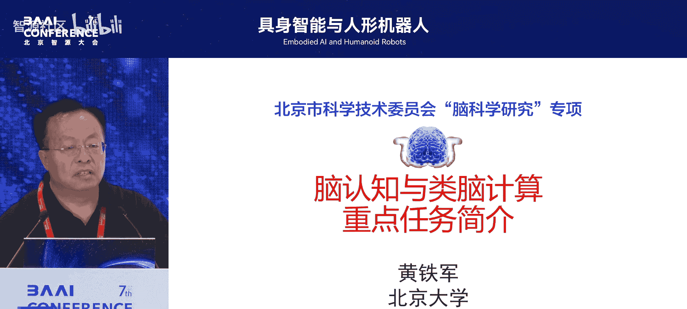
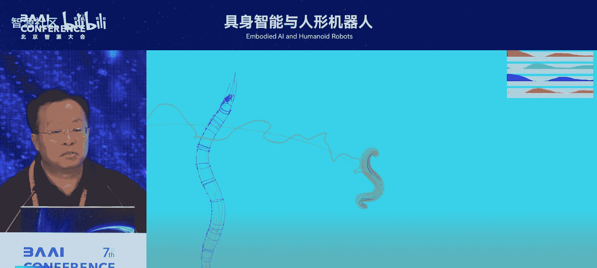

# 具身智能与人形机器人-p13-大会闭幕致辞：黄铁军

在本节课程中，我们将学习北京智源研究院理事长黄铁军教授在2025北京智源大会上的闭幕致辞。他将从人工智能安全与发展的平衡谈起，分析当前技术现状，并展望具身智能与人形机器人的长远未来。

## 概述：安全与发展的平衡

上一节我们探讨了具身智能的具体应用，本节中我们来看看其宏观发展与终极意义。黄铁军教授指出，人工智能的安全问题，如模型自我改进、超越人类能力等，是当前紧迫的挑战。然而，技术发展无法被单纯的安全顾虑所阻挡，必须在安全与发展之间寻找平衡。

## 近期展望：认知大模型与可控风险

近期（约五年内），以语言大模型为代表的认知大模型，其可控性问题已处于风险边缘。若认知能力超越人类，并被人类执行力所利用，可能引发问题。因此，一个合理的选择是：**让认知能力暂不超越人类，而让具身智能提高劳动能力，替代人类从事危险或不愿从事的工作**。

## 长期挑战：构建完整智能体的难度

构建一个完整的、有物理身体的智能体是长期目标，但难度极高。智能的演化是一个漫长的过程：
*   **语言能力**：出现于约3-7万年前。
*   **大脑皮层**：出现于约2亿年前。
*   **视觉系统**：出现于约5亿年前。
*   **生命体**：出现于约35亿年前。



以下是智能演化的关键节点时间线：
```
生命体 (35亿年前) -> 视觉 (5亿年前) -> 大脑 (2亿年前) -> 语言 (3-7万年前)
```
具身智能之所以困难，正是因为它需要集成这些历经亿万年演化才形成的复杂能力。

## 现状对比：人工系统与生物系统的能力

当前人工系统在部分指标上已接近甚至超越生物系统。

**1. 大脑 vs. 大模型**
*   **人脑**：约1000亿神经元，100万亿连接，毫秒级运行速度。时空复杂度约为 `10^17`。
*   **大模型**：约万亿参数（人脑的1%），微秒级运行速度。其整体计算复杂度已可比拟甚至超越人脑，这是其产生强大智能的物理基础。

**2. 人眼 vs. 仿生视觉**
*   **人眼**：约百万像素分辨率，毫秒级响应。
*   **先进仿生眼**：已达到千倍于人眼的速度（如4万赫兹）。例如，使用高速视觉系统，可在0.25秒内完成动态物体的三维重建，这对于高速自动驾驶等场景至关重要。

**3. 身体与基础行为**
构建物理身体极为复杂。智源研究院成功模拟了**秀丽隐杆线虫**的完整生物体与觅食行为。这个模型拥有 `96块肌肉` 和 `302个神经元`，能够自主寻找食物。这标志着在构建具有基础生命行为的具身体系上取得了重要进展。

## 未来蓝图：AGI分级与终极使命



关于通用人工智能（AGI）的发展，可以参照一个五级分类体系。当前大模型正在接近的是 **“数字版AGI”**（强认知，无身体），可能在数年內实现。只要人类管理得当，其风险相对可控。

真正的颠覆性风险来自于 **“具身版AGI”**，即高度自主、通用且具有强大执行能力的智能体。黄铁军教授预测，这可能在约 **2045年**（即约20年后）实现。

那么，创造超越人类的具身智能，终极意义何在？

**核心观点：具身智能的使命不在地球，而在星辰大海。**

*   **人类是地球的产物**：我们的身体构造、生理节律（如受月球影响）、乃至智能模式，都与地球环境精密绑定，无法适应外星球长期生存。
*   **机器人是人类的“孩子”与“延伸”**：我们应像希望子女超越自己一样，去创造能力更强的具身智能。它们将承载人类的梦想，代替人类去探索宇宙，应对人类无法解决的挑战（包括可能的星际交流）。
*   **技术趋势不可逆转**：与其恐惧被超越，不如明确其伟大的使命——为人类文明开疆拓土。

## 总结

本节课中我们一起学习了黄铁军教授对具身智能发展的深刻见解。我们从当前AI安全与发展的平衡点出发，回顾了构建智能体的巨大挑战，对比了人工与生物系统的现状，最终展望了具身智能超越人类、迈向星辰大海的宏伟使命。这为我们理解和发展具身智能提供了既务实又充满想象力的框架。