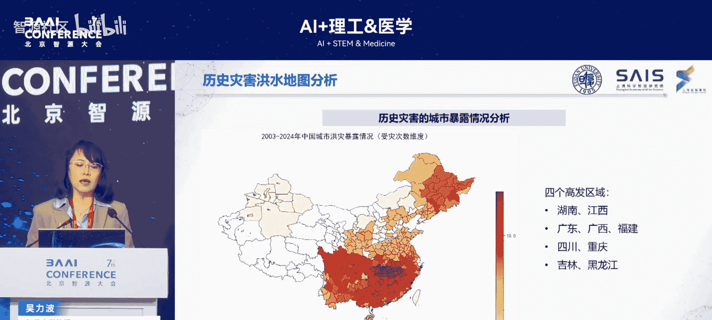
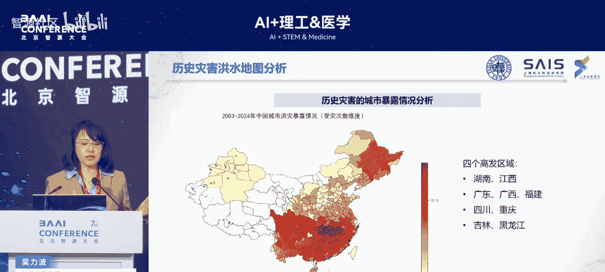
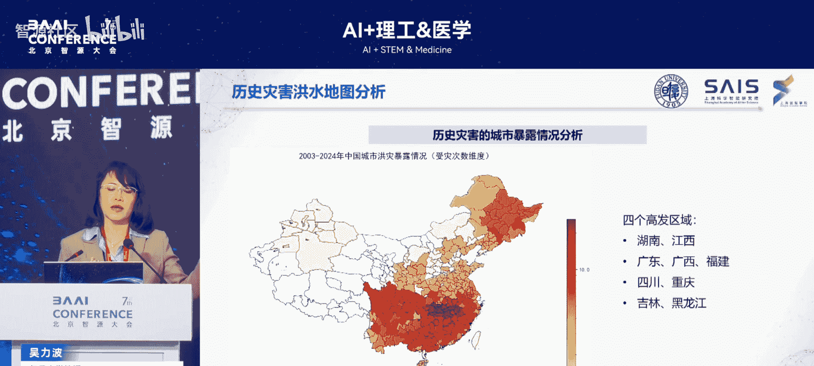
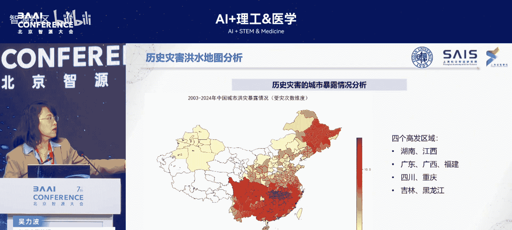

# AI+理工&医学-p02-AI驱动的气候风险识别与韧性电力系统优化：吴力波

在本节课中，我们将学习如何利用人工智能技术来识别气候风险，并优化电力系统以增强其韧性。我们将探讨气候风险的特征、可再生能源预测的挑战，以及如何构建一个能够应对未来约束和扰动的韧性电力系统。

## 气候风险与能源系统的耦合挑战

上一节我们介绍了课程的整体背景，本节中我们来看看气候风险与能源系统交互所面临的核心挑战。全球面临的重要挑战之一是气候变化。尽管达成了巴黎协定，且中国承诺了2030年碳达峰与2060年碳中和，但全球各国的减排效果与将温升控制在1.5至2摄氏度的目标仍有差距。因此，气候风险的发生频率大大增加。

另一方面，解决气候变化问题需要大量接入可再生能源。这就形成了一个悖论：一方面需要更强地利用自然系统（如风能、太阳能）提供能源；另一方面，该系统本身的风险又在持续增加。这与传统能源系统完全不同。

我们关注的问题主要有以下几点：
*   如何捕捉气候风险的特征及其对能源系统的影响。
*   大量风电、光伏接入后，如何有效预测其出力以降低不确定性。
*   如何将电力系统构建为更具韧性的系统。

未来的电力系统将面临更强的排放约束和更多的气候风险扰动。在此新条件下构建系统，主要面临三方面挑战：
1.  气候风险敞口持续扩大，如何构建AI驱动的气候风险预测模型以更好地捕捉风险。
2.  风险冲击系统后，当前高度互联的源-网-荷-储电力系统（含大量可再生能源、储能、虚拟电厂等）如何进行脆弱性识别。
3.  该系统与人类社会、经济活动及公共政策复杂交互，如何模拟这些交互行为，确保人类反馈不带来更大冲击，以及政策如何协同优化。

我们的工作围绕以上四个板块展开。

## AI驱动的气候风险感知

上一节我们探讨了核心挑战，本节中我们来看看如何利用AI进行气候风险感知。我们主要基于“伏羲”气象大模型开展了一系列工作。伏羲模型在全球AI气象大模型的各项指标评测中处于国际前列。

我们也是全球首个发布次季节预报的大模型。次季节预报指约40天或更长时间尺度的预报，这在气象预报中被称为“预报沙漠”，时间周期越长越难以预报。我们首次将预报时长推至36天（目前达42天），并成为首个登陆欧洲中期天气预报中心官网的次季节大模型。

此外，在极端降水、台风等灾害事件的预报方面，伏羲的预测效果也明显优于其他模型。我们还开发了融合真实观测数据的中期天气预报大模型，不仅使用公开数据，也基于中国自有卫星遥感数据，构建了端到端的数据同化预报大模型。

以下是关于伏羲模型的一些关键进展：
*   **传统数值预报的瓶颈**：计算成本高、速度慢。随着观测数据增加，其预测精度出现收敛。
*   **AI气象预报的优势**：基于Transformer架构，计算速度非常快，可进行多次计算以提供更精准的概率预报。
*   **伏羲1.0**：参数量超45亿，可提供未来15天的预报。
*   **伏羲2.0**：更面向产业应用需求，如预测百米级风速、云量，提供更高时空分辨率（最精细达500米×500米），并与其他复杂系统模型（如海洋模型）耦合。

目前，相关平台已进入中国气象局、上海气象局、香港天文台及欧洲中期天气预报中心的业务场景。在中国气象局组织的人工智能天气预报大模型示范计划中，我们在三大类各项指标评测中均排名第一。我们的海气耦合中期气象模型能提供全球未来15天、逐小时、9公里分辨率的预测，并耦合多种大气和海洋变量。

## 从气象预报到气候变化预测

在掌握了短期气象预报能力后，我们进一步向更长时间尺度的气候变化预测拓展。气候变化是一个长时间尺度的过程。传统的综合评估模型时间尺度常拉长至2100年，但此过程中损失了大量极端信号，许多灾害数据被平滑。

我们的工作是对全球气候模式结合短临、中期、次季节预报进行降尺度研究。传统模式分辨率较低，无法为台风、极端降水等区域小尺度灾害提供有效支撑。

以下是我们的工作方法：
*   基于全球气候变化综合评估模式，涵盖所有气候模式，进行进一步降尺度。
*   支持在不同温升情景及排放浓度路径下的气候风险未来转型路径模拟。
*   提出了首个基于Flow Matching的生成式气候模式统计降尺度模型。

我们针对暴雨、大风等极端灾害事件进行预测。结果显示，相较于欧洲中期天气预报中心等典型数值预报模式，伏羲在极端气候灾害的预测能力上显著增强，其预测更接近真实观测。

## 从气候灾害到社会经济损失评估

有了灾害预测，还需评估其是否会真正导致社会经济损失。致灾原因常是人类适应能力弱，例如城市韧性差导致内涝。

我们进一步研究如何利用AI技术解构下垫面地球系统特征。面临的挑战包括：人造地表的光谱相似性限制了卫星数据分类的有效性；数据可用性和区域差异性挑战了单一模型的全球泛化能力；经济部门的用地结构不明确，难以计量灾害损失。

我们的工作主要包括以下几个步骤：
1.  **绘制洪水淹没地图**：基于卫星图像与GFD数据库，制作250米分辨率的栅格洪水地图，并与全球灾害统计年鉴匹配，关联洪灾与经济损失。
2.  **补充与扩展数据集**：利用预测技术补充了近50次全球洪灾的洪水地图，扩大了数据集。
3.  **构建城市洪灾暴露模型**：以伏羲预测的极端降水为输入，结合历史数据，还原洪灾地图及其强度、城市暴露面积。结果与历史受灾热点区域高度吻合。
4.  **识别城市下垫面经济特征**：基于高德POI数据与工商业注册数据映射，添加行业标签，分割地块，融合分析不透水面，构建实体级土地利用识别模型。
5.  **构建行业损失风险模型**：以伏羲极端天气预测和全行业土地利用清单为输入，估算行业GDP损失、劳动力就业损失等。

目前，我们正在逐步开源城市洪水暴露和经济损失的完整数据清单。

## 精准的可再生能源出力预测

在具备良好的气候风险感知能力后，我们来看如何实现更精准的可再生能源预测。我们将百米风速、辐照度、云量等预测扩展到风能和太阳能领域，验证其在需要精确天气预报的场景中的可靠性。

我们生成的一小时全球天气预报能提供全面的基本气象变量，将这些变量作为输入，可提升风电、光伏出力的预测准确性。使用国外公开风场、光伏电站数据的样本显示，伏羲的预测效果相较传统模型有极大提升，在新能源功率预测准确率方面远超欧洲中期天气预报中心。

目前，伏羲2.0的新能源预测要素已引入南方电网的功率预测培育计划。在南方电网的功率预测比赛中，所有参赛队伍均使用伏羲提供的关键气象要素作为输入。此外，在第三届世界科学智能大赛中，我们结合南方电网历史数据，发布了新能源发电功率预测赛题。该赛题涉及气象条件随机性、多过程物理耦合等科学问题，以及复杂序列建模、异构数据混合建模、模型泛化等AI挑战。

---

本节课中我们一起学习了如何利用AI技术应对气候风险与电力系统优化的挑战。我们从气候风险感知入手，介绍了伏羲气象大模型在短临、次季节及极端事件预报中的优势。接着，我们探讨了如何将气象预测降尺度应用于长期气候变化情景分析。然后，我们学习了如何评估气候灾害可能带来的社会经济损失，包括构建洪水淹没地图和行业损失风险模型。最后，我们看到了精准的气象预测如何显著提升风电和光伏出力的预测准确性，这是构建未来韧性电力系统的关键一环。通过这一系列AI驱动的工具与方法，我们能够更好地识别风险、优化系统，为应对气候变化和能源转型提供支持。