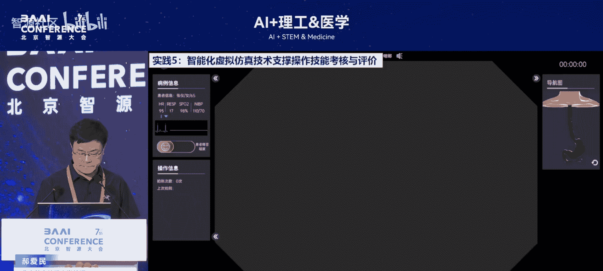

# AI+理工&医学-p03-医用数智人构建技术及应用：郝爱民

在本节课中，我们将学习医用数智人的核心概念、技术挑战以及实际应用案例。医用数智人是一个医工交叉的前沿方向，旨在通过构建可交互、可演化的虚拟人体模型，为医学教育、手术规划、技能训练与考核等提供革命性的数字化工具。

---

## 医用数智人的定义与愿景

医用数智人，是在情智兼备的通用数字人基础上，深度融合医学专业知识与业务需求的虚拟人体模型。其核心特征在于**可演化**，即不仅具备形态学上的几何外观，更拥有生理、生化功能，并能对医学干预（如手术、用药）做出智能化的动态响应。

从技术发展路径看，它经历了从**数字化人体**（数据采集）、到**几何人体**（形态建模）、再到**物理人体**（功能仿真），最终形成**智能数字人体**的演进过程。美国《科学美国人》杂志曾将“虚拟患者”列为十大新兴技术，认为其可能彻底改变医学研究和训练的模式。

## 医用数智人的核心价值与应用场景

医用数智人的核心价值在于为医学实践提供一个安全、可重复、可量化的“数字试验场”。以下是其主要应用场景：

*   **手术预演与方案规划**：医生可以在虚拟空间中对患者的个性化器官、病灶及潜在并发症进行完整的手术模拟，从而优选最佳方案，实现“手术打草稿”。
*   **医学教育与技能训练**：医学生和医生可以在虚拟患者身上进行无风险的问诊、检查、手术操作等全流程训练，并能获得即时、客观的反馈与评价。
*   **同质化技能考核与竞赛**：通过标准化的虚拟仿真系统，可以对医生的操作技能进行公平、精准的量化考核与竞赛，消除人为评价的主观差异。
*   **跨科室协同与会诊**：在虚拟信息空间中，可以融合多位专家的智慧，打破物理世界科室划分的局限，为患者提供更综合的诊断与治疗思路。
*   **人机智能知识传递**：顶尖医生的手术操作（包括力度、角度、流程等全维度数据）可以被记录并数字化，成为训练手术机器人或辅助系统的宝贵数据源。

## 构建医用数智人的关键技术挑战

构建一个真正可用的医用数智人面临着一系列复杂的技术挑战，主要可归纳为以下七个科学技术问题：

1.  **个性化精准采集**：如何无创、高效地获取患者个体在几何、物理、生理等多模态的数据。
2.  **多尺度统一建模**：如何建立从微观细胞到宏观器官，融合几何、物理、生理特性的统一数字模型。
3.  **实时交互与物理响应**：如何实现虚拟器官对手术器械操作（如切割、缝合）的实时、逼真的物理与形变反馈。
4.  **虚实融合呈现**：如何利用混合现实（MR）等技术，将虚拟患者无缝叠加到真实世界中，实现自然的人机交互。
5.  **病理生理演化**：如何模拟疾病的发生、发展过程，以及药物、手术等干预措施带来的动态变化。
6.  **操作智能评价**：如何建立客观、全面的评价体系，对医生在虚拟环境中的操作进行自动化的技能评估。
7.  **应用靶场构建**：如何针对不同的医学专科（如心内科介入、口腔外科拔牙）构建高保真的专用训练与考核环境。

## 实践案例展示

我们的实验室在医用数智人领域进行了长期探索，并开发了系列应用系统。

### 案例一：智能问诊与体格检查模拟系统
该系统模拟医生接待病人的全过程。在专业医学知识模型的支持下，系统能与用户进行多轮、专业的问答。随后，用户可通过力反馈设备，在**实时交互**的虚拟人体上进行双手触诊检查。系统能调取检查报告，辅助形成初步诊断，并最终对整个过程进行自动化评分。

```python
# 概念性代码：模拟系统交互流程
def medical_training_simulation():
    initiate_consultation()  # 启动问诊
    while not diagnosis_confirmed:
        answer = conduct_qa_round()  # 进行一轮专业问答
        update_patient_state(answer)
    perform_virtual_examination()  # 进行虚拟体格检查
    generate_preliminary_diagnosis()  # 生成初步诊断
    calculate_performance_score()  # 计算操作得分
```

### 案例二：混合现实口腔手术训练系统
医生佩戴混合现实眼镜（如Apple Vision Pro），可将一个虚拟患者（如需要拔除复杂埋伏牙的患者）实时“放置”在真实的牙科手术椅上。医生可以从任意真实视角观察虚拟患者，并使用真实的手术器械进行模拟操作。系统后台可动态调整病例难度，并全程数字化记录操作过程，用于训练、考核或新术式研究。



### 案例三：CI介入手术模拟器
这是一款用于心脏冠状动脉介入手术（PCI）的高保真模拟器。它能完整模拟从穿刺到支架放置的全套流程，并可设置各种并发症（如血管痉挛、血栓形成）来增加训练难度。该系统使用了临床真实的介入器械接口，为心内科医生提供了贴近实战的训练环境。

### 案例四：多人协同虚拟手术仿真
该系统基于空间计算技术，允许多名医生（可能身处不同地点）同时进入一个共享的虚拟手术空间。他们可以协同操作，共同完成复杂手术的规划或训练。其中一人可能作为指导教师，实时观察并指导其他“学生”的操作角度和力度。

---

## 总结与展望

本节课我们一起学习了医用数智人的核心概念、巨大应用潜力以及构建它所面临的关键技术挑战。我们看到，通过**医工深度交叉**，融合计算机领域的算力、算法与医学领域的专业知识、数据模型，构建可交互、可演化的虚拟患者，正在为医学教育、临床训练和手术创新带来变革。

未来，医用数智人的发展任重道远，需要来自计算机科学、生物医学工程、临床医学等多学科的研究者共同努力，攻克从数据采集、建模到智能评价等一系列难题，最终实现“在数字空间打造一个基准性数字人体”的远大目标，全方位支撑未来医学的发展。