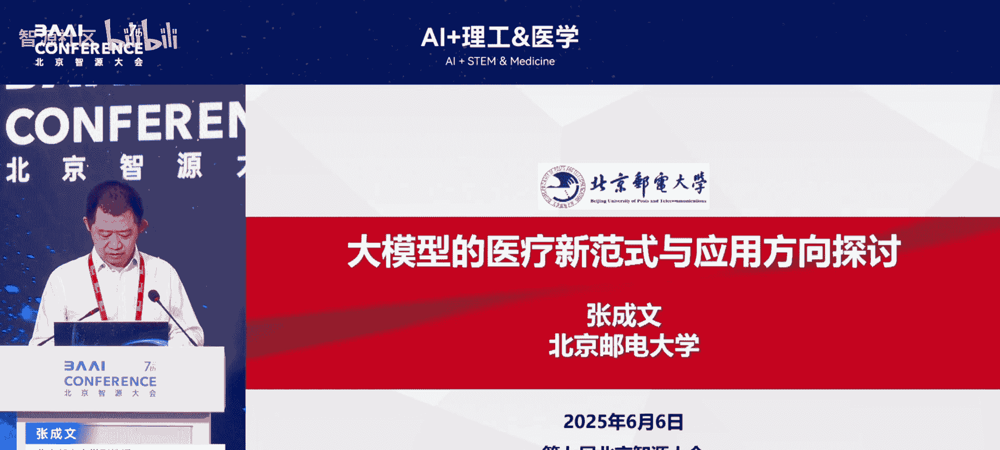
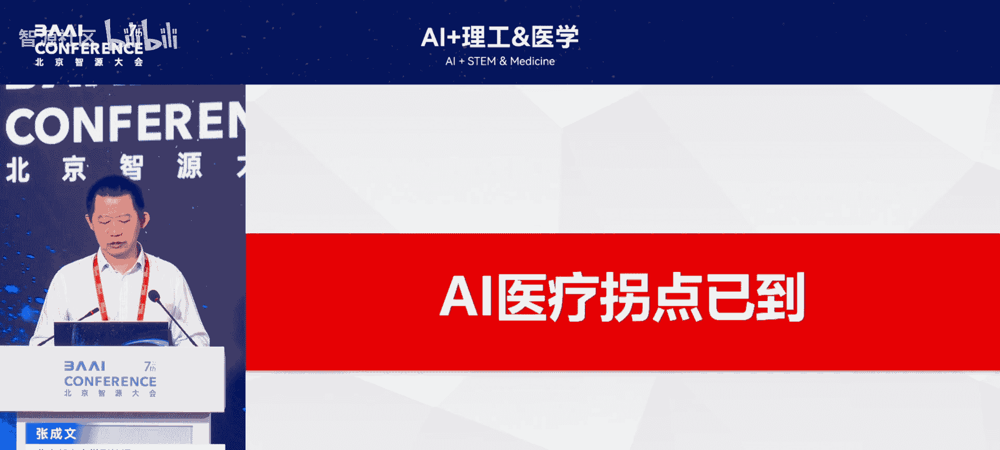
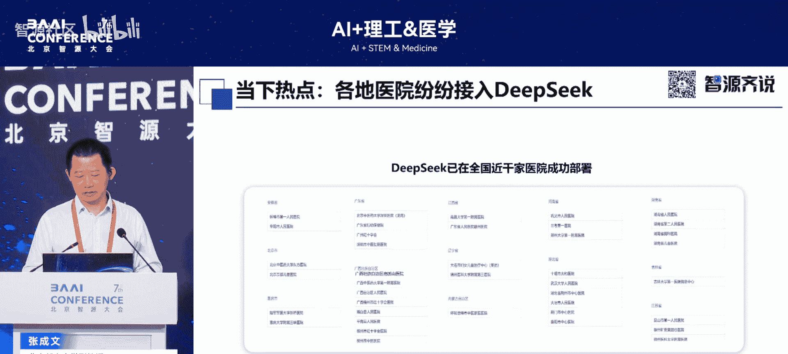
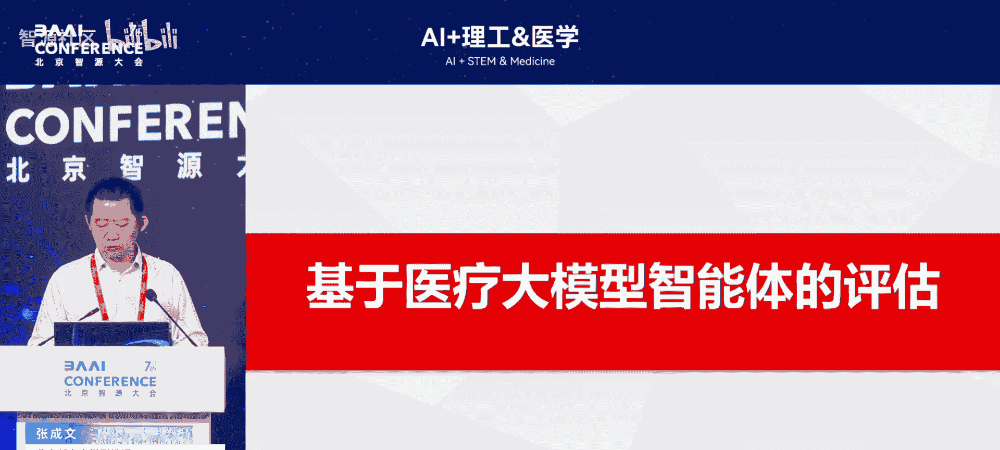
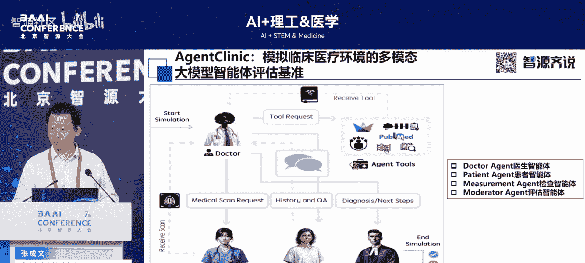
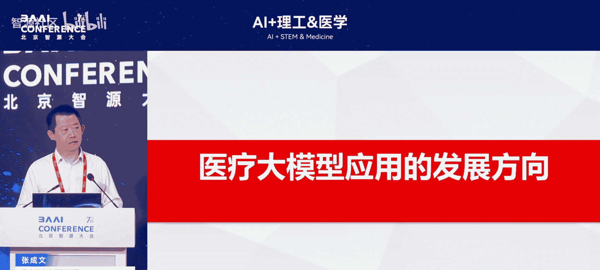
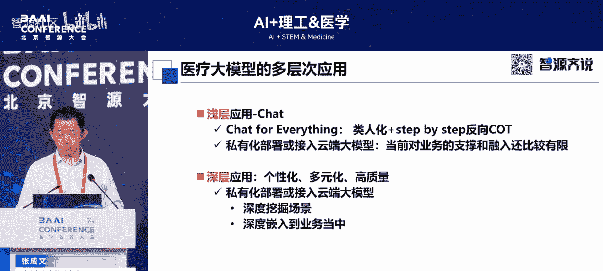
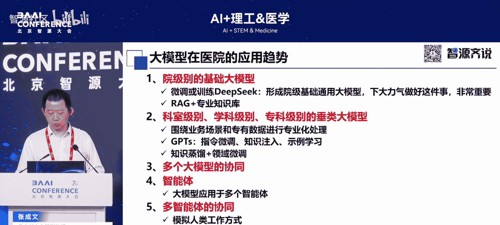
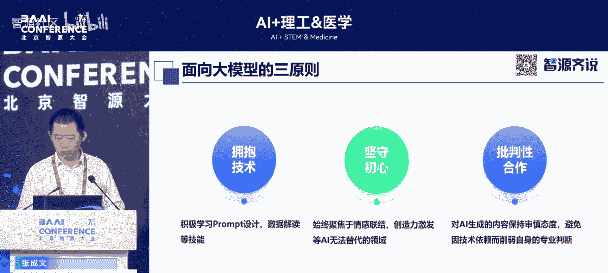
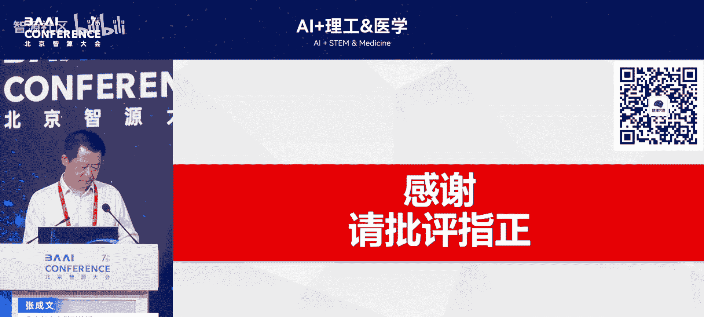

# AI+理工&医学-p04-大模型的医疗新范式与应用方向探讨：张成文

在本节课中，我们将学习大模型技术如何为医疗领域带来新的技术范式，并探讨其近期的应用方向。我们将从技术发展、应用场景、落地原则等多个维度进行解析，旨在为初学者提供一个清晰、全面的认识。

---

## 大模型与医疗结合的背景与机遇

我们说大模型从2022年11月3号发展至今，已有近两年半的时间。无论是大模型还是深度神经网络，在其发展初期，医疗领域都是其最主要的一个应用场景。

本报告主要从两个方面展开：一是随着大模型技术及其生态技术的发展，为医疗领域带来了许多新的技术范式；二是探讨近一年来，特别是自今年1月20日DeepSeek发布以来，我国医疗领域在大模型应用方面的一些方向。

此外，我们在应用大模型时，有三个重要的原则。

---

## 个人实践：从科普到产业落地

首先分享我与大模型相关的一些实践。我撰写了两本关于大模型的书籍，并成立了一个大模型专委会。

任何一项新兴技术出现时，我们主要关注其技术本身带来的冲击。但随着技术的发展，其最主要的价值在于应用。例如，蒸汽机最初在英国发明，但最终在美国的轮船、纺织和铁路领域得到广泛应用，使其成为第一次工业革命的最大赢家。大模型技术也是如此。

我们需要深入了解大模型最基本的技术路线，然后结合具体应用场景的需求，将其真正落地。

第一本书是关于大模型技术的科普读物。随着DeepSeek等火爆技术的出现，我又推出了一本面向DeepSeek具体技术的实战书籍。如果未来有新的热门技术出现，我们还会撰写相应的实战书籍。因此，第一本书类似于基础教材，而DeepSeek实战则专注于具体技术的应用。

仅仅写书可能还停留在人才教育和技术应用层面，更重要的是落地实践。今年4月15日，我们在一个可容纳500人的会议厅成立了大模型应用产业专委会。专委会的成员架构包括大模型技术公司以及众多大模型应用领域的企业，其中医疗领域的企业占很大比例。因此，我们专委会的主要目标是在医疗领域进行更多落地探索，并希望与各位专家和领导深入合作。

---

## 人工智能医疗的拐点与价值

人工智能与医疗向来是一个非常重要的话题。为什么说人工智能医疗的拐点已经到来？目前大模型在具体应用时，大部分还是一些浅层的、外挂式的应用。

然而，这些浅层和外挂式应用仍然具有重要价值。它们至少有助于培育大模型与医疗结合的理念和人才。但大模型的重点不在于浅层应用，而在于深层应用。因为大模型融合了多样性的复杂数据，在其内部打通了众多数据间的复杂逻辑，能够生成多样性、个性化、精准的内容。这才是大模型本来的画像。

随着大模型本身推理能力的提升，以及像DeepSeek这样的开源技术，还有RAG（检索增强生成）和智能体等大模型生态技术的蓬勃发展，现在正是发展大模型在医疗领域应用的绝佳时机。

今年1月，世界经济论坛有一个论述，认为人工智能医疗应该是大模型增长最快的领域，并认为这是一个拐点的到来。

---

## 大模型在医疗领域的应用方向：To C与To B

报告提到了一个“84亿人工智能医生”的概念。大模型在医疗应用方面有很多方向，例如To C（面向消费者）方面。全球有84亿人口，有了大模型，每个人都可以拥有一个随身的医疗助理。

目前大模型更多应用于疾病治疗。但我认为大模型最主要的潜力在于疾病的预测和预防。医疗的最终目标应该是“治未病”，而不是等生病了再去医院。因此，基于大模型自身的特点，它可以在预测和预防疾病方面发挥更大作用。所以说，大模型在医疗领域最主要的应用，还是在健康和保健领域。如何通过大模型让每个人提前预测自己的健康曲线，从而安排个人生活和工作，这是To C方向的核心。

另一个方向是To B（面向企业/机构）。对于医生而言，可以基于大模型做很多降本增效的工作，例如写病历、看片子等。这些目前也属于点状应用。更重要的是，我们可以通过大模型辅助诊疗、提供建议。但无论是大模型生成内容的把关，还是医疗行为的控制，决策权都应该掌握在医生手中，这是毋庸置疑的。

在To C方面，大模型可以解决大约80%-90%的常见病问题。据统计，医院大部分人流都是常见病。在这些方面，我们有大量数据，完全可以发挥大模型的作用，将医生从处理大量常见病的工作中解脱出来，去做更多高认知的工作。这是大模型出现后，对医生工作内容带来的挑战。

当然，报告中提到了To C和To B，实际上还有To H（面向医院）和To G（面向政府）。对于医院来说，正是由于大模型的出现，我们可以将医院各科室的数据，无论从语法、语义还是逻辑层面进行彻底打通，促进信息系统的融合。对于医疗监管部门（To G），大模型可以带来监管角色转变、精细化治理能力提升以及管理模式转型等全面改变。

因此，大模型出现后，我们更多地提到一个名词——“虫丛树”。无论是看病、治病还是管理，这些复杂的“虫丛树”向来都是大模型能力发挥的地方。

目前，自今年1月20日（春节后）以来，医院领域形成了一股应用热潮。现在有近1000家医院（包括三级、二级及基层医院）正在深度接入大模型。这使得医院从外部的旁观者，变成了真正的入局者，去了解大模型应如何解决业务问题。

---

## 技术范式转变：智能体与动态评估

在大模型推动医疗技术范式转变方面，除了大模型本身能力（如推理能力）的提升，使得医疗可以更多依赖它之外，像智能体技术也做了很多前瞻性和落地性的工作。

这里主要汇报两个方面：一是智能体在诊疗方面的应用（这是大家讨论较多的）；二是通过智能体，我们还可以动态评估大模型的效果，这是一个非常有创新性的事情。

首先，看一下当前基于智能体在医疗方面的一些工作。这是一篇今年的综述。其中提到了一个“大白”（Baymax）的形象，它来自动画片《超能陆战队》。这个白色的机器人代表了未来医疗机器人的一个模型。它可以看病，具备医疗能力，还能了解和输出情感，例如感知人的情绪并给予拥抱。现在我们可以通过智能体技术来模拟人类的这些能力。“大白”体现了大模型智能体技术与人性化结合的一个设备。

下图是论文中的一个框图，展示了智能体的各个方面。中间是智能体的核心模式。左上角是它的工具集，智能体可以基于逻辑判断调用一些AI 1.0时代的小模型（如分割、分类模型），或调用原有的数据库、新的知识图谱等内容。左下角显示，大模型要模拟人类治疗，更需要获取现实的医疗数据，如电子病历、影像、检验数据等。通过这些数据，才能实现个性化或精准化的输出。右边是推理部分，包括多步推理和专家协同等。

总体上，通过这样一套“组合拳”，实现了模拟医生真实工作流程的目标。并且，通过智能体中的记忆功能，可以保存医生当前的经验或错误，避免未来再出现相应问题。这就是一个智能体的框架。

下面总结了智能体的四种范式：
*   **单一智能体**：这是目前智能体应用最主要、最简单的形态。其核心流程之一是将用户提出的复杂需求分解为小任务，并序列化执行。
*   **顺序智能体**：模拟诊疗流程，例如分诊、问诊、检查（如拍片子）、诊疗、治疗，最后形成沉淀的诊疗信息（包括文本、影像等多模态数据）。
*   **协同智能体**：模拟多学科会诊（MDT）。未来会有通用智能体和更多专业智能体。对于专业领域，需要专业的逻辑和大模型来形成专业智能体，各智能体之间基于共同的医学数据协作，形成MDT效果。
*   **迭代智能体**：需要通过实践不断迭代，形成反馈。医疗记录在这方面起到非常重要的作用。无论是文本还是影像记录，对于患者不同阶段的治疗，以及整个医院学科发展来说，都是非常重要的沉淀和连接环节。

基于这四种范式，我们可以找一个应用场景，例如眼科。对于单一智能体，可以上传一个病例或OCT影像来进行特定的诊疗任务。对于顺序智能体，可以基于眼科的分诊、问诊及相应措施（判断是眼底病、全身性疾病还是视力问题）进行处理。对于专家协同，也有很多专业眼科智能体可以形成合作。眼科是大模型重要的应用领域，因为其多模态信息非常丰富，并且基于眼底可以观察全身健康状况。基于推理，对于复杂的眼科或全身性疾病，都可以做很好的落地工作。

下面汇报另一个方面：前面提到智能体基于诊疗，那么我们能否基于智能体构建一个对大模型的动态评估呢？这篇论文给出了一个场景。在论文中，有一些模拟的智能体角色，包括患者、医生、影像科医生和最终评估者。

通过这种智能体，可以实现对大模型的动态评估。因为目前更多的评估是基于静态基准的。如果把一个大模型放到一个模拟的医疗场景或流程中观察其效果，能更好地反映大模型的实际情况。

对于当前来说，智能体可以说是大模型进行落地应用的一个非常关键的技术。

---

## 大模型在医疗的应用方向与落地路径

对于大模型在医疗方面的应用方向，当前主要还是浅层应用、外挂式的。但这也有非常重要的阶段性贡献。更重要的是个性化、高质量地实现大模型与现有信息化系统的融合。最终目标是实现“大模型原生”，即基于大模型的智能来构建医疗业务。

这方面有一些思考。首先，正是由于当前DeepSeek等技术的火爆，生态发展已经从原来的由下往上（技术驱动）变成了由上往下（应用牵引）的推动。基于这种非常好的态势，构建院级基础大模型正是一个绝佳的时机。

基于院级基础大模型，我们再构建各个科室、专科的模型。这样能更好地发挥大模型的作用。因为大模型本身就是一个生态概念。无论是数据（多样的数据生态），还是模型本身（生态的模型），以及更多的生态技术（如RAG、智能体）和应用环境。对于医院来说，我们可以使用多种类型的大模型，一个智能体也可以调用多个大模型，混合使用多个智能体。

在这方面，我们可以先打造一些比较通用的应用，例如导诊、咨询或随访等各科室都会用到的智能体或模型。然后在此基础上，进行领域微调或知识蒸馏，构建专科模型。最后打造各个更专业的模型，实现深度应用。

这方面有一个“三位一体”的落地方案。首先，数据是根本。然后，挖掘场景，不同医院的场景不同。最终，每个医院、每个领域要想更好地发展，需要一个生态来支撑。这方面，我希望基于大模型应用产业专委会，与大家一同推动大模型在医院生态的建设。

---

## 应用大模型的“三三原则”

最后，提出应用大模型的“三三原则”。这不仅仅是针对医疗，而是普遍适用的。
1.  **拥抱技术**：要主动拥抱技术。问问自己：我们每天是否在用大模型？大模型在业务应用方面是否可以更深入一些？
2.  **坚守初心**：我们知道大模型不是全能的。有些事情需要我们亲自去做。因此，我们向来反对“大模型会替代医生、替代教师等岗位”的说法，这是绝对不可行的。大模型应用的最后一个环节，必须是我们人类。
3.  **批判性合作**：大模型有其能力边界。无论技术如何发展，我们都不能因为大模型的能力而放弃人类自身对能力提升的追求。

---

## 总结

本节课中，我们一起学习了以下内容：
*   大模型与医疗结合的时代背景与个人产业实践。
*   人工智能医疗拐点到来的原因及其在To C（健康管理、常见病处理）和To B（辅助诊疗、医院管理）等方向的应用价值。
*   智能体技术如何推动医疗技术范式转变，包括其在模拟诊疗流程、实现多学科协作以及动态评估大模型效果方面的作用。
*   大模型在医疗领域的应用从浅层到深层的发展路径，以及构建院级基础模型和专科模型的落地思路。
*   应用大模型时需要遵循的“三三原则”：主动拥抱、坚守初心、批判性合作。

大模型为医疗领域带来了前所未有的机遇，其核心在于与具体场景深度融合，发挥数据价值，最终服务于人类的健康福祉。