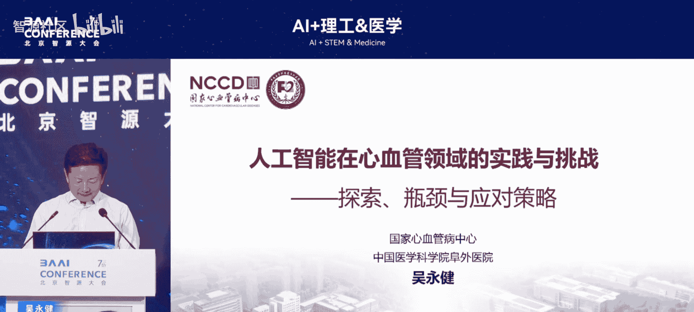
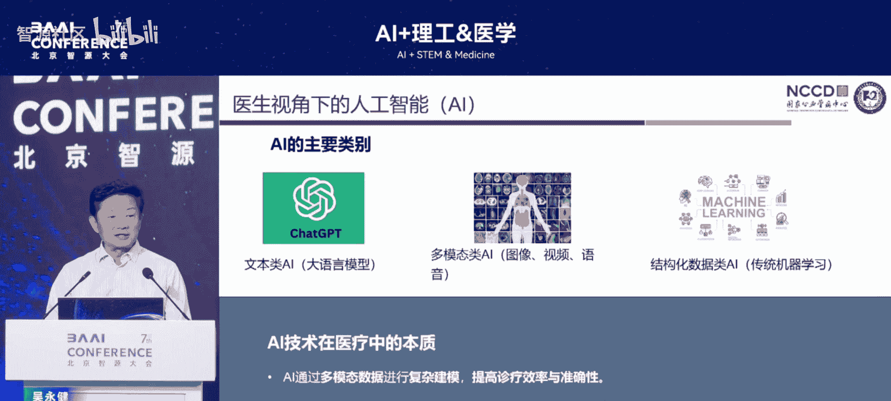
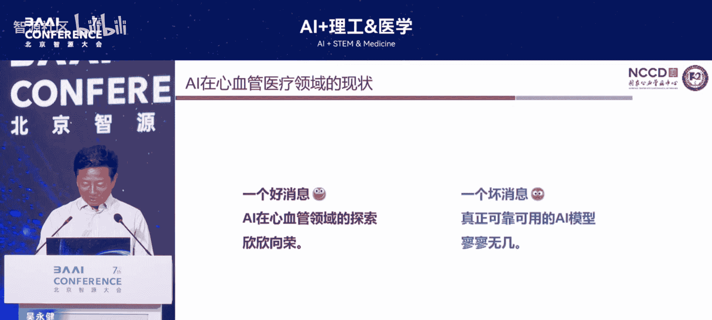
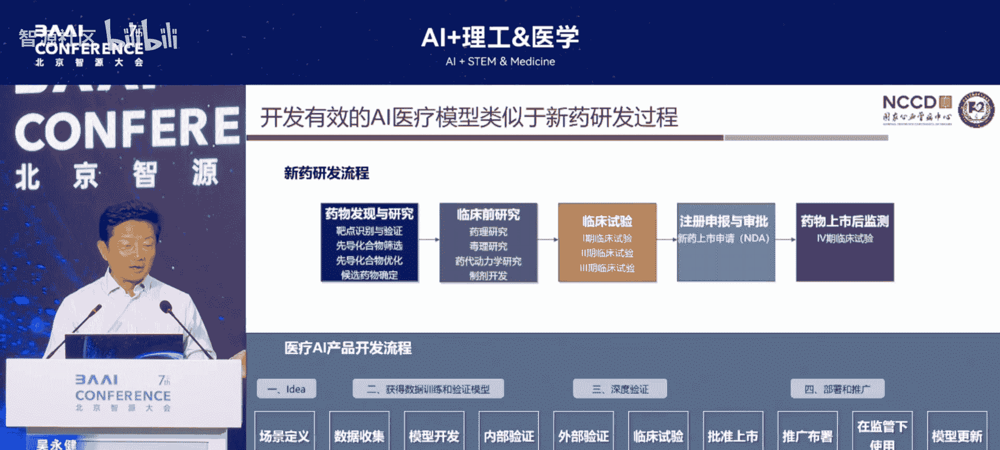
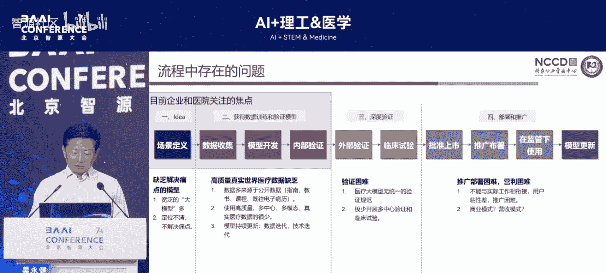
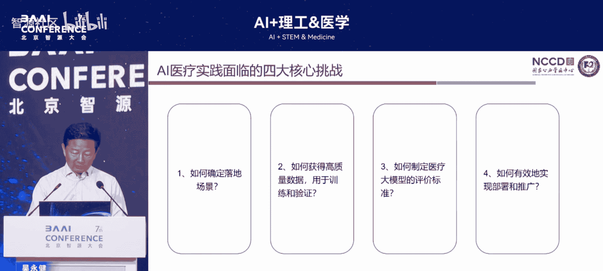
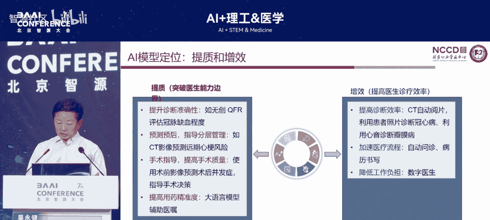
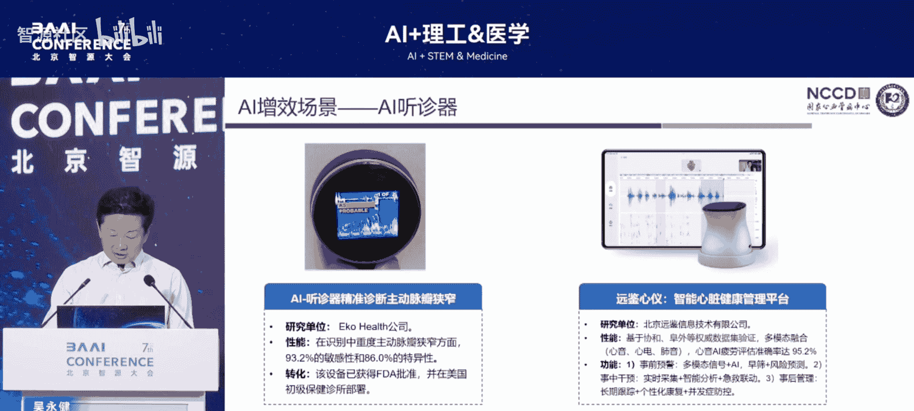
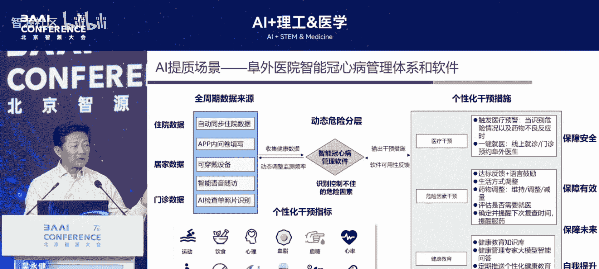

# AI+理工&医学-p06-心血管病长期管理中AI的应用及功能定位：吴永健

在本节课中，我们将从一位资深心血管病临床医生的视角出发，探讨人工智能在心血管病长期管理中的应用现状、功能定位以及未来展望。我们将了解医生如何看待AI，AI在医疗中的实际作用与挑战，以及一些具体的实践案例。

感谢大会的邀请。今天我与团队一同来学习。当前时代，每个行业都在拥抱人工智能。如果不参与其中，就会落后。我与建平院长、朱天刚教授都是资深医生。刘华医生则相对年轻。今天在座的各位可能来自理工科或医疗领域。我作为这个领域的一名初学者，分享近几年的感受。

## 医生如何看待人工智能

上一节我们提到了时代背景，本节中我们来看看医生群体如何具体看待人工智能技术。医生不能仅停留在观察层面，必须亲自实践，才有持续的动力。

以下是当前医疗系统中人工智能的几个主要方向：

1.  **大语言模型**：每个人都希望利用语言模型解决医疗问题。中国人可能更青睐人工智能，某种程度上将其视为一种“高级算命”工具，用于解答不确定的问题。例如，人们希望AI能像预报天气一样，预测个人未来的患病风险，以便提前准备。这是大语言模型吸引人的地方之一。
2.  **为医生减负**：AI的目标是减轻医生负担，而非让医生变得懒惰或不再思考。例如，学习解读心电图、听诊心音、分析超声图像都需要多年训练。现在，人工智能可以辅助完成这些工作。但这也引出一个问题：未来人工智能是否会让医生变得不再需要专业判断？
3.  **传统机器学习**：我们需要建立自己的多种预测或诊断模型。

以上是我作为一名医生对人工智能的初步理解。今天的学习可能会改变这些认知。

## 人工智能在医疗中的热闹与挑战

上一节我们介绍了医生对AI的几种看法，本节中我们来看看AI在医疗领域发展的现实情况。

在人工智能领域，学习与应用非常活跃。然而，当我们审视过去几年开发的各种模型时，会发现没有一个模型能让人完全放心地依靠它来看病。这是不可能的。因此，我们不能完全依赖这些大模型。我们需要为这些模型进行功能定位，思考医生和病人未来应如何使用它们。这是当前必须考虑的问题。

## 医疗模型的“上市”与规范

上一节我们讨论了AI模型的实际可靠性问题，本节中我们来探讨其作为医疗工具应遵循的规范。

过去，医生主要依靠医疗器械和药品来治病。没有这些，医生只能诊断，难以治疗。如今，除了药品和器械，出现了“第三方”——医疗AI模型。医生需要像学习新药一样，学习每一个新模型的作用、副作用和适用场景。

但是，一个新药的研发需要遵循严格的流程：从药物发现、动物实验、临床前研究到临床试验，最终获得国家审批。那么，一个医疗AI模型是否也需要经过类似审批才能“上市”？因为医疗行为需要负责，不能像算命一样随意。对于医生而言，模型必须走类似的合规流程，获得国家认可，证明其具备专科医生的诊断水平，才能用于临床。否则，如果没有获得三类医疗器械证，它就无法上市，其商业模式和可持续性也将成为问题。

因此，未来AI在医疗中的应用必须遵循医疗行业的客观规律。

## 人工智能在心血管领域的功能定位与实践

上一节我们探讨了医疗AI的规范问题，本节中我们具体看看AI在心血管领域可以发挥哪些作用。

我认为AI的功能定位主要体现在“提质”和“增效”两个方面。

*   **提质**：例如，利用计算生理学（如FFRct）评估冠状动脉病变是否具有临床意义，辅助诊断分型，以及评估手术质量。
*   **增效**：例如，在影像判读方面，AI可能比某些资深医生看得更准，并能自动生成报告。

以下是我们在心血管领域的一些具体实践案例：

1.  **专科大模型**：近期出现了专注于心血管领域的“关心”大模型等。这些模型基于指南、共识、教程和过往病例训练而成，目前相当于医学本科生的水平。它们缺乏互动性。通过持续的前瞻性学习和互动训练，未来有望达到住院医师或主治医师的水平。为每位医生配备这样一个AI助手，是我们当前的目标。
2.  **人脸识别辅助诊断冠心病**：与清华大学合作，在患者进行冠状动脉造影前，通过正面和侧面两个摄像头进行面部识别，辅助预测冠心病。目前敏感性尚可，但需考虑患者术前紧张情绪对表情的影响。
3.  **智能听诊器**：听诊是一项需要终身学习的技能。我们开发了智能听诊器，旨在从人群中筛查出心脏异常者，类似于在人群中识别目标。此外，还有与协和医院合作开发的小型设备，可无听诊式检测主动脉瓣狭窄或关闭不全，该产品已商业化。
4.  **心电图诊断瓣膜病**：通常瓣膜病依赖超声诊断。我们尝试通过心电图来辅助判断，类似于“高级算命”，目前该工作仍在验证中。
5.  **冠脉介入手术辅助系统**：与航空航天大学合作，希望将AI系统整合进手术室，实时提示病变情况、手术策略及预后，目前处于验证阶段。
6.  **瓣膜手术术前模拟**：在柳叶刀子刊上发表的研究，通过术前模拟瓣膜植入的位置和型号，来指导复杂的经导管主动脉瓣置换术（TAVR）手术。
7.  **冠状动脉风险分层**：我们希望利用AI对患者进行未来的风险分层。例如，预测冠心病患者植入支架出院后，再发事件的风险和时间。我院第一阶段工作已完成，结果即将发表。

## 高质量医疗AI面临的挑战与未来方向

上一节我们列举了多项实践，本节中我们来看看要做出高质量的医疗AI所必须克服的核心挑战。

1.  **数据质量与来源**：这是所有大模型面临的最大问题——局限性与风险。我们需要真实、高质量的数据，而这往往需要巨大投入。例如，要构建一个高质量的冠心病对话模型，需要将医患对话自动转写为文本并进行标注，成本高昂。中国要做出真正高质量的医疗大模型，需要巨大的资金和人力投入。
2.  **建设国家级专病数据库**：科研中数据收集困难，患者配合度可能只有30%。作为国家心脏中心冠心病中心主任，我认为必须建立中国的冠心病专病数据库。我们已获得多项资金支持，正在推进“隔壁导管室”项目，实现全国导管室互联互通，自动采集手术中的图像、语音并生成结构化数据。
3.  **安全性问题**：医疗AI涉及大量患者隐私和安全问题，需要逐一解决。
4.  **应用场景展望**：我设想了一个未来场景——“数字专家”。这不是我个人，而是被AI赋能的“数字吴永健”。它整合了多学科（心内、内分泌、呼吸等）知识，连接患者的可穿戴设备，管理其历史健康档案，与患者互动，实现主动健康管理和自我管理。目标是提升患者心脏健康指数，减少80%的非必要就诊。最终，医生只需处理最复杂的20%病例，从而大幅提高效率。这是我们希望实现的目标，并且未来会为此类AI系统申请三类医疗器械证。

## 总结

本节课中，我们一起学习了临床医生对人工智能在心血管病管理中的应用视角。我们探讨了AI在提质增效方面的潜力，也直面了其在数据质量、规范审批和实际可靠性方面的挑战。通过人脸识别、智能听诊、手术辅助、风险分层等多个具体案例，我们看到了AI落地的多种可能性。最终，我们展望了AI赋能下的“数字专家”场景，这代表了心血管病长期管理的一个未来方向——更高效、更个性化、更以患者为中心的主动健康管理模式。实现这一愿景，需要医学与人工智能领域的深度融合与持续探索。