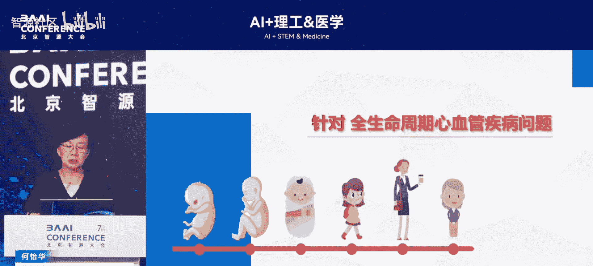
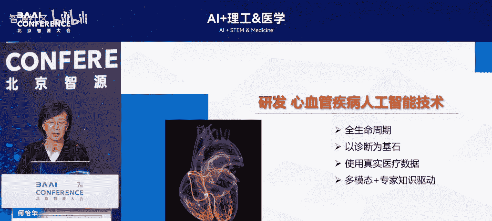

# AI+理工&医学-p07-基于大模型的心血管专业模型及下游产品研发：何怡华

在本节课中，我们将学习如何研发一个覆盖全生命周期的心血管疾病超声诊断大语言模型。我们将从行业现状与挑战出发，逐步了解模型构建的数据基础、技术架构、训练方法，并最终看到其产品形态与应用场景。

## 概述：心血管疾病的挑战与AI机遇

心血管疾病与妇产新生儿疾病的负担位居全球首位，且发病率逐年上升。心血管疾病导致的死亡给人类带来了严重压力。最新数据显示，中国70%的心血管疾病事件发生在院前。因此，我们需要明确现状，并思考如何借助科技革命浪潮，应用人工智能技术来解决医疗问题。

## 行业现状与核心问题

上一节我们概述了心血管疾病的严峻形势，本节中我们来看看当前医疗实践，特别是超声诊断领域面临的具体挑战。

通过对现状的梳理，我们归纳出以下几个核心问题：

*   **诊断不精准与延迟**：现有诊断流程存在准确性和时效性问题。
*   **治疗方案规划个体化不足**：对于特定疾病（如瓣膜介入治疗），缺乏个性化的手术方案规划支持。
*   **院前快速识别困难**：疾病在院前阶段无法被快速识别和判断。
*   **国民不良生活习惯**：普遍存在的不良生活习惯加剧了疾病负担。

这些问题共同导致了心血管疾病死亡率与发病率居高不下。当前，针对关键防治节点的人工智能产品研发，以及利用大语言模型整合各类小模型于整个医疗流程中，被认为能发挥重要作用。

## 聚焦超声诊断：从单点技术到体系化突破

在了解了普遍性挑战后，我们将目光聚焦到心血管超声诊断这一具体领域。当前，顶尖学术期刊中关于超声人工智能的研发，大多仍局限于单技术、单点的突破。

例如，对心脏功能心内膜的自动描记与测量，在整个心脏超声诊断决策涉及的数十甚至上百个参数与技术点中，仅占其一。因此，我们的核心问题转变为：如何应用人工智能技术及大语言模型，来解决超声诊疗整个体系中的工作？

## 医疗大语言模型的应用现状与未来

刚才我们聚焦于心脏超声的研究现状，现在将视角扩大到整个医疗领域的大语言模型应用。

根据《美国医学会杂志》（*JAMA*）的相关评测研究，基于真实临床数据构建的大语言模型目前仍然非常少。多数模型是基于指南、文献等进行建模。这些模型的应用集中在医疗服务领域较多，在医疗管理领域则相对较少。此外，针对整个医疗流程的评价体系尚不健全。

未来的发展方向十分明确。大语言模型已在临床决策支持、报告生成、医学教育、辅助机器人、药物研发等多个领域开始应用。未来，无论是在“诊”还是“疗”的环节，大模型在提质增效方面都有巨大的发展空间，例如提供个性化治疗建议、管理患者护理质量等，潜力巨大。

## 安贞医院的实践：全生命周期心血管诊断大模型

接下来，我们看看北京安贞医院团队在此方向上的具体实践。该团队最大的特点是覆盖了从胎儿到成人的全生命周期心血管疾病，包括胎儿期百余种、成人期上百种疾病。

团队以诊断为基石，第一步工作是使用**真实数据**，并结合**多模态信息**与**专家知识库**驱动，来构建心血管诊断大模型。

其技术演进路径规划如下：
1.  **通用大语言模型基座**：学习可公开获取的数据。
2.  **医疗垂域大模型**：在通用基座上融入医疗专业知识。
3.  **心血管专病大模型**：进一步聚焦于心血管疾病领域。
4.  **心脏超声大模型**：当前实现的第一代细分模型。
5.  **未来方向**：融合CT、核磁等多模态影像的多模态大模型及下游产品。

第一代产品形态是**智能超声报告生成系统**。该系统通过融合疾病影像、语义（文本）和语音等多模态信息，构建心血管诊断大模型。

## 模型构建：数据、训练与知识体系

我们已经了解了项目的目标和产品形态，本节将深入探讨模型是如何构建起来的。这需要坚实的数据基础、科学的训练方法和丰富的知识体系。

### 数据基础

模型使用了**300万例**真实世界数据，其中包括：
*   **疾病谱系广泛**：涵盖108种胎儿先天性心脏病和160种成人心脏病。
*   **多模态数据**：包括超声影像、结构参数、电子病历等。
*   **深度标注数据**：例如，10万例胎儿心脏病病例，每例均包含300多项母体风险因素及2000个遗传位点信息。
*   **自主研发标注系统**：针对胎儿心脏病、瓣膜病、危重冠心病等不同疾病体系开发。

数据标注流程包含初标团队、外包团队和审核专家团队，确保质量控制。并非所有300万数据都用于影像模型训练，系统首先基于300万份报告数据和数十万影像数据，构建了多模态融合的智能报告系统。

### 训练方法

模型训练主要分为以下几个步骤：
1.  **基座模型训练**：在通用大语言模型基座上进行训练。
2.  **强化学习与精标微调**：使用高质量标注数据进行强化学习和精细微调。

### 专家知识体系构建

这是模型实现准确诊断推理的核心。团队为50多种常见疾病构建了**专家知识决策树**。决策树定义了当模型识别到特定指征时，应进一步检查什么、后续步骤如何。这相当于为模型注入了专家的诊断逻辑。

知识来源有三个维度：
1.  **专家知识体系**：结构化的临床决策路径。
2.  **文献学习**：从海量医学文献中汲取最新知识。
3.  **真实数据**：从300万真实病例中学习模式。

整个模型训练框架基于：**大模型基座 + 心血管专家知识体系 + 核心技术**。核心技术包括医学知识检索增强、大模型的复杂诊疗推理、个性化交互问诊以及语音识别与多模态技术。

## 产品实现与应用场景

经过上述构建过程，模型最终实现了怎样的产品功能？又将在何处发挥作用呢？

### 产品功能与形态

第一代智能超声报告系统实现了以下功能：
1.  **影像自动识别**：在操作过程中自动识别超声切面。
2.  **参数自动测量**：对识别出的切面进行自动化结构测量。
3.  **特征描述与推理**：根据预设的提示词（如“二尖瓣有无钙化”、“运动幅度如何”），引导医生描述影像特征，最终自动推理生成诊断结果和结构化报告。

目前，该模型对近300种心血管疾病的平均诊断准确率达到**90%**。对于一些罕见病（如数据量较少的肥厚型心肌病），诊断准确率较低，需要通过投入更多数据强化训练来提升。

### 应用场景与部署

产品设计应用于以下场景：
*   **医院内部署**：目前已在安贞医院内网，与PACS（影像归档系统）和HIS（医院信息系统）集成部署。
*   **赋能现有设备**：大模型可嵌入已获二类医疗器械认证的先天性心脏病小模型产品中，在诊室内实现影像自动抓取，并结合语音交互。
*   **胎儿心脏病决策支持**：不仅诊断疾病，还能对先天性心脏病（如法洛四联症）进行分层诊断，提供预后评估和专家决策建议，这对产科和出生缺陷防控系统至关重要。

关于部署方式，考虑到算力成本、数据安全及不同地区的公平性，完全远程调用大模型的方案尚未实施。团队希望依托国家人工智能基地，先在北京全覆盖，再于全国试点单位部署试用，在过程中持续优化迭代。

## 总结

本节课中，我们一起学习了基于大语言模型研发全生命周期心血管超声诊断模型的完整过程。我们从心血管疾病诊断的现状与挑战出发，探讨了将AI技术体系化应用于超声诊疗的必然性。通过了解安贞医院的具体实践，我们看到了如何利用海量、多模态的真实数据，结合专家知识体系，训练出能够实现自动识别、测量、描述和推理的诊断大模型。该模型以智能报告系统为产品形态，旨在集成到医院工作流中，最终目标是为超声诊断带来数字化、智能化与人机交互的变革，从而为降低心血管疾病负担贡献力量。