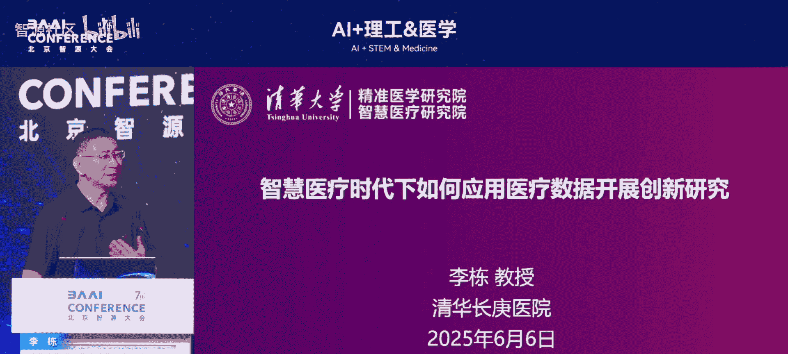
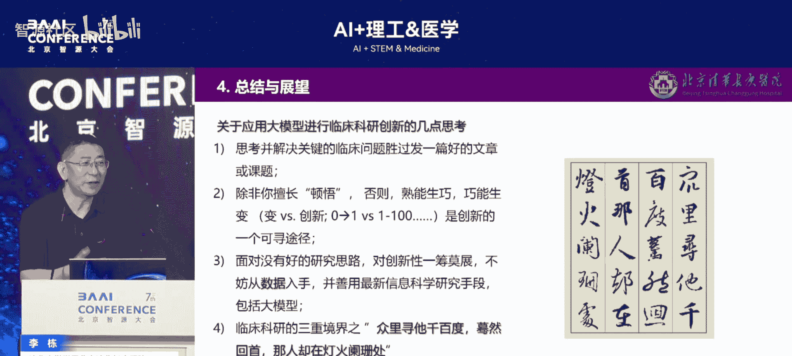

# AI+理工&医学-p08-演讲主题：李栋



在本节课中，我们将学习李栋博士关于医疗领域大模型应用的深度分享。课程将从数据角度切入，分析大模型（如DeepSeek）在医疗场景下的可行部署模式、面临的挑战与机遇，并探讨如何利用大模型驱动智慧医疗创新。

---

## 大模型在医疗场景的部署模式

上一节我们介绍了课程概述，本节中我们来看看大模型在医疗领域的具体部署方式。李栋博士指出，DeepSeek等大模型在医疗场景的应用不应简单照搬通用模式。

以下是三种主要的使用方式：

1.  **个人移动端使用**：公众最熟悉的模式，通过手机APP等进行轻量级交互。此模式无法满足医疗场景的严肃性、连续性和数据安全要求。
2.  **云端API接入**：常见于新闻报道中“某医院接入某大模型”。此模式因服务器不在医院内部，违反国内“数据不得离院”的规定。同时，模型无法利用医院真实数据持续训练和成长，完全依赖厂商更新，价值有限。
3.  **本地化部署模式**：这是目前最可行的医疗应用路径。其完整要求包含三个核心要素：
    *   **本地部署**：将模型服务器部署在医院内部网络环境中。
    *   **定制开发**：根据医院专科需求进行针对性优化和训练。
    *   **断网使用**：确保模型在推理时与互联网隔离，防止外部数据污染内部医疗数据。

**核心公式**：`可行医疗大模型 = 本地部署 + 定制开发 + 断网使用`

采用第三种模式的主要原因有二：一是满足数据不出院的监管与安全要求；二是避免“数据污染”。大模型强大的生成能力可能将外部信息（包括幻觉或错误内容）与内部真实患者数据混淆，且一旦混合便难以分离。

---

## 大模型的成本、架构与局限性

明确了部署模式后，我们需要深入了解大模型本身的特点。公众常认为DeepSeek等开源模型是“免费”的，但这在医疗领域是一个误解。

**成本分析**：根据长庚医院的测算，基于医院专科数据进行一次模型训练，成本约为**120万元**。模型提供商对个人用户免费，是因为其数据价值尚未达到收费门槛。医疗级应用涉及高质量、高敏感度的专有数据，训练成本高昂。

**MOE架构的优势与局限**：DeepSeek之所以能实现“低价优质”，关键在于采用了**混合专家模式**。该模式在每次处理任务时，并非激活全部神经网络参数，而是动态选择一部分“专家”子网络进行计算，从而大幅提升效率、降低算力消耗。

然而，MOE架构在医疗场景下也暴露出一些需要注意的局限性：

*   **多专家会诊模拟困难**：模型在处理需要多维度、多知识域协同判断的复杂会诊场景时，能力可能不足。
*   **随机释放数据**：为保持算力效率，模型可能会随机丢弃部分中间信息。这在医疗场景中是不可接受的，因为患者从入院到离院的所有诊疗记录都需要完整、连续地保存，任何关键信息的丢失都可能影响最终诊断。

**行业影响**：DeepSeek的开源与高效架构降低了对高端英伟达GPU的依赖，对传统算力格局产生了冲击。但其在医疗领域的应用仍需谨慎评估其架构特点。

---

## 大模型对医疗生态的重塑与挑战

引入大模型不仅仅是技术升级，更是对现有医疗生态的一次重塑。本节我们来分析其带来的深远影响。

**加剧资源集中，而非平衡**：最初人们期望AI能改善医疗资源分布不均的问题。但实践发现，大模型可能产生相反效果。顶级医院的优势将不再仅限于名医、设备和硬件，还需新增三大要素：
1.  **强大的专用算力**
2.  **一流的数据治理工程师团队**
3.  **一流的算法工程师团队**

这“六要素”门槛极高，可能导致医疗资源（包括专家、数据、模型能力）进一步向头部医院集中，引发“重新洗牌”。

**投入巨大，难以共享**：训练一个有效的医疗大模型是长达数年、耗资千万的持续工程。任何医院在投入如此巨大的成本后，都难以将成果免费共享，这从经济逻辑上制约了普惠性。

**对各方提出新要求**：
*   **医生**：需具备一定的算法理解能力，以解读模型输出并识别其“幻觉”。
*   **算法团队**：需解决模型“黑箱”问题，区分其输出是“新知识”还是“幻觉”。
*   **医院**：需建设强大的数据中心，并承受巨大的电力与运维压力。

---

## 医疗大模型训练的数据治理框架

数据是医疗大模型的基石。本节我们探讨如何为模型训练准备高质量的数据。

**数据质量要求极高**：大模型训练对数据质量的要求**远高于**普通的临床科研。单纯将原始数据“倾倒”给模型进行无监督学习，效率低下且不可控。高效训练需要融入**医生的决策逻辑**进行引导。

**结构化数据治理路径**：根据探索，医院需建立分层的数据治理体系，才能有效支撑大模型训练。推荐路径如下：

```
通用临床数据仓库 -> 专科特色数据库 -> 专病研究数据库 -> 专项技术/算法数据库
```

这个金字塔结构确保了数据从广泛到精细的逐层提炼，为模型提供高质量、有针对性的“养料”。

**医疗AI四要素**：传统AI强调算法、算力、数据三要素。在医疗领域，必须加入第四要素——**应用场景**。四者的重要性占比可粗略估计为：
*   **算法**：10%（大量开源，国内外差距不大）
*   **算力**：30%
*   **数据**：40%（占比最大，是核心资产）
*   **应用场景**：20%（将临床需求转化为技术问题的关键）

中国医疗数据的独特价值在于，由于历史原因，大量高质量的临床数据尚未被全球大模型充分吸收利用，这构成了我国发展医疗AI的独特优势。

---

## 从相关性到因果性：算法驱动的医疗研究范式转变

有了高质量数据和模型，我们如何利用它进行医学研究？本节将探讨研究范式的根本性转变。

**传统统计方法的局限**：传统的临床研究多基于回归分析等统计方法，寻找变量间的**相关性**。但医学更追求**因果性**。传统方法存在明显瓶颈：
1.  只能分析预先假设并放入模型的因素，难以发现未知的新危险因素。
2.  难以处理多变量（如上百个特征）间的复杂交互作用。
3.  无法直接处理影像、文本等非结构化数据。

**算法模型的优势**：AI算法能够处理海量高维数据，自动学习复杂特征与交互。更重要的是，当模型在千万次、上亿次的推演中，某些特征反复、稳定地出现在决策关键路径上时，这可以被视为一种**强关联或弱因果信号**，为发现新的疾病机制提供了可能。

**研究实例——心血管领域**：
1.  **单导联心电预测**：借鉴苹果手表的研究思路，团队利用普通运动手环的PPG信号，通过算法转换（如类似K线图的形态分析），成功预测心律失常，准确率达99.67%。
2.  **心脏整体功能评估**：整合心脏的电、机械、结构等多维度信息，构建整体评估算法，实现了对心律失常的长期风险预测（最长可达15年）。
3.  **疾病网络分析**：以糖尿病为例，通过算法构建全身并发症网络图。研究发现，“早发性糖尿病”患者的并发症网络比晚发病者更密集、系统间交互更复杂，颠覆了“早发病情更轻”的直观假设，揭示了疾病更积极的进展模式。

---

## 总结与展望

本节课中，我们一起学习了从数据视角审视医疗大模型的核心要点。



**核心总结**：
1.  **部署模式**：医疗大模型必须遵循`本地部署 + 定制开发 + 断网使用`的铁律，以确保安全、合规与可持续进化。
2.  **生态影响**：大模型会抬高医疗AI的门槛，可能加剧资源集中，其部署是长期、高投入的系统工程。
3.  **数据基石**：高质量数据是成功的关键，需要建立`通用库->专科库->专病库->专项库`的治理体系，并高度重视数据与临床场景的结合。
4.  **研究范式**：大模型推动医学研究从寻找“相关性”向探索“因果性”转变，算法能处理更复杂的数据交互，揭示新的疾病规律。
5.  **中国机遇**：未被全球化模型充分挖掘的中国医疗数据，是我国在该领域实现跨越发展的重要战略资产。

最后，正如李国杰院士所言：“错过时代的转变，将遭受历史性的降维打击。” 医疗与AI的融合已势不可挡。希望本课程能为大家提供启示，共同致力于将AI技术扎实地融入医疗实践，最终造福于患者与社会。