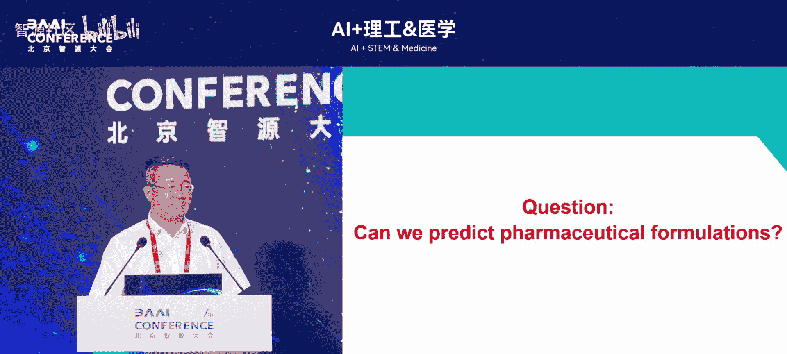
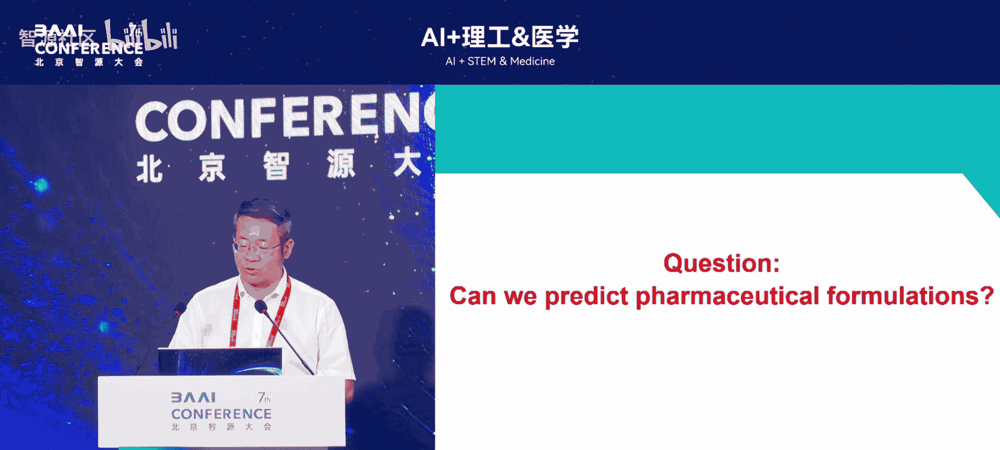

# AI+理工&医学-p09-人工智能在药物递送中的机遇与挑战：欧阳德方

## 概述

在本节课中，我们将学习人工智能在药物递送领域中的应用、机遇与挑战。我们将回顾药物递送的发展历史，介绍计算药学的三种核心方法，并通过具体案例展示这些方法如何加速新药研发。

## 药物递送的历史与挑战

药物研发包含两个主要环节。第一个环节是设计新的药物分子。第二个环节是将药物分子制成适合患者使用的剂型，例如药片或胶囊。目前，第二个环节主要依赖实验试错法，效率较低。

人类至今批准上市的药物种类有限。根据FDA数据，已上市的小分子药物约2000种，大分子生物药物约605种，涉及辅料500多种。复杂制剂（如长效缓释制剂、纳米药物）的临床成功率甚至低于新分子实体药物的10%。

制剂研发困难的原因在于其本质是一个高维空间中的多目标优化问题。一个药物配方的筛选空间可能高达 **10^25 到 10^34**。通过有限的实验次数（如几十到几百次）在这个巨大空间中寻找最优解，如同大海捞针。

因此，我们提出发展计算方法来辅助药物制剂配方的设计。

## 计算药学的三种方法

上一节我们介绍了药物递送面临的挑战，本节中我们来看看解决这些挑战的计算方法。我们主要发展了三种工具：人工智能、分子模拟和基于生理的药代动力学建模。

### 人工智能方法

人工智能革命始于2012年，得益于算法、大数据和算力的进步。然而，AI在药物制剂领域的应用长期面临数据短缺的难题，因为制药公司的配方数据通常不公开。

要构建一个有效的制剂AI模型，需要满足几个条件：至少500个以上的数据点、涵盖10种以上的药物和辅料，并进行合适的算法选择和特征工程。

我们早期的一个成功案例是预测制剂配方的稳定性。传统方法需要两年实验才能确定稳定性，而我们的AI模型只需几分钟即可预测，极大提升了效率。该模型于2019年发表在领域顶刊，并推动了整个领域的爆发式增长。

我们构建了全球首个药物制剂人工智能平台。用户只需输入药物结构的基本信息，平台即可在短时间内预测出制剂配方的关键质量参数。该平台已拥有全球数百名注册用户和数万次使用记录。

### 分子模拟方法

AI模型预测性能好，但可解释性不足。因此，我们发展了第二种工具：分子模拟。这是一种物理建模方法，传统上用于药物设计（如锁钥模型），但制剂模型更为复杂。

例如，在固体分散体或纳米脂质体中，需要模拟药物与多种辅料间的复杂相互作用。现有的分子模拟软件多针对药物设计，对制剂科学家门槛较高。

为此，我们开发了名为 **MechDose** 的新平台。制剂科学家只需通过简单点击选择药物和辅料，即可轻松进行模拟，降低了使用门槛。

### 基于生理的药代动力学建模

第三种工具是体内的生理药代动力学建模。PPK模型将人体每个器官构建为一个微分方程，并嵌入生理参数，组合成复杂的数学模型。

这种模型的优势在于能打通临床前动物实验数据与人体数据。目前，FDA大力倡导这种模型引导的新药研发。

现有的PPK商业软件价格昂贵，且对复杂制剂的支持不足。我们基于AI技术，从头构建了自己的PPK模型，用于更好地预测药物在体内的行为，辅助新药研发。

## 应用案例

前面我们介绍了三种核心计算方法，本节中我们通过两个具体案例来看看它们如何在实际新药研发中发挥作用。

### 案例一：改善水难溶性药物

目前上市的小分子药物中，超过40%是水难溶性的，在研管线中这一比例超过70%。改善其溶解度有超过10种不同策略，传统实验方法需逐一尝试，效率低下。

我们开发了 **处方决策树算法**。用户输入药物结构，算法即可推荐最有效的策略，并针对具体剂型进行预测，大幅提高效率。

以中药单体成分 **淫羊藿苷** 为例，其水溶性极差，体内吸收率不足3%。我们使用计算方法进行大规模快速筛选，迅速找到 **γ-环糊精** 作为最佳增溶辅料。

实验验证表明，新配方的溶解度比市售产品提高数十倍，细胞和动物实验效果也提升一倍以上。该配方简单，适合工业化生产。此方法在姜黄素、人参皂苷Rg3等多个药物上均取得良好效果。

### 案例二：设计新型mRNA递送纳米颗粒

mRNA疫苗的关键技术之一是脂质纳米颗粒递送系统。现有系统在递送效率、专利和副作用方面仍有改进空间。

我们构建了首个mRNA脂质纳米颗粒的AI模型，并建立了包含2000万个分子的虚拟筛选库。通过设定两个关键指标，我们进行了两轮虚拟筛选。

以下是筛选流程的核心步骤：
1.  第一轮筛选出3个分子进行实验测试。
2.  第二轮筛选出6个分子进行实验测试。
3.  将实验结果与已上市产品对比。

第一轮效果不理想，但第二轮筛选出的分子中，多个效果优于市售产品，其中一个分子与效果最好的MC3脂质效果相当。我们仅筛选了9个分子就获得了多个阳性结果，筛选效率较高。

此外，我们还利用分子模拟研究了复杂制剂中各成分的结合方式，并构建了PPK模型来预测其体内行为。

## 总结与展望

本节课中，我们一起学习了人工智能在药物递送中的应用。我们认识到，对于人体这样的复杂系统，单一计算方法无法解决所有问题。

必须综合多尺度模拟：
*   **量子力学** 模拟
*   **分子动力学** 模拟
*   过程模拟与数学建模
*   人体 **PPK** 建模
*   最终用 **数据驱动的AI** 方法整合

才能实现计算驱动的药物配方设计。

监管层面也在快速跟进。美国FDA已建成数字化评审平台，将评审效率提升数百倍，并发布了多项AI在药物研发和生产中的指导原则。我国药监局也已开始发布相关指导原则。

计算药学的概念已进入国内外药理学本科教材。尽管该领域在数据、算法和人才培养方面仍面临挑战，但它也充满了机遇，欢迎更多感兴趣的研究者加入。

---
**核心公式与概念回顾**：
*   制剂筛选空间：**10^25 到 10^34**
*   关键方法：**AI模型**、**分子模拟**、**PPK建模**
*   虚拟筛选库规模：**2000万** 个分子