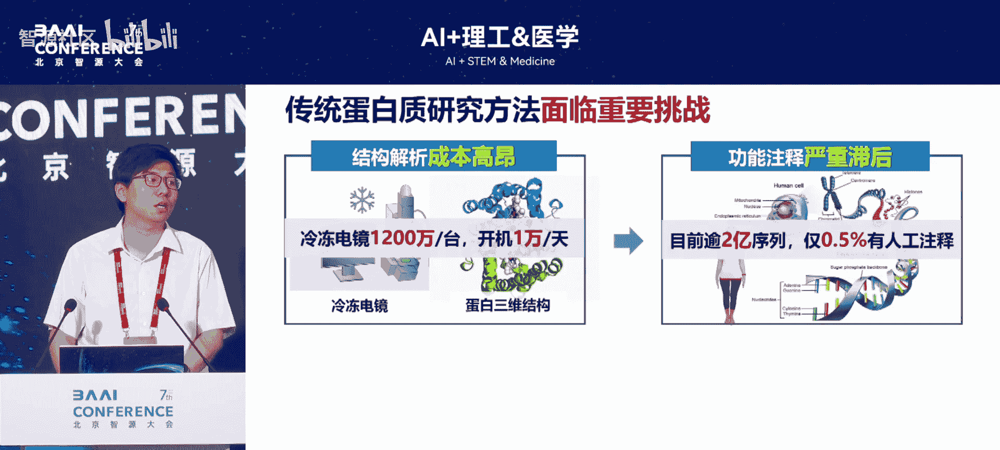
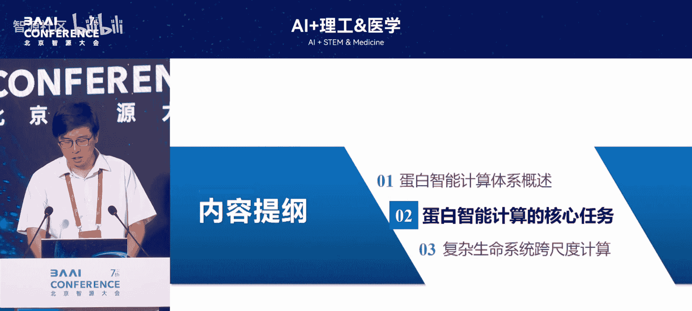
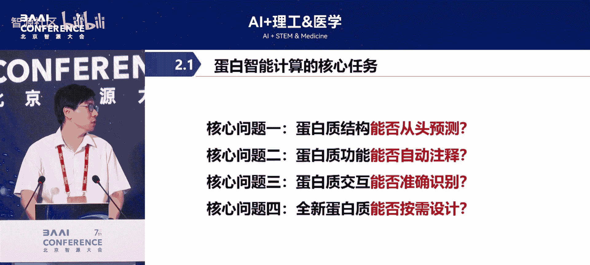
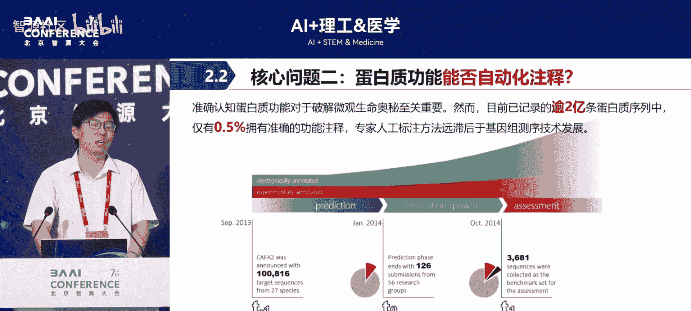
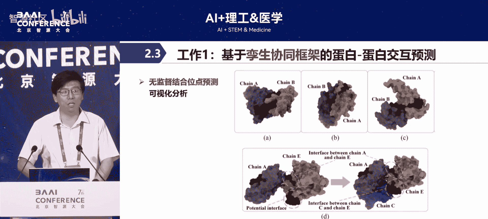
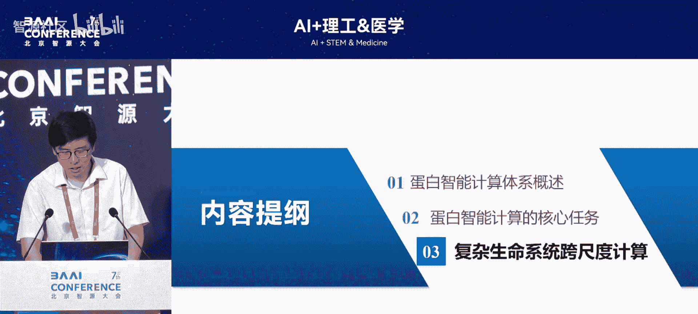
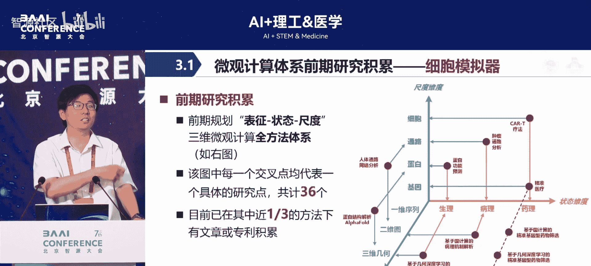
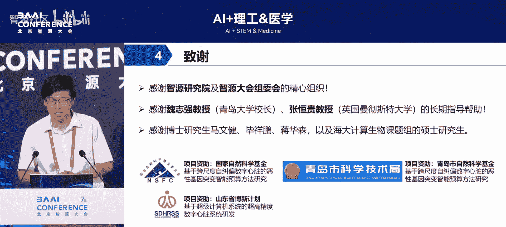

# AI+理工&医学-p11-蛋白智能计算体系构建及其应用：张树刚

在本节课中，我们将学习蛋白质智能计算领域的基本概念、传统生物学方法面临的挑战，以及人工智能技术如何为这一领域带来革命性的新范式。

蛋白质在人体生命活动中扮演着至关重要的角色，是生命活动的主要承担者。从氧气运输、生化催化到抗体免疫，其背后都有大量蛋白质分子在执行各种生命功能。然而，传统的蛋白质研究领域面临着三大核心挑战。

以下是传统蛋白质研究面临的三大挑战：

1.  **结构解析成本高昂**：使用冷冻电镜等设备解析蛋白质三维结构的费用极高。一台电镜的采购价格可达上千万元，即使租用，每日开机费用也以万元计，使得结构解析成为一项昂贵且资源密集型的工作。
2.  **功能注释严重滞后**：随着测序技术发展，新发现的蛋白质序列数量呈爆炸式增长。然而，依靠生物专家进行人工功能注释的速度远远跟不上。例如，在收录超过2.5亿条序列的权威数据库中，仅有约0.2%（约500万条）经过人工注释，绝大多数蛋白质的功能仍是未知的。
3.  **全新蛋白质设计困难**：尝试在计算机中设计具有全新功能的蛋白质时，传统方法存在难以筛选、改造成功率低等问题，限制了蛋白质工程的发展。

幸运的是，智能计算技术的兴起，为解决上述挑战提供了全新的思路和研究范式。近年来，人工智能在蛋白质领域的突破性成果，使其成为“AI for Science”最成功的应用领域之一。

---

## 蛋白智能计算体系构建及其应用：2：蛋白质结构预测的革命

上一节我们介绍了蛋白质研究领域的传统挑战，本节中我们来看看人工智能如何首先在蛋白质结构预测这一核心问题上取得颠覆性突破。

蛋白质结构预测的核心难题被称为“莱文塔尔悖论”。一个蛋白质序列在空间中可以折叠出的可能构象数量极其庞大，理论上可达 `10^200` 种。如果以每纳秒尝试一种构象的速度进行穷举，需要超过138亿年才能完成。然而，在生物体内，蛋白质从合成到正确折叠只需几秒到几分钟。这暗示着折叠过程遵循着某种高效规则，但该规则困扰了学界数十年。

AlphaFold的出现彻底改变了这一局面。其第二代版本实现了“高度准确”的预测，其预测结构与实验解析结构之间的平均误差不超过一个原子的宽度。这一精度足以媲美实验，因此在学术界引起了巨大轰动。随后的第三代模型进一步扩展了能力，能够预测蛋白质在体内与其他分子相互作用时的复合物结构，开启了结构生物学的新时代。

---

## 蛋白智能计算体系构建及其应用：3：蛋白质功能的智能注释

在了解了AI如何破解结构预测难题后，我们转向另一个关键问题：如何利用AI应对海量蛋白质序列的功能注释挑战。

面对数据库中仅0.2%的注释率，依赖生物专家逐个解析是不现实的。因此，研究转向利用深度学习模型进行大规模、批量化的自动功能注释。我们的研究团队在此方向进行了探索，核心思路是利用AI预测的结构数据来辅助功能研究。

以下是我们在蛋白质功能注释方面的三项主要工作：

1.  **利用预测结构进行数据增强**：由于实验解析的结构数据稀缺且昂贵，我们尝试使用AlphaFold等工具预测的海量蛋白质结构作为“虚拟数据”，用于训练功能预测模型。这类似于计算机视觉中的“数据增强”。结果表明，使用预测结构训练模型，不仅能扩大数据规模，有时还能发现比使用原生实验数据更多的功能关联。
2.  **开发自监督学习算法**：我们构建了自监督模型，对蛋白质分子中氨基酸残基间的关联进行编码和学习，从而提升对蛋白质功能的预测能力，无需完全依赖昂贵的标注数据。
3.  **实现多模态信息融合**：一个蛋白质分子包含序列、结构、进化信息等多达六种不同模态（尺度）的数据。简单拼接这些模态效果不佳。我们提出了一种多步骤框架，结合对比学习和多视图学习等方法，有效地融合了所有六种模态的信息，在多个基准数据集上取得了领先的性能。

此外，在可解释性方面，我们的模型能够高置信度地预测蛋白质可能涉及的十几种功能。有趣的是，当模型预测与旧版数据库记录冲突时，我们通过查阅最新文献发现，往往是模型预测更早地捕捉到了新近验证的真实功能，这侧面反映了AI模型的潜力。

---

## 蛋白智能计算体系构建及其应用：4：蛋白质相互作用的预测

除了单个蛋白质的结构与功能，理解蛋白质如何与其他分子（如药物、核酸、其他蛋白质）相互作用，对于药物研发至关重要。本节我们将探讨AI在预测蛋白质相互作用方面的应用。

蛋白质是药物在体内的主要作用靶点。药物分子需要与靶点蛋白的特定部位精准“对接”，才能发挥作用。预测这种“对接”效果是药物设计的关键步骤。尽管AlphaFold3能预测复合物结构，但其在线服务有严格的访问限制（如每日次数、分子类型限制），且获取其模型权重非常困难。

因此，我们自主研发了蛋白质相互作用预测模型。技术细节上，我们采用了交互注意力机制和多任务学习等方法来提升预测性能。更重要的是，我们关注模型的可解释性。通过无监督的可视化方法，我们将模型重点关注的原子区域标记出来，发现这些区域高度集中在两个蛋白质的实际结合界面，表明模型确实学习到了有生物学意义的相互作用特征。

为了验证模型的泛化能力，我们并未仅仅在标准测试集上评估。我们与合作方获取了一组真实的胰腺癌相关通路数据，让模型进行“真刀真枪”的预测。结果显示，在真实的生物网络背景下，我们的模型预测蛋白质相互作用的准确率仍能保持在95%以上，证明了其强大的实际应用潜力。

---

## 蛋白智能计算体系构建及其应用：5：从三维结构到药物筛选

上一节我们关注于蛋白质相互作用的预测，本节我们将深入一步，探讨如何利用蛋白质的三维几何信息直接驱动药物发现。

传统的图神经网络在处理蛋白质结构时，通常将其简化为二维图，丢失了关键的三维空间几何信息。为了更精准地表征蛋白质，我们引入了**几何深度学习**方法，构建了一套完整的范式，将蛋白质的三维空间结构信息（如原子间的距离、角度、二面角）融合到模型中。

我们以 **ACSS2** 蛋白为靶点进行了实际药物筛选案例研究。流程如下：
1.  使用我们的几何深度学习模型，对包含数万个候选化合物的库进行虚拟筛选。
2.  模型从中筛选出少数几个结合潜力最高的化合物。
3.  将这些化合物交由合作实验团队进行真实的亲和力实验验证。

实验结果非常显著，我们筛选出的化合物达到了**纳摩尔级别**的极高亲和力（在1-10分的评价体系中得分接近9），并且表现出很强的特异性，即不易与其他靶点结合产生毒副作用。这证明了基于AI三维结构模型的虚拟筛选能够高效、准确地发现潜在药物分子。

---

## 蛋白智能计算体系构建及其应用：6：蛋白质设计与跨尺度模拟展望

最后，我们展望两个前沿方向：创造全新的蛋白质，以及将蛋白质研究置于更宏大的生命系统模拟中。

**蛋白质的全新设计**是诺奖成果涵盖的另一方向。一个激动人心的案例是，研究人员针对一种澳洲剧毒土蛇的蛇毒（无现成解药），通过计算设计出一种自然界中不存在的新型蛋白质。这种设计蛋白能像“抗毒血清”一样，在体内精准结合并中和蛇毒蛋白，从而挽救生命。这展示了计算蛋白设计在创造全新生物功能方面的巨大潜力。

另一方面，蛋白质并非孤立运作，它是生命复杂系统中的一个微观尺度。我们的长期愿景是实现从**原子到器官**的**跨尺度耦合推演**。这构建了一个多维研究空间：

*   **生理维度**：涵盖生理、病理、药理全过程。
*   **组织维度**：贯穿基因、蛋白质、信号通路、细胞、组织、器官等多个层次。
*   **技术维度**：结合一维序列、二维图像、三维结构等多种数据形式。

我们已在细胞尺度模拟器等方面有所积累。未来的目标是将微观的蛋白质相互作用、细胞行为模拟，与宏观的器官（如数字心脏）病理仿真模型相结合，构建一个完整的、多尺度联动的生命系统数字孪生体，从而更全面地理解生命、预测疾病、设计疗法。

---

## 总结

本节课中我们一起学习了蛋白质智能计算体系的构建与应用。我们从传统生物学面临的三大挑战（结构解析难、功能注释慢、设计效率低）出发，逐步探讨了AI如何在这些方面带来变革：从**AlphaFold革命性地解决结构预测问题**，到利用**深度学习进行大规模功能注释**，再到预测**蛋白质相互作用**以助力药物研发，并进一步利用**三维几何信息进行高效药物筛选**。最后，我们展望了**设计全新功能蛋白质**以及构建**跨尺度生命系统数字模型**的未来愿景。人工智能正在深度融入蛋白质研究，推动生命科学进入一个数据驱动、模型引领的新时代。