# AI+理工&医学-p12-心脏医学影像分析技术研究：骆功宁

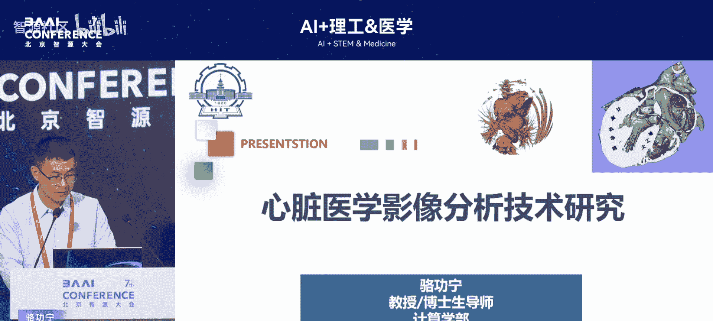

在本节课中，我们将要学习心脏医学影像分析技术的研究背景、核心领域以及其重要性。心脏疾病是全球范围内的主要健康威胁，而医学影像技术，如CT、MRI、OCT和超声等，为心脏疾病的诊断与研究提供了关键数据。计算心脏学作为一个交叉学科，融合了计算机科学、人工智能、医学影像学和电生理学等多个领域，旨在通过技术手段深入理解心脏功能与疾病。

## 计算心脏学：一个复杂的交叉领域

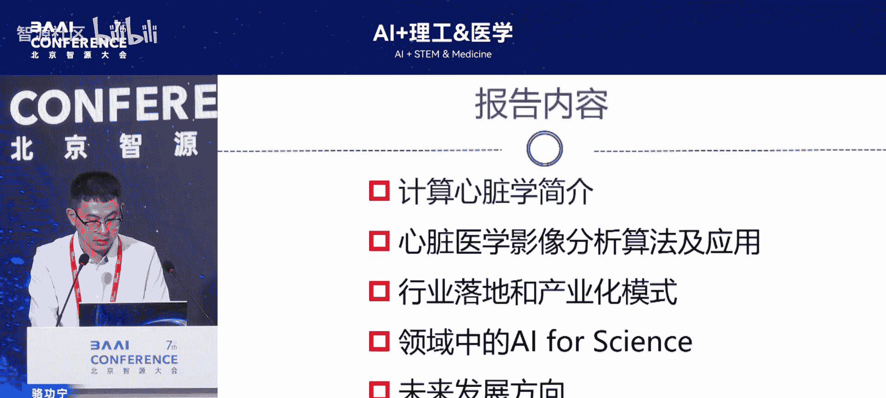

上一节我们介绍了心脏医学影像分析的重要性，本节中我们来看看其所属的更广泛领域——计算心脏学。这个领域非常复杂，涉及多个学科。

以下是计算心脏学涵盖的主要学科领域：
*   系统生物学
*   医学影像学
*   计算机科学
*   电生理学
*   心脏内外科学

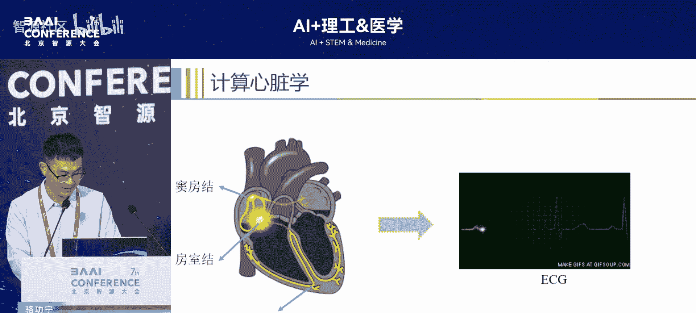

在该领域内，学者们的研究工作主要围绕以下几个方面展开：
*   心脏疾病机理的探究
*   心脏疾病诊断
*   心脏疾病治疗

---

# 心脏医学影像分析技术研究：2：研究框架与个人起源

上一节我们了解了计算心脏学的广阔范畴，本节中我们将聚焦于心脏医学影像分析这一具体方向，并阐述研究者进入该领域的个人契机。

我主要从心脏的解剖层面进行研究工作，例如肺动静脉提取、主动脉、冠脉、心房、心室等腔体的分割。这些工作旨在为未来真正的人工智能辅助疾病诊断奠定基础。

## 研究框架：三个层面

我将专注的心脏医学影像分析领域分为三个层面来理解。

首先是**对象层**，即我们关注的解剖结构，例如：
*   心室
*   心房
*   冠脉
*   肺动静脉
*   主动脉

其次是**成像层**，即获取这些解剖结构影像的技术，例如：
*   CT（计算机断层扫描）
*   MRI（磁共振成像）
*   DSA（数字减影血管造影）
*   超声
*   OCT（光学相干断层扫描）
*   PET（正电子发射断层扫描）

最后是**方法层**，即针对上述任务和数据所采用的技术手段，主要包括：
*   图像分割
*   目标检测
*   图像配准
*   三维可视化
*   图像分类
*   回归分析

这个领域高度交叉，融合了医学、成像技术和人工智能。

## 研究起源：从手动标注到自动化追求

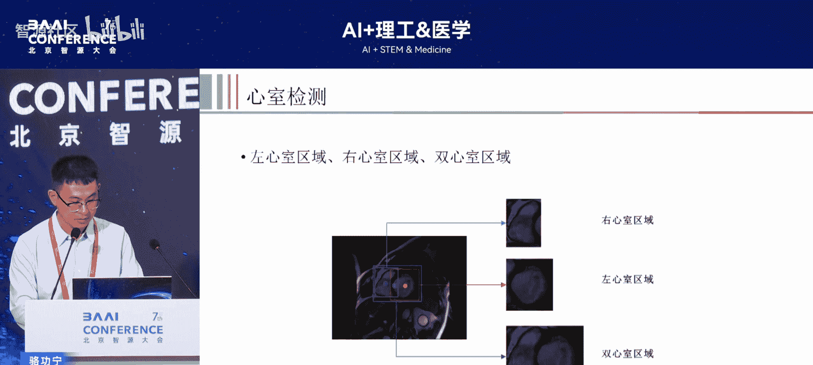

我进入这个领域的起源可以追溯到大约十年前。当时，张贵老师交给我一套高精度的犬类心脏Micro-CT数据，要求我进行分割标注，以用于后续的心脏仿真模拟。仿真对分割精度要求极高。

我尝试了多种自动化方法，但效果都不理想。最终，我花费了一个多月时间，手动勾勒了每一张图像。正是这段经历让我下定决心，未来要致力于开发自动化、智能化的分析方法。

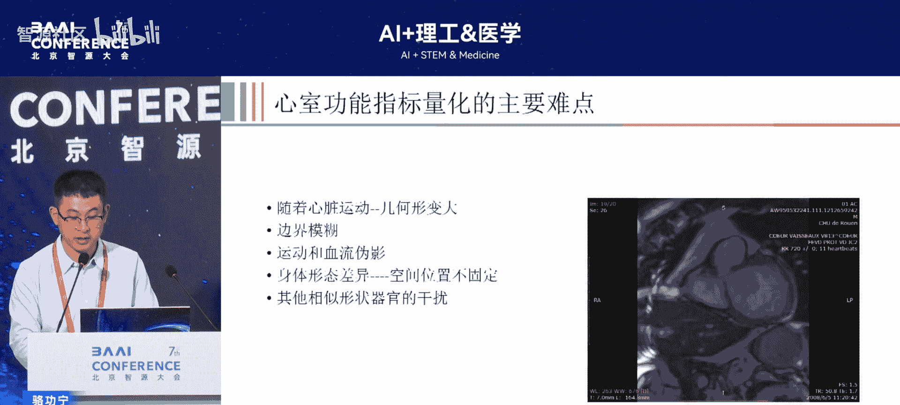

---

# 心脏医学影像分析技术研究：3：心房与心室影像分析

上一节我们讲述了研究的框架与起源，本节中我们来看看具体的研究应用，首先是从心房和心室的影像分析开始。

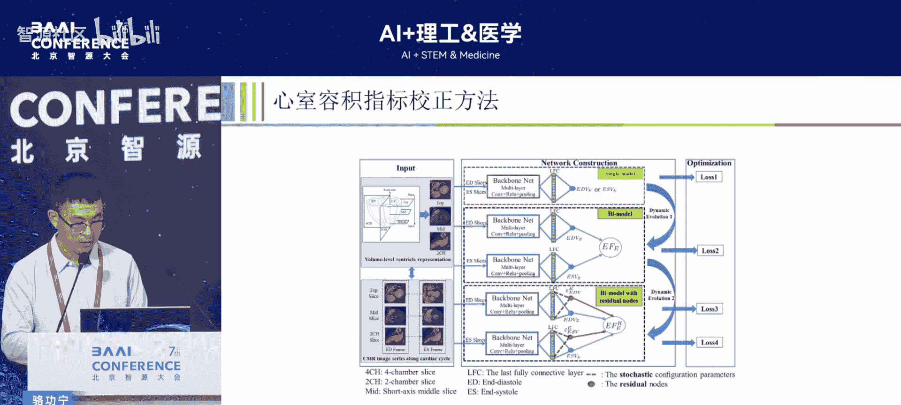

围绕心房分割，我们基于公开数据集开发了智能化的分析方法，初步实现了较高的精度，能够用于疾病的预分割与分析。这些方法经过后续优化，形成了一系列成果。

## 心脏MRI心室分析：挑战与方法

心室分析是心脏疾病研究的热点，因为许多疾病都始于心室的泵血功能异常。心脏MRI（磁共振成像）在显示软组织方面具有优势，我认为它是一种**4D数据**（三维空间 + 时间维度）。医学上通常需要逐层、逐帧精准分割心室，以计算其容积、质量及射血分数等关键指标。

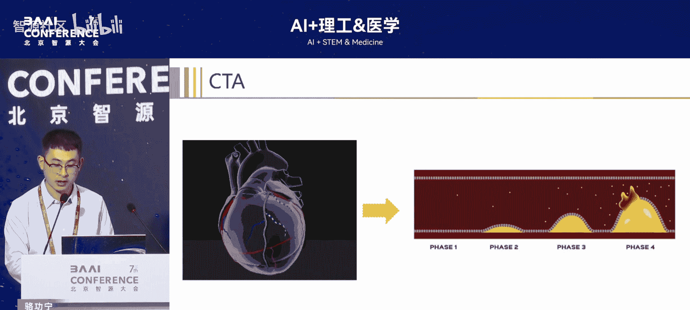

然而，自动化分析面临挑战。例如，右心室在单一切面上的形态会随着心动周期发生剧烈变化，这给自动化分析带来了很大困难。

我们当时的解决思路是分解任务。首先进行基础检测，定位心室。我们提出了一种基于医生手动操作先验的方法：医生扫描时会做初步定位，空间交叉中心大致就是心室中心。我们利用这一先验，先找到左心室中心，再通过拓扑匹配方法进行精确定位。定位后，再将目标区域输入深度学习网络进行预测。

此后，我们对方法进行了系列改良，包括错误调优，并将分割任务与预测任务融合，提出了一种新的**不确定性估计方法**。这不仅预测结果，还估计结果的潜在误差范围，为医生提供参考。

---

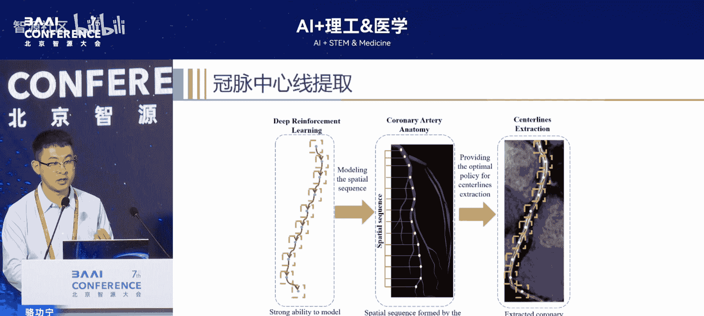

# 心脏医学影像分析技术研究：4：冠脉影像分析

上一节我们探讨了心室分析的挑战，本节中我们将目光转向医生更为关注的冠脉分析。冠脉疾病（如心梗）是导致猝死的主要原因。

首要任务是CTA（冠状动脉CT血管造影）分析。心梗主要由血管堵塞引起，而增强CTA能较清晰地呈现血管。

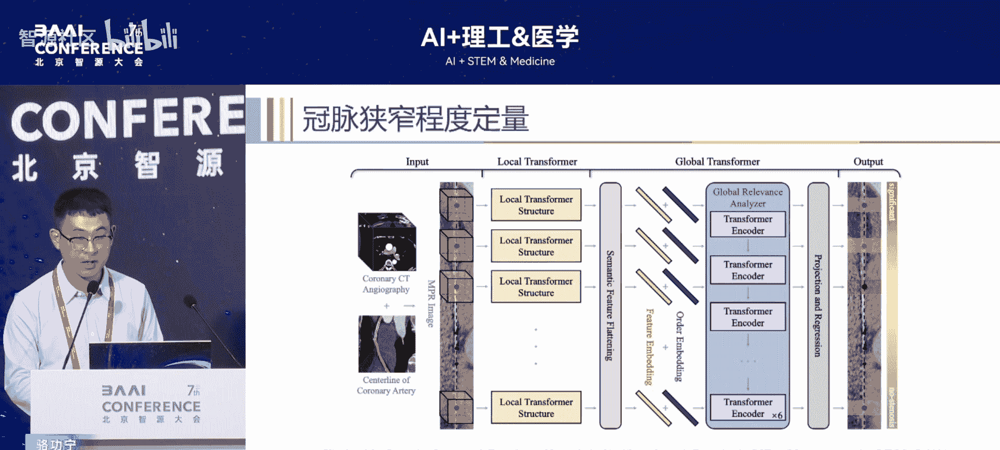

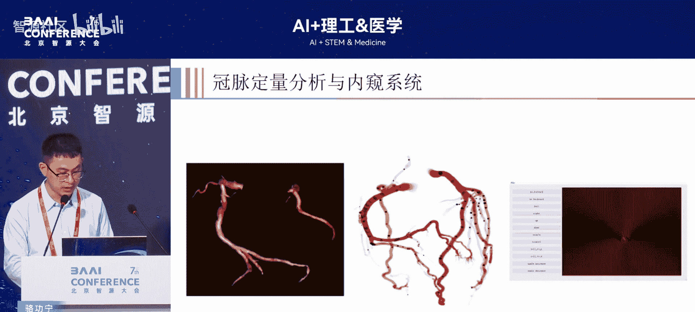

## 冠脉中心线提取：难点与模拟

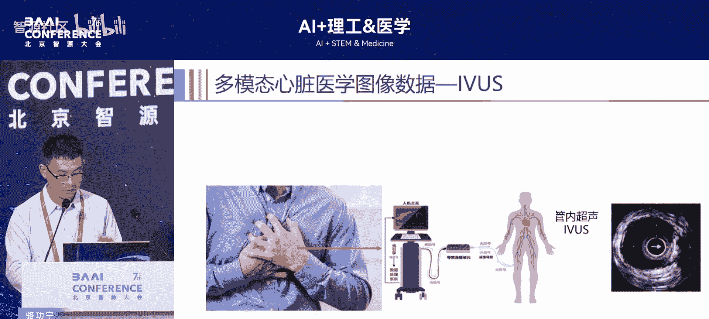

我们提出了一种方法来自动寻找冠脉的中心线。然而，这个问题至今未能完全自动化解决，医生目前仍主要使用交互式半自动方法。难点在于，在冠脉狭窄（病变）区域，影像特征对计算机而言难以解析。

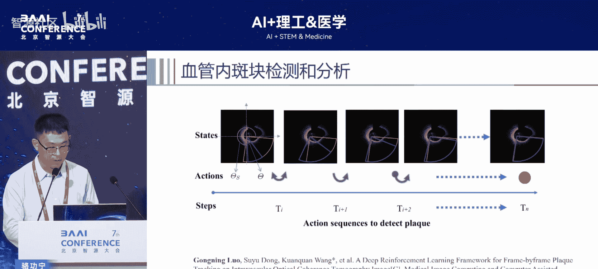

我们模拟医生的思维，提出了相关的强化学习方法。医生通常先交互式地找到冠脉起点，然后逐点连接形成中心线。我们让机器模拟这一过程：从起点开始，通过强化学习寻找下一个点，最终连接成中心线。

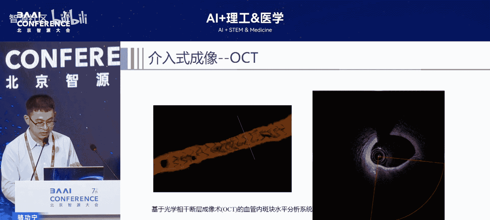

## 病变检测与属性分析

除了提取中心线，我们还沿着中心线定位可能的病灶，模拟医生的诊断流程。同时，提出自动化方法来判断斑块属性、类型及其导致的狭窄程度。

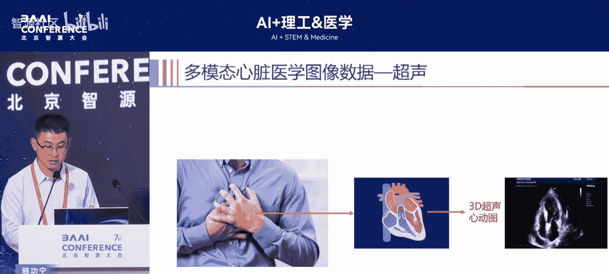

---

# 心脏医学影像分析技术研究：5：其他模态与应用拓展

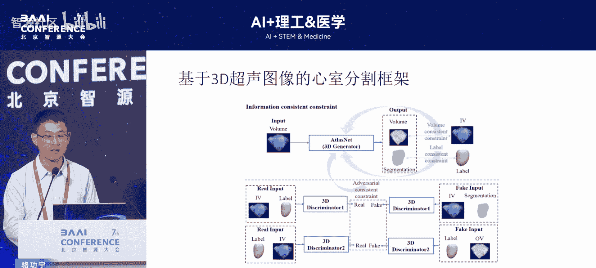

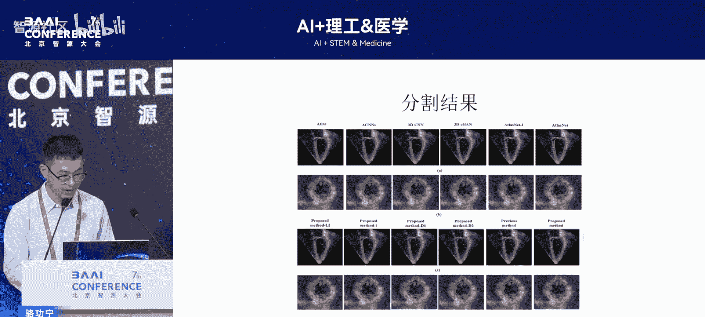

上一节我们深入了解了冠脉分析，本节中我们来看看其他影像模态的分析以及研究成果的实际应用。

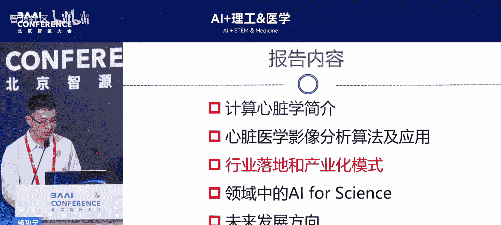

除了CTA，诊断冠心病还有OCT（光学相干断层扫描）等介入式方法。我们曾参与一个国际挑战赛，利用OCT数据做易损斑块的检测，并提出了深度学习方法来自动定位具有薄纤维帽的易损斑块位置，辅助医生分析。该挑战赛有近百个团队参与，我们最终获得了冠军。

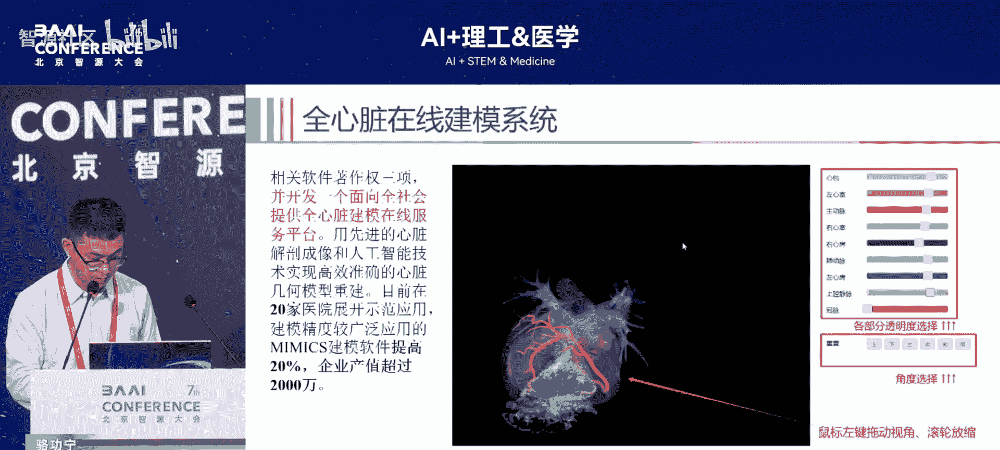

## 3D超声心脏分析

我们还进行了3D超声心脏数据的分析。虽然该设备尚未普及，但我们基于国际公开数据集，提出了基于图谱的自动匹配方法，实现了相对准确的心室分割。

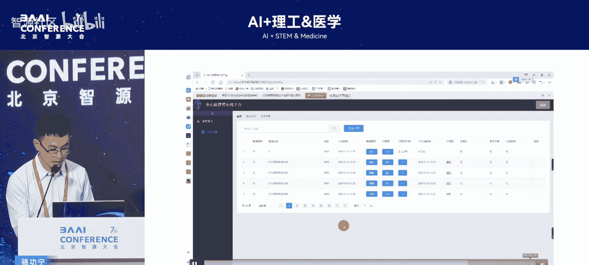

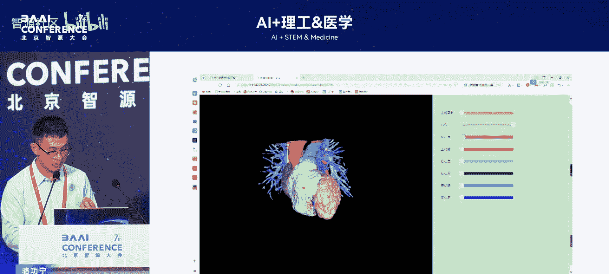

## 技术转化与平台开发

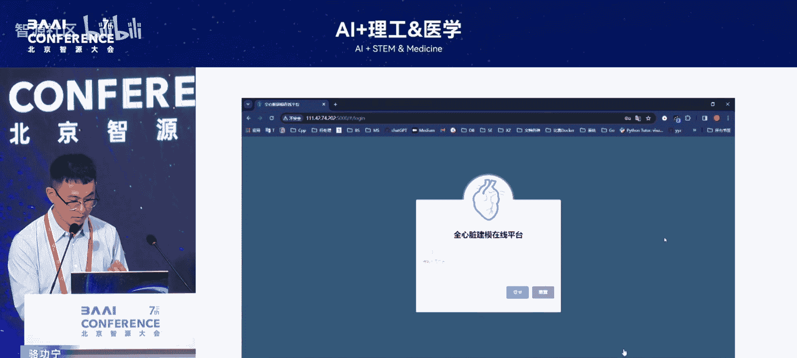

除了算法研究，我们也致力于成果的落地与应用。我们开发了一个心脏建模平台，并与企业合作进行技术转化，协助企业申请医疗器械注册证，相关产值已超过2000万元。

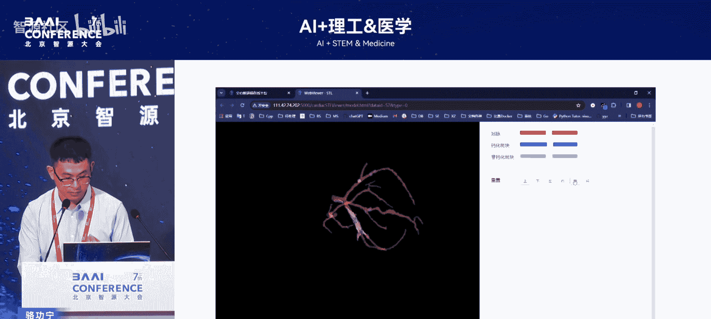

该平台允许医生上传脱敏后的数据，由AI进行自动分析、可视化与建模。我们也开发了专门的冠脉分析软件，并在医院进行试用。

---

# 心脏医学影像分析技术研究：6：大规模数据与科学发现

上一节我们看到了研究的技术转化，本节中我们将探讨大规模数据如何驱动更精准的算法，并可能带来意想不到的科学发现。

前年开始，我们联合公司投入大量资源，标注了1000多套肺动静脉的高精度分割数据。基于此数据，我们开发了高精度的分割算法，并在全国多家医院进行了多中心验证。

## 算法精度带来的科学规律

我们发现，当算法精度达到一定程度后，可以揭示一些新的科学规律。相关研究发表在《自然·通讯》上。我们发现，随着年龄增长，肺血管的丰富度会降低。同时，在同等条件下，女性的肺血管丰富度高于男性。

这个结论起初让我们谨慎，但经过大量实验验证后得以确认。这恰恰说明，AI不仅能辅助临床，还能帮助发现潜在的科学规律。这些规律当前可能用途不明，但未来或许具有重要意义。

我们将标注的数据集公开，并举办了国际挑战赛，吸引了全球400多个团队使用。

---

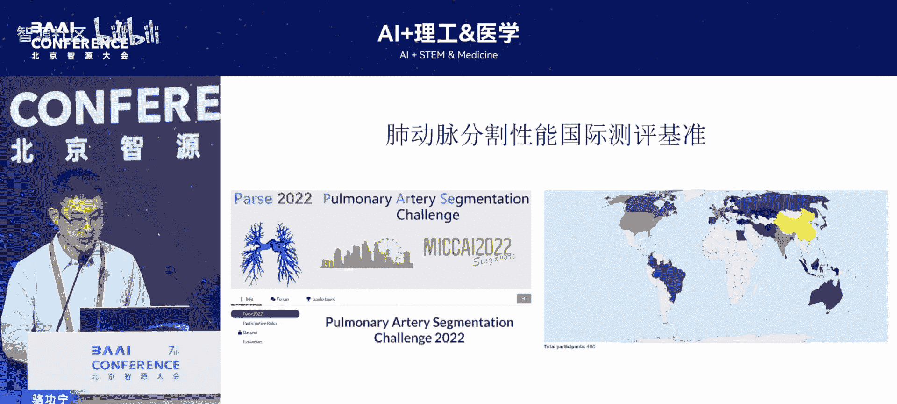

# 心脏医学影像分析技术研究：7：总结与展望

本节课中我们一起学习了心脏医学影像分析技术的研究脉络。

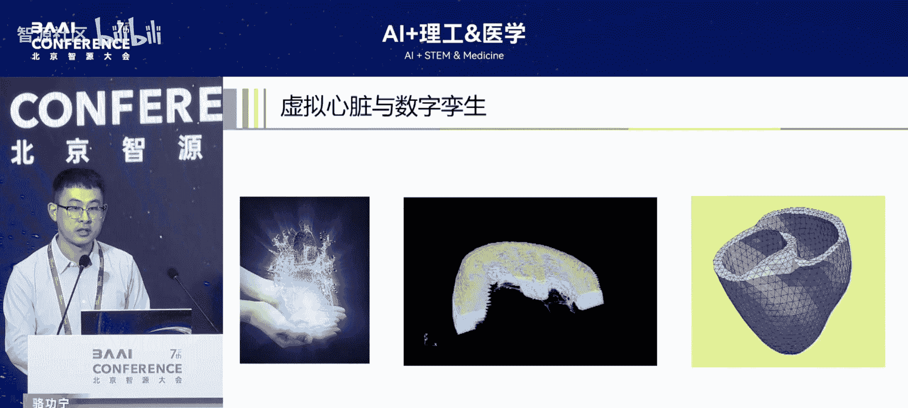

我们从计算心脏学这个交叉领域的背景出发，梳理了从心房、心室到冠脉的多种影像模态（CT、MRI、OCT、超声）的分析方法、挑战与解决方案。研究不仅停留在算法层面，还涉及大规模数据建设、技术转化落地，并展示了高精度算法助力科学发现的潜力。

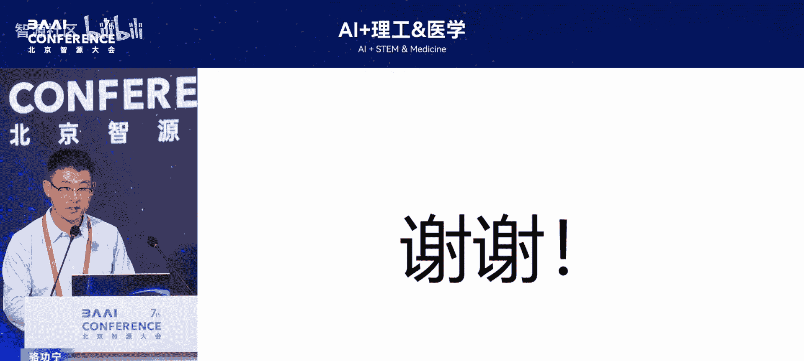

未来的发展方向，是在影像分析的基础上，进一步进行生命模拟和规律探索，这需要医学、工学等领域的专家们更深入的合作。