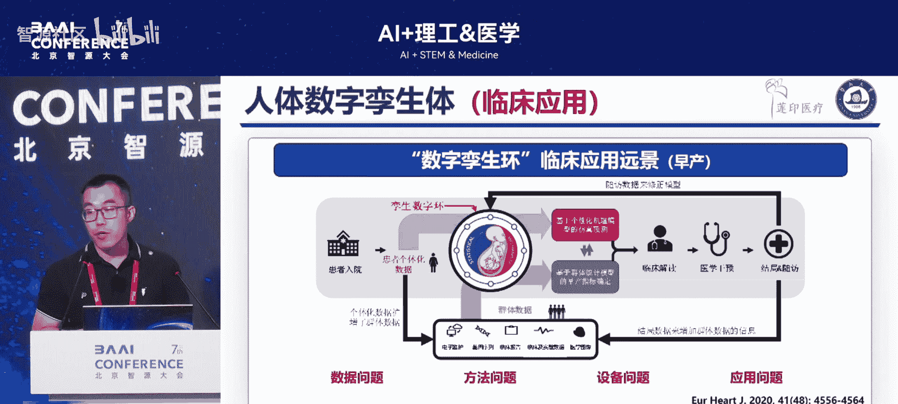
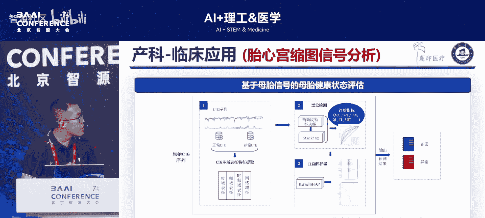
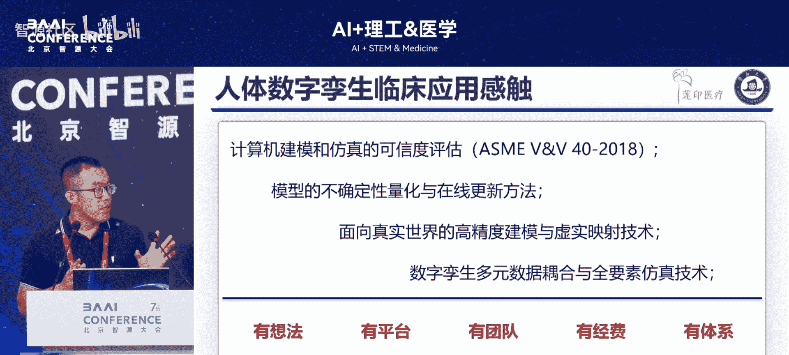

# AI+理工&医学-p13-面向医疗健康的人体数字孪生技术：白杰云

在本节课中，我们将学习面向医疗健康的人体数字孪生技术。我们将探讨其国家战略需求、核心技术挑战、当前发展现状以及未来的应用前景，特别是如何通过融合仿真与数据驱动来推动精准医疗的实现。

## 1：国家战略需求与愿景 🎯

上一节我们介绍了课程主题，本节中我们来看看其背后的国家战略需求。

从国家战略需求来看，当前社会面临老龄化加速和慢性病高发的挑战。因此，从医疗需求角度出发，需要对全生命周期进行健康管理。目标是打造集预防、治疗、康复、养老于一体的一体化服务。

为实现这一目标，需要进行全域数据感知，从而建立数字孪生模型。通过该模型实现辅助决策与应用。这一发展方向与我国“十四五”规划中发展数字经济的战略相吻合。近年来，数字经济在多个领域（如游戏、影视）的发展已深入人心。

在涉及“人”的数字技术中，数字人或虚拟数字人自20世纪80年代起，通过AI技术不断演进。然而，其在医疗健康领域的应用存在差异。因为医疗决策（如用药）需基于疾病机理，并据此设计药物或干预方式。

因此，提出了“虚拟生理人”的概念。在2021年关于“双清重感染”的讨论中也指出，虚拟生理人是技术迭代和创新的转型方向。它能探究人体奥秘、解析疾病产生机制、分析其演化，最终目的是实现精准治疗。而实现这一愿景的关键技术，正是数字孪生技术。

## 2：当前发展与核心挑战 ⚙️

上一节我们了解了宏观愿景，本节中我们来看看当前的技术发展现状与核心挑战。

当前虚拟生理人的发展，沿用了20世纪70年代生理组学的方法。即通过构建亚细胞、细胞、组织、亚系统、系统等层级模型，最终构建虚拟生理人。但此路径仍有很长的路要走。

目前发展较好的领域是心血管系统，包括电学、力学及其耦合模型，以及结构分析。要真正实现人体数字孪生的远景，需要将仿真与数据双驱动融合。

这一思路也契合了美国科学院2024年提出的指南。该指南指出，除了数字孪生的五个核心部分（物理空间、虚拟空间、物理到虚拟、虚拟到物理、人机交互辅助决策），还需关注外部的验证、不确定性量化、安全及能力评估。

当前可见的方向是结合AI与模拟仿真。模拟仿真基于机理模型，能产生大量数据并解释现象背后的原因。AI则能起到归纳作用，从海量数据中识别关键变量指标。

**核心公式/方向：**
```
未来方向 = 机理模型 (可解释性) + AI模型 (数据归纳)
```

我认为，机理模型能够弥补AI模型可解释性差的不足。这可能是未来的一个重要方向。



若能实现人体数字孪生，如何落地应用？整体愿景是：患者入院后，获取其个体化数据。一方面，基于个体数据构建个性化模型以预测疾病；另一方面，该数据可汇入历史数据库进行归纳分析。

**应用流程：**
1.  获取患者个体化数据。
2.  数据用于构建个性化预测模型。
3.  数据汇入历史数据库，通过AI进行分析。
4.  医生结合分析结果进行判断和干预。
5.  根据结局反馈不断修正模型。
6.  数据集不断标准化，形成可持续运转的数字孪生模型。

然而，此过程中存在诸多问题，最关键的是数据问题。在数字中国和AI发展的背景下，数据质量是首要关键，其次才是方法。有了方法之后，还需与硬件及医院信息系统结合才能真正落地。最后是应用场景的开拓。

## 3：数据难题与解决路径 📊

上一节我们指出了数据是关键挑战，本节中我们深入探讨数据的具体难题及其解决路径。

最重要的数据问题是多模态、多尺度数据的获取与分析。其可及性与必要性非常重要。但在构建模型时，常面临数据缺失或不匹配的问题。例如，拥有某人的心脏结构数据，却缺乏其离子通道数据，后者可能来自动物或病理样本。

从临床获取数据则存在精确性不足的问题。例如，研究中使用高精度仪器标注的心脏数据，其精度远高于临床常规数据。此外，数据还存在缺漏、一致性差等问题，这些都是技术发展的重大障碍。

面对这些现实问题，我们按照生理组学的方案，将无序、碎片化、多物种、多尺度、多健康状态的数据耦合起来，进行定量描述。

以下是构建模型的路径：

1.  **构建通用模型**：首先构建一个“拼装车”式的通用模型，并不断优化。但这仍属于理论研究或理想仿真范畴。
2.  **融入个性化数据**：在通用模型基础上，融入当前可获得的个性化数据，如影像、信号、人口统计信息，形成“伪个性化”模型。
3.  **虚拟临床试验**：利用模型构建种群，将个体差异参数化，开展药物等虚拟临床试验。
4.  **在线个体化仿真（未来方向）**：形成真正的个性化模型，并与临床实时数据耦合，实现虚实映射，基于医生干预进行预测。这尚未完全实现，仍属理论探索，需要医生和监管部门的共同推进。
5.  **面向真实世界**：将系统接入整个医疗信息系统，通过医疗设备获取孪生数据，基于孪生数据和机理模型做出决策，最终形成可持续运转的孪生模型，支撑精准医疗。

## 4：研究实践与应用案例 💡

上一节我们讨论了理论路径，本节中我们来看看在该领域的具体研究实践与应用案例。

在心脏仿真方面，我们进行了一些工作。例如，研究特定基因突变（如SCN5A）如何影响宏观心脏表面的电传导，以解析其病理机制。在新药研发方面，我们考虑上游基因对下游蛋白的调控作用，将生物实验数据融入计算机模型，预测结果并分析病理机制，进而评估哪种药物可能更有效。

我们还研究了窦房结的生理病理机制。结合离体人体心脏的结构信息，融合细胞模型，构建了具有解剖结构的窦房结模型，用于分析心衰等状况下的病理机制。

在应用方面，我们进行了药效评估工作。通过构建大规模计算机模型种群，评估抗心律失常药物的分类。研究发现，在药物分类中考虑性别因素至关重要。

**关键发现：**
```
性别特异性分类器的准确率（AUC）比未考虑性别的分类器提高了约6个百分点。
```

另一个与临床紧密相关的应用是个体化房颤风险评估。这涉及心脏影像分割。与以往主要关注心脏表面疤痕不同，我们的工作关注心房肌厚度的变化，探究其是否导致房颤，并为此提供了一个新的评估指标。

此前的心脏仿真多为离线，离实际应用较远。因此，我们也在产科领域展开了工作，这与《柳叶刀》、《自然》等期刊提出的构建“虚拟产妇”以降低孕产妇和婴儿死亡率的倡议相契合。

我们更关注分娩阶段，因为超过45%的孕产妇死亡发生在分娩及产后24小时内。我们希望利用数字孪生技术进行分娩导航。考虑的因素包括产道、胎儿和产力，对应的数据包括超声影像、胎儿心率、宫缩等。

我们之所以能开展此项工作，是因为合作的公司在产科领域拥有全套硬件设备、信息系统及远程监护云平台，这解决了数据完整性和一致性的问题。

目前，我们开发的软件能够全面、实时地收集相关产房数据，并进行3D可视化。但距离耦合身体功能、形成闭环的真正数字孪生还有一定距离，这是我们努力的方向。在此之前，我们已在医学影像分析、产道评估、基于信息系统的分娩方式预测等方面做了一些基础工作。但当前的预测是基于历史数据，尚未实现实时预警，这也是未来的工作重点。

## 5：未来展望与合作倡议 🤝

基于多年的研究，我认为在人体数字孪生领域，以下几个方面仍需努力：

以下是未来需要重点发展的方向：



1.  **可信度评估**：许多计算机仿真模型在推向医院时，医生并不认可。因此，建立模型的可信度评估标准至关重要。美国已提出相关指南，国内尚无，需要推进。
2.  **在线更新**：许多仿真仍是离线的。如何通过不确定性量化实现模型在线更新是一个重要方向。
3.  **高精度建模与决策**：面向真实世界进行高精度建模，耦合多模态数据，最终实现辅助决策。

虽然有想法和平台，但我们需要聚合更多人的力量共同推进。这也是举办相关论坛的初衷，旨在促进交流碰撞，共同推进该领域发展。

最后，做一个宣传。我们今年举办了一个“千链级”会议，并设有相关的特刊，欢迎大家投稿。此外，我们已将近年来的相关代码和数据公开，希望更多人能参与到这项研究中来，共同推进该领域。

---



**本节课总结：**

在本节课中，我们一起学习了面向医疗健康的人体数字孪生技术。我们从国家应对老龄化与慢性病的战略需求出发，探讨了该技术的核心愿景——通过全域数据感知与模型构建，实现预防、治疗、康复一体化的精准医疗。我们分析了当前虚拟生理人发展的现状，指出了**数据质量**是核心挑战，并提出了通过**机理模型与AI融合**、构建从通用模型到个性化在线仿真的解决路径。通过心脏仿真、药效评估、产科导航等具体案例，我们看到了该技术的实践潜力。最后，我们明确了未来在**可信度评估、在线更新、高精度决策**等方面仍需努力，并呼吁跨学科合作，共同推动这项变革性技术的发展。