# AI+理工&医学-p14-迈向智慧医疗的伦理人工智能：周觉晓

在本节课中，我们将要学习人工智能在医疗领域应用的巨大潜力与当前面临的核心伦理挑战。我们将探讨AI如何改变医疗，以及为何在技术飞速发展的同时，必须构建一个可信、可靠的伦理框架。

---

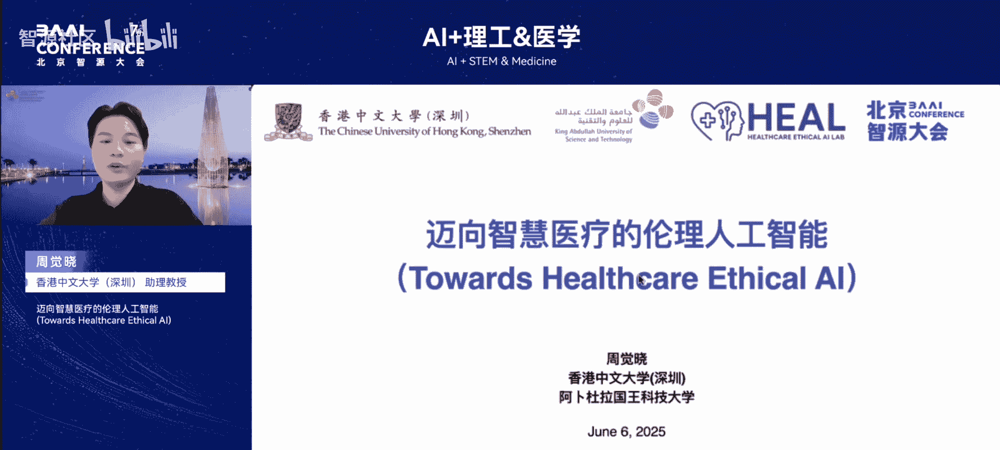

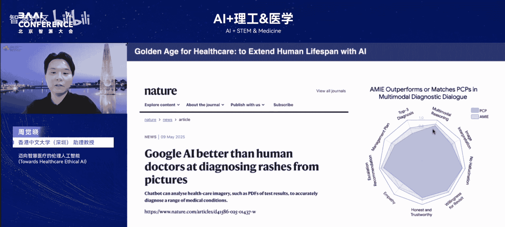

当前，人工智能正在席卷医疗的每一个角落。从谷歌推出的“艾米”系统，到其支持视觉功能后的多模态能力，AI已成为医疗健康行业的标志性项目。艾米在多项能力上，如多模态推理、图像理解、共情能力及鉴别诊断等，已经超越了人类医生。我们正处在AI医疗的黄金时期，技术突破帮助我们更好地理解人体、预测甚至治愈疾病。

根据研究报告，医疗AI行业预计在2025年迎来爆发式增长，全球市场规模预计突破千亿美元，中国将成为第二大单一市场。这是一个巨大的机遇。

然而，在取得可喜成果的同时，我们也面临着严峻的伦理挑战。例如数据隐私与安全、模型的公平性、模型的透明度与可解释性，以及最终的责任归属等问题。在医疗保健场景下，这些问题无法回避。这引出了两个核心问题：当AI诊断比医生更快、更准时，它是否真的可以取代医生？以及，我们应如何界定其中的责任与信任？

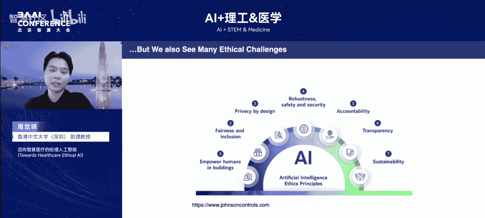

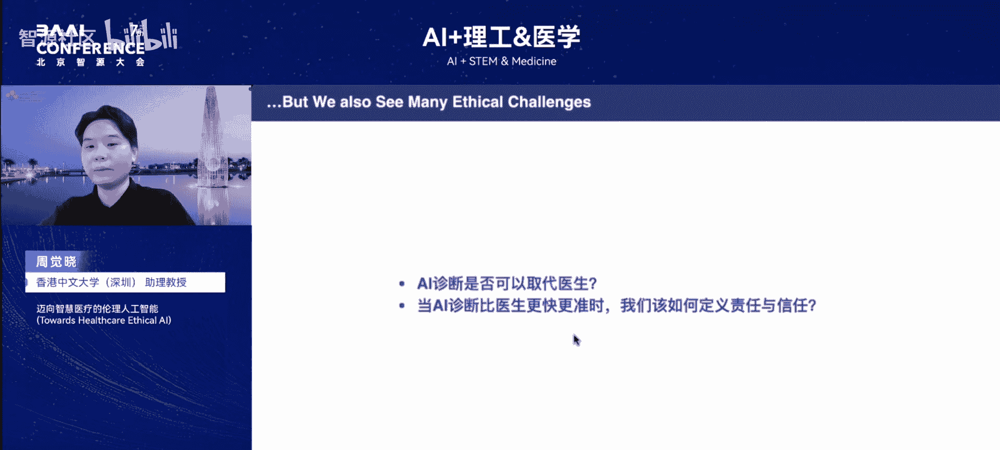

作为AI医疗行业的从业者，我们的宏大目标是通过解决关键性的医疗与生物问题来延长人类寿命。同时，我们也为AI大模型方向上的技术突破感到兴奋，甚至可能在短期内看到通用人工智能的突破。但在将这些AI技术广泛应用于医疗保健领域或直接提供给患者使用之前，仍有大量关键问题需要解决，包括**鲁棒性、隐私、安全性、毒性**等。只有真正解决了这些基础问题，我们才能拥有一个**伦理人工智能**，为AI在医疗保健中的应用保驾护航。

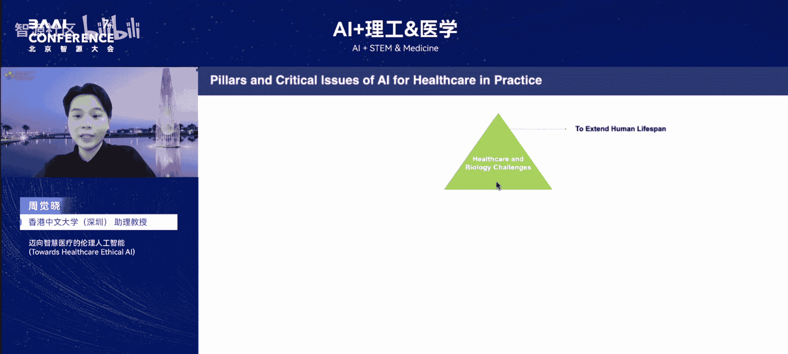

---

# 迈向智慧医疗的伦理人工智能：2：三位一体的研究战略

上一节我们介绍了AI医疗的机遇与挑战，本节中我们来看看为应对这些挑战而构建的核心研究框架。我们致力于通过一个三位一体的战略，构筑未来医疗AI的核心支柱。

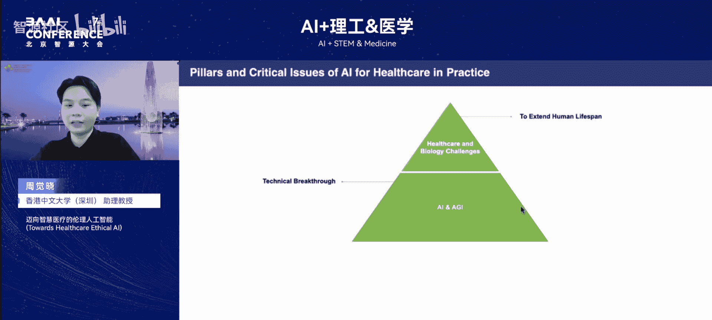

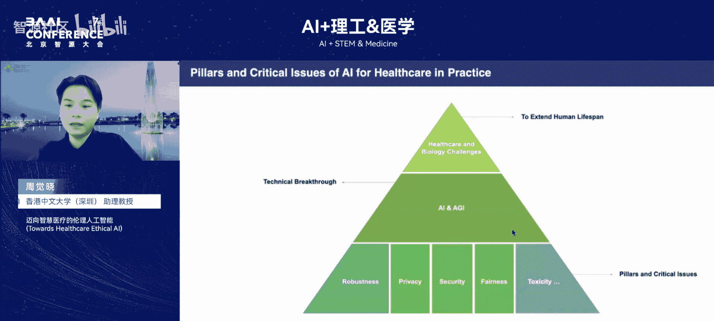

我们主要聚焦于AI医疗的三个关键维度：

以下是三个核心研究方向：

1.  **AI驱动的智能医疗系统**：开发前沿人工智能算法，赋能疾病检测、预后预测与风险评估等关键医疗场景，为临床决策提供高精度、可解释的智能辅助。
2.  **生物信息学与AI科学家**：关注基因调控网络的理解、预测蛋白质功能与结构，并探索以好奇心驱动的AI科学家来加速“AI for Science”的进程。
3.  **可信与伦理AI系统**：在医疗系统前提下，系统性应对数据隐私、安全性、算法偏见、公平性与潜在伤害等挑战，推动可持续、可信赖、以人为本的AI系统建设。

我们的目标是实现从基础算法到临床落地、从分子尺度到伦理治理的全链路突破，最终推动医疗智能走向可信与普惠。

---

# 迈向智慧医疗的伦理人工智能：3：应用案例——皮肤病诊断

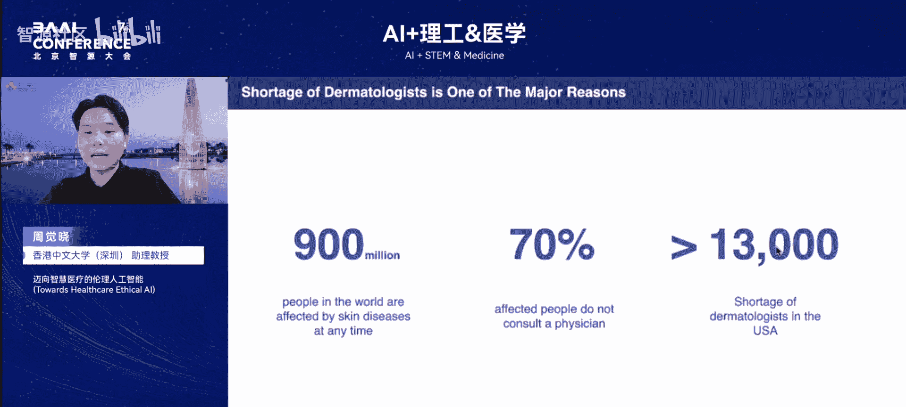

在明确了研究框架后，本节我们将深入一个具体的应用场景：皮肤病诊断。这是一个全球性的健康挑战，也是AI可以发挥重要作用的领域。

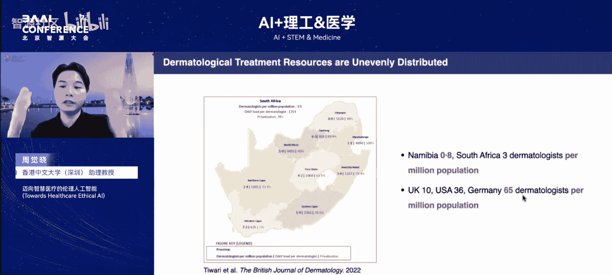

皮肤病是全球排名第四的疾病，影响近9亿人口。其中约70%的患者不会及时咨询皮肤科医生，可能导致病情加重甚至死亡。最主要的原因之一是皮肤科医生短缺。例如，美国有近13000名皮肤科医生的缺口，而在许多发展中国家情况更为严重。例如，南非和纳米比亚每百万人口仅有0.8名皮肤科医生，而德国每百万人口有65名。医疗资源分配不均的现象在皮肤病领域尤为突出。

以下是皮肤病诊断领域面临的一系列挑战：

*   皮肤科医生短缺。
*   准确诊断困难。
*   生成患者友好的诊断报告费时费力。
*   存在隐私和可解释性问题。

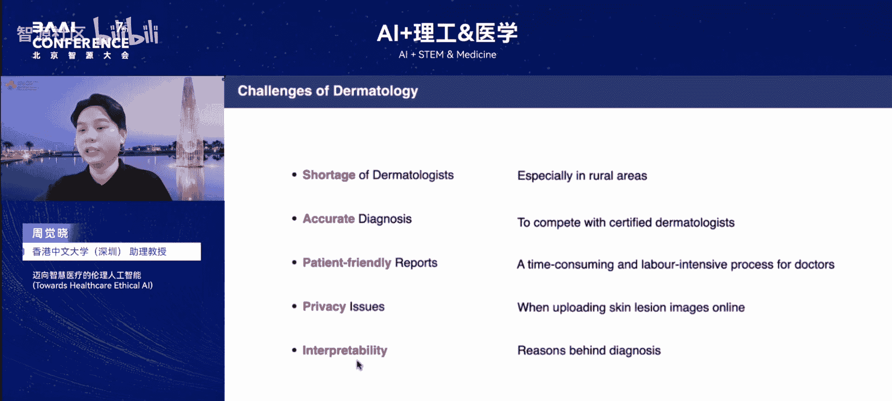

因此，我们在2024年的工作中，基于多模态大语言模型开发了首个交互式皮肤病诊断系统。用户通过拍摄一张皮肤病区域的图片，即可用自然语言与模型交互，获得初步诊断报告和个性化建议。该系统能在不同角度、光线和分辨率下，精准描述皮肤病图片的医学特征，并给出鉴别诊断结果。

基于此技术，我们开发了手机应用软件。用户提供皮肤病图片和更多主诉信息后，模型能给出更个性化的诊断报告和治疗建议。

---

# 迈向智慧医疗的伦理人工智能：4：应用案例——冠心病早期风险监测

除了皮肤病诊断，AI在老年人健康管理，特别是慢性病早期监测方面也大有可为。本节我们来看看AI如何助力心血管疾病的风险预警。

全球老龄化是一个严峻问题。到2050年，全球将有约15亿老年人口。在中国，去年年底老年人口已达3.1亿，占总人口的22%。因此，“AI+养老”成为一个重要方向。在老年人健康管理中，慢性病是主要威胁，全球近四分之三的死亡发生在老年群体，大部分由慢性病导致，如心脏病、肿瘤、中风、阿尔茨海默症、帕金森症等。

我们特别关注心血管疾病，更具体而言是冠心病的早期风险预测和预警。这很重要，因为：第一，冠心病在死亡中占比很高；第二，冠心病可以通过手段进行早期检测，从而及时干预，在一定程度上可以预防，减少老年人死亡风险。

冠心病的成因主要是血管中物质堆积导致动脉粥样硬化或形成斑块，使血管变窄，最终造成堵塞或血栓形成。它是一个发展过程，但达到临界值后会出现急性症状，如心脏病、心衰或心律失常，导致很高的死亡风险。

因此，我们思考是否有一种手段可以实现实时、早期的冠心病风险监测。在近期的工作中，我们开发了这样一套系统。只需在用户家中部署一个健康传感器，即可实时从用户面部提取特征，结合用户的个性化数据后，实时评估冠心病风险。

这套系统是可行的，因为医学研究表明，人的面部存在一些与冠心病强相关的特征，如耳垂折痕或特定面部区域的皱纹等。为了打造这套系统，我们构建了首个相关的人脸基座模型，并联合国内多家医院采集了大量冠心病病人的人脸数据。经过模型预训练和微调后，我们能精准地从人脸中提取出潜在的、与冠心病强相关的特征。

基于这些模型提取的特征，结合用户的个性化数据，可以给出个性化的风险评估结果和健康建议。例如，在实时监测中，红色表示监测到较强的冠心病风险，蓝色表示低风险。

---

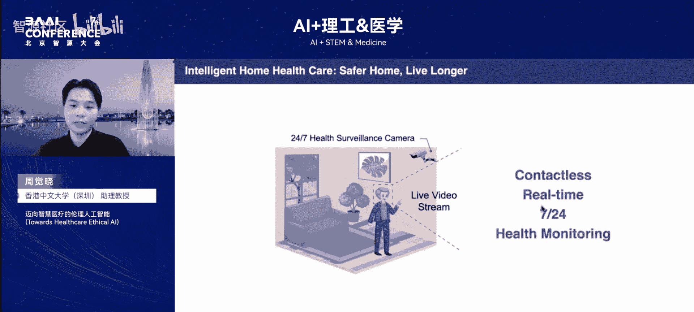

# 迈向智慧医疗的伦理人工智能：5：伦理挑战与基础设施

回顾以上两个项目，我们可以发现一个共同的应用场景：将这些系统部署后，可以打造一个“智能家居”。只需部署健康摄像头，即可实现无接触、实时、全天候的健康监测。这套系统不仅能覆盖皮肤病监测或冠心病风险评估，未来还可扩展到各种疾病的早期预警。进一步地，它可以与各种可穿戴设备结合，利用更精准的信号提供更精准的疾病风险评估。

未来，当具身智能或体内AI出现技术突破后，家中可能会出现越来越多的“AI健康管家”。但那时，人们可能会产生新的顾虑：你是否真的愿意让一个能无限制获取你的私人信息、监测你的健康信号、具有物理实体并能与物理世界交互，甚至可能具有一定自主能力的健康管家进入你的生活？

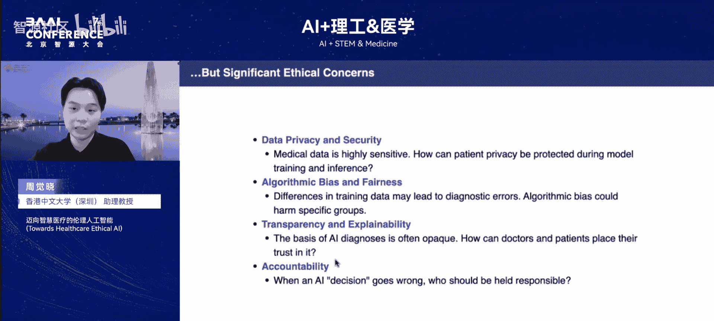

将目光聚焦于当前的AI医疗，我们同样面临着非常多的伦理关切。以下是几个核心挑战：

*   **数据隐私和安全**：医疗数据非常敏感。如何确保在模型训练和推理过程中保护用户隐私至关重要。
*   **算法偏见与公平性**：数据上的偏差可能导致算法偏见，从而对某些特定群体造成伤害。
*   **模型的透明度和可解释性**：如何让医生和用户真正信任AI系统的决策是一大挑战。
*   **责任归属**：如果AI给出了错误的诊断信息，应该由谁来负责？

作为AI医疗从业者，开发一套AI算法通常遵循一个常规流程：从**数据收集**出发，到**数据传输和存储**，再到**模型训练**、**模型发布和部署**，以及最后的**模型推理**。在这个全流程中，伦理问题无处不在。因此，我们需要开发一套**伦理AI的基础设施**。

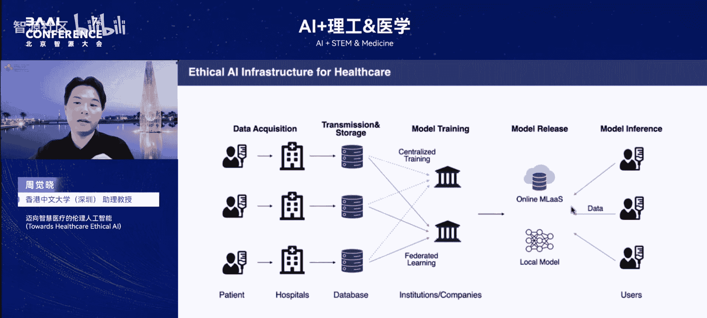

例如，数据本身包含大量隐私信息。从数据收集到模型训练这个基础流程中，如何解决伦理挑战是关键。研究者已提出多种手段来加强医疗数据的隐私保护。

以下是几种关键技术手段：

*   **基于密码学的手段**：如同态加密或安全多方计算。但这些手段通常会引入额外的计算消耗。
*   **差分隐私**：但这项技术面临隐私保护与模型可用性之间的权衡。公式表示为：`更强的隐私保护 ↔ 可能牺牲模型性能`。
*   **联邦学习**：这项技术可以在不获取原始数据的情况下，联合多方资源共同训练深度学习模型。
*   **区块链技术**：已被广泛应用于安全的数据共享或模型训练中。

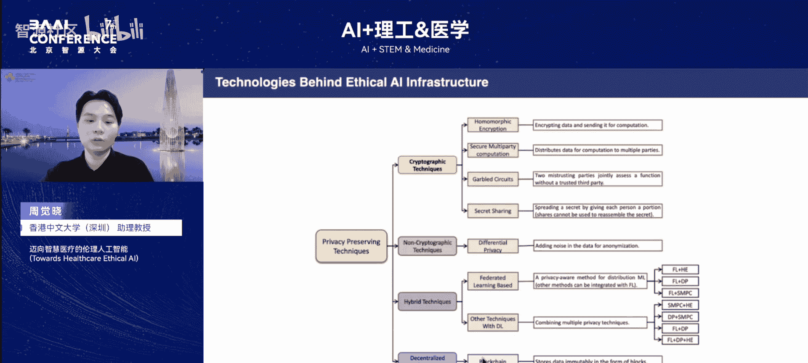

对于模型发布而言，也存在潜在的伦理挑战。预训练好的深度学习模型可能记忆了大量关于训练数据或患者的隐私信息，导致隐私泄露。因此，我们不仅关注**机器学习**，也关注**机器遗忘**，即研究如何有效地从预训练模型中去除与患者相关的隐私信息。

在模型推理这一步，除非在边缘计算场景下，如果模型部署在云端，用户可能需要上传医疗数据以实现预测和推理，这可能导致潜在的伦理问题。解决这一难题，**加密推理**也是当前的主要研究方向。

总的来说，搭建这样一个伦理AI基础设施至关重要。它要求我们进一步研究如何实现数据共享与隐私保护并行，如何确保模型中的信息可删除、训练过程公平透明，以及最终的决策过程可追责。只有拥有了这样的伦理AI基础设施，我们才能为AI在医疗保健中的广泛应用保驾护航。

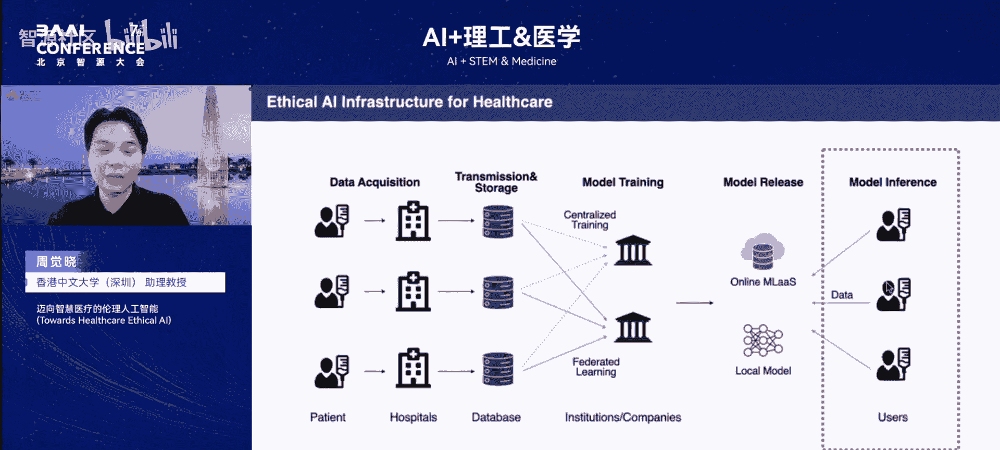

---

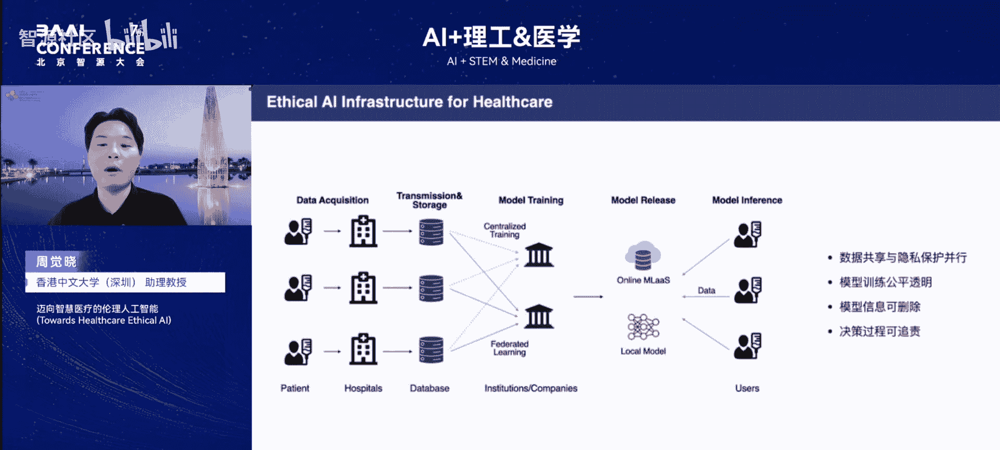

# 迈向智慧医疗的伦理人工智能：6：总结与展望

本节课中我们一起学习了AI在智慧医疗领域的应用前景与核心伦理挑战。现在，让我们对未来的方向进行总结与展望。

AI之所以能获得巨大成功，依赖于三个要素：**大模型、大数据和大算力**。在自然语言处理领域，有大量高质量的语料数据，我们可以充分利用大数据的优势来提升模型性能。但如果想在医疗领域复制这种成功，大数据同样必不可少。现状是，公开的医疗数据量远不及自然语言处理领域，这些数据通常存储在医院中，由于各种原因难以获取。

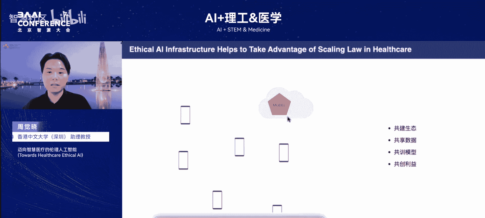

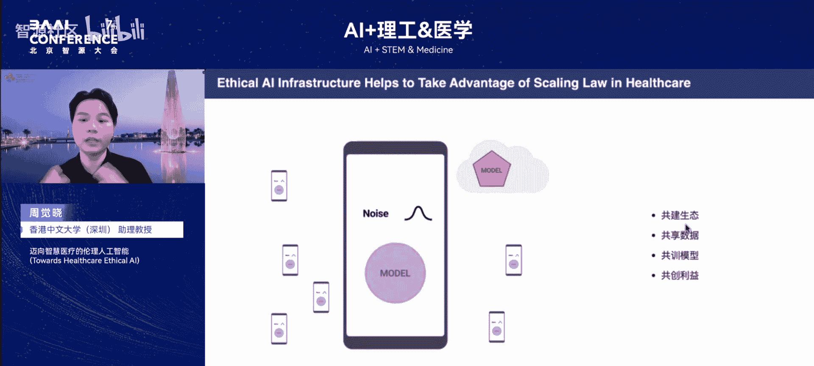

因此，在这种情况下，我们希望通过建设伦理AI的基础设施，解决一系列基础的伦理问题，打造一个系统，共建一个生态，吸引不同机构共享数据。这样，我们就能充分利用大数据的优势来训练模型，同时也能从训练好的模型中共同创造利益。

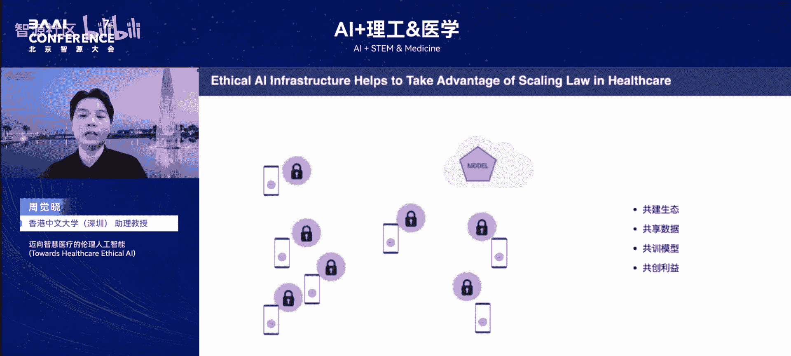

最后，迈向智慧医疗的伦理人工智能，还有很长的路要走。我们很高兴看到AI正在重塑医疗，但只有在伦理的护航之下，它才能真正造福人类。

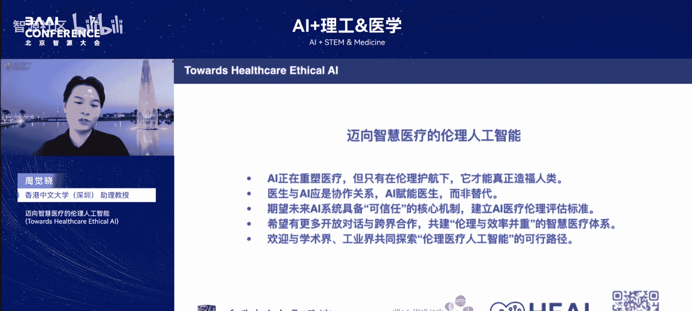

回到最开始的问题：未来，我认为医生与AI应该是协作的关系。AI可以赋能医生，而并非替代。这就要求我们未来的AI系统需要具备可信任的核心机制。我们需要共同建立起一套AI医疗伦理的评估标准，共建一个伦理与效率并重的智慧医疗体系。