# AI安全-p06-Towards-Certifying-AI-Safety-and-Security：孙军

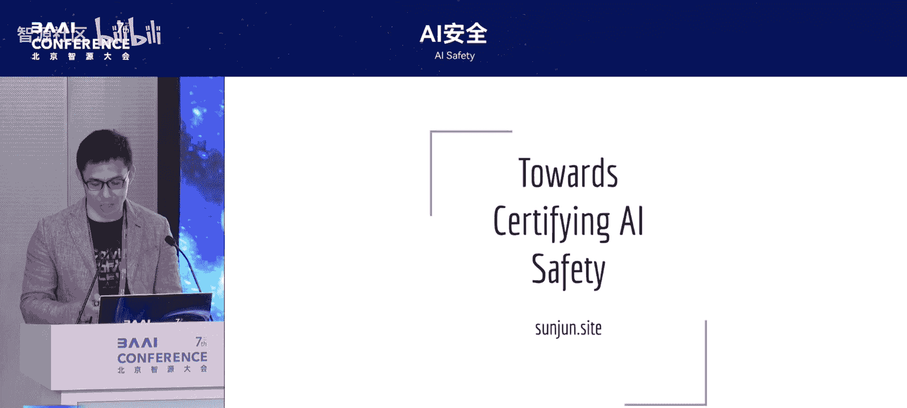

在本节课中，我们将探讨如何为人工智能系统提供安全性与保障的认证。我们将从传统软件验证的挑战出发，分析AI安全定义的特殊困难，并讨论在特定领域实现安全认证的可行路径。

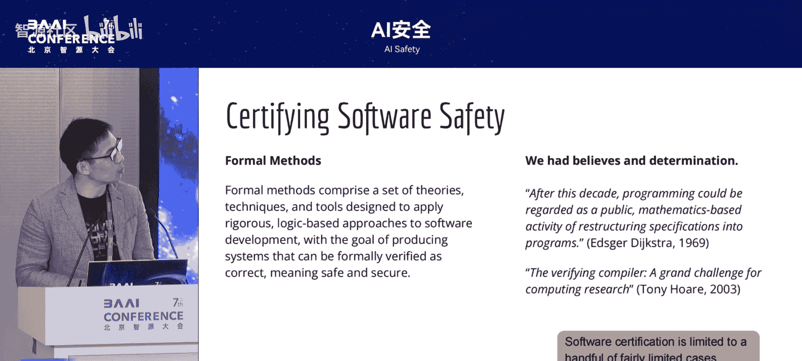

## 软件验证的历史与挑战

上一节我们介绍了课程主题，本节中我们来看看传统软件安全验证的发展历程与核心挑战。

软件安全验证的核心目标是确保系统完全无缺陷。尤其在控制核电站等关键系统中，软件安全至关重要。自上世纪五六十年代起，世界上最聪明的研究者们尝试了各种方法来解决这个问题。

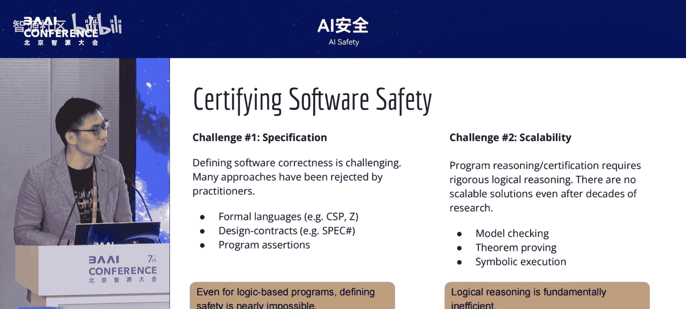

然而，软件安全验证问题解决得并不理想。其根本原因在于两个关键挑战。

以下是软件安全验证面临的两个核心挑战：

1.  **定义安全性的困难**：所有软件都基于逻辑，理论上可以基于逻辑定义安全。但实践中，从形式化语言到在编程语言中嵌入规范（如Spec#）等多种尝试均未成功。即使让程序员在代码中写入断言（assertion）这种简单方法，也因难以推广而很少被使用。
2.  **验证的可计算性（Ability）问题**：所有验证都基于推理（reasoning），而推理天然具有很高的计算复杂度（high complexity）。这使得许多验证工作在实践中难以推进。例如，即使仅检查“没有双重释放内存（double free）”这类基础安全标准，相关工作最终也难以推广。

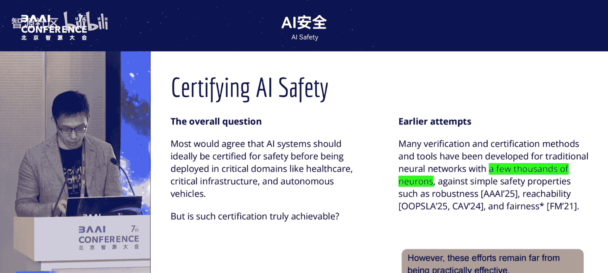

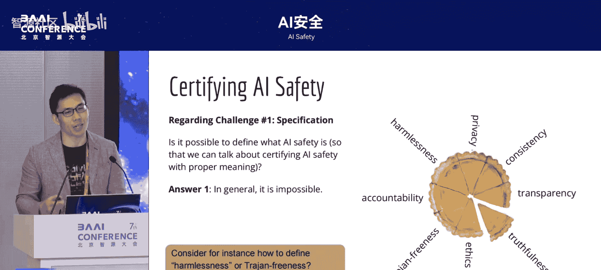

## 从软件安全到AI安全的迁移与瓶颈

上一节我们回顾了软件验证的困境，本节中我们来看看这些方法在迁移到AI安全领域时遇到的瓶颈。

由于AI安全至关重要，许多原软件安全领域的研究者转向了AI安全。早期有一系列工作试图将软件安全的方法移植到AI安全上，例如将各种软件抽象方法应用于神经网络的验证。

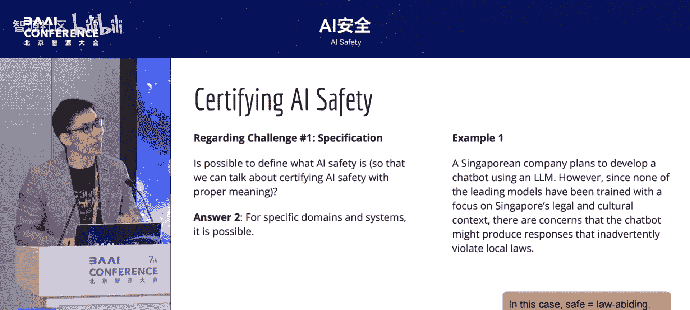

但这些方法遇到了瓶颈。当神经网络被替换为大模型后，无论采用何种已有的抽象方法，最终都会面临之前提到的两个关键问题：如何定义安全问题，以及如何解决验证的可计算性问题。

## 定义AI安全的根本性困难

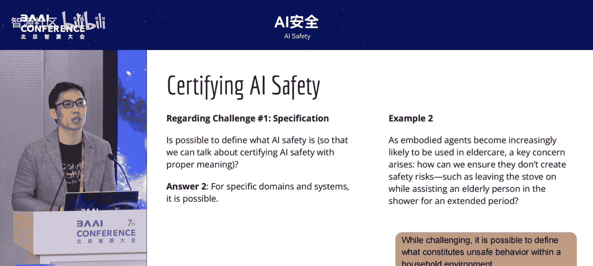

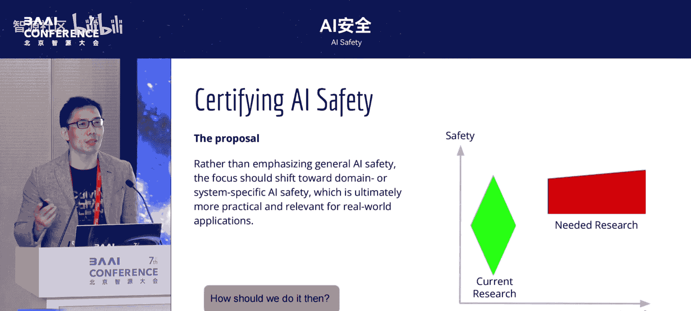

虽然定义通用AI安全极其困难，但我们并非束手无策。首先需要认识到，从形式化分析的角度精确定义“AI安全”本身可能无法实现。

例如，考虑以下几个常被讨论的AI安全维度：道德、公平性、无害性。这些概念本身就很难精确定义。一个哲学化的例子是：人的自由意志是好的，奴役他人是不好的。但如果一个人自愿成为他人的奴隶，这究竟是道德的还是不道德的呢？这类根本性冲突使得从普遍层面精确定义安全变得异常困难。

## 特定领域AI安全的可行性

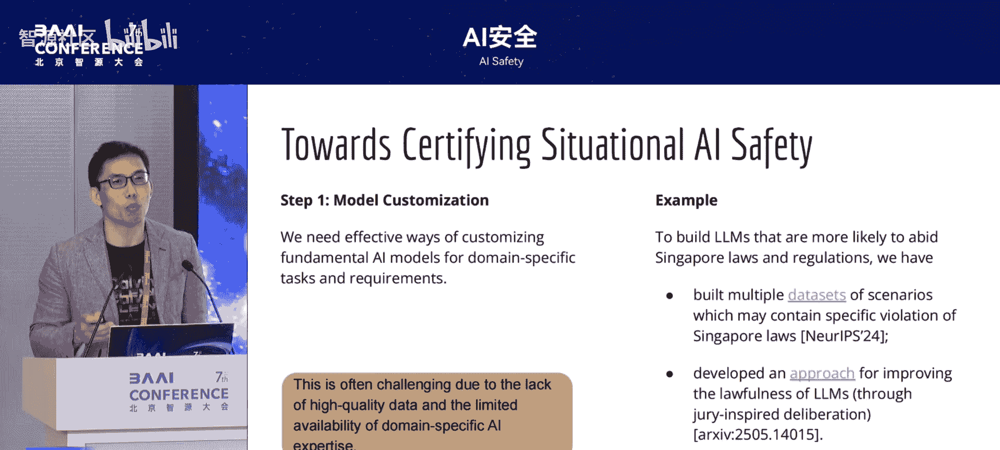

上一节我们讨论了定义通用AI安全的困难，本节中我们来看看一个更可行的方向：在特定领域或具体系统中定义和解决AI安全问题。

对于具体的应用领域或系统，安全问题是可以被定义和解决的。关键在于将宽泛的“AI安全”转化为具体、可定义的约束。

以下是两个具体领域的例子：

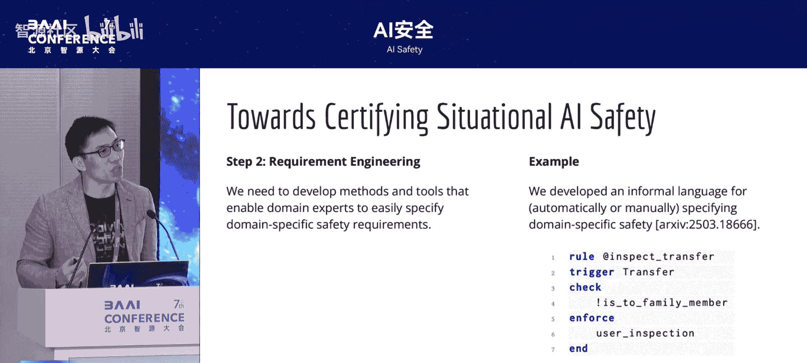

1.  **符合地域法律法规**：对于新加坡的公司，一个重要的安全需求是确保大模型生成的内容符合新加坡的法律法规。由于大多数大模型并非在新加坡训练，它们对当地法规的理解可能不足。此时，AI安全就被明确定义为“保证AI输出与新加坡法律法规一致”。这是一个可以定义的问题。
2.  **限定功能的智能体（Agent）**：定义一个通用家用机器人（body agent）的安全行为很难。但如果限定这个机器人仅用于照顾老人、负责特定家务，那么就可以定义出在该场景下有意义的、安全的行为模式。

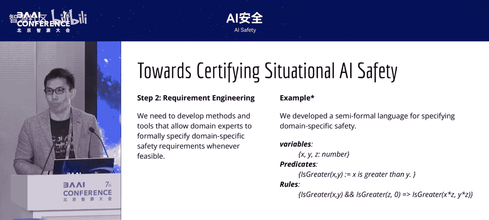

近期许多AI安全研究试图解决过于宽泛的问题，这可能难度过高。相比之下，专注于特定领域的安全问题可能更具实际意义和可行性。

## 实现特定领域AI安全认证的三步路径

如果我们同意应着重于特定领域的AI安全问题，那么具体应如何实施呢？一个可行的路径包含以下三个步骤。

### 第一步：实现大模型对特定领域的深度理解

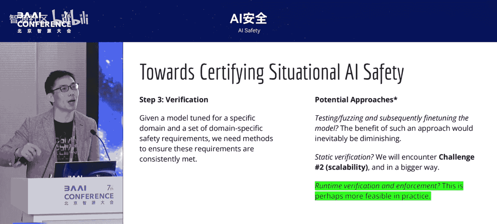

当前将大模型应用于特定领域的方法（如构建领域数据集进行微调，或使用RAG-检索增强生成等方法）效果可能不尽如人意。例如，若仅用少量新加坡判例微调模型，其对新法规的理解效果可能不佳。法律法规的理解本身就很复杂，需要整个法律体系支撑。因此，第一步需要开发能让大模型对特定领域有深刻理解的新方法。

### 第二步：形式化表达特定领域的安全需求

特定领域有其独特的安全需求。我们需要提供方法、语言和工具，让领域专家能够简单地提出这些安全需求，而无需学习复杂的知识。历史上许多方法因代价太高而未被采用。

近期的一些工作尝试设计简单的语言，让领域专家便捷地表达需求。若想获得理论上的安全保证，则需要将安全需求形式化（formalize）。

例如，一个形式化规则的简单示例是代数性质：对于任意数 `X`, `Y` 和正数 `Z`，如果 `X > Y`，那么 `X * Z > Y * Z`。将此规则形式化后，可用于验证大模型在比较数字时的回答是否正确。

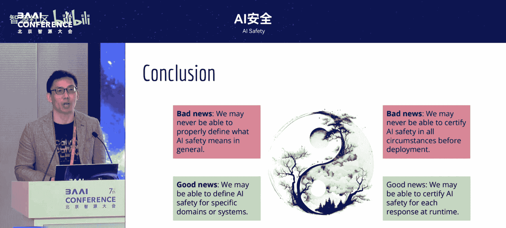

### 第三步：运行时验证与保证

定义了安全需求后，如何保证大模型始终满足它们？有两种主要思路：

1.  **测试与红队演练（Red Teaming）**：这是常用方法，但有其局限。随着测试用例增多，通过微调让模型满足所有用例的效果会递减，有效性变弱。
2.  **运行时验证（Runtime Verification）**：不保证模型在所有情况下都安全，但能在每次特定响应时进行检查。例如，一个负责转账的AI助手，每次执行转账操作前，都可以自动检查收款人是否在允许名单内（如家属），从而阻止不安全操作。

对于需要理论保证的复杂安全属性，可以进行更严格的形式化验证。例如，针对“比较15.12和15.2大小”的问题，如果模型回答“15.12更大”，我们可以利用形式化证明工具，基于前述代数规则，验证“对于所有正数Z，是否都有 `Z * 15.12 > Z * 15.2`”。若证明不成立，则可知答案错误，从而在理论上保证输出不违背该规则。

## 总结与展望

本节课中我们一起学习了迈向可认证AI安全的核心思路与挑战。

我们主要探讨了两个核心观点：
1.  定义通用的“AI安全”极其困难，但着眼于**特定领域**，则问题变得可定义、可解决，这是近期更值得探索的方向。
2.  我们可能永远无法完全“认证”一个AI系统的整体安全，因为大模型缺乏传统软件为便于验证而设计的结构（如函数、类）。然而，如果我们关注**单次响应**，并在能明确形式化安全需求的前提下，**运行时验证**提供了一条可行的解决路径。

当然，这条路径仍面临挑战：安全需求可能不完备；需要额外的安全组件（如响应过滤-`response filtering`）处理意外行为；安全需求本身需要随法规、环境变化而维护更新；对于能力越来越强的AI智能体，如何在其能力边界设置检查机制也是重要问题。

最后，如果强人工智能（AGI）时代来临，许多为人设计的安全需求（如交通信号）可能不再适用或需要重新定义，这提出了更深远的挑战。真正的AI安全落地，需要技术方案与**监管标准**的协同推进，在鼓励创新与防控风险之间找到平衡。

---
**本节课中我们一起学习了**：从软件验证的困境出发，认识到定义通用AI安全的根本性困难，进而提出了聚焦于**特定领域**、通过**形式化安全需求**与**运行时验证**来实现AI安全认证的务实路径，并讨论了该路径面临的挑战与未来展望。