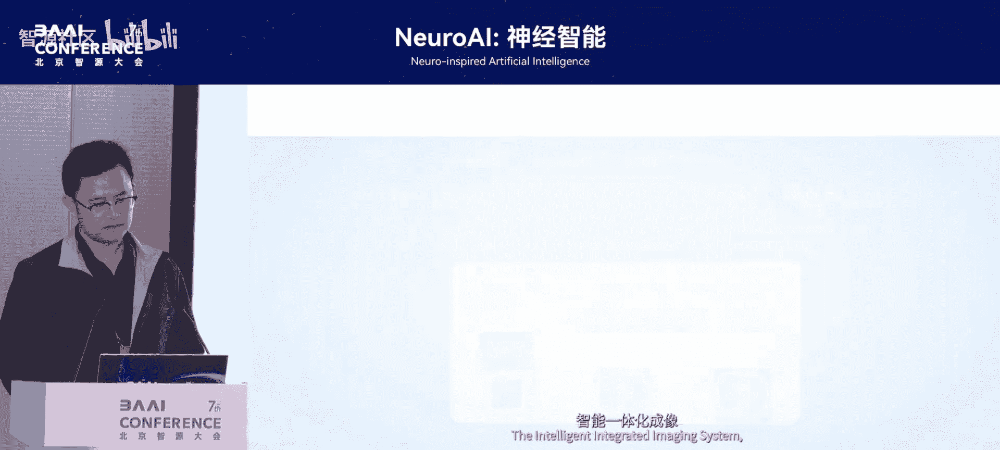
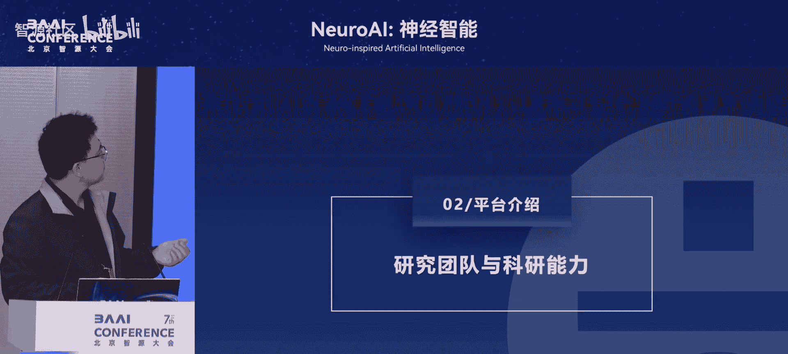
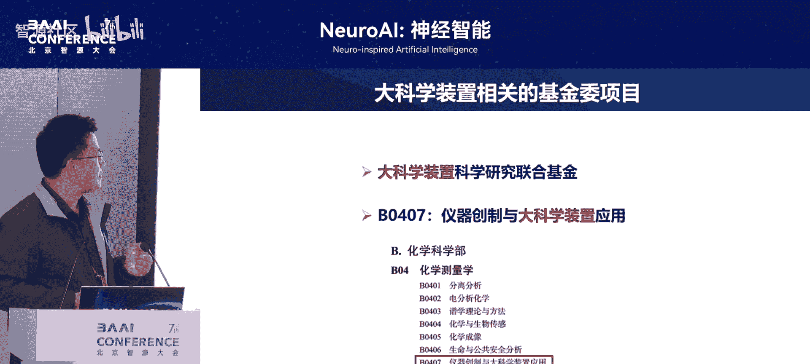

# NeuroAI：-神经智能-p02-国家大设施与数字生命计划：马雷

在本节课中，我们将学习国家重大科技基础设施（大设施）如何为“数字生命”研究提供支撑，并探讨从脑模拟到数字生命计划的演进逻辑。

## 概述

本次分享将回顾讲者与智源大会及脑模拟研究的渊源，介绍由北京大学承建的国家重大科技基础设施——多模态跨尺度生物医学成像设施，并阐述以此为基础推动“数字生命”大科学计划的构想与意义。

## 与智源大会及脑模拟的渊源

我自2019年起便与智源大会结缘，并深度参与了脑模拟相关的工作。以下是我参与的关键节点回顾：

*   **2020年**：在智源大会内部汇报了精细神经元网络的可视化仿真工作，与刘志远老师（早期“悟道”模型CPM）的工作同期进行。
*   **2021年**：在刘老师组织的论坛上，以“高精度模拟走向新一代人工智能”为题进行报告，并随后成立了生命模拟研究中心。
*   **2022年**：在线上智源大会发布了“线虫”数字模型。
*   **2023年**：正式提出从“脑模拟”拓展到“生命模拟”，即构建所有模式动物的数字生命，并发布了“电鳗”模型。
*   **2024年**：作为主持嘉宾参与生命模拟中心主办的论坛。

我的工作一直以工程为主导、科学为辅，逐步将脑仿真研究做实。本次分享旨在从国家大设施的角度，介绍“数字生命”的 broader 内涵。

## 大设施的科学目标与技术逻辑

上一节我们回顾了个人研究历程，本节中我们来看看支撑“数字生命”研究的国家大设施其核心科学问题与技术逻辑。

大设施的核心科学问题源于对生命科学研究范式的思考。我们认为，大型生命科学计划的背后，本质上是研究技术与手段的竞争。要真实地认识生命的多层次景观，就需要更先进的测量与研究手段。

我将生命研究分为三个阶段：**认识生命 -> 模拟生命 -> 改造生命**。只有更深刻地认识生命（如大脑），才能进行精细模拟（数字大脑），最终实现应用目标（如数字永生）。

在技术层面，任何单一模态的成像技术（如CT、fMRI）在分辨率、信噪比、对比度上都难以兼顾。因此，我们需要构建一个庞大的多模态成像体系，对生命进行多角度、多尺度的观测。如今，我们还需集成各种组学数据（蛋白组学、基因组学、代谢组学等），以构建可计算、可模拟的数字模型。

## 大设施介绍与应用前景

认识了技术逻辑后，我们具体来看看这个国家大设施。

“多模态跨尺度生物医学成像设施”由国家发改委批复，总投资17亿，将于2025年验收。它是北京大学承建的第一个国家重大科技基础设施，也是教育部和北京市在生命科学领域的重要布局。

该设施旨在建设全球成像模态融合程度最高、可视化解析范围最广的全尺度成像系统。其主要装置包括：

1.  多模态医学成像装置
2.  多模态活体细胞成像装置
3.  多模态高分辨分子成像装置
4.  全尺度图像数据整合系统
5.  分子影像与医学诊疗探针创新平台

其应用前景广泛：
*   **基础科学**：探讨意识本质、研究大脑疾病机制。
*   **产业应用**：助力新药研发（FDA已开始接受数字模型替代部分动物实验）、器官研究、健康寿命延长。
*   **未来愿景**：为“数字永生”等前沿探索提供基础。

## 从成像设施到数字生命计划

拥有了强大的观测设施后，我们如何利用它来推动更宏大的科学目标？本节将介绍“数字生命”大科学计划的构想。

组学技术、大数据与人工智能已成为生物医学研究的新动能。传统“假设驱动”或“假设+数据驱动”的研究范式，正在向“有组织、大规模、问大问题”的范式转变。

为此，我们提出了“数字生命”这一主题，旨在聚焦生命的**可视化 -> 模拟 -> 预测**，形成一个完整的研究体系。该计划的目标是：
1.  为年轻人提供前沿科研平台。
2.  为重大科学问题提供体系化研究路径。
3.  培养领航人才，产出重大发明与发现。

计划将围绕几个核心方向展开，例如“数字脑”方向，并与全国顶尖团队合作。大设施将为其提供机时、专用PI对接和项目协作支持。

## 研究案例与未来展望

在推动数字生命计划的过程中，我们已经开展了一些具体的研究工作。以下是两个代表性案例：

*   **案例一：脑核团解码** 我们通过观测斑胸草雀脑核团中神经元的时间表达行为，来解码其复杂的信息处理机制。该研究曾入选期刊封面。
*   **案例二：数字线虫闭环仿真** 我们完成了对秀丽隐杆线虫的**`close-loop simulation`**（闭环仿真），这是实现真正数字模拟的关键一步。该工作于2022年在智源大会发布，2023年正式发表。

关于人工智能在生命科学中的作用，我的观点是：目前完全**`data-driven`**（数据驱动）的模型是不合理的。我们应当采用**`forward engineering`**（前向工程）与**`backward engineering`**（反向工程）相结合的策略。因为要表征整个物理世界，所需的数据量远超出世界本身所能产生的数据。

大设施的终极目标是推动我国在生物医学成像和数字生命领域的发展，产出“两弹一星”级别的重大成果。我们欢迎全国的科技工作者前来合作，共同探索生命奥秘。

## 总结

本节课我们一起学习了国家多模态跨尺度生物医学成像设施的建设情况、科学目标及其对“数字生命”大科学计划的支撑作用。我们回顾了从脑模拟到数字生命的研究演进，并通过具体案例看到了该领域已取得的进展。未来，这一设施与计划将汇聚多方力量，以全新的研究范式解码生命，服务健康。