# NeuroAI：-神经智能-p03-从通用生物智能到通用人工智能：卢萌

在本节课中，我们将学习从生物通用智能到人工通用智能的演进过程，探讨人类大脑的结构与动力学机制如何为新一代人工智能模型的设计提供灵感，并介绍一个受此启发构建的新型模型。

## 概述：智能的传递与进化

今天非常荣幸能到这个平台来介绍我的工作。我是智源的粉丝，之前每年都是线上参会人员之一。今天到现场来参加，感觉非常荣幸。感谢两位大会主席吕老师和吴老师给我这个机会来做报告。这个题目是刘佳老师给我起的命题作文。看到这个题目时，首先想到了米开朗基罗的这幅画。他画的意思是表达一种对上帝创造生命的敬畏以及感激。我突然想到，在我们这个时代，在科学这个领域，我们唯一的上帝就是大自然。经过一万年的进化，大自然创造出了人类这种唯一具有AGI智能的生物体。现在我们人类又创造了人工智能。尤其是从23年开始，也就是吴思老师跟刘佳老师经常反思脑科学的这个时刻开始，人工智能已经在某些程度上超越了人类智能，并且是从某些点上的超越开始到线上甚至到面上的超越。这种智能的传递，从大自然传递到人类，又从人类传递到人工智能，我觉得就是从文艺复兴时期到现在一个非常好的隐喻。

## 生物通用智能的进化与结构基础

上一节我们提到了智能的传递，本节中我们来看看生物智能是如何进化而来的。

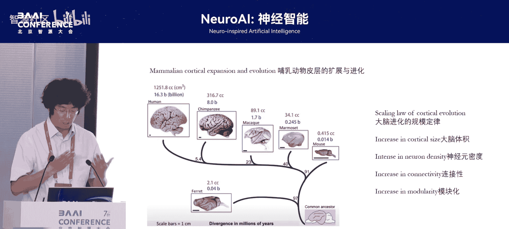

在1万年的进化过程中，哺乳动物的大脑遵循着某种程度上的规模定律。从早期的一种哺乳动物，到中期，一直到人类以及比人类更大的大象和鲸鱼的大脑，我们都可以看到体积在不断的增大。随着体积增大的是神经元密度的增多以及连接性的增多。更难能可贵的是，在这些直观的数字之下，我们可以看到大脑结构也进行了一个模块化的进化，产生了更多更精细化的分区。这些分区的功能让人类的大脑从整个哺乳动物大脑的进化过程中脱颖而出。人类以更小的大脑体积，比如说相对于鲸鱼或者是相对于大象来讲，我们的大脑体积跟重量都更小，但是我们有更好的模块化以及连接度，从而让我们具备更高的智能。这幅图就代表了整个生物智能进化的这个过程。

基于这种人类大脑进化出来的结构，让我们人类有了通用智能。我们可以看到，早期人类进化过程中，猿人从第一次使用工具来敲打石头生活，到之后学会狩猎，并且产生农业，以及之后的工程、艺术和科学。人类跟大自然的交互过程中，不断的进行探索新的工具，探索新的环境，探索新的本领。这种在不同的环境中生存以及适应下来的能力，就是智能的一个基础，也是人类智能能发展到今天的一个重要原因。这种通用人工智能让人类在不同的环境，面对新问题、新环境的时候，都能想办法用已有的知识去解构它，并且创造出一些新的方法来解决它。

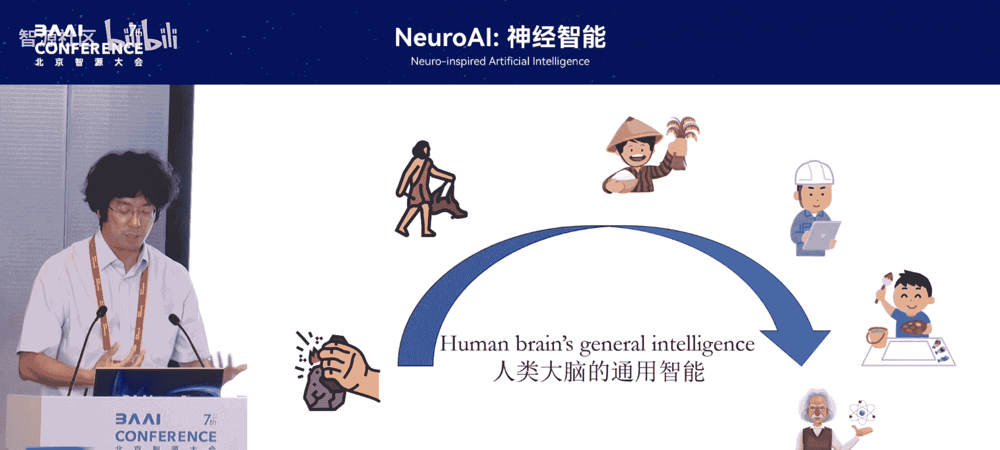

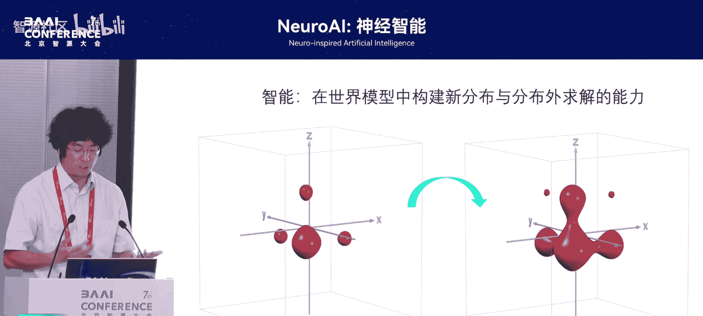

## 智能的理论化思考

前面讲的是一些描述性的内容。如果从理论的分析来讲，智能其实是构建一个新的分布，以及在分布外求解的能力。这个分布其实就是从大语言模型的角度来讲，他经过训练之后学到了一种统计模式。真正的智能不应该只是先在这个统计模式里面进行问题的求解，而更应该是面对新问题的时候，跳出这个统计模式，在新的结构里面进行求解，甚至创造出一种新的分布和新的形式。

## 人类大脑的结构与动力学机制

我们刚才讲了人类大脑进化的结构基础，以及这种结构所赋予人类智能的一些能力。现在我们再回到人类大脑，看一下到底是什么样的结构和动力学机制，支持了人类这个已知宇宙里唯一的AGI智能体。

神经科学经过一两百年的发展，也帮我们解码出了大脑的很多个机制，比如脉冲编码、频率以及不同脑区的结构等等。在这么多的原理中，我们团队提炼出了三个最重要的点，我们认为能够去概括或者说能够去生成其他大脑所具备的能力。

以下是三个核心机制：

1.  **模块化**：模块化是整个大脑的结构性基础。从整体角度看，大脑皮层大概可以分成两个模块：一个是感觉皮层，负责局域的以及快速的模式识别，进行低级信号处理；另一个是以前额叶皮层为代表的高级区域，处理分层推理、抽象和决策过程。这两个区域之间有非常强的交互。
2.  **双向调控**：模块化是结构基础，双向调控是动力学基础。低级信号能够逐层逐级进行筛选以及分析，最后送到高级皮层进行处理，然后高级皮层再反馈给低级皮层。在这种不断的反馈循环过程中，实现信息的精细化处理以及高级认知功能。
3.  **频率耦合**：大脑的不同区域有不同的震荡频率。正是这种不同的频率，让它有各自相对独立的功能。而频率的耦合，又让不同的区域能够在保持自己独立性的前提下实现功能上的整合。所以频率耦合是把前两块——模块化和双向调控——整体连接在一起的重要机制。

所以我们提出了这三个重要的基础：模块化、双向调控以及频率耦合。

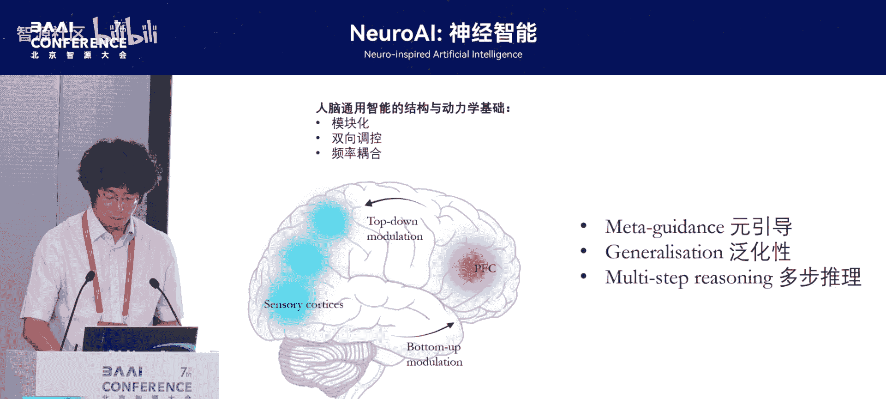

根据这三个机制，我们可以分析大脑所具备的高级认知功能的特点：

*   **元引导性**：它类似于元学习。不同层级有一个调控机制，通过这种元引导，能让人类的大脑实现自我感知以及自我纠错的能力。这是现在大语言模型所缺乏的。
*   **泛化性**：从第一点的元引导性，让大脑具备了自我认知、自我调控的功能之后，它就能够实现泛化性。因为它跟外部交互的环境每时每刻都是新的，需要不断迭代、循环、纠错，将新输入嵌入到已有的认知系统里。
*   **多步推理**：重点在于“多步”。由于有了自我纠错以及泛化性，它不至于在推理过程中出现偏差而导致最后的偏差越来越大，就像现在大模型的幻觉一样。

这是我们的一个思考，从大脑的结构提炼出了几个重要的结构动力学机制，再由动力学机制推导出它的一些认知原则。

## 人工智能的发展阶段与挑战

我们现在回到AI。刚才所讲的是人类大脑，我们看看人工智能之父约翰·麦卡锡是怎么说AI的。他认为AI是一门让模型去适应并且去解决前所未见的困难和前所未见的环境的科学和工程。他在这里非常强调AI面对新环境的能力。

我们看一下现在的大语言模型是什么样子的。我希望用这幅画来展示整个AI领域包括脑科学领域，以及AI发展的几个阶段，我们现在脑科学和AI各自处在一个什么样的阶段，以及脑科学如何继续为AI的发展提供动力支持。

以下是智能发展的三个阶段：

1.  **插值法**：经过大量学习后，把知识结构嵌入到内部模型里，解决已知的问题，生成已知的结构。因为它有一个非常好的拟合，可以在这个结构中进行抽样，所有抽样的点都符合内部结构，所以能够生成非常漂亮的文字或者图片。这是第一步。
2.  **外推法**：面对新问题时，能够跳出已有的知识嵌入结构，到结构外面去解决问题。这需要非常强的自我感知、自我调控以及自我纠错的能力，包括多步推理。从插值法到外推法体现了泛化性能力越来越强的过程。这也是人类天生具备的能力。外推法很关键的一点是可以发现问题，而插值法只能是解决已有的问题。
3.  **创新性**：这是智能领域最高的一点。我们要把对世界的认知往前推，不能停留在解决已有问题或发现问题，而更应该去创造问题。比如黎曼创造了微分几何，他不仅把高斯几何从二维平面推广到三维，更推广到无限的维度，并且在这个无限维度里面创造出了一种新的几何结构。从外推法到创新是一个非常难以逾越的过程。人类现在也是在这个山顶上。

整个AI领域现在所能达到的就是第一座山峰。我个人认为我们脑科学可以持续不断地给AI一些新的输入。

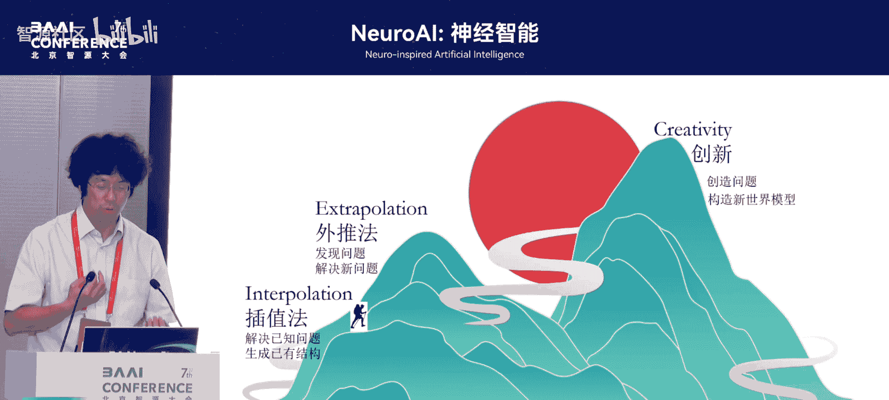

## 现有AI模型的局限与大脑的启示

刚才批判了一大堆现有AI的模型。现有AI模型主要是基于自回归的模型，比如Transformer以及衍生出来的GPT等。自回归的工作机制是基于前文所生成的内容来生成下一个部分。这样一个过程看起来非常有逻辑，也非常符合统计分布。

关键的问题是它无法进行回溯跟反馈，导致无法进行有效的自我更新和自我纠错。出现的问题包括：

*   **幻觉**：在前面生成的整个序列里，如果前面有一点出现误差，这个误差可能会被逐渐放大，最后导致完全不一样的东西。
*   **统计模式匹配**：采样都是基于已有的分布，无法进行外推。

从23年开始出现的思维链技术，以及去年开始的思维时间缩放技术，都是希望去解决自回归的本质缺陷，但带来的问题是成本海量增加，而且并不能从根本上解决缺乏自我修正的问题。

还有一个问题是现在所有大模型的嵌入空间都是单一的。但在人类大脑里，视觉皮层的处理过程有V1, V2, V3一直到IT，并且处理后会投射给前额叶皮层或海马体，有多个不同的层级化处理。大脑的嵌入空间是模块化及层级化的，跟现有大模型的单一嵌入空间完全不一样。这种多层级化的嵌入空间，让人类大脑具有更强的表征能力，可以表征非常抽象的概念或特征，并且这些特征能够稳步进行抽象。

另一个根本点是在我们大脑中，语言空间和推理空间是分开的。去年MIT在《自然》发布的一篇论文，利用人类的fMRI测试发现，人类在推理时，大脑的活跃区域和语言的活跃区域是完全不一样的。这给我们的提示是，大语言模型可能只是一个生成模型。如果把语言模型放在人类大脑的智能里面，它可能只是人类智能中一个比较低端的模块，或者说是一个把智能从真正的推理嵌入空间里解码出来，与外界进行交互的中间模块。

我们继续用画蒙娜丽莎的例子来看为什么自回归会导致这些问题。给他一个输入，然后让他继续画。他可能是根据前面的一点，就把蒙娜丽莎画出一个具有胡子，或者说他可能看到达利画的蒙娜丽莎的画，然后对他产生了一定的影响。最后一步错步步错，整幅画就不是我们想要的样子。所以这就是现有大模型基于自回归的内在缺陷。

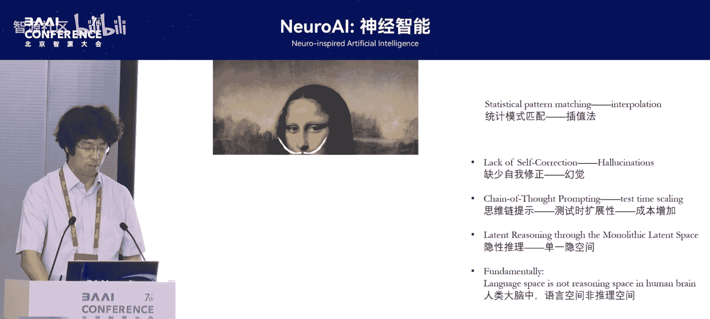

## 受大脑启发的新型模型：分层循环模型

那么真正的人类思维是什么样子呢？我们认为真正的人类思维并不是一次性学习或单一空间的推理，而是一个多次迭代，在迭代过程中不断进行自我修正的过程。这个多次迭代以及自我修正，就是由前面的三个特征——元引导能力、泛化性以及多步推理——来实现的。

我们继续用画蒙娜丽莎的例子来讲这个过程。人类在画蒙娜丽莎的时候，一开始是画一个比较粗略的轮廓，然后逐步修改，再不断地增加各种各样的细节，最后把这整幅画画出来。这就是一个不断递进、然后修改的过程。

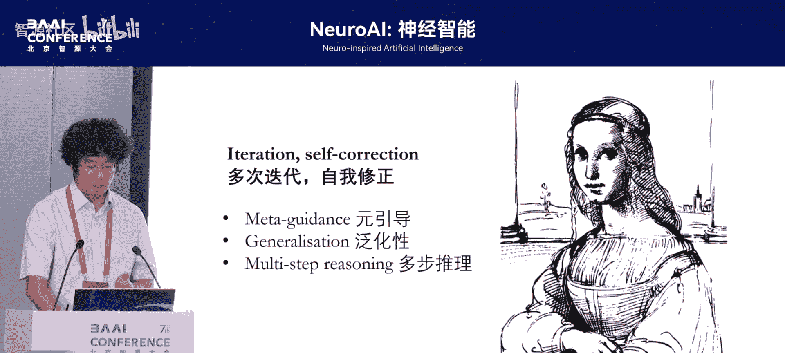

基于此，我们提出，在规模定律的背景下，我们现在所处的阶段应该是通过模仿人类大脑这种模块化的结构，设计出一种更精妙的结构，实现一个推理机器，从而把整个AI从深度学习（更强调学习统计模式匹配）推向深度推理（更强调推理和理解）。

我们根据大脑的模块化、分频以及它的相互调控，设计出了一个HRM模型，即分层循环模型。我们把整个模型分成两个部分：一部分是高级模块，模仿前额叶皮层的高级功能；另一部分是低级模块，模仿感觉皮层，实现局部信息或低级的信号处理功能。两个模块进行频繁的交互，这个交互过程模仿的就是自上而下调控和自下而上调控。并且两个模块的频率是不一样的，这也是模仿频率耦合，比如前额叶皮层的西塔波和感觉皮层的伽马波。

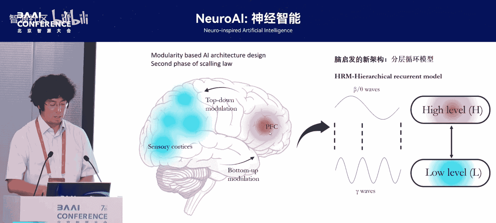

这三个就是分层、循环以及分频，这是整个模型从大脑里面得到的一个启发。

## 模型性能与工作机制分析

我们现在看一下最新的结果。在深度推理方面，我们的模型完全超越了现在所有的推理模型，比如GPT-4。我们的参数量只有GPT-4的千分之二十五，这是一个非常惊人的数字。经过模型分析，我们发现这个模型具有很强的认知灵活性以及层级维度。所谓的层级维度就是它的低级模块和高级模块表征空间的维度是不一样的。低级模块只需要比较小维度的空间去表征，而高级模块需要非常高维的空间去表征。它在这个高维空间里面进行搜索、进行运算，得到一个优化的子空间，然后把这个子空间传递给低级模块，让他在这个空间里面执行一个程序化的操作，从而实现功能上的分工以及整体推理上的优化。

这也是我们最兴奋的一个数据。我们在ARC-one和ARC-two里面做小样本学习，只有1000个题左右的训练量，然后来测试发现它远超现在所有的推理模型，比如ARC-one、Claude-3或GPT-4-o1。我们的基准测试都比他强，而且是参数量非常非常低。这就体现了当小模型真正用人类大脑的模块化、动力学机制以及分频机制嵌入到模型设计里时，它可能会真的涌现出远远超越现在AI模型的能力。

经过我们的模型分析，我们大概提出了这个模型工作机制的几个方面：

*   **元模块**：模仿慢系统，在高维空间里探索，充当领导角色。
*   **基础模块**：模仿感觉皮层，执行快系统，在低维空间里收到元模块的信号后，执行程序化的操作，所以只需要在低维空间里工作，充当员工的角色。

这两个模块不断进行迭代循环，就能够把一个非常复杂困难的任务分解，然后在各个子空间里寻找最优解，最后达到一个稳定点。

这是我们的主成分分析，对模型在数独任务中的过程进行分析。每一条线代表它在整个解题过程中走的多个步骤的状态。我们可以看到，在几十道题解题的过程中，它遵循一个比较固定的思维方法，确实是沿着这个方法在进行思考。整个解题过程有一个思维上的波折，反复进行思维的过程，最后到达一个比较优化的区域之后，在这里循环迭代好几次，就达到正确的答案。

对于非常难的题，它需要多个步骤进行推理的时候，我们可以看到它的思维路径跟前面简单任务的思维路径是一样的，但是不同点在于它中间的部分停留了很长时间，再进行迭代思考，然后不断优化自己的约束。但整个思维的路径是跟前面解简单任务时是一样的。也就是说它学到的方法是非常一致且具有很强泛化能力的。

我们把刚才状态空间的结果还原成真正的解题答案。可以看到，输入后，它思考第一步大概有50%的正确率。之后经过多步迭代，正确率一直停留在50%到60%之间，最后突然一步似乎是顿悟了，直接就把所有的题都解答出来。这非常符合人类思考的过程。我们在解一个非常难的题的时候，并不是一个线性的解题过程，而是刚开始可能会有一个思维跃升，找到一部分答案，但是会停留在中间思考很长时间不得其解。当你对整个问题有非常深入广泛的理解，并把它跟其他问题建立内在联系时，你可能突然在某一刻把所有问题都解开。

所以这个模型在0.027B的参数量的情况下，已经能够涌现出人类大脑所具备的一些非常深刻的思维方式了，包括它能够体现出一个自我更正过程。比如在解题过程中，一开始某个位置是对的，之后有解错。解错的过程，很有可能是它通过降低局部的正确率来满足整体约束的提升。当整体约束逐步提升之后，它再返回到这个地方，再对它进行修正。这也非常直观地表现了这个模型具有很强的自我修正能力。

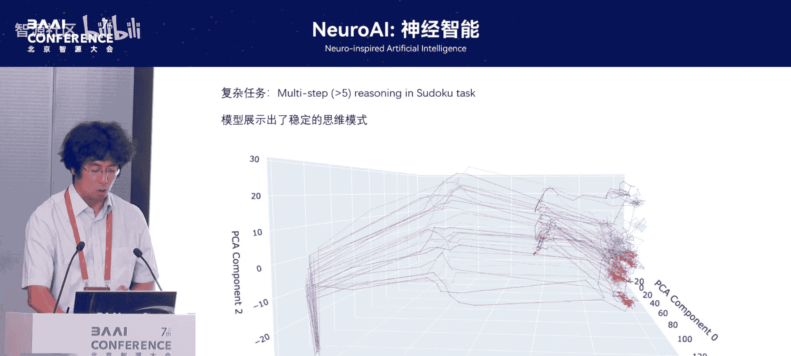

## 总结与展望

本节课中，我们一起学习了从生物通用智能到人工通用智能的演进路径。我们探讨了人类大脑通过模块化、双向调控和频率耦合等机制实现高级认知功能，并指出了当前主流自回归AI模型在自我修正和泛化能力上的局限。受大脑启发，我们介绍了一种新型的分层循环模型，该模型通过模仿大脑的结构与动力学，在小参数量下展现出了强大的推理能力和自我修正特性，为迈向更通用、更可靠的人工智能提供了新的思路。

这个工作是由智源研究院领导，与北大、清华一起合作的。这是团队的核心人员，谢谢大家。

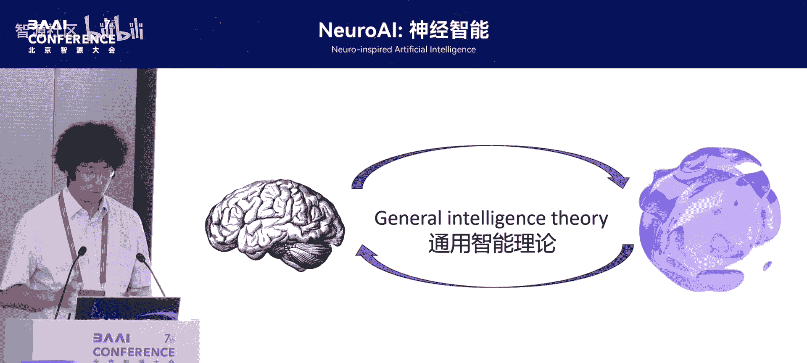
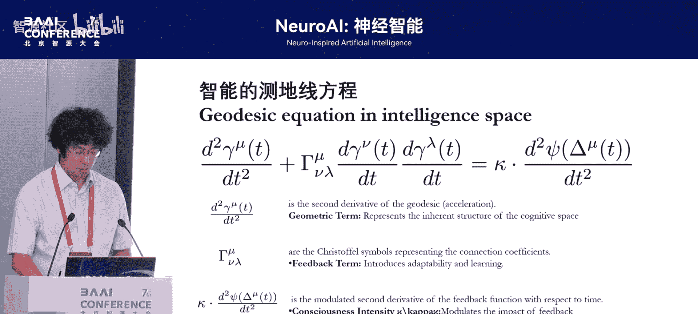

**【问答环节】**

**提问者**：谢谢卢老师的分享，特别有意思。你的结果特别神奇，相比GPT-4的671B参数，你只有0.02B的模型量就能比它更好，我们非常震惊。那底层的逻辑是什么？底层的算法、PFC交互，它底层是用传统的神经网络吗？还是说这个模型它有两个架构是传统的神经网络吗？

**卢萌**：对，这只是纯Transformer所构建的。

**提问者**：就PFC也是用Transformer，感觉皮层也用Transformer？

**卢萌**：对对对。这个模型神奇的地方就在于，它的初始状态，这两个模块都完全是一样的。但是你用不同的频率去训练它的时候，它会涌现不一样的能力。比如你让顶层的元模块的频率和底层的模块是一样的时候，它的能力就比较差。然后当你让它多跑几次的时候，下面也都多跑几次，也就是说让它有更多的机会去发掘这个问题的时候，它就能学到一个更强的能力。这就很像我们人刚出生的时候，默认设置都差不多，但是你经过后天不同的教育，你会涌现不一样的功能一样。

**提问者**：好的，谢谢你。

**卢萌**：谢谢，谢谢大家。