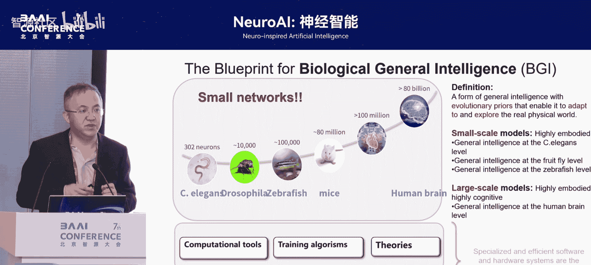
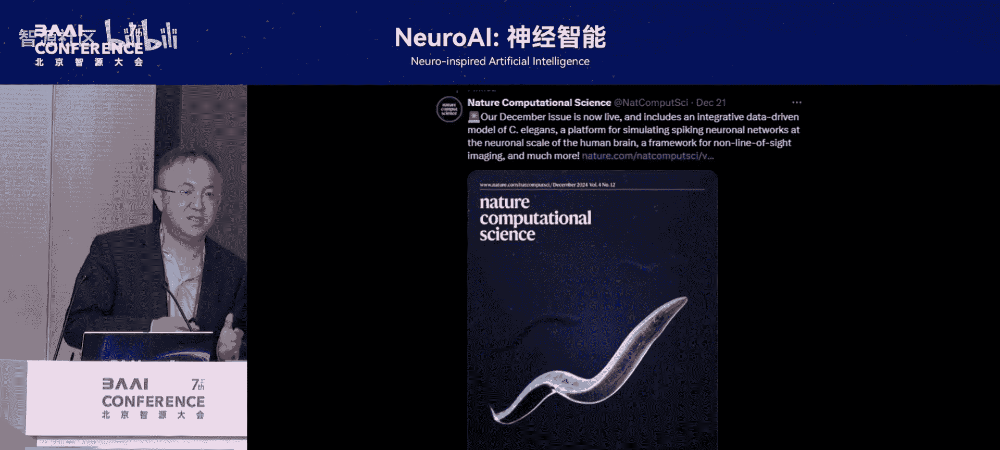
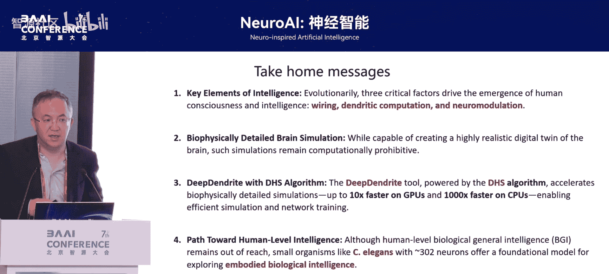

# NeuroAI：-神经智能-p04-数字大脑：杜凯

在本节课中，我们将学习构建数字大脑这一宏伟目标所面临的挑战、历史发展脉络以及一条可能的新路径。我们将探讨大脑模拟与人工神经网络的区别，并了解如何通过新的计算工具和算法来逼近对生物智能的模拟。

## 从梦想出发：模拟大脑与意识

上一节我们介绍了课程的整体背景，本节中我们来看看演讲者最初的梦想与动机。

十几年前，我开始科学生涯时，有一个梦想：有朝一日能够模拟人类大脑，并进一步模拟人类意识。在2006年，这被认为是人类文明的终极问题，当时我认为几百年内都不可能解决。

比较幸运的是，最近几年，我认为我们可以将人类的这个终极问题放在科学范围内进行讨论，并提出具体可行的解决方案。

## 自然智能的三个关键原则

上一节我们提到了模拟大脑的梦想，本节中我们来看看实现这一梦想可以借鉴的自然法则。

做神经科学、脑科学的人与做大模型的人有一个不同点：我们特别喜欢提“进化”这个词。进化为我们提供了具体的案例来借鉴宏观问题。

以下是自然智能在进化中展现出的三个关键原则：

1.  **网络规模增大**：随着进化，神经网络变得越来越大。
2.  **神经元结构复杂化**：神经元从一个简单的点模型，其树突逐渐变得庞大且复杂。这些庞大的树突不是被动的装饰，其本身具有非常强大的计算能力。
3.  **神经调制的出现**：除了人工神经网络中常见的突触权重（兴奋和抑制）外，大脑里还有另一套系统，称为神经调制。在进化中，它对意识起着越来越根本性的作用。

这就提出一个很有趣的问题：如果现在的人工神经网络只沿着第一个原则（增大网络规模）的道路往前走，我们有没有可能把这三个原则都放在一起，构建出新的智能？

## 大脑模拟的两条历史道路

上一节我们探讨了自然智能的原则，本节中我们回顾一下试图模拟大脑的两条历史发展道路。

神经计算与大脑模拟是一个历史非常久远的学科，可以回溯到上世纪四五十年代。它沿着两条不同的道路发展：

1.  **连接主义道路**：把神经元看成是一个点模型。这条道路发展出了我们现在熟知的大模型。
2.  **还原论道路**：沿着还原大脑、还原真实大脑的角度发展。这条道路模拟了离子通道，并用**电缆理论**模拟树突的形态。

今天，大脑精细模拟主流向两个方向走：
*   以**欧盟人脑计划**为代表，坚持沿着还原真实大脑的道路前进。
*   最近几年出现了一个令人兴奋的发现：单个精细神经元的计算能力和学习能力与一个人工神经网络相当。这意味着单个真实的神经细胞本身具备非常强大的计算能力，不能简单看成是一个点模型。

## 早期项目留下的经验与教训

上一节我们回顾了大脑模拟的历史，本节中我们来看看从早期先锋项目中获得的经验与教训。

我博士期间有幸加入了欧盟人脑计划这个大脑模拟的先锋项目。回过头看，这些项目带给我们的不仅仅是成就，更多的是经验和教训。

以下是当时发现的几个关键问题：

1.  **需要新的工具**：大脑模拟领域使用的计算工具非常落后，没有与当时先进的GPU等并行计算平台结合。
2.  **需要新的算法**：大脑建模领域有一个被诟病的地方：过去认为只要按照实验数据把细胞搭建起来就完成了。但一个关键问题是，实验很难测出突触上的权重是如何形成的。我们需要新的规则或算法来赋予网络权重，不能只搭建一个空的框架。
3.  **需要新的理论**：大脑精细模拟体系过于复杂，导致我们无法用数学方法对其进行分析。许多根本性问题（如兴奋抑制平衡）无法给出确定性答案。

## 攻克核心挑战：高效并行仿真算法

上一节我们总结了面临的挑战，本节中我们深入探讨如何解决第一个也是最基础的问题：计算工具。

首先，在神经科学领域最流行的仿真软件是**NEURON**。它开发于上世纪90年代，代码历史悠久。一个致命弱点是，它在90年代的环境下开发，没有充分考虑如何做并行计算。

这里需要一点数学知识来解释如何模拟一个真实的神经元。我们一般将一个细胞分段，每段称为一个**房室**。房室可以电路化，离子通道和树突可以用方程描述。

*   描述离子通道的**霍奇金-赫胥黎方程**：
    `I = g_Na * m^3 * h * (V - E_Na) + g_K * n^4 * (V - E_K) + g_L * (V - E_L)`
*   描述电信号在树突上传导的**电缆方程**：
    `(λ^2 * ∂²V/∂x²) - τ * ∂V/∂t - V = 0`

真实的神经元形态复杂，一个神经元可能分成几百段，每段有几十个偏微分方程。真正的挑战在于树突结构带来的计算依赖顺序。

1984年，Michael Hines提出了一个巧妙的方法：用数值方法解一根树突上所有房室的电压，可以写成一个迭代式 `V_{t+1} = A * V_t`，其中系数A是一个矩阵。对于树状结构，这个矩阵变成了带有稀疏点的矩阵，每个点对应树突的分叉。解这个矩阵只能用高斯消元法，从而带来了行与行之间的依赖关系，导致很多人认为只能串行计算。

我们团队花了一年时间研究代码，发现第一个障碍是数学问题：如何高效并行地解这个稀疏的三对角矩阵？最后，一位博士后从组合数学的角度出发，设计了一个最优算法：从每个树突的末梢开始向前并行计算。数学证明，对于典型的树突结构，使用约10个线程就能达到最高效率，因为神经元树突总有一根特别长的主干，约束了并行效率。

解决了数学问题后，还需要根据GPU硬件特点设计高性能算法来进一步提升效率。最终，我们整合的算法与NEURON相比：
*   在CPU上效率提高了2到3个数量级。
*   在GPU上效率提高了1个数量级（我们的方法比CUDA库中的标准解法还要高一个量级）。

这个方法已被整合到英伟达的GPU框架中，未来将成为工业级的新标准。在此基础上，我们将高效仿真器与深度学习模块整合，形成了一个新框架，不仅能高效仿真精细神经元，还能用于学习任务。

## 迈向通用生物智能的猜想

上一节我们解决了高效计算工具的问题，本节中我们展望未来，探讨模拟更高层次智能的可能路径。

在做了这些尝试后，我回过头思考最初的问题：如何模拟人类大脑及意识？虽然前三个问题（工具、算法、理论）有所进展，但最后一步仍没有头绪。

以下是我最近几年的一点设想和猜想：

与通用人工智能并行，可能存在一条**通用生物智能**的道路。我们经常被问：有什么是你能做而AI不能做的？答案是：**小网络**。例如，只有302个神经元的线虫，能在水下环境中自由、鲁棒地导航；只有10万个神经元的斑马鱼，能在复杂水下环境中游动。这是当前AI难以做到的。

生物通用智能的一个巨大特点是具有非常强的**强具身能力**。人类的认知能力是建立在这种强具身基础能力之上进化出来的。只要我们沿着模拟大脑的道路前进，创造出的任何智能体都一定会遵循这个规则，与当前的通用人工智能非常不同。

## 案例分享：线虫智能体的构建

上一节我们提出了通用生物智能的猜想，本节中我们通过一个具体案例来看看初步的实践。

这里快速提一下与马雷老师及智源合作构建的线虫智能体项目。除了要与环境交互这一核心原则外，该项目的一个亮点是：我们使用梯度下降等人工智能方法，仅通过让智能体全局动力学的关联矩阵与实验数据一致（类似于一个统计约束），就训练出了网络中的突触权重。

在此基础上，固定这些权重，再训练权重与肌肉之间的连接等简单特征，就能让这个线虫智能体在模拟环境中像真实线虫一样运动起来。这展示了通用生物智能的初步威力。

## 总结与核心观点

本节课中我们一起学习了构建数字大脑的历程与思考。

以下是几个核心观点：

1.  **自然智能的关键要素**：除了增大网络规模，**树突计算**和**神经调制**是与点模型同等根本的原则。
2.  **大脑精细模拟的目的**：是创造一个与真实大脑一样的数字孪生体。其核心挑战曾是巨大的计算代价，目前我们通过新的并行算法已初步解决了这个问题，使得模拟万级或十万级精细神经元模型成为可能。
3.  **通用生物智能的路径猜想**：真正的、基于自然的智能一定具备**强具身能力**，需要在真实或逼真的环境中进行训练。我们可以从线虫、斑马鱼等小生物开始，采用“两头逼近”的方法，共同探索真正的生物通用智能。

---

### 问答环节精选

**提问**：大脑模拟很大程度上基于电活动，但大脑显然不仅仅是电活动（如胶质细胞等慢系统）。你认为我们应该模拟到哪个细节？是实验手段的障碍，还是现阶段关心智能还不需要考虑这些？

**回答**：
1.  首先稍作纠正：即使胶质细胞，其功能也最终作用于电活动。某种意义上，人类和一个高级机器人差别不大，都是靠电驱动的。这让我坚信模拟人的智能和意识一定会成功。
2.  其次，模拟到多细取决于你期望智能体在真实环境中的能力有多强。点模型之所以简单，是因为它通常接受压缩的、简单的感官输入。树突之所以进化得如此复杂，就是为了整合多模态、高密度、高精度的感官输入。因此，环境越逼真，感官输入越丰富，就越需要带有复杂树突的神经元模型。这是我的一个当前猜想。