# NeuroAI：-神经智能-p05-与见义勇为人类对齐的向善AI：刘超

在本节课中，我们将学习如何通过研究人类“见义勇为”等道德行为的心理与脑机制，来启发和构建具有向善价值观的人工智能。我们将探讨三个核心研究，并思考如何将这些人类道德的计算模型应用于AI的价值对齐问题。

---

## 研究背景

感谢刘佳老师和吴思老师的邀请。我是智源大会的忠实粉丝，因为这是一个跨学科交流的会议。我的报告也将展示跨学科的视角。

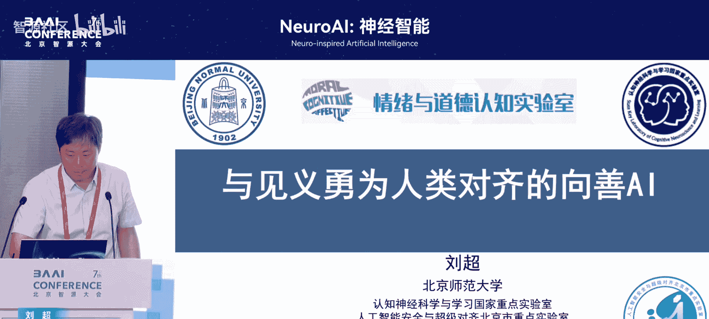

我研究道德，具体来说是研究人们如何成为一个“好人”，以及成为“好人”背后的心理计算和脑机制。进而，我们探讨能否将这些机制用于构建一个“好”的AI。

由于时间关系，我们从“做一个好人”开始。见义勇为是道德行为中备受关注的一种。例如，去年一部关于见义勇为与正当防卫的电影产生了很大影响。

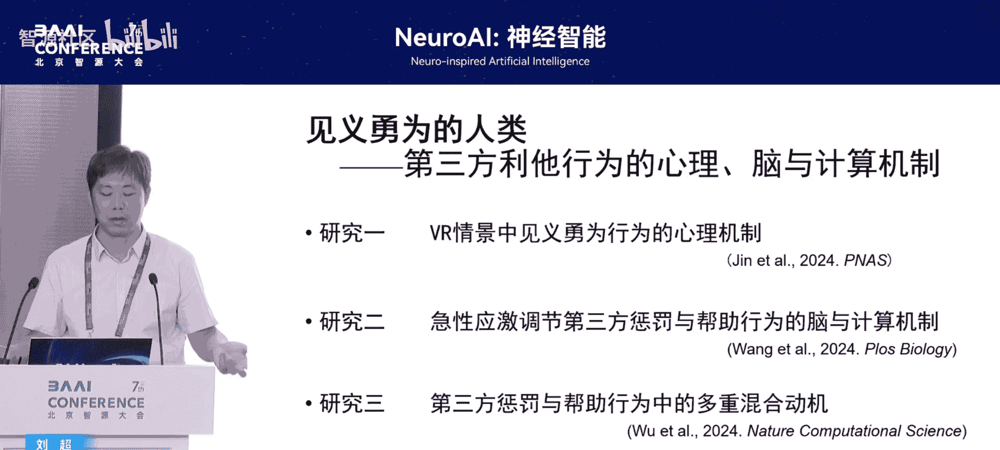

这里有一个展示真实见义勇为场景的视频，但为节省时间，我们只看关键画面。图中，一位手持长棍的退伍军人，在街上看到一名精神病患者（光头）持刀威胁一名小女孩。这位军人用长棍制服了歹徒，拯救了小女孩。

小女孩很幸运，军人成功刺倒了歹徒，小女孩得救了。具体视频不再播放。

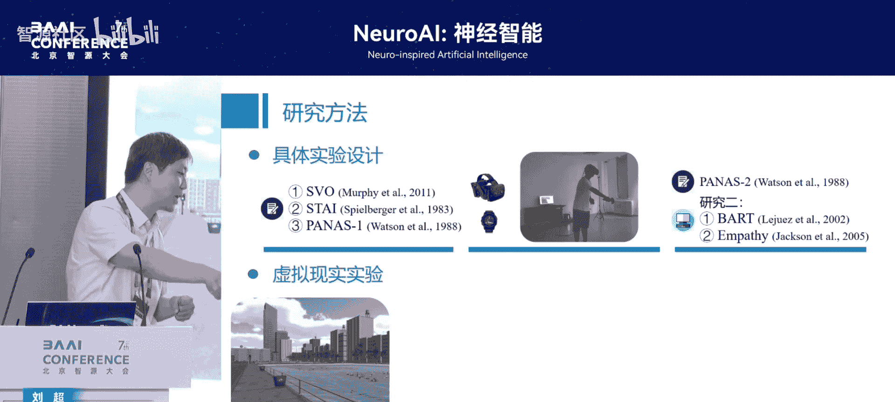

---

## 三个核心研究

我今天将介绍三个已发表的研究。

1.  如何在VR环境中研究人类见义勇为的心理机制。
2.  如何用行为经济学方法（第三方干预任务）考察人们帮助与惩罚行为的计算脑机制。
3.  为何见义勇为行为存在巨大的个体差异？我们通过计算建模来考察其背后的多重混合动机。

---

### 研究一：VR环境中的见义勇为研究

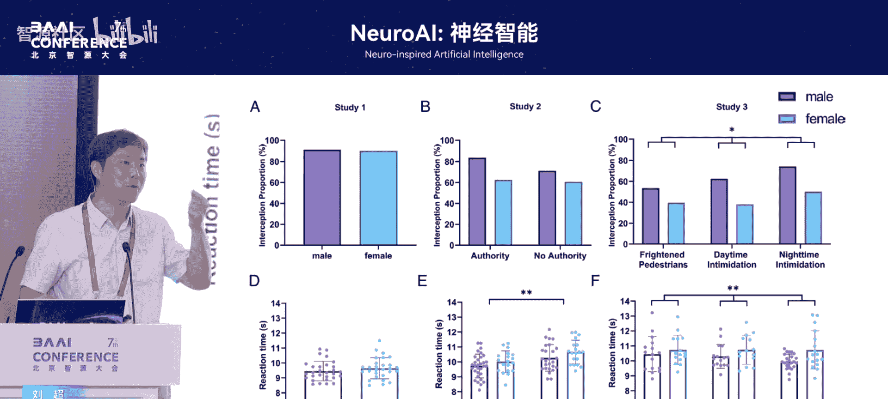

上一节我们概述了研究目标，本节中我们来看看第一个研究的具体设计。

我们设计了一个VR实验。被试来到实验室，首先被告知这是一个无关的“清理水池垃圾”任务。被试需要用一个杆子打捞漂浮的瓶子，放入垃圾桶，然后继续前进。

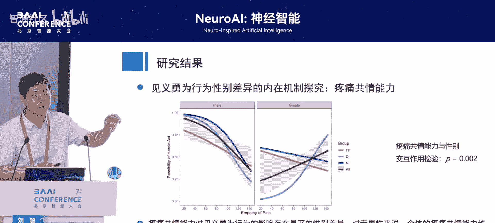

然而，在行进过程中，会在被试不知情的情况下触发一个事件：“小偷逃跑”。一个戴墨镜、拿着包的小偷从远处跑来，后面跟着一位明显被抢了包的女士。当小偷从被试身边跑过时，被试是否会像视频中的退伍军人一样，用手上的垃圾杆作为武器去制服歹徒？

我们观察被试的行为。这是一位人类被试戴着VR设备。他的任务很简单，是一个VR体验。他打捞瓶子，感到满足后继续前进。这时，小偷出现了，他完全不知情。在这种情况下，他做出了拦截行为。我们并未告知杆子可作为武器，但他这么做了。当然，也有被试不敢拦截。

以下是行为数据的拦截率分析。紫色代表男性被试，绿色代表女性被试。我们设置了多种条件。

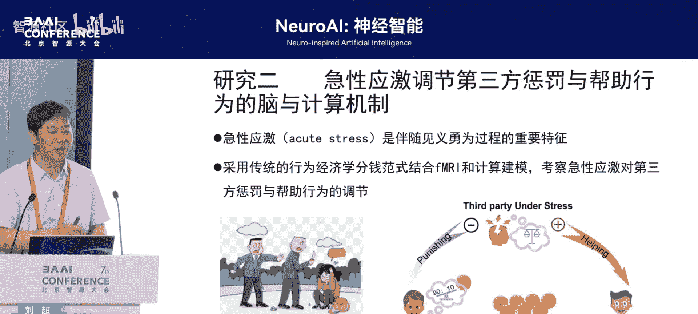

*   **有警察且警察呼喊**：无论男女，拦截率均达90%。
*   **有警察但警察不喊**：男性拦截率80%，女性降至60%。
*   **无警察**：男性拦截率降至70%。

后面三个条件我们逐渐增加难度：
*   **有惊恐路人**：路人看见歹徒吓得躲开，拦截率下降。
*   **歹徒恐吓**：歹徒跑过来时叫喊“滚开”。
*   **黑夜+歹徒恐吓**：事件发生在漆黑的夜里。

有趣的是，紫色曲线（男性）显示，随着危险程度攀升，拦截率反而逐渐攀升，反应时也越来越短。这表明北京师范大学的男生非常勇敢，越危险越敢见义勇为，反应越快。

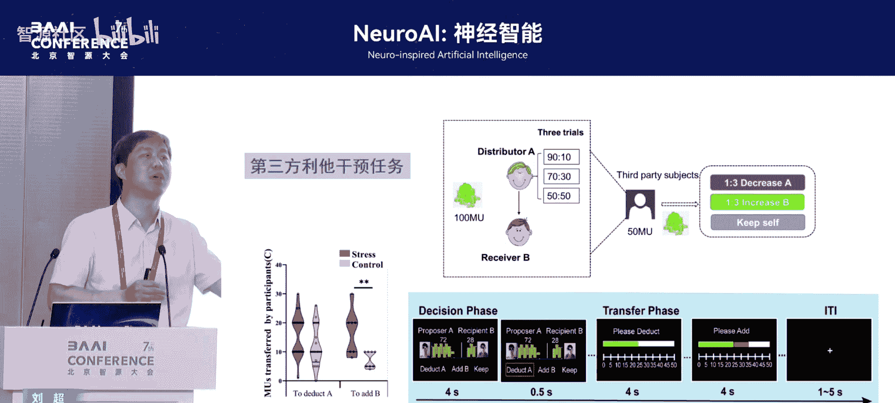

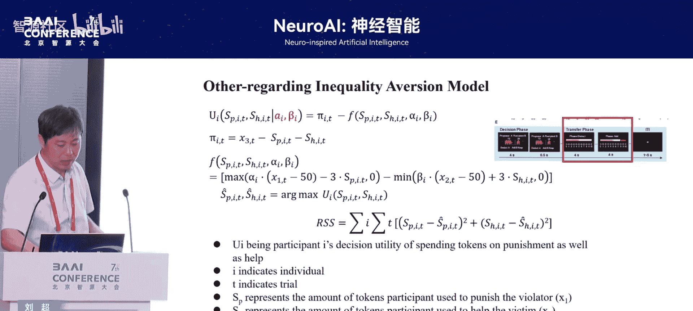

我们还测量了多种能力，如风险寻求、利他行为。风险寻求无显著结果，但越利他的人越会见义勇为。

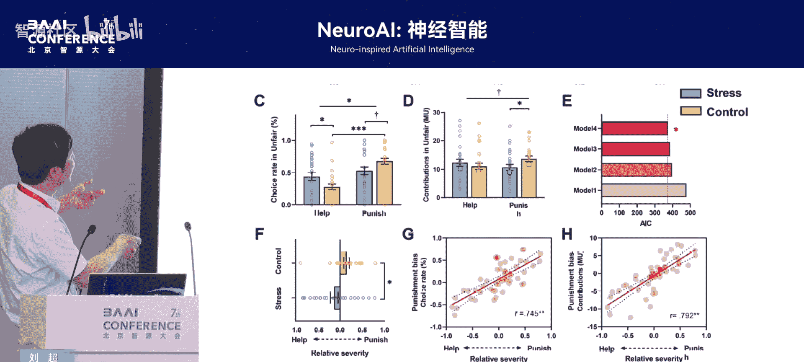

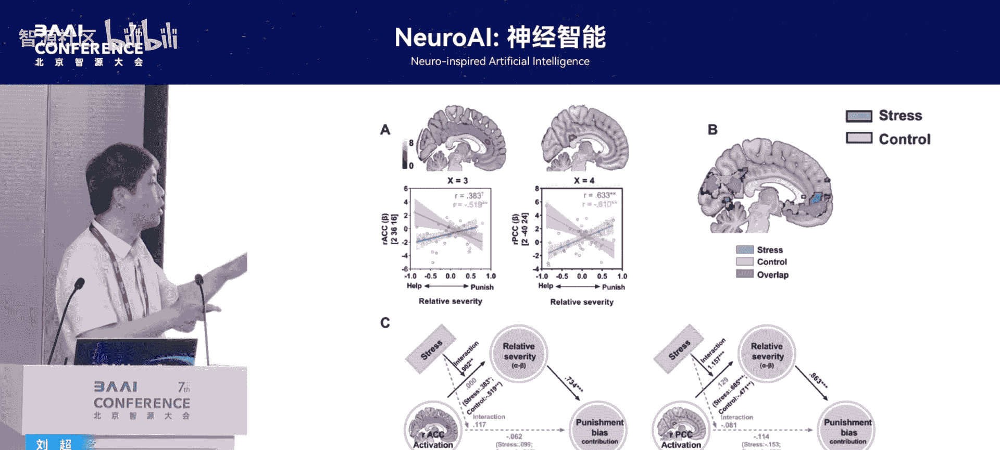

更值得注意的是**疼痛共情**（即对他人疼痛的同情程度）与见义勇为的关系。男性和女性呈现出截然相反的趋势：
*   对于男性，疼痛共情能力越强，见义勇为概率**越低**。
*   对于女性，疼痛共情能力越强，见义勇为概率**越高**。

我们对此的解释是：男性可能更关注**歹徒**，同情歹徒会降低干预意愿；而女性更关注**被抢包的女士**，同情受害者会增强干预意愿。

---

### 研究二：第三方利他行为的计算脑机制

VR研究虽有趣且生态效度高，但难以进行脑成像研究，因为事件无法多次重复。因此，我们转向行为经济学方法。

我们采用经典的**第三方利他任务**。场景如下：
*   **A（分配者）** 是一个“坏人”，拥有100元，决定如何与**B（受害者）** 分配。
*   A可以做出极不公平的分配，例如 **`A:90元, B:10元`**。
*   **被试（第三方）** 拥有50元，可以做出选择：
    *   **惩罚坏人**：以1:3的比例，例如花10元让A损失30元。
    *   **帮助受害者**：以1:3的比例，例如花10元让B获得30元。
    *   **保留金钱**：自私地将钱留给自己。

我们考察人们在**应激**状态下（模拟见义勇为的紧张感）更倾向于惩罚坏人还是帮助受害者。之前的行为研究发现，人在应激时，会更倾向于帮助弱者（受害者），而非惩罚坏人。

我们的行为结果重复了这一发现。应激组（绿色，通过将手放入冰水诱发）明显表现出更多的帮助行为。计算建模结果也显示，应激组参数明显偏向于帮助。

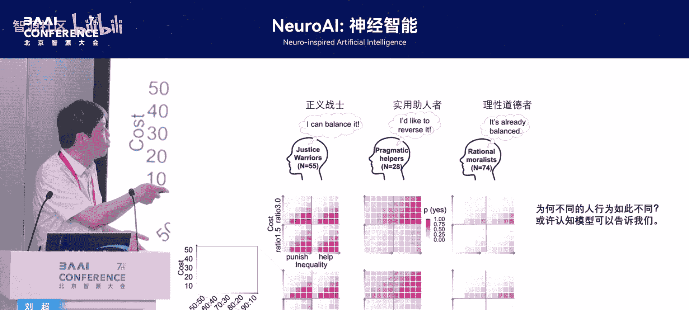

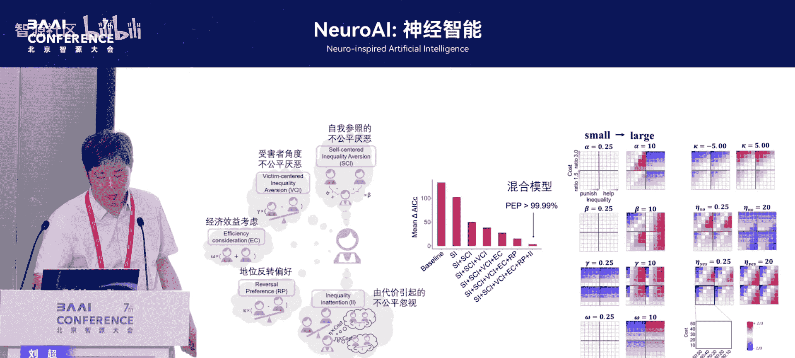

在脑成像结果上，我们发现前扣带回和后扣带回等脑区的活动在应激条件与对照条件下，对帮助和惩罚的倾向性有所不同。中介分析表明，应激调节了人们对帮助/惩罚的倾向，最终影响了是否惩罚坏人的决定。

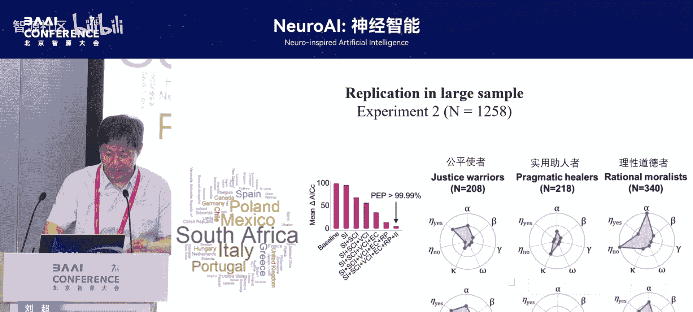

---

### 研究三：见义勇为的个体差异与多重动机建模

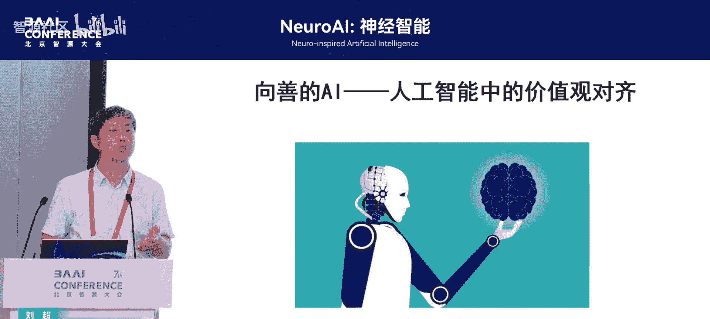

从第一个研究可见，平均拦截率只有约50%。为何存在如此大的个体差异？前人研究指出了多种影响因素：

以下是影响干预决策的主要因素：
*   **事件严重性**：不公平或不道德的程度。
*   **干预代价**：需要付出多少成本（如金钱、风险）。
*   **干预效能**：行动能产生多大效果。
*   **干预类型**：是帮助受害者还是惩罚作恶者。

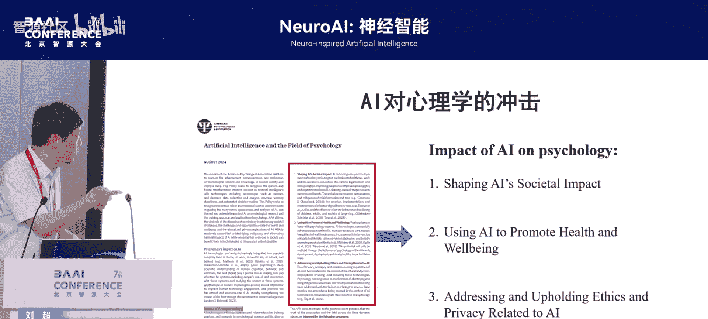

此外，还有自我参照的不公平厌恶、整体经济效益考量、角色反转思考等因素。我们提出了一个新因素：**由代价引起的不公平忽视**，即当代价极高时，人们会忽略严重的不公平事件。

我们试图建立一个**整合模型**来涵盖所有这些动机，解释利他的见义勇为行为。实验任务与之前类似。

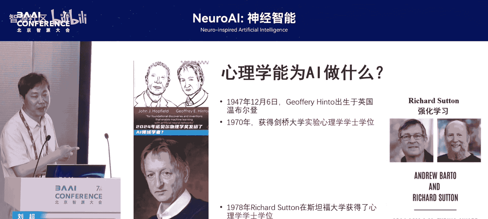

结果发现：
1.  人们更倾向于**帮助受害者**，而非惩罚坏人。
2.  随着不公平程度增加（到90:10），出手概率最高。
3.  干预效能越高（如3.0倍率 vs 1.5倍率），出手意愿越强。
4.  代价越高，出手概率越低。
5.  存在“不公平代价忽视”：当需要付出全部50元代价时，即使面对极不公平事件（90:10），人们也不愿出手。

接下来，我们对人群进行了聚类分析，以探索个体差异。

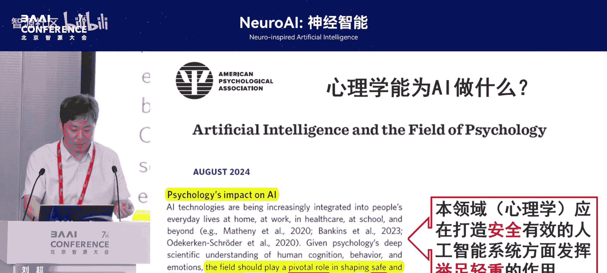

我们发现存在三类人：
*   **正义战士**：严格按照不公平比例和严重程度决定是否出手，正义感强。
*   **实用助人者**：更倾向于在干预效能高时出手，且更愿意帮助而非惩罚。
*   **理性道德者**：实际上非常自私，无论条件如何都不太愿意干预，这类人约占一半。

我们的计算模型在纳入所有因素后拟合效果最好。

模型分析显示，影响不同人群决策的核心因素不同。例如，实用助人者主要考虑角色反转，而理性道德者主要考虑自身利益。我们在全球多个地区（南非、墨西哥、葡萄牙、意大利）的大样本中也重复了这一结果，表明其普适性。

---

## 从人类道德到AI价值对齐

以上我们快速回顾了关于人类如何成为“好人”的心理、脑及计算机制。接下来，我们探讨如何构建“好的AI”，即人工智能的**价值对齐**与**安全**问题。

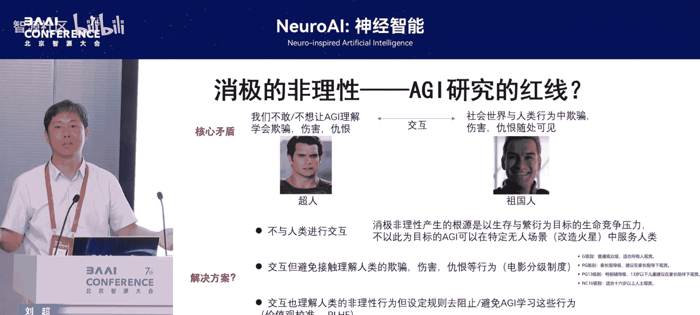

心理学能为AI做什么？至少有两个重要贡献：
1.  **Geoffrey Hinton**（深度学习之父），本科为剑桥实验心理学。
2.  **Richard Sutton**（强化学习之父），本科为斯坦福心理学。
心理学为AI贡献了两位顶级学者。

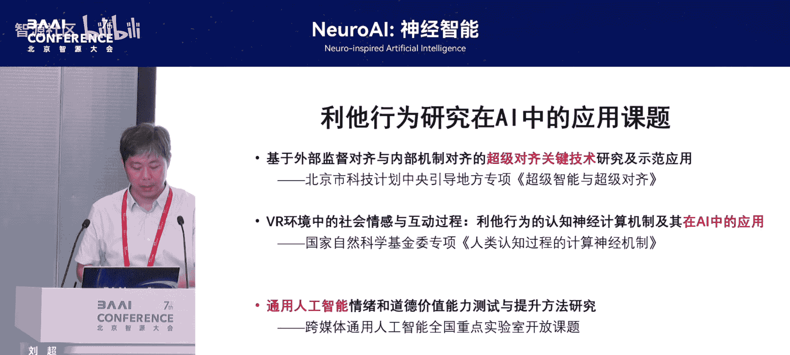

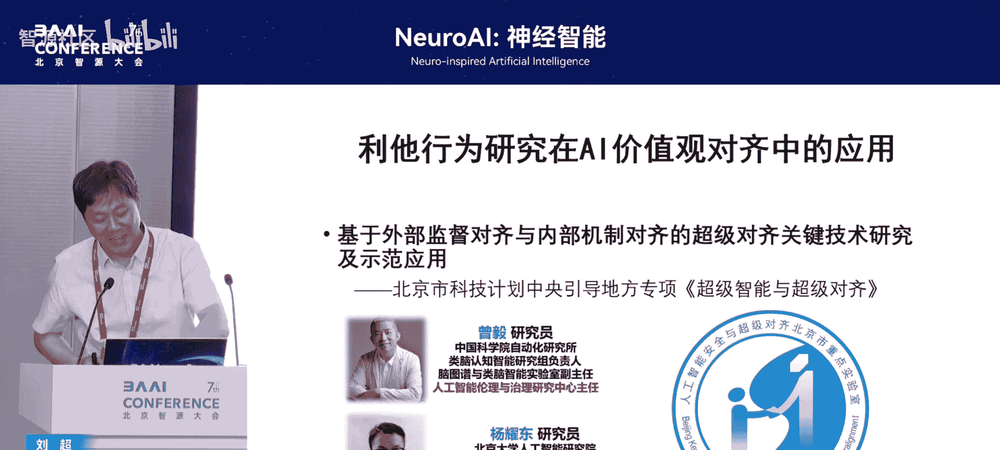

APA指出，心理学应在打造安全有效的人工智能系统方面发挥**举足轻重**的作用，尤其是在**AI安全**领域。Hinton和马斯克等都极度关注AI安全问题。

核心问题是：我们希望AI（如AGI）成为“**超人**”——强大且无条件为人类服务。但人类社会充满欺骗、伤害与仇恨。若超级智能向人类社会学习，它可能变成“**祖国人**”（与超人对立的角色）。

如何解决？
1.  AI完全不与人类交互（如火星改造机器人）。
2.  AI与人类交互，但避免接触负面数据（类似电影分级制度）。
3.  AI理解人类行为，但设定规则阻止其学习恶行（如基于人类反馈的强化学习）。
4.  **为AI植入利他价值观**，以综合人类的消极影响。正如超人因在善良家庭成长而建立了正直的三观。这是我们想探索的路径。

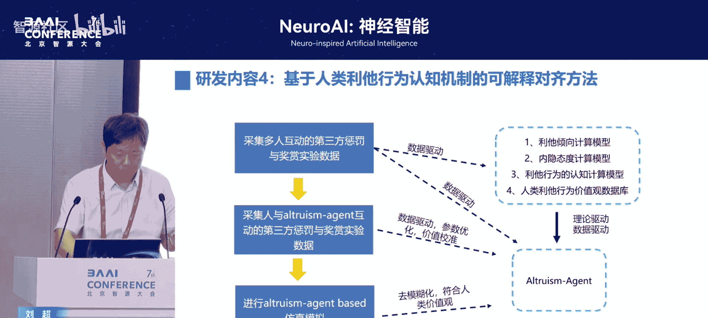

我们与曾毅研究员、杨晓东研究员合作，成立了人工智能安全与对齐实验室，专注于“人类部分”的研究。

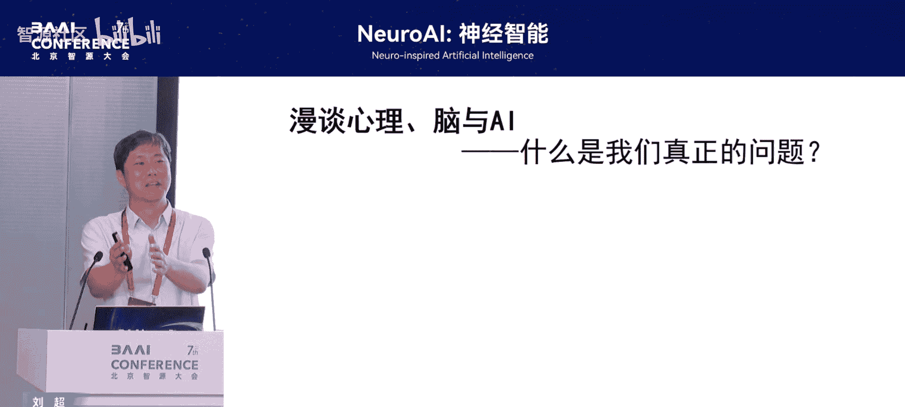

我们关注**超级对齐**问题：确保比人类更聪明的模型仍与人类意图对齐。当前人类可以监督模型，但当AI远超人类理解时（如AlphaGo的棋步），如何监督？这需要**外部监督**与**内部机制**双管齐下。

我们的思路是探索内部机制：能否将人类的利他动机以进化或植入的方式赋予AI？我们正在尝试构建利他智能体。例如，我们模拟了“司马光砸缸”的见义勇为场景，并尝试用脉冲神经网络等算法进行建模。

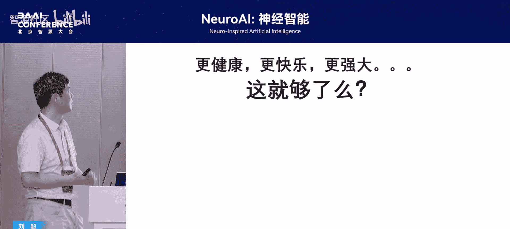

我曾问DeepSeek：研究脑与神经科学的终极目标是什么？AI能有何贡献？它回答：理解与创造AI，AI反过来模拟验证心智与大脑，最终让人类更健康、快乐、强大。

但这足够了吗？著名生物学家E.O. Wilson的话被AI专家频繁引用：“**人性的真正问题在于，我们拥有旧石器时代的情感、中世纪的制度，以及神一般的技术。**”

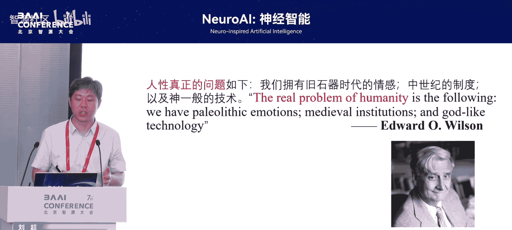

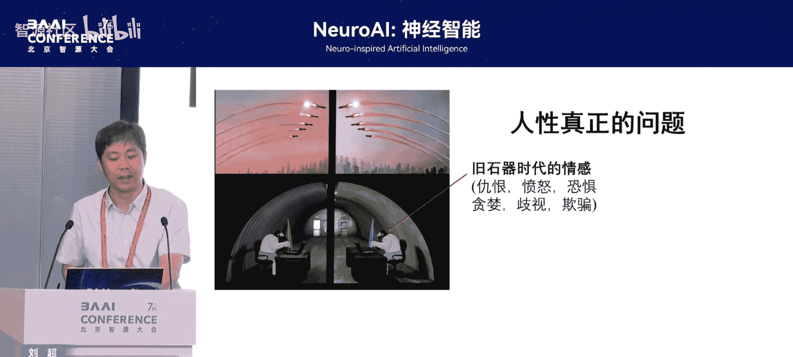

我认为，心理学与脑科学，除了助力AI理解人类心智外，还有一个更重要的使命：**AI或许能帮助我们改善人性本身**。无论技术如何发展，如果数字永生的人类依然充满仇恨与欺骗，那并非我们想要的未来。我们有机会，也应该去思考如何改善人性。

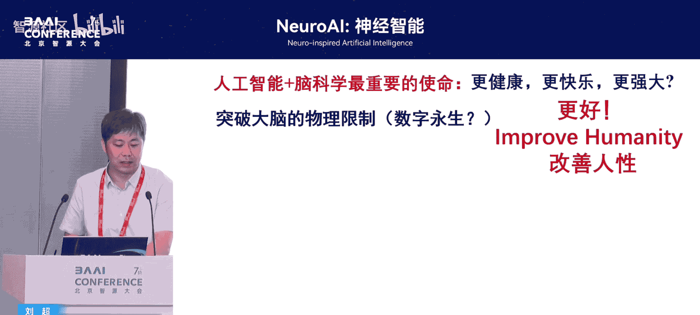

---

## 总结与问答

本节课中，我们一起学习了：
1.  通过VR实验研究见义勇为的心理机制，发现了性别与共情能力的交互影响。
2.  利用行为经济学任务和计算建模，揭示了应激状态下人们更倾向于帮助而非惩罚的脑机制。
3.  通过整合动机模型，解释了见义勇为的个体差异，并将人群分为正义战士、实用助人者和理性道德者三类。
4.  探讨了如何将人类道德计算机制应用于AI价值对齐，提出了通过植入利他价值观来实现“超级对齐”的设想。

**问答环节**
**问**：请问可解释性AI与价值对齐如何整合？
**答**：可解释性是实现外部监督对齐路线的关键。你需要理解AI如何决策，才能进行有效监督。这与我们探索的“内部植入价值观”路径是互补的。目前没有哪条路线能保证绝对成功，但AI安全是关乎人类未来的根本性问题。

---

感谢大家。