# NeuroAI：-神经智能-p06-基于数字大脑的意识永生：刘泉影

在本节课中，我们将探讨一个前沿且宏大的主题：如何利用人工智能与神经科学技术，实现人类意识的数字化与“永生”。我们将从科幻概念出发，逐步深入到具体的技术路径、方法论和面临的挑战。

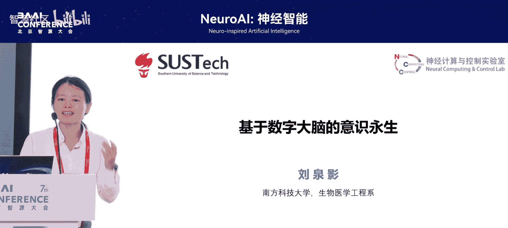

## 概述：什么是意识永生？

一般而言，我们理解的意识永生是“肉体苦弱，机械飞升”。人类的肉体很脆弱，灵魂（意识）也很脆弱。但如果能让灵魂意识数字化，让大脑数字化，我们或许就能在数字世界中实现意识层面的永生。这是科幻作品和游戏中的常见设想。

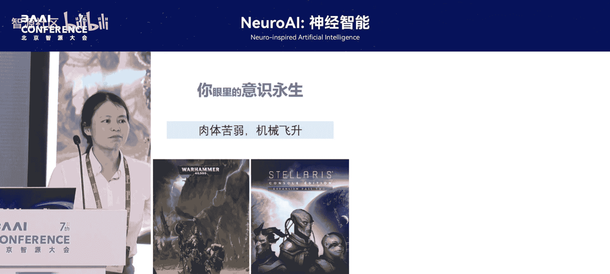

然而，在神经科学家眼中，意识永生（或称“心智上传”）是一个非常现实的技术实现问题。其核心在于，如何将个体独特的大脑活动、思维模式乃至人格，完整地复制并运行在一个数字载体上。

## 实现意识永生的技术路径

以下是实现意识永生可能采取的几种途径，这些路径与当前人工智能的发展思路高度一致。

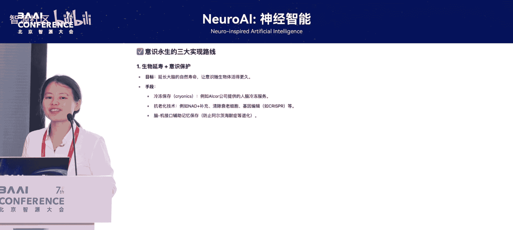

1.  **肉体延寿**：从秦始皇时代起，人类就追求长生不老。但基于当前科学水平，仅通过维持肉体来实现永生的可能性很小。
2.  **心智上传**：在肉体消亡后，以数字化的形式继续存在。这是当前AI时代逐渐有可能实现的技术路径。
3.  **人机共融**：人与AI同步进化，意识不断上传并与AI智能完全融合。这可能是未来的发展方向，但会引发关于“自我同一性”的哲学问题。

目前，我们主要探讨第二种路径：以人为主体，通过采集个体数据，训练AI模型来“数字孪生”个体，从而在数字空间复刻其独立的意识和智能。

## 方法论：如何构建数字大脑孪生体？

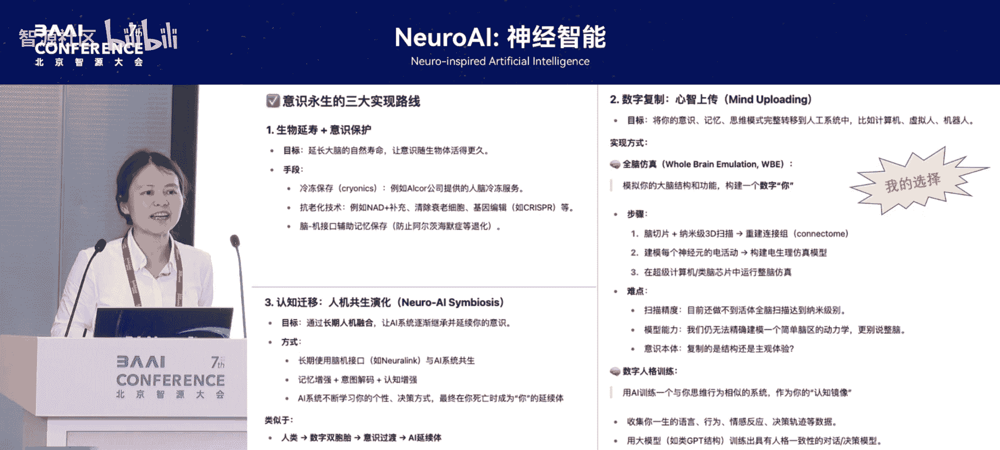

前面讨论了形而上的概念，下面我们讲解具体的方法论。这项工作始于数据采集，显得非常“接地气”。

### 第一步：数据采集与正向建模

我们首先需要使用多种脑成像技术（如fMRI、EEG）采集大量的大脑活动数据。目标是建立一个模型，既能理解这些数据，又能生成与原始数据一致的新数据。因为“我无法创造的东西，我也无法理解”。只有能创造（预测）未来，才算真正理解了这个个体。

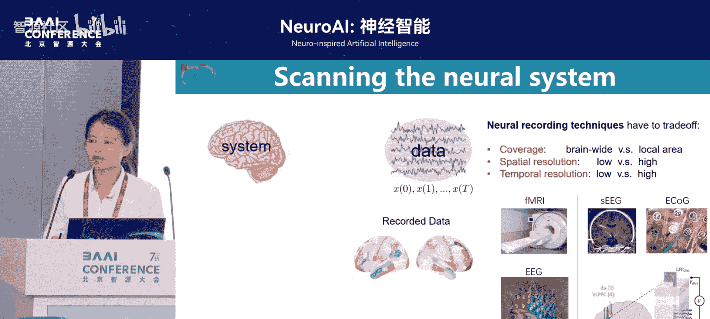

这个过程称为 **正向建模** 。如果我们能对全脑信号进行完美的正向建模，就说明我们基本掌握了大脑的运作规律。然而，真实的大脑数据极其复杂，很难用单一的、完美的数学方程（如偏微分方程PDE）来描述。

### 第二步：从方程驱动到数据驱动

多年来，科学家们试图用基于生物物理学第一性原理的微分方程来描述大脑，但最大问题在于，这些方程难以在个体层面精确复现其数据的全部细节和随机性。

因此，我们转向 **数据驱动** 的方法，利用人工智能来学习。根据万能逼近定理，AI理论上可以逼近任何连续函数。只要大脑活动是连续且稳定的，我们就可以用AI模型去逼近它。

具体做法很简单：采用 **自监督学习** ，用过去的数据预测未来。训练一个AI模型，通过梯度下降优化，使其预测的未来数据与真实数据的均方误差（MSE）最小。公式可以简化为：

`Loss = MSE(Predicted_Future, Actual_Future)`

训练完成后，我们就得到了一个在数据层面“孪生”大脑的AI模型。

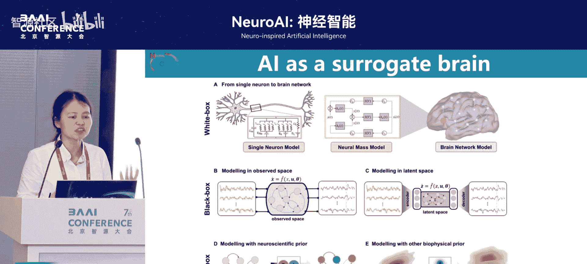

### 第三步：结合先验知识与个体数据

纯数据驱动的AI方法需要海量数据，但个体意识永生要求为每个人建立孪生体，而个人能提供的数据量是有限的。同时，纯黑箱模型缺乏可解释性。

因此，最佳方案是 **结合先验知识** 。我们在个体数据上训练模型的同时，引入来自神经科学、生物物理学的群体先验知识，或使用在大规模脑数据上预训练的模型作为基础。这些先验知识可以约束模型，使其更容易训练和解释。

整个流程与训练AI模型类似：定义参数化的动力学系统，构建损失函数，然后优化。关键区别在于，所有解决方案都是针对大脑信号的，因此模型架构和损失函数需要融入大脑的生物先验和个体特质。

## 评估：如何判断孪生是否成功？

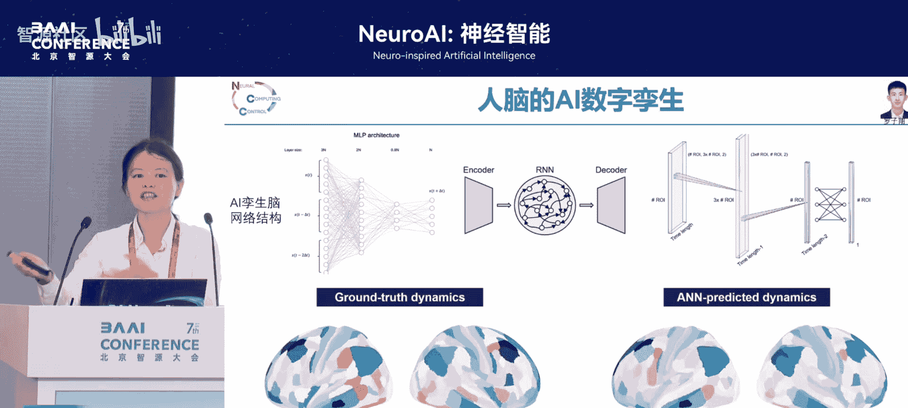

训练好模型后，如何评估它是否真的“孪生”了个体？评估需要多层面进行：

1.  **信号层面**：在时域上，模型预测的未来神经信号是否与真实数据一致。
2.  **动力学特性**：生成的信号是否保留了原始大脑系统的复杂动力学特性。
3.  **高级认知状态**：从生成的信号中，是否能解码出与个体一致的情绪状态、认知状态。如果能预测出未来的情绪，说明孪生体包含了更高级的意识特性。

仅仅在信号层面匹配是远远不够的，真正的意识孪生需要在结构、功能等多个层面实现对齐。

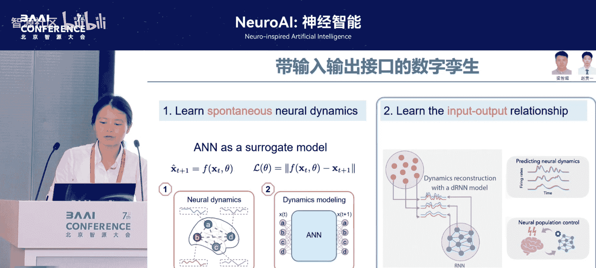

## 实践案例：从静态孪生到交互式孪生

以下是我们在研究中的几个具体实践，展示了从简单到复杂的发展过程。

### 案例一：静态fMRI大脑的孪生

我们利用拥有大量被试的 **fMRI** 数据进行训练。研究发现，即使是很简单的模型（如三层循环神经网络），也能在全脑层面很好地预测fMRI信号。这是因为fMRI的脑区划分（约1000个）相对有限，且采样率较慢（TR约0.7秒），这种缓慢的变化对AI来说比较容易学习和预测。

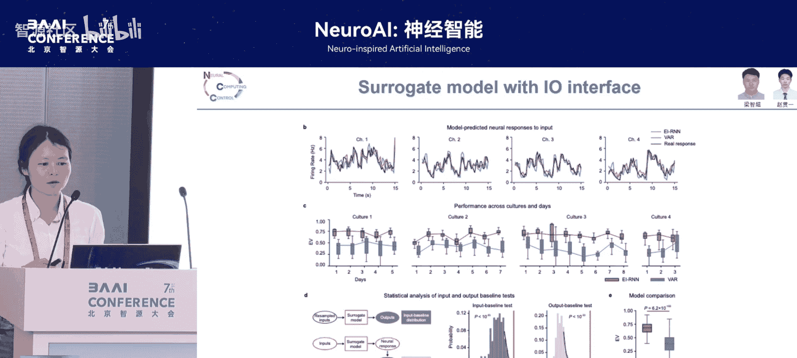

然而，仅仅孪生fMRI信号远不足以代表完整的“你”。

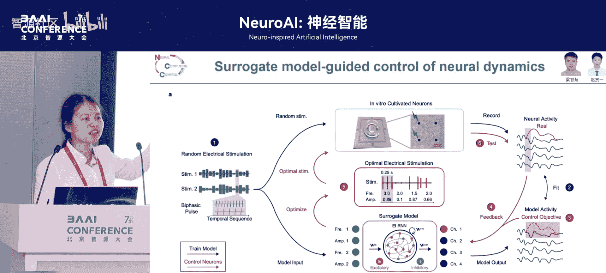

### 案例二：引入输入输出接口

人生活在真实世界，不断接收输入（如视觉、听觉）并产生输出（行为、语言）。因此，一个真正的数字孪生大脑需要具备 **输入输出（I/O）接口**。

我们在“片上脑”（培养的离体神经元）上进行了实验。通过设计低维的电刺激（输入）并记录神经响应（输出），我们获得了成对的输入输出数据。利用这些数据，我们训练出了具备I/O接口的孪生模型。

这个模型不仅能准确预测给定刺激后未来的神经活动（红色预测线几乎与真实信号重合），还能进行 **反向控制**：通过优化计算，找出能将大脑活动调控到特定目标状态的最佳刺激序列。

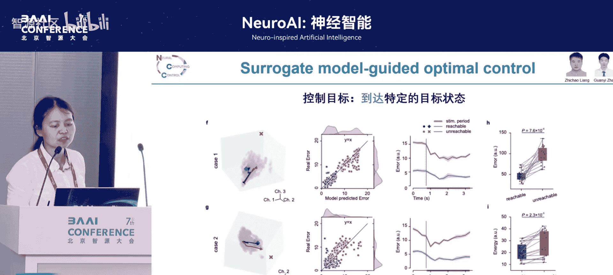

### 案例三：对齐决策与高级认知

更进一步，我们希望AI孪生体在 **决策行为** 上与个体对齐。如果AI做出的选择与个体一模一样，那它就成为了一个有效的“代理”。

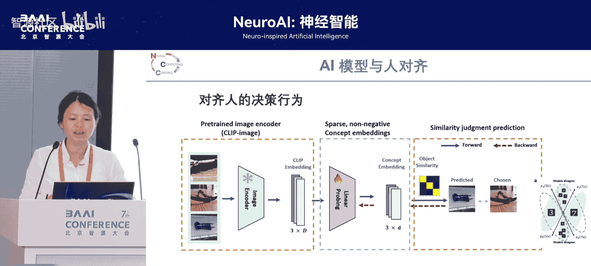

研究证实这是可以实现的。此外，在 **神经编码对齐** 方面，我们将大脑信号直接输入给预训练好的大型语言模型（LLM），LLM能够生成描述该大脑信号的文字说明。这意味着大脑与AI实现了“直连”，未来或许无需语言，直接通过脑信号就能与云端AI交互。

## 展望与挑战

我们目前的工作主要集中在信号感知层面的对齐。尽管已有研究在记忆、情绪、人格等更高层面进行预测和孪生，但即使技术层面全部实现，伦理问题依然巨大：

*   这个数字孪生体是一个独立存在的新个体，还是“你”？
*   它虽然完全复刻了你，但它就是你吗？
*   这种形式的“永生”，其意义是什么？

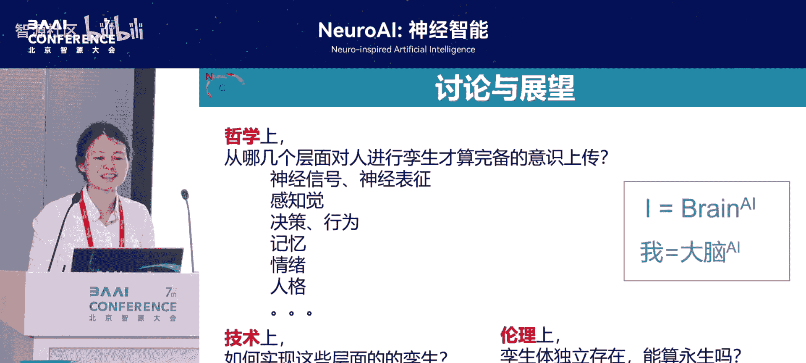

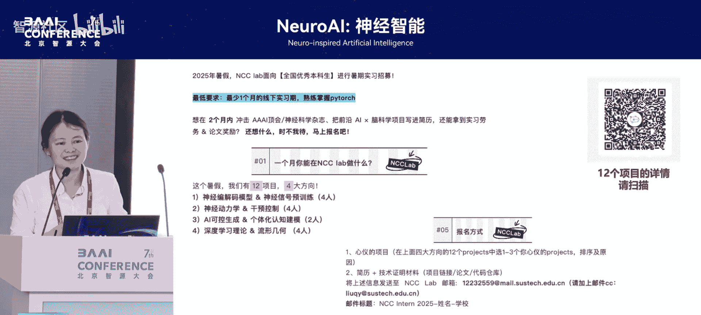

最终，我们可能走向一个 **人机共融** 的时代。个体的存在可能是大脑与云端AI的融合。AI作为云端庞大的智能，与生物大脑协同工作。

## 总结

本节课我们一起学习了基于数字大脑实现意识永生的构想与技术路径。我们从“心智上传”的概念出发，探讨了如何通过数据驱动与先验知识结合的方法，构建个体大脑的数字孪生体。我们了解了从静态信号预测到具备I/O接口的交互式孪生，再到对齐高级认知功能的具体案例。最后，我们认识到，尽管技术不断突破，但意识永生带来的伦理与哲学问题，仍需我们深入思考。这是一条充满希望也布满挑战的道路。