# NeuroAI：-神经智能-p07-世界就是一个模型：吴思

在本节课中，我们将探讨“世界模型”这一核心概念。我们将了解它在人工智能和生物智能中的核心地位，分析当前AI在构建物理世界模型时面临的挑战，并探索大脑（特别是海马-内嗅皮层环路）如何为我们构建高效的世界模型提供了神经科学上的启示。

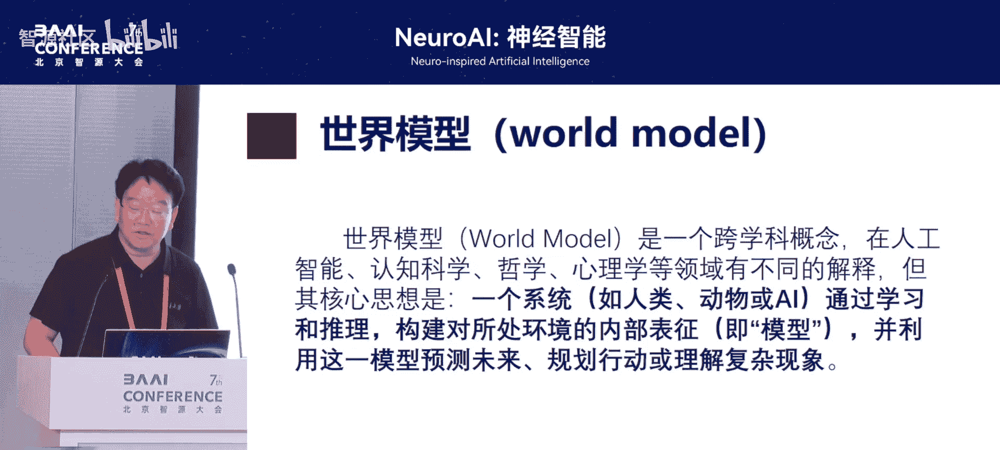

---

## 概述：什么是世界模型？

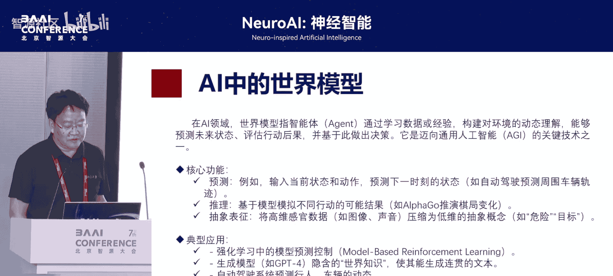

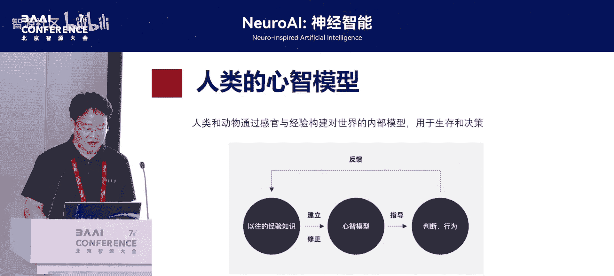

世界模型是一个跨学科的核心概念。其核心思想是：一个智能体（无论是AI系统还是生物大脑）需要通过学习和推理，构建一个对其所处环境的内在表征，即一个内部的模型。这个模型被用来与外界交互、预测未来、规划行动以及理解复杂现象。

上一节我们介绍了世界模型的基本定义，本节中我们来看看它在不同领域的具体表现和重要性。

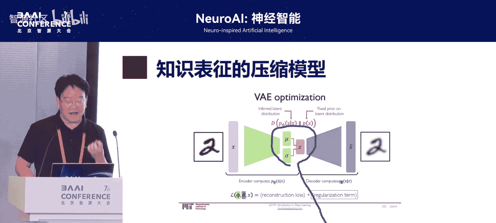

---

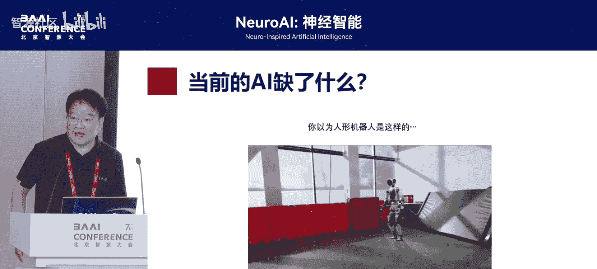

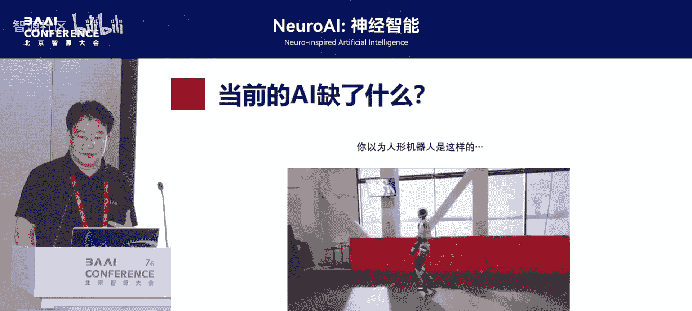

## 世界模型在不同领域的体现

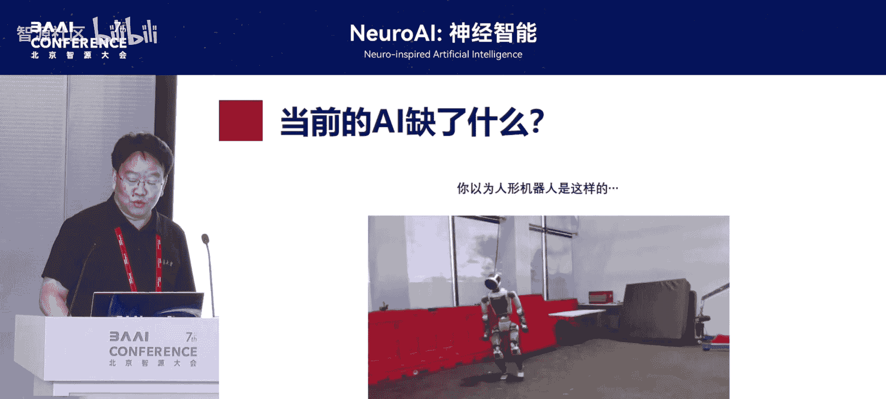

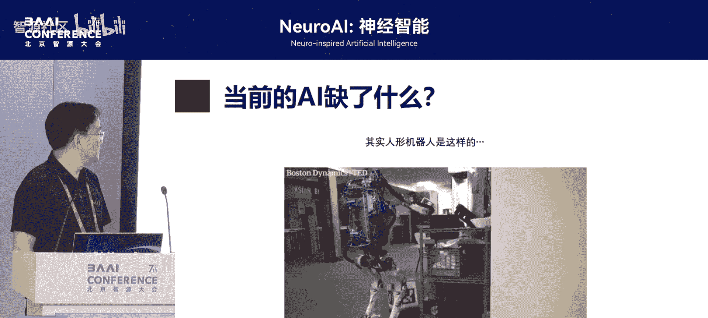

### 在人工智能领域

当前，构建“世界模型”是AI领域的一个热点方向。AI研究者们致力于开发能够进行预测、推理和抽象表征的世界模型架构，以期最终实现更高级的通用智能，例如在自动驾驶等复杂任务中应用。然而，目前尚未取得完全的成功。

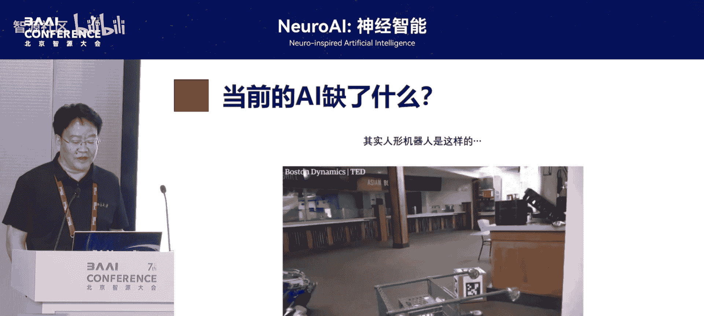

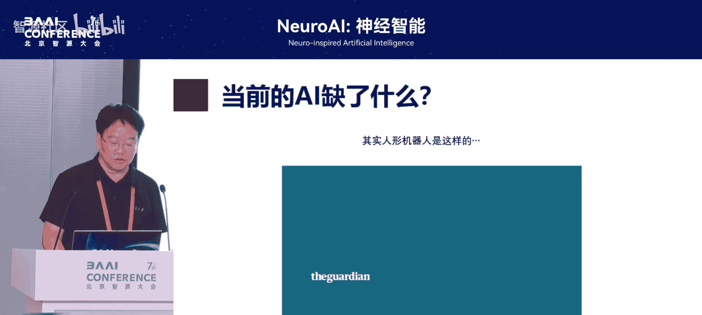

### 在心理学领域

在心理学中，类似的概念被称为“心智模型”。我们在生活中的经验不断修正着我们对世界的理解（即我们的“世界观”），而这个心智模型又会指导我们的判断和行为。可以说，人的一生就是不断训练和修正自身大脑内世界模型的过程。

---

## AI世界模型的成就与局限

上一节我们看到了世界模型的普遍性，本节中我们来看看AI在构建世界模型方面的具体进展与不足。

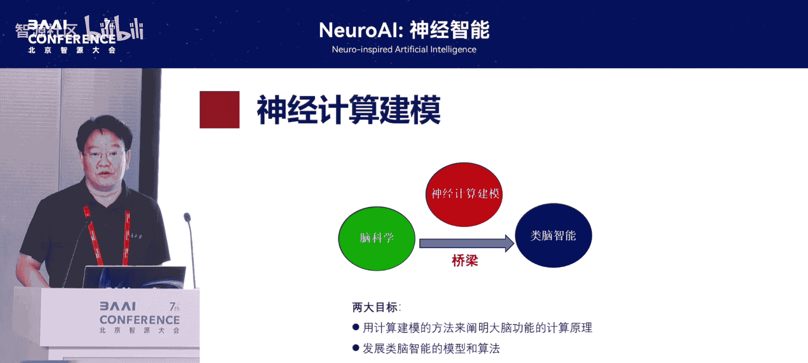

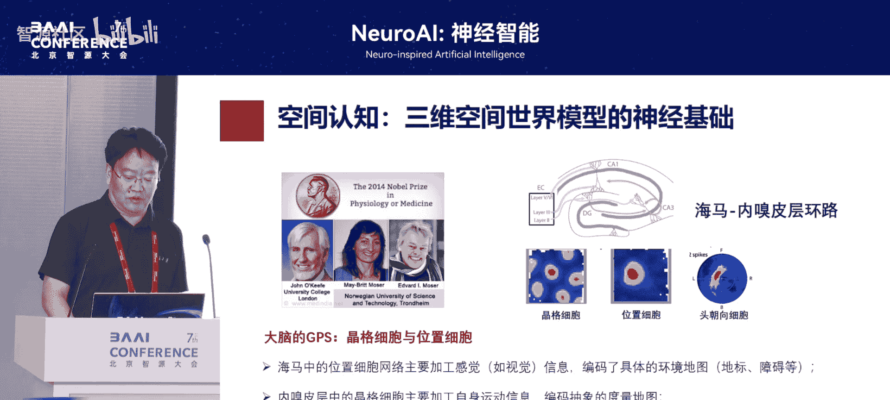

### 成就：静态知识的表征

在静态知识表征层面，AI的世界模型已经做得非常出色。一个典型的例子是变分自编码器（VAE）这类生成模型。

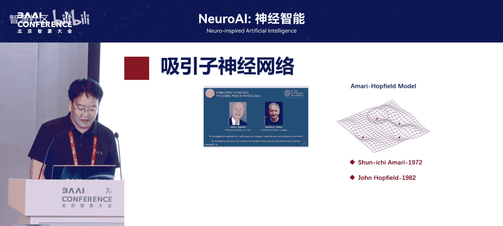

**公式/代码示例：VAE的核心思想**
VAE通过学习将输入数据（如图片）编码到一个高度压缩的潜在空间（latent space），并能从这个空间中采样并解码生成新的、类似的数据。
```python
# 简化的VAE思想示意
encoded = encoder(input_image) # 编码到潜在空间
latent_sample = sample_from_distribution(encoded) # 采样
generated_image = decoder(latent_sample) # 解码生成
```
这种高度压缩的表征抓住了数据的核心特征（例如“猫”的本质），构成了一个有效的静态知识世界模型。

### 局限：缺乏通用物理世界模型

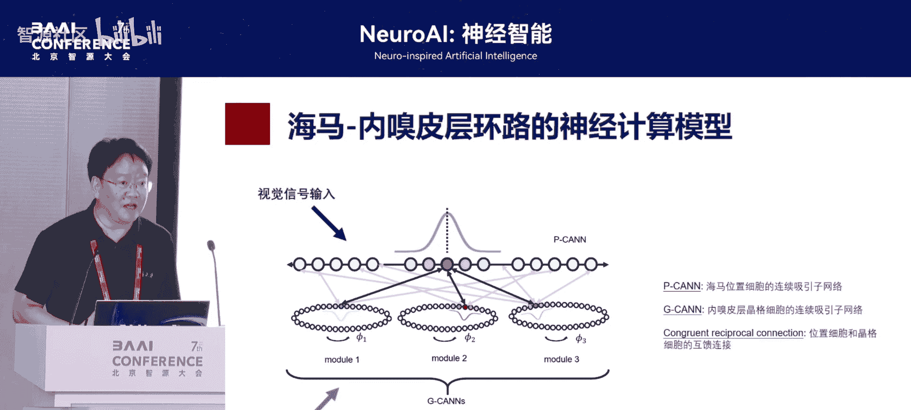

然而，AI在构建**通用的物理世界模型**方面仍面临巨大挑战。这在与动态、未知环境交互的任务中表现得尤为明显。

以下是当前AI（如人形机器人）在此方面的主要问题：
*   **场景特定性**：在预先编程好的简单、特定环境中，机器人可以表现完美。
*   **泛化能力差**：在真实、多变、不可预知的环境中，其表现会大幅下降，远不及人类。

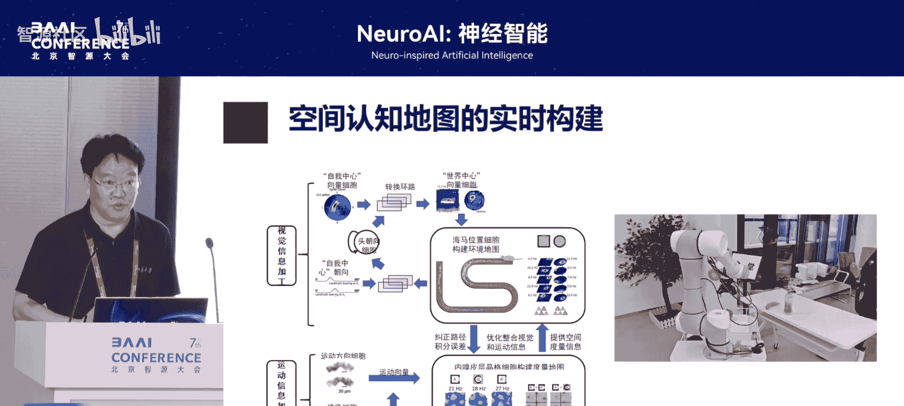

人类能够轻松应对未知环境，关键在于我们大脑中拥有一个通用的、能够模拟物理过程的世界模型。例如，我们可以闭上眼睛，在脑海中清晰地复现从进入会场到找到座位的整个物理过程和空间布局。

---

## 大脑如何构建世界模型：神经计算的视角

既然AI缺乏通用的物理世界模型，而人类大脑却拥有，那么研究大脑的机制就至关重要。本节我们将从神经计算建模的角度，探讨大脑可能如何构建世界模型。

神经计算建模旨在用数学模型模拟神经元动力学和信息加工过程。与当前多数输入-输出式的AI模型不同，神经计算模型试图构建大脑内部信息加工的**物理过程**模型。从这个意义上说，它正是在构建大脑内的物理世界模型。

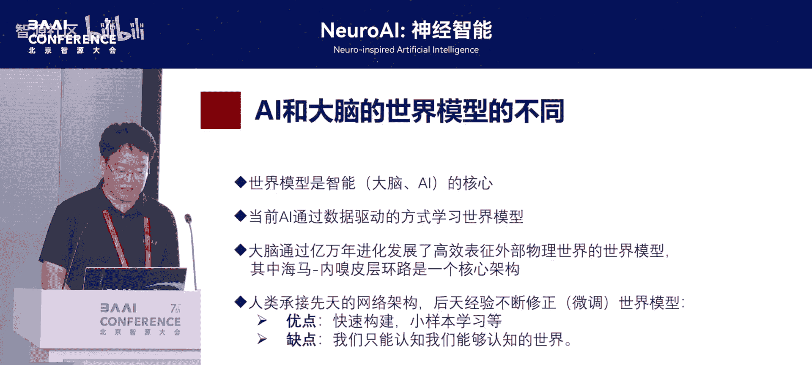

一个关键的切入点是研究大脑的**空间认知**系统，因为空间感知是构建物理世界模型的基础。

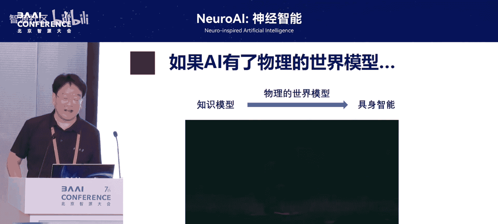

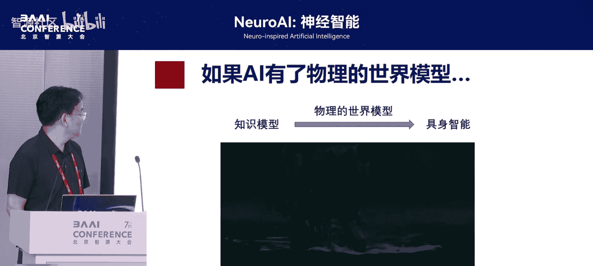

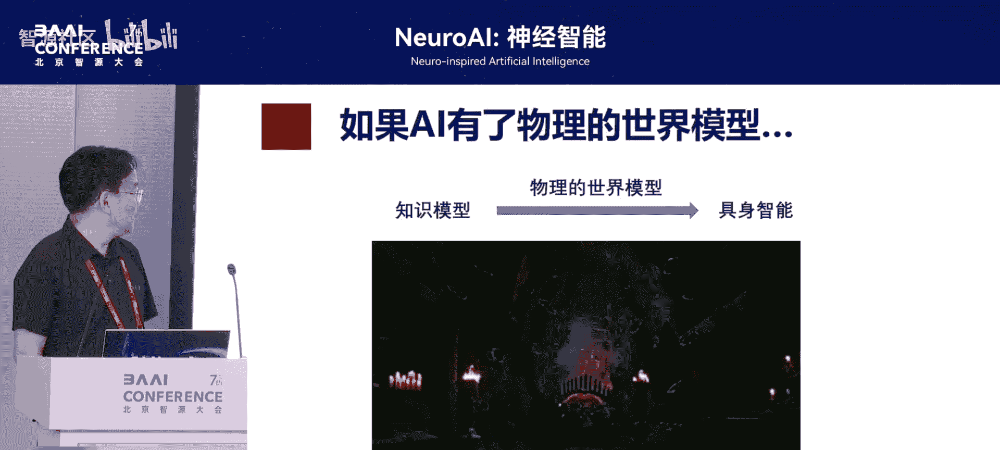

### 空间认知的神经基础：网格细胞与连续吸引子网络

大脑中负责空间认知的核心结构之一是**海马-内嗅皮层环路**。其中的网格细胞等神经元构成了大脑的“GPS”系统。

从建模角度看，大脑可能利用**连续吸引子网络**来表征空间。这种网络可以形成一个连续的“认知空间”，我们的感知、记忆和想象都可以被视为在这个空间中的“轨迹”。

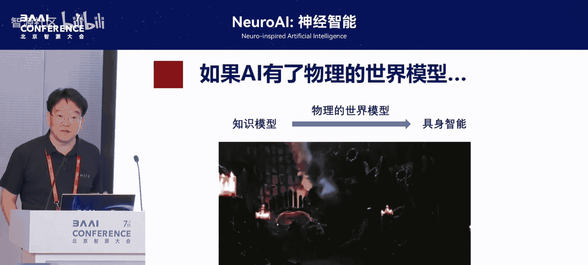

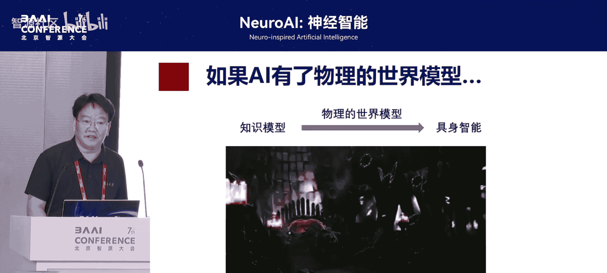

**公式/代码示例：连续吸引子网络**
连续吸引子网络能产生稳定的活动包（activity bump），该包能在网络空间中移动，以表征位置等信息的变化。
```python
# 连续吸引子网络活动更新的简化示意
# r(x, t): 位置x在时间t的神经元活动
# W: 神经元间的连接权重（通常是局域兴奋、全局抑制）
# input: 外部输入（如视觉、运动信息）
dr_dt = -r + W * r + input
```
我们通过构建两个耦合的连续吸引子网络模型，模拟了海马体如何整合视觉和运动信息，实时与环境交互并建立空间地图的过程。这种模型不仅能实现同步定位与地图构建（SLAM）的功能，更能重现智能体在建图过程中“看见”了什么、如何积分运动路径等物理过程。

### 从空间地图到抽象认知地图

为什么空间认知如此关键？因为大脑进化具有保守性。早期进化用于表征空间关系的海马-内嗅皮层环路，在高等动物中被**复用**来表征更复杂的抽象关系（如社会关系、概念关系），形成所谓的“认知地图”。

间接证据来自“具身认知”现象：我们常用空间词汇（如“关系近”、“地位高”）描述抽象概念。这表明，理解空间认知的环路是理解更复杂世界模型的关键。哲学家康德也曾指出，空间和时间是我们认识世界的基本模式。我们可以将其推广为：**空间和时间是我们构造世界模型的基本框架**。

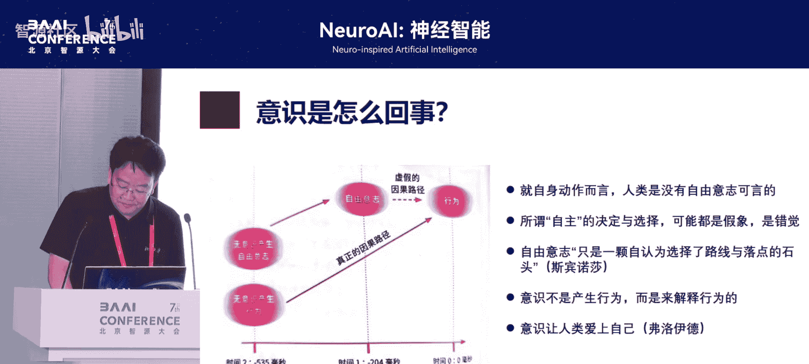

---

## 总结：AI与大脑世界模型的差异与展望

本节课中我们一起学习了“世界模型”的核心概念及其在不同领域的体现。

现在我们来总结一下AI的世界模型与大脑世界模型的主要不同：
*   **AI世界模型**：目前主要通过大数据驱动的方式，从零开始学习，在静态知识表征上成就显著，但缺乏通用的物理世界模型。
*   **大脑世界模型**：通过亿万年进化，先天就具备了一个高效的表征物理世界的核心架构（如海马-内嗅皮层环路）。后天经验不断修正这个模型。其优点是能实现“小样本学习”，快速掌握物理规律；缺点则是认知框架可能受限于该先天结构。

脑科学揭示的这种先天架构，为AI发展物理世界模型提供了宝贵的借鉴，即“类脑智能”的路径。

### 未来展望

当前，AI在知识模型（如大语言模型）上已超越人类。未来的关键挑战是构建出强大的**物理世界模型**。如果将二者结合，就有可能创造出超越人类的“巨型智能”。

最后，报告者提出了一个深刻的哲学思考：如果大脑的世界模型本质上是一个确定性的物理系统，那么我们的“自由意识”是否可能只是一种对自身行为的解读？这引出了对生活本质的思考。即便世界可能是一个可描述的模型，但每个人的经验输入不同，使得这个模型产生独特且不可完全预测的输出。正是这些经历和“噪音”，构成了我们丰富多彩、值得热爱的主观世界和生活本身。