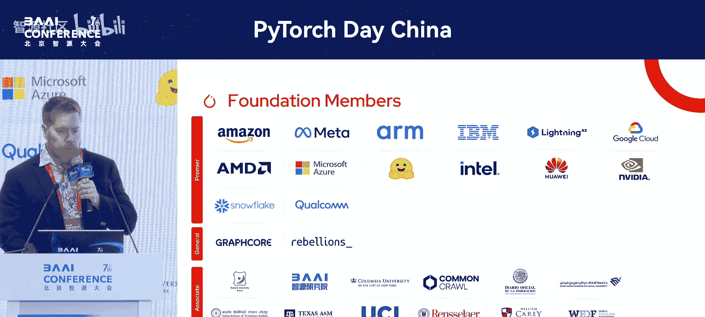
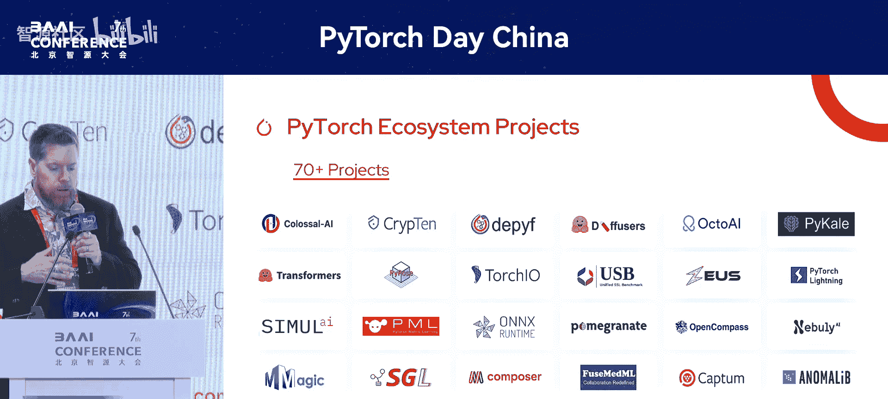
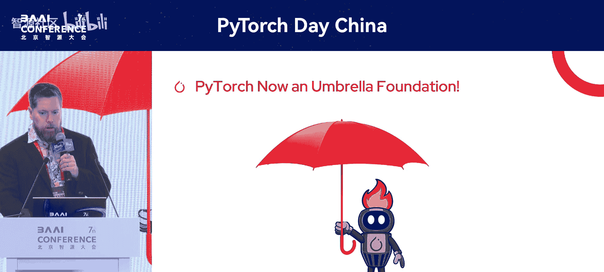
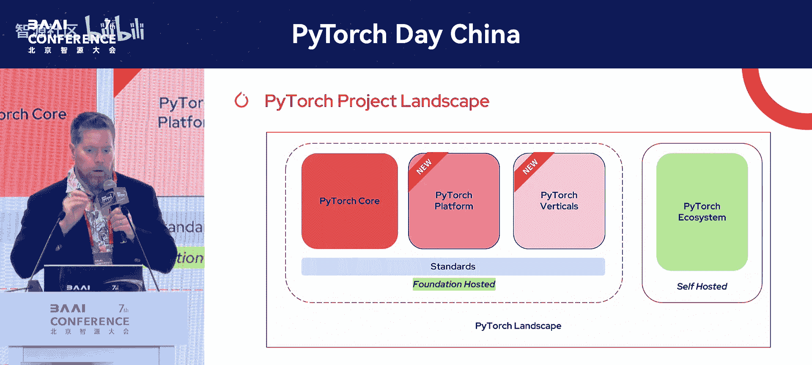
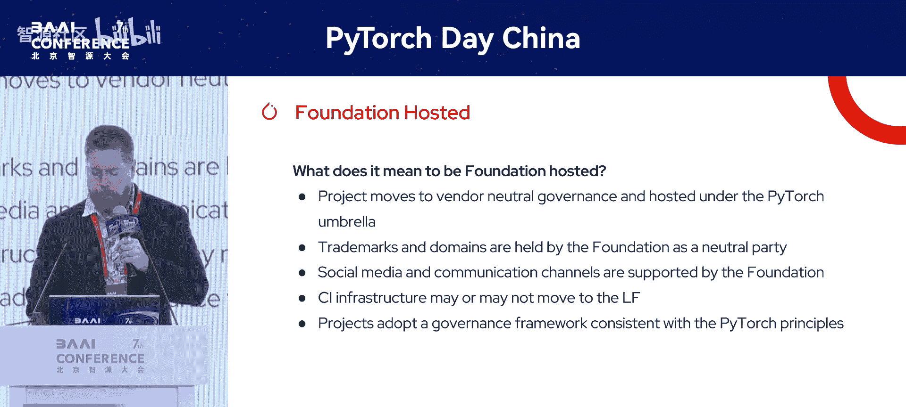
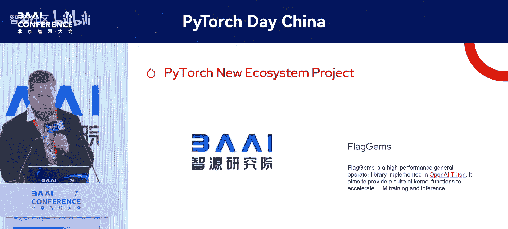
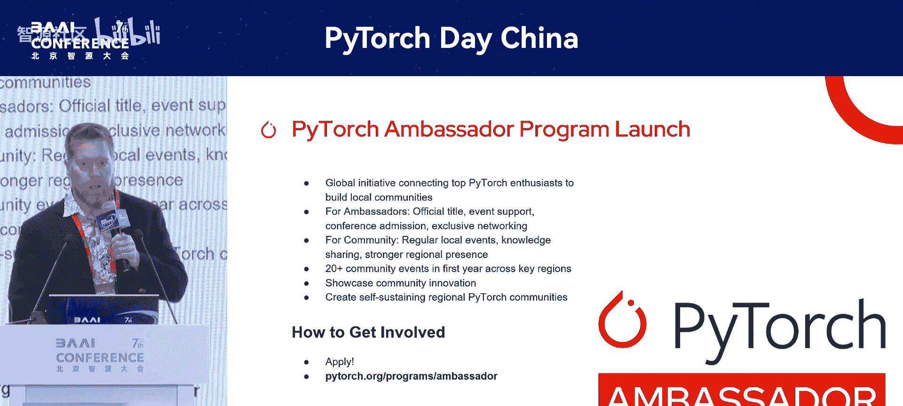
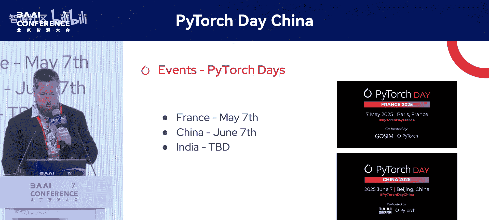
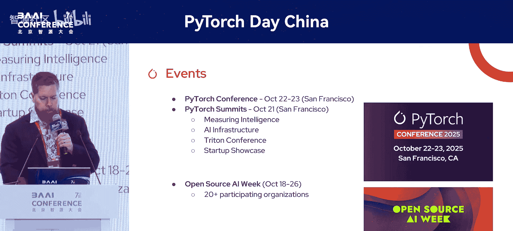
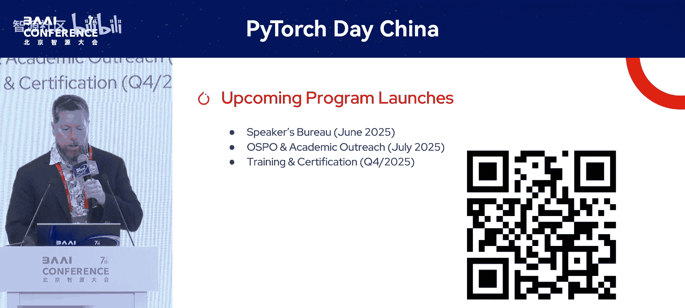

# PyTorch-Day-China-p01-Welcome-&-Opening-Remarks：Matt-White

在本节课中，我们将学习PyTorch基金会的最新使命、组织结构、新项目以及未来发展规划。内容基于Matt White在PyTorch Day China上的开幕致辞整理而成。

大家好，欢迎来到首届PyTorch Day China。非常感谢各位的到来。

在活动开始前，我要特别感谢北京智源人工智能研究院（BAI）主办此次活动。请为他们、为这场盛会，以及为过去几天我们聆听的所有杰出演讲者，献上热烈的掌声。谢谢BAI。

在正式开始今天由众多优秀演讲者带来的、涵盖PyTorch诸多重要当代议题的精彩日程之前，我有几点前言想与大家分享。

## 基金会的新使命 🎯

首先，我想展示基金会的新使命宣言。这一点非常重要，因为人工智能发展迅速，PyTorch基金会也在不断演进以适应时代。

**PyTorch基金会当前的使命是：加速创新，提供广泛可用的PyTorch工具，并推动整个行业的开源人工智能发展。** 我们的目标是**民主化工具访问**，让任何人在任何地方都能为他们的目的获取这些工具。我们正在持续推动这一进程，并将在本次演讲中宣布一些消息。

## 基金会成员与生态系统 🌐

我想快速介绍一下基金会成员。目前我们拥有超过30名成员。请记住，这个基金会成立仅两年，非常年轻，但正在快速增长。我要感谢所有成员，也感谢BAI成为基金会的一员。

除了PyTorch框架本身，PyTorch基金会还拥有一个非常丰富的项目生态系统，这个生态系统已经发展了好几年，并且仍在持续增长。你会在这里看到一些熟悉的名字，比如 **`transformers`**、**`diffusers`**、**`ONNX`**、**`SG Lang`** 等等。这些都是与PyTorch或基金会相关的优秀项目。这些工具旨在向社区展示，存在许多在开源许可下可访问的工具，并且它们能与整个生态系统良好协作。

## 重要公告：yTorch成为伞形基金会 ☂️

接下来，我将与大家分享几项公告。你可能已经听说，**PyTorch现在是一个伞形基金会了**。这意味着什么？

这实质上意味着我们已经发展成为一个能够托管PyTorch核心之外项目的基金会。过去几年，我们以PyTorch Core为主要项目，托管了一系列辅助项目。但现在，我们可以托管社区贡献给基金会的新项目。这样做可以构建一个非常强大且可信赖的项目生态系统，供你在研究和生产中使用，并确保项目能够经受住**长期的考验**。

此外，这还能使项目与我们的治理模式以及其他对项目开发过程至关重要的部分保持一致。它也鼓励项目之间的协作。基金会内的项目，其核心维护者可以与其他核心维护者合作。我们的目标是打破壁垒和孤岛，让维护者相互交流，让贡献者一起工作，并推动项目的交叉推广。

那么，PyTorch世界现在看起来是怎样的呢？我们有了这个PyTorch全景图。

我们仍然有**PyTorch Core**，这是我们项目平台非常重要的一部分。但我们也新增了一些板块：

*   **PyTorch平台**：这些是托管在基金会下的、具有通用性质的项目。例如服务引擎、平台软件等，它们不仅让你使用PyTorch，还提供访问服务引擎、数据预处理等非常通用的功能。
*   **PyTorch垂直领域项目**：这些是针对特定应用或领域的项目。例如蛋白质折叠、地理空间分析等，这些都是非常领域特定的应用。
*   **PyTorch生态系统**：如果你有一个项目，认为它能为AI和开源AI社区带来真正价值，PyTorch生态系统是你的起点。所有项目都从这里开始，然后可以随着时间的推移，演变为真正的基金会托管项目。

## 成为基金会托管项目的意义 🤝

成为基金会托管项目意味着什么？我提到了生态系统项目会通过我们的生态系统工作组经历一个审核流程，该工作组会审查项目，然后要么批准它们加入生态系统，要么与核心维护者合作，帮助他们达到能够加入生态系统的更好状态。

但对于基金会托管项目，你必须真正确定你认真对待开源，并希望处于一个**供应商中立的空间**。Linux基金会和PyTorch基金会作为中立的第三方、可信赖的第三方，持有项目所需的商标、域名和其他资产，以确保没有一家公司可以告诉另一家公司他们能或不能用某个项目做什么。我们在这里是为了帮助你的项目取得成功，并帮助发展开源社区。

## 新项目与生态系统项目 🆕

我们确实有一些新的托管项目。这两个项目在过去四周内刚刚加入我们：
1.  **vLLM**：你可能听说过，这是一个非常可靠的推理引擎，用于LLM的模型服务，诞生于加州大学伯克利分校。
2.  **DeepSpeed**：这更像是一个编排层或工具，允许你完成模型从训练到推理的整个生命周期。

此外，我们今天还宣布了一个新的生态系统项目，即**BAI的FlagAI Gems**。非常高兴FlagAI Gems获得批准，现在已成为我们生态系统的一部分。请为BAI献上掌声。

## PyTorch大使计划 🗣️

大约一个月前，我们启动了**PyTorch大使计划**。我们这样做的一部分原因是希望与当地社区建立联系，与每个社区的领导者联系，共同推动开源AI的发展。这不仅仅是关于PyTorch，也包括vLLM、DeepSpeed以及未来将加入基金会的其他项目。

我们寻找的是真正对开源和AI充满热情的人。我们会提供资源和资金，以便你能够举办本地聚会、小型活动和会议等。如果你要举办网络研讨会，我们还会让你访问我们的平台，来宣传你的活动以及你在当地社区所做的工作。

申请可能今天截止。如果你有兴趣，请访问 `pytorch.org/programs/ambassadors` 申请成为大使。如果今天没赶上截止日期，可以联系我，我们可以讨论如何提交你的申请。我们将在下个月审查这些申请，四周内我们已经收到了超过200份申请，社区对这个项目的参与兴趣非常浓厚。

## 新网站与全球活动 🌍

还有一个小公告，我们推出了一个新网站，非常期待社区的反馈。如果你觉得应该有什么内容但没有，或者网站变化很大，请告诉我们，我们可以看看如何改进。

我想简单提一下我们的活动。显然，你现在正在参加PyTorch Day China。上个月（5月7日）我们在巴黎举办了PyTorch Day France，今年晚些时候我们还将举办PyTorch Day India。我们组织这些活动是为了更多地深入社区，去到受众所在的地方，与大家互动，听取你们的意见，了解我们可以做得更好、应该做什么、应该把精力集中在哪些方面。我们希望年复一年地回来。

我们还有标志性活动——**PyTorch Conference**。今年将于10月22日和23日在旧金山举行。我们换了一个新场地，还增加了一天（第零天）。我认为这对很多人来说会非常有趣。

第零天我们将有半天时间讨论“衡量智能”，这主要围绕基准测试，包括AI智能体、LLM以及整体AI系统的基准测试，届时将有许多优秀的演讲者。另外半天是关于AI基础设施，讨论服务、训练、分布式训练等内容，阵容也非常强大。Triton Conference也将同期举行，为期一天。

我们还有初创企业展示会，将在下午举行，邀请初创公司来进行推介。我们有一个由风险投资家组成的优秀评委小组，这是初创公司获得曝光的机会。

为了让这一周更有价值，我们还设有“开源AI周”。那一整周都将是开源AI周，这是来旧金山湾区参加众多活动的绝佳机会，我们希望为每个人提供一个非常充实的议程。

## PyTorch基金会的未来方向 🚀

那么，PyTorch基金会的下一步是什么？我认为我们现在的重点真正放在**生态系统和项目增长**上。我们希望看到更多项目加入，希望发展生态系统。

下图中的这些板块展示了我们正在关注的领域，从底层的**基础设施**，向上到**模型**、**数据**和**应用**。目前，围绕MCP、A to A等协议标准化有更多兴趣。同时，在关注不同抽象层次、如何从模型中获得更好的测量、如何处理基准测试数据的污染等方面也有很多兴趣。存在许多当代议题，我们正在寻找能够解决该领域实际问题的工具。

我们将启动一些额外的项目：
1.  **演讲者局**：将于本月启动。你可以是大使，也可以是演讲者，但不必同时是两者。我们希望看到人们注册。在这里，我们将把不同领域的演讲者与会议联系起来，代表项目和基金会发言。我们希望人们能够走出去，深入社区，谈论他们的项目，并在社区中带来真正的改变。
2.  **开源项目办公室与学术推广**：这是一个非常有趣的项目。我们正在与大学合作，为他们提供教授、助教教授PyTorch所需的指导材料包，包括如何开始使用PyTorch以及如何深入一些高级主题。这对学术界和刚刚学习PyTorch、可能正在学习计算机科学的人来说非常有用。我们希望确保能与大学建立联系。如果你现在正在学习或是教授，请随时联系我，我们可以讨论如何让你参与这个试点项目。
3.  **培训与认证**：几年来，一直有很多人询问关于培训和认证的事情，很多来自中国的朋友也在询问。我们终于开始着手这项工作，希望能在今年晚些时候，很可能在PyTorch Conference上推出。我们计划在第零天举办活动，提供两门培训课程和认证，你可以在会议正式开始前一天参加。随后，我们将在线上提供这些内容。

## 总结

本节课中，我们一起学习了PyTorch基金会的最新动态。我们了解了基金会的新使命是加速创新和民主化AI工具访问，认识了其不断增长的成员和丰富的项目生态系统。关键变化在于PyTorch已演进为**伞形基金会**，能够托管PyTorch Core之外的项目，形成了**PyTorch平台**、**垂直领域项目**和**生态系统**三层结构。我们看到了新加入的托管项目**vLLM**和**DeepSpeed**，以及新的生态系统项目**FlagAI Gems**。此外，基金会启动了**PyTorch大使计划**，并规划了包括**演讲者局**、**学术推广**和**培训认证**在内的未来项目。基金会通过全球活动（如PyTorch Day系列和PyTorch Conference）积极与社区互动，未来将重点推动生态系统增长并解决AI领域的当代实际问题。

最后，再次感谢大家今天的参与，我对我们为大家准备的优秀演讲者阵容感到非常兴奋。

谢谢。