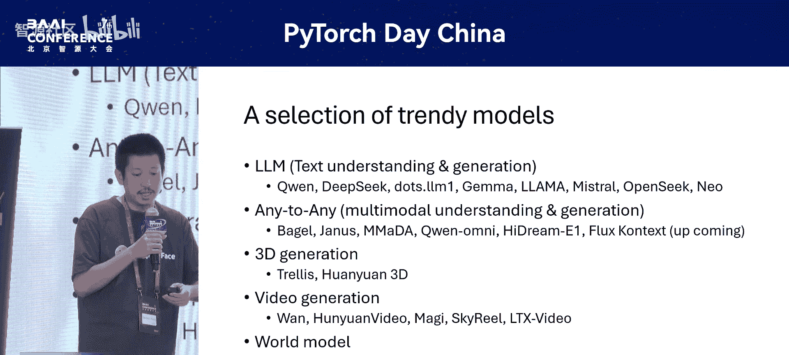
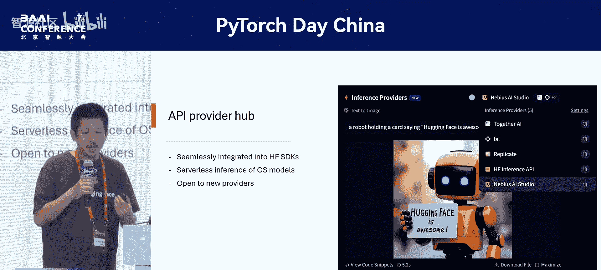
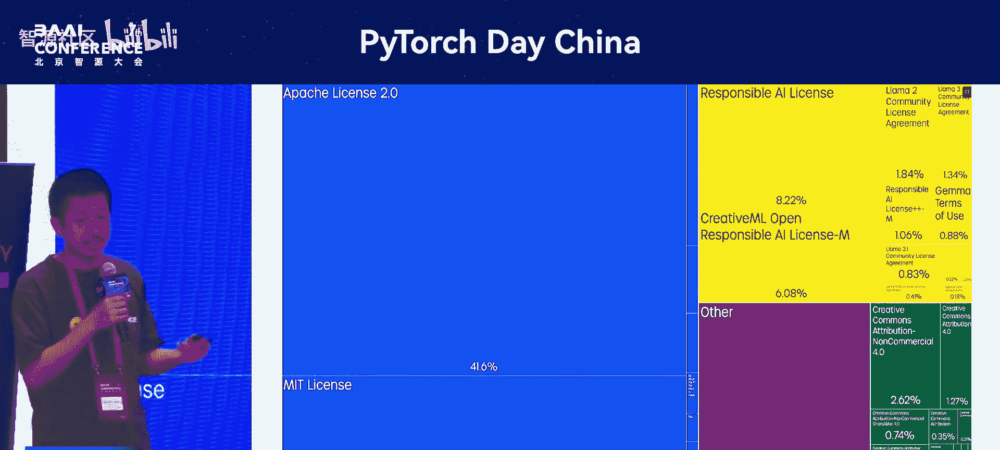

# PyTorch-Day-China-p03-Diving-in-Hugging-Face-Hub;-Share-Your-Model-Weights-on-the-#1-AI-Hub,-Home-of-7

在本节课中，我们将深入探索Hugging Face Hub。这是一个领先的AI社区平台，你可以在此分享和发现模型权重。我们将了解其核心功能、如何利用它，以及它如何成为开源AI生态系统的中心。

---

## Hugging Face Hub是什么？🤔

Hugging Face Hub是一个开源AI社区。你可以将其视为“AI领域的GitHub”。它汇集了大量优秀的开源模型和数据集。

经过多年发展，其功能已远超于此。它不仅仅是模型和数据，还包含Spaces功能，让你无需下载完整权重即可轻松试用模型。此外，还有Kernels功能。我们与Flag Jam等社区有很多合作可能。

我们还为API提供商提供了一个网关，你可以将无服务器API服务集成到Hugging Face中。Hugging Face还具备许多沟通和社交网络功能。最后，我们公开了大量关于开源模型和数据集的数据指标，让你能深入了解当前的开源生态系统。

---

## 模型中心：核心功能 🏛️

模型中心是Hugging Face的关键功能。我们为任何想要上传模型和数据集的人提供免费服务。

截至目前，我们已经积累了170万个公共模型。这个数量比我三年前加入时增长了超过10倍。

我们提供了许多便捷功能，帮助你筛选和找到想要的模型。例如，你可以使用左侧的筛选器来查找过去30天最热门的PyTorch模型。你也可以按任务类型筛选，例如，我想要大型语言模型等。

我们维护着一个热门模型页面。以下是我认为非常有趣的一些近期热门模型选择：我们有DeepSeek和Red Note。Xia昨天发布了dots dot L1。谷歌有Gma和Llama。我想特别提一下来自BI的Opense模型，因为它是传统意义上的开源模型典范：你可以访问所有训练代码和数据，甚至可以根据意愿参与其项目，这是一个纯粹的开源模型。来自Map的Nail模型是另一个纯粹开源模型的例子。

当前另一种非常流行的模型类型是“任意到任意”模型。这本质上是多模态理解和生成模型，意味着模型不仅能“看”图像和视频，还能生成某种类型的多模态数据。来自Dance的Big模型非常受欢迎，它能够生成大量图像等。来自DeepSeek的Mata模型非常有趣，因为它并非基于传统的Transformer架构，而是基于扩散模型，但它也是一个“任意到任意”模型，能够生成音频。High Dream E1模型能够进行图像编辑。

还有一个即将发布、备受关注的模型Connects，据称其性能可与ChatGPT 4相媲美。此外，还有一批第三代生成模型，例如来自微软的Whole Area和An 3也非常流行。视频生成模型的发展也极其迅速，例如我们有来自阿里巴巴和腾讯的Maggie模型。Maggie非常有趣，因为它使用回归方法来生成视频，而不是使用扩散模型。

一种新型模型被称为“世界模型”，你可以与模型实时交互，模型会给你实时的视频反馈，你甚至可以将其当作游戏来玩。例如，海外微软的Min World和Sworks Metrics Game都是很好的例子，如果你想尝试的话。

---

## 模型页面详解 📄

对于每个模型，我们都提供了一个模型页面。

在模型页面上，你可以在左侧找到模型卡片。你可以阅读作者撰写的模型卡片，以了解模型的功能和使用方法。通常，它会包含一个代码片段，你可以直接复制粘贴来运行模型。

在右侧，你可以看到许多结构化数据。例如，过去一个月的累计下载量、模型大小、模型类型，以及非常有趣的模型层次结构，例如整个模型家族、哪些模型衍生自该模型，以及与该模型相关的适配器或量化模型。

人们在上传模型到Hugging Face时经常遇到的一个问题是：他们没有使用`diffusers`库或`transformers`库，而是创建了自己的框架，结果发现下载量总是0。这实际上是一个已知特性，并非错误。下载量的追踪方式是基于库的。如果你的库未在Hugging Face注册，我们可以帮助你，以便你获得真实的下载量追踪。

---

## 数据集服务 📊

对于数据集，我们也提供相同水平的服务。一个非常重要的功能是我们支持Git LFS（大文件存储）。

如果你的数据并非完全公开，而是半公开的，意味着用户在访问你的数据之前需要获得你的许可，你可以使用Git LFS。用户需要提供一些信息，然后你可以决定是否允许他们访问数据。

我们还提供数据可视化功能。你可以在实际下载之前查看所有数据条目及其内容，从而检查部分数据。如果这种可视化还不够，你可以在下载数据之前使用SQL查询数据，并可以进行很好的可视化和数据洞察。

我们还提供了一个非常强大的编程接口。你可以在左下角的截图中看到。你只需提供数据名称，该库就会为你提供一个统一的接口来下载模型并从服务器流式传输数据。

---

## Spaces：在线演示空间 🌐

除了模型和数据集，Spaces是一个非常有趣的部分。许多用户尝试新模型时面临的一个挑战是，他们没有GPU来运行模型，或者不想等待模型下载好几天。

因此，我们建议，当研究人员想要发布一个模型时，可以直接创建一个在浏览器中运行的Hugging Face Space。这样，你的用户只需访问该网页，输入模型所需的参数，就能立即感受到模型的功能，并判断模型是否满足你的需求。

你可以在Gradio之上构建演示，也可以在其他应用框架（如Streamlit）上构建。如果你使用JavaScript，甚至可以在静态网页上构建。

我们为尝试构建模型的用户提供免费的H200 GPU额度。那么，什么是T4 GPU呢？T4 GPU是我们为每位用户提供的按需GPU实例的一种方式。当Space处于待机状态时，它没有附加GPU。但当你的用户访问你的Space并尝试使用GPU时，GPU就会被附加到该实例上。然后，用户每4小时最多可以使用5分钟。如果用户订阅了Pro账户，他们将拥有更多的使用额度。

所有这些Space都与OpenAI的API兼容。因此，你可以直接从你的大型语言模型中调用它们。

---

## Kernels Hub：新功能 ⚙️

Kernels Hub是我们最近正在试点的一个新功能。其目标是借鉴我们为模型和数据集提供的经验，为内核（Kernels）提供相同的体验，因为加载内核非常困难。

开发内核也很困难，你必须考虑如何处理动态链接库（.so文件），如何使其与不同版本的Python、不同版本的CUDA兼容。

因此，我们提出的方案是：你可以将编译好的内核上传到Hugging Face，适用于所有环境。然后，用户只需动态调用`get_kernel`函数并传入内核名称，就能从Hugging Face拉取内核，并可以立即使用。

我们还提供了一系列内核发现功能。因此，如果你正在开发内核，可以将其上传到Hugging Face，并添加一系列标签，以便用户轻松找到这些内核。

---

## API提供商中心 🔌

我们正在开发的一个新功能叫做API提供商中心，即推理提供商中心。

在此之前，我们为模型提供了一个游乐场。例如，如果你访问一个模型页面，在右侧会有一个游乐场，你可以输入一些参数来尝试模型。

现在，我们将这个能力开放给了第三方提供商。只要你为开源模型提供无服务器推理服务，就可以被添加进来。例如，这是一个Flux模型，我们有一批推理提供商，如Replicate、Nebulous和Together。

---

## 社交与社区功能 👥

Hugging Face Hub还具备许多社交网络功能。你可以发布社区文章，也可以撰写类似Twitter的帖子。

更重要的是，Hugging Face提供每日论文功能，你可以在此找到整个行业的最新进展。如果你发现某篇文章有趣，可以使用每日论文内的讨论面板与作者交流并提出问题。

---

## 数据洞察与可视化 📈

Hugging Face拥有大量的数据集、模型和用户。这类数据和指标非常有价值，如果你想深入挖掘并对整个开源生态系统有所洞察的话。

我们提供了一系列用户界面功能，你可以根据框架、任务等筛选模型。我们将所有功能——你在用户界面上能获得的一切——都通过API提供。我们还提供了API游乐场，帮助你理解如何使用API，这非常强大。

更强大的是，如果你不仅对当前发生的事情感兴趣，还想了解过去的情况。例如，你想比较一年前的AI生态系统与我们现在拥有的生态系统，以及哪些模型增长最快等。你实际上可以从这个名为HTS的数据集中获取所有历史数据，它每小时刷新一次，你拥有每小时的数据快照。你可以利用这些数据来分析开源世界正在发生的事情。

我举几个例子。这是我们在去年年底制作的一些可视化图表。这是一个非常简单的可视化，用于回答“我应该选择哪种许可证？最受欢迎的许可证是哪些？”这个问题。显然，Apache 2.0和MIT许可证是最受欢迎的。

这是另一个使用自动指标的可视化，展示了2024年过去一年中下载量最高的模型。例如，Q2.5（较小的版本）特别受欢迎，Llama和Stable Diffusion模型也是如此。

---

## 总结 🎯

本节课中，我们一起深入探索了Hugging Face Hub。我们了解到它是一个功能丰富的开源AI社区和平台，核心是模型中心，提供了超过170万个公共模型。我们学习了如何通过模型页面了解和使用模型，以及平台为数据集提供的强大支持，包括Git LFS和数据可视化。Spaces功能允许用户无需本地资源即可在线试用模型。我们还介绍了新兴的Kernels Hub和API提供商中心。此外，Hugging Face Hub的社交功能和基于海量数据生成的洞察报告，使其成为理解和参与开源AI生态系统的宝贵工具。如果你对Hugging Face感兴趣，有相关问题，或有模型想要上传，欢迎联系。