# PyTorch-Day-China-p04-verl--An-Open-Source-Large-Scale-LLM-RL-Framework-for-Agentic-Tasks：Yuxuan-Tong

在本节课中，我们将要学习 **Verl**，这是一个专为智能体任务设计的开源、大规模语言模型强化学习框架。我们将探讨其设计动机、核心架构、关键特性以及未来发展方向。

## 概述：为什么需要Verl？

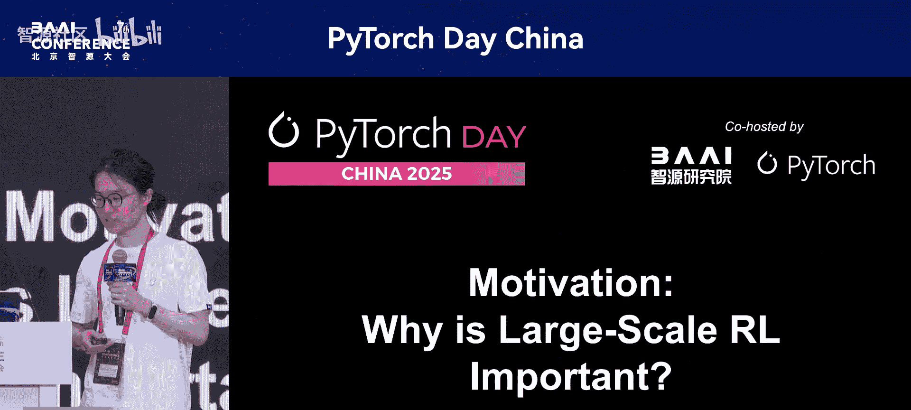

上一节我们介绍了本次分享的主题。本节中，我们来看看构建Verl框架背后的核心动机。一个好的框架应该解决一个重要且具有挑战性的问题。

### 大规模RL为何重要？

首先，大规模强化学习对于提升模型性能至关重要。

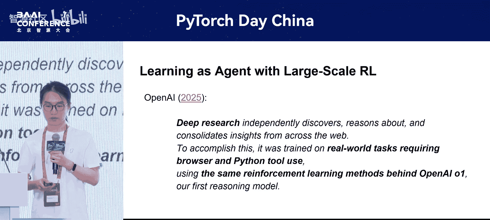

以下是评估结果，展示了无大规模训练与有大规模训练模型的性能对比。可以看到，大规模学习推理能力极大地提升了语言模型的性能。

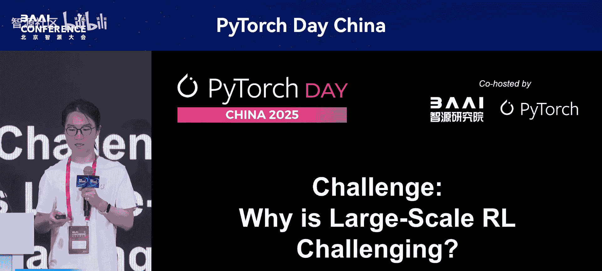

**公式/代码示例：性能对比**
```
模型性能对比：
- 无大规模RL (如GPT-4) << 有大规模RL (如O1, R1)
- 提升领域：数学、科学、代码等推理密集型任务
```

另一个重要应用是智能体任务。一个很好的例子是OpenAI的Deep Research产品。它通过在需要浏览器和Python的真实世界任务上进行训练，并利用其RL方法（如OpenAI O1）实现。这表明大规模RL非常重要。

### 大规模RL为何充满挑战？

大规模RL本身非常复杂，因此我们需要一个专门的框架来应对这些挑战。

第一点，RL本身具有复杂的数据流。下图展示了多种RL算法的数据流，它们非常复杂，包含多个模型（如行动者、评论家、参考模型、奖励模型）、多个阶段（如生成、准备经验、训练）以及多种工作负载（如生成推理、训练）。优化这些工作负载的策略也各不相同。

此外，RL LM工作负载通常是分布式的。下图展示了一个典型的LM工作负载，它通常涉及许多GPU和复杂的并行策略，如数据并行、流水线并行和张量并行。这是我们在RL范式之前就熟悉的工作负载。

结合这两点，我们关注的是RL与大型语言模型的结合。因此，它们实际上是**大规模分布式数据流**。数据流中的每个算子本身就是一个大规模分布式计算工作负载。

这结合了RL数据流的复杂性和分布式工作负载的复杂性，使得问题更加复杂。基于这种形式化，我们还必须考虑数据依赖性和资源限制等约束条件。例如，具有依赖关系的计算必须顺序执行；考虑到资源限制，只有不同GPU上同一阶段的模型可以并行，而同一设备上的模型必须顺序执行。因此，我们必须权衡各种约束，这使得在实现和实践中问题变得非常复杂。

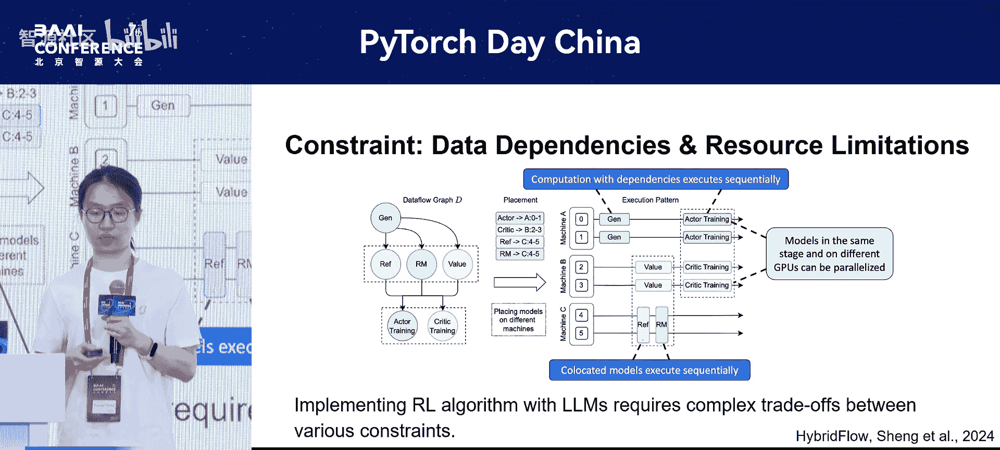

## 核心架构：Verl的灵活性与效率

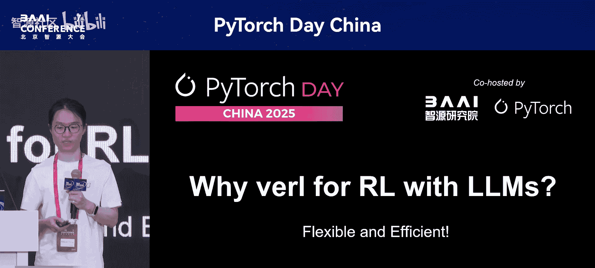

基于上述动机，我们选择Verl用于LLM RL。关键在于，Verl是一个在灵活性和效率之间取得平衡的框架。

### 编程灵活性：基于单控制器范式

Verl在编程上具有灵活性，这基于**单控制器**范式。下图展示了带有K正则化的PPO算法的数据流示例，而在我们框架中，核心逻辑代码实际上只有几行，如右图所示。

**代码示例：核心逻辑**
```python
# Verl 中 PPO 算法的核心逻辑示例（示意）
@verl.hybrid_flow
def ppo_training_loop():
    experiences = actor.generate_rollouts()
    prepared_data = critic.prepare_training_data(experiences)
    actor.update(prepared_data)
    critic.update(prepared_data)
```

这种范式与之前的框架非常不同。凭借这种支持，我们已经实现了用几行代码描述算法核心逻辑的能力。因此，Verl支持多种RL算法，包括PPO、GRPO、RLOO等。

### 运行效率：多控制器与混合引擎

我们通过称为**多控制器**的范式来实现效率，这使得算子间的操作非常高效。这基于多种并行算法的支持（如之前提到的数据并行、流水线并行、张量并行以及序列上下文并行），以及对高效内核的支持（如来自PyTorch生态的Flash Attention 2和`torch.compile`，以及来自开源社区的定制内核）。

我们还支持不同的训练后端，如FSDP。在新版本中，我们也拥抱了FSDP 2。此外，我们还支持Macron后端，这些后端用代码实现起来非常复杂和困难。在生成方面，我们支持VLLM和SGLang等后端。

此外，我们通过称为**混合引擎**的特性来实现效率，这使得算子间的数据流操作非常高效。它主要利用两个特性：
1.  **卸载与重载**：在阶段之间，我们将下一阶段要使用的模型从GPU卸载到CPU甚至硬盘，并在未来需要使用时重新加载，从而充分利用GPU内存。
2.  **重分片**：在阶段之间，我们总是重新分片模型，以启用最优的并行策略。例如，从一个阶段切换到另一个阶段时，将数据并行交换为张量并行，从而为该阶段提供最优的并行方案。

### 活跃的开源社区

最后一点也非常重要：我们拥有一个非常有影响力和包容性的开源社区。截至目前，Verl已获得超过8.4k星标、近1000次复刻、近1000个PR和约200名贡献者。我们也期待您的参与。

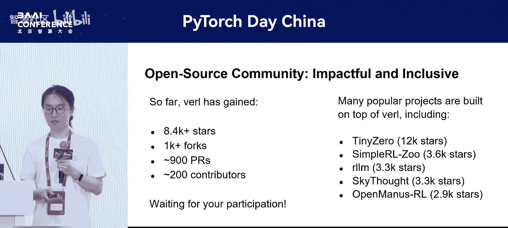

实际上，许多流行项目都建立在Verl之上，包括Tiny-0、Simple-RL-Zoo、RLM和SkySalt。它们也获得了许多星标。

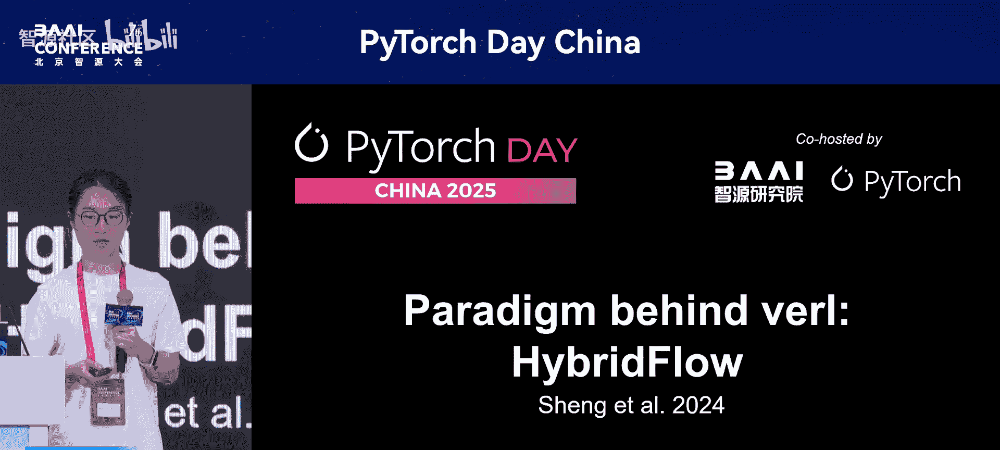

## 深入解析：混合流范式

接下来，我们可以更深入地探讨Verl背后的范式，即**混合流**。这也是一篇被MLSys会议接受的论文。

### 范式背景：单控制器 vs. 多控制器

我们首先需要解释所谓的“范式”：单控制器与多控制器。
*   **单控制器**（也称MPMD范式）：意味着有一个集中式控制器管理所有运行不同程序的Worker。
*   **多控制器**（也称SPMD范式）：意味着每个Worker都有自己的控制器，运行相同的程序但处理不同的数据。

我们在实现分布式框架时面临一个经典的权衡：应该使用单控制器还是多控制器？显然，每种范式都有其优缺点。
*   对于**单控制器**，其优点是通过集中控制实现灵活性，但也引入了来自单一集中控制的通信开销。
*   对于**多控制器**，其优点是通过SPMD通信实现高效，但也使得编程非常复杂，因为逻辑分散在不同的地方。

那么，对于一个分布式框架（例如用于LLM的RL框架），我们应该选择哪种范式？我们的答案是：我们可以两者兼得。因此，我们引入了一种称为**混合控制器**的新范式。混合控制器意味着有一个单控制器控制着多个多控制器组。

在混合控制器中，单控制器管理整体数据流，而数据流中的每个算子实际上都可以扩展为一个多控制器的分布式工作负载。这实现了单控制器的灵活性和多控制器的高效性。

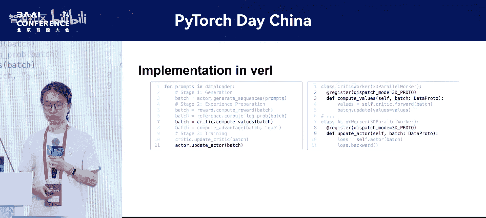

### Verl中的具体实现

在Verl中，单控制器中的每次调用（如`compute_values`或`update_actor`）实际上都是对右侧多控制器Worker组的RPC调用。右侧图中显示的注册装饰器也实际管理着分布式数据传输，这使得多控制器编程更加容易。

右侧图是我们在RL范式之前习惯的常见范式。而在RL的新范式中，我们在左侧引入了新的编程接口，在灵活性和效率之间取得了平衡。

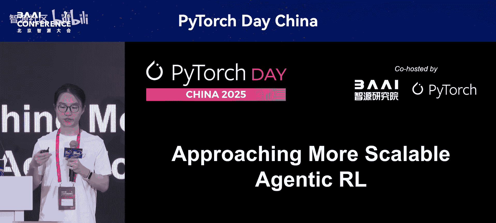

## 进阶特性：迈向更稳定的智能体RL

Verl实际上是一个致力于实现更稳定智能体RL的框架。

以下是新版本Verl展示的一个重要特性。实际上，就在今天早上，我们发布了0.4版本，这是发布的功能之一，称为**用于多轮rollout的异步引擎**。

如果我们使用同步引擎，它同时返回批次中的所有输出，如上图所示，不同轮次之间会有许多“气泡”，这使得rollout效率非常低。一种解决方案是引入异步引擎，它会在每个输出准备就绪时立即返回，这样我们就可以在前一个请求结束后调度下一个rollout。如下图所示，我们可以看到所有气泡都消失了。

此外，我们还支持许多基本能力，例如**多模态**支持（我们可以在数据集中输入带有图像和视频字段的数据），并且支持许多不同的多模态LLM，如Qwen-VL。在我们的模型后端中，我们还为工具调用提供了不同的可扩展接口，例如基础工具类，这也是0.4版本发布的一个重要特性。此外，我们还集成了来自字节跳动的Sandbox-Fusion库。

另一个重要的方向是集成多样化的环境和工具。这主要是进行中的工作，但我们也有一些已准备好的功能，如前面提到的Sandbox-Fusion接口。对于其他功能，我们欢迎讨论和贡献。我们正在进行的RFC包括计划集成MCP，以及集成现有的环境和工具，如来自Byte的K8R、来自North Research的AttributeTrove库，甚至其他环境和工具，我们也非常欢迎。

## 近期更新与未来路线图

最后，我们想介绍一些最近的更新和未来的路线图。最令人兴奋的功能之一是，我们已经正式支持**高效RL与大型MoE模型（如DeepSeek-V3）**。

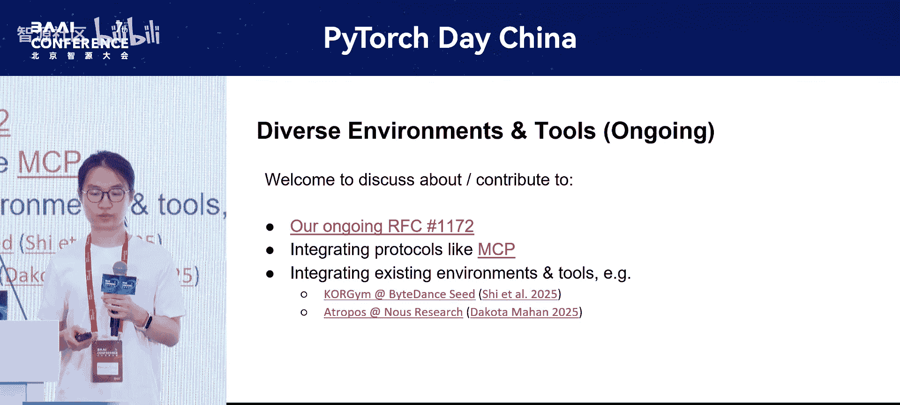

这也是0.4版本发布的最重要功能之一。我们支持以下功能：
*   **训练侧**：支持基于Macron GT模型的MoE模型类。
*   **推理侧**：支持多节点推理，因为大型MoE在大多数情况下无法仅装入一个节点。
*   **混合侧**：为了在我们的RL框架中连接训练和推理，我们还为最新版本的Macron核心和最新版本的推理引擎实现了参数分片管理器。

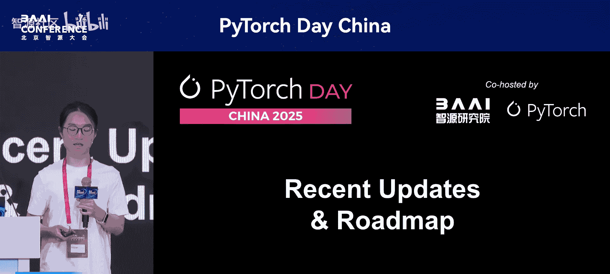

结合这三个不同的功能，我们实现了与大型MoE模型的高效RL。除了DeepSeek-V3，我们还支持Qwen2.5-MoE模型。欢迎在演讲结束后尝试我们关于大型MoE的新功能。

更多细节，您可以查看我们的问题追踪器或0.4版本的发布日志。我们还有其他不同的计划，正在等待开源社区的参与，例如部分rollout（实际上我们有一个来自上海交通大学的草案PR）。我们还希望实现MP预测，以加速rollout阶段。

关于重要功能的最新及时更新，请密切关注我们README文件中的Verl路线图。

## 总结与问答

本节课中，我们一起学习了Verl框架。我们探讨了构建大规模LLM RL框架的必要性与挑战，深入了解了Verl如何通过**混合控制器**范式在编程**灵活性**与运行**效率**之间取得平衡。我们还介绍了其面向智能体任务的新特性，如异步引擎和多模态支持，并展望了其对大型MoE模型的支持及未来发展方向。

感谢聆听。欢迎加入Verl社区，与优秀的开源社区一起讨论和贡献。我们的仓库在GitHub上完全开源。如有进一步问题，可以通过我的邮箱联系。我们也在招聘，您可以联系我们的部门负责人林海斌。

这里有两个我们开源社区的二维码。

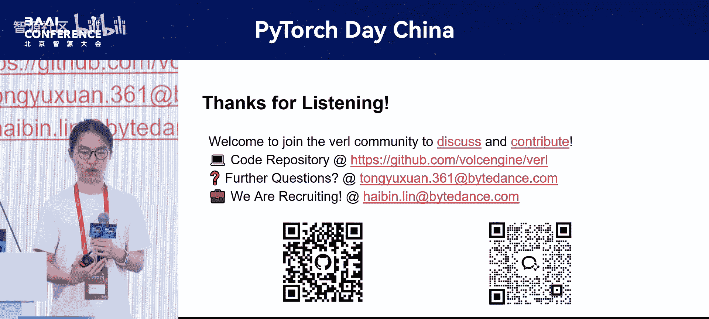

以上就是我今天要展示的全部内容。谢谢。

---

**Q&A环节**

**提问者**：对于想要训练模型的人来说，如何选择这些训练框架？能否请您评论一下其他进行强化学习的框架，以便我们更好地了解？非常感谢。

**回答**：谢谢您的问题。这是一个非常重要但也非常棘手的问题。

首先，对于您提到的框架，如LLaMA-Factory、LLaMA-Recipes等，它们主要支持SFT（监督微调）而不是RL。实际上，对于RL，我们也有非常出色且兼容的框架，如OpenRL和NVIDIA的Nemo-RL，以及Quan的RL和Research的ARL。每个框架都有其自身的优缺点，很难说哪个框架绝对优于其他。

也许我可以简要解释一下Verl支持得更好的一些重要特性。我认为我们的主要优势在于两点：
1.  我认为我们是**唯一**支持与大型MoE模型（如DeepSeek-V3和Qwen2.5-MoE）进行高效RL的框架。
2.  我们是拥有**最佳开源社区参与度和可扩展性支持**的框架，也得到了字节跳动和火山引擎团队的支持。因此，我们实际上获得了来自不同参与的许多支持。通过这种方式，我们对于不同功能（如LoRA）或不同硬件支持（如Rocm）具有最佳的灵活性或可用性，这在其他框架中很少见。

因此，如果您想使用这些功能，Verl可能是您工作负载的最佳选择。除此之外，我们还是一个积极致力于智能体任务的框架，例如我们将在下一阶段支持更好的异步架构支持和工具调用实用程序。所以，您也可以期待我们在智能体方面的支持。

希望我已回答了您的问题。