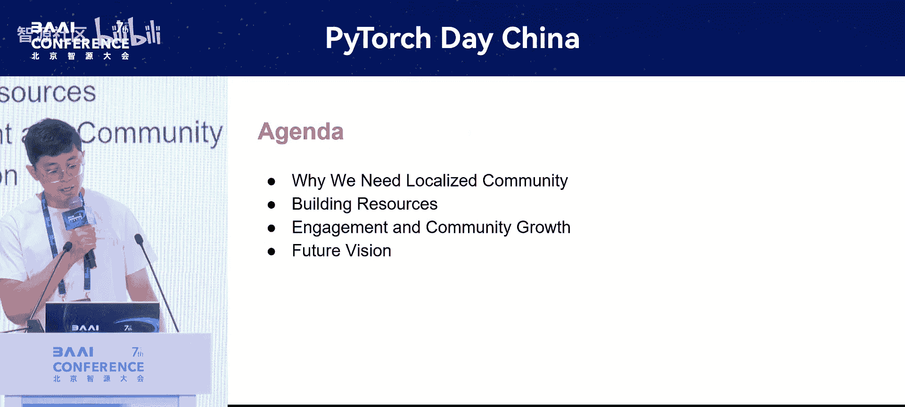
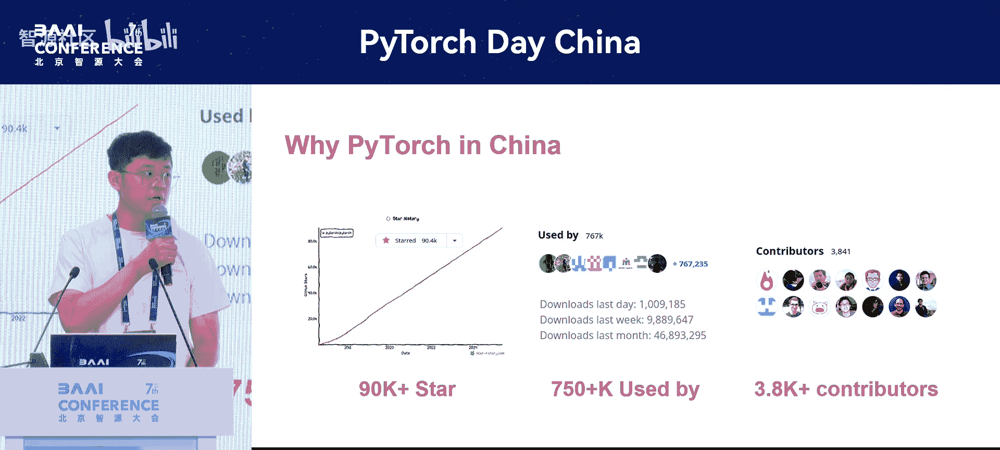
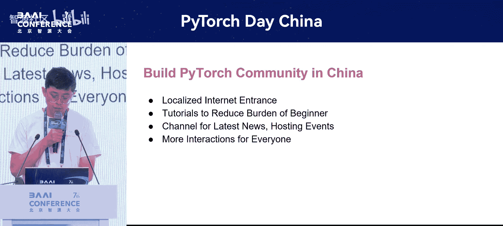
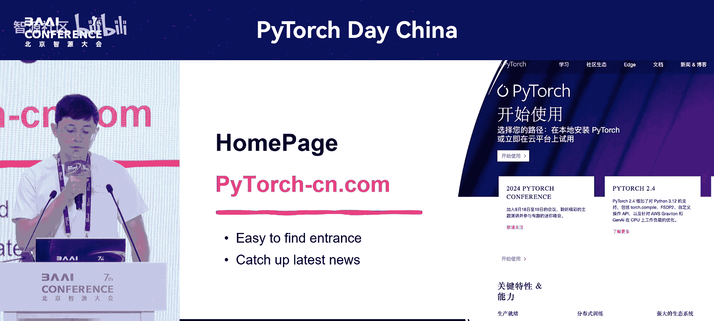
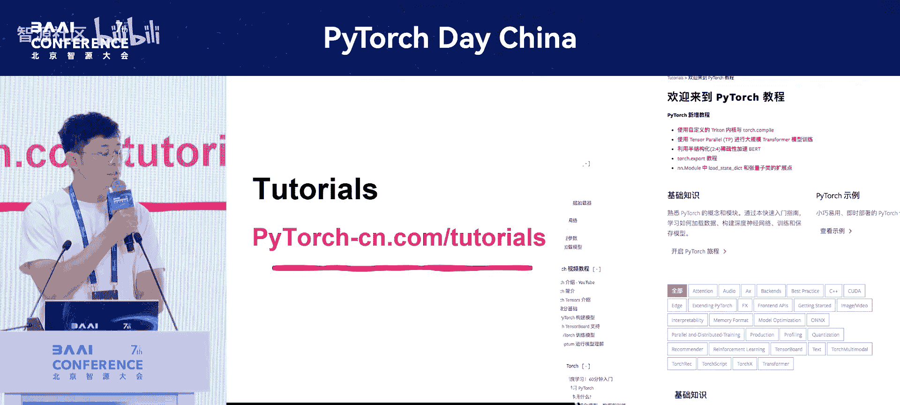
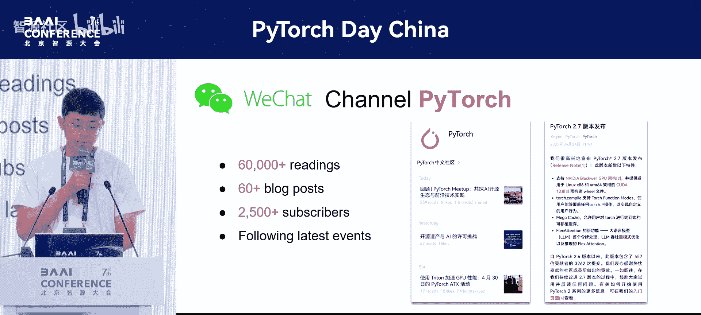
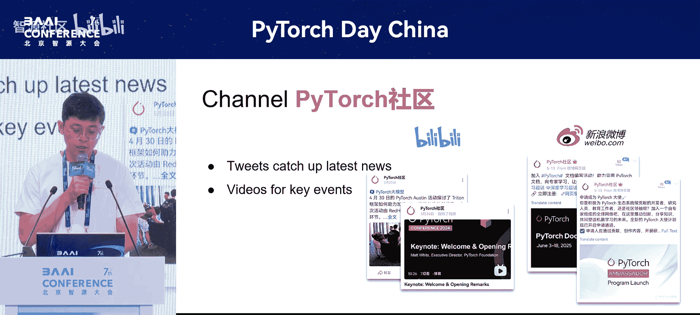
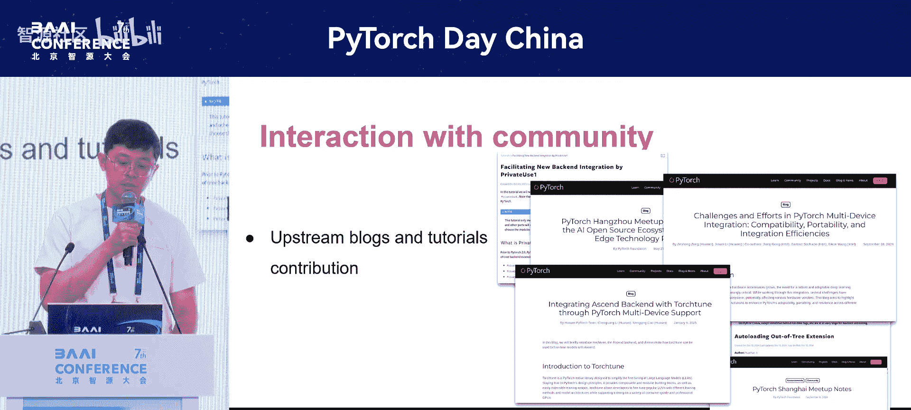
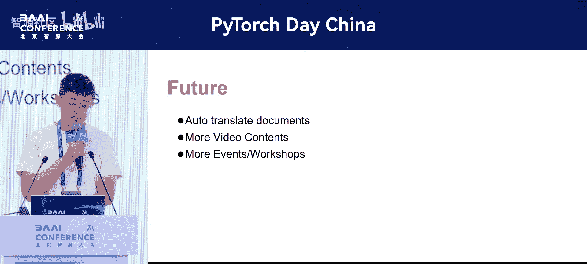

# PyTorch-Day-China-p05-PyTorch-in-China--Community-Growth,-Localization,-and-Interaction：Zesheng-Zong

在本节课中，我们将学习PyTorch在中国社区的本地化建设、资源提供以及未来愿景。我们将了解为何需要建立本地化社区，当前可用的资源，以及如何参与其中。

---

## 概述

PyTorch已成为全球最受欢迎的AI框架之一。对于刚加入AI社区的开发者或初学者而言，PyTorch通常是构建项目的首选工具。目前，PyTorch在GitHub上已获得超过9万颗星，更重要的是，有超过75万个项目基于PyTorch构建。这表明全球存在一个庞大且活跃的社区。PyTorch始终保持开放，无论您是专家还是初学者，都能找到为社区做贡献的方式。目前，已有超过380名贡献者积极修改核心库代码。根据统计，来自中国的贡献者数量在全球位居第二。

上一节我们介绍了PyTorch社区的全球影响力，本节中我们来看看中国用户面临的具体挑战。

## 本地化需求与挑战

当我首次接触PyTorch时，发现庞大的用户群体与本地化材料之间存在巨大鸿沟。如果您是AI领域的初学者，可能会被大量的专业术语和教程所淹没，不得不在翻译工具间疲于奔命。

为了解决这一问题，我们首先尝试寻找更好的翻译方式，并为社区建立一个门户网站。

以下是我们的初步工作：
*   翻译官方网站的所有内容，让每个人都知道这是进入社区的入口点。
*   在门户网站上整合所有资源和活动信息。

## 本地化资源建设

除了建立门户网站，我们还翻译了超过80页的教程，涵盖从入门到中高级的各个层次，旨在帮助用户成为社区的用户或贡献者。

目前，我们正在尝试引入自动化工作流，并利用大语言模型（LLM）来提升翻译速度，以便为社区用户同步更多有价值、高质量的教程内容。

上一节我们介绍了静态资源的本地化工作，本节中我们来看看如何与用户进行更积极的互动。

## 社区互动与活动

除了静态资源，我们还希望积极与用户互动。因此，从去年年底开始，我们创建了微信公众号。

我们通过发布超过660篇技术AI博客文章与用户保持联系。目前，公众号已获得超过6万次阅读和2.5万名订阅者。如果您想了解最新新闻和技术趋势，可以订阅我们的频道，我们每周都会发布社区动态。

除了内容发布，我们还希望用户能积极讨论他们正在使用的PyTorch技术。因此，我们在中国最大的活跃讨论平台——知乎上开设了频道。

在过去两个月里，知乎频道获得了1.5万次阅读和超过50篇博客文章。上个月，我们在杭州举办了首次直播活动，获得了超过5000次观看。

如果您关注视频内容和全球活动，我们目前正致力于将更多的线下聚会、会议和教程视频内容转移到我们的新平台Bilibili上。目前B站已有近20个视频内容，在过去两周内获得了近2000次播放。也请订阅我们的B站频道，以便了解社区最新动态。

除了线上资源，我们也希望举办一些线下面对面聚会。去年我们在上海举办了一场聚会，邀请了来自英特尔和华为的高级开发者，介绍他们在PyTorch编译、Inductor以及多硬件集成方面的工作经验。

今年的活动规模更大，我们还邀请了来自腾讯和蚂蚁集团的开发者，介绍他们在更广泛AI技术领域的经验，例如参数高效微调（PEFT）和使用RA的并行训练。

## 反馈与未来愿景

除了将社区资源本地化，我们也希望将本地开发者的工作反馈给官方社区。我们尝试将本地开发者的工作和经验整理成教程，提交给官方社区，让全球关注该领域的开发者了解我们在中国所做的工作。

我们下一步的计划是让翻译工作更加自动化、高效，并为每个人带来更多高质量的文档和视频资源。在接下来的几个月里，还将举办更多活动。

如果您对我们的所有资源感兴趣，请访问我们的网站或加入我们的频道留言，帮助我们让社区变得更好。

---

## 总结

本节课中我们一起学习了PyTorch中国社区的本地化建设历程。我们了解了建立本地化社区的必要性，当前提供的丰富资源（包括翻译文档、教程、微信公众号、知乎频道、B站视频和线下活动），以及如何参与社区贡献。未来，社区将继续致力于自动化翻译、引入高质量资源并举办更多活动，以更好地服务中国开发者。